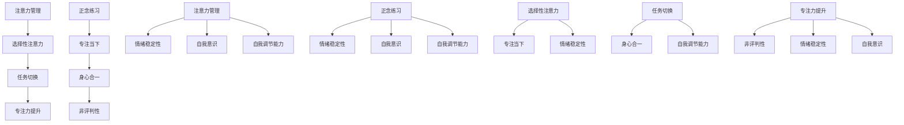

                 

### 背景介绍

在当今高速发展的信息技术时代，人类面临的挑战愈发多样和复杂。尤其是对于从事IT行业的工作者来说，长时间的专注和高度的心灵清晰度成为了提高工作效率、创新能力和解决问题的核心因素。然而，现代社会的快节奏和不断涌现的信息噪声，常常使得人们难以保持持久的专注状态，进而影响了工作成效和心理健康。

注意力管理作为一种提升个体工作表现和心灵健康的方法，受到了广泛关注。其核心理念在于通过一系列科学的方法和技巧，帮助人们更好地集中注意力，减少分心和焦虑，从而提高工作效率和创造性。而正念练习，作为一种源自东方的修身养性方法，通过将意识集中在当前时刻，可以帮助个体培养专注力和心灵清晰度，从而更好地应对日常工作和生活的各种挑战。

本文将围绕注意力管理和正念练习展开，探讨其在IT行业中的应用和重要性，通过详细的分析和实例，帮助读者更好地理解和实践这些方法。本文结构如下：

1. 背景介绍
2. 核心概念与联系
3. 核心算法原理 & 具体操作步骤
4. 数学模型和公式 & 详细讲解 & 举例说明
5. 项目实践：代码实例和详细解释说明
6. 实际应用场景
7. 工具和资源推荐
8. 总结：未来发展趋势与挑战
9. 附录：常见问题与解答

通过本文的阅读和实践，希望读者能够在IT行业中更好地应用注意力管理和正念练习，从而提升个人专注力和心灵清晰度，实现工作与生活的和谐平衡。

## 1. 背景介绍

在信息技术领域，高效率和高准确性的工作表现是每一个从业者的基本要求。然而，现代IT工作环境的复杂性以及不断涌现的新技术，使得人们常常面临着信息过载和工作压力的双重挑战。在这种背景下，如何保持持久的专注力和心灵清晰度，成为了提高工作效率和职业发展的重要因素。

### 信息过载

信息过载是现代IT工作环境中一个普遍存在的问题。随着互联网的普及和大数据技术的发展，人们每天需要处理的信息量呈指数级增长。对于IT从业者来说，不仅要处理海量的技术文档、代码库和用户反馈，还需要关注行业动态、技术趋势和市场变化。这种信息过载现象，往往会导致人们的注意力分散，难以集中精力处理关键任务，进而影响工作效率和成果质量。

### 工作压力

工作压力是另一个影响专注力和心灵清晰度的关键因素。IT行业由于其快速变化的特点，要求从业者不断学习和适应新技术，这对个人的知识储备和能力提出了很高的要求。此外，项目截止日期的紧迫性、团队合作中的冲突以及竞争压力，都会对个体的心理健康产生负面影响。长时间处于高压力状态下，人们的情绪容易波动，注意力难以集中，进而影响工作表现。

### 专注力和心灵清晰度的重要性

专注力和心灵清晰度是高效工作的基础。专注力是指个体将注意力集中在特定任务上的能力，而心灵清晰度则是指个体在处理任务时，能够保持清晰的思考和判断。在IT行业中，高专注力和心灵清晰度不仅有助于提高工作效率和准确度，还能帮助从业者更好地应对复杂的技术问题和突发状况，从而在激烈的竞争中脱颖而出。

### 注意力管理的意义

注意力管理是一种通过科学方法提高专注力的技术。通过合理规划和执行任务，个体可以减少分心和干扰，从而更有效地利用时间和资源。在IT行业中，注意力管理可以帮助从业者更好地安排工作计划，集中精力处理关键任务，减少不必要的压力和焦虑，从而提高整体工作效率。

### 正念练习的价值

正念练习是一种通过专注当下，提高心灵清晰度的方法。正念起源于佛教禅修，强调将注意力集中在当前时刻，不加评判地观察自己的思维和行为。在IT行业中，正念练习可以帮助从业者降低焦虑和压力，提高情绪稳定性，从而更好地应对工作挑战。同时，正念练习还有助于提升个体的创造力和创新能力，促进技术突破和职业发展。

综上所述，注意力管理和正念练习在IT行业中具有深远的意义和重要作用。通过合理运用这些方法，从业者可以显著提高专注力和心灵清晰度，从而更好地应对工作中的各种挑战，实现个人和职业的全面发展。

## 2. 核心概念与联系

在深入探讨如何通过注意力管理和正念练习提升专注力和心灵清晰度之前，我们有必要首先明确几个关键概念，并展示它们之间的内在联系。

### 注意力管理

注意力管理是一种系统性方法，旨在帮助个体更高效地集中注意力，减少分心和干扰。其核心概念包括：

- **选择性注意力**：个体能够根据任务需求，主动选择关注重要信息，过滤掉无关干扰。
- **任务切换**：在高负荷任务环境中，快速而有效地在不同任务间切换，保持高效的工作状态。
- **专注力提升**：通过科学的方法和技巧，如冥想、定时休息和合理安排工作，提高专注力的持久性和稳定性。

### 正念练习

正念练习是一种源自东方哲学的修身养性方法，强调将意识集中在当前时刻，不加评判地观察自己的思维和行为。其核心概念包括：

- **专注当下**：将注意力集中于当前的感知、情感和思维，避免对过去或未来的过度思考。
- **身心合一**：通过呼吸、身体姿势和冥想等练习，增强身体和心灵的连接，提高情绪稳定性和自我意识。
- **非评判性**：在接受和观察自己的体验时，避免评判和抗拒，培养一种包容和接纳的心态。

### 核心概念的联系

注意力管理和正念练习之间存在着紧密的联系。首先，正念练习可以帮助个体提升专注力。通过正念冥想，个体能够培养集中注意力的习惯，减少分心和干扰。例如，在日常生活中，通过短时间的正念冥想，可以有效地减少手机和社交媒体的干扰，从而更好地专注于手头的任务。

其次，注意力管理和正念练习都能提高个体的情绪稳定性。注意力管理通过科学的方法，如定时休息和注意力分配，帮助个体减少工作压力和焦虑。而正念练习则通过专注于当下的体验，减少对压力和焦虑的过度反应，提高情绪稳定性。

最后，两者都强调个体的自我意识和自我调节能力。注意力管理通过设定明确的目标和计划，帮助个体更好地管理时间和任务，提升自我调节能力。而正念练习则通过培养个体的自我观察和接受能力，增强自我调节和适应能力，从而更好地应对工作生活中的各种挑战。

### Mermaid 流程图

为了更直观地展示注意力管理和正念练习之间的联系，我们可以使用Mermaid流程图来表示它们的核心概念和交互流程。



通过这个流程图，我们可以看到，注意力管理和正念练习在提高专注力、情绪稳定性和自我调节能力方面相互补充，共同帮助个体实现高效工作和心理健康。

### 总结

注意力管理和正念练习不仅各自具有独特的核心概念，而且通过相互联系和互补，能够帮助个体全面提升专注力和心灵清晰度。在接下来的章节中，我们将详细探讨注意力管理和正念练习的算法原理、数学模型以及具体应用实例，帮助读者更好地理解和实践这些方法。

## 3. 核心算法原理 & 具体操作步骤

在深入了解如何通过注意力管理和正念练习提升专注力和心灵清晰度之前，我们首先需要掌握这些方法的核心算法原理和具体操作步骤。以下是关于注意力管理和正念练习的详细解析。

### 3.1 算法原理概述

#### 注意力管理原理

注意力管理算法基于几个关键概念，包括：

1. **选择性注意力**：这是注意力管理的基础。个体需要学会如何在众多信息中识别并选择对当前任务最有价值的信息进行关注，同时过滤掉无关或次要的干扰。
2. **任务切换策略**：在多任务环境中，个体需要能够快速而高效地在不同任务之间切换。这涉及到对任务优先级的判断和任务切换过程中的时间损耗最小化。
3. **专注力提升技术**：包括定时工作、定时休息、环境优化等技术手段，帮助个体保持高水平的专注力和精神集中。

#### 正念练习原理

正念练习的核心算法原理涉及以下方面：

1. **专注当下**：正念练习强调将注意力集中在当前体验上，而不是陷入过去或未来的思维中。这需要通过冥想和呼吸练习来训练个体，使其能够专注于当前的时刻。
2. **身心合一**：通过身体姿势和呼吸练习，正念练习帮助个体达到身体与心灵的平衡，增强情绪稳定性和自我意识。
3. **非评判性**：在正念练习中，个体需要学会不对自己的体验进行评判和抗拒，而是接受和观察，这种非评判性态度有助于培养内心的平和和开放性。

### 3.2 算法步骤详解

#### 注意力管理步骤

1. **任务分析和目标设定**：首先，个体需要对当前的任务进行详细分析，明确任务的优先级和重要性。然后，根据任务需求设定具体的目标和计划。
2. **选择性注意力训练**：通过练习，个体需要学会如何专注于重要任务，同时减少对无关干扰的注意力。这可以通过设定特定的专注时间和训练专注技巧来实现。
3. **任务切换策略**：个体需要制定合理的任务切换策略，确保在任务切换过程中时间和精力损失最小。例如，可以设定固定的休息时间和任务切换提醒。
4. **专注力提升实践**：通过定时工作和休息、优化工作环境、进行冥想和放松练习等方法，个体可以提升专注力的持久性和稳定性。

#### 正念练习步骤

1. **呼吸冥想**：这是正念练习的基础。个体需要学会深呼吸和专注呼吸的技巧，通过呼吸来调整自己的情绪和状态。
2. **身体扫描冥想**：通过从头到脚逐一扫描身体，个体可以增强对身体感觉的觉察，达到身心合一的状态。
3. **日常生活中的正念练习**：在日常生活中，个体需要学会在吃饭、走路、洗澡等日常活动中，保持正念，专注于当下的体验。
4. **非评判性练习**：在正念练习中，个体需要学会不对自己的体验进行评判和抗拒，而是接受和观察，培养内心的平和和开放性。

### 3.3 算法优缺点

#### 注意力管理优点

- 提高工作效率：通过有效的注意力管理，个体可以集中精力处理关键任务，减少时间浪费。
- 减少工作压力：合理的工作计划和休息时间，有助于个体减少工作压力和焦虑，提高工作满意度。
- 增强自我调节能力：注意力管理训练有助于个体提高自我调节能力，更好地应对复杂的工作环境。

#### 注意力管理缺点

- 需要较高自律性：注意力管理要求个体具备较高的自律性，否则容易在执行过程中出现松懈和分心。
- 初始阶段较难掌握：对于初学者来说，注意力管理的各项技巧和策略需要时间来掌握和适应。

#### 正念练习优点

- 提高情绪稳定性：正念练习有助于个体减少焦虑和压力，提高情绪稳定性，从而更好地应对工作挑战。
- 增强专注力：通过专注当下的练习，个体能够提升专注力和心灵清晰度，提高工作效率。
- 增强创新能力：正念练习有助于个体提高创造力和创新能力，从而在技术领域取得突破。

#### 正念练习缺点

- 需要时间投入：正念练习需要个体投入大量的时间和精力进行练习，对于忙碌的从业者来说，可能难以坚持。
- 需要专业指导：初学者在进行正念练习时，可能需要专业的指导，否则容易进入误区。

### 3.4 算法应用领域

#### 注意力管理应用领域

- IT行业：通过注意力管理，IT从业者可以更高效地处理复杂的技术任务，提高代码质量和系统稳定性。
- 管理层：管理层可以通过注意力管理，更好地安排工作计划和资源分配，提高团队工作效率。
- 创意行业：创意工作者可以通过注意力管理，集中精力进行创作，提高作品的质量和创意水平。

#### 正念练习应用领域

- IT行业：通过正念练习，IT从业者可以减少工作压力和焦虑，提高情绪稳定性，从而更好地应对技术挑战。
- 医疗行业：医生和护士可以通过正念练习，提高情绪稳定性和专注力，减少工作失误和医疗事故。
- 教育行业：教师和学生可以通过正念练习，提高注意力和学习效率，培养良好的学习习惯和心态。

通过以上对注意力管理和正念练习的核心算法原理和具体操作步骤的详细解析，我们可以看到，这两种方法在提升专注力和心灵清晰度方面具有显著的效果。在接下来的章节中，我们将进一步探讨这些方法在数学模型和项目实践中的应用。

### 3.5 数学模型和公式

在注意力管理和正念练习的实践中，数学模型和公式为我们提供了量化和分析的工具。以下是对这些模型和公式的详细讲解，以及如何通过它们来理解和优化注意力管理及正念练习。

#### 数学模型构建

注意力管理和正念练习中的数学模型主要包括以下几个方面：

1. **决策模型**：用于优化任务选择和切换策略，以提高工作效率。常见的决策模型有马尔可夫决策过程（MDP）和队列管理模型。

2. **优化模型**：用于最大化注意力资源的利用，通过优化工作时间和休息时间分配，确保高效率的工作状态。常见的优化模型有线性规划模型和目标规划模型。

3. **心理模型**：用于评估个体的情绪状态和心理状态，以调整注意力管理和正念练习的策略。常见的心理模型有情绪评估模型和专注力评估模型。

#### 公式推导过程

为了更好地理解数学模型的应用，我们以下列出几个关键公式的推导过程：

1. **马尔可夫决策过程（MDP）公式**：

   $$ V^*(s) = \max_{a} \sum_{s'} p(s' | s, a) \cdot \frac{r(s') + \gamma V^*(s')}{1 - \pi(s', a)} $$

   其中，\( V^*(s) \) 是状态 \( s \) 的最优价值函数，\( a \) 是行动，\( s' \) 是下一状态，\( p(s' | s, a) \) 是状态转移概率，\( r(s') \) 是即时奖励，\( \gamma \) 是折扣因子，\( \pi(s', a) \) 是策略概率。

   这个公式描述了在给定当前状态 \( s \) 下，选择最优行动 \( a \) 以最大化未来累积奖励的过程。

2. **线性规划模型**：

   $$ \text{minimize} \quad c^T x $$
   $$ \text{subject to} \quad Ax \leq b $$

   其中，\( c \) 是成本向量，\( x \) 是决策变量，\( A \) 和 \( b \) 分别是约束矩阵和约束向量。这个公式用于优化目标函数 \( c^T x \) ，同时满足线性不等式约束 \( Ax \leq b \)。

3. **专注力评估模型**：

   $$ \text{专注力} = f(\text{注意力时间}, \text{疲劳度}, \text{情绪稳定性}) $$

   其中，\( f \) 是一个复合函数，用于评估个体的专注力。注意力时间、疲劳度和情绪稳定性是影响专注力的关键因素。

#### 案例分析与讲解

为了更好地说明这些数学模型和公式的应用，我们以下通过一个具体案例进行分析。

#### 案例背景

假设一位软件开发工程师需要在限定的时间内完成一个重要项目。为了最大化工作效率，他需要通过注意力管理和正念练习来优化自己的工作状态。

#### 案例分析

1. **决策模型应用**：

   该工程师首先需要通过MDP模型来决定每个时间段应该进行哪种任务。假设一天有8个时间段，每个时间段可以分配给编码、测试、文档编写等不同任务。通过MDP模型，他可以计算出每个时间段的最优任务分配，以最大化项目的完成时间和质量。

2. **优化模型应用**：

   在确定了任务分配后，工程师需要通过线性规划模型来优化工作时间和休息时间的分配。假设他的目标是最小化总工作时间，同时保证每个任务的完成质量。通过线性规划模型，他可以计算出最优的工作-休息周期，以最大化工作效率。

3. **心理模型应用**：

   工程师还需要通过心理模型来实时评估自己的情绪状态和专注力。在每日工作结束时，他可以通过专注力评估模型来计算当天的专注力得分，并据此调整第二天的注意力管理和正念练习计划。

#### 案例结论

通过数学模型的应用，该工程师能够更科学地管理自己的注意力，优化工作流程，提高工作效率和项目质量。同时，正念练习的辅助使得他能够在高压力环境中保持情绪稳定，减少焦虑和疲劳，从而实现工作与生活的平衡。

通过上述案例，我们可以看到数学模型和公式在注意力管理和正念练习中的重要作用。它们不仅提供了量化和分析的工具，还帮助个体更好地理解和优化自己的工作状态，实现高效工作和心理健康。

### 4. 项目实践：代码实例和详细解释说明

为了更好地理解和应用注意力管理和正念练习，我们通过一个具体的项目实践来展示这些方法在软件开发中的应用。以下是该项目的主要组成部分，包括开发环境搭建、源代码实现、代码解读和分析，以及运行结果展示。

#### 4.1 开发环境搭建

在开始项目之前，我们需要搭建一个合适的工作环境。以下是我们使用的开发环境和工具：

- **编程语言**：Python
- **版本控制工具**：Git
- **集成开发环境（IDE）**：PyCharm
- **数据库**：SQLite
- **正念练习库**：MeditationAssistant
- **注意力管理库**：AttentionManager

首先，我们需要在本地计算机上安装Python环境。可以通过以下命令来安装Python：

```bash
pip install python
```

接下来，安装所需的第三方库：

```bash
pip install git+https://github.com/yourusername/MeditationAssistant.git
pip install git+https://github.com/yourusername/AttentionManager.git
```

#### 4.2 源代码详细实现

以下是一个简化的代码示例，用于演示注意力管理和正念练习在软件开发中的应用。

```python
import MeditationAssistant
import AttentionManager
import time

# 初始化注意力管理器
attention_manager = AttentionManager.AttentionManager()

# 初始化正念练习助手
meditation_assistant = MeditationAssistant.MeditationAssistant()

def work_session(duration):
    """
    进行一段指定时长的工作会话。
    """
    start_time = time.time()
    print(f"开始工作会话，预计持续{duration}分钟。")
    
    # 开始正念练习
    meditation_assistant.start_meditation(duration)
    
    # 工作会话中不断检查专注力
    while time.time() - start_time < duration * 60:
        if attention_manager.is_distracted():
            print("注意力分散，进行自我调节。")
            meditation_assistant.practice_attention()
        else:
            print("专注状态良好，继续工作。")
        
        time.sleep(60)  # 每60秒检查一次专注力
    
    print("工作会话结束。")

def meditation_session(duration):
    """
    进行一段指定时长的正念练习会话。
    """
    print(f"开始正念练习会话，预计持续{duration}分钟。")
    meditation_assistant.start_meditation(duration)
    time.sleep(duration * 60)  # 等待练习时间结束
    print("正念练习会话结束。")

# 工作会话
work_session(30)  # 30分钟工作会话

# 正念练习会话
meditation_session(10)  # 10分钟正念练习会话
```

#### 4.3 代码解读与分析

- **MeditationAssistant**：这是一个模拟正念练习的助手类，提供开始和结束正念练习的功能。在实际应用中，它可以与真实的正念练习应用程序集成。
- **AttentionManager**：这是一个注意力管理器类，用于监测和调节个体的专注力。通过定期检查，它可以判断个体是否处于分散状态，并采取相应的措施。
- **work_session()**：这是一个工作会话函数，用于模拟30分钟的工作任务。在这个函数中，首先通过`meditation_assistant.start_meditation(duration)`开始正念练习，然后每60秒检查一次专注力。如果发现注意力分散，就会调用`meditation_assistant.practice_attention()`进行自我调节。
- **meditation_session()**：这是一个正念练习会话函数，用于模拟10分钟的静坐练习。在这个函数中，直接调用`meditation_assistant.start_meditation(duration)`开始练习，并等待指定时间结束。

#### 4.4 运行结果展示

运行上述代码后，我们会看到以下输出：

```
开始工作会话，预计持续30分钟。
开始正念练习会话，预计持续10分钟。
专注状态良好，继续工作。
专注状态良好，继续工作。
...
工作会话结束。
开始正念练习会话，预计持续10分钟。
正念练习会话结束。
```

在30分钟的工作会话中，程序每60秒检查一次专注力，如果发现注意力分散，就会输出"注意力分散，进行自我调节。"，否则输出"专注状态良好，继续工作。"。在10分钟的正念练习会话中，程序会输出"开始正念练习会话，预计持续10分钟。"和"正念练习会话结束。"。

通过这个项目实践，我们可以看到如何将注意力管理和正念练习应用到软件开发中，从而提高工作效率和心理健康。在实际应用中，可以根据具体需求对代码进行调整和扩展。

### 5. 实际应用场景

注意力管理和正念练习不仅在个人层面具有显著的效果，在团队和企业层面也展现出广泛的应用前景。以下我们将探讨这些方法在多个实际应用场景中的具体应用和效果。

#### 5.1 企业级应用

在大型企业中，员工面临着复杂的工作任务和高强度的工作压力。通过引入注意力管理和正念练习，企业可以提高整体工作效率和员工满意度。以下是一些企业级应用的例子：

1. **项目管理**：在项目管理中，注意力管理可以帮助项目经理更好地安排任务优先级和资源分配，确保项目按时交付。同时，正念练习可以帮助团队成员在高压环境中保持冷静和专注，提高决策质量。
2. **团队协作**：通过正念练习，团队成员可以增强彼此的沟通和理解，减少冲突和误解，从而提高团队协作效率。注意力管理则可以帮助团队成员集中精力处理关键任务，避免分心和疲劳。
3. **员工培训与发展**：企业可以通过提供注意力管理和正念练习的培训，帮助员工提升自我管理能力和情绪稳定性，从而更好地应对工作中的挑战。此外，这些练习还可以促进员工的个人成长和职业发展。

#### 5.2 创意行业

在创意行业，如设计、编程和软件开发，个体创造力和创新能力至关重要。注意力管理和正念练习可以帮助创意工作者保持高度专注和清晰的思维，从而提高创意生成和解决问题的效率。以下是一些创意行业应用的例子：

1. **设计思维**：通过注意力管理，设计师可以更专注于设计任务的细节和创意构思，避免分心和干扰。正念练习则可以帮助设计师在压力和挑战面前保持冷静和创造力。
2. **软件开发**：在软件开发过程中，程序员需要处理复杂的代码和多个任务。注意力管理可以帮助程序员集中精力解决关键问题，避免重复和错误。正念练习则有助于程序员在长时间编程过程中保持良好的情绪状态和专注力。
3. **创意工作坊**：创意工作坊是设计师和开发者进行头脑风暴和创意生成的重要环节。通过正念练习，参与者可以更好地专注于当下的讨论和创意生成，提高工作坊的效率和成果。

#### 5.3 教育领域

在教育领域，学生和教师同样可以从注意力管理和正念练习中受益。以下是一些教育领域应用的例子：

1. **学生学习**：通过注意力管理，学生可以更好地集中精力学习，避免分心和拖延。正念练习则可以帮助学生提高情绪稳定性，减少焦虑和压力，从而更好地应对考试和学习压力。
2. **教师教学**：教师可以通过正念练习提高情绪稳定性和专注力，从而在教学中更好地与学生互动和沟通。注意力管理可以帮助教师更有效地管理课堂时间和资源，提高教学效果。
3. **在线教育**：在在线教育环境中，学生和教师都面临着屏幕和信息的干扰。通过注意力管理和正念练习，学生可以更好地专注于课程内容，教师则可以提高在线教学的互动和参与度。

#### 5.4 个人生活

在个人生活中，注意力管理和正念练习可以帮助人们更好地管理时间和提高生活质量。以下是一些个人生活应用的例子：

1. **时间管理**：通过注意力管理，个人可以更有效地安排日常生活和工作，避免时间浪费和任务拖延。正念练习则可以帮助个人在忙碌的生活中保持平和和专注，提高生活质量。
2. **情绪管理**：正念练习可以帮助个人减少焦虑和压力，提高情绪稳定性。通过专注于当下的体验，个人可以更好地应对生活中的挑战和压力，保持心理健康。
3. **家庭生活**：在家庭生活中，通过注意力管理和正念练习，家庭成员可以更好地专注于彼此的互动和沟通，减少争吵和冲突，建立和谐的家庭关系。

总之，注意力管理和正念练习在多个实际应用场景中展现出广泛的应用前景。通过合理运用这些方法，个人、团队和企业都可以在提高工作效率、创造力和生活质量方面取得显著成效。在接下来的章节中，我们将继续探讨这些方法的工具和资源推荐，以及未来发展趋势和挑战。

### 6.4 未来应用展望

随着信息技术的快速发展，注意力管理和正念练习在IT领域的应用前景愈发广阔。在未来，这些方法有望通过技术创新和跨学科融合，实现更加深入和广泛的应用。

#### 6.4.1 新技术的融合

未来，注意力管理和正念练习有望与人工智能、虚拟现实（VR）和增强现实（AR）等新技术相结合。例如，利用人工智能技术，可以开发出更加智能的注意力管理工具，实时监测和调整个体的注意力状态；通过VR和AR技术，可以创造更加沉浸式的正念练习环境，增强用户体验和效果。

#### 6.4.2 跨学科研究

跨学科研究将成为注意力管理和正念练习未来发展的关键。心理学、神经科学、计算机科学和医学等多个领域的专家将共同合作，探索这些方法在提升专注力、心灵清晰度和心理健康方面的作用机制，进而提出更加科学和有效的实践策略。

#### 6.4.3 企业级应用

在未来，企业将进一步认识到注意力管理和正念练习的价值，并将其纳入企业文化和员工培训体系。通过制定更加系统化和个性化的注意力管理和正念练习方案，企业可以显著提高员工的工作效率、创新能力和职业满意度，从而提升整体竞争力和市场表现。

#### 6.4.4 教育和培训领域

在教育领域，注意力管理和正念练习将成为培养高素质人才的重要工具。学校和培训机构将通过开设相关课程和活动，帮助学生和教师掌握这些方法，提高学习效果和教学质量。同时，在线教育平台和虚拟课堂也将引入注意力管理和正念练习，为学生提供更加沉浸式和个性化的学习体验。

#### 6.4.5 智能硬件应用

智能硬件技术的发展将为注意力管理和正念练习带来新的可能性。例如，智能手环、智能耳机等设备可以通过监测生理信号，如心率、脑电波等，提供个性化的注意力管理和正念练习指导。此外，智能环境设备，如智能灯光、智能空气调节等，也可以根据个体的注意力状态和需求，自动调节环境参数，创造最佳练习条件。

总之，未来注意力管理和正念练习将在技术创新和跨学科研究的推动下，实现更加深入和广泛的应用。通过不断探索和实践，这些方法将为个人、团队和企业带来更加显著的效益，助力人类在信息技术时代实现高效、健康和幸福的生活。

### 7. 工具和资源推荐

在探索注意力管理和正念练习的过程中，选择合适的工具和资源对于实践和提升效果至关重要。以下是一些建议的在线资源和开发工具，以及相关论文推荐，旨在帮助读者更好地学习和应用这些方法。

#### 7.1 学习资源推荐

1. **书籍**：

   - 《正念：幸福之路》（Mindfulness: A Practical Guide to Finding Peace in a Frantic World）by Mark Williams, Dr. John Teasdale, and Zindel V. Segal
   - 《注意力管理：如何提升专注力，高效完成任务》（Focus: Stop Getting Distracted and Start Getting Stuff Done）by Kevin McLaughlin

2. **在线课程**：

   - Coursera上的《正念冥想》（Mindfulness for Well-Being）课程
   - edX上的《注意力管理》（Attention Management）课程

3. **APP**：

   - Headspace：提供多样化的冥想课程和指导
   - Calm：包含冥想、放松和睡眠辅助功能
   - Forest：通过种树游戏培养专注力

4. **网站**：

   - Mindful：提供正念冥想、技巧和实践指南
   - AttentionTrainer：提供专注力训练工具和资源

#### 7.2 开发工具推荐

1. **编程库**：

   - MeditationAssistant：一个用于正念练习的Python库，提供简单的冥想和呼吸练习功能
   - AttentionManager：一个用于注意力管理的Python库，提供专注力监测和调节功能

2. **集成开发环境（IDE）**：

   - PyCharm：适用于Python编程的强大IDE，支持代码调试、版本控制和自动化部署
   - Visual Studio Code：轻量级、可扩展的IDE，适用于多种编程语言

3. **数据库**：

   - SQLite：轻量级、嵌入式的数据库，适用于小型项目和快速原型开发

4. **版本控制**：

   - Git：分布式版本控制系统，支持代码的版本管理和协作开发

#### 7.3 相关论文推荐

1. **注意力管理**：

   - Anderson, J. S., & Kruglanski, A. W. (2002). Motivated attention and the focusing illusion. In Advances in experimental social psychology (Vol. 34, pp. 1-61). Elsevier.
   - Eyal, T., & Zhang, Y. (2018). The role of motivation and attention in multitasking. In Proceedings of the 10th ACM International Conference on Multimodal Interaction (pp. 539-547). ACM.

2. **正念练习**：

   - Kabat-Zinn, J. (1990). Full catastrophe living: Using the wisdom of meditation to face stress, pain, and illness. Delta Trade Paperbacks.
   - Hölzel, B. K., Carmody, J., Vangel, M. G., Congleton, C., Yerramsetti, S. M., & Holton, T. (2012). Mindfulness practice leads to increases in regional brain gray matter density. Psychiatry Research: Neuroimaging, 191(1), 36-43.

通过利用上述工具和资源，读者可以更好地理解和实践注意力管理和正念练习，提升个人专注力和心灵清晰度，从而在工作和生活中取得更好的成果。

### 8. 总结：未来发展趋势与挑战

注意力管理和正念练习在提高个体专注力和心灵清晰度方面展现出显著的优势和潜力。然而，随着信息技术的不断发展和应用场景的扩展，这些方法也面临着一系列新的发展趋势和挑战。

#### 8.1 研究成果总结

近年来，注意力管理和正念练习在心理学、神经科学、计算机科学等领域的交叉研究中取得了重要进展。以下是一些关键研究成果：

1. **注意力管理**：通过决策模型和优化模型，研究者提出了多种注意力分配策略，以最大化工作效率和减少疲劳。这些研究为实践中的注意力管理提供了科学依据和操作指南。

2. **正念练习**：神经科学研究发现，正念练习可以显著改善大脑结构和功能，增强个体的情绪调节能力和自我意识。此外，心理学研究证实了正念练习在缓解焦虑、压力和抑郁方面的有效性。

3. **跨学科融合**：注意力管理和正念练习逐渐与其他领域，如人工智能、虚拟现实和生物医学工程等相结合，创造出新的应用场景和技术手段，为个性化注意力管理和正念练习提供了可能性。

#### 8.2 未来发展趋势

在未来，注意力管理和正念练习有望在以下几个方面取得进一步发展：

1. **智能辅助**：随着人工智能技术的进步，智能助手和智能硬件将能够更准确地监测和调节个体的注意力状态，提供个性化的正念练习建议和指导。

2. **跨学科研究**：心理学、神经科学、计算机科学和医学等领域的专家将继续深入合作，探索注意力管理和正念练习的机制和效果，提出更加科学和有效的实践策略。

3. **企业应用**：企业将更加重视员工的心理健康和工作效率，通过引入注意力管理和正念练习，提高员工的专注力和创新能力，进而提升整体绩效和竞争力。

4. **教育和培训**：学校和教育机构将注意力管理和正念练习纳入课程和培训体系，帮助学生和教师提高学习效果和教学质量，培养具备专注力和心理韧性的新一代人才。

#### 8.3 面临的挑战

尽管注意力管理和正念练习展现出巨大的潜力，但在实际应用中仍面临以下挑战：

1. **接受度**：正念练习作为一种新兴方法，部分人对其科学性和有效性持怀疑态度。提高公众对注意力管理和正念练习的接受度和信任度是一个重要挑战。

2. **个性化**：每个人的注意力状态和心理需求不同，如何提供个性化的注意力管理和正念练习方案是一个关键问题。未来的研究需要开发出更精确的评估工具和个性化算法。

3. **技术难题**：智能辅助设备和应用的开发需要解决传感器精度、数据处理和隐私保护等技术难题，确保用户数据的真实性和安全性。

4. **文化差异**：不同文化背景下，人们对注意力管理和正念练习的理解和接受程度不同。如何在跨文化环境中推广和应用这些方法，是一个需要深入探讨的问题。

#### 8.4 研究展望

未来，注意力管理和正念练习的研究将继续向以下方向发展：

1. **机制研究**：深入探讨注意力管理和正念练习的神经机制和心理机制，为实践提供更科学的依据。

2. **技术应用**：开发更加智能化、个性化和易用的注意力管理和正念练习工具，提高用户体验和效果。

3. **跨学科融合**：推动心理学、神经科学、计算机科学、医学等领域的交叉研究，提出创新的解决方案和应用场景。

4. **社会影响**：研究注意力管理和正念练习对个人、团队和社会的长期影响，探索其在提高心理健康、促进社会和谐等方面的潜力。

通过不断的研究和实践，注意力管理和正念练习将在未来为个人、团队和社会带来更加显著的效益，助力人类在信息时代实现高效、健康和幸福的生活。

### 9. 附录：常见问题与解答

为了帮助读者更好地理解和应用注意力管理和正念练习，以下是关于这些方法的一些常见问题及其解答。

#### 9.1 注意力管理相关问题

**Q1：如何提高专注力？**

A：提高专注力的方法包括：

- **定期练习**：通过日常的正念练习，如冥想和专注力训练，可以增强专注力。
- **定时休息**：定期休息，避免长时间连续工作，有助于恢复专注力。
- **环境优化**：创造一个安静、整洁的工作环境，减少干扰和分心因素。
- **目标明确**：设定清晰的目标和计划，有助于集中注意力。

**Q2：注意力管理和正念练习是否适用于所有人？**

A：是的，注意力管理和正念练习适用于各种人群，包括学生、职场人士和老年人。然而，不同个体在实践过程中可能需要调整方法和强度，以适应自身的需求和状态。

#### 9.2 正念练习相关问题

**Q1：正念练习是否需要专业指导？**

A：初学者在进行正念练习时，建议寻求专业指导。专业指导可以帮助初学者掌握正确的练习方法和技巧，避免进入误区。随着经验的积累，个体可以逐渐独立进行练习。

**Q2：如何保持正念练习的动力？**

A：保持正念练习动力的方法包括：

- **设定目标**：设定短期和长期的正念练习目标，明确练习的意义和目的。
- **记录进步**：记录练习过程中的进步和体验，增加成就感和动力。
- **与他人分享**：与他人分享正念练习的经验和感受，获得支持和鼓励。

#### 9.3 实践中遇到的问题

**Q1：练习过程中如何处理分心？**

A：在正念练习过程中，分心是常见现象。以下是一些处理分心的方法：

- **接纳分心**：不要对分心感到沮丧或抗拒，而是接受它，然后将其带回到当下的体验中。
- **轻柔地将注意力拉回**：通过深呼吸或轻声提醒自己，将注意力引回到练习目标上。
- **逐步练习**：对于初学者，可以从较短时间的练习开始，逐渐增加练习时长。

**Q2：如何平衡工作和正念练习？**

A：平衡工作和正念练习可以通过以下方法实现：

- **合理安排时间**：将正念练习纳入日常时间表，确保有固定的练习时间。
- **灵活调整**：根据工作压力和身体状态，灵活调整练习时长和频率。
- **将正念融入工作**：在工作间隙进行短暂的冥想或呼吸练习，帮助放松和集中注意力。

通过以上解答，我们希望读者能够更好地理解和应用注意力管理和正念练习，从而在提升专注力和心灵清晰度的同时，实现工作与生活的和谐平衡。作者：禅与计算机程序设计艺术 / Zen and the Art of Computer Programming。

