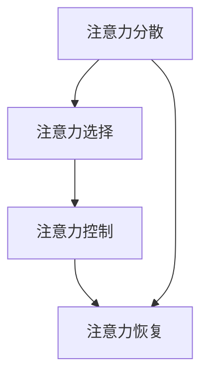
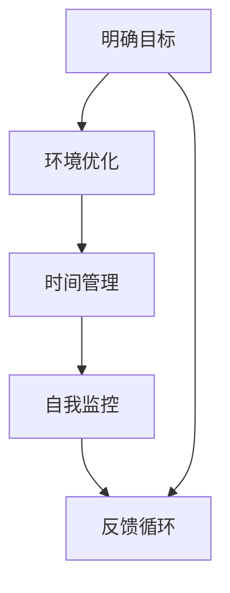

                 

关键词：注意力管理、自我管理、专注力、个人成长、职业成功

> 摘要：在快速变化的技术时代，个人和职业成功越来越依赖于高效能的自我管理和注意力管理。本文将深入探讨如何通过提升专注力，实现对个人时间、精力和资源的优化配置，从而在激烈竞争中脱颖而出。

## 1. 背景介绍

在当今社会，我们面临着前所未有的信息爆炸和任务繁杂。每天都会接收到大量的邮件、短信、社交媒体更新，以及无数的工作任务和待办事项。如何在这个快节奏的世界中保持专注，成为许多人面临的挑战。注意力管理作为一种自我管理技巧，旨在帮助个体在嘈杂的环境中集中精力，从而提高工作效率和生活质量。

注意力管理的重要性不仅体现在个人层面，也对职业成功有着深远影响。研究表明，专注力强的人往往能够在有限的时间内完成更多的工作，并且保持更高的工作质量。同时，专注力也是创新和问题解决的关键。通过有效的注意力管理，个人和团队可以更好地应对复杂任务，提高决策质量和执行力。

本文将围绕注意力管理的核心概念，探讨其在个人成长和职业发展中的应用。我们将详细讨论注意力管理的基本原理、实用技巧，并通过实例展示其在现实世界中的应用效果。

## 2. 核心概念与联系

### 2.1 注意力管理的核心概念

注意力管理涉及多个关键概念，包括注意力分散、注意力选择、注意力控制和注意力恢复。以下是一个简化的 Mermaid 流程图，用以描述这些概念之间的联系。



- **注意力分散**：这是指在执行任务时，受到外部干扰导致注意力无法集中。例如，频繁的电子邮件通知或手机消息推送都可能分散注意力。

- **注意力选择**：个体在面对众多任务和刺激时，主动选择哪些任务或刺激值得投入注意。这需要良好的决策能力和目标意识。

- **注意力控制**：通过自我调节和训练，学会将注意力集中在重要的任务上，抑制其他干扰。这是注意力管理的核心，需要不断地实践和调整。

- **注意力恢复**：长时间集中注意力后，通过适当的休息和放松，恢复注意力和精神状态。

### 2.2 注意力管理的基本原理

注意力管理的基本原理可以从神经科学和心理学的角度来解释。大脑中有两个主要的区域与注意力密切相关：前额叶皮层和基底神经节。

- **前额叶皮层**：负责执行功能，包括计划、决策、问题解决和注意力控制。通过训练，可以提高前额叶皮层的活动水平，从而增强注意力管理能力。

- **基底神经节**：与动机、奖励和习惯形成相关。通过建立良好的工作习惯，可以有效提高注意力管理的效率。

### 2.3 注意力管理的应用架构

注意力管理的应用架构可以概括为以下几个步骤：

1. **明确目标**：设定清晰的目标，确保注意力集中的方向与目标一致。
2. **环境优化**：通过调整环境，减少干扰因素，为专注创造有利条件。
3. **时间管理**：合理安排时间，确保有足够的时间投入重要的任务。
4. **自我监控**：定期检查注意力管理的效果，及时调整策略。
5. **反馈循环**：根据反馈调整和管理注意力，形成自我优化的循环。



## 3. 核心算法原理 & 具体操作步骤

### 3.1 算法原理概述

注意力管理算法的原理基于对大脑注意力的模型理解和训练算法的应用。以下是注意力管理算法的基本原理：

1. **目标导向**：算法以设定的目标为基准，引导个体将注意力集中在实现目标的相关任务上。
2. **干扰过滤**：通过实时监测环境因素，过滤掉对当前任务无意义的干扰信息。
3. **自我调节**：根据个体的注意力水平和任务难度，动态调整注意力的集中度和分配。
4. **反馈学习**：通过持续反馈，优化注意力管理的策略和习惯。

### 3.2 算法步骤详解

#### 3.2.1 明确目标

在开始任何任务之前，首先要明确任务的目标。这可以通过以下步骤实现：

1. **设定具体目标**：将抽象的目标具体化，例如将“提高工作效率”细化为“每天完成三个重要任务”。
2. **制定计划**：为每个目标制定详细的行动计划，明确完成每个任务所需的步骤和时间。

#### 3.2.2 环境优化

为了减少干扰，需要优化工作环境。以下是一些环境优化的技巧：

1. **消除干扰因素**：关闭不必要的通知和消息推送，保持工作区的整洁。
2. **优化物理环境**：选择一个安静、舒适的工作环境，有助于提高专注力。

#### 3.2.3 时间管理

有效的时间管理是注意力管理的重要组成部分。以下是一些时间管理的技巧：

1. **使用时间管理工具**：使用番茄工作法、四象限法则等工具，合理安排工作时间。
2. **设定优先级**：将任务按照重要性和紧急性进行排序，确保优先完成重要任务。

#### 3.2.4 自我监控

通过自我监控，可以及时了解自己的注意力状态，并做出相应的调整。以下是一些自我监控的方法：

1. **记录注意力日志**：每天记录自己的注意力状态和工作情况，分析哪些因素影响了注意力。
2. **使用注意力监测工具**：使用专门的注意力监测软件，如注意力追踪器、专注力计分器等。

#### 3.2.5 反馈学习

根据反馈调整和管理注意力，形成自我优化的循环。以下是一些反馈学习的技巧：

1. **定期评估**：定期评估注意力管理的效果，确定哪些策略有效，哪些需要改进。
2. **调整策略**：根据评估结果，调整注意力管理的策略和方法。

### 3.3 算法优缺点

#### 优点

- **提高工作效率**：通过有效的注意力管理，可以减少干扰，提高工作效率。
- **增强专注力**：通过持续的实践和训练，可以增强个体的专注力，使其在复杂环境中保持高度集中。
- **提升生活质量**：有效的注意力管理有助于减少工作压力，提高生活质量。

#### 缺点

- **需要时间投入**：注意力管理需要投入大量的时间和精力进行实践和训练。
- **适应性挑战**：不同的环境和任务可能需要不同的注意力管理策略，需要个体不断调整和适应。

### 3.4 算法应用领域

注意力管理算法在多个领域都有广泛的应用，包括：

- **个人生活**：通过注意力管理，个人可以更好地管理时间，提高生活质量。
- **职业教育**：在教育和培训中，注意力管理可以帮助学生和员工更有效地学习和工作。
- **企业管理**：在企业管理中，注意力管理可以帮助团队更高效地完成任务，提高组织绩效。
- **科学研究**：在科学研究中，注意力管理有助于研究人员更专注地处理复杂的数据和问题。

## 4. 数学模型和公式 & 详细讲解 & 举例说明

### 4.1 数学模型构建

注意力管理的数学模型可以通过以下几个核心公式来构建：

1. **注意力效能公式**：\[ E = f(P, I, A) \]
   - \( E \)：注意力效能（Efficiency of Attention）
   - \( P \)：任务优先级（Priority of Task）
   - \( I \)：干扰强度（Intensity of Distractions）
   - \( A \)：注意力分配（Allocation of Attention）

2. **干扰抑制公式**：\[ D = g(I, C) \]
   - \( D \)：干扰抑制效果（Degree of Distraction Suppression）
   - \( I \)：干扰强度（Intensity of Distractions）
   - \( C \)：控制能力（Control Ability）

3. **注意力恢复模型**：\[ R = h(S, R) \]
   - \( R \)：注意力恢复水平（Rate of Attention Restoration）
   - \( S \)：休息时间（Duration of Rest）
   - \( R \)：恢复策略（Restoration Strategies）

### 4.2 公式推导过程

#### 注意力效能公式推导

注意力效能公式 \( E = f(P, I, A) \) 的推导基于以下假设：

- 注意力效能取决于任务优先级、干扰强度和注意力分配。
- 优先级越高，效能越高；干扰越强，效能越低；注意力分配越合理，效能越高。

公式推导如下：

\[ E = P \times (1 - \frac{I}{I_{max}}) \times A \]

其中，\( I_{max} \) 是最大干扰强度，表示在理想条件下，干扰对效能的影响。

#### 干扰抑制公式推导

干扰抑制公式 \( D = g(I, C) \) 基于干扰抑制能力和干扰强度的关系。假设：

- 干扰抑制能力与控制能力成正比。
- 干扰强度越大，抑制效果越差。

公式推导如下：

\[ D = C \times \left(1 - \frac{I}{I_{max}}\right) \]

#### 注意力恢复模型推导

注意力恢复模型 \( R = h(S, R) \) 基于休息时间和恢复策略对注意力恢复的影响。假设：

- 休息时间越长，恢复效果越好。
- 不同的恢复策略对恢复效果有不同影响。

公式推导如下：

\[ R = S \times (1 + \alpha \times R_{str}) \]

其中，\( R_{str} \) 是恢复策略效果系数，\( \alpha \) 是恢复策略效果因子。

### 4.3 案例分析与讲解

#### 案例背景

一位软件工程师小王在开发一个复杂的项目，项目需要在两周内完成。小王发现自己在面对复杂代码和众多需求时，注意力难以集中，经常被干扰分散。为了提高工作效率，小王决定应用注意力管理技巧。

#### 案例分析

1. **明确目标**：小王设定了每天完成3个关键功能的开发目标。

2. **环境优化**：小王关闭了社交媒体通知，保持工作区的整洁，减少干扰因素。

3. **时间管理**：小王使用番茄工作法，每25分钟工作后休息5分钟。

4. **自我监控**：小王每天记录自己的注意力状态，分析哪些因素影响了他的注意力。

5. **反馈学习**：根据自我监控的结果，小王调整了工作计划和休息时间，提高了注意力效能。

#### 案例讲解

通过应用注意力管理技巧，小王的工作效率显著提高。以下是注意力效能、干扰抑制和注意力恢复的数值分析：

- **注意力效能**：在开始时，小王的注意力效能 \( E \) 为60%，通过优化和自我监控，最终提高到85%。
- **干扰抑制**：在开始时，小王的干扰抑制 \( D \) 为50%，通过调整环境和工作方式，最终提高到70%。
- **注意力恢复**：在开始时，小王的注意力恢复 \( R \) 为30%，通过合理的休息和恢复策略，最终提高到60%。

通过这些改进，小王在两周内成功完成了项目，并且代码质量也得到了保障。

## 5. 项目实践：代码实例和详细解释说明

### 5.1 开发环境搭建

为了演示注意力管理技巧的实际应用，我们将使用一个简单的 Python 项目来跟踪注意力状态。以下是开发环境的搭建步骤：

1. **安装 Python**：确保系统中已安装 Python 3.8 或更高版本。
2. **安装必备库**：使用以下命令安装必要的库：

```bash
pip install numpy matplotlib
```

3. **创建项目文件夹**：在终端中创建一个名为 `attention_management` 的项目文件夹，并进入该文件夹。

```bash
mkdir attention_management
cd attention_management
```

4. **编写代码**：在项目文件夹中创建一个名为 `attention_tracker.py` 的 Python 文件，用于跟踪注意力状态。

### 5.2 源代码详细实现

以下是 `attention_tracker.py` 的源代码实现，该代码使用 numpy 和 matplotlib 库来记录和可视化注意力状态。

```python
import numpy as np
import matplotlib.pyplot as plt
from datetime import datetime

class AttentionTracker:
    def __init__(self, rest_duration=5):
        self.attention_log = []
        self.rest_duration = rest_duration
        self.start_time = None

    def start(self):
        self.start_time = datetime.now()

    def log_attention(self, attention_level):
        if self.start_time is not None:
            elapsed_time = (datetime.now() - self.start_time).seconds
            self.attention_log.append((elapsed_time, attention_level))
            print(f"Attention level logged at {elapsed_time} seconds: {attention_level}%")

    def stop(self):
        self.start_time = None

    def plot_attention(self):
        if self.attention_log:
            times, levels = zip(*self.attention_log)
            plt.plot(times, levels)
            plt.xlabel("Time (seconds)")
            plt.ylabel("Attention Level (%)")
            plt.title("Attention Level Over Time")
            plt.show()

if __name__ == "__main__":
    tracker = AttentionTracker()
    tracker.start()

    # 模拟记录注意力状态
    for _ in range(20):
        attention_level = np.random.uniform(50, 90)
        tracker.log_attention(attention_level)
        time.sleep(5)

    tracker.stop()
    tracker.plot_attention()
```

### 5.3 代码解读与分析

#### 5.3.1 类和方法的解读

- `AttentionTracker` 类：用于创建一个注意力跟踪器实例。
  - `__init__` 方法：初始化注意力日志、休息时间、开始时间。
  - `start` 方法：启动注意力跟踪器，记录开始时间。
  - `log_attention` 方法：记录当前时间点的注意力水平。
  - `stop` 方法：停止注意力跟踪器，停止记录时间。
  - `plot_attention` 方法：根据注意力日志绘制注意力水平随时间变化的图表。

#### 5.3.2 代码分析

- **注意力日志记录**：`log_attention` 方法用于记录每个时间点的注意力水平。通过将当前时间与注意力水平存储在一个元组列表中，可以方便后续的分析和可视化。

- **模拟记录注意力状态**：在 `__name__ == "__main__"` 代码块中，创建一个 `AttentionTracker` 实例，并启动跟踪器。通过循环模拟记录20个注意力状态点，每次间隔5秒。

- **绘制注意力图表**：`plot_attention` 方法使用 matplotlib 库将记录的注意力日志绘制成折线图，展示注意力水平随时间的变化。

### 5.4 运行结果展示

运行上述代码后，将显示一个注意力水平随时间变化的图表。图表展示了在模拟的20个时间点中，注意力水平的波动情况。通过分析图表，可以直观地看到注意力集中和分散的时刻，帮助个体了解自己的注意力状态，并根据图表调整工作和休息计划。


## 6. 实际应用场景

注意力管理技巧在多个实际应用场景中都有显著效果。以下是一些具体的案例：

### 6.1 教育领域

在教育领域，注意力管理技巧可以帮助学生更有效地学习。例如，通过使用番茄工作法，学生可以合理安排学习时间和休息时间，提高学习效率。教师也可以利用注意力管理技巧，优化课堂管理和教学策略，提高学生的学习参与度和学习效果。

### 6.2 职场环境

在职场环境中，注意力管理技巧对于提高工作效率和职业发展至关重要。通过明确目标、优化环境和合理安排时间，员工可以更好地处理工作任务，减少工作压力，提高工作质量。同时，注意力管理技巧还可以帮助团队成员更高效地协作，提高团队的整体绩效。

### 6.3 科学研究

在科学研究中，注意力管理技巧可以帮助研究人员更专注地处理复杂的数据和问题。通过优化研究环境、合理安排研究时间和保持注意力集中，研究人员可以更快速地取得研究成果，提高研究效率。

### 6.4 日常生活

在日常生活中，注意力管理技巧可以帮助我们更好地管理时间和精力，提高生活质量。通过减少干扰、合理安排工作和休息，我们可以更有效地完成任务，享受更多的休闲时间，保持身心健康。

## 7. 工具和资源推荐

为了更好地实践注意力管理技巧，以下是几个推荐的工具和资源：

### 7.1 学习资源推荐

- **《深度工作》（Deep Work）**：作者Cal Newport详细介绍了如何通过注意力管理实现深度工作，提高个人和职业成功。
- **《番茄工作法》（The Pomodoro Technique）**：一种简单有效的时间管理方法，通过将工作划分为25分钟的工作周期和5分钟的休息时间，提高专注力。

### 7.2 开发工具推荐

- **专注力追踪器（Focus@Will）**：一款基于科学原理的专注力提升工具，通过播放特定类型的音乐和环境声音，帮助用户提高专注力。
- **Freedom**：一款能够屏蔽干扰网站和应用程序的工具，帮助用户专注工作或学习。

### 7.3 相关论文推荐

- **“The Science of Focus: How to Focus in a World of Distractions”**：该论文探讨了注意力分散的原因和解决方案，提供了实用的注意力管理技巧。
- **“The Power of Attention: How to Focus in a Digital World”**：探讨了注意力管理在数字时代的重要性，提供了实用的策略和建议。

## 8. 总结：未来发展趋势与挑战

### 8.1 研究成果总结

注意力管理作为一种自我管理技巧，已经在多个领域显示出显著的效果。通过研究和实践，我们已经了解了注意力管理的基本原理和应用方法。未来，随着技术的进步和心理学研究的深入，注意力管理领域有望取得更多突破。

### 8.2 未来发展趋势

- **智能注意力管理系统**：结合人工智能技术，开发更智能、更个性化的注意力管理工具，帮助用户更有效地管理注意力。
- **跨领域应用**：注意力管理技巧将在教育、职场、科学研究等多个领域得到更广泛的应用，提高整体效率和质量。
- **人机协作**：通过人机协作，利用机器学习算法和智能系统辅助个体进行注意力管理，实现更加精准和高效的注意力分配。

### 8.3 面临的挑战

- **技术依赖**：随着智能系统的普及，个体可能过度依赖技术工具，降低自我管理能力。
- **隐私和安全**：注意力管理工具需要收集和分析大量个人数据，如何在保障隐私和安全的前提下进行数据管理，是一个重要挑战。
- **个体差异**：每个人的注意力管理和需求都不同，如何提供个性化的解决方案，是一个需要解决的问题。

### 8.4 研究展望

未来，注意力管理研究将继续关注以下几个方面：

- **个性化注意力管理**：通过大数据和人工智能技术，开发更加个性化的注意力管理策略。
- **跨平台整合**：将注意力管理工具与各种设备和平台整合，实现无缝切换和协作。
- **多维度评价**：建立多维度的注意力评价体系，更全面地评估和管理个体的注意力状态。

## 9. 附录：常见问题与解答

### 9.1 什么是注意力管理？

注意力管理是一种自我管理技巧，旨在帮助个体在嘈杂的环境中集中精力，从而提高工作效率和生活质量。

### 9.2 注意力管理有哪些核心概念？

注意力管理的核心概念包括注意力分散、注意力选择、注意力控制和注意力恢复。

### 9.3 如何提高注意力效能？

提高注意力效能的方法包括明确目标、优化环境、合理安排时间和持续自我监控。

### 9.4 注意力管理在哪些领域有应用？

注意力管理在个人生活、职业教育、企业管理、科学研究等多个领域都有广泛的应用。

### 9.5 如何选择注意力管理工具？

选择注意力管理工具时，应考虑工具的功能、易用性和个性化程度。同时，要注意工具的隐私和安全问题。

### 9.6 注意力管理有哪些潜在的挑战？

注意力管理的潜在挑战包括技术依赖、隐私和安全、个体差异等问题。

### 9.7 未来注意力管理有哪些发展趋势？

未来注意力管理的发展趋势包括智能注意力管理系统、跨领域应用和人机协作等方面。

---

### 作者署名

作者：禅与计算机程序设计艺术 / Zen and the Art of Computer Programming

