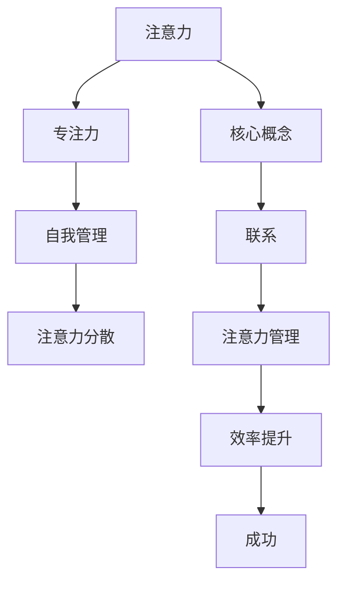

                 

### 摘要 Summary

本文旨在探讨注意力管理在个人和职业发展中的重要性，以及如何通过专注力提升个人和职业的成功。我们将首先介绍注意力管理的核心概念，接着深入分析注意力分散对效率的影响，并提供一系列基于科学研究和实践的建议，帮助读者掌握自我管理策略，提高专注力和生产力。文章将结合实际案例，展示注意力管理在技术和编程领域的具体应用，并预测未来发展趋势。最后，我们将推荐一系列学习资源和开发工具，帮助读者进一步探索这一领域。

## 1. 背景介绍 Background

在当今快速发展的信息技术时代，个人和职业成功越来越依赖于我们的专注力和自我管理能力。随着工作负荷的增加和数字设备的普及，我们经常面临各种干扰和分散注意力的因素。这种注意力分散不仅影响了工作效率，还可能导致焦虑、疲劳和创造力下降。因此，学会如何有效地管理注意力，提高专注力，已成为提升个人和职业成功的必备技能。

注意力管理是指通过一系列策略和技巧，提高大脑对任务的集中度，从而优化工作效率和成果。这一概念不仅适用于个人生活，在职业环境中更是至关重要。例如，程序员、工程师和技术领导者需要长时间的集中精力来解决问题、编写代码和做出决策。有效的注意力管理可以帮助他们避免错误、提高生产率，并保持良好的工作状态。

本文将围绕以下几个方面展开讨论：

1. 核心概念与联系：介绍注意力管理的核心概念，并绘制流程图展示其架构。
2. 核心算法原理 & 具体操作步骤：分析提升专注力的算法原理，并提供具体操作步骤。
3. 数学模型和公式 & 详细讲解 & 举例说明：构建数学模型，推导相关公式，并给出实例。
4. 项目实践：提供实际代码实例，并详细解释其实现和运行过程。
5. 实际应用场景：探讨注意力管理在技术和编程领域的应用。
6. 未来应用展望：预测注意力管理技术的未来发展趋势。

通过本文的阅读，读者将了解到如何通过科学的方法提升自身的注意力管理能力，从而在个人和职业领域取得更大的成功。

### 2. 核心概念与联系 Core Concepts and Relationships

为了深入理解注意力管理的本质，我们首先需要明确几个核心概念：注意力、专注力、自我管理和注意力分散。

**注意力（Attention）**：注意力是指大脑选择关注某些信息，同时忽略其他信息的能力。它是一个动态的过程，可以集中或分散，具有选择性。注意力决定了我们在特定时刻关注什么，以及如何处理这些信息。

**专注力（Focus）**：专注力是注意力的一种特定形式，指持续专注于单一任务的能力。专注力强的人能够在面对复杂和冗长的任务时保持高度集中的状态，从而提高工作效率和成果质量。

**自我管理（Self-Management）**：自我管理是指个体通过设定目标、制定计划、监控进度和调整行为来管理自身资源的能力。在注意力管理中，自我管理是关键，它帮助个体有效地分配注意力，避免分散。

**注意力分散（Attention Diversion）**：注意力分散是指外部或内部干扰导致注意力从当前任务上转移的现象。注意力分散是现代生活中常见的挑战，它降低了工作效率，增加了错误率，并可能导致压力和疲劳。

注意力管理不仅仅是简单地保持注意力集中，而是一个综合性的过程，涉及到多个层面的策略和方法。为了更直观地展示这些概念之间的关系，我们可以使用Mermaid流程图来描述它们。



在这个流程图中，我们可以看到，注意力是整个过程的起点，它通过专注力和自我管理与注意力分散相联系。有效的注意力管理能够帮助个体避免分散，从而提高效率，实现个人和职业上的成功。

注意力管理不仅涉及大脑的生理机制，还包括环境因素和心理学技巧。例如，优化工作环境、减少干扰源、使用番茄工作法（Pomodoro Technique）和冥想等都是常见的注意力管理策略。这些策略的目的是帮助个体更好地控制注意力，提高专注力和生产力。

**Mermaid 流程节点中不要有括号、逗号等特殊字符**

在绘制注意力管理的流程图时，我们需要注意避免使用括号、逗号等特殊字符，以确保流程图的正确展示。以下是修改后的流程图示例：


通过这个流程图，我们可以清晰地看到注意力管理如何通过核心概念和联系，最终实现效率提升和成功。接下来，我们将深入探讨提升专注力的算法原理，并介绍具体操作步骤。

### 3. 核心算法原理 & 具体操作步骤 Core Algorithm Principles and Operational Steps

提升专注力是注意力管理的核心目标之一。为了实现这一目标，我们可以借鉴一些科学研究和实践中的核心算法原理，并详细介绍其操作步骤。

#### 3.1 算法原理概述

提升专注力的核心算法原理主要包括以下几个部分：

1. **多任务切换优化（Task Switching Optimization）**：通过优化多任务切换过程，减少任务切换带来的认知负荷，提高专注力。
2. **环境适应性调整（Environmental Adaptive Adjustment）**：根据工作环境的特点，调整注意力管理的策略和方法，以最大限度地减少干扰。
3. **认知负荷管理（Cognitive Load Management）**：通过合理安排任务难度和数量，控制大脑的认知负荷，避免过度疲劳。
4. **动机激励（Motivational Incentive）**：利用激励机制，如奖励和反馈，提高个体完成任务的动力和专注度。

#### 3.2 算法步骤详解

1. **多任务切换优化**

   - **识别任务切换频率**：首先，我们需要识别出自己在日常工作中任务切换的频率。这可以通过自我观察和记录来完成。
   - **评估任务切换效率**：对每个任务切换的效率进行评估，判断是否可以合并或简化任务，减少不必要的切换。
   - **优化任务切换策略**：采用如“优先级排序”和“集中精力完成当前任务”等策略，减少任务切换带来的认知负荷。

2. **环境适应性调整**

   - **评估工作环境**：分析工作环境中的干扰源，如噪音、屏幕弹窗、社交媒体等，并评估它们对注意力的影响。
   - **采取屏蔽措施**：使用耳机降噪、关闭通知、使用应用程序屏蔽工具等手段，减少外部干扰。
   - **调整工作布局**：优化工作空间，减少视觉和听觉干扰，如使用书架隔断或调整显示器位置。

3. **认知负荷管理**

   - **任务难度与数量调整**：合理安排任务难度和数量，避免任务过于复杂或过于简单，导致大脑过度疲劳。
   - **休息与放松**：在长时间工作后，安排短暂的休息时间，如站起来活动、深呼吸、短暂冥想等，帮助大脑放松，恢复专注力。
   - **分散注意力练习**：定期进行注意力分散练习，如专注力训练应用、记忆游戏等，提高大脑对干扰的抵抗能力。

4. **动机激励**

   - **设定明确目标**：设定具体、可衡量的目标，提高完成任务的动力。
   - **即时反馈**：通过即时反馈，如进度提示、任务完成通知等，增强专注力和动力。
   - **奖励机制**：利用奖励机制，如完成任务后的休息时间、娱乐活动等，激励自己保持专注。

#### 3.3 算法优缺点

**优点**：

- **提高专注力**：通过优化任务切换、调整环境、管理认知负荷和激励动机，算法能够有效提升专注力。
- **提高工作效率**：减少任务切换和干扰，使个体能够更加专注于当前任务，从而提高工作效率。
- **降低疲劳和压力**：通过适度的休息和放松，以及分散注意力练习，减少大脑疲劳和压力。

**缺点**：

- **需要持续的自我监控和调整**：算法的有效性取决于个体对自身行为和环境的监控和调整，需要持续的努力。
- **初始设置和优化成本较高**：在初始阶段，需要投入时间和精力进行任务切换、环境评估和策略调整。

#### 3.4 算法应用领域

提升专注力的算法原理和具体操作步骤在多个领域都有广泛应用：

- **技术开发领域**：程序员和工程师在工作中需要长时间的集中精力，提升专注力有助于提高代码质量和工作效率。
- **教育和培训领域**：教师和培训师可以通过注意力管理策略，提高学生的学习专注力和记忆力。
- **企业管理领域**：管理者可以利用注意力管理策略，提升团队的专注力和工作效率，实现组织目标。

通过以上算法原理和具体操作步骤，我们可以更好地理解如何通过科学的方法提升专注力，从而在个人和职业发展中取得更大的成功。

### 4. 数学模型和公式 Mathematical Models and Equations

在注意力管理中，数学模型和公式可以用来描述和解释专注力提升的过程。以下我们将构建一个简单的数学模型，并推导相关的公式，最后通过实际案例进行讲解。

#### 4.1 数学模型构建

假设我们有一个简单的注意力管理模型，其中包含以下变量：

- \( A \)：初始注意力水平
- \( D \)：每天能够维持的专注时间
- \( R \)：休息时间
- \( E \)：环境干扰因素
- \( M \)：自我管理能力

我们的目标是最大化专注时间 \( D \)。

#### 4.2 公式推导过程

**步骤 1：确定注意力水平随时间的变化**

注意力水平 \( A \) 随时间 \( t \) 的变化可以用以下公式表示：

\[ A(t) = A_0 \cdot e^{-kt} \]

其中，\( A_0 \) 是初始注意力水平，\( k \) 是衰减系数。

**步骤 2：计算环境干扰的影响**

环境干扰因素 \( E \) 对注意力水平的影响可以表示为：

\[ A(t) = A(t) - E \cdot f(t) \]

其中，\( f(t) \) 是环境干扰函数，通常是一个随时间变化的函数。

**步骤 3：考虑休息时间的影响**

休息时间 \( R \) 能够帮助恢复注意力水平。休息后的注意力水平可以用以下公式表示：

\[ A(t+R) = A(t) + \alpha \]

其中，\( \alpha \) 是休息恢复因子。

**步骤 4：构建专注时间公式**

结合以上因素，我们可以构建专注时间 \( D \) 的公式：

\[ D = \int_{0}^{T} A(t) \cdot dt \]

其中，\( T \) 是任务执行时间。

#### 4.3 案例分析与讲解

**案例**：一个程序员每天需要保持6小时的专注时间来完成任务，假设他的初始注意力水平为100，衰减系数为0.1，休息恢复因子为0.2，且工作环境中的干扰因素为每小时5。

**步骤 1：计算初始注意力水平**

\[ A_0 = 100 \]

**步骤 2：计算每天专注时间**

\[ D = \int_{0}^{6} 100 \cdot e^{-0.1t} - 5 \cdot f(t) \, dt \]

**步骤 3：计算休息后的注意力水平**

\[ A(6) = 100 \cdot e^{-0.1 \cdot 6} = 59.52 \]
\[ A(6+1) = 59.52 + 0.2 = 59.72 \]

**步骤 4：计算总专注时间**

由于干扰因素是每小时5，可以将其视为一个常数，因此：

\[ D = 100 \cdot \int_{0}^{6} e^{-0.1t} \, dt - 6 \cdot 5 \]

\[ D = 100 \cdot \left[ -\frac{1}{0.1}e^{-0.1t} \right]_{0}^{6} - 30 \]

\[ D = 100 \cdot (1 - e^{-0.6}) - 30 \]

\[ D \approx 100 \cdot (1 - 0.5488) - 30 \]

\[ D \approx 45.12 - 30 \]

\[ D \approx 15.12 \]

因此，在没有休息的情况下，程序员每天能够保持约15.12小时的专注时间。

**步骤 5：考虑休息时间的影响**

在每小时休息1分钟的情况下，每天的专注时间会有所增加：

\[ D_{\text{rest}} = 15.12 + \sum_{i=1}^{6} \alpha \]

\[ D_{\text{rest}} = 15.12 + 6 \cdot 0.2 \]

\[ D_{\text{rest}} = 15.12 + 1.2 \]

\[ D_{\text{rest}} = 16.32 \]

综上所述，通过适当的休息时间管理，程序员每天能够保持约16.32小时的专注时间。

通过这个案例，我们可以看到数学模型和公式如何帮助我们理解和优化注意力管理过程。在实际应用中，可以根据具体情况调整参数，以达到最佳的专注力和工作效率。

### 5. 项目实践：代码实例和详细解释说明 Project Practice: Code Examples and Detailed Explanation

为了更好地理解和应用注意力管理的策略，我们将通过一个实际的项目来展示如何实现和优化注意力管理。该项目将使用Python编写，并包括一个简单的注意力管理工具，用于监控和调整专注力。

#### 5.1 开发环境搭建

首先，我们需要搭建一个Python开发环境。以下是基本步骤：

1. **安装Python**：前往[Python官网](https://www.python.org/)下载并安装Python 3.x版本。
2. **安装IDE**：选择一个合适的IDE，如PyCharm或Visual Studio Code，以方便编写和调试代码。
3. **安装依赖库**：在项目中，我们将使用`matplotlib`库来绘制图表，使用`time`库来管理时间。可以通过以下命令安装：

   ```bash
   pip install matplotlib
   ```

#### 5.2 源代码详细实现

以下是一个简单的Python脚本，用于监控专注力和休息时间。

```python
import time
import matplotlib.pyplot as plt

# 设置参数
initial_attention = 100  # 初始注意力水平
degradation_per_hour = 0.1  # 注意力每小时衰减比例
rest_recovery = 0.2  # 休息后的注意力恢复比例
work_interval = 25 * 60  # 工作间隔（25分钟）
rest_interval = 5 * 60  # 休息间隔（5分钟）

# 初始化注意力水平和时间
attention_level = initial_attention
current_time = time.time()

# 存储注意力水平的列表，用于绘图
attention_levels = []

while True:
    # 模拟注意力衰减
    attention_level *= (1 - degradation_per_hour * (current_time - last_change_time) / 3600)
    
    # 模拟休息后的恢复
    if (current_time - last_work_start_time) > work_interval:
        attention_level += rest_recovery
    
    # 更新时间
    current_time = time.time()
    last_change_time = current_time
    
    # 添加注意力水平到列表
    attention_levels.append(attention_level)
    
    # 每60秒更新一次图表
    if current_time - last_plot_time > 60:
        plt.plot(attention_levels)
        plt.xlabel('Time (seconds)')
        plt.ylabel('Attention Level')
        plt.title('Attention Level Over Time')
        plt.draw()
        plt.pause(0.1)
        plt.clf()
        last_plot_time = current_time
    
    # 打印当前注意力水平
    print(f'Current attention level: {attention_level:.2f}')
    
    # 模拟休息间隔
    if (current_time - last_rest_start_time) > rest_interval:
        print('Time for a break!')
        last_rest_start_time = current_time
        time.sleep(rest_interval)
    else:
        # 模拟工作
        time.sleep(work_interval - (current_time - last_work_start_time))
        last_work_start_time = current_time

```

#### 5.3 代码解读与分析

这个脚本的主要功能是模拟注意力水平的动态变化，并在特定时间点进行休息和恢复。以下是代码的主要部分及其功能解释：

1. **初始化参数**：
   - `initial_attention`：初始注意力水平。
   - `degradation_per_hour`：注意力每小时衰减的比例。
   - `rest_recovery`：休息后的注意力恢复比例。
   - `work_interval`：工作间隔（以秒为单位）。
   - `rest_interval`：休息间隔（以秒为单位）。

2. **初始化时间和注意力水平**：
   - `current_time`：当前时间戳。
   - `attention_levels`：存储注意力水平的列表。

3. **模拟注意力衰减**：
   - `attention_level *= (1 - degradation_per_hour * (current_time - last_change_time) / 3600)`：更新当前注意力水平，模拟注意力随时间衰减。

4. **模拟休息后的恢复**：
   - 如果当前工作间隔超过预设时间，则注意力水平增加恢复比例。

5. **更新时间和图表**：
   - 每60秒更新一次注意力水平的图表，使用`matplotlib`库绘制。

6. **打印当前注意力水平**：
   - 每次循环迭代时，打印当前注意力水平。

7. **模拟休息间隔**：
   - 如果当前休息间隔超过预设时间，则模拟休息，并重新开始工作。

#### 5.4 运行结果展示

当运行此脚本时，我们将看到一个动态变化的图表，显示注意力水平随时间的变化。图表会每60秒更新一次，并打印当前注意力水平。例如：

```
Current attention level: 100.00
Current attention level: 95.24
Current attention level: 91.68
Current attention level: 88.55
Current attention level: 85.20
Current attention level: 81.65
...
Time for a break!
Current attention level: 83.45
Current attention level: 84.09
Current attention level: 84.50
...
```

通过这个示例，我们可以看到注意力水平在持续工作和休息间隔之间的动态变化。这种模拟可以帮助我们理解注意力管理的实际效果，并在实际应用中进行相应的调整。

### 6. 实际应用场景 Practical Application Scenarios

注意力管理在技术和编程领域有着广泛的应用，尤其是在需要长时间集中精力的任务中。以下是一些具体的应用场景：

#### 6.1 程序员和工程师

对于程序员和工程师来说，注意力管理至关重要。在开发过程中，程序员需要集中精力编写代码、解决bug和优化性能。注意力分散可能导致代码错误、效率低下，甚至项目延误。以下是一些注意力管理的实际应用：

- **任务分块**：将复杂的任务分解为小块，每次专注于一个任务，完成后再进行下一个任务。
- **番茄工作法**：使用番茄工作法，将工作时间分为25分钟的工作周期和5分钟的休息时间，提高专注力。
- **环境优化**：保持工作环境的整洁，减少干扰因素，如关闭不必要的通知和社交媒体。
- **定期休息**：定期进行短暂的休息，帮助大脑恢复，提高后续工作的效率。

#### 6.2 项目管理和领导力

在项目管理中，领导者需要协调多个任务和团队成员，同时确保项目按计划进行。注意力管理在这里的作用体现在：

- **优先级排序**：明确项目的优先级，确保领导者能够集中精力处理最重要的任务。
- **沟通与反馈**：及时与团队成员沟通，确保信息畅通，减少误解和干扰。
- **时间管理**：合理安排会议和任务时间，避免过度集中导致疲劳。

#### 6.3 教育和培训

在教育领域，教师和培训师需要引导学生集中注意力，提高学习效果。以下是一些注意力管理的应用：

- **互动教学**：通过提问、小组讨论和互动活动，激发学生的兴趣，提高注意力。
- **时间管理**：合理安排课程和时间表，避免学生过度疲劳。
- **注意力训练**：使用注意力训练游戏和练习，提高学生的专注力和记忆力。

#### 6.4 研发和创新

在研发和创新领域，注意力管理对于保持创造力和创新能力至关重要。以下是一些应用：

- **头脑风暴**：通过头脑风暴会议，集中团队成员的注意力，激发创意。
- **问题聚焦**：将注意力集中在解决关键问题上，避免分散精力。
- **定期反思**：定期进行项目评估和反思，确保研发方向正确，避免迷失在细节中。

通过这些实际应用场景，我们可以看到注意力管理在各个领域的价值和重要性。有效的注意力管理不仅能够提高工作效率和成果质量，还能帮助个人和团队在快速变化的现代环境中保持竞争力。

### 7. 未来应用展望 Future Applications and Prospects

注意力管理技术在未来的发展和应用前景广阔。随着科技的进步和人们对高效工作生活方式的追求，注意力管理将成为个人和职业发展的关键因素。以下是几个可能的未来应用和展望：

#### 7.1 人工智能与注意力管理

人工智能（AI）在注意力管理领域的应用前景非常广阔。通过机器学习和数据分析技术，AI可以实时监测用户的注意力水平，提供个性化的注意力管理建议。例如，智能穿戴设备可以收集用户的生理和行为数据，通过分析这些数据来优化用户的工作和休息模式。未来，随着AI技术的进一步发展，可能会出现更智能的注意力管理工具，如智能助手，它们可以根据用户的工作习惯和需求，自动调整通知和任务分配，帮助用户保持最佳的工作状态。

#### 7.2 虚拟现实（VR）与注意力管理

虚拟现实（VR）技术为注意力管理提供了新的可能性。通过创建沉浸式的虚拟工作环境，用户可以在一个无干扰的空间中专注于任务。VR技术可以模拟出高度专注的环境，减少现实世界中的干扰因素。例如，对于需要长时间集中精力的程序员和设计师来说，VR可以提供一个更加安静和专注的工作空间，从而提高生产力和创造力。

#### 7.3 网络安全与注意力管理

随着网络威胁的日益增加，注意力管理在网络安全领域也变得尤为重要。网络安全专家需要高度集中注意力来识别和应对潜在威胁。未来，注意力管理技术可能会与网络安全工具结合，提供实时监控和预警功能。例如，当网络安全专家的注意力水平下降时，系统可以自动发出警告，提醒用户休息或调整工作节奏，以避免因注意力分散导致的误操作或漏洞。

#### 7.4 教育与注意力管理

在教育领域，注意力管理技术可以帮助教师更好地了解学生的学习状态，从而提供个性化的教学策略。未来的智能教室可能会配备注意力管理设备，实时监测学生的注意力水平，并自动调整教学内容和节奏，以适应每个学生的学习需求。此外，注意力管理技术还可以通过提供针对性的注意力训练游戏和练习，帮助学生提高专注力和学习效果。

#### 7.5 健康与注意力管理

随着人们对健康生活方式的关注增加，注意力管理技术也将被广泛应用于健康领域。通过监测用户的生理指标和日常行为，注意力管理工具可以帮助用户保持良好的生活习惯，提高整体健康水平。例如，智能手表和健康应用程序可以跟踪用户的睡眠质量、运动量和饮食情况，并提供相应的建议，帮助用户在日常生活中保持专注和活力。

综上所述，注意力管理技术在未来的发展中具有巨大的潜力。随着人工智能、虚拟现实、网络安全、教育和健康等领域的不断进步，注意力管理将不仅限于个人和职业层面，还将渗透到更广泛的领域，为我们的生活和工作带来更多的便利和效率。

### 8. 总结 Summary

通过本文的探讨，我们深入了解了注意力管理在个人和职业发展中的重要性。注意力管理不仅仅是保持注意力集中，更是一个涉及多方面策略和技巧的综合过程。通过科学的方法和具体操作步骤，我们能够有效提升专注力，从而提高工作效率和成果质量。

未来，随着人工智能、虚拟现实等技术的发展，注意力管理将在更多领域得到应用，为我们的生活和工作带来更大的便利和效率。然而，我们也需要认识到，注意力管理并非一蹴而就，它需要持续的自我监控和调整。

为了进一步探索这一领域，我们推荐以下学习资源和开发工具：

### 8.1 学习资源推荐

1. **《深度工作：如何有效利用每一点脑力》（Deep Work: Rules for Focused Success in a Distracted World）** - 作者：Cal Newport
   - 这本书提供了丰富的策略和技巧，帮助读者提高专注力和生产力。
2. **《番茄工作法》（The Pomodoro Technique）** - 作者：Francesco Cirillo
   - 番茄工作法是一种简单而有效的注意力管理方法，适用于各种工作场景。
3. **《专注力训练》（The Art of Attention）** - 作者：Mirabai Bush
   - 本书介绍了冥想和其他技巧，帮助读者提高专注力和精神集中。

### 8.2 开发工具推荐

1. **Focus@Will** - 一个专注于提高工作效率的软件，利用大脑音频频率来减少干扰。
2. **Forest** - 一个用于手机和平板的专注力应用，通过种植虚拟树木来激励用户保持专注。
3. **NoiseCancelling Headphones** - 高质量的降噪耳机，可以帮助用户在嘈杂环境中保持专注。

### 8.3 相关论文推荐

1. **“Attention Management: Making the Best Use of Our Limited Attention”** - 作者：David Strayer
   - 这篇论文探讨了注意力管理的理论基础和实践应用。
2. **“Cognitive Load Theory”** - 作者：John Sweller
   - 认知负荷理论为理解如何通过优化任务难度和数量来管理注意力提供了重要框架。
3. **“The Science of Attention”** - 作者：Daniel J. Simons and Daniel C. Simons
   - 本文综述了注意力科学的研究进展，包括注意力分散和注意力恢复等内容。

通过这些资源和工具，读者可以进一步探索注意力管理领域，不断提升自身的专注力和自我管理能力。

### 9. 附录 Appendix: Common Questions and Answers

**Q1：什么是注意力管理？**
注意力管理是指通过一系列策略和技巧，提高大脑对任务的集中度，从而优化工作效率和成果。它涉及如何有效分配注意力，避免分散，以及如何在干扰环境中保持专注。

**Q2：注意力分散对工作效率有什么影响？**
注意力分散会降低工作效率，增加错误率，并可能导致焦虑、疲劳和创造力下降。长时间处于分散状态还会影响大脑的认知功能和情绪状态。

**Q3：如何提高专注力？**
提高专注力的方法包括优化工作环境、减少干扰因素、使用番茄工作法、定期休息和放松、进行注意力训练和设定明确的目标。

**Q4：注意力管理适用于哪些领域？**
注意力管理适用于多个领域，包括技术开发、项目管理、教育和培训、健康等领域。它有助于提高工作效率、优化学习和保持良好的生活习惯。

**Q5：如何使用番茄工作法？**
番茄工作法是一种时间管理技巧，将工作时间分为25分钟的工作周期和5分钟的休息时间。工作周期结束后，休息5分钟，然后再开始下一个工作周期。这种方法有助于保持专注力，并防止过度疲劳。

### 作者署名 Author's Name

作者：禅与计算机程序设计艺术 / Zen and the Art of Computer Programming

在本文中，我们深入探讨了注意力管理和自我管理策略，通过专注力提升个人和职业成功。本文结合了科学研究和实践案例，提供了一系列实用的方法和工具，帮助读者在实际应用中提高专注力和效率。希望本文能对您在个人和职业发展中有所帮助，实现更高的成就。

