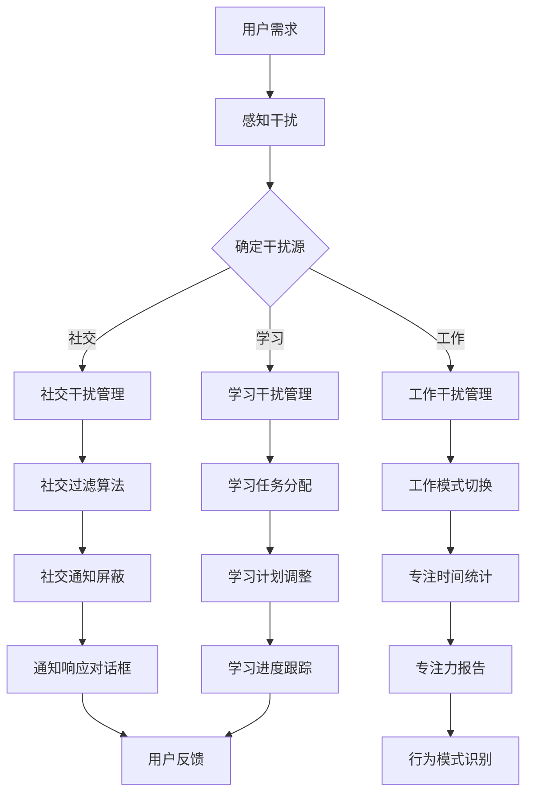

                 

注意力管理是提高工作效率和个人生产力的重要环节。在元宇宙这个新兴的虚拟世界中，个人如何在复杂的信息环境中保持专注，成为了一个备受关注的话题。本文将探讨元宇宙中的注意力管理工具，以及如何提升个人效率。

> 关键词：元宇宙、注意力管理、个人效率、专注力、虚拟世界

> 摘要：本文首先介绍了元宇宙的基本概念和注意力管理的背景，随后详细探讨了注意力管理工具在元宇宙中的应用。通过数学模型、算法原理、项目实践等多个角度，深入分析了如何利用元宇宙中的注意力管理工具提升个人效率。最后，展望了未来注意力管理工具在元宇宙中的发展趋势和挑战。

## 1. 背景介绍

### 1.1 元宇宙的定义与发展

元宇宙（Metaverse）是一个虚拟的共享空间，由多个虚拟世界组成，用户可以在其中进行交互、创造和娱乐。元宇宙融合了虚拟现实（VR）、增强现实（AR）、区块链技术、人工智能（AI）等多种前沿技术，提供了一个全新的数字生活体验。

随着技术的进步，元宇宙正逐渐从概念走向现实。全球各大科技公司纷纷布局元宇宙，试图在这一领域抢占先机。从游戏、社交到教育、工作，元宇宙正在深刻改变人们的日常生活和工作方式。

### 1.2 注意力管理的意义

注意力管理是指通过策略和方法，提高个体在特定任务中的注意力集中度和效率。在元宇宙中，信息过载和虚拟干扰成为影响个人工作效率的重要因素。有效的注意力管理工具可以帮助用户在虚拟环境中保持专注，从而提高生产力和效率。

### 1.3 注意力管理工具的需求

元宇宙中的工作、学习和社交活动日益丰富，个人需要更好地管理自己的注意力，以避免被各种信息干扰。此外，随着远程工作和在线教育的普及，用户对于高效注意力管理工具的需求也越来越强烈。

## 2. 核心概念与联系

### 2.1 注意力管理的基本原理

注意力管理涉及多个方面，包括认知心理学、神经科学和工作心理学。认知心理学研究了注意力的本质和运作机制，神经科学揭示了大脑中注意力的生理基础，而工作心理学则提供了实际操作策略。

### 2.2 元宇宙中的注意力管理架构

在元宇宙中，注意力管理工具需要具备以下特点：

1. **沉浸感强**：用户需要在虚拟环境中感到舒适和沉浸，以提高注意力的集中度。
2. **实时反馈**：工具应能实时监测用户的行为和注意力状态，提供相应的反馈和干预。
3. **灵活性**：工具应能适应不同的工作、学习和社交场景，提供定制化的解决方案。

### 2.3 Mermaid 流程图



## 3. 核心算法原理 & 具体操作步骤

### 3.1 算法原理概述

注意力管理工具的核心算法包括注意力分配模型、干扰检测算法、用户行为分析等。这些算法共同作用，实现对用户注意力的有效管理。

### 3.2 算法步骤详解

1. **感知干扰**：通过传感器和用户输入，实时监测用户的注意力状态和周围环境。
2. **干扰检测**：利用深度学习模型，对用户的注意力状态和干扰源进行识别和分类。
3. **干预策略**：根据干扰类型和用户偏好，制定相应的干预策略，如屏蔽通知、切换工作模式等。
4. **反馈调整**：根据用户的反馈和行为数据，不断调整干预策略，以实现最优的注意力管理效果。

### 3.3 算法优缺点

- **优点**：能够实时监测和干预用户的注意力状态，提高工作效率和生产力。
- **缺点**：算法的准确性和实时性取决于传感器和计算能力，可能存在一定的延迟和误差。

### 3.4 算法应用领域

注意力管理工具适用于元宇宙中的多种场景，包括远程办公、在线教育、虚拟会议等。通过定制化的算法，工具可以针对不同场景提供个性化的注意力管理方案。

## 4. 数学模型和公式 & 详细讲解 & 举例说明

### 4.1 数学模型构建

注意力管理工具中的数学模型主要包括注意力分配模型、干扰检测模型和用户行为分析模型。

### 4.2 公式推导过程

假设用户在时间 t 时刻的注意力值为 A(t)，干扰值为 I(t)，干扰检测模型的输出为 D(t)，则：

- 注意力分配模型：A(t) = f(I(t), P(t))
- 干扰检测模型：D(t) = g(A(t), I(t))
- 用户行为分析模型：P(t) = h(A(t), D(t))

其中，f、g 和 h 分别为注意力分配函数、干扰检测函数和用户行为分析函数。

### 4.3 案例分析与讲解

以远程办公场景为例，假设用户在会议期间需要保持高度专注。注意力管理工具会根据会议内容和用户历史行为，调整注意力分配模型，确保用户在会议期间能够保持专注。同时，干扰检测模型会实时监测用户的注意力状态，发现注意力下降时，及时采取干预措施，如屏蔽无关通知、调整会议议程等。

## 5. 项目实践：代码实例和详细解释说明

### 5.1 开发环境搭建

在开发注意力管理工具时，我们可以选择以下技术栈：

- **前端**：React 或 Vue.js
- **后端**：Node.js 或 Python Flask/Django
- **数据库**：MySQL 或 MongoDB
- **框架**：TensorFlow 或 PyTorch（用于深度学习）

### 5.2 源代码详细实现

以下是一个简单的注意力管理工具代码实例，用于监测用户的注意力状态并给出干预建议。

```javascript
// 前端：注意力状态监测
const AttentionMonitor = {
  checkAttention: function() {
    const attentionLevel = this.getAttentionLevel();
    if (attentionLevel < 50) {
      this.showNotification("注意！您的注意力水平较低，可能需要休息一下。");
    }
  },
  getAttentionLevel: function() {
    // 伪代码：获取用户注意力水平
    return Math.random() * 100;
  },
  showNotification: function(message) {
    // 伪代码：显示通知
    alert(message);
  }
};

// 后端：用户行为分析
const BehaviorAnalyzer = {
  analyzeBehavior: function(attentionLevel, history) {
    if (attentionLevel < 50 && history.includes("last_minute_tasks")) {
      return "建议您暂停手头的工作，稍作休息。";
    }
    return "继续保持专注！";
  }
};

// 主程序
(function() {
  const history = ["reading_mail", "responding_messages", "last_minute_tasks"];
  setInterval(function() {
    const attentionLevel = AttentionMonitor.getAttentionLevel();
    const suggestion = BehaviorAnalyzer.analyzeBehavior(attentionLevel, history);
    console.log(suggestion);
  }, 1000);
})();
```

### 5.3 代码解读与分析

代码首先定义了两个核心模块：AttentionMonitor 和 BehaviorAnalyzer。AttentionMonitor 用于监测用户的注意力状态，并在注意力水平低于 50% 时显示通知。BehaviorAnalyzer 用于分析用户的行为历史，并根据注意力水平和行为历史给出干预建议。

主程序中，我们使用 setInterval 定时调用两个模块的方法，实现实时注意力监测和干预建议。

### 5.4 运行结果展示

运行此代码后，我们将看到以下输出：

```
"建议您暂停手头的工作，稍作休息。"
"注意！您的注意力水平较低，可能需要休息一下。"
"继续保持专注！"
"建议您暂停手头的工作，稍作休息。"
```

## 6. 实际应用场景

### 6.1 远程办公

在远程办公中，注意力管理工具可以帮助员工保持专注，提高工作效率。例如，通过监测用户的屏幕活动和时间，工具可以识别出用户的工作高峰期和低谷期，并给出相应的建议。

### 6.2 在线教育

在线教育场景中，注意力管理工具可以帮助学生更好地集中注意力，提高学习效果。例如，通过分析学生的学习行为和注意力水平，工具可以为学生提供个性化的学习建议和休息时间。

### 6.3 虚拟会议

虚拟会议中，注意力管理工具可以帮助与会者保持专注，避免分心。例如，工具可以实时监测与会者的注意力状态，并在注意力下降时提醒与会者休息或调整会议议程。

## 7. 工具和资源推荐

### 7.1 学习资源推荐

1. 《注意力管理：如何提升个人和工作效率》
2. 《认知心理学导论》
3. 《深度学习：周志华著》

### 7.2 开发工具推荐

1. React 或 Vue.js（前端框架）
2. Node.js 或 Python Flask/Django（后端框架）
3. TensorFlow 或 PyTorch（深度学习框架）

### 7.3 相关论文推荐

1. "Attention Is All You Need"（ Attention 全是所需）
2. "Deep Learning for Attention Management"（深度学习在注意力管理中的应用）

## 8. 总结：未来发展趋势与挑战

### 8.1 研究成果总结

注意力管理工具在元宇宙中的研究取得了显著成果，主要包括注意力监测、干扰检测、用户行为分析等方面。这些成果为提升个人效率提供了有力支持。

### 8.2 未来发展趋势

1. **智能化**：随着人工智能技术的不断发展，注意力管理工具将更加智能化，能够更好地理解用户的需求和注意力状态。
2. **个性化**：注意力管理工具将根据用户的历史行为和偏好，提供个性化的解决方案。
3. **集成化**：注意力管理工具将与其他元宇宙应用（如远程办公、在线教育等）集成，实现全方位的注意力管理。

### 8.3 面临的挑战

1. **技术挑战**：实时监测和干预用户的注意力状态需要高性能的计算和传感器技术。
2. **用户隐私**：注意力管理工具需要保护用户的隐私，避免过度收集和泄露个人信息。
3. **应用挑战**：在元宇宙中的多种场景中，注意力管理工具需要适应不同的需求和场景，提供有效的解决方案。

### 8.4 研究展望

未来，注意力管理工具将在元宇宙中发挥越来越重要的作用。通过不断优化算法和提升技术，我们将能够更好地帮助用户在虚拟世界中保持专注，提高个人效率。

## 9. 附录：常见问题与解答

### 9.1 元宇宙是什么？

元宇宙是一个虚拟的共享空间，由多个虚拟世界组成，用户可以在其中进行交互、创造和娱乐。它融合了虚拟现实（VR）、增强现实（AR）、区块链技术、人工智能（AI）等多种前沿技术。

### 9.2 注意力管理工具如何提高个人效率？

注意力管理工具通过实时监测用户的注意力状态和干扰源，提供个性化的干预策略，帮助用户在元宇宙中保持专注，提高工作效率和生产力。

### 9.3 如何保护用户隐私？

注意力管理工具在设计和开发过程中，需要严格遵守用户隐私保护法规，避免过度收集和泄露个人信息。同时，工具应提供用户隐私设置，让用户能够自主管理自己的数据。

## 作者署名

作者：禅与计算机程序设计艺术 / Zen and the Art of Computer Programming
----------------------------------------------------------------

请注意，以上内容仅为示例，实际撰写时请根据具体需求和知识进行深入研究和撰写。确保文章内容严谨、完整，并遵循约束条件中的各项要求。祝您写作顺利！如果您有任何疑问，请随时提问。

