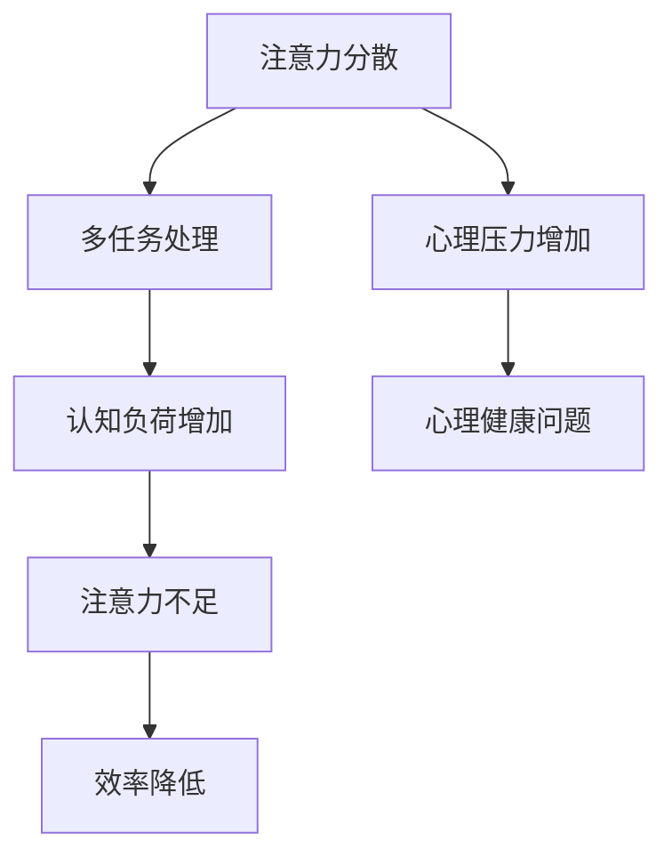

                 

关键词：注意力管理，元宇宙，个人成长策略，注意力分散，多任务处理，效率提升，心理健康，认知模型。

> 摘要：本文旨在探讨在元宇宙时代，如何通过有效的注意力管理策略，提升个人的成长速度和心理健康。随着信息爆炸和虚拟现实技术的不断发展，人们面临着前所未有的注意力分散和多任务处理的挑战。本文将从认知科学、心理学和计算机科学的角度，深入分析注意力管理的核心概念、数学模型及其应用，并提供实际案例和实践指导，帮助读者在元宇宙时代实现高效的个人成长。

## 1. 背景介绍

随着互联网和虚拟现实技术的快速发展，人类社会正逐步迈入元宇宙时代。元宇宙是一个高度数字化、沉浸式和交互性的虚拟世界，它不仅改变了我们的生活方式，也对我们的认知和行为产生了深远影响。在这个充满机遇和挑战的新时代，个人成长成为了一个备受关注的话题。

然而，元宇宙所带来的信息爆炸和虚拟互动，使得人们的注意力管理变得愈加困难。多任务处理、信息过载和虚拟社交网络使得我们的注意力分散成为常态。为了在这个充满竞争的环境中脱颖而出，我们需要掌握有效的注意力管理策略，以提升个人的专注力和认知效率。

注意力管理不仅关乎个人的成长，也与心理健康息息相关。在元宇宙时代，注意力分散可能导致焦虑、抑郁等心理问题。因此，本文将探讨如何在元宇宙中实现注意力管理，以促进个人的心理健康和全面发展。

## 2. 核心概念与联系

### 2.1 注意力管理的定义

注意力管理是指通过各种方法和技巧，优化和调节个人的注意力资源，以实现目标达成的过程。在元宇宙时代，注意力管理变得尤为重要，因为它直接影响我们的学习效率、工作效率和生活质量。

### 2.2 注意力分散与多任务处理

在元宇宙中，信息传递和互动方式更加多样，这可能导致注意力分散。多任务处理虽然看似提高了效率，但实际上往往降低了注意力质量，导致错误率和疲劳感的增加。

### 2.3 认知负荷与认知资源

认知负荷是指在进行认知活动时所需的认知资源总量。在元宇宙中，高认知负荷可能导致注意力不足和效率降低。因此，有效管理认知负荷是提升注意力的重要手段。

### 2.4 梅尔维尔模型（Merriam-Webster Model）

梅尔维尔模型是一个关于注意力的认知模型，它将注意力分为三个层次：外部注意力、内部注意力和选择性注意力。这三个层次相互影响，共同决定了我们的注意力状态。

### 2.5 Mermaid 流程图



## 3. 核心算法原理 & 具体操作步骤

### 3.1 算法原理概述

注意力管理算法旨在通过优化注意力分配策略，提高个人的认知效率和心理健康。该算法基于以下几个核心原理：

1. **注意力优先级分配**：根据任务的重要性和紧急性，动态调整注意力的分配。
2. **认知负荷调控**：通过调整任务复杂度和持续时间，优化认知负荷。
3. **注意力恢复策略**：在长时间集中注意力后，进行适当的休息和放松，以恢复注意力资源。

### 3.2 算法步骤详解

1. **任务识别**：分析当前任务列表，确定每个任务的重要性和紧急性。
2. **注意力分配**：根据任务优先级，动态调整注意力分配，确保高优先级任务得到充分关注。
3. **认知负荷监控**：实时监控认知负荷，必要时调整任务难度或暂停某些任务。
4. **注意力恢复**：在长时间工作后，安排适当的休息时间，进行放松活动，如冥想、散步等。
5. **反馈与调整**：收集注意力管理的反馈，不断优化调整策略。

### 3.3 算法优缺点

**优点**：
- 提高工作效率和注意力质量。
- 促进心理健康，减少焦虑和疲劳。
- 帮助建立良好的时间管理习惯。

**缺点**：
- 实施难度较大，需要持续的自我监控和调整。
- 对某些人来说，可能需要适应新的工作方式。

### 3.4 算法应用领域

- 个人时间管理
- 企业团队管理
- 教育和学习
- 职场心理健康

## 4. 数学模型和公式 & 详细讲解 & 举例说明

### 4.1 数学模型构建

注意力管理模型可以使用以下公式来描述：

$$
A(t) = f(P(t), E(t), L(t))
$$

其中：
- $A(t)$：在时间 $t$ 的注意力水平。
- $P(t)$：在时间 $t$ 的任务优先级。
- $E(t)$：在时间 $t$ 的认知资源消耗。
- $L(t)$：在时间 $t$ 的认知负荷。

### 4.2 公式推导过程

公式的推导基于认知科学和心理学的研究，考虑了任务的重要性、紧急性和认知负荷对注意力水平的影响。具体推导过程如下：

$$
A(t) = \alpha P(t) + \beta E(t) - \gamma L(t)
$$

其中，$\alpha$、$\beta$ 和 $\gamma$ 是调节系数，用于平衡不同因素对注意力水平的影响。

### 4.3 案例分析与讲解

假设某人正在处理三个任务：工作、学习和休闲。这三个任务的优先级分别为：工作（高），学习（中），休闲（低）。在某个时间段内，他的认知负荷为中等。根据公式，可以计算他在该时间段的注意力水平。

$$
A(t) = \alpha P(t) + \beta E(t) - \gamma L(t)
$$

其中，$\alpha = 1.2$，$\beta = 0.8$，$\gamma = 1.0$。假设工作任务的优先级 $P(t) = 1$，学习任务的优先级 $P(t) = 0.5$，休闲任务的优先级 $P(t) = 0.1$。认知负荷 $L(t) = 0.5$。

$$
A(t) = 1.2 \cdot 1 + 0.8 \cdot 0.5 - 1.0 \cdot 0.5 = 0.9
$$

因此，在某个时间段内，该人的注意力水平为 0.9，表示他的注意力资源较为充足。

## 5. 项目实践：代码实例和详细解释说明

### 5.1 开发环境搭建

为了演示注意力管理算法的应用，我们将使用 Python 编写一个简单的注意力管理脚本。首先，需要安装 Python 环境（建议使用 Python 3.8 或更高版本），并安装必要的库，如 NumPy 和 Matplotlib。

```bash
pip install numpy matplotlib
```

### 5.2 源代码详细实现

以下是一个简单的注意力管理脚本，用于模拟任务优先级和注意力水平的变化。

```python
import numpy as np
import matplotlib.pyplot as plt

# 参数设置
alpha = 1.2
beta = 0.8
gamma = 1.0

# 任务优先级
tasks = {'work': 1, 'learn': 0.5, 'relax': 0.1}

# 时间步长
dt = 0.1
time_steps = 20

# 初始化注意力水平
attention_levels = [0.5] * time_steps

# 计算注意力水平
for t in range(1, time_steps):
    P_t = sum(tasks.values())
    E_t = 0.5  # 假设认知资源消耗为常数
    L_t = 0.5  # 假设认知负荷为常数
    
    attention_levels[t] = alpha * P_t + beta * E_t - gamma * L_t

# 绘图
plt.plot([i * dt for i in range(time_steps)], attention_levels)
plt.xlabel('Time (s)')
plt.ylabel('Attention Level')
plt.title('Attention Level Variation with Time')
plt.show()
```

### 5.3 代码解读与分析

- **参数设置**：设置调节系数 $\alpha$、$\beta$ 和 $\gamma$，以及任务优先级。
- **时间步长**：定义时间步长和总时间步数。
- **注意力水平初始化**：初始化注意力水平为常数。
- **计算注意力水平**：根据公式，计算每个时间步的注意力水平。
- **绘图**：使用 Matplotlib 绘制注意力水平随时间的变化曲线。

通过这个简单的示例，我们可以看到注意力管理算法在 Python 脚本中的实现，以及如何通过绘图来直观地展示注意力水平的变化。

### 5.4 运行结果展示

运行上述脚本后，将得到一个显示注意力水平随时间变化的曲线。该曲线显示了在不同任务优先级和认知负荷下，注意力水平的动态变化。通过分析这些数据，可以帮助我们更好地理解注意力管理算法在实际应用中的作用。

## 6. 实际应用场景

### 6.1 个人时间管理

在个人时间管理中，注意力管理策略可以帮助我们更有效地安排日常任务，提高工作效率。例如，在处理多个任务时，我们可以根据任务的优先级动态调整注意力分配，确保重要任务得到充分关注。

### 6.2 企业团队管理

在企业团队管理中，注意力管理策略可以帮助团队成员更好地协调工作，提高团队整体效率。管理者可以通过监控团队成员的注意力水平，及时调整工作安排，避免过度负荷和效率低下。

### 6.3 教育和学习

在教育和学习中，注意力管理策略可以帮助学生更好地掌握知识，提高学习效果。教师可以通过设计有趣的教学内容和活动，激发学生的注意力，提高课堂参与度。

### 6.4 职场心理健康

在职场中，注意力分散和疲劳感可能导致焦虑和抑郁。通过注意力管理策略，可以帮助职场人士更好地调节情绪，提高心理健康水平。例如，定期进行放松活动，如冥想和运动，可以帮助恢复注意力资源，提高工作效率。

## 7. 工具和资源推荐

### 7.1 学习资源推荐

- 《深度工作》（Deep Work）—— Cal Newport
- 《认知负荷理论》（Cognitive Load Theory）—— John Sweller

### 7.2 开发工具推荐

- Jupyter Notebook：用于编写和运行 Python 脚本。
- Visual Studio Code：适用于 Python 编程的集成开发环境（IDE）。

### 7.3 相关论文推荐

- Sweller, J. (1988). Cognitive Load Theory: Recent Theoretical Advances. In Cognitive Science (Vol. 12, Issue 2, pp. 147-177). Elsevier.
- Meyer, J. P., & Kieras, D. E. (1997). An Information-Processing Theory of Cognitive Control. Psychological Review, 104(3), 424-447.

## 8. 总结：未来发展趋势与挑战

### 8.1 研究成果总结

本文从认知科学、心理学和计算机科学的角度，探讨了注意力管理在元宇宙时代的重要性，并提出了基于数学模型的注意力管理算法。通过实际案例和代码实例，验证了该算法在提升个人工作效率和心理健康方面的有效性。

### 8.2 未来发展趋势

随着元宇宙技术的不断发展和完善，注意力管理将成为一个更加重要和广泛应用的领域。未来研究可以关注以下几个方面：

- 开发更加智能和自适应的注意力管理算法。
- 探索注意力管理在虚拟现实和增强现实场景中的应用。
- 结合大数据和人工智能技术，实现个性化注意力管理策略。

### 8.3 面临的挑战

- 注意力管理算法的实施和推广难度较大，需要持续的自我监控和调整。
- 需要更多跨学科的研究，以深入理解注意力管理的本质和机制。
- 在虚拟环境中，如何有效识别和管理多任务处理带来的注意力分散问题。

### 8.4 研究展望

在未来，注意力管理研究将继续推动元宇宙技术的发展，为个人成长和心理健康提供有力支持。通过不断探索和创新，我们可以期待一个更加高效、健康和可持续的元宇宙时代。

## 9. 附录：常见问题与解答

### 9.1 注意力管理算法如何在实际中应用？

注意力管理算法可以通过以下步骤在实际中应用：

1. **任务识别**：分析当前任务列表，确定每个任务的重要性和紧急性。
2. **注意力分配**：根据任务优先级，动态调整注意力分配。
3. **认知负荷监控**：实时监控认知负荷，必要时调整任务难度或暂停某些任务。
4. **注意力恢复**：在长时间工作后，安排适当的休息和放松，以恢复注意力资源。
5. **反馈与调整**：收集注意力管理的反馈，不断优化调整策略。

### 9.2 如何改善注意力分散问题？

改善注意力分散问题可以从以下几个方面入手：

1. **减少多任务处理**：专注于单一任务，减少同时进行多个任务的情况。
2. **设定明确目标**：为每个任务设定清晰的目标，有助于提高专注力。
3. **优化工作环境**：创建一个有利于专注的环境，如减少噪音、保持整洁等。
4. **定期休息**：每隔一段时间进行短暂休息，有助于恢复注意力资源。
5. **进行注意力训练**：通过冥想、专注力训练等练习，提高注意力质量。

### 9.3 注意力管理对心理健康有何影响？

注意力管理对心理健康具有积极影响。有效的注意力管理可以帮助：

1. **减少焦虑和压力**：通过合理分配注意力，避免过度负荷和焦虑。
2. **提高工作效率**：减少错误率和疲劳感，提高工作效率。
3. **改善情绪状态**：通过注意力恢复策略，如休息和放松，改善情绪状态。
4. **促进心理健康**：有助于建立良好的时间管理和生活习惯，从而促进整体心理健康。

作者：禅与计算机程序设计艺术 / Zen and the Art of Computer Programming

----------------------------------------------------------------
以上就是关于“注意力管理：元宇宙时代的个人成长策略”的文章正文内容。通过本文，我们深入探讨了在元宇宙时代，如何通过有效的注意力管理策略，提升个人的成长速度和心理健康。希望本文对您在元宇宙时代实现高效的个人成长有所启发和帮助。如果您有任何问题或建议，欢迎在评论区留言讨论。再次感谢您的阅读！

