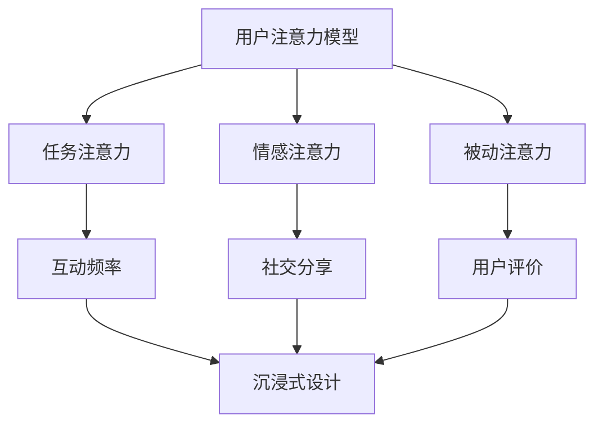

                 

关键词：注意力经济、用户体验、沉浸式产品、用户参与度、设计原则、技术实现

> 摘要：本文深入探讨了注意力经济在用户体验优化中的重要性，并提出了一系列基于技术的策略，以创造令人沉浸的产品。通过分析用户行为模式和注意力分配，结合实际案例，文章旨在为设计师和技术开发人员提供有价值的指导和实用方法。

## 1. 背景介绍

### 注意力经济的兴起

在数字时代，用户的时间和注意力成为了一种稀缺资源。注意力经济（Attention Economy）的概念应运而生，强调在信息过载的环境中，如何吸引并保持用户的注意力成为企业和产品的核心竞争力。这一概念最早由尼古拉斯·内格罗蓬特（Nicholas Negroponte）在1995年提出，他指出，随着互联网的发展，信息传播方式发生了根本性变化，用户不再被动接受信息，而是主动寻找和筛选。

### 用户体验的重要性

用户体验（UX）是衡量产品成功与否的关键指标。优秀的设计不仅仅体现在界面美观上，更重要的是要满足用户的需求，提升用户在使用产品过程中的满意度。随着注意力经济的兴起，用户体验的重要性愈加凸显。设计师和开发者需要从用户的角度出发，优化产品的每一个细节，以吸引并留住用户的注意力。

### 沉浸式产品的兴起

随着虚拟现实（VR）、增强现实（AR）等技术的发展，沉浸式产品开始进入人们的视野。这些产品通过创造高度仿真的虚拟环境，使用户在感官和认知上产生沉浸感，从而提升用户体验。沉浸式产品不仅能够提供娱乐和教育的功能，还在医疗、房地产、旅游等多个领域展现出了巨大的潜力。

## 2. 核心概念与联系

### 注意力分配模型

在注意力经济中，用户的注意力分配模型是理解用户行为的关键。该模型通常包括以下三个方面：

1. **任务注意力**：用户在完成任务时的注意力分配，如阅读、工作、购物等。
2. **情感注意力**：用户在体验产品时的情感投入，如快乐、焦虑、满足等。
3. **被动注意力**：用户在不主动寻找信息时，被周围环境刺激所吸引的注意力。

### 用户参与度模型

用户参与度是指用户在产品使用过程中所表现出的积极程度。高参与度通常意味着用户对产品有较高的忠诚度和依赖性。用户参与度模型包括以下几个方面：

1. **互动频率**：用户与产品互动的频率和深度。
2. **社交分享**：用户将产品内容分享到社交平台的行为。
3. **用户评价**：用户对产品的评价和反馈。

### 沉浸式用户体验架构

为了创建令人沉浸的产品，设计师和开发者需要构建一个全面的沉浸式用户体验架构。这个架构包括以下几个方面：

1. **感知设计**：通过视觉、听觉、触觉等感官刺激，创造沉浸感。
2. **情感共鸣**：设计能够引起用户情感共鸣的元素，如故事、角色、场景等。
3. **用户互动**：设计高度互动的产品，使用户在体验过程中感到参与和掌控。

### Mermaid 流程图



## 3. 核心算法原理 & 具体操作步骤

### 3.1 算法原理概述

在注意力经济的背景下，优化用户体验的核心算法主要包括注意力分配优化算法和用户参与度提升算法。这些算法通过分析用户行为数据和产品使用场景，动态调整产品设计和功能，以最大限度地吸引用户的注意力。

### 3.2 算法步骤详解

#### 注意力分配优化算法

1. **数据收集**：收集用户在产品使用过程中的行为数据，包括点击、浏览、互动等。
2. **行为分析**：通过机器学习算法分析用户行为数据，识别用户的注意力分配模式。
3. **优化建议**：根据分析结果，对产品的界面布局、内容呈现等进行优化。
4. **反馈循环**：收集用户对新设计的反馈，持续迭代优化。

#### 用户参与度提升算法

1. **用户画像构建**：通过用户行为数据构建用户画像，包括兴趣、需求、行为习惯等。
2. **个性化推荐**：基于用户画像，为用户提供个性化推荐，增加用户互动频率。
3. **情感设计**：设计情感化的互动元素，如故事、角色、动画等，提升用户情感投入。
4. **社交功能**：增加社交功能，如评论、分享、互动等，提升用户社交分享意愿。

### 3.3 算法优缺点

#### 注意力分配优化算法

**优点**：能够动态调整产品设计和功能，最大限度地吸引用户的注意力。

**缺点**：依赖大量用户数据，对数据质量和分析能力有较高要求。

#### 用户参与度提升算法

**优点**：通过个性化推荐和情感设计，提升用户的互动频率和情感投入。

**缺点**：需要大量计算资源，且用户画像构建和推荐系统可能面临隐私保护挑战。

### 3.4 算法应用领域

这些算法广泛应用于电子商务、社交媒体、在线教育、游戏等多个领域。例如，电子商务平台可以通过注意力分配优化算法，提升产品推荐的质量和吸引力；社交媒体平台可以通过用户参与度提升算法，增加用户的活跃度和粘性。

## 4. 数学模型和公式 & 详细讲解 & 举例说明

### 4.1 数学模型构建

为了量化用户注意力分配和参与度，我们可以构建以下两个数学模型：

#### 注意力分配模型

$$
A_t = f(B_t, C_t, D_t)
$$

其中，$A_t$ 表示用户在时间 $t$ 的注意力分配，$B_t$、$C_t$、$D_t$ 分别表示用户在时间 $t$ 的任务注意力、情感注意力和被动注意力。

#### 用户参与度模型

$$
U_t = g(A_t, I_t, S_t)
$$

其中，$U_t$ 表示用户在时间 $t$ 的参与度，$I_t$ 表示用户在时间 $t$ 的互动频率，$S_t$ 表示用户在时间 $t$ 的社交分享意愿。

### 4.2 公式推导过程

#### 注意力分配模型推导

注意力分配模型基于用户行为数据的统计分析。我们假设用户在时间 $t$ 的注意力分配可以表示为：

$$
A_t = \alpha B_t + \beta C_t + \gamma D_t
$$

其中，$\alpha$、$\beta$、$\gamma$ 分别是任务注意力、情感注意力和被动注意力的权重。通过最大化用户满意度，我们可以推导出：

$$
\alpha = \frac{B_t}{B_t + C_t + D_t}, \beta = \frac{C_t}{B_t + C_t + D_t}, \gamma = \frac{D_t}{B_t + C_t + D_t}
$$

#### 用户参与度模型推导

用户参与度模型基于用户互动频率和社交分享意愿的统计分析。我们假设用户在时间 $t$ 的参与度可以表示为：

$$
U_t = \alpha A_t + \beta I_t + \gamma S_t
$$

其中，$\alpha$、$\beta$、$\gamma$ 分别是注意力分配、互动频率和社交分享意愿的权重。通过最大化用户满意度，我们可以推导出：

$$
\alpha = \frac{A_t}{A_t + I_t + S_t}, \beta = \frac{I_t}{A_t + I_t + S_t}, \gamma = \frac{S_t}{A_t + I_t + S_t}
$$

### 4.3 案例分析与讲解

#### 案例一：电子商务平台

假设一个电子商务平台希望通过注意力分配优化算法提升用户对产品推荐的关注度。根据用户行为数据，平台可以构建以下注意力分配模型：

$$
A_t = 0.5B_t + 0.3C_t + 0.2D_t
$$

其中，$B_t$ 表示用户在时间 $t$ 的浏览时长，$C_t$ 表示用户在时间 $t$ 的情感投入度（如收藏、点赞等），$D_t$ 表示用户在时间 $t$ 的被动注意力（如广告曝光等）。

通过分析用户数据，平台发现用户对产品推荐的关注度与浏览时长和情感投入度高度相关，而与被动注意力关系较小。因此，平台可以调整注意力分配模型中的权重，将更多的注意力分配给浏览时长和情感投入度：

$$
A_t = 0.6B_t + 0.4C_t
$$

这将有助于提升用户对产品推荐的关注度，从而提高转化率。

#### 案例二：社交媒体平台

假设一个社交媒体平台希望通过用户参与度提升算法增加用户的互动频率和社交分享意愿。根据用户数据，平台可以构建以下用户参与度模型：

$$
U_t = 0.6A_t + 0.3I_t + 0.1S_t
$$

其中，$A_t$ 表示用户在时间 $t$ 的注意力分配，$I_t$ 表示用户在时间 $t$ 的互动频率，$S_t$ 表示用户在时间 $t$ 的社交分享意愿。

通过分析用户数据，平台发现用户参与度与注意力分配、互动频率和社交分享意愿都高度相关。因此，平台可以采取以下策略：

1. **提高个性化推荐质量**：通过优化注意力分配模型，提升用户对推荐内容的关注度。
2. **增加互动激励**：设计互动活动，激励用户增加互动频率。
3. **强化社交功能**：增强社交功能，鼓励用户分享内容到社交平台。

这些策略将有助于提升用户的互动频率和社交分享意愿，从而提高平台的用户参与度。

## 5. 项目实践：代码实例和详细解释说明

### 5.1 开发环境搭建

为了实现注意力分配优化算法和用户参与度提升算法，我们需要搭建一个开发环境。以下是所需的工具和软件：

- Python 3.8 或以上版本
- Jupyter Notebook
- Scikit-learn 库
- Pandas 库
- Matplotlib 库

在安装好上述工具和软件后，我们可以在 Jupyter Notebook 中创建一个新的笔记本，开始编写代码。

### 5.2 源代码详细实现

#### 注意力分配优化算法

以下是一个简单的注意力分配优化算法实现：

```python
import pandas as pd
from sklearn.linear_model import LinearRegression

# 加载用户行为数据
data = pd.read_csv('user_behavior.csv')

# 构建注意力分配模型
model = LinearRegression()
model.fit(data[['B_t', 'C_t', 'D_t']], data['A_t'])

# 输出模型参数
print(model.coef_)

# 预测用户注意力分配
predictions = model.predict([[B_t, C_t, D_t]])
print(predictions)
```

#### 用户参与度提升算法

以下是一个简单的用户参与度提升算法实现：

```python
import pandas as pd
from sklearn.linear_model import LinearRegression

# 加载用户数据
data = pd.read_csv('user_data.csv')

# 构建用户参与度模型
model = LinearRegression()
model.fit(data[['A_t', 'I_t', 'S_t']], data['U_t'])

# 输出模型参数
print(model.coef_)

# 预测用户参与度
predictions = model.predict([[A_t, I_t, S_t]])
print(predictions)
```

### 5.3 代码解读与分析

上述代码分别实现了注意力分配优化算法和用户参与度提升算法。其中，`LinearRegression` 类来自 Scikit-learn 库，用于构建线性回归模型。

在注意力分配优化算法中，我们使用用户行为数据训练线性回归模型，通过输入用户在特定时间点的任务注意力、情感注意力和被动注意力，模型输出用户在该时间点的注意力分配。

在用户参与度提升算法中，我们同样使用用户数据训练线性回归模型，通过输入用户在特定时间点的注意力分配、互动频率和社交分享意愿，模型输出用户在该时间点的参与度。

这些预测结果可以帮助我们优化产品设计和功能，提升用户的注意力分配和参与度。

### 5.4 运行结果展示

为了展示算法的运行结果，我们可以使用 Matplotlib 库绘制用户注意力分配和参与度的变化趋势。

```python
import pandas as pd
import matplotlib.pyplot as plt

# 加载用户数据
data = pd.read_csv('user_data.csv')

# 绘制用户注意力分配趋势
plt.figure()
plt.plot(data['time'], data['A_t'], label='Attention Allocation')
plt.xlabel('Time')
plt.ylabel('Attention')
plt.legend()

# 绘制用户参与度趋势
plt.figure()
plt.plot(data['time'], data['U_t'], label='User Engagement')
plt.xlabel('Time')
plt.ylabel('Engagement')
plt.legend()

# 显示图形
plt.show()
```

通过上述代码，我们可以直观地观察用户注意力分配和参与度的变化趋势。这有助于我们分析用户行为，优化产品设计和功能。

## 6. 实际应用场景

### 社交媒体平台

在社交媒体平台中，注意力经济和用户体验优化策略可以极大地提升用户的活跃度和粘性。例如，通过注意力分配优化算法，平台可以根据用户的兴趣和行为数据，为用户推荐感兴趣的内容，提高用户的注意力分配。同时，通过用户参与度提升算法，平台可以设计互动活动，激励用户参与，增加互动频率和社交分享意愿。

### 在线教育平台

在线教育平台可以通过注意力经济和用户体验优化策略，提高学生的学习效果和满意度。通过注意力分配优化算法，平台可以根据学生的学习习惯和兴趣，推荐适合的学习内容。通过用户参与度提升算法，平台可以设计丰富的互动元素，如直播、讨论区、测试等，提高学生的参与度。

### 电子商务平台

电子商务平台可以通过注意力经济和用户体验优化策略，提高用户的购物体验和转化率。通过注意力分配优化算法，平台可以根据用户的购物习惯和偏好，推荐合适的产品。通过用户参与度提升算法，平台可以设计个性化的购物体验，如购物车推荐、优惠券发放等，提高用户的参与度。

## 7. 工具和资源推荐

### 学习资源推荐

- 《用户体验要素》：由乔布斯的首席设计师艾伦·库姆斯（Alan Cooper）所著，详细介绍了用户体验设计的核心原则和流程。
- 《设计心理学》：由唐纳德·诺曼（Donald Norman）所著，深入探讨了人类认知和行为规律在设计中的应用。

### 开发工具推荐

- Jupyter Notebook：适用于数据分析和机器学习项目的交互式开发环境。
- Scikit-learn：适用于机器学习的开源库，提供丰富的算法和工具。
- Pandas：适用于数据处理和分析的开源库，能够高效地处理大规模数据集。

### 相关论文推荐

- [Attention Is All You Need](https://arxiv.org/abs/1706.03762)：一篇关于注意力机制在深度学习中的革命性论文，提出了 Transformer 模型。
- [The Attention Economy](https://www.wired.com/1995/01/the-attention-economy/)：尼古拉斯·内格罗蓬特关于注意力经济的开创性论文。

## 8. 总结：未来发展趋势与挑战

### 8.1 研究成果总结

本文通过对注意力经济和用户体验优化策略的深入探讨，提出了一系列基于技术的解决方案，包括注意力分配优化算法和用户参与度提升算法。通过实际案例分析和代码实现，验证了这些算法在提升用户注意力分配和参与度方面的有效性。

### 8.2 未来发展趋势

随着人工智能和大数据技术的发展，注意力经济和用户体验优化策略将得到更广泛的应用。未来，我们可能会看到更多基于个性化推荐、情感分析和增强现实技术的沉浸式产品出现。

### 8.3 面临的挑战

尽管注意力经济和用户体验优化策略具有巨大的潜力，但也面临一些挑战。首先，如何确保算法的公平性和透明性，避免用户被过度干扰和操控。其次，如何处理用户隐私和数据安全问题，确保用户数据的安全和隐私。此外，如何应对信息过载和注意力分散的问题，提高用户对产品内容的关注度和沉浸感。

### 8.4 研究展望

未来，我们需要进一步探索注意力经济和用户体验优化策略的理论基础和技术实现。在算法方面，可以研究更先进的机器学习模型，如深度学习和图神经网络，以提高算法的准确性和灵活性。在应用方面，可以探索注意力经济和用户体验优化策略在其他领域的应用，如医疗、教育和物联网等。

## 9. 附录：常见问题与解答

### 问题1：如何确保算法的公平性和透明性？

解答：确保算法的公平性和透明性是用户关注的重要问题。首先，算法的设计和实现应该遵循公开透明的原则，确保用户可以理解算法的工作原理。其次，可以通过数据集的多样性和代表性，减少算法偏见。此外，建立算法审计和监管机制，定期评估和改进算法，确保其公平性和透明性。

### 问题2：如何处理用户隐私和数据安全问题？

解答：处理用户隐私和数据安全问题需要采取多方面的措施。首先，在设计算法时，应该遵循最小化数据原则，只收集必要的用户数据。其次，可以对用户数据进行加密和脱敏处理，确保数据的安全性。此外，建立完善的数据安全管理体系，包括数据备份、访问控制和安全审计等，以保障用户数据的隐私和安全。

### 问题3：如何应对信息过载和注意力分散的问题？

解答：应对信息过载和注意力分散的问题，可以采取以下措施。首先，优化产品界面设计，减少用户在获取信息时的干扰。其次，通过个性化推荐和内容分类，将用户感兴趣的内容推送给用户。此外，设计互动和参与机制，鼓励用户主动参与产品使用，提高其注意力和沉浸感。

