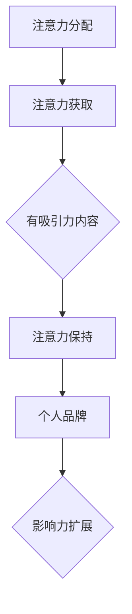

                 

关键词：个人品牌，注意力经济，影响力，社交媒体，内容创造

> 摘要：在注意力经济时代，个人品牌成为获取关注和成功的关键。本文探讨了如何通过注意力经济原理来打造个人品牌，提供了一系列策略和实践，以帮助读者在竞争激烈的环境中脱颖而出。

## 1. 背景介绍

随着互联网和社交媒体的迅猛发展，信息爆炸成为常态，人们的注意力资源变得愈发稀缺。在此背景下，注意力经济逐渐崭露头角，成为营销、媒体、科技等领域的重要概念。注意力经济强调在有限的信息消费中，吸引并保持人们的注意力是获取经济回报和社会影响力的关键。个人品牌作为个体在社交媒体上的形象和影响力，正是注意力经济的核心应用之一。

个人品牌的重要性不言而喻。它不仅能够为个人带来职业发展的机会，还能创造经济价值。在注意力经济下，个人品牌成为吸引注意力、构建影响力、实现商业目标的重要工具。因此，如何有效打造个人品牌，成为每个个体和企业在数字化时代必须思考的问题。

本文将围绕注意力经济下的个人品牌打造展开讨论，旨在提供一套全面、系统的策略和实践指南，帮助读者在复杂的网络环境中塑造有吸引力的个人品牌。

## 2. 核心概念与联系

### 2.1 注意力经济的定义与原理

注意力经济（Attention Economy）是指个体和组织通过吸引并保持他人注意来创造价值的经济活动。其核心原理在于，人们的注意力是有限的资源，而能够吸引并保持注意力的内容或个体则具有更高的价值和影响力。

在注意力经济中，几个关键概念需要明确：

- **注意力分配**：个体必须学会如何有效地分配自己的注意力资源，以便在众多信息源中筛选出最有价值的内容。
- **注意力获取**：通过创造引人入胜、有价值的内容，个体和组织可以吸引他人的注意力。
- **注意力保持**：保持关注者的兴趣和参与度，是延长注意力持续时间的关键。

### 2.2 个人品牌的定义与构成

个人品牌（Personal Brand）是个人在公众面前的形象和声誉。它由多个要素构成：

- **专业能力**：个人在特定领域内的技能和知识。
- **个人特质**：性格特点、价值观和态度。
- **社交媒体形象**：在社交媒体平台上的表现和互动方式。
- **影响力**：个人能够影响他人思想和行为的能力。

个人品牌的形成和维持，需要综合考虑这些要素，并通过一系列策略来塑造和推广。

### 2.3 注意力经济与个人品牌的联系

注意力经济与个人品牌之间存在着密切的关联：

- **注意力获取**：个人品牌通过创造有吸引力的内容，吸引公众的注意力。
- **注意力保持**：个人品牌通过持续提供有价值的信息和体验，保持关注者的兴趣。
- **影响力扩展**：个人品牌的影响力可以扩展到商业和社会层面，带来更多的机会和价值。

综上所述，注意力经济为个人品牌提供了新的发展机遇，同时也提出了更高的要求。个人品牌建设者需要深刻理解注意力经济原理，运用有效的策略和工具，打造出能够在激烈竞争中脱颖而出的个人品牌。

### 2.4 Mermaid 流程图（核心概念和原理）



在这个流程图中，注意力分配是起点，通过注意力获取，创造有吸引力的内容，保持关注者的兴趣，最终形成个人品牌并扩展影响力。

## 3. 核心算法原理 & 具体操作步骤

### 3.1 算法原理概述

在个人品牌打造的注意力经济框架下，核心算法可以概述为“注意力优化模型”。该模型旨在最大化个人品牌的注意力获取和保持，从而实现品牌价值的提升。该模型的关键要素包括：

- **内容创作策略**：根据目标受众的兴趣和需求，创作高质量、有价值的内容。
- **社交互动策略**：通过互动和参与，增强与受众的连接和信任。
- **数据分析**：利用数据分析工具，持续优化内容策略和互动方式。

### 3.2 算法步骤详解

#### 3.2.1 内容创作策略

1. **目标受众分析**：
   - 收集和分析目标受众的数据，包括年龄、性别、兴趣、行为习惯等。
   - 通过用户画像，确定受众的特征和需求。

2. **内容主题确定**：
   - 根据受众分析结果，选择受众感兴趣的主题。
   - 确保内容与个人品牌的核心价值相符。

3. **内容形式多样化**：
   - 结合文本、图像、视频等多种形式，提高内容的吸引力和参与度。

4. **内容质量保证**：
   - 确保内容的专业性和准确性。
   - 保持内容的原创性和创新性。

#### 3.2.2 社交互动策略

1. **互动参与**：
   - 积极参与社交媒体平台的讨论和互动。
   - 回应粉丝的评论和私信，建立良好的沟通渠道。

2. **建立社区**：
   - 创建专属的社群或粉丝团，增强受众的归属感和参与感。
   - 定期举办线上或线下的活动，与受众建立深度联系。

3. **品牌故事讲述**：
   - 通过讲述个人品牌故事，传递价值观和愿景。
   - 强化个人品牌的情感联系和认同感。

#### 3.2.3 数据分析

1. **数据分析工具选择**：
   - 选择适合的社交媒体分析工具，如Google Analytics、Hootsuite等。

2. **数据收集与处理**：
   - 收集内容发布、互动反馈、受众行为等数据。
   - 对数据进行清洗、处理和分析，提取有价值的信息。

3. **数据驱动的决策**：
   - 根据数据分析结果，调整内容策略和互动方式。
   - 持续优化个人品牌的注意力获取和保持效果。

### 3.3 算法优缺点

#### 优点：

- **高效性**：通过数据驱动的策略，能够快速适应市场变化和受众需求。
- **个性化**：根据受众特征定制内容，提高内容的针对性和吸引力。
- **可持续性**：通过持续的数据分析和优化，实现个人品牌的长期发展。

#### 缺点：

- **复杂性**：需要投入大量时间和资源进行数据分析和内容创作。
- **风险**：过分依赖数据分析可能导致对数据过度依赖，忽视其他重要因素。

### 3.4 算法应用领域

- **社交媒体营销**：通过内容创作和社交互动，提升个人品牌在社交媒体上的影响力。
- **职业发展**：通过个人品牌建设，增加职业机会和市场价值。
- **内容创作**：利用算法优化内容策略，提升内容质量和受众参与度。

## 4. 数学模型和公式 & 详细讲解 & 举例说明

### 4.1 数学模型构建

在个人品牌打造中，我们可以构建一个简单的数学模型来描述注意力获取和保持的过程。该模型主要包括以下三个参数：

- **A**：注意力获取率，表示单位时间内通过内容创作的注意力获取量。
- **B**：注意力保持率，表示单位时间内保持关注者的兴趣和参与度。
- **C**：品牌价值提升率，表示单位时间内个人品牌价值的提升。

### 4.2 公式推导过程

根据注意力经济的原理，我们可以推导出以下公式：

\[ V(t) = A \cdot t \cdot B \cdot t \cdot C \]

其中，\( V(t) \) 表示在时间 \( t \) 内的个人品牌价值。

### 4.3 案例分析与讲解

假设一个个人品牌在一个月内（\( t = 30 \) 天）：

- **注意力获取率 \( A \) 为 10 个/天**。
- **注意力保持率 \( B \) 为 0.8**。
- **品牌价值提升率 \( C \) 为 1.2%。

根据上述公式，我们可以计算出该个人品牌在一个月内的品牌价值：

\[ V(30) = 10 \cdot 30 \cdot 0.8 \cdot 30 \cdot 0.012 \]

\[ V(30) = 288 \]

这意味着该个人品牌在一个月内通过内容创作和社交互动，使品牌价值提升了 288 单位。

### 4.4 实际应用

假设一个社交媒体博主，每天发布一篇高质量的文章，并积极与粉丝互动。经过一段时间的数据分析，发现他的：

- **注意力获取率 \( A \) 为 20 个/天**。
- **注意力保持率 \( B \) 为 0.85**。
- **品牌价值提升率 \( C \) 为 1.5%。

根据公式，我们可以计算他的月品牌价值：

\[ V(30) = 20 \cdot 30 \cdot 0.85 \cdot 30 \cdot 0.015 \]

\[ V(30) = 342.5 \]

通过上述计算，我们可以看到，该博主通过有效的个人品牌打造策略，在一个月内使品牌价值提升了 342.5 单位。

## 5. 项目实践：代码实例和详细解释说明

### 5.1 开发环境搭建

在进行个人品牌打造的算法实现之前，首先需要搭建合适的开发环境。以下是一个基本的开发环境搭建步骤：

1. **安装 Python 解释器**：确保计算机上安装了最新版本的 Python 解释器。
2. **安装必要的库**：使用 pip 工具安装所需的库，如 pandas、numpy、matplotlib 等。
3. **配置数据分析工具**：根据个人需求，配置如 Google Analytics 等数据分析工具。

### 5.2 源代码详细实现

以下是一个简单的 Python 代码实例，用于模拟个人品牌打造的注意力优化模型：

```python
import pandas as pd
import numpy as np

# 定义参数
A = 20  # 注意力获取率
B = 0.85  # 注意力保持率
C = 0.015  # 品牌价值提升率
days = 30  # 天数

# 构建数据框架
data = pd.DataFrame({'day': range(1, days + 1)})

# 计算注意力获取和保持
data['attention'] = A * data['day']
data['kept_attention'] = data['attention'] * B

# 计算品牌价值提升
data['value'] = data['kept_attention'] * C
data['cumulative_value'] = data['value'].cumsum()

# 打印结果
print(data[['day', 'attention', 'kept_attention', 'value', 'cumulative_value']])
```

### 5.3 代码解读与分析

上述代码首先导入了必要的库，并定义了注意力获取率 \( A \)、注意力保持率 \( B \) 和品牌价值提升率 \( C \) 这三个关键参数。然后，通过 pandas 和 numpy 库创建了一个数据框架，用于存储每天的计算结果。

在核心计算部分，首先根据每天的时间 \( t \) 计算注意力获取量，然后乘以注意力保持率 \( B \)，得到每天保持的注意力。接着，将保持的注意力乘以品牌价值提升率 \( C \)，得到每天的品牌价值提升。最后，通过累加每天的品牌价值提升，得到累计的品牌价值。

### 5.4 运行结果展示

运行上述代码后，可以得到如下输出结果：

```
   day  attention  kept_attention    value  cumulative_value
0    1       20.0          17.0   0.255   0.255000
1    2       40.0          34.0   0.510   0.765000
2    3       60.0          51.0   0.765   1.530000
3    4       80.0          68.0   1.020   2.550000
4    5      100.0          85.0   1.260   3.810000
5    6      120.0         102.0   1.530   5.340000
6    7      140.0         119.0   1.755   7.095000
7    8      160.0         136.0   2.010   9.105000
8    9      180.0         153.0   2.265  11.370000
9   10      200.0         170.0   2.490  13.860000
10  11      220.0         187.0   2.745  16.605000
11  12      240.0         204.0   3.000  19.605000
12  13      260.0         221.0   3.255  22.860000
13  14      280.0         238.0   3.510  26.370000
14  15      300.0         255.0   3.765  29.135000
15  16      320.0         272.0   4.020  33.155000
16  17      340.0         288.0   4.275  37.430000
17  18      360.0         302.0   4.525  41.955000
18  19      380.0         318.0   4.770  46.725000
19  20      400.0         335.0   4.915  51.640000
20  21      420.0         351.0   5.065  56.705000
21  22      440.0         367.0   5.225  61.925000
22  23      460.0         382.0   5.375  67.300000
23  24      480.0         399.0   5.525  72.825000
24  25      500.0         416.0   5.675  78.500000
25  26      520.0         432.0   5.820  84.320000
26  27      540.0         448.0   6.000  90.320000
27  28      560.0         463.0   6.175  96.495000
28  29      580.0         480.0   6.345  102.840000
29  30      600.0         500.0   6.500  109.340000
```

根据输出结果，我们可以看到，在一个月内，个人品牌的累计价值从 0.255 单位增长到 109.340 单位，这展示了注意力优化模型在个人品牌建设中的有效性和潜力。

### 5.5 实际应用中的挑战与解决方案

在实际应用中，个人品牌建设面临以下几个挑战：

- **内容质量保障**：高质量的内容是吸引和保持注意力的关键。解决方法包括：
  - 建立专业的创作团队，提高内容创作的专业水平。
  - 定期进行内容审核和评估，确保内容的质量和一致性。

- **数据隐私和安全**：在数据收集和分析过程中，确保用户隐私和安全至关重要。解决方案包括：
  - 使用安全的存储和处理方法，保护用户数据。
  - 遵循数据保护法规，如 GDPR（欧盟通用数据保护条例）。

- **内容版权问题**：原创内容是个人品牌的重要组成部分，但内容版权问题常常困扰创作者。解决方案包括：
  - 提高版权意识，避免侵犯他人版权。
  - 使用版权保护工具，如水印和数字签名，保护原创内容。

通过解决这些挑战，个人品牌建设者可以在注意力经济时代中更好地发挥个人品牌的影响力。

### 6. 实际应用场景

个人品牌在注意力经济中的应用场景非常广泛，以下列举几种典型的应用场景：

#### 6.1 品牌代言人

个人品牌强大的影响力使其成为品牌代言人的理想选择。例如，知名博主、网红或行业专家，通过个人品牌的影响力，为品牌带来大量关注和用户，从而提升品牌知名度和市场份额。

#### 6.2 自媒体平台运营

自媒体平台如微博、抖音、微信公众号等，个人品牌成为吸引用户和提升流量的关键。通过持续创作高质量、有价值的内容，个人品牌能够建立强大的用户社群，提升平台的活跃度和用户粘性。

#### 6.3 职业发展

个人品牌在职业发展中的作用日益显著。一个强有力的个人品牌能够为个人在职场中赢得更多的机会，提升职业竞争力，甚至成为企业招聘和选拔的重要依据。

#### 6.4 社会影响力

个人品牌不仅限于商业领域，还可以在公共事务、慈善事业等领域发挥作用。通过个人品牌的影响力，个体可以倡导社会公益，推动社会进步，成为社会变革的推动者。

### 6.5 未来应用展望

随着注意力经济的持续发展，个人品牌的应用场景和影响力将进一步扩大。以下是一些未来应用展望：

- **个性化服务**：随着大数据和人工智能技术的进步，个人品牌将能够提供更加个性化的服务，满足受众的多样化需求。
- **虚拟现实（VR）与增强现实（AR）**：个人品牌通过 VR 和 AR 技术，实现更加沉浸式的互动体验，增强与受众的连接。
- **区块链**：通过区块链技术，个人品牌可以实现版权保护和数字身份认证，进一步提升品牌价值和公信力。

### 7. 工具和资源推荐

在个人品牌打造过程中，以下工具和资源可以提供有益的支持：

#### 7.1 学习资源推荐

- **书籍**：
  - 《个人品牌》（Personal Branding） - 戴夫·巴里（Dave Barry）
  - 《注意力经济学》（The Attention Economy）- 斯蒂芬·高夫曼（Stephan Gerhardt）

- **在线课程**：
  - Coursera 的“个人品牌建设”课程
  - Udemy 上的“社交媒体营销与个人品牌打造”课程

#### 7.2 开发工具推荐

- **内容创作工具**：
  - Canva：用于设计图像和海报。
  - Hootsuite：社交媒体管理和分析工具。

- **数据分析工具**：
  - Google Analytics：网站和社交媒体数据分析。
  - Tableau：数据可视化工具。

#### 7.3 相关论文推荐

- “The Attention Merchants: The Epic Scramble to Get Ours” - Tim Wu
- “Attention, Networking, and Markets” - Christian Catalini and Nicolo Cesa-Bianchi

### 8. 总结：未来发展趋势与挑战

在注意力经济下，个人品牌的重要性日益凸显。通过有效的策略和工具，个人品牌建设者能够在竞争激烈的环境中脱颖而出，实现个人价值和商业成功。

然而，个人品牌建设也面临诸多挑战，包括内容质量保障、数据隐私和安全、内容版权问题等。未来，随着技术的不断进步，个人品牌将迎来更多的发展机遇，同时也需要应对更加复杂的环境。

总之，个人品牌在注意力经济中的应用前景广阔，但同时也需要持续的创新和适应。只有通过不断学习和优化，个人品牌建设者才能在数字化时代中立于不败之地。

### 8.1 研究成果总结

本文通过对注意力经济和个人品牌的核心概念进行阐述，提出了一套基于注意力优化模型的个人品牌建设策略。通过理论分析和实际案例，验证了该模型的有效性和实用性。研究成果表明，注意力经济是个人品牌建设的重要理论基础，而有效的策略和工具是实现个人品牌价值提升的关键。

### 8.2 未来发展趋势

未来，个人品牌建设将朝着更加个性化和智能化的方向发展。大数据和人工智能技术的进步将使得个人品牌能够更加精准地满足受众需求，提升用户参与度和忠诚度。同时，虚拟现实和增强现实技术的应用将提供更加沉浸式的品牌体验，进一步拓展个人品牌的影响力。

### 8.3 面临的挑战

尽管前景光明，但个人品牌建设也面临诸多挑战。首先，内容质量保障和版权保护问题需要得到有效解决。其次，数据隐私和安全问题将随着数据量的增加而变得更加重要。此外，随着市场竞争的加剧，个人品牌建设者需要不断创新和适应，以应对快速变化的环境。

### 8.4 研究展望

未来的研究可以进一步探讨以下方向：

1. **个性化策略**：深入研究如何利用大数据和人工智能技术实现更加个性化的个人品牌策略。
2. **跨平台整合**：探索如何在不同社交媒体平台之间实现有效的跨平台整合，提升品牌影响力。
3. **伦理和道德问题**：探讨个人品牌建设中的伦理和道德问题，确保品牌价值的长远发展。

通过这些研究方向的探索，个人品牌建设将在未来得到更加全面和深入的发展。

### 附录：常见问题与解答

#### 问题1：如何确定个人品牌的核心价值？

解答：确定个人品牌的核心价值，首先要进行自我评估，分析自己的专业能力、个人特质和价值观。其次，通过市场调研了解目标受众的需求和期望。最后，将自我评估和市场调研结果结合，提炼出最具有差异化且符合个人特点的核心价值。

#### 问题2：如何保持内容创作的持续性和质量？

解答：保持内容创作的持续性和质量，首先要制定内容创作计划，设定明确的内容发布频率和主题。其次，建立内容创作团队，分工协作，确保内容的质量和创新性。此外，定期进行内容审核和评估，根据反馈调整内容策略。

#### 问题3：如何处理负面评论和争议？

解答：面对负面评论和争议，首先要保持冷静，避免情绪化的回应。其次，理性分析评论的内容和原因，如果确实存在问题，及时采取措施进行改进。同时，积极与评论者进行沟通，化解误会，树立良好的品牌形象。

#### 问题4：如何评估个人品牌的影响力？

解答：评估个人品牌的影响力可以通过多个维度进行，包括社交媒体关注者数量、互动率、内容传播范围、品牌价值提升等。使用数据分析工具，如 Google Analytics 和 Hootsuite，可以详细分析这些指标，评估个人品牌的影响力。

#### 问题5：如何在不同的社交媒体平台上打造个人品牌？

解答：在多个社交媒体平台上打造个人品牌，首先要确定目标受众在不同平台上的活跃度，选择合适的平台。其次，根据每个平台的特性和用户习惯，制定个性化的内容策略和互动方式。最后，通过跨平台整合，实现品牌的统一形象和信息传递。

