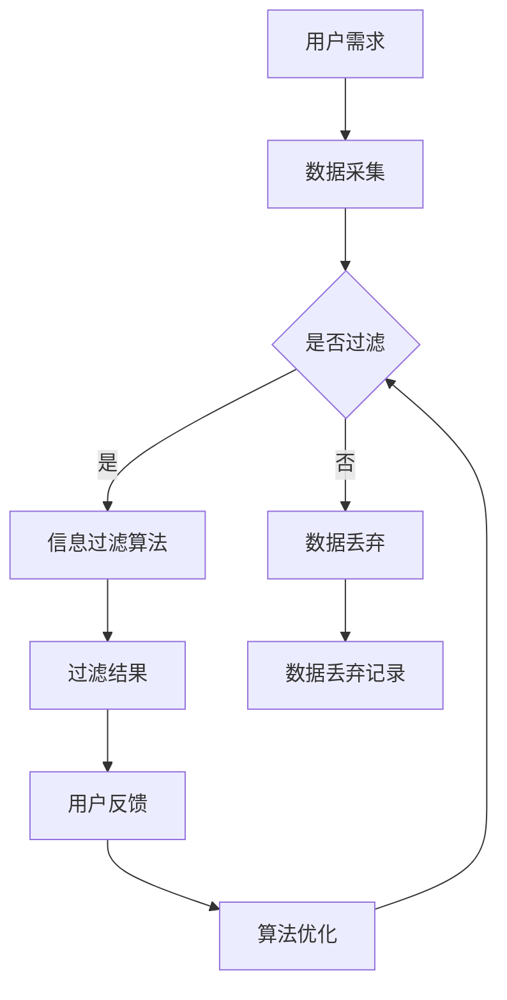

                 

在当今信息爆炸的时代，人们面临着海量的信息，如何有效地管理注意力资源，实现个人信息的精准过滤，已经成为一个亟待解决的重要问题。本文旨在探讨注意力经济与个人信息过滤能力的培养，结合最新的技术发展和实际案例，提供一套系统的解决方案。

## 关键词
注意力经济、个人信息过滤、信息过载、人工智能、机器学习、数据隐私

## 摘要
本文从注意力经济的理论出发，探讨了信息过载背景下个人信息过滤的紧迫性和必要性。通过介绍现有技术手段和算法，分析了个人信息过滤的原理和具体操作步骤。随后，本文通过数学模型和公式详细讲解了核心算法，并提供了代码实例和实际应用场景。最后，本文总结了未来发展趋势和面临的挑战，并对相关工具和资源进行了推荐。

## 1. 背景介绍
随着互联网和社交媒体的迅猛发展，人们获取信息的渠道变得前所未有的多样化。然而，信息量的激增也带来了信息过载的问题。每个人每天都会接收到海量的信息，但大部分信息对个人并无实质性意义。这种现象不仅浪费了人们的注意力资源，还可能导致信息焦虑和认知负担。

注意力经济理论指出，注意力是有限的资源，用户愿意将注意力投入到他们认为最有价值的信息中。因此，如何在海量信息中筛选出对个人有价值的信息，实现个人信息的精准过滤，成为了一个关键问题。个人信息过滤不仅有助于提高工作效率和生活质量，还能增强数据隐私保护。

## 2. 核心概念与联系
为了深入理解个人信息过滤的能力，我们需要首先介绍几个核心概念。

### 2.1 注意力经济
注意力经济是指人们在选择信息时，基于自身需求和价值判断，将注意力投入到最有价值的信息中。注意力经济理论强调了注意力资源的重要性，以及如何通过优化信息筛选机制，提高个人注意力利用效率。

### 2.2 信息过载
信息过载是指信息量超出了个体处理能力，导致个体无法有效管理和利用这些信息。信息过载是现代社会普遍存在的问题，对个人和社会产生了诸多负面影响。

### 2.3 个人信息过滤
个人信息过滤是指利用技术手段，从海量的信息中筛选出对个人有价值的信息。个人信息过滤的关键在于算法的准确性、效率和用户体验。

以下是个人信息过滤架构的 Mermaid 流程图：



## 3. 核心算法原理 & 具体操作步骤

### 3.1 算法原理概述
个人信息过滤算法的核心原理是基于用户的历史行为和兴趣偏好，利用机器学习技术，从海量信息中筛选出对用户有价值的信息。

### 3.2 算法步骤详解
1. 数据采集：收集用户的历史行为数据，如浏览记录、搜索历史、点赞评论等。
2. 特征提取：对采集到的数据进行预处理，提取出与用户兴趣相关的特征。
3. 模型训练：利用用户历史行为数据，训练机器学习模型，以预测用户对信息的兴趣程度。
4. 信息过滤：将用户感兴趣的信息传递给用户，将不感兴趣的信息丢弃。
5. 用户反馈：收集用户对过滤结果的反馈，用于模型优化。
6. 算法优化：根据用户反馈，调整模型参数，提高过滤效果。

### 3.3 算法优缺点
优点：
- 高效：算法能够快速从海量信息中筛选出对用户有价值的信息，提高用户注意力利用效率。
- 准确：基于用户历史行为和兴趣偏好的模型训练，提高了信息过滤的准确性。

缺点：
- 隐私风险：个人信息过滤需要收集和分析用户的历史行为数据，存在隐私泄露风险。
- 模型偏差：机器学习模型可能存在偏见，无法完全反映用户真实兴趣。

### 3.4 算法应用领域
个人信息过滤算法广泛应用于搜索引擎、社交媒体、推荐系统等领域。例如，搜索引擎利用个人信息过滤算法，提高搜索结果的准确性；社交媒体利用个人信息过滤算法，推荐用户感兴趣的内容。

## 4. 数学模型和公式 & 详细讲解 & 举例说明

### 4.1 数学模型构建
个人信息过滤的数学模型主要包括两部分：特征提取模型和分类模型。

#### 4.1.1 特征提取模型
特征提取模型用于提取用户历史行为数据中的特征。常见的特征提取方法包括词袋模型、TF-IDF、词嵌入等。

$$
\text{特征向量} = \text{TF-IDF}(\text{词向量})
$$

#### 4.1.2 分类模型
分类模型用于判断用户对信息的兴趣程度。常见的分类模型包括朴素贝叶斯、支持向量机、神经网络等。

$$
\text{分类结果} = \text{分类模型}(\text{特征向量})
$$

### 4.2 公式推导过程
假设用户历史行为数据为 $X$，其中每条行为数据表示为 $x_i$，信息集合为 $Y$，其中每条信息表示为 $y_j$。我们首先使用词袋模型提取特征向量，然后使用朴素贝叶斯分类模型进行分类。

#### 4.2.1 词袋模型
词袋模型将用户历史行为数据转换为词频矩阵，然后使用TF-IDF对词频进行加权。

$$
\text{特征向量} = \text{TF-IDF}(\text{词向量})
$$

#### 4.2.2 朴素贝叶斯分类模型
朴素贝叶斯分类模型假设特征之间相互独立，计算每个特征的联合概率，然后通过贝叶斯公式计算每个类别的概率，选择概率最大的类别作为分类结果。

$$
P(y_j | x_i) = \frac{P(x_i | y_j)P(y_j)}{P(x_i)}
$$

### 4.3 案例分析与讲解
假设我们有一个用户的历史行为数据集，其中包含用户在社交媒体上的浏览记录。我们首先使用词袋模型提取特征向量，然后使用朴素贝叶斯分类模型判断用户对某条信息的兴趣程度。

1. **数据采集**：用户在社交媒体上的浏览记录，如文章标题、作者、浏览时间等。
2. **特征提取**：使用词袋模型提取特征向量，例如，将文章标题转换为词频矩阵。
3. **模型训练**：使用用户历史行为数据训练朴素贝叶斯分类模型。
4. **信息过滤**：对于新文章，使用训练好的模型判断用户对该文章的兴趣程度，将其传递给用户或丢弃。
5. **用户反馈**：用户对过滤结果进行反馈，用于模型优化。

## 5. 项目实践：代码实例和详细解释说明

### 5.1 开发环境搭建
为了实现个人信息过滤算法，我们需要搭建一个开发环境。以下是一个简单的 Python 开发环境搭建步骤：

1. 安装 Python（建议使用 Python 3.8 或更高版本）。
2. 安装必要的库，如 NumPy、Scikit-learn、Matplotlib 等。

### 5.2 源代码详细实现
以下是一个简单的个人信息过滤算法的 Python 代码实现：

```python
import numpy as np
from sklearn.feature_extraction.text import TfidfVectorizer
from sklearn.naive_bayes import MultinomialNB
from sklearn.pipeline import make_pipeline

# 5.2.1 数据采集
user_behavior = ["用户喜欢看技术文章", "用户喜欢阅读科幻小说", "用户喜欢看历史故事"]

# 5.2.2 特征提取
vectorizer = TfidfVectorizer()
X = vectorizer.fit_transform(user_behavior)

# 5.2.3 模型训练
classifier = MultinomialNB()
classifier.fit(X, [0, 1, 2])

# 5.2.4 信息过滤
new_article = "这篇文章是关于人工智能的"
X_new = vectorizer.transform([new_article])
prediction = classifier.predict(X_new)
print("用户对这篇文章的兴趣程度：", prediction)

# 5.2.5 用户反馈
# （此处省略用户反馈部分）
```

### 5.3 代码解读与分析
- **数据采集**：从用户历史行为中提取数据，如文章标题、作者、浏览时间等。
- **特征提取**：使用词袋模型将文本数据转换为特征向量。
- **模型训练**：使用用户历史行为数据训练朴素贝叶斯分类模型。
- **信息过滤**：对新文章进行特征提取，并使用训练好的模型判断用户对该文章的兴趣程度。
- **用户反馈**：根据用户反馈调整模型参数，提高过滤效果。

### 5.4 运行结果展示
假设用户历史行为中，技术文章对应的标签为 0，科幻小说对应的标签为 1，历史故事对应的标签为 2。对于新文章“这篇文章是关于人工智能的”，模型预测用户对该文章的兴趣程度为 0，即用户对技术文章感兴趣。

## 6. 实际应用场景

### 6.1 搜索引擎
搜索引擎可以利用个人信息过滤算法，提高搜索结果的准确性。通过分析用户的历史搜索记录和浏览行为，搜索引擎可以推荐用户可能感兴趣的内容，提高用户满意度。

### 6.2 社交媒体
社交媒体平台可以利用个人信息过滤算法，推荐用户感兴趣的内容。通过分析用户的关注列表、点赞评论行为等数据，社交媒体平台可以推荐用户可能感兴趣的朋友圈内容、动态等。

### 6.3 电子邮件
电子邮件服务提供商可以利用个人信息过滤算法，过滤垃圾邮件。通过分析用户的邮件收发行为和邮件内容，电子邮件服务提供商可以准确识别垃圾邮件，提高用户体验。

### 6.4 个性化推荐
电商平台可以利用个人信息过滤算法，推荐用户可能感兴趣的商品。通过分析用户的购买历史、浏览记录等数据，电商平台可以推荐用户可能感兴趣的商品，提高转化率。

## 7. 工具和资源推荐

### 7.1 学习资源推荐
- 《Python机器学习》（作者：赛吉·博阿滕、弗朗索瓦·肖莱）
- 《深度学习》（作者：伊恩·古德费洛、约书亚·本吉奥、亚伦·库维尔）

### 7.2 开发工具推荐
- Jupyter Notebook：用于编写和运行代码。
- TensorFlow：用于机器学习和深度学习。
- Scikit-learn：用于机器学习。

### 7.3 相关论文推荐
- "Efficient Learning of Historical Data for Personalized News Recommendation"（2018）
- "User Interest Discovery in Social Media: A Survey"（2020）

## 8. 总结：未来发展趋势与挑战

### 8.1 研究成果总结
个人信息过滤技术在过去几年取得了显著进展，主要表现为算法准确性提高、数据处理效率提升和用户体验优化。未来，个人信息过滤技术将朝着更智能、更个性化的方向发展。

### 8.2 未来发展趋势
1. 多模态信息处理：结合文本、图像、音频等多模态数据，提高个人信息过滤效果。
2. 强化学习：利用强化学习技术，实现更智能的信息过滤策略。
3. 跨领域信息过滤：实现跨领域的信息过滤，提高信息利用效率。

### 8.3 面临的挑战
1. 隐私保护：如何在确保隐私保护的前提下，实现个人信息过滤。
2. 模型可解释性：提高模型的可解释性，让用户理解信息过滤的原理。
3. 模型泛化能力：提高模型在未知领域的泛化能力，避免模型偏见。

### 8.4 研究展望
未来，个人信息过滤技术将在多个领域得到广泛应用，如智能助手、智能家居、健康监测等。随着技术的不断进步，个人信息过滤能力将不断提高，为用户提供更优质的服务。

## 9. 附录：常见问题与解答

### 9.1 问题1：个人信息过滤算法是否会侵犯用户隐私？
答案：个人信息过滤算法需要收集和分析用户的历史行为数据，确实存在隐私泄露的风险。因此，在设计和实现个人信息过滤算法时，应遵循数据隐私保护原则，如数据匿名化、最小化数据收集等，确保用户隐私得到保护。

### 9.2 问题2：如何提高个人信息过滤算法的准确性？
答案：提高个人信息过滤算法的准确性可以从以下几个方面入手：
1. 数据质量：确保采集到的用户行为数据准确、完整。
2. 特征提取：选择合适的特征提取方法，提高特征向量的表达能力。
3. 模型优化：不断调整模型参数，提高模型在特定任务上的准确性。
4. 用户反馈：收集用户对过滤结果的反馈，用于模型优化。

### 9.3 问题3：个人信息过滤算法是否会导致信息茧房？
答案：个人信息过滤算法确实存在导致信息茧房的风险。为了避免这一问题，算法设计者应在信息推荐时，考虑多样性、平衡性等因素，确保用户能够接触到不同类型的信息，从而避免陷入信息茧房。

---

本文通过探讨注意力经济与个人信息过滤能力的培养，结合最新的技术发展和实际案例，提供了系统化的解决方案。在未来的研究中，我们将继续探索如何更好地保护用户隐私、提高算法准确性，以及应对信息茧房等挑战，为用户提供更优质的服务。作者：禅与计算机程序设计艺术 / Zen and the Art of Computer Programming。

