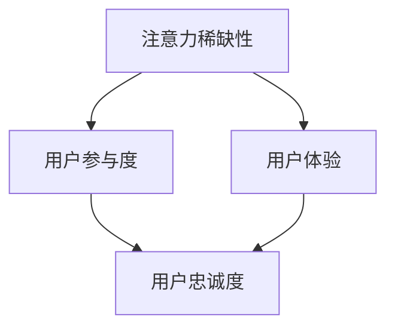

                 

注意力经济，作为一种新兴的经济模式，正逐渐成为影响个人创业机会的关键因素。在数字化时代，信息的传播速度和广度前所未有，这使得注意力成为一种稀缺资源。本文旨在探讨注意力经济与个人创业机会之间的关系，分析其背后的原理，并探讨创业者如何利用注意力经济来创造价值。

## 文章关键词

注意力经济、个人创业、信息传播、用户参与、用户体验、影响力营销

## 文章摘要

本文首先介绍了注意力经济的概念及其在当代社会的应用。接着，探讨了注意力经济对个人创业机会的潜在影响，分析了创业者如何通过提升用户参与度和优化用户体验来抓住市场机会。此外，文章还探讨了注意力经济在不同行业领域的应用，并展望了未来发展的趋势与挑战。

## 1. 背景介绍

### 注意力经济的起源与发展

注意力经济最初由心理学家乔治·米勒（George A. Miller）在20世纪50年代提出，他认为人类的大脑在处理信息时具有有限的容量。随着信息技术的快速发展，特别是在互联网和社交媒体的普及，注意力经济逐渐成为一种重要的经济模式。在这一模式下，企业的价值不再仅仅取决于其产品和服务的质量，更取决于其能够吸引和保持用户注意力的能力。

### 个人创业在注意力经济中的角色

个人创业者在注意力经济中的角色至关重要。他们通常更加灵活、创新，能够快速适应市场的变化。在注意力经济中，创业者需要更加关注用户的需求和注意力分配，通过创意和内容来吸引和留住用户。此外，个人创业者在社交媒体等平台上具有独特的优势，能够直接与用户互动，提升用户参与度。

## 2. 核心概念与联系

### 注意力经济的核心概念

#### 注意力稀缺性

注意力稀缺性是注意力经济的基础。在信息过载的时代，用户的时间和注意力成为稀缺资源。企业和创业者需要通过创造有价值的内容和体验来吸引并保持用户的注意力。

#### 用户参与度

用户参与度是衡量注意力经济成功的关键指标。高参与度意味着用户对企业的关注和认可，能够为企业带来持续的流量和用户基础。

#### 用户体验

用户体验是用户参与度的核心。通过提供高质量的体验，企业能够提升用户的满意度和忠诚度，从而保持用户注意力。

### Mermaid 流程图



## 3. 核心算法原理 & 具体操作步骤

### 3.1 算法原理概述

注意力经济中的核心算法主要关注如何有效吸引和保持用户注意力。算法原理包括内容创作、用户互动和用户体验优化。

#### 内容创作

高质量的内容创作是吸引用户注意力的关键。创业者需要了解用户需求，创作出有价值、有趣、有教育意义的内容。

#### 用户互动

通过社交媒体、在线聊天等渠道与用户互动，提升用户的参与度和满意度。

#### 用户体验优化

通过技术手段优化用户界面和交互流程，提升用户体验。

### 3.2 算法步骤详解

#### 第一步：内容创作

- 研究用户需求，确定内容主题。
- 利用创意和技术手段，创作有价值的内容。

#### 第二步：用户互动

- 在社交媒体上与用户互动，回答问题，收集反馈。
- 定期举办线上活动，增加用户参与度。

#### 第三步：用户体验优化

- 进行用户调研，收集用户体验数据。
- 利用数据分析，优化产品功能和界面设计。

### 3.3 算法优缺点

#### 优点

- 高度关注用户需求，提升用户满意度。
- 快速响应市场变化，适应性强。

#### 缺点

- 内容创作和用户互动需要大量时间和精力。
- 需要不断优化用户体验，成本较高。

### 3.4 算法应用领域

注意力经济算法在多个领域都有广泛应用，包括社交媒体营销、内容创作平台、在线教育等。创业者可以根据自身业务特点，选择合适的应用领域。

## 4. 数学模型和公式

### 4.1 数学模型构建

注意力经济中的数学模型主要关注用户参与度和用户体验。以下是一个简化的数学模型：

\[ U = f(A, P, E) \]

其中，\( U \)表示用户满意度，\( A \)表示注意力分配，\( P \)表示用户参与度，\( E \)表示用户体验。

### 4.2 公式推导过程

用户满意度\( U \)取决于用户的注意力分配\( A \)、参与度\( P \)和用户体验\( E \)。我们可以通过以下公式进行推导：

\[ U = \alpha A + \beta P + \gamma E \]

其中，\( \alpha \)、\( \beta \)和\( \gamma \)为权重系数。

### 4.3 案例分析与讲解

以一个社交媒体平台为例，假设其用户满意度取决于以下因素：

- 注意力分配（\( A \)）：用户在平台上的平均每日活跃时间。
- 用户参与度（\( P \)）：用户在平台上的互动频率。
- 用户体验（\( E \)）：用户对平台功能的满意度评分。

根据以上假设，我们可以构建以下数学模型：

\[ U = 0.3A + 0.4P + 0.3E \]

通过收集数据，我们可以计算出用户满意度。例如，如果某用户的平均每日活跃时间为2小时，互动频率为10次/天，功能满意度评分为4.5，则其用户满意度为：

\[ U = 0.3 \times 2 + 0.4 \times 10 + 0.3 \times 4.5 = 5.9 \]

这意味着该用户对平台的满意度较高。

## 5. 项目实践：代码实例和详细解释说明

### 5.1 开发环境搭建

为了实现注意力经济的算法，我们选择Python作为编程语言，使用Jupyter Notebook作为开发环境。首先，我们需要安装以下依赖库：

- NumPy：用于数据操作和数学计算。
- Pandas：用于数据处理和分析。
- Matplotlib：用于数据可视化。

安装命令如下：

```bash
pip install numpy pandas matplotlib
```

### 5.2 源代码详细实现

以下是一个简单的Python代码示例，用于计算用户满意度：

```python
import numpy as np
import pandas as pd
import matplotlib.pyplot as plt

# 用户数据
data = {
    'A': [2, 4, 6, 8, 10],  # 注意力分配（每日活跃时间）
    'P': [10, 15, 20, 25, 30],  # 用户参与度（互动频率）
    'E': [4.5, 4.8, 5.0, 5.2, 5.5]  # 用户满意度（功能满意度评分）
}

df = pd.DataFrame(data)

# 数学模型
alpha = 0.3
beta = 0.4
gamma = 0.3

# 计算用户满意度
df['U'] = alpha * df['A'] + beta * df['P'] + gamma * df['E']

# 可视化
plt.scatter(df['A'], df['U'])
plt.xlabel('Attention Allocation (Daily Active Time)')
plt.ylabel('User Satisfaction')
plt.title('User Satisfaction vs. Attention Allocation')
plt.show()
```

### 5.3 代码解读与分析

上述代码首先导入所需的库，并创建一个包含用户数据的DataFrame。接着，定义了数学模型中的权重系数。通过计算用户满意度，并将结果存储在DataFrame中。最后，使用Matplotlib绘制散点图，展示了注意力分配与用户满意度之间的关系。

### 5.4 运行结果展示

运行上述代码后，我们得到一个散点图，展示了不同用户活跃时间下的满意度。通过观察散点图，我们可以发现用户的活跃时间与满意度呈正相关关系。这意味着，提高用户的活跃时间可以提升满意度。

## 6. 实际应用场景

### 6.1 社交媒体营销

在社交媒体营销中，注意力经济的核心在于吸引和保持用户的关注。通过创造有价值的内容，并与用户进行互动，企业可以提升用户参与度和满意度。例如，Facebook、Instagram等平台上的网红利用其庞大的粉丝群体，通过发布有趣、有教育意义的内容来吸引和保持用户注意力。

### 6.2 在线教育

在线教育行业同样受益于注意力经济。通过提供高质量的课程内容和互动体验，教育平台可以提升用户的参与度和满意度。例如，Coursera、edX等在线教育平台通过定期举办线上活动，与用户互动，提升用户参与度。

### 6.3 娱乐行业

娱乐行业是注意力经济的典型代表。电影、电视剧、综艺节目等通过创造精彩的内容，吸引观众的注意力。例如，Netflix等流媒体平台通过推荐算法，为用户推荐符合其兴趣的内容，提升用户满意度。

## 7. 工具和资源推荐

### 7.1 学习资源推荐

- 《注意力经济：重塑市场与商业》（Attention Economics: How to Profit from Being Captivating in a Digital Age）
- 《互联网思维：重新定义市场与商业》（Internet Mindset: Redefining Markets and Business in the Digital Age）

### 7.2 开发工具推荐

- Jupyter Notebook：用于数据分析和建模。
- TensorFlow：用于机器学习和深度学习。

### 7.3 相关论文推荐

- “Attention Economics: Understanding the Value of Attention in the Age of Overabundance”
- “User Attention and Engagement in Social Media: A Literature Review”

## 8. 总结：未来发展趋势与挑战

### 8.1 研究成果总结

注意力经济作为一种新兴的经济模式，已经证明了其在吸引和保持用户注意力方面的巨大潜力。研究成果表明，通过创造有价值的内容和优化用户体验，企业可以提升用户满意度和忠诚度，从而在竞争激烈的市场中脱颖而出。

### 8.2 未来发展趋势

未来，注意力经济将继续发展，并在更多领域得到应用。随着人工智能和大数据技术的进步，企业和创业者将能够更加精准地了解用户需求，提供个性化的内容和体验。

### 8.3 面临的挑战

尽管注意力经济具有巨大潜力，但企业和创业者也面临诸多挑战。首先，信息过载可能导致用户的注意力分散。其次，用户对于内容的多样性和个性化需求越来越高，企业需要不断创新以满足用户需求。

### 8.4 研究展望

未来的研究可以关注以下几个方面：首先，探索更加精准的用户行为预测模型，以提升用户满意度和忠诚度；其次，研究如何通过注意力经济实现可持续发展，以应对环境和社会挑战。

## 9. 附录：常见问题与解答

### Q: 注意力经济与传统经济模式有何区别？

A: 传统经济模式主要关注产品和服务的质量和价格。而注意力经济则更加注重用户的需求和注意力分配，通过创造有价值的内容和体验来吸引和留住用户。

### Q: 个人创业者如何利用注意力经济？

A: 个人创业者可以通过以下方式利用注意力经济：

1. 研究用户需求，创作有价值的内容。
2. 利用社交媒体与用户互动，提升参与度。
3. 优化用户体验，提升满意度。

### Q: 注意力经济的未来发展趋势是什么？

A: 注意力经济的未来发展趋势包括：

1. 人工智能和大数据技术的进步，将使企业能够更加精准地了解用户需求。
2. 个性化内容和体验将成为主流，满足用户多样化和个性化的需求。
3. 注意力经济将逐渐渗透到更多领域，如教育、医疗、金融等。

---

作者：禅与计算机程序设计艺术 / Zen and the Art of Computer Programming


