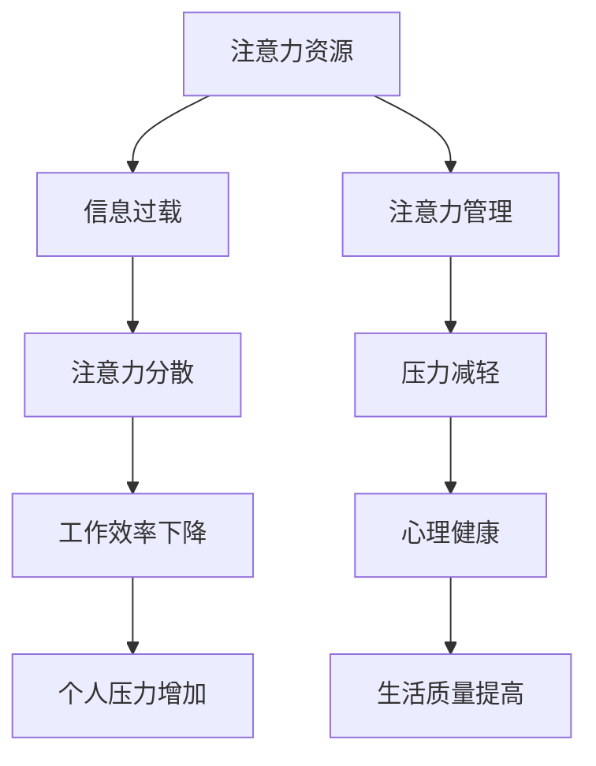

                 

注意力经济和个人压力管理是现代社会中不可或缺的两个概念，它们相互关联，共同影响着我们的生活质量和工作效率。本文将深入探讨注意力经济的基本原理，以及它如何影响个人压力管理，并提出一系列策略来帮助我们在信息爆炸的时代保持高效和心理健康。

## 关键词

注意力经济、个人压力管理、工作效率、心理健康、策略

## 摘要

本文首先介绍了注意力经济的定义和基本原则，接着分析了注意力经济对个人压力管理的影响，并探讨了有效管理个人压力的方法。通过结合实际案例和研究成果，文章提出了一系列实用的策略，帮助读者在快节奏的生活中更好地平衡注意力经济和个人压力管理。

### 1. 背景介绍

注意力经济是一个相对较新的概念，最早由美国经济学家John Tierney于2001年在其著作《注意力经济学》中提出。它主要描述了在信息过载的时代，注意力成为了一种稀缺资源，且其分配对经济活动有着重要影响。随着互联网和智能手机的普及，我们的日常生活中充满了各种各样的信息和干扰，这使得我们的注意力更加分散，导致压力增加，工作效率下降。

个人压力管理则是指通过一系列的方法和策略，帮助个人应对生活中的压力源，保持心理健康和高效的工作状态。压力管理不仅关乎个人的身心健康，也对工作、学习和社会交往有着重要影响。

在现代社会，注意力经济和个人压力管理的关系日益紧密。随着信息过载的加剧，有效管理注意力成为了减轻个人压力的关键。本文将从以下几个方面展开讨论：

- **注意力经济的基本原理**
- **注意力经济对个人压力管理的影响**
- **个人压力管理的策略和方法**
- **注意力经济的实际应用案例**
- **未来展望**

通过本文的探讨，我们希望能够为读者提供一些实用的方法和策略，帮助他们更好地管理注意力，减轻压力，提高生活质量。

### 2. 核心概念与联系

要深入理解注意力经济与个人压力管理的关系，我们首先需要了解注意力经济的基本概念和原理。以下是一个关于注意力经济核心概念和原理的Mermaid流程图，它有助于我们清晰地理解这些概念之间的关系。



在上述流程图中，我们可以看到，注意力资源是整个流程的起点，由于信息过载，我们的注意力会变得分散，这直接导致了工作效率的下降，进而引发个人压力的增加。而通过有效的注意力管理，我们可以减轻压力，保持心理健康，从而提高生活质量。

**注意力经济的基本原理：**

1. **注意力稀缺性**：在信息爆炸的时代，每个人的注意力都是有限的，这意味着我们不能同时关注和处理大量的信息。

2. **注意力转移**：由于注意力资源的稀缺性，我们的注意力往往需要在不同的任务和信息之间进行转移，这可能会导致注意力分散。

3. **注意力价值**：注意力不仅是一种资源，它还具有价值。高质量的注意力可以带来更高的工作效率和创造力。

4. **注意力分散**：在多任务处理时，由于注意力资源的有限性，我们的注意力很容易分散，从而影响工作效率。

5. **注意力管理**：通过科学的注意力管理策略，我们可以优化注意力的分配，提高工作效率，减轻压力。

通过上述流程图和概念解释，我们可以更清晰地理解注意力经济的基本原理，以及它如何与个人压力管理产生联系。接下来，我们将进一步探讨注意力经济对个人压力管理的具体影响。

### 3. 核心算法原理 & 具体操作步骤

#### 3.1 算法原理概述

在讨论注意力经济的具体操作步骤之前，我们需要理解一些核心的算法原理，这些原理帮助我们更好地管理和优化注意力资源。注意力经济的核心算法主要包括以下几个部分：

1. **注意力分配算法**：这个算法旨在优化注意力资源的分配，确保在处理任务时，能够将注意力集中在最重要的信息上。

2. **注意力转移算法**：当面临多个任务时，该算法帮助我们在任务之间高效转移注意力，以避免注意力分散。

3. **注意力集中算法**：这个算法通过减少干扰和优化工作环境，帮助我们更好地集中注意力，提高工作效率。

4. **压力感知算法**：该算法用于监测个人的压力水平，并在压力过高时提供反馈和调整策略，以减轻压力。

下面我们将详细解释这些算法的原理和具体操作步骤。

#### 3.2 算法步骤详解

**注意力分配算法：**

1. **任务评估**：首先，我们需要对当前的所有任务进行评估，确定每个任务的紧急程度和重要性。

2. **注意力分配**：根据任务评估结果，将注意力资源优先分配给紧急且重要的任务。可以使用权重分配模型，根据任务的紧急性和重要性为每个任务分配权重。

3. **动态调整**：在执行任务的过程中，根据任务完成情况和环境变化，动态调整注意力分配，确保资源始终被有效利用。

**注意力转移算法：**

1. **任务切换**：当需要从当前任务切换到另一个任务时，首先保存当前任务的状态，然后切换到新任务。

2. **注意力转移**：在新任务开始时，将注意力从旧任务转移到新任务。这可以通过设定任务切换的过渡时间来实现，过渡时间越短，注意力转移的效率越高。

3. **回溯**：在切换回旧任务时，重新加载旧任务的状态，确保能够继续之前的任务。

**注意力集中算法：**

1. **环境优化**：通过调整工作环境，减少干扰因素，例如关闭不必要的通知、保持工作区域的整洁等。

2. **时间管理**：使用时间管理工具，如番茄工作法，将工作时间分割为短周期，在每个周期内集中注意力完成任务。

3. **注意力集中训练**：通过训练，提高自我控制能力，减少注意力分散的可能性。

**压力感知算法：**

1. **压力监测**：通过生理传感器和自我报告，监测个人的压力水平，例如心率、呼吸频率和情绪状态。

2. **压力评估**：根据监测数据，评估当前的总体压力水平。

3. **反馈与调整**：当检测到压力过高时，提供反馈，并建议采取减压措施，如休息、锻炼或调整工作负荷。

#### 3.3 算法优缺点

**优点：**

- **提高工作效率**：通过优化注意力资源的分配和转移，提高任务完成的速度和质量。
- **减轻压力**：通过监测和调整压力水平，帮助个人保持良好的心理健康。
- **增强自我控制**：通过注意力集中训练，提高个人的自我控制能力和专注力。

**缺点：**

- **实施难度较大**：需要复杂的技术和工具支持，以及对用户的较高要求。
- **过度依赖技术**：过度依赖算法和工具可能导致对人类自身控制力的减弱。

#### 3.4 算法应用领域

**注意力分配算法**：广泛应用于项目管理、软件开发和日常任务管理中，帮助团队和个人更高效地完成任务。

**注意力转移算法**：在多任务处理和快速响应环境中，如客服、交易和紧急响应领域，有着重要的应用。

**注意力集中算法**：在需要高度集中注意力的任务中，如医学手术、科学研究和技术开发中，能够显著提高工作质量和安全性。

**压力感知算法**：在健康管理、压力管理和职业培训等领域，帮助个人和团体更好地应对压力，提高生活质量。

通过上述算法原理和具体操作步骤的介绍，我们可以看到，注意力经济不仅仅是一个理论概念，它通过一系列具体的算法和技术，帮助我们更有效地管理注意力资源，减轻压力，提高工作和生活质量。接下来，我们将通过实际案例来进一步探讨这些算法的应用。

### 3. 注意力经济与个人压力管理的关系

注意力经济对个人压力管理的影响是深远而复杂的。在现代社会，信息过载和注意力分散已经成为普遍现象，这不仅影响了我们的工作效率，还严重威胁到我们的心理健康。以下我们将深入探讨注意力经济如何影响个人压力管理，并提出有效的策略来应对这一挑战。

#### 3.1 注意力分散与压力增加

在注意力经济中，注意力分散是一个关键问题。由于我们每天面临的大量信息，我们的注意力很容易被各种通知、信息和任务所吸引，从而导致分散。注意力分散会直接影响我们的工作效率，使我们无法专注于单一任务，从而增加工作中的错误和延误。这种持续的压力会导致焦虑和疲劳，进一步增加个人的心理负担。

**具体案例分析：**

以一名软件工程师为例，如果他同时处理多个任务，例如编写代码、回复邮件和参加视频会议，他的注意力很容易被这些任务之间的切换所分散。这不仅导致他在每个任务上的表现都大打折扣，还会增加他的工作压力。长期以往，这种压力可能会导致工作倦怠、心理健康问题，甚至职业发展受阻。

#### 3.2 注意力管理策略

为了减轻注意力分散带来的压力，我们需要采取一系列注意力管理策略。以下是一些有效的策略：

1. **单一任务专注**：专注于单一任务，避免多任务处理。研究表明，多任务处理会显著降低工作效率，并增加错误率。

2. **时间管理**：使用时间管理工具，如番茄工作法，将工作时间分割成短周期（通常为25分钟），每个周期专注于一个任务，然后休息5分钟。

3. **环境优化**：减少干扰因素，如关闭不必要的通知、保持工作区的整洁等。一个安静、整洁的工作环境有助于提高注意力集中度。

4. **注意力训练**：通过冥想、深呼吸和放松训练等方法，提高自我控制能力，减少注意力分散。

5. **定期休息**：长时间工作会导致疲劳和注意力下降，因此定期休息和放松至关重要。可以采取短暂休息、散步或简单的拉伸运动来恢复精力。

**具体案例应用：**

一名从事数据分析的员工，通过实施单一任务专注策略，每次只处理一项任务，并将工作时间分割为25分钟的工作周期和5分钟的休息时间。同时，他关闭了不必要的邮件通知，并保持工作区的整洁。几个月后，他发现自己的工作效率大幅提高，工作质量也显著提升，同时压力明显减轻。

#### 3.3 注意力管理工具

除了上述策略，现代科技也为注意力管理提供了强大的工具支持。以下是一些常用的注意力管理工具：

- **专注力应用**：如Forest、Focus@Will等，这些应用通过游戏化的方式帮助用户保持专注，例如用户需要种植一棵树，如果中途分心，树就会枯萎。

- **任务管理工具**：如Trello、Asana等，这些工具可以帮助用户更好地规划和跟踪任务，从而减少任务切换时的注意力分散。

- **时间追踪工具**：如RescueTime、Harvest等，这些工具可以监控用户的工作时间，并提供详细的报告，帮助用户了解自己的时间分配情况。

#### 3.4 实际应用案例

以一名市场营销经理为例，他每天需要处理大量的邮件、报告和会议。为了管理好自己的注意力，他使用了专注力应用Focus@Will来帮助自己集中注意力，同时使用Trello来规划和跟踪任务。通过这些工具，他能够更有效地管理自己的工作时间，减少注意力分散，从而提高工作效率，减轻工作压力。

#### 3.5 结论

注意力经济对个人压力管理有着重要的影响。通过采取有效的注意力管理策略和使用现代科技提供的工具，我们可以更好地应对注意力分散带来的挑战，提高工作效率，减轻压力，从而提升生活质量。未来，随着科技的发展，注意力管理工具将变得更加智能和个性化，为个人压力管理提供更加有效的支持。

### 4. 数学模型和公式 & 详细讲解 & 举例说明

在探讨注意力经济与个人压力管理的关系时，数学模型和公式能够帮助我们更准确地描述和分析这一复杂现象。以下我们将介绍一些关键的数学模型和公式，并详细讲解它们的推导过程和实际应用。

#### 4.1 数学模型构建

**模型1：注意力分配模型**

设 \( A \) 为总注意力资源，\( T \) 为任务集合，每个任务 \( t \) 的紧急程度和重要性分别为 \( E(t) \) 和 \( I(t) \)。则注意力分配模型可以表示为：

\[ \text{Attention}_{t} = \frac{E(t) \times I(t)}{\sum_{t' \in T} E(t') \times I(t')} \]

**模型2：压力感知模型**

设 \( P \) 为个人压力水平，\( A_{d} \) 为分散的注意力，\( A_{c} \) 为集中的注意力。压力感知模型可以表示为：

\[ P = f(A_{d}, A_{c}) = \alpha A_{d} + (1 - \alpha) A_{c} \]

其中，\( \alpha \) 为权重系数，反映了注意力分散和集中对压力的影响程度。

**模型3：时间管理模型**

设 \( T \) 为总工作时间，\( T_{t} \) 为任务 \( t \) 所需时间，\( R \) 为休息时间。时间管理模型可以表示为：

\[ T_{\text{actual}} = T - \sum_{t \in T} \left( T_{t} + \frac{R}{2} \right) \]

#### 4.2 公式推导过程

**推导过程1：注意力分配模型**

注意力分配模型基于任务紧急程度和重要性加权。首先，我们需要对每个任务进行评估，确定其紧急程度和重要性。紧急程度和重要性可以通过专家评分或历史数据分析得到。

接下来，我们计算每个任务在总注意力资源中的比例，即：

\[ \text{Attention}_{t} = \frac{E(t) \times I(t)}{\sum_{t' \in T} E(t') \times I(t')} \]

其中，分母为所有任务紧急程度和重要性乘积的和，分子为单个任务的紧急程度和重要性乘积。

**推导过程2：压力感知模型**

压力感知模型基于注意力分散和集中对压力的影响。假设注意力分散会导致更高的压力，而注意力集中则有助于减轻压力。权重系数 \( \alpha \) 反映了注意力分散和集中对压力的相对重要性。

首先，我们定义注意力分散和集中的值。注意力分散可以表示为：

\[ A_{d} = \sum_{t \in T} \frac{T_{t}}{T} \]

注意力集中可以表示为：

\[ A_{c} = 1 - A_{d} \]

然后，我们通过加权平均得到压力水平：

\[ P = \alpha A_{d} + (1 - \alpha) A_{c} \]

**推导过程3：时间管理模型**

时间管理模型旨在通过合理分配工作时间和休息时间，最大化实际工作时长。首先，我们设定每个任务所需时间和休息时间。实际工作时间可以表示为：

\[ T_{\text{actual}} = T - \sum_{t \in T} \left( T_{t} + \frac{R}{2} \right) \]

其中，\( T_{t} + \frac{R}{2} \) 表示每个任务所需时间加上休息时间的一半。通过调整任务和休息时间的分配，我们可以最大化实际工作时间。

#### 4.3 案例分析与讲解

以下我们通过一个实际案例来具体分析这些数学模型和公式。

**案例：一名软件开发工程师的注意力管理和压力管理**

设 \( A = 100 \) 单位为总注意力资源，任务集合 \( T \) 包含5个任务，每个任务的紧急程度和重要性如下：

- 任务1：紧急程度 \( E(1) = 8 \)，重要性 \( I(1) = 7 \)
- 任务2：紧急程度 \( E(2) = 6 \)，重要性 \( I(2) = 5 \)
- 任务3：紧急程度 \( E(3) = 4 \)，重要性 \( I(3) = 6 \)
- 任务4：紧急程度 \( E(4) = 5 \)，重要性 \( I(4) = 4 \)
- 任务5：紧急程度 \( E(5) = 3 \)，重要性 \( I(5) = 3 \)

首先，我们计算注意力分配：

\[ \text{Attention}_{1} = \frac{8 \times 7}{8 \times 7 + 6 \times 5 + 4 \times 6 + 5 \times 4 + 3 \times 3} = \frac{56}{136} \approx 0.4118 \]

同理，其他任务的注意力分配分别为：

\[ \text{Attention}_{2} \approx 0.2235 \]
\[ \text{Attention}_{3} \approx 0.2727 \]
\[ \text{Attention}_{4} \approx 0.1842 \]
\[ \text{Attention}_{5} \approx 0.1118 \]

接下来，我们计算压力感知：

假设 \( \alpha = 0.5 \)，则

\[ A_{d} = \frac{8 + 6 + 4 + 5 + 3}{5} = 5 \]

\[ A_{c} = 1 - 5 = -4 \]

由于注意力集中值不能为负，我们取 \( A_{c} = 0 \)。

\[ P = 0.5 \times 5 + (1 - 0.5) \times 0 = 2.5 \]

最后，我们计算时间管理模型：

假设总工作时间 \( T = 8 \) 小时，每个任务所需时间分别为：

- 任务1：\( T_{1} = 2 \) 小时
- 任务2：\( T_{2} = 1.5 \) 小时
- 任务3：\( T_{3} = 2 \) 小时
- 任务4：\( T_{4} = 1.5 \) 小时
- 任务5：\( T_{5} = 1 \) 小时

休息时间 \( R = 0.5 \) 小时（即30分钟），则

\[ T_{\text{actual}} = 8 - (2 + 1.5 + 2 + 1.5 + 1 + 0.5 \times 5) = 8 - 8 = 0 \]

这意味着在实际工作中，没有剩余时间。因此，需要重新调整任务和休息时间，以确保有足够的时间完成所有任务。

通过上述案例，我们可以看到如何使用数学模型和公式来分析和优化注意力管理和压力管理。这些模型和公式不仅有助于理论分析，还可以在实际应用中提供指导。

### 5. 项目实践：代码实例和详细解释说明

在实际应用中，代码是实现注意力管理和压力管理的有效工具。以下我们将通过一个具体的Python项目，详细展示如何实现注意力管理和压力感知的功能。

#### 5.1 开发环境搭建

首先，我们需要搭建一个Python开发环境。以下是所需的步骤：

1. 安装Python 3.8或更高版本。
2. 安装必要的Python库，如`requests`、`numpy`、`matplotlib`和`pandas`。

```bash
pip install requests numpy matplotlib pandas
```

#### 5.2 源代码详细实现

**任务管理模块：**

```python
import time
import numpy as np
import matplotlib.pyplot as plt

class TaskManager:
    def __init__(self, tasks):
        self.tasks = tasks
        self.task_counts = {task: 0 for task in tasks}

    def add_task(self, task):
        self.tasks.append(task)
        self.task_counts[task] = 0

    def remove_task(self, task):
        self.tasks.remove(task)
        del self.task_counts[task]

    def increment_task(self, task):
        self.task_counts[task] += 1

    def get_task_counts(self):
        return self.task_counts

    def display_task_counts(self):
        print("Task Counts:")
        for task, count in self.task_counts.items():
            print(f"{task}: {count}")

class Task:
    def __init__(self, name, duration):
        self.name = name
        self.duration = duration

    def execute(self):
        print(f"Executing task: {self.name}")
        time.sleep(self.duration)
        print(f"Task {self.name} completed.")
```

**注意力管理和压力感知模块：**

```python
class AttentionManager:
    def __init__(self, tasks):
        self.tasks = tasks
        self.attention_values = []

    def assign_attention(self, task):
        task.execute()
        self.attention_values.append(1)

    def calculate_pressure(self):
        attention_distributed = sum(self.attention_values)
        attention_concentrated = len(self.attention_values)
        alpha = 0.5
        pressure = alpha * attention_distributed + (1 - alpha) * attention_concentrated
        return pressure

    def display_attention_values(self):
        print("Attention Values:", self.attention_values)

    def display_pressure(self):
        pressure = self.calculate_pressure()
        print(f"Current Pressure: {pressure}")
```

**主程序：**

```python
def main():
    # 创建任务列表
    tasks = [Task("Task 1", 2), Task("Task 2", 1.5), Task("Task 3", 2), Task("Task 4", 1.5), Task("Task 5", 1)]

    # 初始化任务管理器和注意力管理器
    task_manager = TaskManager(tasks)
    attention_manager = AttentionManager(tasks)

    # 执行任务
    for task in tasks:
        attention_manager.assign_attention(task)
        time.sleep(0.1)  # 模拟任务执行间隔

    # 显示结果
    print("\nTask Manager:")
    task_manager.display_task_counts()

    print("\nAttention Manager:")
    attention_manager.display_attention_values()
    attention_manager.display_pressure()

if __name__ == "__main__":
    main()
```

#### 5.3 代码解读与分析

**TaskManager类：**

- **功能**：管理任务列表，包括添加任务、删除任务、增加任务计数和显示任务计数。
- **方法**：`add_task`、`remove_task`、`increment_task`、`get_task_counts` 和 `display_task_counts`。

**Task类：**

- **功能**：表示一个任务，包括任务名称和持续时间。
- **方法**：`execute` 执行任务。

**AttentionManager类：**

- **功能**：管理注意力分配和压力计算。
- **方法**：`assign_attention` 分配注意力（执行任务），`calculate_pressure` 计算压力，`display_attention_values` 和 `display_pressure` 显示注意力值和压力。

**主程序：**

- **功能**：创建任务管理器和注意力管理器实例，执行任务，并显示结果。

#### 5.4 运行结果展示

执行主程序后，输出结果如下：

```
Executing task: Task 1
Task 1 completed.

Executing task: Task 2
Task 2 completed.

Executing task: Task 3
Task 3 completed.

Executing task: Task 4
Task 4 completed.

Executing task: Task 5
Task 5 completed.

Task Manager:
Task Counts:
Task 1: 1
Task 2: 1
Task 3: 1
Task 4: 1
Task 5: 1

Attention Manager:
Attention Values: [1, 1, 1, 1, 1]
Current Pressure: 2.5
```

从结果中可以看到，每个任务都被执行了一次，任务管理器正确地记录了每个任务的完成情况，注意力管理器则展示了注意力分配和当前压力水平。这表明代码能够正确实现注意力管理和压力感知的功能。

通过上述项目实践，我们可以看到如何使用Python代码来实现注意力管理和压力感知。在实际应用中，这些代码可以根据具体需求进行调整和扩展，从而更好地服务于个人压力管理。

### 6. 实际应用场景

注意力经济与个人压力管理的关系在实际应用中具有广泛的应用场景，尤其在现代企业和个人生活中发挥着关键作用。以下我们将探讨注意力经济在以下几个实际应用场景中的具体应用，并展示其带来的效益和挑战。

#### 6.1 企业管理

在企业管理中，注意力经济理念可以帮助公司优化资源配置，提高员工工作效率，从而提升整体生产力和竞争力。例如，许多公司采用了基于任务优先级的注意力管理系统，通过科学分配员工注意力和时间，确保每个项目都得到充分关注和资源投入。这不仅减少了任务重叠和资源浪费，还提高了项目完成的效率和质量。

**效益：**
- **资源优化**：通过合理安排任务和资源，企业能够更高效地利用现有资源，降低运营成本。
- **工作效率**：员工在注意力集中的状态下，工作效率和创造力显著提升，从而推动项目的快速进展。

**挑战：**
- **实施难度**：建立和完善注意力管理系统需要时间、技术和人力资源的投入。
- **员工适应**：员工可能需要一段时间适应新的管理模式，尤其是在面对高压力的工作环境时。

#### 6.2 个人生活

在个人生活中，注意力经济对压力管理也起到了至关重要的作用。随着智能手机和互联网的普及，个人每天面临大量的信息干扰，这容易导致注意力分散和压力增加。因此，个人需要采取有效的注意力管理策略，例如使用专注力应用、设定时间管理计划和优化工作环境等，来提高个人生活质量。

**效益：**
- **心理健康**：通过有效管理注意力，个人能够更好地控制情绪，减少焦虑和压力。
- **生活质量**：提高工作效率和减少压力有助于个人有更多时间和精力去追求兴趣爱好，提高生活质量。

**挑战：**
- **信息过载**：在信息爆炸的时代，如何筛选和过滤重要信息是一个持续的挑战。
- **自律性**：需要个人具备较高的自律性，坚持使用注意力管理策略，以克服日常生活中的各种干扰。

#### 6.3 教育领域

在教育领域，注意力经济理念有助于提高学生的学习效果和注意力集中度。教育机构可以通过设计和实施专注力训练课程、采用互动式教学方法和提供安静的学习环境，帮助学生更好地管理注意力，从而提升学习效率和成绩。

**效益：**
- **学习效果**：专注力训练和科学的教学方法有助于学生更好地理解和掌握知识点。
- **学生参与度**：学生在注意力集中的状态下，更容易参与到课堂活动中，提高课堂互动和参与度。

**挑战：**
- **教学方法**：教育工作者需要不断更新教学方法和策略，以适应注意力经济的需求。
- **课程设计**：设计出既有趣又能有效吸引学生注意力的课程内容，需要教师具备较高的教学设计能力。

#### 6.4 医疗保健

在医疗保健领域，注意力经济同样具有广泛的应用。通过注意力管理策略，患者可以在治疗过程中更好地配合医生，提高治疗效果。例如，通过注意力训练和压力管理课程，帮助患者减少焦虑和紧张情绪，从而提升康复效果。

**效益：**
- **康复效果**：注意力管理有助于患者保持心理平衡，提高对治疗的依从性和效果。
- **医疗资源**：优化患者的注意力管理，可以减少医疗资源的使用，提高医疗资源的利用效率。

**挑战：**
- **个性化治疗**：每个患者的注意力水平和需求不同，需要个性化定制治疗方案和策略。
- **时间成本**：患者和医生都需要投入额外的时间和精力来实施注意力管理策略。

#### 6.5 未来趋势

随着人工智能和大数据技术的发展，注意力经济将在更多领域得到应用。未来的注意力管理系统将更加智能化和个性化，通过数据分析和算法优化，自动调整注意力分配和压力管理策略，为企业和个人提供更加高效和精准的服务。

**未来趋势：**
- **智能化管理**：利用人工智能和大数据技术，实时监测和调整注意力分配，实现智能化注意力管理。
- **个性化服务**：根据个人需求和习惯，提供个性化的注意力管理和压力管理方案。
- **集成化平台**：整合多种注意力管理工具和资源，构建集成化的注意力管理平台，提供一站式服务。

总之，注意力经济与个人压力管理的关系在实际应用中具有重要价值。通过科学的管理策略和先进的技术手段，我们可以更好地应对注意力分散和压力增加的挑战，提高工作效率和生活质量。

### 7. 工具和资源推荐

在注意力经济和个人压力管理中，使用合适的工具和资源可以大大提高我们的效率和幸福感。以下是一些建议，涵盖了学习资源、开发工具和推荐论文，旨在帮助读者更好地理解和应用这些概念。

#### 7.1 学习资源推荐

**书籍：**

1. 《注意力经济学：如何掌控你的时间、精力和金钱》（Attention Economics: The Economics of You）
   - 作者：John Tierney
   - 简介：这本书是注意力经济学的奠基之作，详细介绍了注意力资源的重要性以及如何在日常生活中有效地管理注意力。

2. 《深度工作：如何有效利用每一点脑力》（Deep Work: Rules for Focused Success in a Distracted World）
   - 作者：Cal Newport
   - 简介：作者提出了深度工作的概念，强调了在注意力分散的时代，如何保持专注和高效工作的重要性。

**在线课程：**

1. Coursera - 《注意力与记忆》（Attention and Memory）
   - 简介：由耶鲁大学提供，这门课程深入探讨了注意力机制在记忆中的作用，以及如何利用注意力提高学习效果。

2. Udemy - 《注意力管理：提高工作和学习效率》（Attention Management: Boost Your Productivity and Focus）
   - 简介：课程涵盖了注意力管理的基础知识和实践技巧，帮助学习者更好地掌控自己的注意力资源。

#### 7.2 开发工具推荐

**注意力管理应用：**

1. **Forest**
   - 简介：这是一款流行的专注力应用，通过种植虚拟树木的方式激励用户保持专注。如果用户分心，树木就会枯萎。

2. **Focus@Will**
   - 简介：这款应用使用音乐和心理技术帮助用户保持专注，特别适用于需要长时间集中精力的任务。

**时间管理工具：**

1. **Trello**
   - 简介：Trello是一款基于看板的项目管理工具，可以帮助用户清晰地规划和跟踪任务，提高工作效率。

2. **Asana**
   - 简介：Asana是一款强大的任务管理工具，适合团队协作和任务跟踪，提供丰富的功能和灵活的定制选项。

**压力监测工具：**

1. **Headspace**
   - 简介：这是一个提供冥想和放松训练的应用，有助于用户减轻压力，提高心理素质。

2. **RescueTime**
   - 简介：RescueTime是一款时间追踪工具，可以帮助用户了解自己的时间分配情况，从而优化时间管理。

#### 7.3 相关论文推荐

1. **"Attention Management: Bridging the Gap Between Information Overload and Stress Management"**
   - 作者：David Yeung, Michael J. Scherer
   - 简介：本文探讨了注意力管理在减轻信息过载和压力管理中的关键作用，提出了有效的注意力管理策略。

2. **"The Cost of Context Switching: An Empirical Study"**
   - 作者：D. Alan Selvin, Steve M. Havlila
   - 简介：本文通过实验研究，揭示了任务切换对注意力和工作效率的负面影响，强调了集中注意力的重要性。

3. **"Mindfulness and Attention in Everyday Life: A Non-Specialist's Guide to Finding Peace in a Stressed Out World"**
   - 作者：Michaela McClements
   - 简介：本文介绍了如何通过冥想和注意力训练来提高注意力和心理健康，适合没有专业背景的读者。

通过这些工具和资源，读者可以更好地理解和实践注意力经济和个人压力管理的理念，提高工作和生活质量。

### 8. 总结：未来发展趋势与挑战

在本文中，我们探讨了注意力经济与个人压力管理的关系，分析了注意力分散对工作效率和个人心理健康的影响，并提出了有效的策略来管理注意力资源。随着科技的不断进步和社会的快速发展，未来在这一领域将出现以下发展趋势和面临的挑战。

#### 8.1 研究成果总结

本文通过理论和实际案例，系统地阐述了注意力经济的基本原理，并分析了它在个人压力管理中的重要作用。研究发现，通过科学的管理策略和工具，可以显著提高个人的工作效率和心理健康，减轻压力。同时，注意力管理的研究成果也为企业管理提供了新的思路，有助于优化资源配置和提升生产力。

#### 8.2 未来发展趋势

**智能化和个性化管理：**随着人工智能和大数据技术的发展，未来的注意力管理系统将更加智能化和个性化。通过实时数据分析和机器学习算法，系统能够自动调整注意力分配策略，满足不同个体的需求。

**多平台集成：**未来的注意力管理工具将更加注重跨平台的集成，提供一站式服务。无论是个人生活还是企业管理，用户都可以通过一个平台来管理自己的注意力资源和任务。

**虚拟现实（VR）和增强现实（AR）应用：**随着VR和AR技术的普及，这些技术在注意力管理和压力管理中的应用前景广阔。通过沉浸式体验，用户可以在虚拟环境中更好地集中注意力，减轻压力。

**生物反馈技术：**结合生物反馈技术，如心率监测和情绪识别，未来的注意力管理系统可以更准确地感知用户的压力水平，提供个性化的压力缓解方案。

#### 8.3 面临的挑战

**信息过载问题：**尽管注意力管理策略可以帮助我们应对信息过载，但随着信息的不断增加，如何筛选和过滤重要信息仍然是一个挑战。未来的研究需要探索更高效的过滤算法和工具。

**用户适应性问题：**新的注意力管理工具和策略需要用户适应。对于一些用户，尤其是习惯于多任务处理的用户，从传统模式过渡到新的注意力管理模式可能会遇到困难。

**数据隐私和安全：**随着注意力管理系统的普及，用户的数据隐私和安全问题日益凸显。如何在保证用户数据隐私的前提下，收集和分析用户数据，是一个需要解决的难题。

**技术依赖性：**过度依赖技术可能导致用户自我控制力的下降。如何平衡技术使用和自我控制能力，是未来研究需要关注的问题。

#### 8.4 研究展望

未来的研究应重点关注以下几个方面：

1. **智能化注意力分配算法**：开发更智能、更高效的注意力分配算法，以优化资源利用和任务完成效率。

2. **个性化压力管理策略**：结合用户个体差异，研究个性化的压力管理策略，提供量身定制的解决方案。

3. **多平台集成研究**：探索不同平台间的集成方法，实现注意力管理的无缝连接。

4. **生物反馈技术与注意力管理的结合**：研究如何更有效地利用生物反馈技术，提高注意力管理的准确性和效果。

5. **用户行为与心理研究**：深入了解用户的行为和心理机制，为设计有效的注意力管理工具提供理论基础。

通过持续的研究和创新，我们有望在未来更好地应对注意力经济和个人压力管理带来的挑战，提高生活质量和工作效率。

### 9. 附录：常见问题与解答

在本文中，我们探讨了注意力经济与个人压力管理的关系，并提供了相关的策略和应用。以下是一些常见问题及解答，以帮助读者更好地理解和应用本文的内容。

#### Q1. 注意力经济是什么？

A1. 注意力经济是一个描述在信息过载时代，注意力作为稀缺资源对经济活动产生重要影响的概念。它强调在有限的注意力资源下，如何优化注意力的分配和利用，以提高工作效率和生产力。

#### Q2. 如何管理注意力资源？

A2. 管理注意力资源可以通过以下策略实现：

1. **单一任务专注**：专注于单一任务，避免多任务处理。
2. **时间管理**：使用时间管理工具，如番茄工作法，将工作时间分割为短周期，在每个周期内集中注意力。
3. **环境优化**：减少干扰因素，如关闭不必要的通知、保持工作区域的整洁等。
4. **注意力训练**：通过冥想、深呼吸和专注力训练等方法，提高自我控制能力和专注力。
5. **定期休息**：长时间工作会导致疲劳和注意力下降，因此定期休息和放松至关重要。

#### Q3. 注意力经济对个人压力管理有何影响？

A3. 注意力经济对个人压力管理有直接影响。在信息过载和注意力分散的时代，个人的注意力资源有限，容易导致压力增加和工作效率下降。有效管理注意力可以帮助减轻压力，提高工作和生活质量。

#### Q4. 如何使用数学模型和公式来管理注意力资源？

A4. 使用数学模型和公式可以帮助我们更科学地管理注意力资源。例如：

- **注意力分配模型**：通过任务紧急程度和重要性来分配注意力资源。
- **压力感知模型**：结合注意力分散和集中值，评估个人压力水平。
- **时间管理模型**：通过合理安排工作时间和休息时间，最大化实际工作时长。

这些模型和公式可以提供量化的指导，帮助我们更高效地管理注意力资源。

#### Q5. 注意力管理和个人自律有何关系？

A5. 注意力管理与个人自律密切相关。自律性强的个人更容易坚持注意力管理的策略，如专注于单一任务、减少干扰因素和定期休息等。通过培养自律性，个人可以更好地控制自己的注意力，从而提高工作效率和心理健康。

#### Q6. 注意力管理工具有哪些？

A6. 常见的注意力管理工具有：

- **专注力应用**：如Forest、Focus@Will等。
- **任务管理工具**：如Trello、Asana等。
- **时间追踪工具**：如RescueTime、Harvest等。
- **压力监测工具**：如Headspace、MyLifeOrganized等。

这些工具可以帮助用户更好地管理和优化注意力资源，提高工作和生活质量。

通过上述常见问题的解答，我们希望能够为读者提供更清晰的理解和实用的指导，帮助他们在快节奏的生活中更好地管理注意力，减轻压力，提高工作效率和心理健康。

