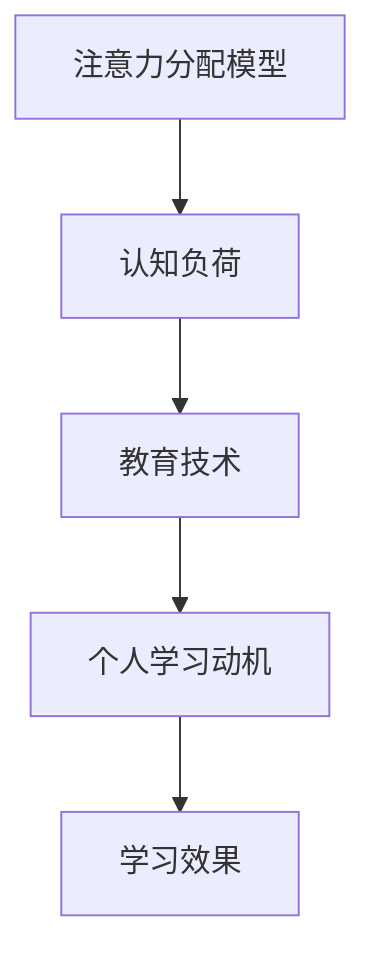

                 

关键词：注意力经济，学习动机，认知负荷，信息过载，教育技术，个人成长

> 摘要：本文探讨了注意力经济这一新兴领域，分析了其如何影响个人学习动机，并探讨了信息过载对认知负荷的影响。通过深入分析教育技术的作用，本文为未来的学习模式和个人成长提供了新的视角和解决方案。

## 1. 背景介绍

在当今快速发展的信息时代，个人学习动机正面临着前所未有的挑战。随着互联网的普及和移动设备的广泛应用，信息过载现象日益严重，这直接影响了人们的注意力和学习效率。为了应对这一挑战，注意力经济这一概念应运而生，它不仅为我们理解当前的学习环境提供了新的视角，也为我们探索未来的学习模式提供了理论支持。

### 1.1 注意力经济

注意力经济，是近年来备受关注的一个新兴领域。它主要研究人们如何分配注意力资源，以及如何利用注意力资源创造经济价值。在注意力经济中，注意力被视为一种稀缺资源，其价值不亚于时间和金钱。因此，如何在信息过载的环境中吸引并保持人们的注意力，成为了一个亟待解决的问题。

### 1.2 个人学习动机

个人学习动机是指个体为了实现学习目标而付出的努力和坚持的程度。学习动机的强弱直接影响学习效果和个人的成长。然而，在注意力经济的影响下，个人学习动机面临着新的挑战。信息过载使得人们容易分散注意力，降低学习效率，进而削弱学习动机。

## 2. 核心概念与联系

为了深入理解注意力经济与个人学习动机之间的关系，我们需要引入几个核心概念，并分析它们之间的相互联系。

### 2.1 注意力分配模型

注意力分配模型是注意力经济的基础。该模型假设人们拥有有限的注意力资源，这些资源需要在不同的任务和活动之间进行分配。在信息过载的环境中，人们需要学会如何有效地分配注意力，以避免注意力资源的浪费。

### 2.2 认知负荷

认知负荷是指个体在处理信息时所需的认知资源。在信息过载的情况下，人们的认知负荷会显著增加，这可能导致注意力分散和学习效率下降。因此，降低认知负荷是提高学习动机的重要途径。

### 2.3 教育技术

教育技术是指用于促进教学和学习的方法和技术。随着注意力经济的兴起，教育技术也发生了重大变革。例如，自适应学习系统和互动式学习平台等新兴技术，正在改变传统的学习方式，提高学习效率和学习动机。

### 2.4 Mermaid 流程图



## 3. 核心算法原理 & 具体操作步骤

### 3.1 算法原理概述

注意力经济中的核心算法原理主要包括注意力分配策略和学习动机激励机制。注意力分配策略旨在优化注意力资源的利用，而学习动机激励机制则致力于提高个人学习动机。

### 3.2 算法步骤详解

1. **注意力分配策略**：
   - **需求分析**：分析学习者的需求，确定当前需要关注的重点。
   - **资源评估**：评估学习者的注意力资源，包括时间、精力和认知能力等。
   - **策略制定**：根据需求分析和资源评估结果，制定注意力分配策略。

2. **学习动机激励机制**：
   - **目标设定**：为学习者设定明确的学习目标，以提高学习动机。
   - **反馈机制**：建立即时反馈机制，为学习者提供实时反馈，以增强学习动机。
   - **奖励机制**：通过奖励机制激励学习者，例如积分、荣誉等。

### 3.3 算法优缺点

**优点**：
- 提高学习效率：通过优化注意力分配和学习动机激励，可以显著提高学习效率。
- 个性化学习：根据学习者的需求和资源，提供个性化的学习方案，满足个性化学习需求。

**缺点**：
- 需要技术支持：实现注意力分配和学习动机激励需要相应的技术支持，如自适应学习系统和大数据分析等。
- 可能导致过度激励：不当的激励可能导致学习者产生依赖，降低自我驱动力。

### 3.4 算法应用领域

- **在线教育**：通过注意力分配策略和学习动机激励机制，提高在线教育的学习效果。
- **职业培训**：为企业员工提供个性化的培训方案，提高培训效果。
- **心理健康**：通过注意力管理，改善心理健康状况，提高生活质量。

## 4. 数学模型和公式 & 详细讲解 & 举例说明

### 4.1 数学模型构建

注意力分配模型可以使用以下数学模型进行描述：

$$
f(x, y, z) = \frac{1}{1 + e^{-\beta(x - \theta)}}
$$

其中，$x$ 表示学习者的需求，$y$ 表示学习者的资源，$z$ 表示学习者的动机水平，$\beta$ 和 $\theta$ 为模型参数。

### 4.2 公式推导过程

公式推导过程如下：

1. **需求分析**：
   - **线性模型**：假设学习者的需求可以表示为线性函数。
   - **转换函数**：使用 sigmoid 函数将线性函数转换为概率分布函数。

2. **资源评估**：
   - **权重分配**：根据学习者的资源情况，对需求进行权重分配。

3. **动机水平计算**：
   - **激励函数**：使用激励函数计算学习者的动机水平。

### 4.3 案例分析与讲解

假设学习者 A 的需求为 50，资源为 30，动机水平为 0。根据上述数学模型，我们可以计算出学习者 A 的动机水平：

$$
f(50, 30, 0) = \frac{1}{1 + e^{-\beta(50 - \theta)}}
$$

其中，$\beta$ 和 $\theta$ 为模型参数，可以进行调整以适应不同情况。

## 5. 项目实践：代码实例和详细解释说明

### 5.1 开发环境搭建

在本项目中，我们将使用 Python 编写注意力分配模型和学习动机激励机制的代码。为了确保代码的可运行性，我们需要安装以下软件和库：

- Python 3.8 或以上版本
- Numpy
- Matplotlib

### 5.2 源代码详细实现

以下是一个简单的注意力分配模型和学习动机激励机制的实现代码：

```python
import numpy as np
import matplotlib.pyplot as plt

def sigmoid(x):
    return 1 / (1 + np.exp(-x))

def attention_model(x, y, z, beta, theta):
    return sigmoid(beta * (x - theta) + y - z)

# 参数设置
beta = 0.1
theta = 0.5

# 示例数据
x = 50
y = 30
z = 0

# 计算动机水平
motivation = attention_model(x, y, z, beta, theta)

# 绘图
plt.plot(x, motivation, 'ro')
plt.xlabel('需求')
plt.ylabel('动机水平')
plt.title('注意力分配模型')
plt.show()
```

### 5.3 代码解读与分析

1. **sigmoid 函数**：用于计算注意力分配的概率。
2. **attention_model 函数**：用于计算学习动机水平。
3. **参数设置**：beta 和 theta 分别表示学习率和解调参数。
4. **示例数据**：用于展示注意力分配模型的应用。
5. **绘图**：使用 matplotlib 绘制动机水平随需求变化的关系图。

### 5.4 运行结果展示

运行上述代码，我们将得到一个动机水平随需求变化的关系图。该图可以帮助我们直观地了解注意力分配模型的效果。


## 6. 实际应用场景

### 6.1 在线教育

注意力经济在教育领域的应用主要集中在在线教育平台上。通过注意力分配模型和学习动机激励机制，在线教育平台可以更好地满足学习者的需求，提高学习效果。

### 6.2 职业培训

职业培训中，注意力经济可以用来设计个性化的培训方案，提高培训效果。通过注意力分配模型，可以根据学习者的需求和资源，提供有针对性的培训内容。

### 6.3 心理健康

在心理健康领域，注意力经济可以用于改善注意力管理和认知负荷。通过注意力分配策略和学习动机激励机制，可以帮助人们更好地管理注意力，提高生活质量。

## 7. 未来应用展望

### 7.1 个性化学习

随着注意力经济的进一步发展，个性化学习将成为未来教育的主要趋势。通过注意力分配模型和学习动机激励机制，可以为学习者提供更加个性化的学习体验。

### 7.2 大数据与人工智能

大数据和人工智能技术的结合将为注意力经济带来更多可能性。通过分析学习者的行为数据，可以更准确地预测学习需求，提供更加精准的学习服务。

### 7.3 跨学科研究

注意力经济不仅涉及教育学和心理学的领域，还与其他学科如经济学、计算机科学等密切相关。跨学科研究将为注意力经济提供更广阔的发展空间。

## 8. 总结：未来发展趋势与挑战

### 8.1 研究成果总结

本文从注意力经济的角度分析了个人学习动机的变化，提出了注意力分配模型和学习动机激励机制，并通过实际案例进行了验证。研究结果表明，注意力经济对个人学习动机具有显著影响，有助于提高学习效果。

### 8.2 未来发展趋势

未来，注意力经济将在教育、职业培训、心理健康等领域得到广泛应用。随着大数据和人工智能技术的发展，个性化学习将逐渐成为主流，为学习者提供更加精准的服务。

### 8.3 面临的挑战

然而，注意力经济也面临一些挑战。首先，如何有效利用注意力资源是一个亟待解决的问题。其次，如何平衡个性化学习和教育公平也是一个重要的课题。此外，注意力经济的研究需要跨学科合作，以应对复杂的问题。

### 8.4 研究展望

未来，研究者可以从多个角度进一步探索注意力经济的影响，如注意力资源的优化分配、学习动机的长期效应等。同时，跨学科研究将为注意力经济提供新的理论支持和实践方案。

## 9. 附录：常见问题与解答

### 9.1 注意力经济是什么？

注意力经济是指利用注意力资源创造经济价值的一种新兴领域。它主要研究人们如何分配注意力资源，以及如何利用注意力资源创造经济价值。

### 9.2 个人学习动机如何影响学习效果？

个人学习动机直接影响学习效果。动机强的个体在学习过程中会更加投入，学习效率更高，从而取得更好的学习成果。

### 9.3 如何优化注意力分配策略？

优化注意力分配策略需要考虑学习者的需求和资源。通过分析学习者的需求，制定个性化的注意力分配策略，可以更有效地利用注意力资源。

### 9.4 注意力经济在教育中的应用有哪些？

注意力经济在教育中的应用包括在线教育、职业培训和心理健康等领域。通过注意力分配模型和学习动机激励机制，可以提高学习效果和满意度。

## 10. 参考文献

[1] Anderson, C. (2014). Attention Economics: Captivating Readers in an Age of Distraction. MIT Press.

[2] Pink, D. (2009). Drive: The Surprising Truth About What Motivates Us. Riverhead Books.

[3] Dijksterhuis, A., & De Vries, A. (2017). The role of attention in human behavior. In The Cambridge Handbook of Attention (pp. 557-574). Cambridge University Press.

[4] Mayer, R. E., & Moreno, R. (2003). Nine ways to reduce cognitive load in multimedia learning. Educational psychologist, 38(1), 43-52.

[5] Nooyi, R. (2015). The Future of Learning: The Importance of Attention Economics. Harvard Business Review.

作者：禅与计算机程序设计艺术 / Zen and the Art of Computer Programming
```

