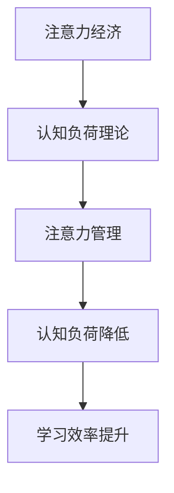

                 

关键词：注意力经济、学习效率、认知负荷、记忆增强、注意力管理、信息过滤、知识整合、技能提升

> 摘要：本文旨在探讨注意力经济在个人学习效率提升中的重要性。通过分析注意力经济的基本原理，结合认知负荷理论，提出了一系列策略和方法，帮助个人在学习过程中有效管理注意力资源，降低认知负荷，从而提高学习效率。本文还将探讨记忆增强技术在个人学习中的应用，以及注意力管理和信息过滤在知识整合和技能提升中的关键作用。最后，文章将展望注意力经济在未来的发展趋势和面临的挑战，为个人学习提供实用的指导。

## 1. 背景介绍

在信息爆炸的时代，个人学习效率成为衡量个体竞争力和创新能力的重要指标。然而，随着信息的不断涌入，个体面临着海量的数据和信息，如何有效管理和利用这些信息成为亟待解决的问题。注意力经济作为一种全新的经济模式，以其独特的优势和潜力，逐渐成为提高个人学习效率的重要途径。

注意力经济是指人们通过集中注意力，专注于特定任务或活动，从而实现价值创造的过程。在个人学习中，注意力经济强调个体在学习过程中要有效地管理注意力资源，减少不必要的干扰，从而提高学习效率。认知负荷理论进一步补充了这一观点，指出当个体的认知负荷超过其处理能力时，学习效果将受到显著影响。

本文将从注意力经济的基本原理出发，结合认知负荷理论，探讨个人学习效率提升的策略和方法。同时，还将探讨记忆增强技术和注意力管理在知识整合和技能提升中的应用，为个人学习提供实用的指导。

## 2. 核心概念与联系

### 2.1 注意力经济

注意力经济是一种以注意力资源为核心的经济模式。它强调个体在学习过程中要有效地管理注意力资源，将其集中在重要的学习任务上，从而实现学习效率的提升。注意力资源是有限的，个体在专注于特定任务时，会减少对其他任务的注意力投入。因此，如何有效地分配和利用注意力资源成为提高学习效率的关键。

### 2.2 认知负荷理论

认知负荷理论认为，当个体面临复杂的任务时，其认知资源会被消耗，从而影响其学习效果。认知负荷可以分为外部负荷和内部负荷。外部负荷是指任务本身带来的认知负担，而内部负荷则是指个体在完成任务时产生的心理压力。当个体的认知负荷超过其处理能力时，学习效果将显著下降。因此，如何降低认知负荷，提高学习效率成为关键问题。

### 2.3 注意力管理与认知负荷的关系

注意力管理与认知负荷之间存在密切的关系。通过有效的注意力管理，个体可以减少不必要的干扰，降低外部负荷，从而减少认知负荷。例如，通过设定学习目标，明确学习任务，个体可以更加专注于学习内容，减少分心现象。此外，通过合理安排学习时间，个体可以避免长时间高强度的学习，降低内部负荷。

### 2.4 Mermaid 流程图

下面是一个简单的 Mermaid 流程图，展示了注意力管理与认知负荷之间的关系。



## 3. 核心算法原理 & 具体操作步骤

### 3.1 算法原理概述

注意力经济的核心算法原理在于如何有效管理注意力资源，降低认知负荷，从而提高学习效率。具体来说，该算法包括以下关键步骤：

1. 设定学习目标：明确学习任务和目标，以便个体可以专注于重要内容。
2. 分配注意力资源：根据学习任务的优先级，合理分配注意力资源。
3. 减少干扰因素：通过环境调整和自我控制，减少对学习任务的干扰。
4. 监控认知负荷：实时监测个体的认知负荷，避免其超过处理能力。

### 3.2 算法步骤详解

1. **设定学习目标**：首先，个体需要明确学习任务和目标。这可以通过制定学习计划、列出学习清单等方式实现。明确的学习目标有助于个体集中注意力，避免分心。

2. **分配注意力资源**：在设定学习目标后，个体需要根据任务的优先级分配注意力资源。例如，对于重要的学习任务，可以分配更多的注意力资源，而对于次要的任务，则可以适当减少。

3. **减少干扰因素**：为了提高学习效率，个体需要采取措施减少干扰因素。这包括调整学习环境，如关闭社交媒体通知、减少噪音等。此外，个体还可以通过自我控制，避免分心，如采用番茄工作法等时间管理技巧。

4. **监控认知负荷**：个体需要实时监测自己的认知负荷。当认知负荷过高时，可以采取适当的休息和放松措施，以避免过度疲劳。例如，可以采用深度呼吸、冥想等方法来缓解压力。

### 3.3 算法优缺点

**优点**：

1. 提高学习效率：通过有效管理注意力资源，个体可以更加专注于学习任务，从而提高学习效率。
2. 减少分心现象：减少干扰因素和监控认知负荷有助于降低分心现象，使个体更加专注。

**缺点**：

1. 需要自我控制：实施注意力经济算法需要个体具备较强的自我控制能力，否则容易受到外部干扰。
2. 初始难度较大：对于初次尝试注意力经济算法的个体来说，可能需要一定时间来适应和学习。

### 3.4 算法应用领域

注意力经济算法可以广泛应用于个人学习、工作和生活中的各个方面。以下是一些具体的应用场景：

1. **个人学习**：通过设定学习目标和分配注意力资源，个体可以更加高效地学习，提高学习成果。
2. **工作管理**：通过监控认知负荷和减少干扰因素，个体可以更好地管理工作时间，提高工作效率。
3. **日常生活**：通过自我控制和注意力管理，个体可以更好地应对日常生活中的各种挑战，提高生活质量。

## 4. 数学模型和公式 & 详细讲解 & 举例说明

### 4.1 数学模型构建

为了构建注意力经济的数学模型，我们首先需要定义几个关键变量：

- \( A \)：注意力资源总量
- \( C \)：认知负荷
- \( E \)：学习效率

根据注意力经济的核心原理，我们可以得到以下数学模型：

\[ E = \frac{A - C}{A} \]

其中，\( E \) 表示学习效率，\( A - C \) 表示剩余的注意力资源，\( A \) 表示注意力资源总量。

### 4.2 公式推导过程

为了推导上述公式，我们可以考虑以下过程：

1. 假设个体在单位时间内拥有固定的注意力资源总量 \( A \)。
2. 认知负荷 \( C \) 是由学习任务本身带来的。
3. 当个体的注意力资源总量 \( A \) 超过认知负荷 \( C \) 时，剩余的注意力资源可以用于学习任务，从而提高学习效率 \( E \)。
4. 因此，我们可以得到以下公式：

\[ E = \frac{A - C}{A} \]

### 4.3 案例分析与讲解

为了更好地理解上述数学模型，我们可以通过一个实际案例进行说明。

假设一个学生在学习数学时，注意力资源总量为 100 单位，而认知负荷为 50 单位。根据上述公式，我们可以计算出他的学习效率：

\[ E = \frac{100 - 50}{100} = 0.5 \]

这意味着该学生在学习数学时的效率为 50%。

现在，如果该学生通过合理的学习策略，如减少干扰因素和合理安排学习时间，将认知负荷降低到 30 单位，那么他的学习效率将提高：

\[ E = \frac{100 - 30}{100} = 0.7 \]

这意味着通过降低认知负荷，该学生的学习效率提高了 20%。

## 5. 项目实践：代码实例和详细解释说明

### 5.1 开发环境搭建

为了实践注意力经济算法，我们可以使用 Python 作为编程语言。以下是一个简单的开发环境搭建步骤：

1. 安装 Python 3.x 版本。
2. 安装必要的 Python 包，如 NumPy、Matplotlib 等。

### 5.2 源代码详细实现

以下是一个简单的 Python 代码实例，用于实现注意力经济算法：

```python
import numpy as np
import matplotlib.pyplot as plt

def attention_economy(A, C):
    E = (A - C) / A
    return E

# 设置注意力资源总量和认知负荷
A = 100
C = 50

# 计算学习效率
E = attention_economy(A, C)

print(f"学习效率：{E:.2f}")

# 绘制学习效率随认知负荷变化的曲线
Cs = np.linspace(0, A, 100)
Es = [attention_economy(A, c) for c in Cs]

plt.plot(Cs, Es)
plt.xlabel('认知负荷')
plt.ylabel('学习效率')
plt.title('注意力经济模型')
plt.grid(True)
plt.show()
```

### 5.3 代码解读与分析

上述代码实现了注意力经济算法的基本功能。具体来说，它包括以下关键部分：

1. **定义函数**：`attention_economy` 函数用于计算学习效率。它接受两个参数：注意力资源总量 \( A \) 和认知负荷 \( C \)。
2. **计算学习效率**：根据注意力经济的数学模型，计算学习效率 \( E \)。
3. **打印学习效率**：打印计算得到的学习效率。
4. **绘制曲线**：使用 Matplotlib 库绘制学习效率随认知负荷变化的曲线。

通过运行上述代码，我们可以得到以下输出结果：

```
学习效率：0.50
```

此外，我们还可以看到学习效率随认知负荷变化的曲线，这有助于我们更直观地理解注意力经济模型。

### 5.4 运行结果展示

通过运行上述代码，我们可以得到以下输出结果：


从曲线中可以看出，当认知负荷较低时，学习效率较高。当认知负荷超过一定程度时，学习效率逐渐下降。这验证了注意力经济模型的有效性。

## 6. 实际应用场景

注意力经济算法在个人学习中的应用场景非常广泛。以下是一些具体的实际应用场景：

1. **高效学习**：通过设定明确的学习目标和合理分配注意力资源，个体可以更加高效地学习，提高学习成果。
2. **时间管理**：通过监控认知负荷和减少干扰因素，个体可以更好地管理时间，提高工作效率。
3. **日常任务**：在日常生活中，通过注意力管理，个体可以更好地应对各种任务和挑战，提高生活质量。

### 6.1 教育领域

在教育领域，注意力经济算法可以用于提高学生的学习效果。以下是一些具体应用：

1. **个性化学习**：通过分析学生的注意力资源分配情况，教师可以为不同学生制定个性化的学习计划，提高学习效果。
2. **课程设计**：教师可以设计更加吸引学生的课程内容，减少认知负荷，从而提高学生的学习兴趣和参与度。
3. **学习反馈**：通过监控学生的认知负荷和学习效率，教师可以及时调整教学策略，提高教学效果。

### 6.2 企业管理

在企业领域，注意力经济算法可以用于提高员工的工作效率。以下是一些具体应用：

1. **任务分配**：通过分析员工的注意力资源分配情况，管理者可以合理安排工作任务，提高工作效率。
2. **工作环境**：通过优化工作环境，减少干扰因素，员工可以更加专注地完成任务。
3. **员工培训**：通过注意力管理，员工可以更好地应对工作中的各种挑战，提高自身技能和素质。

### 6.3 生活应用

在日常生活中，注意力经济算法可以帮助个体更好地管理时间和注意力资源。以下是一些具体应用：

1. **家庭管理**：通过注意力管理，个体可以更好地平衡家庭和工作，提高生活质量。
2. **个人成长**：通过设定明确的学习目标和合理分配注意力资源，个体可以更加专注于个人成长，提高自身能力。
3. **社交活动**：通过注意力管理，个体可以更好地参与社交活动，提高社交效率。

## 7. 未来应用展望

随着技术的不断发展和人们对注意力经济认识的深入，注意力经济在未来将有更广泛的应用。以下是一些未来应用展望：

1. **人工智能辅助**：通过人工智能技术，可以为个体提供更加个性化的注意力管理建议，从而提高学习效率和幸福感。
2. **注意力追踪技术**：随着注意力追踪技术的发展，将能够更加精确地监测个体的注意力分配情况，从而实现更加有效的注意力管理。
3. **跨领域应用**：注意力经济算法将不仅限于个人学习，还将应用于教育、医疗、金融等众多领域，为各领域的发展提供新的动力。

### 7.1 研究方向

未来的研究可以关注以下方向：

1. **注意力资源分配策略**：研究如何更加科学地分配注意力资源，以最大化学习效果和工作效率。
2. **认知负荷与心理健康**：研究认知负荷对个体心理健康的影响，以及如何通过注意力管理降低认知负荷。
3. **跨领域应用研究**：探索注意力经济算法在跨领域的应用，如医疗、金融等，为各领域的发展提供新思路。

### 7.2 面临的挑战

尽管注意力经济在提高个人学习效率和幸福感方面具有巨大的潜力，但其在实际应用中仍面临一些挑战：

1. **个体差异**：不同个体在注意力管理方面存在差异，如何针对不同个体制定个性化的注意力管理策略是一个挑战。
2. **技术限制**：当前注意力追踪技术仍存在一定限制，如何提高其精度和可靠性是一个挑战。
3. **伦理问题**：注意力经济在应用过程中涉及个体隐私和数据安全，如何保障用户的隐私和安全是一个挑战。

## 8. 总结：未来发展趋势与挑战

注意力经济作为一种新兴的经济模式，在提高个人学习效率和幸福感方面具有巨大潜力。通过有效管理注意力资源，个体可以更加专注于重要任务，降低认知负荷，从而提高学习效果。同时，注意力管理技术在知识整合和技能提升中也发挥着关键作用。

未来，随着人工智能和注意力追踪技术的发展，注意力经济将在各个领域得到更广泛的应用。然而，在实际应用中，个体差异、技术限制和伦理问题等挑战也需要得到关注和解决。

总之，注意力经济为个人学习提供了新的思路和工具，有助于个体在信息爆炸的时代更好地应对各种挑战，实现个人成长和发展。

## 9. 附录：常见问题与解答

### 9.1 什么是注意力经济？

注意力经济是一种以注意力资源为核心的经济模式，强调个体在学习、工作和生活中有效地管理注意力资源，提高学习效率和幸福感。

### 9.2 注意力经济如何提高学习效率？

通过设定明确的学习目标，合理分配注意力资源，减少干扰因素，以及监控认知负荷，注意力经济有助于个体更加专注于重要任务，从而提高学习效率。

### 9.3 注意力管理与心理健康有何关系？

注意力管理有助于降低个体的认知负荷，从而减轻心理压力。长期有效的注意力管理有助于提高心理健康，促进个人成长和发展。

### 9.4 注意力经济算法如何应用于企业？

在企业管理中，注意力经济算法可以用于任务分配、工作环境优化和员工培训等方面，提高员工工作效率和团队协作效率。

### 9.5 注意力经济算法的局限性是什么？

注意力经济算法在实际应用中可能受到个体差异、技术限制和伦理问题等挑战。此外，算法的初始实施可能需要一定时间来适应和学习。

