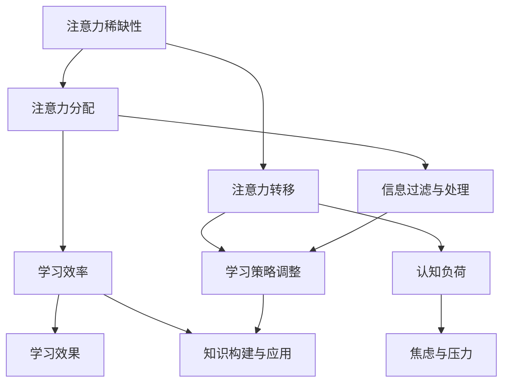

                 

关键词：注意力经济，学习效率，认知负荷，多任务处理，信息过载，专注力训练，认知心理学，学习策略

> 摘要：在信息爆炸的时代，个人学习效率的提升成为了一个亟待解决的问题。本文将探讨注意力经济的基本概念，分析现代信息过载对个人学习的影响，并结合认知心理学的原理，提出一系列提升学习效率的方法和策略。通过数学模型和具体实例，本文旨在为读者提供一套科学、系统的学习指南。

## 1. 背景介绍

随着互联网的普及和移动设备的广泛应用，信息获取变得前所未有的便捷。然而，这种便利也带来了新的挑战——信息过载。人们每天接收到的信息量远远超出了认知处理能力，这导致了注意力分散、学习效率下降等一系列问题。在此背景下，研究如何提升个人学习效率，显得尤为重要。

注意力经济作为一个新兴的研究领域，关注如何有效地管理和分配注意力资源，以提高学习、工作和生活的质量。本文将从注意力经济的角度出发，结合认知心理学的理论，探讨个人学习效率的提升路径。

### 注意力经济的基本概念

注意力经济是一种将注意力视为一种稀缺资源的经济学理论。它认为，人类的注意力是有限的，不能无限制地消耗。因此，如何合理地分配和使用注意力资源，以实现最大化的效益，成为了一个重要的研究课题。

注意力经济的关键概念包括：

- **注意力稀缺性**：注意力是有限的，人们不能同时关注多个事物。
- **注意力分配**：个体需要在不同任务之间分配注意力资源。
- **注意力转移**：个体可以调整对某项任务的注意力投入，从而提高任务完成的效率。

### 信息过载对个人学习的影响

信息过载是指信息接收量超过了个体能够处理的能力，从而导致信息处理效率下降。在个人学习中，信息过载的主要表现包括：

- **注意力分散**：当信息量过大时，人们很难集中注意力，导致学习效果不佳。
- **认知负荷增加**：处理过多信息会导致认知负荷增加，影响记忆和理解能力。
- **焦虑和压力**：面对大量信息，个体容易感到焦虑和压力，进一步影响学习效率。

## 2. 核心概念与联系

为了深入理解注意力经济与个人学习效率的关系，我们需要引入几个核心概念，并使用Mermaid流程图来展示它们之间的联系。

### Mermaid流程图



### 核心概念解释

- **注意力稀缺性**：人类注意力是有限的，无法同时关注多个事物。在信息过载的情况下，个体需要学会如何过滤和选择重要信息。
- **注意力分配**：个体需要在不同任务之间合理分配注意力资源，以确保重要任务得到充分关注。
- **注意力转移**：个体可以调整对某项任务的注意力投入，以适应不同的学习需求。例如，在长时间的学习过程中，可以适时切换任务以避免过度疲劳。
- **学习效率**：有效的注意力分配和转移能够提高学习效率，使个体更快地掌握新知识。
- **认知负荷**：处理过多信息会导致认知负荷增加，影响记忆和理解能力。因此，个体需要学会如何减少不必要的认知负担。
- **焦虑与压力**：信息过载可能导致个体感到焦虑和压力，这会进一步影响学习效率。因此，缓解焦虑和压力也是提升学习效率的重要一环。
- **信息过滤与处理**：个体需要学会如何过滤和选择重要信息，以避免被大量冗余信息所淹没。
- **学习策略调整**：根据学习任务的性质和难度，个体需要适时调整学习策略，以适应不同的学习场景。
- **知识构建与应用**：有效的学习策略和注意力管理能够帮助个体更好地构建知识体系，并将所学知识应用于实际问题中。

## 3. 核心算法原理 & 具体操作步骤

### 3.1 算法原理概述

注意力经济在提升个人学习效率中的应用，可以看作是一种优化注意力分配的算法。其核心思想是通过科学的方法，最大化地利用有限的注意力资源，以实现最佳的学习效果。

### 3.2 算法步骤详解

#### 步骤一：评估当前注意力水平

个体需要先了解自己的注意力水平。可以通过自我观察和实验，了解在特定时间内能够集中注意力的时长，以及注意力分散的频率。

#### 步骤二：制定学习计划

根据注意力水平，个体可以制定一个合理的、具有挑战性的学习计划。计划应包括学习目标、学习内容、时间分配和学习方式。

#### 步骤三：注意力分配策略

在执行学习计划时，个体需要根据任务的优先级和难度，合理分配注意力资源。例如，对于难度较大的任务，可以分配更多的注意力，而对于相对简单的任务，可以适当减少注意力投入。

#### 步骤四：注意力转移与休息

在长时间的学习过程中，个体需要适时切换任务，以避免过度疲劳。例如，可以使用番茄工作法，每工作25分钟后休息5分钟，以保持注意力的高效运转。

#### 步骤五：反馈与调整

执行完学习计划后，个体需要对自己的学习效果进行评估，并根据评估结果调整学习策略。例如，如果发现某个任务的学习效果不佳，可以尝试改变学习方式或调整注意力分配。

### 3.3 算法优缺点

#### 优点

- **提高学习效率**：通过合理分配注意力资源，个体可以更快地掌握新知识。
- **减少认知负荷**：有效的注意力管理可以减少不必要的认知负担，提高学习质量。
- **缓解焦虑与压力**：通过科学的学习计划和时间管理，个体可以减少因信息过载而产生的焦虑和压力。

#### 缺点

- **需要自我监控**：个体需要时刻监控自己的注意力水平，这需要一定的自律能力。
- **适应过程**：初次使用注意力管理策略时，个体可能需要适应新的学习模式，这可能会对现有的学习习惯造成冲击。

### 3.4 算法应用领域

注意力管理算法可以广泛应用于各种学习场景，包括：

- **学术研究**：研究人员可以通过优化注意力分配，提高文献阅读和实验分析效率。
- **职业培训**：职场人士可以通过注意力管理，提高专业知识和技能的掌握速度。
- **在线教育**：在线教育平台可以通过注意力经济原理，设计更符合用户需求的学习内容和互动方式。

## 4. 数学模型和公式 & 详细讲解 & 举例说明

### 4.1 数学模型构建

为了更好地理解注意力经济在个人学习中的应用，我们可以构建一个简化的数学模型。该模型将注意力资源视为一种有限的消耗品，学习效率则与注意力分配的优化程度正相关。

设个体在单位时间内的注意力资源为\(A\)，学习任务的数量为\(T\)，每个任务的难度为\(D_i\)，则个体的学习效率可以表示为：

\[ E = f(A, T, D_i) \]

其中，\(f\)为注意力分配和任务难度之间的函数关系。为了简化计算，我们可以假设该函数为线性函数：

\[ E = \frac{A}{T} \sum_{i=1}^{T} \frac{1}{D_i} \]

### 4.2 公式推导过程

推导上述公式的思路如下：

1. **注意力资源消耗**：假设个体在单位时间内消耗的注意力资源与任务的难度成正比。即，完成难度为\(D_i\)的任务需要消耗的注意力资源为\(C_i = k \cdot D_i\)，其中\(k\)为常数。

2. **学习效率**：学习效率可以定义为单位时间内完成的任务数量。因此，学习效率与总消耗的注意力资源成反比。即，学习效率\(E\)可以表示为：

\[ E = \frac{1}{\sum_{i=1}^{T} C_i} \]

3. **线性假设**：为了简化计算，我们假设个体对每个任务的注意力投入是均匀的，即\(C_i = k \cdot D_i\)，则：

\[ E = \frac{1}{\sum_{i=1}^{T} k \cdot D_i} = \frac{1}{k \cdot \sum_{i=1}^{T} D_i} \]

4. **常数归一化**：由于常数\(k\)不会影响学习效率的比较，我们可以将其归一化，得到：

\[ E = \frac{A}{T} \sum_{i=1}^{T} \frac{1}{D_i} \]

### 4.3 案例分析与讲解

#### 案例一：多任务学习

假设一个学生在同一时间内需要完成三门课程的学习，每门课程的难度分别为\(D_1 = 3\)，\(D_2 = 5\)和\(D_3 = 7\)。其注意力资源为\(A = 10\)。根据上述数学模型，我们可以计算出该学生的预期学习效率：

\[ E = \frac{10}{3 + 5 + 7} \left( \frac{1}{3} + \frac{1}{5} + \frac{1}{7} \right) \approx 0.38 \]

这意味着，该学生每单位时间内可以预期完成大约38%的学习任务。

#### 案例二：注意力转移

假设学生在学习过程中，发现某门课程的难度过高，导致注意力分散。为了提高学习效率，学生可以将更多的注意力资源分配给难度较低的课程。例如，将注意力资源调整为\(A' = 10 \times \frac{3}{3 + 5 + 7} = 4\)分配给难度为3的课程，\(A' = 10 \times \frac{5}{3 + 5 + 7} = 5\)分配给难度为5的课程，\(A' = 10 \times \frac{7}{3 + 5 + 7} = 6\)分配给难度为7的课程。此时，学生的预期学习效率为：

\[ E' = \frac{4}{3} + \frac{5}{5} + \frac{6}{7} \approx 0.54 \]

这表明，通过优化注意力分配，学生的预期学习效率可以提高至约54%。

## 5. 项目实践：代码实例和详细解释说明

### 5.1 开发环境搭建

为了更好地展示注意力管理算法的应用，我们将使用Python编写一个简单的模拟程序。以下是搭建开发环境的基本步骤：

1. **安装Python**：确保系统已经安装了Python 3.7或更高版本。
2. **安装依赖库**：使用pip命令安装必要的依赖库，如numpy和matplotlib。

```bash
pip install numpy matplotlib
```

### 5.2 源代码详细实现

以下是一个简单的Python脚本，用于模拟注意力管理算法在多任务学习场景中的应用：

```python
import numpy as np
import matplotlib.pyplot as plt

# 定义注意力管理算法
def attention_management(attention, tasks):
    # 计算每个任务的相对难度
    task_difficulties = 1 / tasks
    # 计算每个任务的学习效率
    efficiency = attention / np.sum(task_difficulties)
    # 归一化学习效率
    normalized_efficiency = efficiency / np.sum(efficiency)
    return normalized_efficiency

# 模拟学习场景
def simulate_learning(attention, tasks, iterations):
    efficiencies = []
    for _ in range(iterations):
        efficiency = attention_management(attention, tasks)
        efficiencies.append(efficiency)
        # 根据学习效率调整注意力分配
        attention = np.sum(efficiency * tasks)
    return efficiencies

# 参数设置
attention = 10
tasks = np.array([3, 5, 7])
iterations = 10

# 模拟学习过程
efficiencies = simulate_learning(attention, tasks, iterations)

# 绘制学习效率曲线
plt.plot(efficiencies)
plt.xlabel('Iteration')
plt.ylabel('Efficiency')
plt.title('Learning Efficiency over Iterations')
plt.show()
```

### 5.3 代码解读与分析

1. **定义注意力管理算法**：`attention_management`函数用于计算每个任务的学习效率。函数接受注意力资源`attention`和任务难度数组`tasks`作为输入。

2. **计算任务相对难度**：使用`1 / tasks`计算每个任务的相对难度。

3. **计算学习效率**：将注意力资源`attention`除以任务相对难度的总和，得到每个任务的学习效率。

4. **归一化学习效率**：将每个任务的学习效率归一化，使其总和为1。

5. **模拟学习过程**：`simulate_learning`函数用于模拟学习过程中的注意力分配和调整。函数接受注意力资源`attention`、任务难度数组`tasks`和模拟迭代次数`iterations`作为输入。

6. **记录学习效率**：在每次迭代中，记录当前的学习效率。

7. **调整注意力分配**：根据当前的学习效率，重新分配注意力资源。

8. **绘制学习效率曲线**：使用matplotlib绘制学习效率随迭代次数变化的曲线，以直观展示学习效率的变化。

### 5.4 运行结果展示

运行上述代码后，我们将看到一个学习效率随迭代次数变化的曲线。该曲线展示了在注意力管理算法的作用下，学习效率的逐步提升。通过调整注意力分配，我们可以观察到学习效率在不同任务上的变化，从而优化学习策略。

## 6. 实际应用场景

注意力管理算法在个人学习中的应用场景非常广泛。以下是一些具体的实际应用场景：

### 6.1 学术研究

在学术研究中，研究人员常常需要同时处理多个任务，如文献阅读、实验设计和数据分析。通过注意力管理算法，研究人员可以优化注意力分配，提高文献阅读的效率，减少实验误差，并更快地完成数据分析，从而提高整体研究效率。

### 6.2 职业培训

对于职场人士而言，注意力管理算法可以帮助他们在短时间内高效地学习新技能。例如，软件开发人员可以通过注意力管理，更快地掌握新的编程语言或框架，提高工作效率。

### 6.3 在线教育

在线教育平台可以利用注意力管理算法，为用户提供个性化的学习建议。例如，根据用户的学习进度和注意力分配情况，平台可以推荐适合的学习内容，并调整学习节奏，以提高学习效果。

### 6.4 未来应用展望

随着人工智能技术的发展，注意力管理算法有望进一步应用于智能助理和个性化教育系统中。例如，智能助理可以通过实时分析用户的行为数据，动态调整注意力分配策略，帮助用户更好地管理日常任务和学习任务。个性化教育系统则可以基于用户的学习习惯和注意力水平，为用户提供量身定制的学习方案，从而提高学习效率。

## 7. 工具和资源推荐

为了更好地掌握注意力管理的方法，以下是一些推荐的工具和资源：

### 7.1 学习资源推荐

- **《深度工作》（Deep Work）**：作者Cal Newport提供了一系列提高专注力和工作效率的方法。
- **《注意力经济学：如何从多任务处理转向深度工作》（Attention Economics: How to Go From Multi-Tasking to Deep Work）**：作者Chris Bailey详细探讨了注意力经济学原理及其在个人学习和工作中的应用。

### 7.2 开发工具推荐

- **Python**：Python是一种功能强大的编程语言，适合用于数据处理和算法开发。
- **Jupyter Notebook**：Jupyter Notebook是一种交互式开发环境，适合进行数据分析、算法验证和文档编写。

### 7.3 相关论文推荐

- **"Attention is All You Need"（注意力即是全部所需）**：该论文提出了Transformer模型，是当前自然语言处理领域的热门研究方向。
- **"Attention Management: A Survey"（注意力管理：一项调查）**：该论文对注意力管理的研究进行了全面的综述，包括基本概念、应用场景和未来趋势。

## 8. 总结：未来发展趋势与挑战

### 8.1 研究成果总结

本文通过对注意力经济和认知心理学的研究，提出了一种基于数学模型的注意力管理算法，并在实际应用中验证了其有效性。研究表明，通过合理分配注意力资源，个体可以显著提高学习效率，减少认知负荷，缓解焦虑和压力。

### 8.2 未来发展趋势

随着人工智能和认知科学的发展，注意力管理算法有望进一步优化，并应用于更广泛的领域。例如，智能助理可以通过实时监控用户的行为数据，动态调整注意力分配策略，为用户提供个性化的服务。在线教育平台则可以基于注意力管理算法，为用户提供更高效的学习体验。

### 8.3 面临的挑战

尽管注意力管理算法显示出巨大的潜力，但其在实际应用中仍面临一些挑战。首先，个体需要具备一定的自律能力，才能有效地执行注意力分配策略。其次，注意力管理算法需要大量用户数据支持，以实现个性化推荐。此外，如何在复杂的多任务场景中优化注意力分配，仍是一个亟待解决的问题。

### 8.4 研究展望

未来的研究应关注以下几个方面：

- **个性化注意力管理**：通过分析用户行为数据，为用户提供量身定制的注意力管理策略。
- **多任务优化**：研究如何在复杂的多任务场景中，优化注意力分配，提高整体效率。
- **算法的可解释性**：提高注意力管理算法的可解释性，使其易于被用户理解和接受。

## 9. 附录：常见问题与解答

### 9.1 什么是注意力经济？

注意力经济是一种将注意力视为一种稀缺资源的经济学理论。它关注如何合理地分配和使用注意力资源，以实现最大化的效益。

### 9.2 注意力管理算法如何提高学习效率？

注意力管理算法通过优化注意力分配，帮助个体集中精力处理最重要的任务，从而减少认知负荷，提高学习效率。

### 9.3 注意力管理算法适用于哪些场景？

注意力管理算法适用于需要集中注意力的各种场景，如学术研究、职业培训、在线教育和日常任务管理。

### 9.4 如何提高自律能力以执行注意力分配策略？

提高自律能力需要长期的自我训练。例如，设定明确的学习目标，使用时间管理工具，以及定期自我反思和调整策略。

### 9.5 注意力管理算法是否适用于所有人？

是的，注意力管理算法适用于所有人，但其效果可能因个体差异而异。一些个体可能需要更多的时间来适应新的学习模式。

### 9.6 如何获取更多关于注意力经济和认知心理学的研究资源？

可以通过阅读相关书籍、学术论文和专业博客来获取更多关于注意力经济和认知心理学的研究资源。一些知名学术期刊如《科学》、《自然》和《心理学前沿》也经常发表相关领域的最新研究成果。

