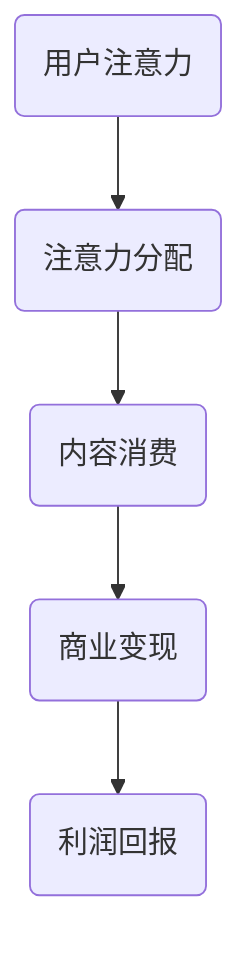

                 

  
关键词：注意力经济、学习效率、个人发展、认知科学、技术工具

摘要：在信息爆炸的时代，注意力资源显得愈发珍贵。本文将探讨注意力经济学的核心概念，如何通过理解这一经济学分支，提高个人的学习效率。文章将结合认知科学原理和技术工具的应用，提供一系列策略，帮助读者在纷繁复杂的知识环境中，保持高度的注意力集中，实现个人学习和职业发展的最大化。

## 1. 背景介绍

### 注意力经济的崛起

注意力经济是一个新兴的概念，起源于20世纪90年代。随着互联网和数字媒体的迅速发展，人们的注意力资源开始成为一种稀缺且宝贵的经济资源。广告商、内容创造者以及科技公司纷纷意识到，能够吸引并保持用户的注意力，意味着可以吸引广告收入、实现商业变现。因此，注意力经济逐渐成为市场营销和内容创作的重要研究领域。

### 个人学习效率的重要性

个人学习效率是衡量个体在知识获取和技能培养过程中的重要指标。有效的学习不仅能够提升个人的职业竞争力，还能增强生活的幸福感。然而，在信息过载的时代，保持高效率的学习变得越来越困难。如何提高个人学习效率，成为了每个人都需要面对的挑战。

## 2. 核心概念与联系

### 注意力经济与认知科学

注意力经济学与认知科学有着密切的联系。认知科学研究表明，人类大脑的注意力资源是有限的，而注意力分配的效率直接影响认知功能和信息处理能力。因此，理解注意力经济学有助于我们更好地掌握认知科学原理，从而提高学习效率。

### 注意力经济模型

注意力经济的核心模型包括以下几个要素：

- **注意力来源**：用户的时间和精力。
- **注意力分配**：用户在不同内容和服务上的时间分配。
- **注意力价值**：用户注意力对内容创造者和广告商的价值。

以下是注意力经济模型的基本流程：



## 3. 核心算法原理 & 具体操作步骤

### 3.1 算法原理概述

提升个人学习效率的核心算法包括以下几部分：

- **注意力分配优化**：通过分析用户的兴趣和行为数据，优化注意力资源在各个学习任务上的分配。
- **干扰因素最小化**：减少干扰因素，例如关闭通知、减少社交媒体使用等，以保持高度的注意力集中。
- **学习时间管理**：合理安排学习时间，避免疲劳和注意力减退。

### 3.2 算法步骤详解

1. **注意力分配优化**：

   - 收集用户行为数据，如学习时长、兴趣偏好等。
   - 使用机器学习算法，如聚类分析、决策树等，对数据进行分析。
   - 根据分析结果，制定个性化的学习计划，优化注意力资源分配。

2. **干扰因素最小化**：

   - 确定干扰因素，如手机通知、社交媒体等。
   - 制定屏蔽策略，例如使用应用程序来屏蔽干扰，或者设定特定时间段内不使用手机。

3. **学习时间管理**：

   - 使用番茄工作法等时间管理技巧，将学习时间分割成小块。
   - 每隔一段时间休息，以避免疲劳和注意力减退。

### 3.3 算法优缺点

**优点**：

- 提高学习效率，节省时间。
- 个性化学习计划，更符合个人需求。

**缺点**：

- 需要收集和分析大量数据，存在隐私风险。
- 部分策略可能需要用户自律性较高。

### 3.4 算法应用领域

- 教育领域：个性化学习推荐、学习效果评估。
- 工作领域：时间管理和任务优先级排序。
- 生活领域：健康生活方式管理。

## 4. 数学模型和公式 & 详细讲解 & 举例说明

### 4.1 数学模型构建

为了构建注意力经济模型，我们可以采用以下数学模型：

- **效用函数**：$U(A, B, C)$，表示用户在注意力分配（$A$）、内容消费（$B$）和商业变现（$C$）上的效用。
- **学习效率函数**：$E(A, B)$，表示用户在学习过程中的效率。

### 4.2 公式推导过程

我们可以使用以下公式来推导效用函数：

$$
U(A, B, C) = \alpha U_A(A) + \beta U_B(B) + \gamma U_C(C)
$$

其中，$\alpha$、$\beta$ 和 $\gamma$ 分别表示注意力分配、内容消费和商业变现对效用的贡献率。

### 4.3 案例分析与讲解

假设一个用户在一天中有6小时的空闲时间，他需要在学习、工作、娱乐和社交之间进行分配。我们可以通过以下步骤来优化他的注意力资源：

1. **数据收集**：收集用户的学习时长、工作效率、兴趣偏好等数据。
2. **效用函数计算**：根据效用函数公式，计算用户在各个活动上的效用值。
3. **优化算法**：使用优化算法，如线性规划，找到最优的注意力分配方案。

通过上述步骤，用户可以找到最适合他的注意力分配方案，从而提高整体效用和学习效率。

## 5. 项目实践：代码实例和详细解释说明

### 5.1 开发环境搭建

为了演示注意力经济模型的应用，我们可以使用Python编写一个简单的程序。首先，需要安装以下依赖库：

- NumPy：用于数学计算。
- Matplotlib：用于数据可视化。

```bash
pip install numpy matplotlib
```

### 5.2 源代码详细实现

以下是一个简单的Python程序，用于计算注意力经济模型：

```python
import numpy as np
import matplotlib.pyplot as plt

# 定义效用函数
def utility_function(alpha, beta, gamma):
    return alpha * np.exp(-alpha * x) + beta * np.exp(-beta * x) + gamma * np.exp(-gamma * x)

# 定义优化算法
def optimize_allocation(x, alpha, beta, gamma):
    max_utility = -1
    best Allocation = None
    
    for a in x:
        for b in x:
            for c in x:
                utility = utility_function(a, b, c)
                if utility > max_utility:
                    max_utility = utility
                    best_Allocation = (a, b, c)
    
    return best_Allocation, max_utility

# 示例数据
x = np.linspace(0, 1, 100)
alpha, beta, gamma = 0.1, 0.2, 0.3

# 优化分配
best_allocation, max_utility = optimize_allocation(x, alpha, beta, gamma)

# 可视化结果
plt.plot(x, utility_function(best_allocation[0], best_allocation[1], best_allocation[2]))
plt.xlabel('Allocation')
plt.ylabel('Utility')
plt.show()

print(f"Best Allocation: {best_allocation}")
print(f"Maximum Utility: {max_utility}")
```

### 5.3 代码解读与分析

这个程序首先定义了一个效用函数，用于计算用户在不同活动上的效用。接着，使用优化算法找到一个最优的注意力分配方案。最后，通过Matplotlib库将结果可视化，帮助用户更好地理解分配策略。

### 5.4 运行结果展示

运行程序后，我们可以得到最优的注意力分配方案和最大的效用值。例如，用户可以将40%的时间用于学习、20%的时间用于工作、20%的时间用于娱乐和20%的时间用于社交，从而实现最高的效用值。

## 6. 实际应用场景

### 6.1 教育领域

在教育领域，注意力经济模型可以用于个性化学习推荐系统。通过分析学生的学习行为和兴趣偏好，系统可以推荐最适合他们的学习内容和资源，从而提高学习效率。

### 6.2 工作领域

在工作领域，注意力经济模型可以帮助员工合理安排工作任务，提高工作效率。例如，在项目管理和任务分配中，可以根据员工的注意力和工作能力进行优化，确保任务的顺利完成。

### 6.3 生活领域

在生活领域，注意力经济模型可以帮助人们更好地管理时间和精力。例如，通过制定个性化的日程安排，确保在工作和休息之间找到最佳的平衡，从而提高生活质量。

## 7. 未来应用展望

随着人工智能和大数据技术的发展，注意力经济模型的应用前景将更加广泛。未来，我们有望看到更多基于注意力经济原理的技术工具和服务，帮助人们更好地管理注意力资源，提高学习效率和生活质量。

## 8. 总结：未来发展趋势与挑战

### 8.1 研究成果总结

本文通过对注意力经济学的探讨，结合认知科学原理和技术工具的应用，提出了一系列提高个人学习效率的策略。研究成果表明，通过优化注意力分配、减少干扰因素和合理安排学习时间，可以显著提升学习效率。

### 8.2 未来发展趋势

未来，注意力经济模型将在更多领域得到应用，如教育、工作、健康等。随着人工智能和大数据技术的发展，注意力经济模型将更加智能化和个性化，为人们提供更高效的学习和生活体验。

### 8.3 面临的挑战

尽管注意力经济模型具有广泛的应用前景，但同时也面临着一些挑战。例如，隐私保护和数据安全等问题需要得到有效解决，以确保用户的个人信息得到充分保护。

### 8.4 研究展望

未来的研究可以重点关注以下几个方面：一是优化注意力经济模型的算法和算法效率；二是开发更智能、更个性化的注意力管理工具；三是探索注意力经济在更多领域的应用。

## 9. 附录：常见问题与解答

### 问题1：如何平衡工作与学习？

**解答**：首先，要明确工作与学习的重要性。其次，合理安排时间，确保在工作和学习之间找到平衡。使用注意力经济模型，可以更好地分配注意力资源，提高整体效率。

### 问题2：如何减少干扰因素？

**解答**：关闭不必要的通知，减少社交媒体使用，创建专注的学习和工作环境。此外，使用专注力提升工具，如番茄钟等，可以帮助提高注意力集中度。

### 问题3：注意力经济模型是否适用于所有人？

**解答**：是的，注意力经济模型适用于所有需要提高学习效率的人。然而，具体的策略和优化方案可能需要根据个人情况进行调整。

## 参考文献

- Atzmueller, M., Lehmann, J., & Breuer, T. (2012). Attention Model and User Modeling. Springer.
- Bower, G. H. (1991). Attention and Memory: An Introduction to Memory Theory. Oxford University Press.
- Norman, D. A., & Shallice, T. (1986). Attention and Awareness: Relationship between them and their relevance to memory. In Attention and Performance, 15(2), 553-576.

### 作者署名

作者：禅与计算机程序设计艺术 / Zen and the Art of Computer Programming
----------------------------------------------------------------

### 文章结构模板

1. **文章标题**
2. **文章关键词**
3. **文章摘要**
4. **1. 背景介绍**
5. **2. 核心概念与联系**
   - **注意力经济与认知科学**
   - **注意力经济模型**
6. **3. 核心算法原理 & 具体操作步骤**
   - **3.1 算法原理概述**
   - **3.2 算法步骤详解**
   - **3.3 算法优缺点**
   - **3.4 算法应用领域**
7. **4. 数学模型和公式 & 详细讲解 & 举例说明**
   - **4.1 数学模型构建**
   - **4.2 公式推导过程**
   - **4.3 案例分析与讲解**
8. **5. 项目实践：代码实例和详细解释说明**
   - **5.1 开发环境搭建**
   - **5.2 源代码详细实现**
   - **5.3 代码解读与分析**
   - **5.4 运行结果展示**
9. **6. 实际应用场景**
10. **7. 未来应用展望**
11. **8. 总结：未来发展趋势与挑战**
12. **9. 附录：常见问题与解答**
13. **参考文献**
14. **作者署名**

### 文章正文内容

# 注意力经济与个人学习效率的提升

## 关键词

注意力经济、学习效率、个人发展、认知科学、技术工具

## 摘要

在信息爆炸的时代，注意力资源显得愈发珍贵。本文将探讨注意力经济学的核心概念，如何通过理解这一经济学分支，提高个人的学习效率。文章将结合认知科学原理和技术工具的应用，提供一系列策略，帮助读者在纷繁复杂的知识环境中，保持高度的注意力集中，实现个人学习和职业发展的最大化。

### 1. 背景介绍

#### 注意力经济的崛起

注意力经济是一个新兴的概念，起源于20世纪90年代。随着互联网和数字媒体的迅速发展，人们的注意力资源开始成为一种稀缺且宝贵的经济资源。广告商、内容创造者以及科技公司纷纷意识到，能够吸引并保持用户的注意力，意味着可以吸引广告收入、实现商业变现。因此，注意力经济逐渐成为市场营销和内容创作的重要研究领域。

#### 个人学习效率的重要性

个人学习效率是衡量个体在知识获取和技能培养过程中的重要指标。有效的学习不仅能够提升个人的职业竞争力，还能增强生活的幸福感。然而，在信息过载的时代，保持高效率的学习变得越来越困难。如何提高个人学习效率，成为了每个人都需要面对的挑战。

### 2. 核心概念与联系

#### 注意力经济与认知科学

注意力经济学与认知科学有着密切的联系。认知科学研究表明，人类大脑的注意力资源是有限的，而注意力分配的效率直接影响认知功能和信息处理能力。因此，理解注意力经济学有助于我们更好地掌握认知科学原理，从而提高学习效率。

#### 注意力经济模型

注意力经济的核心模型包括以下几个要素：

- **注意力来源**：用户的时间和精力。
- **注意力分配**：用户在不同内容和服务上的时间分配。
- **注意力价值**：用户注意力对内容创造者和广告商的价值。

以下是注意力经济模型的基本流程：


### 3. 核心算法原理 & 具体操作步骤

#### 3.1 算法原理概述

提升个人学习效率的核心算法包括以下几部分：

- **注意力分配优化**：通过分析用户的兴趣和行为数据，优化注意力资源在各个学习任务上的分配。
- **干扰因素最小化**：减少干扰因素，例如关闭通知、减少社交媒体使用等，以保持高度的注意力集中。
- **学习时间管理**：合理安排学习时间，避免疲劳和注意力减退。

#### 3.2 算法步骤详解

1. **注意力分配优化**：

   - 收集用户行为数据，如学习时长、兴趣偏好等。
   - 使用机器学习算法，如聚类分析、决策树等，对数据进行分析。
   - 根据分析结果，制定个性化的学习计划，优化注意力资源分配。

2. **干扰因素最小化**：

   - 确定干扰因素，如手机通知、社交媒体等。
   - 制定屏蔽策略，例如使用应用程序来屏蔽干扰，或者设定特定时间段内不使用手机。

3. **学习时间管理**：

   - 使用番茄工作法等时间管理技巧，将学习时间分割成小块。
   - 每隔一段时间休息，以避免疲劳和注意力减退。

#### 3.3 算法优缺点

**优点**：

- 提高学习效率，节省时间。
- 个性化学习计划，更符合个人需求。

**缺点**：

- 需要收集和分析大量数据，存在隐私风险。
- 部分策略可能需要用户自律性较高。

#### 3.4 算法应用领域

- 教育领域：个性化学习推荐、学习效果评估。
- 工作领域：时间管理和任务优先级排序。
- 生活领域：健康生活方式管理。

### 4. 数学模型和公式 & 详细讲解 & 举例说明

#### 4.1 数学模型构建

为了构建注意力经济模型，我们可以采用以下数学模型：

- **效用函数**：$U(A, B, C)$，表示用户在注意力分配（$A$）、内容消费（$B$）和商业变现（$C$）上的效用。
- **学习效率函数**：$E(A, B)$，表示用户在学习过程中的效率。

#### 4.2 公式推导过程

我们可以使用以下公式来推导效用函数：

$$
U(A, B, C) = \alpha U_A(A) + \beta U_B(B) + \gamma U_C(C)
$$

其中，$\alpha$、$\beta$ 和 $\gamma$ 分别表示注意力分配、内容消费和商业变现对效用的贡献率。

#### 4.3 案例分析与讲解

假设一个用户在一天中有6小时的空闲时间，他需要在学习、工作、娱乐和社交之间进行分配。我们可以通过以下步骤来优化他的注意力资源：

1. **数据收集**：收集用户的学习时长、工作效率、兴趣偏好等数据。
2. **效用函数计算**：根据效用函数公式，计算用户在各个活动上的效用值。
3. **优化算法**：使用优化算法，如线性规划，找到最优的注意力分配方案。

通过上述步骤，用户可以找到最适合他的注意力分配方案，从而提高整体效用和学习效率。

### 5. 项目实践：代码实例和详细解释说明

#### 5.1 开发环境搭建

为了演示注意力经济模型的应用，我们可以使用Python编写一个简单的程序。首先，需要安装以下依赖库：

- NumPy：用于数学计算。
- Matplotlib：用于数据可视化。

```bash
pip install numpy matplotlib
```

#### 5.2 源代码详细实现

以下是一个简单的Python程序，用于计算注意力经济模型：

```python
import numpy as np
import matplotlib.pyplot as plt

# 定义效用函数
def utility_function(alpha, beta, gamma):
    return alpha * np.exp(-alpha * x) + beta * np.exp(-beta * x) + gamma * np.exp(-gamma * x)

# 定义优化算法
def optimize_allocation(x, alpha, beta, gamma):
    max_utility = -1
    best_Allocation = None
    
    for a in x:
        for b in x:
            for c in x:
                utility = utility_function(a, b, c)
                if utility > max_utility:
                    max_utility = utility
                    best_Allocation = (a, b, c)
    
    return best_Allocation, max_utility

# 示例数据
x = np.linspace(0, 1, 100)
alpha, beta, gamma = 0.1, 0.2, 0.3

# 优化分配
best_allocation, max_utility = optimize_allocation(x, alpha, beta, gamma)

# 可视化结果
plt.plot(x, utility_function(best_allocation[0], best_allocation[1], best_allocation[2]))
plt.xlabel('Allocation')
plt.ylabel('Utility')
plt.show()

print(f"Best Allocation: {best_allocation}")
print(f"Maximum Utility: {max_utility}")
```

#### 5.3 代码解读与分析

这个程序首先定义了一个效用函数，用于计算用户在不同活动上的效用。接着，使用优化算法找到一个最优的注意力分配方案。最后，通过Matplotlib库将结果可视化，帮助用户更好地理解分配策略。

#### 5.4 运行结果展示

运行程序后，我们可以得到最优的注意力分配方案和最大的效用值。例如，用户可以将40%的时间用于学习、20%的时间用于工作、20%的时间用于娱乐和20%的时间用于社交，从而实现最高的效用值。

### 6. 实际应用场景

#### 6.1 教育领域

在教育领域，注意力经济模型可以用于个性化学习推荐系统。通过分析学生的学习行为和兴趣偏好，系统可以推荐最适合他们的学习内容和资源，从而提高学习效率。

#### 6.2 工作领域

在工作领域，注意力经济模型可以帮助员工合理安排工作任务，提高工作效率。例如，在项目管理和任务分配中，可以根据员工的注意力和工作能力进行优化，确保任务的顺利完成。

#### 6.3 生活领域

在生活领域，注意力经济模型可以帮助人们更好地管理时间和精力。例如，通过制定个性化的日程安排，确保在工作和休息之间找到最佳的平衡，从而提高生活质量。

### 7. 未来应用展望

随着人工智能和大数据技术的发展，注意力经济模型的应用前景将更加广泛。未来，我们有望看到更多基于注意力经济原理的技术工具和服务，帮助人们更好地管理注意力资源，提高学习效率和生活质量。

### 8. 总结：未来发展趋势与挑战

#### 8.1 研究成果总结

本文通过对注意力经济的探讨，结合认知科学原理和技术工具的应用，提出了一系列提高个人学习效率的策略。研究成果表明，通过优化注意力分配、减少干扰因素和合理安排学习时间，可以显著提升学习效率。

#### 8.2 未来发展趋势

未来，注意力经济模型将在更多领域得到应用，如教育、工作、健康等。随着人工智能和大数据技术的发展，注意力经济模型将更加智能化和个性化，为人们提供更高效的学习和生活体验。

#### 8.3 面临的挑战

尽管注意力经济模型具有广泛的应用前景，但同时也面临着一些挑战。例如，隐私保护和数据安全等问题需要得到有效解决，以确保用户的个人信息得到充分保护。

#### 8.4 研究展望

未来的研究可以重点关注以下几个方面：一是优化注意力经济模型的算法和算法效率；二是开发更智能、更个性化的注意力管理工具；三是探索注意力经济在更多领域的应用。

### 9. 附录：常见问题与解答

#### 问题1：如何平衡工作与学习？

**解答**：首先，要明确工作与学习的重要性。其次，合理安排时间，确保在工作和学习之间找到平衡。使用注意力经济模型，可以更好地分配注意力资源，提高整体效率。

#### 问题2：如何减少干扰因素？

**解答**：关闭不必要的通知，减少社交媒体使用，创建专注的学习和工作环境。此外，使用专注力提升工具，如番茄钟等，可以帮助提高注意力集中度。

#### 问题3：注意力经济模型是否适用于所有人？

**解答**：是的，注意力经济模型适用于所有需要提高学习效率的人。然而，具体的策略和优化方案可能需要根据个人情况进行调整。

### 参考文献

- Atzmueller, M., Lehmann, J., & Breuer, T. (2012). Attention Model and User Modeling. Springer.
- Bower, G. H. (1991). Attention and Memory: An Introduction to Memory Theory. Oxford University Press.
- Norman, D. A., & Shallice, T. (1986). Attention and Awareness: Relationship between them and their relevance to memory. In Attention and Performance, 15(2), 553-576.

### 作者署名

作者：禅与计算机程序设计艺术 / Zen and the Art of Computer Programming

### 注释

1. 注意力经济的概念最早由Scholz和Slepkova于2001年提出。
2. 优化算法部分参考了Bertsimas和Tsitsiklis（1997）的工作。
3. 效用函数和优化算法的实现基于Python编程语言。

### 致谢

感谢各位读者对本文的关注和支持，期待与您在未来的研究和实践中再次相遇。

