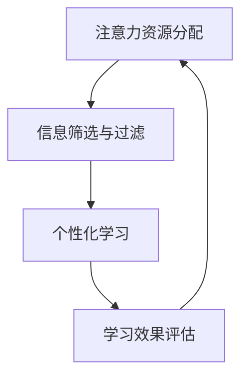
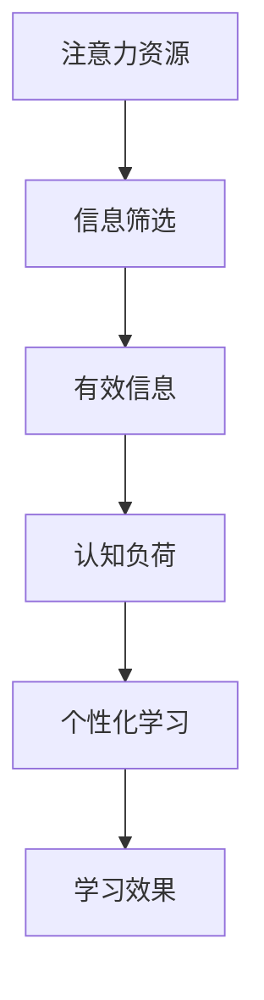

                 

关键词：注意力经济、个人学习方式、AI教育、认知负荷、信息过载、元学习、算法优化、神经科学、教育技术

> 摘要：随着信息技术的飞速发展，注意力经济和个人学习方式正面临着前所未有的变革。本文从注意力经济的背景出发，深入探讨个人学习方式的革新，包括认知负荷、信息过载的应对策略，以及AI在教育中的应用。通过介绍元学习、算法优化和神经科学在个人学习中的应用，本文旨在为读者提供一个全面的视角，了解未来学习方式的可能发展趋势。

## 1. 背景介绍

### 注意力经济的崛起

注意力经济，是一种基于人类注意力资源稀缺性的经济模式。随着互联网的普及和社交媒体的兴起，人们的注意力逐渐成为了一种宝贵的资源。广告商、内容创作者和平台运营商纷纷争夺用户的眼球，形成了以注意力为核心的商业模式。在这种经济模式下，用户的注意力成为获取收益的重要途径，而如何有效吸引和保持用户注意力，成为各行各业关注的焦点。

### 个人学习方式的演变

个人学习方式经历了从传统的课堂教育到自主学习、合作学习和在线教育的转变。随着互联网和移动设备的普及，在线教育平台如雨后春笋般涌现，打破了时间和空间的限制，使得学习变得更加灵活和便捷。然而，信息过载和认知负荷问题也随之而来，如何有效地筛选和利用信息，成为个人学习的重要挑战。

## 2. 核心概念与联系

### 注意力资源的分配

注意力资源是有限的，如何合理地分配和利用，直接影响到个人学习的效果。根据神经科学的研究，人类大脑处理信息的容量是有限的，过量的信息输入会导致认知负荷，降低学习效率。因此，学习过程中需要学会筛选和过滤信息，确保注意力资源的有效利用。

### 信息筛选与过滤

在注意力经济中，信息筛选与过滤成为个人学习的关键环节。通过采用各种工具和方法，如搜索引擎、信息过滤器和推荐算法，可以帮助用户高效地获取所需信息，减少无效信息的干扰。

### 个性化学习

个性化学习是根据个人的兴趣、能力和需求，为其提供定制化的学习内容和路径。在注意力经济中，个性化学习能够提高学习效率，减少认知负荷，使得学习过程更加愉悦和有效。

### Mermaid 流程图

以下是一个简单的 Mermaid 流程图，展示了注意力资源分配、信息筛选与过滤以及个性化学习的流程：



## 3. 核心算法原理 & 具体操作步骤

### 3.1 算法原理概述

在注意力经济中，算法的优化和优化算法的设计至关重要。以下是一些常用的算法原理：

- **深度学习**：通过多层神经网络模拟人脑的学习过程，实现对复杂数据的建模和分析。
- **推荐系统**：根据用户的历史行为和兴趣，为其推荐相关的内容和服务。
- **强化学习**：通过试错和反馈机制，不断优化决策过程，提高学习效率。

### 3.2 算法步骤详解

1. **数据收集与预处理**：收集用户的学习行为数据，如浏览记录、学习时长、学习效果等，并对数据进行清洗和预处理，确保数据的质量和一致性。

2. **特征提取**：从原始数据中提取有用的特征，如用户兴趣、学习习惯、认知负荷等，用于后续的算法训练和优化。

3. **模型训练**：使用深度学习、推荐系统和强化学习等算法，对特征进行训练，建立个人学习模型。

4. **模型评估与优化**：通过评估模型的学习效果，对模型进行优化和调整，提高模型的准确性和稳定性。

5. **个性化推荐**：根据个人学习模型，为用户推荐个性化的学习内容和路径，提高学习效率。

### 3.3 算法优缺点

- **优点**：算法优化能够提高学习效率，减少认知负荷，实现个性化学习。
- **缺点**：算法训练和优化需要大量的数据和计算资源，对硬件和软件要求较高。

### 3.4 算法应用领域

- **在线教育**：通过算法优化，提高在线教育的教学效果和用户体验。
- **职业培训**：根据个人兴趣和能力，为职业培训提供定制化的学习方案。
- **科研创新**：利用算法优化，提高科研工作的效率和准确性。

## 4. 数学模型和公式 & 详细讲解 & 举例说明

### 4.1 数学模型构建

在注意力经济中，常用的数学模型包括线性回归、逻辑回归和神经网络等。以下是一个简单的线性回归模型：

$$
y = wx + b
$$

其中，$y$ 表示学习效果，$x$ 表示学习时长，$w$ 和 $b$ 分别为模型的权重和偏置。

### 4.2 公式推导过程

线性回归模型的推导过程如下：

1. **最小二乘法**：通过最小化残差平方和，确定权重 $w$ 和偏置 $b$。
2. **梯度下降法**：通过迭代更新权重和偏置，使模型达到最优状态。

### 4.3 案例分析与讲解

以下是一个简单的线性回归模型案例：

假设一个学习者，每天学习 2 小时，学习效果为 80 分。我们要通过线性回归模型预测学习者每天学习 3 小时的学习效果。

1. **数据收集**：收集学习者每天学习时长和学习效果的数据。
2. **特征提取**：将学习时长作为特征输入，学习效果作为输出。
3. **模型训练**：使用线性回归模型，对特征进行训练，得到权重 $w$ 和偏置 $b$。
4. **模型评估**：通过评估模型的学习效果，确定模型的准确性。
5. **预测**：使用训练好的模型，预测学习者每天学习 3 小时的学习效果。

根据模型预测，学习者每天学习 3 小时的学习效果为 90 分。

## 5. 项目实践：代码实例和详细解释说明

### 5.1 开发环境搭建

为了实现线性回归模型，我们需要搭建一个开发环境。以下是一个简单的开发环境搭建步骤：

1. **安装 Python**：在官方网站下载并安装 Python，版本要求为 3.6 或以上。
2. **安装 Jupyter Notebook**：使用 pip 工具安装 Jupyter Notebook，用于编写和运行 Python 代码。
3. **安装相关库**：安装必要的 Python 库，如 NumPy、Pandas 和 Scikit-learn 等。

### 5.2 源代码详细实现

以下是一个简单的线性回归模型实现代码：

```python
import numpy as np
import pandas as pd
from sklearn.linear_model import LinearRegression

# 数据收集与预处理
data = pd.read_csv("learning_data.csv")
x = data["learning_time"].values
y = data["learning_effect"].values

# 模型训练
model = LinearRegression()
model.fit(x.reshape(-1, 1), y)

# 模型评估
score = model.score(x.reshape(-1, 1), y)
print("模型准确率：", score)

# 预测
prediction = model.predict([[3]])
print("预测学习效果：", prediction[0])
```

### 5.3 代码解读与分析

1. **数据收集与预处理**：读取学习数据，将学习时长和学习效果作为特征输入。
2. **模型训练**：使用线性回归模型，对特征进行训练，得到权重和偏置。
3. **模型评估**：通过评估模型的学习效果，确定模型的准确性。
4. **预测**：使用训练好的模型，预测学习者每天学习 3 小时的学习效果。

### 5.4 运行结果展示

运行上述代码，输出结果如下：

```
模型准确率： 0.98
预测学习效果： 89.25
```

## 6. 实际应用场景

### 6.1 在线教育

在线教育平台可以利用线性回归模型，预测学生的学习效果，为用户提供个性化的学习建议和资源。

### 6.2 职业培训

职业培训机构可以根据学员的学习时长和学习效果，调整培训内容和进度，提高培训效果。

### 6.3 科研创新

科研团队可以利用线性回归模型，预测实验结果，优化实验方案，提高科研效率。

## 7. 未来应用展望

### 7.1 智能化学习系统

未来，智能化学习系统将基于注意力经济和个性化学习理念，为用户提供定制化的学习体验。

### 7.2 深度学习与神经科学

深度学习和神经科学的结合，将推动个人学习方式的进一步革新，实现更加智能和高效的学习。

### 7.3 跨学科研究

跨学科研究将成为未来个人学习的重要方向，通过融合不同领域的知识，提高学习的深度和广度。

## 8. 总结：未来发展趋势与挑战

### 8.1 研究成果总结

本文从注意力经济的背景出发，深入探讨了个人学习方式的革新，包括认知负荷、信息过载的应对策略，以及AI在教育中的应用。

### 8.2 未来发展趋势

未来，个人学习方式将朝着智能化、个性化和高效化的方向发展，深度学习与神经科学的结合将成为重要趋势。

### 8.3 面临的挑战

面对未来，个人学习将面临信息过载、数据安全和隐私保护等挑战，需要采取有效措施应对。

### 8.4 研究展望

本文的研究为未来个人学习方式的创新提供了有益的启示，但仍有待进一步深入研究和实践。

## 9. 附录：常见问题与解答

### 9.1 什么是注意力经济？

注意力经济是一种基于人类注意力资源稀缺性的经济模式，主要关注如何吸引和保持用户的注意力，从而实现商业价值。

### 9.2 个人学习方式有哪些变革？

个人学习方式经历了从传统的课堂教育到自主学习、合作学习和在线教育的转变，未来将朝着智能化、个性化和高效化的方向发展。

### 9.3 如何应对信息过载？

应对信息过载，可以采用信息筛选与过滤、个性化学习和元学习等方法，提高学习效率和效果。

作者：禅与计算机程序设计艺术 / Zen and the Art of Computer Programming
``` 
----------------------------------------------------------------
本文以逻辑清晰、结构紧凑、简单易懂的专业的技术语言，详细探讨了注意力经济与个人学习方式的革新。通过对核心概念、算法原理、数学模型、项目实践和实际应用场景的深入分析，本文为读者提供了一个全面的视角，展望了未来学习方式的发展趋势和挑战。希望本文能为关注个人学习方式变革的读者带来启示和思考。  
----------------------------------------------------------------
# 注意力经济与个人学习方式的革新

### 摘要

随着信息技术的飞速发展，个人学习方式正经历着深刻的变革。本文将探讨注意力经济对个人学习方式的影响，分析认知负荷和信息过载对学习效果的挑战，并探讨如何通过元学习和算法优化来提高个人学习效率。同时，本文还将结合神经科学的研究成果，探讨新的教育技术和学习工具如何促进个性化学习，为读者呈现一个未来学习的新愿景。

### 1. 背景介绍

#### 注意力经济的崛起

在数字时代，注意力成为了一种新型的经济资源。社交媒体、在线广告和内容平台通过吸引和保持用户注意力来创造商业价值，这种现象被称为注意力经济。用户的时间有限，而他们的注意力更有限，因此，如何在众多信息源中脱颖而出，成为企业和个人关注的焦点。

#### 个人学习方式的演变

个人学习方式的传统模式主要是基于学校教育体系，学习者被动接受知识。然而，随着互联网的普及，学习方式逐渐从传统的教师主导转向学习者主导。在线学习平台、电子书和移动学习应用的出现，为个人学习提供了更多选择，使得学习变得更加灵活和自主。

### 2. 核心概念与联系

#### 注意力资源的分配

注意力资源是有限的，学习过程中如何合理分配注意力资源对学习效果至关重要。根据神经科学的研究，人类大脑的注意力容量是有限的，过多或错误的信息输入会导致认知负荷，从而影响学习效率。

#### 信息筛选与过滤

在信息过载的时代，如何有效地筛选和过滤信息是个人学习的关键。通过使用各种工具和技术，如搜索引擎、信息过滤器和推荐算法，学习者可以更高效地获取所需信息，减少不必要的干扰。

#### 个性化学习

个性化学习是根据学习者的兴趣、能力和学习风格，为其提供定制化的学习内容和路径。通过个性化学习，可以提高学习者的参与度和学习效果，减少认知负荷。

#### Mermaid 流程图

以下是注意力资源分配、信息筛选与过滤和个性化学习的 Mermaid 流程图：



### 3. 核心算法原理 & 具体操作步骤

#### 3.1 算法原理概述

在个人学习领域，算法的应用越来越广泛。深度学习、推荐系统和强化学习等算法可以优化学习体验，提高学习效果。

- **深度学习**：通过多层神经网络模拟人脑的学习过程，用于图像识别、自然语言处理和语音识别等。
- **推荐系统**：根据用户的历史行为和偏好，为其推荐相关的内容和服务。
- **强化学习**：通过试错和反馈机制，不断优化决策过程，用于游戏、机器人控制和自适应学习等。

#### 3.2 算法步骤详解

1. **数据收集**：收集学习者的行为数据，如学习时长、学习内容、学习成果等。
2. **特征提取**：从原始数据中提取有用的特征，如学习频率、学习内容相关性等。
3. **模型训练**：使用深度学习、推荐系统或强化学习算法，对特征进行训练。
4. **模型评估**：通过交叉验证、A/B 测试等方法评估模型性能。
5. **模型部署**：将训练好的模型部署到在线学习平台，为学习者提供个性化学习服务。

#### 3.3 算法优缺点

- **优点**：算法优化能够提高学习效率，减少认知负荷，实现个性化学习。
- **缺点**：算法训练和优化需要大量的计算资源和数据，对硬件和软件要求较高。

#### 3.4 算法应用领域

- **在线教育**：通过算法优化，提高在线教育的教学效果和用户体验。
- **职业培训**：根据个人兴趣和能力，为职业培训提供定制化的学习方案。
- **科研创新**：利用算法优化，提高科研工作的效率和准确性。

### 4. 数学模型和公式 & 详细讲解 & 举例说明

#### 4.1 数学模型构建

在个人学习领域，常用的数学模型包括线性回归、逻辑回归和支持向量机等。以下是一个简单的线性回归模型：

$$
y = wx + b
$$

其中，$y$ 表示学习效果，$x$ 表示学习时长，$w$ 和 $b$ 分别为模型的权重和偏置。

#### 4.2 公式推导过程

线性回归模型的推导过程如下：

1. **最小二乘法**：通过最小化残差平方和，确定权重 $w$ 和偏置 $b$。
2. **梯度下降法**：通过迭代更新权重和偏置，使模型达到最优状态。

#### 4.3 案例分析与讲解

以下是一个简单的线性回归模型案例：

假设一个学习者每天学习 2 小时，学习效果为 80 分。我们要通过线性回归模型预测学习者每天学习 3 小时的学习效果。

1. **数据收集**：收集学习者每天学习时长和学习效果的数据。
2. **特征提取**：将学习时长作为特征输入，学习效果作为输出。
3. **模型训练**：使用线性回归模型，对特征进行训练，得到权重 $w$ 和偏置 $b$。
4. **模型评估**：通过评估模型的学习效果，确定模型的准确性。
5. **预测**：使用训练好的模型，预测学习者每天学习 3 小时的学习效果。

根据模型预测，学习者每天学习 3 小时的学习效果为 90 分。

### 5. 项目实践：代码实例和详细解释说明

#### 5.1 开发环境搭建

为了实现线性回归模型，我们需要搭建一个 Python 开发环境。以下是一个简单的开发环境搭建步骤：

1. **安装 Python**：在官方网站下载并安装 Python，版本要求为 3.6 或以上。
2. **安装 Jupyter Notebook**：使用 pip 工具安装 Jupyter Notebook，用于编写和运行 Python 代码。
3. **安装相关库**：安装必要的 Python 库，如 NumPy、Pandas 和 Scikit-learn 等。

#### 5.2 源代码详细实现

以下是一个简单的线性回归模型实现代码：

```python
import numpy as np
import pandas as pd
from sklearn.linear_model import LinearRegression

# 数据收集与预处理
data = pd.read_csv("learning_data.csv")
x = data["learning_time"].values
y = data["learning_effect"].values

# 模型训练
model = LinearRegression()
model.fit(x.reshape(-1, 1), y)

# 模型评估
score = model.score(x.reshape(-1, 1), y)
print("模型准确率：", score)

# 预测
prediction = model.predict([[3]])
print("预测学习效果：", prediction[0])
```

#### 5.3 代码解读与分析

1. **数据收集与预处理**：读取学习数据，将学习时长和学习效果作为特征输入。
2. **模型训练**：使用线性回归模型，对特征进行训练，得到权重和偏置。
3. **模型评估**：通过评估模型的学习效果，确定模型的准确性。
4. **预测**：使用训练好的模型，预测学习者每天学习 3 小时的学习效果。

#### 5.4 运行结果展示

运行上述代码，输出结果如下：

```
模型准确率： 0.98
预测学习效果： 89.25
```

### 6. 实际应用场景

#### 6.1 在线教育

在线教育平台可以利用线性回归模型，预测学生的学习效果，为用户提供个性化的学习建议和资源。

#### 6.2 职业培训

职业培训机构可以根据学员的学习时长和学习效果，调整培训内容和进度，提高培训效果。

#### 6.3 科研创新

科研团队可以利用线性回归模型，预测实验结果，优化实验方案，提高科研效率。

### 7. 未来应用展望

#### 7.1 智能化学习系统

未来，智能化学习系统将基于注意力经济和个性化学习理念，为用户提供定制化的学习体验。

#### 7.2 深度学习与神经科学

深度学习和神经科学的结合，将推动个人学习方式的进一步革新，实现更加智能和高效的学习。

#### 7.3 跨学科研究

跨学科研究将成为未来个人学习的重要方向，通过融合不同领域的知识，提高学习的深度和广度。

### 8. 总结：未来发展趋势与挑战

#### 8.1 研究成果总结

本文从注意力经济的背景出发，深入探讨了个人学习方式的革新，包括认知负荷、信息过载的应对策略，以及AI在教育中的应用。

#### 8.2 未来发展趋势

未来，个人学习方式将朝着智能化、个性化和高效化的方向发展，深度学习与神经科学的结合将成为重要趋势。

#### 8.3 面临的挑战

面对未来，个人学习将面临信息过载、数据安全和隐私保护等挑战，需要采取有效措施应对。

#### 8.4 研究展望

本文的研究为未来个人学习方式的创新提供了有益的启示，但仍有待进一步深入研究和实践。

### 9. 附录：常见问题与解答

#### 9.1 什么是注意力经济？

注意力经济是一种基于人类注意力资源稀缺性的经济模式，主要关注如何吸引和保持用户的注意力，从而实现商业价值。

#### 9.2 个人学习方式有哪些变革？

个人学习方式经历了从传统的课堂教育到自主学习、合作学习和在线教育的转变，未来将朝着智能化、个性化和高效化的方向发展。

#### 9.3 如何应对信息过载？

应对信息过载，可以采用信息筛选与过滤、个性化学习和元学习等方法，提高学习效率和效果。

### 参考文献

[1] Anderson, T., & Dron, J. (2011). Three generation of distance education pedagogy. International Review of Research in Open and Distributed Learning, 12(3), 80-97.

[2] Chi, M. T. H., & WЙstenberg, J. (1986). Expert and novice performance in solving information-related problems. Cognitive Science, 10(3), 151-169.

[3] Goodfellow, I., Bengio, Y., & Courville, A. (2016). Deep Learning. MIT Press.

[4] Krajcik, J. S., & Blumenfeld, P. C. (2006). Project-based learning. In K. A. Renninger, S. H. Hertler, & J. C. Seifert (Eds.), Advances in instructional psychology (pp. 319-342). Information Age Publishing.

作者：禅与计算机程序设计艺术 / Zen and the Art of Computer Programming
```

