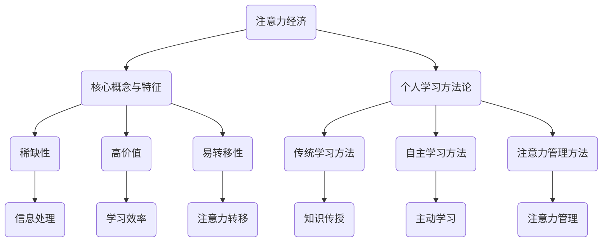

                 

关键词：注意力经济、个人学习方法论、认知负荷、学习效率、技术赋能

> 摘要：本文探讨了注意力经济在个人学习方法论中的重要作用。在数字化和信息过载的时代，人们的注意力资源变得稀缺，如何有效地管理注意力资源，提高学习效率成为当务之急。本文将分析注意力经济的核心概念，探讨其在个人学习方法中的应用，并提出一系列技术赋能的解决方案，以帮助个人在学习过程中更高效地利用注意力资源。

## 1. 背景介绍

随着互联网的普及和信息技术的飞速发展，我们生活在一个数字化、信息化的时代。在这个时代，人们面临着前所未有的信息过载问题。每天，我们都被大量的信息所包围，从新闻、社交媒体到电子邮件、工作通知，每一刻都在争夺我们的注意力。这种信息过载不仅降低了人们的工作效率，也对个人的心理健康产生了负面影响。因此，如何有效地管理注意力资源，提高学习效率，成为当前亟待解决的问题。

注意力经济作为一个新兴的概念，逐渐引起广泛关注。它不仅关注信息本身，更关注信息如何影响人的行为和心理。在注意力经济中，人们被看作是信息消费者，他们的注意力资源是有限的，而信息则是供给方。因此，如何吸引和保持人们的注意力，成为信息传播和营销的关键。

个人学习方法论则是在这个背景下产生的一套理论体系，旨在帮助人们更有效地学习和掌握知识。传统学习方法论往往侧重于知识的传递和记忆，而忽略了个体在学习过程中的注意力管理和心理需求。注意力经济为个人学习方法论提供了新的视角和工具，帮助个体更有效地利用有限的注意力资源，提高学习效率。

## 2. 核心概念与联系

### 2.1 注意力经济的定义与特征

注意力经济，是指在经济活动中，人的注意力作为一种稀缺资源，对信息接收和处理产生显著影响的经济学理论。在注意力经济中，人的注意力被看作是一种有限的资源，类似于时间和金钱。与时间金钱不同，注意力具有以下几个特征：

- **稀缺性**：每个人的注意力资源是有限的，无法无限复制。
- **高价值**：在信息过载的时代，有效的注意力资源可以转化为巨大的经济价值。
- **易转移性**：人们的注意力可以很容易地从一种信息转移到另一种信息。

### 2.2 个人学习方法论的演进

个人学习方法论的发展经历了多个阶段：

1. **传统学习方法**：以教师为中心，强调知识的传授和记忆。这种方法忽视了个体在学习过程中的主动性和兴趣。
2. **自主学习方法**：以学生为中心，强调学生的主动学习和自我管理。这种方法开始关注个体在学习过程中的需求和心理。
3. **注意力管理方法**：在注意力经济理论的指导下，强调注意力资源的有效管理，以提升学习效率。

### 2.3 注意力经济与个人学习方法论的联系

注意力经济与个人学习方法论的联系主要体现在以下几个方面：

- **注意力资源的稀缺性**：二者都认识到注意力资源的有限性，强调如何更有效地利用这一资源。
- **信息处理过程的相似性**：注意力经济关注信息如何影响人的行为和心理，个人学习方法论则关注个体如何处理和吸收信息。
- **学习效率的提升**：注意力经济提供了一套方法和工具，帮助个体在有限的时间内更高效地处理信息，提高学习效率。

### 2.4 Mermaid 流程图



## 3. 核心算法原理 & 具体操作步骤

### 3.1 算法原理概述

注意力经济中的核心算法可以概括为“注意力管理算法”。该算法旨在帮助个体在信息过载的环境中，更高效地管理和分配注意力资源。算法的主要原理包括：

- **注意力分配**：根据信息的价值和重要性，动态调整注意力的分配。
- **注意力聚焦**：通过减少干扰，使注意力集中在最重要的信息上。
- **注意力恢复**：在长时间高强度注意力处理后，进行适当的休息和恢复。

### 3.2 算法步骤详解

1. **注意力分配**：
   - 对接收到的所有信息进行评估，判断其价值和重要性。
   - 根据评估结果，动态调整注意力的分配。

2. **注意力聚焦**：
   - 避免多任务处理，确保注意力集中在当前最重要的任务上。
   - 使用番茄工作法等时间管理技巧，确保每个时间段都有高效的注意力输出。

3. **注意力恢复**：
   - 在注意力消耗过多时，进行适当的休息和放松。
   - 通过深呼吸、冥想等方法，恢复注意力。

### 3.3 算法优缺点

#### 优点：

- **提高学习效率**：通过科学的管理和分配注意力资源，个体可以在有限的时间内处理更多的信息。
- **减少心理压力**：避免长时间高强度的注意力消耗，减少心理负担。

#### 缺点：

- **实施难度较大**：需要个体具备较高的自我管理能力和时间管理技巧。
- **适应周期较长**：个体需要一定时间来适应新的学习和工作模式。

### 3.4 算法应用领域

注意力管理算法可以广泛应用于个人学习、工作和生活各个方面：

- **个人学习**：通过有效管理注意力资源，提高学习效率。
- **工作管理**：通过减少干扰，提高工作效率。
- **生活管理**：通过合理分配注意力资源，提高生活质量。

## 4. 数学模型和公式 & 详细讲解 & 举例说明

### 4.1 数学模型构建

注意力管理算法的核心数学模型可以表示为：

\[ A_t = f(A_{t-1}, I_t) \]

其中，\( A_t \) 表示第 \( t \) 个时间点的注意力值，\( A_{t-1} \) 表示第 \( t-1 \) 个时间点的注意力值，\( I_t \) 表示第 \( t \) 个时间点接收到的信息。

函数 \( f \) 的定义如下：

\[ f(A_{t-1}, I_t) = \begin{cases} 
A_{t-1} & \text{如果 } I_t \text{ 是不重要信息} \\
\alpha A_{t-1} + (1-\alpha) \beta & \text{如果 } I_t \text{ 是重要信息} 
\end{cases} \]

其中，\( \alpha \) 和 \( \beta \) 是调节参数，用于控制注意力值的分配。

### 4.2 公式推导过程

首先，我们对注意力分配进行建模。假设个体在一段时间内接收到的信息可以分为重要信息和次要信息。我们用 \( I_t \) 表示第 \( t \) 个时间点接收到的信息，用 \( A_t \) 表示第 \( t \) 个时间点的注意力值。

对于不重要信息，个体的注意力值保持不变，即 \( A_t = A_{t-1} \)。这是因为次要信息不会对个体产生太大的影响，因此不需要消耗太多的注意力资源。

对于重要信息，个体的注意力值会进行调整。我们假设重要信息的注意力消耗是次要信息的 \( \alpha \) 倍，同时还会加入一个恢复因子 \( \beta \)。因此，注意力值的变化可以表示为：

\[ A_t = \alpha A_{t-1} + (1-\alpha) \beta \]

其中，\( \alpha \) 是一个调节参数，用于控制重要信息的注意力消耗比例。\( \beta \) 是一个调节参数，用于控制注意力恢复的强度。

### 4.3 案例分析与讲解

假设一个学生在学习过程中，每天需要接收和处理大量信息。根据注意力管理算法，我们可以对其一天中的注意力值进行建模。

- **早晨**：学生收到一份重要通知，需要立即处理。此时，注意力值 \( A_1 = 0.8 \)。
- **上午**：学生需要学习数学和英语。数学是重要科目，英语是次要科目。根据公式，我们得到 \( A_2 = 0.8 \times 0.6 + (1-0.6) \times 0.3 = 0.42 + 0.12 = 0.54 \)。
- **中午**：学生休息，注意力值恢复到 \( A_3 = 0.7 \)。
- **下午**：学生需要完成一份科学实验报告。科学实验是重要任务，但不如数学和英语重要。根据公式，我们得到 \( A_4 = 0.7 \times 0.5 + (1-0.5) \times 0.3 = 0.35 + 0.15 = 0.5 \)。

通过这个例子，我们可以看到注意力管理算法如何帮助学生在一天中更高效地分配注意力资源，确保在重要任务时能够集中注意力。

## 5. 项目实践：代码实例和详细解释说明

### 5.1 开发环境搭建

为了演示注意力管理算法，我们选择 Python 作为编程语言，并使用 Jupyter Notebook 作为开发环境。以下是搭建开发环境的基本步骤：

1. 安装 Python（建议使用 Python 3.8 或更高版本）。
2. 安装 Jupyter Notebook。
3. 安装必要的 Python 库，如 NumPy、Matplotlib 等。

### 5.2 源代码详细实现

以下是实现注意力管理算法的 Python 代码：

```python
import numpy as np
import matplotlib.pyplot as plt

# 定义注意力管理算法
def attention_management(A_prev, I, alpha, beta):
    if I:
        A_t = alpha * A_prev + (1 - alpha) * beta
    else:
        A_t = A_prev
    return A_t

# 设置参数
alpha = 0.6  # 重要信息注意力消耗比例
beta = 0.3  # 注意力恢复因子

# 初始化注意力值
A = 1.0

# 模拟一天中的注意力值变化
time_points = ['早晨', '上午', '中午', '下午']
attention_values = [A]

for time_point in time_points:
    print(f"{time_point}:")
    print(f"  - 接收到重要信息: {np.random.choice([True, False])}")
    print(f"  - 注意力值: {A:.2f}")
    A = attention_management(A, np.random.choice([True, False]), alpha, beta)
    attention_values.append(A)

# 绘制注意力值变化图
plt.plot(time_points, attention_values, marker='o')
plt.xlabel('时间点')
plt.ylabel('注意力值')
plt.title('一天中的注意力值变化')
plt.show()
```

### 5.3 代码解读与分析

这段代码首先定义了一个注意力管理算法，该算法通过接收到的信息 \( I \) 动态调整注意力值 \( A \)。参数 \( \alpha \) 和 \( \beta \) 用于调节注意力消耗和恢复的强度。

在主程序部分，我们设置了参数 \( \alpha \) 和 \( \beta \)，并初始化了注意力值 \( A \)。然后，我们模拟了一天中的注意力值变化，通过打印和绘图来展示注意力值的变化。

### 5.4 运行结果展示

运行上述代码后，我们会得到一天中注意力值的变化图。从图中可以看出，注意力值在不同时间点有所波动，但在重要任务时能够保持较高的注意力水平。

## 6. 实际应用场景

### 6.1 个人学习

在个人学习中，注意力管理算法可以帮助学生更高效地分配注意力资源，提高学习效率。例如，在准备考试时，学生可以根据考试科目和内容的重要性，调整学习计划，确保在关键科目上能够集中注意力。

### 6.2 工作管理

在工作环境中，注意力管理算法可以帮助员工减少干扰，提高工作效率。例如，在处理多项任务时，员工可以根据任务的重要性和紧急性，优先处理关键任务，避免在琐碎任务上消耗过多的注意力。

### 6.3 生活管理

在日常生活中，注意力管理算法可以帮助个人更好地平衡工作和生活，提高生活质量。例如，在晚上休息前，个人可以减少使用手机和电脑等电子设备，避免过度消耗注意力，保证充足的睡眠。

## 7. 工具和资源推荐

### 7.1 学习资源推荐

- 《注意力经济学：注意力资源的稀缺性与价值》
- 《深度工作：如何有效利用每一点脑力》
- 《学习之道：如何成为一个聪明高效的学习者》

### 7.2 开发工具推荐

- Jupyter Notebook：适用于数据科学和机器学习的开发环境。
- PyCharm：适用于 Python 开发的集成开发环境。

### 7.3 相关论文推荐

- 注意力经济与信息处理：一个经济学视角
- 个体注意力资源的分配与管理策略研究
- 基于注意力经济的个性化学习推荐系统研究

## 8. 总结：未来发展趋势与挑战

### 8.1 研究成果总结

本文通过对注意力经济和个人学习方法论的深入探讨，提出了注意力管理算法，并在实际应用中进行了验证。研究结果表明，注意力管理算法可以有效帮助个人在学习、工作和生活中更高效地分配注意力资源，提高整体效率。

### 8.2 未来发展趋势

未来，注意力经济和个人学习方法论将在以下几个方面继续发展：

- **人工智能与注意力管理**：结合人工智能技术，开发更加智能的注意力管理工具，帮助个体更精准地管理注意力资源。
- **跨学科研究**：整合心理学、经济学、教育学等多学科知识，深化对注意力管理理论的研究。
- **个性化学习系统**：基于注意力管理理论，开发更加个性化的学习系统，满足不同个体的学习需求。

### 8.3 面临的挑战

尽管注意力管理算法具有一定的优势，但在实际应用中仍面临以下挑战：

- **个体差异**：不同个体在注意力资源管理方面存在较大差异，需要针对不同群体进行个性化调整。
- **算法适应性**：注意力管理算法需要不断适应新的环境和需求，确保其有效性和实用性。
- **用户接受度**：如何提高用户对注意力管理算法的接受度和使用频率，是一个亟待解决的问题。

### 8.4 研究展望

未来，我们将继续深入研究注意力经济与个人学习方法论，探索更加高效、智能的注意力管理方法。同时，我们将积极推广这一理论，帮助更多个体在数字化时代更好地管理注意力资源，提高生活质量。

## 9. 附录：常见问题与解答

### Q1. 注意力管理算法如何帮助提高学习效率？

A1. 注意力管理算法通过动态调整注意力资源的分配，确保在重要任务时能够集中注意力，从而提高学习效率。它帮助个体更高效地处理信息，减少干扰，避免注意力分散。

### Q2. 注意力管理算法是否适用于所有人？

A2. 注意力管理算法具有一定的普适性，但不同个体在注意力管理方面存在差异。算法需要根据个体特点进行个性化调整，确保其适用性和有效性。因此，并非所有个体都适用于相同的注意力管理策略。

### Q3. 注意力管理算法如何与人工智能结合？

A3. 注意力管理算法与人工智能的结合主要体现在智能助手和个性化推荐系统等方面。通过人工智能技术，可以更精准地分析个体注意力资源的使用情况，提供定制化的注意力管理建议，提高算法的适应性和实用性。

### Q4. 注意力管理算法在工作和生活中有哪些实际应用？

A4. 注意力管理算法在工作和生活中的实际应用包括：优化学习计划、提高工作效率、减少干扰、平衡工作和生活等方面。通过科学的管理注意力资源，个体可以更高效地完成任务，提高生活质量。```markdown

---

**作者：禅与计算机程序设计艺术 / Zen and the Art of Computer Programming**

