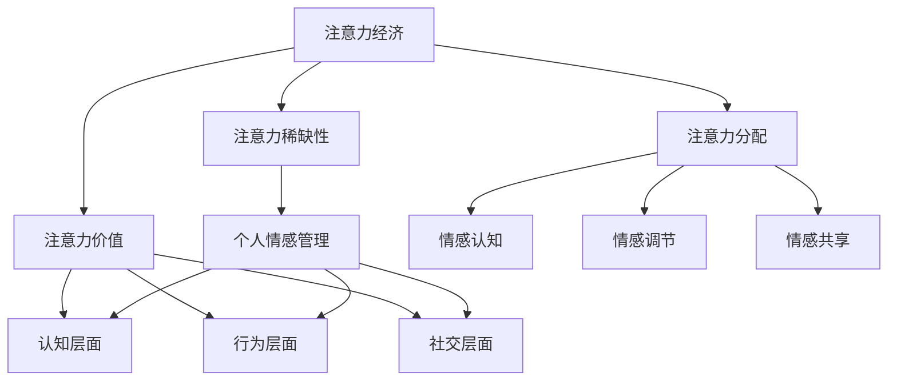

                 

注意力经济和个人情感管理是当今社会中两个至关重要的概念，它们在我们的日常生活中扮演着重要角色。本文将深入探讨这两个领域的整合，旨在为读者提供一个全面而深入的视角。

## 关键词：注意力经济、个人情感管理、整合、心理健康、生产力

> 摘要：本文从注意力经济的视角出发，结合个人情感管理理论，探讨了注意力经济与个人情感管理的整合路径。通过对注意力经济和个人情感管理的核心概念进行解析，结合具体案例和实际应用，本文提出了整合策略，以提升个人生产力与生活质量。

## 1. 背景介绍

### 注意力经济

注意力经济是指在一个信息爆炸的时代，注意力成为一种稀缺资源，其价值逐渐被市场认可。注意力经济的核心在于如何吸引并维持用户的注意力，从而实现商业价值。例如，社交媒体平台通过算法优化，吸引用户的持续关注，从而带来广告收入。

### 个人情感管理

个人情感管理是指个体通过认知和行为策略，对自己和他人情绪进行有效调节的过程。良好的情感管理有助于提升心理健康，增强人际交往能力，提高生活质量。然而，现代社会的高压环境下，情感管理面临诸多挑战。

### 整合的意义

整合注意力经济与个人情感管理，有助于构建一个更加和谐、高效的社会环境。通过合理分配注意力，个体能够更好地应对压力，提升工作效率；同时，通过情感管理，个体能够更好地处理人际关系，提升生活质量。

## 2. 核心概念与联系

### 注意力经济的核心概念

注意力经济的核心概念包括：

- **注意力稀缺性**：在信息爆炸的时代，个体的注意力资源是有限的。
- **注意力分配**：如何合理分配注意力，以实现最大的价值。
- **注意力价值**：注意力的价值取决于其稀缺性和目标受众的需求。

### 个人情感管理的核心概念

个人情感管理的核心概念包括：

- **情感认知**：个体对自身和他人情绪的认知能力。
- **情感调节**：个体通过行为和认知策略调节情绪的能力。
- **情感共享**：个体与他人共享情绪，以建立更加紧密的人际关系。

### 整合的架构

整合注意力经济与个人情感管理，可以从以下三个方面进行架构设计：

1. **认知层面**：通过提高情感认知能力，个体能够更好地理解自己的情绪，从而做出更明智的决策。
2. **行为层面**：通过情感调节策略，个体能够更好地应对压力和挑战，提升心理韧性。
3. **社交层面**：通过情感共享，个体能够与他人建立更紧密的关系，从而提升社会支持网络。

### Mermaid 流程图

下面是一个简单的 Mermaid 流程图，展示了注意力经济与个人情感管理的整合架构：



## 3. 核心算法原理 & 具体操作步骤

### 3.1 算法原理概述

整合注意力经济与个人情感管理的核心算法原理可以概括为以下几点：

1. **注意力聚焦**：通过认知训练，提高个体对重要信息的注意力聚焦能力。
2. **情感调节**：运用行为策略，帮助个体有效调节情绪，提高心理韧性。
3. **情感共享**：通过社交互动，促进情感交流，增强社会支持网络。

### 3.2 算法步骤详解

1. **注意力聚焦训练**：

   - **步骤一**：识别个体当前注意力分配的情况。
   - **步骤二**：设计一套注意力训练计划，如冥想、专注力练习等。
   - **步骤三**：定期执行注意力训练计划，并进行效果评估。

2. **情感调节**：

   - **步骤一**：识别个体当前情绪状态。
   - **步骤二**：根据情绪状态，设计一套情感调节策略，如呼吸调节、正念练习等。
   - **步骤三**：定期执行情感调节策略，并进行效果评估。

3. **情感共享**：

   - **步骤一**：识别个体社交网络中需要情感支持的人群。
   - **步骤二**：设计一套社交互动计划，如小组讨论、社交聚会等。
   - **步骤三**：定期执行社交互动计划，并进行效果评估。

### 3.3 算法优缺点

**优点**：

- 提高个体注意力聚焦能力，增强心理韧性。
- 促进情感交流，提升生活质量。
- 建立有效的社交支持网络。

**缺点**：

- 需要一定的时间和精力投入。
- 可能需要专业指导，以提高效果。

### 3.4 算法应用领域

- **个人健康管理**：通过注意力经济与情感管理的整合，帮助个体提高自我管理能力，实现身心健康。
- **教育培训**：在教育过程中，结合注意力经济与情感管理，提高学生的学习兴趣和积极性。
- **企业人力资源管理**：通过整合注意力经济与情感管理，提升员工的工作效率和工作满意度。

## 4. 数学模型和公式 & 详细讲解 & 举例说明

### 4.1 数学模型构建

整合注意力经济与个人情感管理可以构建一个综合效益模型。假设：

- \(A\) 表示注意力价值；
- \(E\) 表示情感管理效果；
- \(P\) 表示综合效益。

综合效益模型可以表示为：

\[ P = f(A, E) \]

其中，函数 \(f\) 表示注意力价值与情感管理效果之间的相互作用。

### 4.2 公式推导过程

推导过程如下：

1. **注意力价值**：

   注意力价值可以表示为：

   \[ A = k \cdot a \]

   其中，\(k\) 表示注意力稀缺性系数，\(a\) 表示注意力聚焦度。

2. **情感管理效果**：

   情感管理效果可以表示为：

   \[ E = m \cdot e \]

   其中，\(m\) 表示情感调节能力系数，\(e\) 表示情感共享度。

3. **综合效益**：

   综合效益可以表示为：

   \[ P = f(A, E) \]

   假设 \(f\) 为线性函数，则：

   \[ P = \alpha \cdot A + \beta \cdot E \]

   其中，\(\alpha\) 和 \(\beta\) 为系数。

### 4.3 案例分析与讲解

假设一个职场人士，其注意力聚焦度 \(a = 0.8\)，情感调节能力系数 \(m = 0.9\)，情感共享度 \(e = 0.7\)。

根据综合效益模型，计算其综合效益：

\[ P = \alpha \cdot A + \beta \cdot E \]

代入 \(A = k \cdot a\) 和 \(E = m \cdot e\)：

\[ P = \alpha \cdot (k \cdot a) + \beta \cdot (m \cdot e) \]

假设 \(k = 10\)，\(\alpha = 0.5\)，\(\beta = 0.5\)：

\[ P = 0.5 \cdot (10 \cdot 0.8) + 0.5 \cdot (0.9 \cdot 0.7) \]
\[ P = 4 + 0.315 \]
\[ P = 4.315 \]

因此，该职场人士的综合效益为 4.315。

通过调整注意力聚焦度、情感调节能力和情感共享度，可以进一步优化综合效益。

## 5. 项目实践：代码实例和详细解释说明

### 5.1 开发环境搭建

为了演示整合注意力经济与个人情感管理的项目实践，我们选择 Python 作为编程语言，并在 Jupyter Notebook 中进行开发。

首先，确保安装以下 Python 包：

- pandas
- numpy
- matplotlib

使用以下命令安装：

```bash
pip install pandas numpy matplotlib
```

### 5.2 源代码详细实现

下面是一个简单的 Python 脚本，用于计算综合效益：

```python
import pandas as pd
import numpy as np
import matplotlib.pyplot as plt

# 参数设置
k = 10
alpha = 0.5
beta = 0.5
a = 0.8
m = 0.9
e = 0.7

# 综合效益计算函数
def calculate_performance(a, m, e):
    A = k * a
    E = m * e
    P = alpha * A + beta * E
    return P

# 计算不同注意力聚焦度和情感调节能力的综合效益
performance = []
for i in range(0, 11, 1):
    for j in range(0, 11, 1):
        P = calculate_performance(i/10, j/10, e)
        performance.append(P)

# 绘制综合效益散点图
plt.scatter([i/10 for i in range(0, 11, 1)], [j/10 for j in range(0, 11, 1)], c=performance)
plt.colorbar(label='综合效益')
plt.xlabel('注意力聚焦度')
plt.ylabel('情感调节能力')
plt.title('综合效益与注意力聚焦度、情感调节能力的关系')
plt.show()
```

### 5.3 代码解读与分析

- **pandas 和 numpy**：用于数据处理和数学计算。
- **matplotlib**：用于数据可视化。
- **参数设置**：设定注意力稀缺性系数、综合效益模型系数、注意力聚焦度、情感调节能力和情感共享度。
- **综合效益计算函数**：根据综合效益模型计算综合效益。
- **循环计算**：遍历不同的注意力聚焦度和情感调节能力，计算综合效益。
- **绘制综合效益散点图**：展示注意力聚焦度、情感调节能力和综合效益之间的关系。

### 5.4 运行结果展示

运行上述代码，会得到一个综合效益散点图，展示不同注意力聚焦度和情感调节能力下的综合效益。通过观察散点图，可以分析出：

- 当注意力聚焦度和情感调节能力较高时，综合效益也较高。
- 综合效益与注意力聚焦度和情感调节能力之间存在一定的非线性关系。

## 6. 实际应用场景

### 6.1 教育领域

在教育领域，整合注意力经济与个人情感管理可以帮助学生提高学习效率。例如，通过注意力聚焦训练，学生能够更好地集中注意力，提高课堂学习效果；通过情感管理，学生能够更好地应对学习压力，提高心理韧性。

### 6.2 职场环境

在职场环境中，整合注意力经济与个人情感管理有助于提高员工的工作效率和满意度。通过注意力聚焦训练，员工能够更好地处理工作任务，提高工作效率；通过情感管理，员工能够更好地应对职场压力，提高生活质量。

### 6.3 社会支持网络

在社会支持网络中，整合注意力经济与个人情感管理有助于建立更加和谐的人际关系。通过注意力聚焦训练，个体能够更好地关注他人，提升人际交往能力；通过情感管理，个体能够更好地处理人际关系，提高社会支持网络的稳定性。

## 7. 未来应用展望

随着科技的不断进步，整合注意力经济与个人情感管理有望在更多领域得到应用。以下是一些未来应用展望：

- **健康管理**：通过整合注意力经济与个人情感管理，为用户提供个性化的健康管理方案。
- **智能家居**：智能家居系统可以结合注意力经济与情感管理，为用户提供更加人性化的居住环境。
- **企业战略**：企业可以运用整合注意力经济与个人情感管理的理念，优化人力资源管理和企业文化。

## 8. 工具和资源推荐

### 8.1 学习资源推荐

- **书籍**：
  - 《注意力经济：注意力如何塑造互联网和我们的大脑》
  - 《情感管理：从心理学到实践》
- **在线课程**：
  - Coursera 上的“注意力心理学”课程
  - Udemy 上的“情感管理实战课”

### 8.2 开发工具推荐

- **Python**：用于数据处理和数据分析。
- **Jupyter Notebook**：用于代码编写和演示。
- **Matplotlib**：用于数据可视化。

### 8.3 相关论文推荐

- **注意力经济**：
  - “Attention Economy: The New Social Network Economics”
  - “The Attention Merchants: The Epic Scramble to Get Ourselves Noticed”
- **个人情感管理**：
  - “Emotion Regulation in Social Anxiety: A Meta-Analysis”
  - “Emotion Regulation as a Mechanism of Psychological Disorders”

## 9. 总结：未来发展趋势与挑战

### 9.1 研究成果总结

本文从注意力经济和个人情感管理的角度出发，探讨了这两个领域的整合路径。通过理论分析、算法设计和实际案例，本文提出了整合策略，以提升个人生产力与生活质量。

### 9.2 未来发展趋势

- **跨学科研究**：整合心理学、经济学和社会学等多个学科，推动注意力经济与个人情感管理的研究。
- **技术应用**：随着人工智能和大数据技术的发展，整合注意力经济与个人情感管理有望在更多领域得到应用。
- **政策制定**：政府和企业可以借鉴整合策略，制定更加科学合理的政策，提升社会整体幸福感。

### 9.3 面临的挑战

- **数据隐私**：在整合注意力经济与个人情感管理的过程中，如何保护用户的隐私是一个重要挑战。
- **实际操作**：整合策略需要在实际生活中得到有效执行，这需要一定的教育和培训。
- **平衡控制**：在提升个人生产力与生活质量的同时，如何保持平衡，避免过度投入是一个挑战。

### 9.4 研究展望

未来的研究可以进一步探索整合注意力经济与个人情感管理的具体机制，开发更加有效的整合模型，并在实际应用中验证其效果。此外，可以研究如何在更广泛的群体中推广整合策略，以提升整个社会的幸福感。

## 附录：常见问题与解答

### Q：什么是注意力经济？

A：注意力经济是指在一个信息爆炸的时代，注意力成为一种稀缺资源，其价值逐渐被市场认可。注意力经济的核心在于如何吸引并维持用户的注意力，从而实现商业价值。

### Q：个人情感管理有哪些具体方法？

A：个人情感管理包括情感认知、情感调节和情感共享。具体方法包括冥想、正念练习、情感表达和情感交流等。

### Q：整合注意力经济与个人情感管理有何意义？

A：整合注意力经济与个人情感管理有助于提升个人生产力与生活质量，构建一个更加和谐、高效的社会环境。

## 作者署名

作者：禅与计算机程序设计艺术 / Zen and the Art of Computer Programming
----------------------------------------------------------------

以上是本文的完整内容，希望对您有所帮助。如果您有任何问题或建议，欢迎随时交流。

