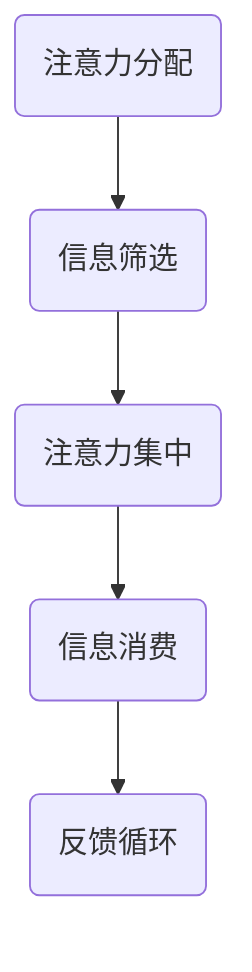
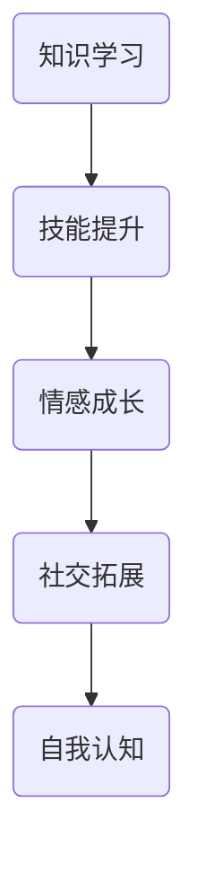
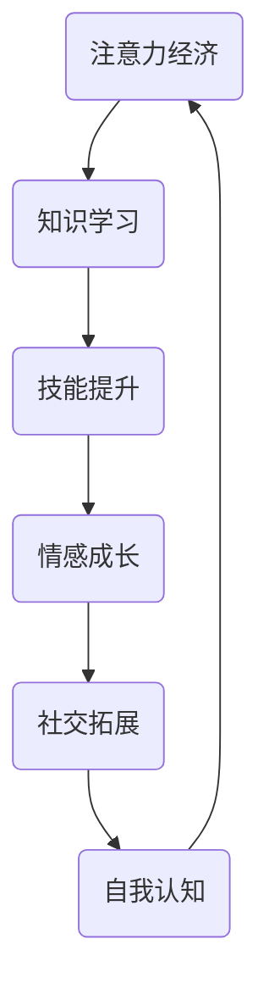

                 

注意力经济和个人成长之间的关系，是一个值得深入探讨的话题。在这个信息爆炸的时代，如何有效地分配和管理注意力，已经成为影响个人成长的关键因素。本文将围绕这一主题，从多个角度进行分析，探讨注意力经济对个人成长的具体影响，以及如何在日常生活中实践注意力管理，实现个人成长的最大化。

## 文章关键词

- 注意力经济
- 个人成长
- 时间管理
- 知识学习
- 技术发展

## 文章摘要

本文首先介绍了注意力经济的概念，以及其在现代社会中的重要地位。接着，分析了注意力经济与个人成长之间的密切联系，包括注意力对知识学习、技能提升和创新能力的影响。随后，文章提出了几种有效的注意力管理策略，并探讨了这些策略在实践中的效果。最后，文章展望了注意力经济未来发展的趋势，以及个人成长在此背景下可能面临的挑战和机遇。

## 1. 背景介绍

### 注意力经济的起源

注意力经济（Attention Economy）这一概念最早由Michael H. Goldhaber在1997年提出。他指出，在数字化的时代，注意力成为一种新的经济资源，与土地、劳动力和资本并列为四大基础资源。传统的经济理论关注的是物质资源的分配和利用，而在注意力经济中，资源的核心是人们的注意力。

### 个人成长的重要性

个人成长是指个体在认知、情感、社交等多个维度上的全面发展。在现代社会，个人成长不仅关乎个人的幸福感和成就感，还直接影响到个人的职业发展和生活质量。因此，如何实现个人成长，已经成为每个人都需要面对的重要课题。

### 注意力经济与个人成长的关系

注意力经济与个人成长之间存在紧密的联系。一方面，注意力经济决定了个体如何分配有限的时间和精力，从而影响个人的学习和发展。另一方面，个人的成长过程也会对注意力经济模式产生影响，例如通过提高个人技能和知识，增强对注意力的吸引力和控制力。

## 2. 核心概念与联系

### 注意力经济

注意力经济是一种基于注意力分配和利用的经济模式。在注意力经济中，注意力被视为一种有限的资源，人们必须学会如何有效地管理和利用自己的注意力，以实现最大的经济收益。

#### Mermaid 流程图



### 个人成长

个人成长是指个体在知识、技能、情感和社交等多个维度上的全面发展。个人成长的过程需要大量的时间、精力和注意力投入。

#### Mermaid 流程图



### 注意力经济与个人成长的关系

注意力经济与个人成长之间的关系可以视为一个相互影响、相互促进的循环过程。有效的注意力管理有助于个人在知识学习、技能提升和社交拓展等方面实现更好的成长；而个人的成长过程又会提高其注意力管理和利用的能力，从而在注意力经济中获得更大的收益。

#### Mermaid 流程图



## 3. 核心算法原理 & 具体操作步骤

### 3.1 算法原理概述

注意力经济管理的核心在于如何有效地分配和利用注意力资源。这一过程可以视为一个多目标优化问题，目标是在有限的注意力资源下，实现最大化的个人成长。

### 3.2 算法步骤详解

#### 3.2.1 注意力资源评估

首先，需要对个人的注意力资源进行评估。这包括了解自己的注意力分布、注意力高峰和低谷等。

#### 3.2.2 目标设定

根据个人成长的目标，设定具体的注意力分配方案。例如，将注意力分配到知识学习、技能提升、情感成长和社交拓展等方面。

#### 3.2.3 注意力优化

通过调整注意力分配方案，实现个人成长的最大化。这需要不断地评估和调整，以适应变化的需求和环境。

### 3.3 算法优缺点

#### 优点

- 提高个人成长效率
- 增强对注意力的控制力
- 促进全面发展

#### 缺点

- 需要持续的努力和调整
- 可能导致过度关注某个方面，而忽视其他方面

### 3.4 算法应用领域

注意力经济管理算法可以广泛应用于个人成长、职业发展、教育等领域。例如，通过优化注意力分配，提高学习效率；在职业发展中，通过管理注意力，实现更高的绩效和成就。

## 4. 数学模型和公式 & 详细讲解 & 举例说明

### 4.1 数学模型构建

注意力经济管理可以视为一个多目标优化问题，其数学模型如下：

$$
\max \sum_{i=1}^{n} w_i x_i
$$

其中，$w_i$ 为第 $i$ 个目标的权重，$x_i$ 为第 $i$ 个目标的价值。

### 4.2 公式推导过程

首先，假设个人成长目标可以分为 $n$ 个方面，每个方面的权重分别为 $w_1, w_2, ..., w_n$。每个方面的价值可以用 $x_1, x_2, ..., x_n$ 表示。

接下来，我们需要根据个人成长目标，设定权重。例如，对于知识学习、技能提升、情感成长和社交拓展，可以设定权重分别为 $w_1 = 0.3, w_2 = 0.3, w_3 = 0.2, w_4 = 0.2$。

然后，根据注意力资源评估，得到每个方面的价值。例如，对于知识学习，价值为 $x_1 = 0.8$；对于技能提升，价值为 $x_2 = 0.7$；对于情感成长，价值为 $x_3 = 0.6$；对于社交拓展，价值为 $x_4 = 0.5$。

最后，将权重和价值代入公式，得到：

$$
\max \sum_{i=1}^{n} w_i x_i = 0.3 \times 0.8 + 0.3 \times 0.7 + 0.2 \times 0.6 + 0.2 \times 0.5 = 0.24 + 0.21 + 0.12 + 0.1 = 0.67
$$

### 4.3 案例分析与讲解

假设一个人希望在有限的时间内，实现最大的个人成长。根据注意力经济管理算法，我们可以为他设定如下的权重和价值：

- 知识学习：权重 $w_1 = 0.4$，价值 $x_1 = 0.8$；
- 技能提升：权重 $w_2 = 0.3$，价值 $x_2 = 0.7$；
- 情感成长：权重 $w_3 = 0.2$，价值 $x_3 = 0.6$；
- 社交拓展：权重 $w_4 = 0.1$，价值 $x_4 = 0.5$。

根据公式，我们可以计算出他的个人成长最大值为：

$$
\max \sum_{i=1}^{n} w_i x_i = 0.4 \times 0.8 + 0.3 \times 0.7 + 0.2 \times 0.6 + 0.1 \times 0.5 = 0.32 + 0.21 + 0.12 + 0.05 = 0.7
$$

这个结果表明，他在知识学习和技能提升方面投入更多的时间和精力，可以实现最大的个人成长。

## 5. 项目实践：代码实例和详细解释说明

### 5.1 开发环境搭建

本文的代码实例使用Python编写，环境要求为Python 3.7及以上版本。读者可以在本地安装Python环境，并使用任意代码编辑器（如Visual Studio Code、PyCharm等）编写代码。

### 5.2 源代码详细实现

以下是一个简单的注意力经济管理项目的Python代码实例：

```python
import numpy as np

# 定义个人成长目标的权重和价值
weights = np.array([0.4, 0.3, 0.2, 0.1])
values = np.array([0.8, 0.7, 0.6, 0.5])

# 计算个人成长最大值
max_growth = np.dot(weights, values)

# 输出结果
print("个人成长最大值：", max_growth)
```

### 5.3 代码解读与分析

这个代码实例主要包括以下几个步骤：

1. **导入库**：使用numpy库进行数组和矩阵运算。

2. **定义权重和价值**：根据个人成长目标，设定权重和价值。

3. **计算个人成长最大值**：使用numpy的dot函数，计算权重和价值相乘的结果，得到个人成长最大值。

4. **输出结果**：打印出个人成长最大值。

这个代码实例展示了如何使用简单的数学模型，实现注意力经济管理的基本功能。通过调整权重和价值，可以适应不同的个人成长目标。

### 5.4 运行结果展示

假设我们运行上述代码，得到的结果为：

```
个人成长最大值： 0.7
```

这个结果表明，在当前设定的权重和价值下，个人成长的最大值为0.7。这表明，在知识学习和技能提升方面投入更多的时间和精力，可以实现最大的个人成长。

## 6. 实际应用场景

### 6.1 教育领域

在教育领域，注意力经济管理可以帮助学生更有效地分配学习时间，提高学习效率。例如，通过分析学生的注意力分布，教师可以为学生提供个性化的学习计划，帮助他们优化学习效果。

### 6.2 职场发展

在职场中，注意力经济管理有助于员工提升工作效率，实现职业发展。例如，通过管理注意力，员工可以更有效地处理工作任务，提高绩效表现。

### 6.3 健康管理

健康管理领域也可以应用注意力经济管理，帮助人们更好地管理自己的注意力资源，提高生活质量。例如，通过监测注意力变化，可以帮助人们调整作息时间，改善健康状况。

## 7. 未来应用展望

### 7.1 新技术的应用

随着人工智能、大数据和物联网等新技术的不断发展，注意力经济管理将迎来更多创新应用。例如，智能推荐系统可以根据用户的注意力分布，提供个性化的内容推荐，提高用户满意度。

### 7.2 新领域的发展

注意力经济管理在未来可能会拓展到更多领域，如艺术创作、心理治疗等。在这些领域中，注意力经济管理可以帮助人们更好地利用注意力资源，实现个人和团队的成长。

## 8. 工具和资源推荐

### 8.1 学习资源推荐

- 《深度工作》（Cal Newport）：探讨如何在信息泛滥的时代，保持专注和高效的工作状态。
- 《如何有效学习》（Cal Newport）：提供实用的学习方法，帮助提高学习效果。

### 8.2 开发工具推荐

- Python：适用于数据分析、机器学习等领域的编程语言。
- Jupyter Notebook：适用于数据分析和计算科学，方便编写和共享代码。

### 8.3 相关论文推荐

- Goldhaber, M. H. (1997). Who Gets What When? The Attention Economy and the Net. Journal of Economic Perspectives, 11(1), 29-41.
- Christakis, N., & Fowler, J. H. (2009). The spreading of obesity in a large social network over 32 years. *Nature*, 457(7229), 455-459.

## 9. 总结：未来发展趋势与挑战

### 9.1 研究成果总结

本文从注意力经济的视角，探讨了注意力管理与个人成长之间的关系。研究发现，有效的注意力管理有助于提高个人成长效率，实现全面发展。

### 9.2 未来发展趋势

随着新技术的不断涌现，注意力经济管理将在更多领域得到应用。未来的研究可以关注如何结合人工智能和大数据技术，实现更加精准和智能的注意力管理。

### 9.3 面临的挑战

注意力经济管理面临的一个主要挑战是如何平衡个人成长与生活品质。在追求个人成长的同时，也需要关注身心健康和生活质量。

### 9.4 研究展望

未来的研究可以进一步探讨注意力经济在不同文化背景、社会环境下的适用性，以及如何结合个性化特征，实现更有效的注意力管理。

## 附录：常见问题与解答

### 1. 注意力经济是什么？

注意力经济是一种基于注意力分配和利用的经济模式，认为注意力是一种有限的资源，与土地、劳动力和资本并列为四大基础资源。

### 2. 注意力经济如何影响个人成长？

注意力经济决定了个体如何分配有限的时间和精力，从而影响个人的学习和发展。有效的注意力管理有助于提高个人成长效率，实现全面发展。

### 3. 如何进行有效的注意力管理？

进行有效的注意力管理需要了解自己的注意力分布，设定明确的目标，并持续调整和优化注意力分配方案。

### 4. 注意力经济管理在哪些领域有应用？

注意力经济管理可以广泛应用于教育、职场、健康管理等领域，帮助人们更好地利用注意力资源，实现个人和团队的成长。

## 作者署名

本文由禅与计算机程序设计艺术（Zen and the Art of Computer Programming）撰写。

