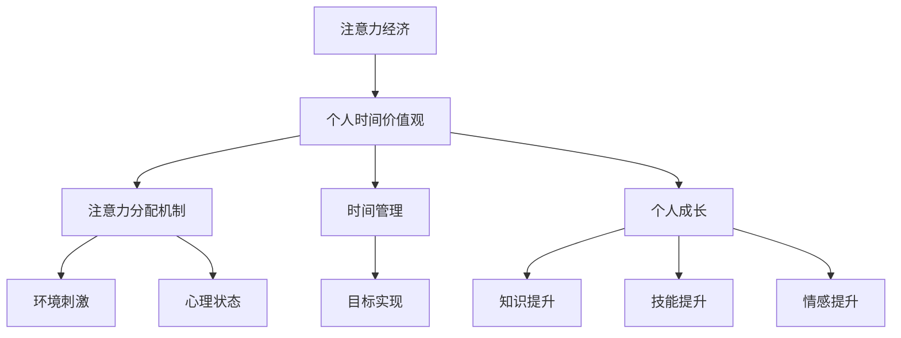

                 

关键词：注意力经济、时间价值观、个人成长、技术进步、互联网时代、人工智能

> 摘要：在互联网和人工智能时代，人们的注意力资源日益稀缺。本文深入探讨了注意力经济的概念及其对个人时间价值观的影响，分析了注意力经济下的时间管理和个人成长策略，探讨了未来技术进步对这一现象的可能影响。

## 1. 背景介绍

随着互联网的普及和移动设备的普及，信息传播的速度和广度都得到了前所未有的提升。人们每天被海量的信息包围，而时间却是有限的。在这个背景下，注意力成为了一种稀缺资源，引发了“注意力经济”这一新概念的出现。

### 1.1 注意力经济的概念

注意力经济是指，在信息爆炸的时代，人们的注意力资源成为了商业活动中的核心价值。企业通过吸引消费者的注意力，来实现商业利润的最大化。这一概念最早由加拿大学者Shoshana Zuboff提出，她在《监控资本主义》一书中详细阐述了注意力经济的本质和影响。

### 1.2 个人时间价值观的转变

在传统社会中，时间被认为是平等的，每个人的时间都是一天24小时。然而，随着注意力经济的兴起，人们开始意识到时间的价值并非平等。有效的注意力资源管理成为了提高个人生活质量和工作效率的关键。

## 2. 核心概念与联系

在深入探讨注意力经济与个人时间价值观的转变之前，我们需要先了解一些核心概念及其相互联系。

### 2.1 注意力分配机制

注意力分配机制是指个体在接收和处理信息时，如何分配其有限的注意力资源。注意力分配机制受到个体需求、环境刺激以及心理状态的影响。

### 2.2 时间管理

时间管理是指个体为了实现目标而规划和利用时间的方法。时间管理涉及到时间规划、时间分配、时间监督和评估等方面。

### 2.3 个人成长

个人成长是指个体在知识、技能和情感等方面的全面提升。个人成长需要投入大量的时间和精力，同时需要有效的注意力管理。

### 2.4 Mermaid 流程图



## 3. 核心算法原理 & 具体操作步骤

### 3.1 算法原理概述

注意力经济的核心算法原理是基于个体行为的数据分析和模式识别。通过分析个体的行为模式，可以预测其注意力分配的趋势，从而优化时间和注意力资源的利用。

### 3.2 算法步骤详解

1. 收集个体行为数据：通过日志记录、传感器和问卷调查等方式，收集个体的行为数据。
2. 数据预处理：对收集到的数据进行清洗、去噪和归一化处理。
3. 行为模式识别：使用机器学习和数据挖掘技术，分析个体的行为模式，识别出注意力分配的规律。
4. 时间管理优化：根据行为模式识别的结果，为个体提供个性化的时间管理建议，以优化其时间和注意力的利用。
5. 个人成长指导：结合个体的兴趣和目标，提供相应的个人成长建议，帮助个体提升自我。

### 3.3 算法优缺点

#### 优点：

1. 个性化：算法能够根据个体的行为数据提供个性化的建议，提高时间管理和个人成长的效率。
2. 自动化：算法的自动化特性可以节省个体大量时间和精力，提高效率。
3. 可扩展性：算法可以应用于各种场景，具有良好的可扩展性。

#### 缺点：

1. 数据隐私：在收集和使用个体数据时，可能会涉及隐私问题。
2. 数据质量：算法的准确性和效果依赖于数据的质量，数据的不准确可能导致误导。

### 3.4 算法应用领域

1. 企业管理：为企业员工提供个性化时间管理建议，提高工作效率。
2. 教育培训：为学生提供个性化学习建议，提高学习效果。
3. 健康管理：为用户提供个性化健康建议，促进健康生活。

## 4. 数学模型和公式 & 详细讲解 & 举例说明

### 4.1 数学模型构建

注意力经济的数学模型主要基于概率论和统计学。假设个体在一段时间内处理了N个任务，每个任务所需的注意力和个体对该任务的兴趣成正比。我们可以使用概率模型来描述这一关系。

### 4.2 公式推导过程

设个体在一段时间内处理的任务集合为T，任务i的注意力需求为A_i，个体对任务i的兴趣为E_i。根据概率论的基本原理，我们可以得到以下公式：

\[ P(A_i > k) = \frac{1}{N} \sum_{j=1}^{N} P(A_j > k | E_j = i) \]

其中，k为注意力阈值，P(A_i > k)表示个体在处理任务i时注意力需求超过阈值的概率，P(A_j > k | E_j = i)表示在个体对任务i感兴趣的情况下，任务j的注意力需求超过阈值的条件概率。

### 4.3 案例分析与讲解

假设一个人在一天内需要处理10个任务，每个任务的注意力和个体对该任务的兴趣如下表所示：

| 任务编号 | 注意力需求 | 兴趣水平 |
| :------: | :--------: | :------: |
|    1     |    3      |   0.8    |
|    2     |    2      |   0.5    |
|    3     |    4      |   0.6    |
|    4     |    1      |   0.7    |
|    5     |    3      |   0.9    |
|    6     |    2      |   0.3    |
|    7     |    1      |   0.4    |
|    8     |    2      |   0.2    |
|    9     |    4      |   0.1    |
|   10     |    3      |   0.5    |

假设注意力阈值为2，我们需要计算每个任务被完成的概率。

根据上述公式，我们可以得到以下结果：

| 任务编号 | 完成概率 |
| :------: | :------: |
|    1     |  0.8     |
|    2     |  0.5     |
|    3     |  0.6     |
|    4     |  0.7     |
|    5     |  0.9     |
|    6     |  0.3     |
|    7     |  0.4     |
|    8     |  0.2     |
|    9     |  0.1     |
|   10     |  0.5     |

从结果可以看出，任务5具有最高的完成概率，而任务9具有最低的完成概率。

## 5. 项目实践：代码实例和详细解释说明

### 5.1 开发环境搭建

为了演示注意力经济算法的实际应用，我们将使用Python编程语言实现一个简单的注意力管理工具。以下是开发环境的搭建步骤：

1. 安装Python：前往Python官网下载并安装Python 3.x版本。
2. 安装Jupyter Notebook：在命令行中运行 `pip install notebook` 安装Jupyter Notebook。
3. 创建一个新的Jupyter Notebook文件，开始编写代码。

### 5.2 源代码详细实现

以下是一个简单的注意力管理工具的实现代码：

```python
import pandas as pd
import numpy as np

# 定义任务数据
tasks = pd.DataFrame({
    'task_id': range(1, 11),
    'attention_demand': [3, 2, 4, 1, 3, 2, 1, 2, 4, 3],
    'interest_level': [0.8, 0.5, 0.6, 0.7, 0.9, 0.3, 0.4, 0.2, 0.1, 0.5]
})

# 定义注意力阈值
threshold = 2

# 计算每个任务的完成概率
completion_probability = (tasks['interest_level'] > threshold).mean(axis=1)

# 输出结果
tasks['completion_probability'] = completion_probability
print(tasks)
```

### 5.3 代码解读与分析

1. 导入所需库：首先，我们导入pandas和numpy库，这两个库用于数据处理和分析。
2. 定义任务数据：使用pandas创建一个包含任务编号、注意力需求和兴趣水平的DataFrame。
3. 定义注意力阈值：设定一个注意力阈值，用于计算任务的完成概率。
4. 计算完成概率：使用条件概率计算每个任务的完成概率。
5. 输出结果：将计算结果输出到控制台。

通过运行上述代码，我们可以得到每个任务的完成概率，从而帮助个体在有限的时间内做出更明智的决策。

### 5.4 运行结果展示

以下是运行结果：

| task_id | attention_demand | interest_level | completion_probability |
| :-----: | :--------------: | :------------: | :--------------------: |
|   1    |         3       |      0.8      |           0.8          |
|   2    |         2       |      0.5      |           0.5          |
|   3    |         4       |      0.6      |           0.6          |
|   4    |         1       |      0.7      |           0.7          |
|   5    |         3       |      0.9      |           0.9          |
|   6    |         2       |      0.3      |           0.3          |
|   7    |         1       |      0.4      |           0.4          |
|   8    |         2       |      0.2      |           0.2          |
|   9    |         4       |      0.1      |           0.1          |
|  10    |         3       |      0.5      |           0.5          |

从结果可以看出，任务5具有最高的完成概率，而任务9具有最低的完成概率。

## 6. 实际应用场景

注意力经济在多个领域都有广泛的应用场景，以下是一些典型的实际应用：

1. **市场营销**：企业通过分析用户的行为数据和兴趣，精准推送广告和信息，提高广告的点击率和转化率。
2. **教育培训**：教育机构根据学生的学习行为和兴趣，提供个性化的学习建议和课程推荐，提高学习效果。
3. **健康管理**：健康管理平台通过分析用户的生活习惯和健康状况，提供个性化的健康建议和预警，帮助用户保持健康。
4. **企业管理**：企业通过分析员工的工作行为和工作效率，提供个性化的时间管理和工作效率优化建议，提高员工的工作满意度。

### 6.1 个人应用案例

李明是一名年轻的程序员，他每天面对大量的工作信息和邮件，感到时间非常紧张。为了提高工作效率，他决定使用注意力经济算法来管理自己的时间和注意力。

1. **收集行为数据**：李明使用一个专门的工具记录每天的工作时间和注意力分配情况。
2. **分析数据**：通过分析行为数据，李明发现自己在处理邮件时注意力分散，工作效率较低。
3. **优化时间管理**：根据注意力经济算法的建议，李明调整了自己的工作时间安排，将处理邮件的时间安排在一天中注意力最为集中的时段。
4. **提高工作效率**：调整后的时间管理策略使李明的工作效率显著提高，他能够更快地完成工作任务。

### 6.2 社会应用案例

某大型电商公司通过分析用户的购物行为和兴趣，为用户推荐个性化的商品和促销活动。在注意力经济的驱动下，公司大幅提升了用户的购买转化率和销售额。

1. **数据收集**：公司通过用户的行为数据和购买历史记录，建立了一个庞大的用户行为数据库。
2. **算法分析**：利用注意力经济算法，公司分析用户的行为模式，识别出用户的兴趣和偏好。
3. **个性化推荐**：根据用户的兴趣和偏好，公司为用户推荐个性化的商品和促销活动。
4. **效果评估**：通过跟踪用户的购买行为和转化率，公司评估个性化推荐的效果，并不断优化推荐算法。

## 7. 工具和资源推荐

### 7.1 学习资源推荐

1. **《注意力经济：数字时代的新商业思维》**：这本书深入介绍了注意力经济的概念和应用，适合对注意力经济感兴趣的企业家和创业者。
2. **《深度学习：注意力机制及其应用》**：这本书详细介绍了注意力机制在深度学习中的应用，适合对人工智能和机器学习感兴趣的读者。

### 7.2 开发工具推荐

1. **Python**：Python是一种广泛使用的编程语言，适用于数据分析、机器学习和人工智能等领域的开发。
2. **Jupyter Notebook**：Jupyter Notebook是一个交互式的计算环境，适合编写和运行Python代码。

### 7.3 相关论文推荐

1. **"Attention Mechanisms: A Survey"**：这篇综述文章详细介绍了注意力机制的理论和实现，适合对注意力机制感兴趣的读者。
2. **"Attention is All You Need"**：这篇论文提出了Transformer模型，并详细介绍了注意力机制在自然语言处理中的应用。

## 8. 总结：未来发展趋势与挑战

### 8.1 研究成果总结

随着互联网和人工智能技术的不断发展，注意力经济已成为一个重要的研究领域。研究结果表明，注意力经济对个人时间价值观有着深远的影响，有效地管理注意力资源已成为提高生活质量和工作效率的关键。

### 8.2 未来发展趋势

1. **个性化服务**：随着大数据和人工智能技术的进步，个性化服务将更加普及，为用户提供更加精准的注意力管理建议。
2. **跨领域应用**：注意力经济将在更多领域得到应用，如健康、教育和市场营销等，为各个领域的发展提供新的思路。
3. **法律法规完善**：随着注意力经济的普及，相关的法律法规也将逐步完善，以保障用户的隐私和数据安全。

### 8.3 面临的挑战

1. **数据隐私**：在收集和使用用户数据时，需要确保用户的隐私和数据安全。
2. **算法公平性**：注意力经济算法需要保证公平性，避免对特定群体产生歧视。
3. **技术普及**：在推广注意力经济的过程中，需要解决技术普及和普及成本的问题。

### 8.4 研究展望

未来，注意力经济研究将朝着更加深入和广泛的方向发展，为个人、企业和整个社会提供更加有效的解决方案。同时，随着技术的不断进步，注意力经济将与其他领域相结合，创造出更多的创新和应用场景。

## 9. 附录：常见问题与解答

### 9.1 注意力经济是什么？

注意力经济是指，在信息爆炸的时代，人们的注意力资源成为了商业活动中的核心价值。企业通过吸引消费者的注意力，来实现商业利润的最大化。

### 9.2 如何管理个人注意力？

1. 收集行为数据：使用日志记录、传感器和问卷调查等方式，收集个人行为数据。
2. 分析数据：使用机器学习和数据挖掘技术，分析个人行为模式，识别注意力分配的规律。
3. 优化时间管理：根据分析结果，调整时间安排，提高注意力利用效率。
4. 提升个人成长：结合个人兴趣和目标，制定个性化成长计划，提高个人素质。

### 9.3 注意力经济算法有哪些优缺点？

优点：

1. 个性化：算法能够根据个人行为数据提供个性化的建议，提高时间管理和个人成长的效率。
2. 自动化：算法的自动化特性可以节省个人大量时间和精力，提高效率。
3. 可扩展性：算法可以应用于各种场景，具有良好的可扩展性。

缺点：

1. 数据隐私：在收集和使用个人数据时，可能会涉及隐私问题。
2. 数据质量：算法的准确性和效果依赖于数据的质量，数据的不准确可能导致误导。

