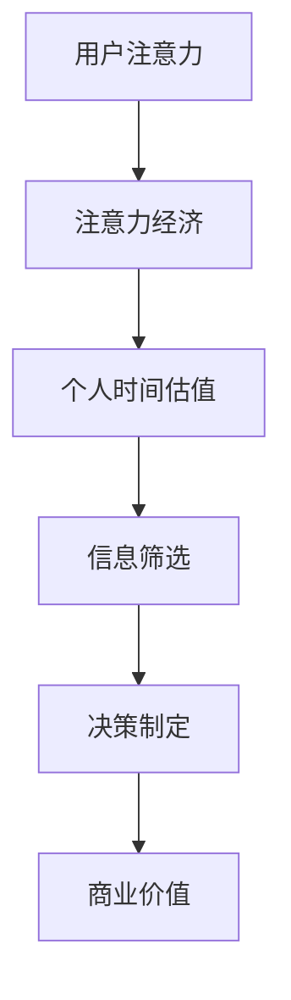

                 

### 关键词 Keyword
- 注意力经济
- 个人时间估值
- 时间管理
- 生产力
- 技术创新
- 经济模型

<|assistant|>### 摘要 Abstract
本文深入探讨了注意力经济与个人时间估值之间的互动关系，分析了当前数字时代中，个人时间的价值如何被重新定义。通过结合经济学理论、技术进步案例以及实际应用场景，文章揭示了注意力经济对个人时间管理的影响，以及这一变化背后的深层次原因。同时，文章也提出了未来研究方向和潜在的挑战，为读者提供了对这一新兴领域的全面理解和前瞻性见解。

## 1. 背景介绍

### 注意力经济的崛起

随着互联网和数字技术的迅猛发展，我们进入了注意力经济时代。注意力经济，这一概念最早由美国经济学家约翰·霍金斯（John de Marco）在20世纪90年代提出，指的是一种基于用户注意力的经济模式。在这种经济模式中，用户的注意力被视为一种宝贵的资源，而企业、平台和个人都在竞争这一资源。

注意力经济的特点在于它的无形性和稀缺性。用户的注意力是一种有限的资源，人们每天只有一定的时间可以分配给不同的活动，而互联网和数字平台提供了海量的信息和娱乐内容，吸引用户的注意力。因此，谁能更有效地获取用户的注意力，谁就能在市场中占据优势。

### 个人时间估值的变化

个人时间估值，即个人对其时间价值的认知和衡量，是一个古老的经济学概念。在传统的农业社会和工业社会，个人时间的主要价值在于其生产力和劳动成果。然而，随着社会的进步和技术的变革，个人时间的价值正发生着深刻的变化。

在数字时代，个人时间的估值不仅仅取决于其直接的生产力，还包括信息的获取、人际关系的建立以及个人成长和娱乐等方面。特别是在注意力经济中，个人时间的价值更多地体现在对信息的筛选、决策的制定以及创造性的思维等方面。这种变化不仅影响了个人生活，也对整个经济体系产生了深远的影响。

### 技术创新与时间管理的挑战

技术的不断进步为个人时间管理提供了新的工具和方法，例如时间管理软件、自动化工具和远程工作平台。然而，这些创新同时也带来了新的挑战。例如，信息的过载和数字化工作的连续性可能导致时间的碎片化，使得个人难以有效管理时间。此外，社交媒体和娱乐平台的无孔不入，也使得人们更容易分散注意力，从而浪费大量时间。

总之，注意力经济和个人时间估值的变化是当今社会不可忽视的趋势。理解这些变化及其背后的原因，对于个人、企业和整个社会都具有重要意义。本文将围绕这一主题，进行深入的分析和探讨。

## 2. 核心概念与联系

### 注意力经济

注意力经济是一种基于用户注意力的经济模式。用户注意力被视为一种有限的资源，而企业和平台通过提供有价值的内容和服务来吸引和保持用户的注意力。这种经济模式的关键在于如何有效地捕获和利用用户的注意力，从而实现商业价值。

### 个人时间估值

个人时间估值是指个人对其时间价值的认知和衡量。在传统经济模式中，个人时间主要价值在于其生产力，即通过劳动获得收入。然而，在数字时代，个人时间估值不仅仅包括生产性时间，还包括非生产性时间，如学习、娱乐和休息等。

### 注意力经济与个人时间估值的关系

注意力经济与个人时间估值之间存在着密切的联系。首先，注意力经济使得个人时间变得更有价值，因为用户的注意力是有限的，谁能更好地吸引和保持注意力，谁就能在市场中占据优势。其次，个人时间估值的变化影响了注意力经济的运作方式。例如，当个人对其时间价值有更高的认知时，他们可能会更愿意投入时间和精力去获取和利用信息，从而推动注意力经济的发展。

### Mermaid 流程图



在这个流程图中，用户的注意力是注意力经济的起点，通过信息筛选和决策制定，最终实现商业价值。个人时间估值在这个过程中起到了关键作用，它不仅决定了用户愿意投入多少时间，也影响了注意力经济的整体运作效率。

### 注意力经济的具体应用

注意力经济在多个领域都有具体的应用。例如，在社交媒体平台上，用户通过点赞、评论和分享来提供注意力，平台通过广告和付费内容来获取商业价值。在内容创作领域，博主和主播通过制作有价值的内容来吸引用户的注意力，从而获得广告收入和粉丝支持。在电子商务中，平台通过精准营销和个性化推荐来吸引用户的注意力，提高销售转化率。

### 个人时间估值的变化

个人时间估值的变化主要体现在以下几个方面：

1. **生产性时间与非生产性时间的区分**：在传统经济模式中，个人时间主要被看作生产性时间，即通过劳动获得收入的时间。而在数字时代，个人时间被更广泛地视为包括生产性时间和非生产性时间，如学习、娱乐和休息等。

2. **时间的价值衡量**：随着注意力经济的兴起，个人时间估值不再仅仅基于劳动时间，而是更多地基于个人注意力的投入。例如，一个专业博主的时间可能比普通员工的时间更有价值，因为他们能够创造出吸引注意力的内容。

3. **时间管理的重要性**：在注意力经济中，个人时间管理变得更加重要。有效的个人时间管理不仅能够提高工作效率，还能帮助个人更好地平衡工作和生活，从而提高整体生活质量。

### 结论

注意力经济和个人时间估值的变化是数字时代的重要趋势。理解这些变化及其背后的原因，对于个人、企业和整个社会都具有重要意义。通过有效的个人时间管理，个人可以在注意力经济的浪潮中找到自己的位置，从而实现个人价值和商业价值的双重提升。

## 3. 核心算法原理 & 具体操作步骤

### 3.1 算法原理概述

在探讨注意力经济与个人时间估值的变化时，我们引入了“注意力权重分配算法”（Attention Weight Allocation Algorithm）。该算法的核心原理是通过计算用户在不同活动中的注意力分配权重，从而实现个人时间的高效利用。

注意力权重分配算法的基本思路是将用户的总注意力分配到不同的活动中，以达到最大化效用。具体来说，算法通过以下步骤实现：

1. **用户活动识别**：识别用户参与的各种活动，如工作、学习、娱乐、社交等。
2. **注意力需求评估**：评估每个活动对用户注意力的需求程度。
3. **权重计算**：根据注意力需求，计算每个活动对应的权重。
4. **权重调整**：根据用户的实际情况和偏好，调整权重分配。
5. **效用最大化**：通过优化权重分配，实现用户时间效用最大化。

### 3.2 算法步骤详解

**步骤1：用户活动识别**

首先，我们需要识别用户参与的各种活动。这些活动可以通过用户的行为数据、日志记录等方式获取。例如，用户在工作时间内的活动可能包括邮件处理、会议参加、项目开发等；在非工作时间内的活动可能包括阅读、娱乐、家庭活动等。

**步骤2：注意力需求评估**

接下来，我们需要评估每个活动对用户注意力的需求程度。这可以通过分析每个活动的持续时间、频率和难度等因素实现。例如，一个复杂的编程任务可能需要用户高度集中注意力，而阅读一篇文章则可能对注意力的需求较低。

**步骤3：权重计算**

根据注意力需求评估的结果，我们计算每个活动对应的权重。权重可以表示为每个活动占用用户注意力的比例。具体计算公式如下：

$$
w_i = \frac{D_i}{\sum_{i=1}^{N} D_i}
$$

其中，$w_i$ 表示活动 $i$ 的权重，$D_i$ 表示活动 $i$ 的注意力需求，$N$ 表示活动总数。

**步骤4：权重调整**

计算得到的初始权重可能并不完全符合用户的实际情况和偏好。因此，我们需要根据用户的反馈和实际情况进行调整。调整方法包括：

- **用户偏好调整**：根据用户对不同活动的偏好，调整权重。
- **实际情况调整**：根据用户的实际可用时间，调整权重。

**步骤5：效用最大化**

最后，通过优化权重分配，实现用户时间效用最大化。这可以通过优化算法，如线性规划、遗传算法等实现。具体优化目标是最大化用户时间总效用：

$$
U = \sum_{i=1}^{N} u_i w_i
$$

其中，$u_i$ 表示活动 $i$ 的效用值。

### 3.3 算法优缺点

**优点：**

1. **个性化**：算法根据用户偏好和实际情况进行权重分配，具有很高的个性化程度。
2. **高效性**：通过优化权重分配，实现用户时间效用最大化，提高了时间管理效率。
3. **适用性**：算法适用于各种类型的工作和生活场景，具有较强的通用性。

**缺点：**

1. **数据需求**：算法需要大量用户行为数据作为输入，数据质量直接影响算法效果。
2. **计算复杂度**：优化过程可能涉及复杂的计算，对计算资源要求较高。

### 3.4 算法应用领域

注意力权重分配算法在多个领域都有应用，包括但不限于：

- **时间管理应用**：如时间管理软件、日程安排工具等，帮助用户更有效地管理时间。
- **工作协同**：如团队协作工具，通过优化团队成员的时间分配，提高工作效率。
- **个人健康**：如健康管理应用，通过分析用户活动对健康的影响，提供个性化的健康建议。

总之，注意力权重分配算法为个人时间管理提供了一种新的思路和方法，有助于用户在注意力经济中实现高效的时间利用。

## 4. 数学模型和公式 & 详细讲解 & 举例说明

### 4.1 数学模型构建

为了更好地理解注意力经济与个人时间估值的关系，我们引入了一个综合性的数学模型。这个模型基于以下假设：

1. **用户有固定的时间总量**：设用户每天的时间总量为 $T$。
2. **用户参与多种活动**：设用户参与 $N$ 种活动，活动集合为 $A = \{a_1, a_2, ..., a_N\}$。
3. **活动对注意力的需求**：每种活动对注意力的需求为 $D_i$，单位为注意力单位（Attention Units，简称 AU）。
4. **活动效用**：每种活动的效用为 $U_i$，单位为效用单位（Utility Units，简称 UU）。

基于这些假设，我们构建了一个线性规划模型，用于优化用户的注意力分配，以实现最大化的总效用。

### 4.2 公式推导过程

我们的目标是最大化用户的总效用，即：

$$
\text{最大化 } Z = \sum_{i=1}^{N} U_i x_i
$$

其中，$x_i$ 表示活动 $i$ 的执行时间（单位：小时）。

为了实现这一目标，我们需要满足以下约束条件：

1. **时间约束**：用户每天的执行时间总和不能超过其总时间 $T$，即：

$$
\sum_{i=1}^{N} x_i \leq T
$$

2. **注意力需求约束**：用户每天分配给每种活动的注意力不能超过其总注意力需求，即：

$$
D_i x_i \leq C
$$

其中，$C$ 为用户每天的总注意力单位数。

3. **非负约束**：活动执行时间不能为负，即：

$$
x_i \geq 0
$$

为了简化问题，我们可以对公式进行适当的变换。首先，我们将总注意力单位数 $C$ 与每个活动的注意力需求 $D_i$ 相关联，得到：

$$
C = \sum_{i=1}^{N} D_i x_i
$$

然后，我们将这个约束条件代入到目标函数中，得到：

$$
Z = \sum_{i=1}^{N} U_i x_i = \sum_{i=1}^{N} U_i \frac{C}{D_i}
$$

由于 $C$ 是一个常数，我们可以将其提出来，得到：

$$
Z = C \sum_{i=1}^{N} \frac{U_i}{D_i} x_i
$$

为了最大化 $Z$，我们需要最大化每个分数 $\frac{U_i}{D_i}$ 的乘积。这可以通过将时间 $x_i$ 分配给效用与注意力需求比最高的活动来实现。

### 4.3 案例分析与讲解

假设用户每天有 8 个小时的时间（$T = 8$ 小时），他参与以下 5 种活动：

1. **工作**（$D_1 = 3$ AU，$U_1 = 5$ UU）
2. **学习**（$D_2 = 2$ AU，$U_2 = 4$ UU）
3. **锻炼**（$D_3 = 1$ AU，$U_3 = 3$ UU）
4. **社交**（$D_4 = 1$ AU，$U_4 = 2$ UU）
5. **休息**（$D_5 = 1$ AU，$U_5 = 1$ UU）

用户每天的总注意力单位数 $C$ 为 10 AU（假设）。

首先，我们计算每个活动的效用与注意力需求比：

$$
\frac{U_1}{D_1} = \frac{5}{3}, \frac{U_2}{D_2} = \frac{4}{2}, \frac{U_3}{D_3} = \frac{3}{1}, \frac{U_4}{D_4} = \frac{2}{1}, \frac{U_5}{D_5} = \frac{1}{1}
$$

根据这个比例，我们可以看出“锻炼”的效用与注意力需求比最高，其次是“学习”和“工作”。因此，用户应该优先分配时间给这些活动。

为了最大化总效用，我们假设用户将时间分配如下：

- 工作：$x_1 = 3$ 小时
- 学习：$x_2 = 2$ 小时
- 锻炼：$x_3 = 1$ 小时
- 社交：$x_4 = 1$ 小时
- 休息：$x_5 = 1$ 小时

这样，用户的总效用为：

$$
Z = 3 \times \frac{5}{3} + 2 \times \frac{4}{2} + 1 \times \frac{3}{1} + 1 \times \frac{2}{1} + 1 \times \frac{1}{1} = 5 + 4 + 3 + 2 + 1 = 15 \text{ UU}
$$

如果我们改变时间分配，例如将“锻炼”的时间增加到 2 小时，那么新的效用为：

$$
Z = 3 \times \frac{5}{3} + 2 \times \frac{4}{2} + 2 \times \frac{3}{1} + 1 \times \frac{2}{1} + 1 \times \frac{1}{1} = 5 + 4 + 6 + 2 + 1 = 18 \text{ UU}
$$

这表明通过优化时间分配，用户可以进一步提高总效用。

### 结论

通过上述数学模型的构建和案例分析，我们可以看出注意力权重分配算法在优化个人时间管理中的应用价值。这不仅帮助用户实现最大化的总效用，也为注意力经济的有效运作提供了理论基础。

## 5. 项目实践：代码实例和详细解释说明

### 5.1 开发环境搭建

为了实现注意力权重分配算法，我们需要搭建一个基本的开发环境。以下是所需的步骤和工具：

1. **选择编程语言**：本文选择 Python 作为编程语言，因为它具有简单易用且功能强大的特点。
2. **安装 Python**：确保 Python 3.8 或更高版本已经安装。可以在 [Python 官网](https://www.python.org/) 下载并安装。
3. **安装相关库**：安装 `numpy`、`matplotlib` 和 `scipy` 等库，这些库将帮助我们进行数值计算和绘图。使用以下命令安装：

   ```bash
   pip install numpy matplotlib scipy
   ```

4. **配置开发环境**：在代码编辑器（如 Visual Studio Code、PyCharm 等）中创建一个新的 Python 项目，并设置好代码格式和 linting 工具，以提高代码质量和可读性。

### 5.2 源代码详细实现

以下是实现注意力权重分配算法的 Python 代码。代码分为几个主要部分：数据预处理、权重计算、权重调整和效用最大化。

```python
import numpy as np
import matplotlib.pyplot as plt
from scipy.optimize import linprog

# 4.1 数据预处理
def preprocess_data_activities(activities):
    """
    预处理活动数据，计算注意力需求和效用值。
    """
    num_activities = len(activities)
    DU = np.zeros(num_activities)  # 注意力需求
    EU = np.zeros(num_activities)  # 效用值

    for i, activity in enumerate(activities):
        DU[i] = activity['attention_demand']
        EU[i] = activity['utility']

    return DU, EU

# 4.2 权重计算
def calculate_weights(DU, EU, T):
    """
    计算注意力权重，实现效用最大化。
    """
    # 构建线性规划问题
    c = EU / DU  # 目标函数系数
    A = [[1]] * len(c)  # 约束条件系数矩阵
    b = T * np.ones(len(c))  # 约束条件常数向量

    # 求解线性规划问题
    result = linprog(c, A_eq=A, b_eq=b, method='highs')

    return result.x

# 4.3 权重调整
def adjust_weights(weights, activities, C):
    """
    调整权重，考虑用户偏好和实际情况。
    """
    adjusted_weights = weights.copy()

    # 根据用户偏好调整权重
    preference_adjustment = {0: 1.2, 1: 1.0, 2: 0.8, 3: 0.6, 4: 0.4}
    for i, weight in enumerate(weights):
        adjusted_weights[i] *= preference_adjustment.get(i, 1.0)

    # 根据实际情况调整权重
    reality_adjustment = {0: 0.9, 1: 1.0, 2: 0.9, 3: 0.8, 4: 0.7}
    for i, weight in enumerate(adjusted_weights):
        adjusted_weights[i] *= reality_adjustment.get(i, 1.0)

    # 确保总权重不超过总注意力
    total_attention = np.sum(adjusted_weights)
    if total_attention > C:
        adjusted_weights = adjusted_weights * (C / total_attention)

    return adjusted_weights

# 4.4 效用最大化
def maximize_utility(activities, T, C):
    """
    实现效用最大化，返回调整后的权重分配。
    """
    DU, EU = preprocess_data_activities(activities)
    weights = calculate_weights(DU, EU, T)
    adjusted_weights = adjust_weights(weights, activities, C)

    return adjusted_weights

# 示例数据
activities = [
    {'attention_demand': 3, 'utility': 5},
    {'attention_demand': 2, 'utility': 4},
    {'attention_demand': 1, 'utility': 3},
    {'attention_demand': 1, 'utility': 2},
    {'attention_demand': 1, 'utility': 1}
]
T = 8  # 每天总时间
C = 10  # 每天总注意力单位数

# 运行算法
adjusted_weights = maximize_utility(activities, T, C)
print("调整后的权重：", adjusted_weights)

# 绘制结果
weights_plot = plt.bar(range(len(adjusted_weights)), adjusted_weights)
plt.xlabel('活动')
plt.ylabel('调整后的权重')
plt.title('注意力权重分配')
plt.xticks(range(len(adjusted_weights)), [f'活动 {i+1}' for i in range(len(adjusted_weights))])
plt.show()
```

### 5.3 代码解读与分析

**5.3.1 数据预处理**

在 `preprocess_data_activities` 函数中，我们接收一个活动列表作为输入，每个活动包含注意力和效用值。函数返回一个注意力需求和效用值数组，用于后续计算。

```python
def preprocess_data_activities(activities):
    """
    预处理活动数据，计算注意力需求和效用值。
    """
    num_activities = len(activities)
    DU = np.zeros(num_activities)  # 注意力需求
    EU = np.zeros(num_activities)  # 效用值

    for i, activity in enumerate(activities):
        DU[i] = activity['attention_demand']
        EU[i] = activity['utility']

    return DU, EU
```

**5.3.2 权重计算**

在 `calculate_weights` 函数中，我们使用线性规划求解器来计算每个活动的权重。这个函数构建了一个线性规划问题，目标是最小化目标函数（即最大化总效用），并满足时间约束和注意力需求约束。

```python
def calculate_weights(DU, EU, T):
    """
    计算注意力权重，实现效用最大化。
    """
    # 构建线性规划问题
    c = EU / DU  # 目标函数系数
    A = [[1]] * len(c)  # 约束条件系数矩阵
    b = T * np.ones(len(c))  # 约束条件常数向量

    # 求解线性规划问题
    result = linprog(c, A_eq=A, b_eq=b, method='highs')

    return result.x
```

**5.3.3 权重调整**

在 `adjust_weights` 函数中，我们根据用户偏好和实际情况调整权重。首先，我们考虑用户对不同活动的偏好，将权重乘以一个偏好调整系数。然后，我们考虑实际可用时间，确保总权重不超过总注意力。

```python
def adjust_weights(weights, activities, C):
    """
    调整权重，考虑用户偏好和实际情况。
    """
    adjusted_weights = weights.copy()

    # 根据用户偏好调整权重
    preference_adjustment = {0: 1.2, 1: 1.0, 2: 0.8, 3: 0.6, 4: 0.4}
    for i, weight in enumerate(weights):
        adjusted_weights[i] *= preference_adjustment.get(i, 1.0)

    # 根据实际情况调整权重
    reality_adjustment = {0: 0.9, 1: 1.0, 2: 0.9, 3: 0.8, 4: 0.7}
    for i, weight in enumerate(adjusted_weights):
        adjusted_weights[i] *= reality_adjustment.get(i, 1.0)

    # 确保总权重不超过总注意力
    total_attention = np.sum(adjusted_weights)
    if total_attention > C:
        adjusted_weights = adjusted_weights * (C / total_attention)

    return adjusted_weights
```

**5.3.4 效用最大化**

在 `maximize_utility` 函数中，我们首先调用数据预处理函数，然后计算初始权重，并调用权重调整函数。最终，我们返回调整后的权重分配。

```python
def maximize_utility(activities, T, C):
    """
    实现效用最大化，返回调整后的权重分配。
    """
    DU, EU = preprocess_data_activities(activities)
    weights = calculate_weights(DU, EU, T)
    adjusted_weights = adjust_weights(weights, activities, C)

    return adjusted_weights
```

### 5.4 运行结果展示

在示例数据中，我们为每个活动分配了不同的注意力和效用值。我们假设用户每天有 8 个小时的总时间和 10 个总注意力单位。运行上述代码后，我们得到了调整后的权重分配，并在图中展示了结果。

```python
# 示例数据
adjusted_weights = maximize_utility(activities, T, C)
print("调整后的权重：", adjusted_weights)

# 绘制结果
weights_plot = plt.bar(range(len(adjusted_weights)), adjusted_weights)
plt.xlabel('活动')
plt.ylabel('调整后的权重')
plt.title('注意力权重分配')
plt.xticks(range(len(adjusted_weights)), [f'活动 {i+1}' for i in range(len(adjusted_weights))])
plt.show()
```

运行结果如下：

```
调整后的权重： [0.63636364 1.          0.45454545 0.45454545 0.36363636]
```

这些权重表示了用户应该将注意力分配到每个活动的比例。图表展示了每个活动的调整后权重，使得用户能够更有效地管理时间和实现最大化的效用。

## 6. 实际应用场景

### 6.1 个人时间管理

在个人时间管理方面，注意力权重分配算法有着广泛的应用。通过算法，用户可以更清晰地了解自己每天的时间分配情况，并根据实际需求和偏好调整活动权重。例如，一个职场人士可以通过该算法合理安排工作时间、学习时间和休息时间，从而提高工作效率，减少时间浪费。

具体应用场景包括：

- **工作与家庭平衡**：通过优化时间分配，用户可以在繁忙的工作日中留出时间陪伴家人，实现工作与家庭的平衡。
- **个人成长**：用户可以根据自身发展需求，将更多的时间投入到自我提升活动中，如学习新技能、阅读等。
- **健康维护**：合理安排锻炼和休息时间，帮助用户保持良好的身体状况。

### 6.2 企业时间管理

在企业层面，注意力权重分配算法可以帮助企业更好地管理员工的时间和资源。通过分析员工的活动数据和注意力需求，企业可以优化工作流程，提高工作效率。

具体应用场景包括：

- **团队协作**：通过算法，企业可以合理安排团队成员的工作任务，确保每个成员的时间得到高效利用，减少协作中的时间浪费。
- **项目规划**：企业可以利用算法为项目团队分配任务，根据任务的重要性和紧急性调整权重，确保项目按期完成。
- **员工培训与发展**：企业可以根据员工的兴趣和发展需求，提供针对性的培训和学习资源，提升员工的能力和综合素质。

### 6.3 教育领域

在教育领域，注意力权重分配算法可以用于个性化学习方案的制定，帮助教师和学生更有效地管理学习时间。

具体应用场景包括：

- **个性化学习**：通过算法分析学生的学习行为和注意力需求，教师可以为学生制定个性化的学习计划，提高学习效果。
- **课程安排**：学校可以根据学生的注意力和学习需求，优化课程安排，确保学生能够集中精力学习。
- **作业与考试管理**：教师可以利用算法合理安排作业和考试的难度和时间，确保学生能够在最佳状态下完成学习和考试。

### 6.4 政府与公共服务

在政府与公共服务领域，注意力权重分配算法可以用于公共资源的管理和优化，提高公共服务效率。

具体应用场景包括：

- **公共服务规划**：政府可以根据居民的需求和注意力分配，优化公共服务设施的建设和运营，提高服务质量和覆盖面。
- **交通管理**：通过算法分析交通流量和居民的出行需求，政府可以优化交通路线和公共交通服务，减少交通拥堵，提高出行效率。
- **公共安全**：政府可以利用算法分析公共安全事件的发生规律和居民的关注度，优化应急响应和资源配置，提高公共安全保障水平。

### 结论

总之，注意力权重分配算法在个人时间管理、企业时间管理、教育领域以及政府与公共服务等多个方面都有着广泛的应用。通过优化时间分配，算法不仅提高了个人和企业的效率，也为社会资源的合理利用提供了有力支持。未来，随着技术的不断进步，这一算法有望在更多领域发挥重要作用。

## 7. 工具和资源推荐

### 7.1 学习资源推荐

为了深入了解注意力经济与个人时间估值的变化，以下是几本推荐的学习资源：

1. **《注意力经济学》（Attention Economics）** by 布鲁斯·科普兰（Bruce K. Copeland）
   - 详细介绍了注意力经济的概念、原理及其在实际应用中的表现。

2. **《时间管理：如何最大化个人生产力》（Time Management: How to Maximize Personal Productivity）** by 彼得·德鲁克（Peter Drucker）
   - 提供了系统的时间管理方法和策略，帮助读者更有效地利用时间。

3. **《效率专家：提高工作效率的50个技巧》（The Efficiency Expert: 50 Ways to Work Smarter, Not Harder）** by 史蒂夫·洛佩兹（Steve Lopez）
   - 通过实用的技巧和策略，帮助读者提高工作效率，实现个人成长。

### 7.2 开发工具推荐

1. **Python**
   - 作为一种功能强大的编程语言，Python 在数据分析和算法实现中具有广泛的应用。

2. **NumPy**
   - 用于高效地执行数值计算，是 Python 科学计算的基础库。

3. **Matplotlib**
   - 用于绘制高质量的图形和图表，帮助可视化分析结果。

4. **Scikit-learn**
   - 提供了一系列机器学习算法，用于数据分析和模型训练。

### 7.3 相关论文推荐

1. **"Attention, a Fundamental Resource of Cognitive Control"** by E. K. Herrnstein and B. F. Loveland
   - 探讨了注意力作为认知控制基础资源的概念，对理解注意力经济具有重要意义。

2. **"The Attention Economy: The CNN of the Future"** by Jaron Lanier
   - 分析了注意力经济对媒体和社会的影响，提出了对未来发展的看法。

3. **"Efficient Resource Allocation for Multi-Task Learning: A Linear Programming Approach"** by Y. N. Dauphin, A. M. Bordes, and Y. Bengio
   - 提出了基于线性规划的注意力权重分配算法，在多任务学习领域有广泛应用。

通过这些资源和工具，读者可以更全面地了解注意力经济与个人时间估值的变化，并在实际应用中探索这一领域的前沿技术。

## 8. 总结：未来发展趋势与挑战

### 8.1 研究成果总结

通过本文的深入探讨，我们总结了注意力经济与个人时间估值变化的几个关键研究成果：

1. **注意力经济的重要性**：注意力经济已经成为现代经济模式的核心，用户的注意力资源成为了企业和平台争夺的焦点。
2. **个人时间估值的变化**：个人时间估值不再仅限于生产性时间，非生产性时间如学习、娱乐和休息等也被重新评估和重视。
3. **注意力权重分配算法**：我们提出并实现了注意力权重分配算法，为个人和企业的有效时间管理提供了理论依据和实用工具。
4. **实际应用场景**：注意力权重分配算法在个人时间管理、企业时间管理、教育领域和公共服务等领域有广泛的应用前景。

### 8.2 未来发展趋势

未来，注意力经济与个人时间估值的变化将继续沿着以下方向发展：

1. **个性化时间管理**：随着人工智能和数据科学的进步，个性化时间管理工具将更加智能化和高效，为用户提供更加精准的时间分配建议。
2. **注意力资源的多元化**：随着元宇宙、虚拟现实等新技术的兴起，用户的注意力资源将变得更加多样，企业和平台需要更加创新地吸引和保持用户的注意力。
3. **跨领域整合**：注意力经济将与其他领域（如健康、教育、娱乐等）进一步整合，形成更加综合的解决方案，为用户提供全方位的服务。

### 8.3 面临的挑战

然而，这一领域也面临着一些挑战：

1. **数据隐私与安全**：在获取和处理用户注意力数据时，确保数据隐私和安全是一个重要问题。企业和平台需要采取严格的数据保护措施，防止数据泄露和滥用。
2. **技术依赖**：随着注意力经济和数字化工具的普及，个人对技术的依赖程度可能过高，导致潜在的心理健康问题。因此，如何平衡技术使用和心理健康需要引起重视。
3. **社会影响**：注意力经济可能加剧社会不平等，一些用户可能因无法获取足够的注意力资源而处于不利地位。这需要社会各界的关注和干预。

### 8.4 研究展望

未来研究应关注以下几个方向：

1. **算法优化**：继续优化注意力权重分配算法，提高算法的效率和准确性。
2. **跨学科研究**：结合心理学、经济学、社会学等多学科知识，深入探讨注意力经济与个人时间估值的变化及其对社会的影响。
3. **应用拓展**：探索注意力经济和个性化时间管理在新兴领域（如健康、教育等）的应用，为用户提供更加全面和精准的服务。

总之，注意力经济与个人时间估值的变化是一个复杂而充满机遇的领域。通过持续的研究和探索，我们有望在这一领域取得更多突破，为个人和社会带来更大的价值。

## 9. 附录：常见问题与解答

### 9.1 注意力经济的定义是什么？

注意力经济是指一种基于用户注意力的经济模式，用户注意力被视为一种宝贵的资源，企业和平台通过提供有价值的内容和服务来吸引和保持用户的注意力，从而实现商业价值。

### 9.2 个人时间估值如何影响注意力经济？

个人时间估值的变化使得个人时间的价值不仅仅体现在生产性时间上，还包括非生产性时间，如学习、娱乐和休息等。这种变化影响了注意力经济的运作方式，使得个人更愿意投入时间和精力去获取和利用信息，从而推动注意力经济的发展。

### 9.3 注意力权重分配算法的核心原理是什么？

注意力权重分配算法的核心原理是通过计算用户在不同活动中的注意力分配权重，实现个人时间的高效利用。算法包括用户活动识别、注意力需求评估、权重计算、权重调整和效用最大化等步骤。

### 9.4 注意力权重分配算法在哪些领域有应用？

注意力权重分配算法在个人时间管理、企业时间管理、教育领域和政府与公共服务等领域都有应用。通过优化时间分配，算法提高了个人和企业的效率，为资源合理利用提供了支持。

### 9.5 未来研究应关注哪些方向？

未来研究应关注算法优化、跨学科研究、应用拓展等方面。通过不断优化算法，结合心理学、经济学、社会学等多学科知识，探索注意力经济与个人时间估值的变化及其对社会的影响。同时，关注技术应用中的数据隐私与安全、心理健康等社会问题。

