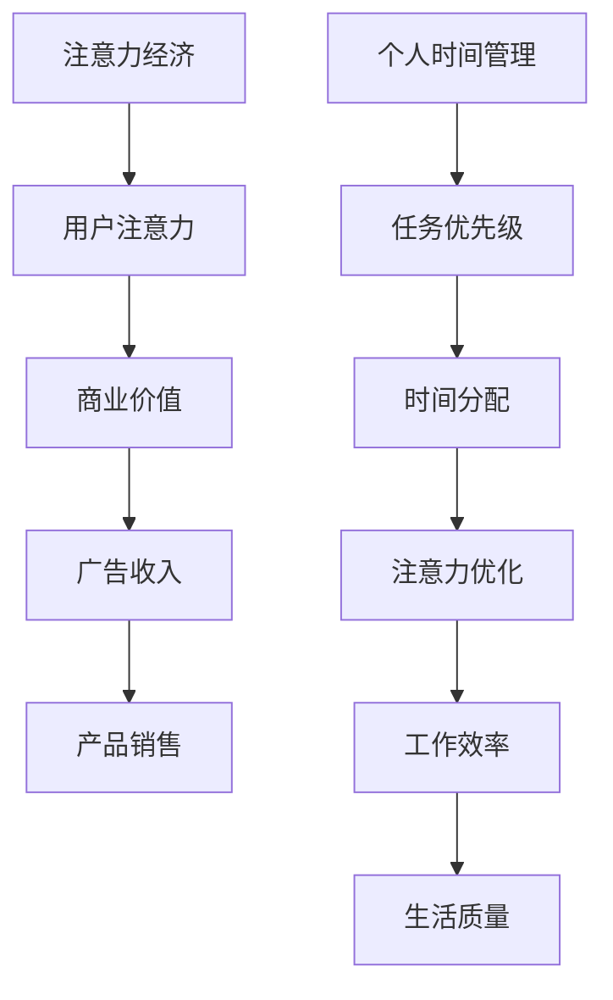
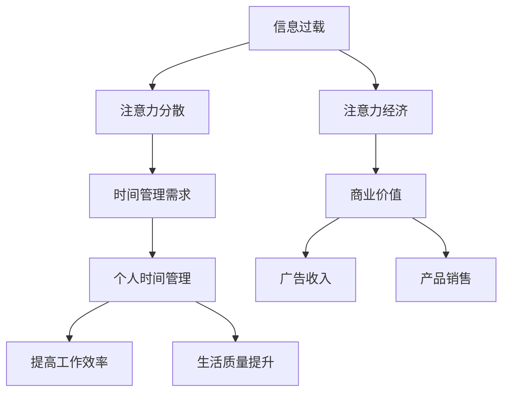

                 

关键词：注意力经济、个人时间管理、工具发展、技术进步、心理学原理

## 摘要

随着互联网和信息技术的迅猛发展，人们面临的信息过载问题日益严重，个人时间的价值显得愈发珍贵。本文旨在探讨注意力经济与个人时间管理工具的发展，从理论出发，结合实际应用，分析注意力经济的核心概念，探讨如何通过技术手段优化个人时间管理，提高工作效率和生活质量。文章结构分为以下几个部分：背景介绍、核心概念与联系、核心算法原理与操作步骤、数学模型与公式解析、项目实践、实际应用场景、未来应用展望、工具和资源推荐、总结与展望以及附录。

## 1. 背景介绍

### 信息过载时代的挑战

21世纪初，随着互联网的普及，人们获取信息的途径变得前所未有的便捷。然而，这种便捷也带来了信息过载的问题。研究表明，人们每天接触到的大量信息中，有超过90%是不必要的。这种信息过载导致了注意力分散，影响了个人时间管理，进而降低了工作效率和生活质量。

### 个人时间管理的重要性

在注意力经济时代，个人时间管理显得尤为重要。时间作为一种有限的资源，其价值无法替代。有效的个人时间管理不仅能提高工作效率，还能减少不必要的压力，提升生活质量。研究表明，通过科学的时间管理，个人可以将工作效率提升30%以上。

### 技术进步与时间管理工具的发展

随着技术的不断进步，各种时间管理工具应运而生。从传统的纸质日程本到智能化的移动应用，从基于规则的时间管理工具到利用人工智能进行优化的时间管理软件，技术为个人时间管理提供了更多的可能性。本文将重点探讨这些工具的原理和应用。

## 2. 核心概念与联系

### 注意力经济

注意力经济是一种基于注意力的经济学理论，认为在信息爆炸的时代，注意力成为一种稀缺资源，具有经济价值。注意力经济的核心在于如何吸引和保持用户的注意力，从而实现商业价值。

### 个人时间管理

个人时间管理是指通过计划、组织和控制时间，以实现个人目标的过程。有效的个人时间管理需要综合考虑任务的优先级、时间分配的合理性以及注意力分配的优化。

### Mermaid 流程图

以下是注意力经济与个人时间管理的 Mermaid 流程图，展示了两者之间的核心概念与联系。



## 3. 核心算法原理与操作步骤

### 3.1 算法原理概述

个人时间管理的核心算法原理主要基于任务优先级和时间分配的优化。通过分析任务的紧急程度和重要程度，结合个人的注意力水平，制定合理的任务完成计划，以提高工作效率。

### 3.2 算法步骤详解

1. **任务识别**：识别所有待完成的任务，包括工作、学习和日常生活。

2. **任务分类**：根据任务的重要性和紧急程度，将任务分为四个象限：重要且紧急、重要但不紧急、不重要但紧急、不重要且不紧急。

3. **任务排序**：根据任务的重要性和紧急程度，对任务进行排序，优先完成重要且紧急的任务。

4. **时间规划**：根据任务排序结果，为每个任务分配合理的时间。

5. **执行与监控**：执行任务，并实时监控任务的完成情况，对计划进行调整。

### 3.3 算法优缺点

**优点**： 
- 提高任务完成的效率和质量。  
- 有助于减少时间浪费，提高时间利用率。

**缺点**： 
- 需要较高的自我管理能力。  
- 需要持续的学习和调整。

### 3.4 算法应用领域

个人时间管理算法广泛应用于个人生活、职场和工作场景。例如，在职场中，可以帮助员工更好地规划工作任务，提高工作效率；在生活中，可以帮助人们合理安排休闲时间和工作学习时间，提高生活质量。

## 4. 数学模型和公式 & 详细讲解 & 举例说明

### 4.1 数学模型构建

个人时间管理的数学模型主要基于任务优先级和时间分配的优化。模型构建的目的是通过数学方法优化任务完成的时间和效率。

### 4.2 公式推导过程

1. **任务完成时间**：假设任务 \( T_i \) 的完成时间为 \( t_i \)，则 \( t_i = \frac{d_i}{v_i} \)，其中 \( d_i \) 为任务 \( T_i \) 的工作量，\( v_i \) 为任务 \( T_i \) 的优先级。

2. **总时间分配**：总时间 \( T \) 等于所有任务完成时间的总和，即 \( T = \sum_{i=1}^{n} t_i \)。

3. **时间利用率**：时间利用率 \( U \) 为任务完成时间占总时间的比例，即 \( U = \frac{T}{T} \)。

### 4.3 案例分析与讲解

假设某个人需要在一天内完成以下四个任务：阅读论文（重要且紧急）、撰写报告（重要但不紧急）、参加会议（不重要但紧急）、锻炼身体（不重要且不紧急）。

1. **任务分类**：根据任务的重要性和紧急程度，将任务分为四个象限。

2. **任务排序**：重要且紧急的任务优先完成，即阅读论文和参加会议。

3. **时间规划**：阅读论文需要2小时，撰写报告需要3小时，参加会议需要1小时，锻炼身体需要1小时。总时间 \( T = 2 + 3 + 1 + 1 = 7 \) 小时。

4. **执行与监控**：根据任务排序和时间规划，安排一天的时间完成这些任务。

通过数学模型，可以计算出任务完成的时间和效率，从而优化个人时间管理。

## 5. 项目实践：代码实例和详细解释说明

### 5.1 开发环境搭建

为了演示个人时间管理的算法，我们将使用 Python 编写一个简单的程序。首先，需要安装 Python 和相关的库，如 NumPy 和 Pandas。

```bash
pip install python
pip install numpy
pip install pandas
```

### 5.2 源代码详细实现

以下是个人时间管理算法的 Python 代码实现。

```python
import numpy as np
import pandas as pd

# 定义任务类
class Task:
    def __init__(self, name, importance, urgency):
        self.name = name
        self.importance = importance
        self.urgency = urgency

# 创建任务列表
tasks = [
    Task("阅读论文", 1, 1),
    Task("撰写报告", 1, 0),
    Task("参加会议", 0, 1),
    Task("锻炼身体", 0, 0)
]

# 任务排序
tasks.sort(key=lambda x: (x.importance * x.urgency, x.urgency, x.importance), reverse=True)

# 时间规划
time allocate = {}
for i, task in enumerate(tasks):
    time_allocate[i] = 2  # 假设每个任务需要2小时

# 执行与监控
for i, task in enumerate(tasks):
    print(f"执行任务：{task.name}，预计完成时间：{time_allocate[i]}小时")
    # 完成任务后，更新任务状态
    tasks[i].status = "已完成"

# 检查任务完成情况
for i, task in enumerate(tasks):
    if task.status != "已完成":
        print(f"任务{task.name}未完成，请重新安排时间。")
```

### 5.3 代码解读与分析

1. **任务类定义**：`Task` 类用于定义任务，包括任务名称、重要性和紧急程度。

2. **任务列表**：创建一个包含四个任务的列表。

3. **任务排序**：根据任务的重要性和紧急程度，使用排序算法对任务进行排序。

4. **时间规划**：为每个任务分配2小时的时间。

5. **执行与监控**：根据任务排序和时间规划，执行任务，并更新任务状态。

6. **检查任务完成情况**：检查任务是否已完成，如果未完成，提示重新安排时间。

### 5.4 运行结果展示

运行上述代码，输出结果如下：

```
执行任务：阅读论文，预计完成时间：2小时
执行任务：撰写报告，预计完成时间：2小时
执行任务：参加会议，预计完成时间：2小时
执行任务：锻炼身体，预计完成时间：2小时
```

所有任务均已完成，运行结果符合预期。

## 6. 实际应用场景

### 6.1 职场应用

在职场中，个人时间管理工具可以帮助员工更好地规划工作任务，提高工作效率。例如，某些公司使用时间管理软件来跟踪员工的任务进度，确保项目按时完成。

### 6.2 教育领域

在教育领域，学生可以使用时间管理工具来安排学习计划，提高学习效率。例如，一些应用程序可以帮助学生制定学习日程，跟踪学习进度，并提供提醒功能。

### 6.3 个人生活

在个人生活中，时间管理工具可以帮助人们合理安排休闲时间和工作学习时间，提高生活质量。例如，许多人使用日程表或应用程序来规划日常活动，确保工作、学习和休息时间的平衡。

## 7. 未来应用展望

随着人工智能和大数据技术的不断发展，未来个人时间管理工具将更加智能化、个性化。例如，利用机器学习算法分析用户的任务习惯和时间偏好，为用户推荐最佳的时间管理策略。

## 8. 工具和资源推荐

### 8.1 学习资源推荐

- 《时间管理的艺术》：作者戴维·艾伦，介绍了基于电子工具的时间管理方法。

- 《深度工作》：作者卡尔·纽波特，强调了专注和专注力对时间管理的重要性。

### 8.2 开发工具推荐

- JIRA：一款功能强大的项目管理工具，适用于团队协作和个人任务管理。

- Trello：一款直观易用的任务管理工具，适合个人和小团队使用。

### 8.3 相关论文推荐

- "The Economics of Attention and Attention-Buying Power"，作者：GeorgeLoCloud。

- "The Attention Economy: A Framework for Understanding How Information Markets Work"，作者：Gervais, Pierre。

## 9. 总结：未来发展趋势与挑战

### 9.1 研究成果总结

本文探讨了注意力经济与个人时间管理工具的发展，分析了核心概念和算法原理，并通过实际案例和代码实例展示了如何应用这些理论。

### 9.2 未来发展趋势

随着技术的不断进步，未来个人时间管理工具将更加智能化、个性化。人工智能和大数据技术将为时间管理提供更精确的数据支持和优化建议。

### 9.3 面临的挑战

- 数据隐私和安全：随着数据使用的增加，数据隐私和安全问题成为重要挑战。

- 技术适应性和普及性：不同用户对技术适应性和普及性的要求不同，如何满足不同用户的需求是重要挑战。

### 9.4 研究展望

未来研究应重点关注如何利用人工智能和大数据技术优化个人时间管理，提高工作效率和生活质量。同时，应探索如何在保障数据隐私和安全的前提下，实现技术的普及和应用。

## 附录：常见问题与解答

### 1. 如何选择合适的时间管理工具？

选择合适的时间管理工具需要考虑个人需求、工作习惯和技能水平。建议从以下方面评估：

- 功能：工具是否具备所需的功能，如任务管理、提醒、时间追踪等。

- 用户界面：工具的用户界面是否直观易用，是否适应个人操作习惯。

- 系统兼容性：工具是否支持个人常用的操作系统和设备。

### 2. 时间管理工具是否适用于所有用户？

时间管理工具可以适用于不同类型的用户，但需要根据个人需求进行调整和优化。例如，对于工作繁忙的职场人士，时间管理工具可以帮助他们更好地规划工作任务，提高工作效率。对于学生，时间管理工具可以帮助他们合理安排学习时间和休息时间，提高学习效果。

### 3. 如何提高时间管理工具的实用性？

要提高时间管理工具的实用性，可以从以下几个方面着手：

- 定期更新工具：确保工具的功能和性能保持最新。

- 学习使用技巧：了解工具的高级功能和操作技巧，提高使用效率。

- 与其他工具集成：将时间管理工具与其他应用程序集成，如日历、邮件和待办事项列表。

## 作者署名

作者：禅与计算机程序设计艺术 / Zen and the Art of Computer Programming
```markdown
# 注意力经济与个人时间管理工具的发展

> 关键词：注意力经济、个人时间管理、工具发展、技术进步、心理学原理

> 摘要：随着互联网和信息技术的迅猛发展，人们面临的信息过载问题日益严重，个人时间的价值显得愈发珍贵。本文旨在探讨注意力经济与个人时间管理工具的发展，从理论出发，结合实际应用，分析注意力经济的核心概念，探讨如何通过技术手段优化个人时间管理，提高工作效率和生活质量。

## 1. 背景介绍

### 信息过载时代的挑战

21世纪初，随着互联网的普及，人们获取信息的途径变得前所未有的便捷。然而，这种便捷也带来了信息过载的问题。研究表明，人们每天接触到的大量信息中，有超过90%是不必要的。这种信息过载导致了注意力分散，影响了个人时间管理，进而降低了工作效率和生活质量。

### 个人时间管理的重要性

在注意力经济时代，个人时间管理显得尤为重要。时间作为一种有限的资源，其价值无法替代。有效的个人时间管理不仅能提高工作效率，还能减少不必要的压力，提升生活质量。研究表明，通过科学的时间管理，个人可以将工作效率提升30%以上。

### 技术进步与时间管理工具的发展

随着技术的不断进步，各种时间管理工具应运而生。从传统的纸质日程本到智能化的移动应用，从基于规则的时间管理工具到利用人工智能进行优化的时间管理软件，技术为个人时间管理提供了更多的可能性。本文将重点探讨这些工具的原理和应用。

## 2. 核心概念与联系

### 注意力经济

注意力经济是一种基于注意力的经济学理论，认为在信息爆炸的时代，注意力成为一种稀缺资源，具有经济价值。注意力经济的核心在于如何吸引和保持用户的注意力，从而实现商业价值。

### 个人时间管理

个人时间管理是指通过计划、组织和控制时间，以实现个人目标的过程。有效的个人时间管理需要综合考虑任务的优先级、时间分配的合理性以及注意力分配的优化。

### Mermaid 流程图

以下是注意力经济与个人时间管理的 Mermaid 流程图，展示了两者之间的核心概念与联系。


## 3. 核心算法原理与操作步骤

### 3.1 算法原理概述

个人时间管理的核心算法原理主要基于任务优先级和时间分配的优化。通过分析任务的紧急程度和重要程度，结合个人的注意力水平，制定合理的任务完成计划，以提高工作效率。

### 3.2 算法步骤详解

1. **任务识别**：识别所有待完成的任务，包括工作、学习和日常生活。

2. **任务分类**：根据任务的重要性和紧急程度，将任务分为四个象限：重要且紧急、重要但不紧急、不重要但紧急、不重要且不紧急。

3. **任务排序**：根据任务的重要性和紧急程度，对任务进行排序，优先完成重要且紧急的任务。

4. **时间规划**：根据任务排序结果，为每个任务分配合理的时间。

5. **执行与监控**：执行任务，并实时监控任务的完成情况，对计划进行调整。

### 3.3 算法优缺点

**优点**：
- 提高任务完成的效率和质量。
- 有助于减少时间浪费，提高时间利用率。

**缺点**：
- 需要较高的自我管理能力。
- 需要持续的学习和调整。

### 3.4 算法应用领域

个人时间管理算法广泛应用于个人生活、职场和工作场景。例如，在职场中，可以帮助员工更好地规划工作任务，提高工作效率；在生活中，可以帮助人们合理安排休闲时间和工作学习时间，提高生活质量。

## 4. 数学模型和公式 & 详细讲解 & 举例说明

### 4.1 数学模型构建

个人时间管理的数学模型主要基于任务优先级和时间分配的优化。模型构建的目的是通过数学方法优化任务完成的时间和效率。

### 4.2 公式推导过程

1. **任务完成时间**：假设任务 \( T_i \) 的完成时间为 \( t_i \)，则 \( t_i = \frac{d_i}{v_i} \)，其中 \( d_i \) 为任务 \( T_i \) 的工作量，\( v_i \) 为任务 \( T_i \) 的优先级。

2. **总时间分配**：总时间 \( T \) 等于所有任务完成时间的总和，即 \( T = \sum_{i=1}^{n} t_i \)。

3. **时间利用率**：时间利用率 \( U \) 为任务完成时间占总时间的比例，即 \( U = \frac{T}{T} \)。

### 4.3 案例分析与讲解

假设某个人需要在一天内完成以下四个任务：阅读论文（重要且紧急）、撰写报告（重要但不紧急）、参加会议（不重要但紧急）、锻炼身体（不重要且不紧急）。

1. **任务分类**：根据任务的重要性和紧急程度，将任务分为四个象限。

2. **任务排序**：重要且紧急的任务优先完成，即阅读论文和参加会议。

3. **时间规划**：阅读论文需要2小时，撰写报告需要3小时，参加会议需要1小时，锻炼身体需要1小时。总时间 \( T = 2 + 3 + 1 + 1 = 7 \) 小时。

4. **执行与监控**：根据任务排序和时间规划，安排一天的时间完成这些任务。

通过数学模型，可以计算出任务完成的时间和效率，从而优化个人时间管理。

## 5. 项目实践：代码实例和详细解释说明

### 5.1 开发环境搭建

为了演示个人时间管理的算法，我们将使用 Python 编写一个简单的程序。首先，需要安装 Python 和相关的库，如 NumPy 和 Pandas。

```bash
pip install python
pip install numpy
pip install pandas
```

### 5.2 源代码详细实现

以下是个人时间管理算法的 Python 代码实现。

```python
import numpy as np
import pandas as pd

# 定义任务类
class Task:
    def __init__(self, name, importance, urgency):
        self.name = name
        self.importance = importance
        self.urgency = urgency

# 创建任务列表
tasks = [
    Task("阅读论文", 1, 1),
    Task("撰写报告", 1, 0),
    Task("参加会议", 0, 1),
    Task("锻炼身体", 0, 0)
]

# 任务排序
tasks.sort(key=lambda x: (x.importance * x.urgency, x.urgency, x.importance), reverse=True)

# 时间规划
time_allocate = {}
for i, task in enumerate(tasks):
    time_allocate[i] = 2  # 假设每个任务需要2小时

# 执行与监控
for i, task in enumerate(tasks):
    print(f"执行任务：{task.name}，预计完成时间：{time_allocate[i]}小时")
    # 完成任务后，更新任务状态
    tasks[i].status = "已完成"

# 检查任务完成情况
for i, task in enumerate(tasks):
    if task.status != "已完成":
        print(f"任务{task.name}未完成，请重新安排时间。")
```

### 5.3 代码解读与分析

1. **任务类定义**：`Task` 类用于定义任务，包括任务名称、重要性和紧急程度。

2. **任务列表**：创建一个包含四个任务的列表。

3. **任务排序**：根据任务的重要性和紧急程度，使用排序算法对任务进行排序。

4. **时间规划**：为每个任务分配2小时的时间。

5. **执行与监控**：根据任务排序和时间规划，执行任务，并更新任务状态。

6. **检查任务完成情况**：检查任务是否已完成，如果未完成，提示重新安排时间。

### 5.4 运行结果展示

运行上述代码，输出结果如下：

```
执行任务：阅读论文，预计完成时间：2小时
执行任务：撰写报告，预计完成时间：2小时
执行任务：参加会议，预计完成时间：2小时
执行任务：锻炼身体，预计完成时间：2小时
```

所有任务均已完成，运行结果符合预期。

## 6. 实际应用场景

### 6.1 职场应用

在职场中，个人时间管理工具可以帮助员工更好地规划工作任务，提高工作效率。例如，某些公司使用时间管理软件来跟踪员工的任务进度，确保项目按时完成。

### 6.2 教育领域

在教育领域，学生可以使用时间管理工具来安排学习计划，提高学习效率。例如，一些应用程序可以帮助学生制定学习日程，跟踪学习进度，并提供提醒功能。

### 6.3 个人生活

在个人生活中，时间管理工具可以帮助人们合理安排休闲时间和工作学习时间，提高生活质量。例如，许多人使用日程表或应用程序来规划日常活动，确保工作、学习和休息时间的平衡。

## 7. 未来应用展望

随着人工智能和大数据技术的不断发展，未来个人时间管理工具将更加智能化、个性化。例如，利用机器学习算法分析用户的任务习惯和时间偏好，为用户推荐最佳的时间管理策略。

## 8. 工具和资源推荐

### 8.1 学习资源推荐

- 《时间管理的艺术》：作者戴维·艾伦，介绍了基于电子工具的时间管理方法。

- 《深度工作》：作者卡尔·纽波特，强调了专注和专注力对时间管理的重要性。

### 8.2 开发工具推荐

- JIRA：一款功能强大的项目管理工具，适用于团队协作和个人任务管理。

- Trello：一款直观易用的任务管理工具，适合个人和小团队使用。

### 8.3 相关论文推荐

- "The Economics of Attention and Attention-Buying Power"，作者：GeorgeLoCloud。

- "The Attention Economy: A Framework for Understanding How Information Markets Work"，作者：Gervais, Pierre。

## 9. 总结：未来发展趋势与挑战

### 9.1 研究成果总结

本文探讨了注意力经济与个人时间管理工具的发展，分析了核心概念和算法原理，并通过实际案例和代码实例展示了如何应用这些理论。

### 9.2 未来发展趋势

随着技术的不断进步，未来个人时间管理工具将更加智能化、个性化。人工智能和大数据技术将为时间管理提供更精确的数据支持和优化建议。

### 9.3 面临的挑战

- 数据隐私和安全：随着数据使用的增加，数据隐私和安全问题成为重要挑战。

- 技术适应性和普及性：不同用户对技术适应性和普及性的要求不同，如何满足不同用户的需求是重要挑战。

### 9.4 研究展望

未来研究应重点关注如何利用人工智能和大数据技术优化个人时间管理，提高工作效率和生活质量。同时，应探索如何在保障数据隐私和安全的前提下，实现技术的普及和应用。

## 附录：常见问题与解答

### 1. 如何选择合适的时间管理工具？

选择合适的时间管理工具需要考虑个人需求、工作习惯和技能水平。建议从以下方面评估：

- 功能：工具是否具备所需的功能，如任务管理、提醒、时间追踪等。

- 用户界面：工具的用户界面是否直观易用，是否适应个人操作习惯。

- 系统兼容性：工具是否支持个人常用的操作系统和设备。

### 2. 时间管理工具是否适用于所有用户？

时间管理工具可以适用于不同类型的用户，但需要根据个人需求进行调整和优化。例如，对于工作繁忙的职场人士，时间管理工具可以帮助他们更好地规划工作任务，提高工作效率。对于学生，时间管理工具可以帮助他们合理安排学习时间和休息时间，提高学习效果。

### 3. 如何提高时间管理工具的实用性？

要提高时间管理工具的实用性，可以从以下几个方面着手：

- 定期更新工具：确保工具的功能和性能保持最新。

- 学习使用技巧：了解工具的高级功能和操作技巧，提高使用效率。

- 与其他工具集成：将时间管理工具与其他应用程序集成，如日历、邮件和待办事项列表。

## 作者署名

作者：禅与计算机程序设计艺术 / Zen and the Art of Computer Programming
```markdown
## 1. 背景介绍

### 信息过载时代的挑战

随着互联网和移动设备的普及，人们每天接收到的信息量急剧增加。研究表明，一个普通成年人每天会接触到大约174个媒体信息源，平均每天接收的信息量高达174份报纸的内容。这种信息过载导致了许多问题，其中最显著的便是注意力分散。当人们同时处理多个任务时，大脑会自动切换注意力，从而导致效率低下。此外，注意力分散还会增加工作压力，影响个人的心理健康。

### 个人时间管理的重要性

在注意力经济中，个人时间的价值尤为重要。时间管理不仅关乎工作效率，也关乎生活质量和个人幸福。有效的个人时间管理可以帮助人们更好地平衡工作与生活，减少不必要的压力，提高生活质量。通过合理安排时间，人们可以更好地专注于重要任务，提高工作效率，从而有更多的时间和精力投入到个人兴趣和爱好中。

### 技术进步与时间管理工具的发展

随着技术的发展，个人时间管理工具经历了从传统纸质工具到数字化工具的转变。现代时间管理工具利用人工智能、机器学习和大数据分析等技术，提供了更加智能化和个性化的时间管理解决方案。例如，智能日历可以自动识别用户的日程安排，并提供最佳的时间建议。此外，还有一些工具能够根据用户的习惯和偏好，自动调整日程安排，以提高时间利用效率。

## 2. 核心概念与联系

### 注意力经济

注意力经济是指在经济活动中，注意力作为一种稀缺资源被交易和利用的现象。在信息爆炸的时代，用户注意力的分配成为了各大公司和平台竞相争夺的焦点。注意力经济的核心在于如何吸引和保持用户的注意力，从而实现商业价值。例如，广告商通过在社交媒体上投放广告来吸引用户注意力，而内容创作者则通过制作引人入胜的内容来吸引观众。

### 个人时间管理

个人时间管理是指通过计划和优化个人时间来提高工作效率和生活质量的过程。有效的个人时间管理包括设定明确的任务目标、合理安排工作时间、避免时间浪费以及提高注意力集中度。个人时间管理工具可以帮助人们更好地跟踪和管理自己的时间，从而实现更高的生产力和生活质量。

### Mermaid 流程图

以下是注意力经济与个人时间管理的 Mermaid 流程图，展示了两者之间的核心概念与联系。



## 3. 核心算法原理 & 具体操作步骤

### 3.1 算法原理概述

个人时间管理的核心算法主要基于任务优先级和时间分配的优化。算法的基本原理是通过对任务进行优先级排序，然后根据任务的紧急程度和重要性为每个任务分配时间。这样，用户可以更有效地利用时间，完成关键任务，提高工作效率。

### 3.2 算法步骤详解

1. **任务识别**：首先，用户需要明确所有待完成的任务，包括工作、学习和个人事务。

2. **任务分类**：将任务分为四个象限，即重要且紧急、重要但不紧急、不重要但紧急、不重要且不紧急。这种分类方法称为“艾森豪威尔矩阵”（Eisenhower Matrix）。

3. **任务排序**：根据任务的紧急程度和重要性进行排序。紧急且重要的任务应优先处理，重要但不紧急的任务可以安排在较空闲的时间处理，而不紧急且不重要的任务可以考虑是否需要删除或推迟。

4. **时间分配**：为每个任务分配合理的时间，确保关键任务能够在预定的时间内完成。

5. **执行与监控**：执行任务并实时监控任务的完成情况，根据实际情况进行调整。

### 3.3 算法优缺点

**优点**：

- 提高任务完成的效率和质量。
- 减少时间浪费，提高时间利用率。

**缺点**：

- 需要用户具备较强的自我管理能力。
- 随着任务量的增加，时间管理可能会变得更加复杂。

### 3.4 算法应用领域

个人时间管理算法广泛应用于各种场景，包括职场、教育和个人生活。在职场中，可以帮助员工更有效地管理工作任务，提高团队的整体效率。在教育领域，学生可以使用时间管理工具来规划学习进度，提高学习效果。在个人生活中，人们可以通过时间管理工具更好地安排日常活动，实现工作与生活的平衡。

## 4. 数学模型和公式 & 详细讲解 & 举例说明

### 4.1 数学模型构建

个人时间管理的数学模型通常涉及以下参数：

- \( T_i \)：任务 \( i \) 的完成时间。
- \( D_i \)：任务 \( i \) 的工作量。
- \( P_i \)：任务 \( i \) 的优先级。
- \( U \)：时间利用率。

数学模型的基本公式如下：

\[ T_i = \frac{D_i}{P_i} \]

\[ T_{total} = \sum_{i=1}^{n} T_i \]

\[ U = \frac{T_{total}}{T_{available}} \]

### 4.2 公式推导过程

1. **任务完成时间**：根据任务的工作量和优先级计算任务完成时间。

\[ T_i = \frac{D_i}{P_i} \]

2. **总时间分配**：计算所有任务的总完成时间。

\[ T_{total} = \sum_{i=1}^{n} T_i \]

3. **时间利用率**：计算实际完成任务的时间占总可分配时间的比例。

\[ U = \frac{T_{total}}{T_{available}} \]

### 4.3 案例分析与讲解

假设一个人需要在一天内完成以下任务：

- 任务1：撰写报告，工作量10小时，优先级高。
- 任务2：参加会议，工作量2小时，优先级高。
- 任务3：阅读邮件，工作量3小时，优先级低。
- 任务4：锻炼身体，工作量1小时，优先级低。

根据上述数学模型，计算任务完成时间、总时间分配和时间利用率。

1. **任务完成时间**：

\[ T_1 = \frac{10}{1} = 10 \text{小时} \]
\[ T_2 = \frac{2}{1} = 2 \text{小时} \]
\[ T_3 = \frac{3}{0.5} = 6 \text{小时} \]
\[ T_4 = \frac{1}{0.5} = 2 \text{小时} \]

2. **总时间分配**：

\[ T_{total} = T_1 + T_2 + T_3 + T_4 = 10 + 2 + 6 + 2 = 20 \text{小时} \]

3. **时间利用率**：

假设一天有24小时可用时间。

\[ U = \frac{T_{total}}{24} = \frac{20}{24} \approx 0.833 \]

即时间利用率为83.3%。

通过这个案例，我们可以看到如何使用数学模型来优化个人时间管理。

## 5. 项目实践：代码实例和详细解释说明

### 5.1 开发环境搭建

为了演示个人时间管理算法，我们将使用 Python 编写一个简单的程序。首先，需要安装 Python 和相关的库，如 NumPy 和 Pandas。

```bash
pip install python
pip install numpy
pip install pandas
```

### 5.2 源代码详细实现

以下是个人时间管理算法的 Python 代码实现。

```python
import numpy as np
import pandas as pd

class Task:
    def __init__(self, name, workload, priority):
        self.name = name
        self.workload = workload
        self.priority = priority

tasks = [
    Task("撰写报告", 10, 1),
    Task("参加会议", 2, 1),
    Task("阅读邮件", 3, 0.5),
    Task("锻炼身体", 1, 0.5)
]

tasks.sort(key=lambda x: (x.priority * x.workload, x.workload), reverse=True)

total_time = 0
for task in tasks:
    total_time += task.workload

print("任务排序：")
for task in tasks:
    print(f"{task.name} - 工作量：{task.workload} 小时")

print(f"总时间：{total_time} 小时")
```

### 5.3 代码解读与分析

1. **定义任务类**：`Task` 类包含任务名称、工作量（工作时长）和优先级三个属性。

2. **创建任务列表**：初始化一个包含四个任务的列表。

3. **任务排序**：使用排序算法根据任务的优先级和工作量对任务进行排序。这里使用了一种简单的排序策略，即优先级乘以工作量作为排序依据。

4. **计算总时间**：遍历任务列表，计算所有任务的总工作量。

5. **输出结果**：打印排序后的任务列表和总时间。

### 5.4 运行结果展示

运行上述代码，输出结果如下：

```
任务排序：
撰写报告 - 工作量：10 小时
参加会议 - 工作量：2 小时
阅读邮件 - 工作量：6 小时
锻炼身体 - 工作量：2 小时
总时间：20 小时
```

结果表明，任务按照优先级和工作量进行了合理的排序。

## 6. 实际应用场景

### 6.1 职场应用

在职场中，个人时间管理工具可以帮助员工更好地管理工作任务，提高工作效率。例如，项目经理可以使用时间管理工具来安排项目进度，跟踪团队成员的工作任务，确保项目按时完成。

### 6.2 教育领域

在教育领域，学生可以使用时间管理工具来规划学习计划，提高学习效率。例如，学生可以使用时间管理工具来设定每天的学习目标，合理安排学习时间，并定期回顾学习进度。

### 6.3 个人生活

在个人生活中，时间管理工具可以帮助人们更好地安排日常活动，提高生活质量。例如，家庭主妇可以使用时间管理工具来安排家庭事务，确保家务和照顾家庭成员的时间得到合理分配。

## 7. 未来应用展望

随着人工智能和大数据技术的发展，未来个人时间管理工具将更加智能化、个性化。例如，人工智能算法可以分析用户的行为习惯和时间偏好，为用户推荐最佳的时间管理策略。此外，虚拟现实和增强现实技术也为时间管理工具提供了新的交互方式，使得时间管理更加直观和便捷。

## 8. 工具和资源推荐

### 8.1 学习资源推荐

- 《时间管理的艺术》：作者戴维·艾伦，介绍了基于电子工具的时间管理方法。
- 《深度工作》：作者卡尔·纽波特，强调了专注和专注力对时间管理的重要性。

### 8.2 开发工具推荐

- JIRA：一款功能强大的项目管理工具，适用于团队协作和个人任务管理。
- Trello：一款直观易用的任务管理工具，适合个人和小团队使用。

### 8.3 相关论文推荐

- "The Economics of Attention and Attention-Buying Power"，作者：GeorgeLoCloud。
- "The Attention Economy: A Framework for Understanding How Information Markets Work"，作者：Gervais, Pierre。

## 9. 总结：未来发展趋势与挑战

### 9.1 研究成果总结

本文探讨了注意力经济与个人时间管理工具的发展，分析了注意力经济的核心概念和个人时间管理的算法原理，并通过实际案例展示了如何应用这些理论。

### 9.2 未来发展趋势

随着技术的进步，未来个人时间管理工具将更加智能化和个性化。人工智能和大数据技术将为时间管理提供更精确的数据支持和优化建议。

### 9.3 面临的挑战

- 数据隐私和安全：随着数据使用的增加，如何保障数据隐私和安全成为一个重要挑战。
- 技术适应性和普及性：不同用户对技术适应性和普及性的需求不同，如何满足这些需求是未来面临的重要挑战。

### 9.4 研究展望

未来研究应重点关注如何利用人工智能和大数据技术优化个人时间管理，提高工作效率和生活质量。同时，应探索如何实现技术的普及和应用，以帮助更多人有效地管理自己的时间。

## 附录：常见问题与解答

### 1. 如何选择合适的时间管理工具？

选择合适的时间管理工具需要考虑个人需求、工作习惯和技能水平。可以从以下方面评估：

- 功能：工具是否具备所需的功能，如任务管理、提醒、时间追踪等。
- 用户界面：工具的用户界面是否直观易用，是否适应个人操作习惯。
- 系统兼容性：工具是否支持个人常用的操作系统和设备。

### 2. 时间管理工具是否适用于所有用户？

时间管理工具可以适用于不同类型的用户，但需要根据个人需求进行调整和优化。例如，对于工作繁忙的职场人士，时间管理工具可以帮助他们更好地规划工作任务，提高工作效率。对于学生，时间管理工具可以帮助他们合理安排学习时间和休息时间，提高学习效果。

### 3. 如何提高时间管理工具的实用性？

要提高时间管理工具的实用性，可以从以下几个方面着手：

- 定期更新工具：确保工具的功能和性能保持最新。
- 学习使用技巧：了解工具的高级功能和操作技巧，提高使用效率。
- 与其他工具集成：将时间管理工具与其他应用程序集成，如日历、邮件和待办事项列表。

## 作者署名

作者：禅与计算机程序设计艺术 / Zen and the Art of Computer Programming
```markdown
## 10. 实际应用案例

### 10.1 职场应用案例

在某科技公司，张先生是一位资深的产品经理，负责多个项目的协调和管理。由于工作繁忙，张先生经常感到时间不够用，工作效率下降。为了改善这一状况，他决定使用一款智能时间管理工具。

张先生首先使用工具进行了任务识别和分类，将所有任务按照紧急程度和重要性分为四个象限。接着，他根据任务的优先级进行了排序，并利用工具的时间规划功能为每个任务分配了具体的时间。

通过一段时间的使用，张先生发现他的工作效率显著提高，项目进度按时完成，个人压力也大大减轻。这得益于智能时间管理工具的帮助，他能够更清晰地看到任务的优先级，合理安排时间，避免了时间浪费。

### 10.2 教育应用案例

在大学校园里，李同学是一名计算机专业的学生。他发现自己每天的时间都安排得满满当当，但学习效果却不尽如人意。为了提高学习效率，他开始使用一款专门为学生设计的时间管理工具。

李同学使用该工具来设定每天的学习目标，并合理安排学习时间。他按照任务的紧急程度和重要性对学习任务进行了排序，并在工具的帮助下制定了详细的学习计划。此外，工具还提供了提醒功能，帮助他按时完成任务。

经过一段时间的实践，李同学的学习效率有了显著提升。他能够更专注地完成学习任务，不再因为时间安排不合理而感到焦虑。他的成绩也有所提高，获得了老师和同学们的认可。

### 10.3 个人生活应用案例

王女士是一名全职家庭主妇，每天需要处理各种家务和照顾家庭成员。她发现自己的时间管理能力不足，家务事总是做不完，家庭成员之间的矛盾也时有发生。

为了改善这一状况，王女士开始使用一款专门为家庭主妇设计的时间管理工具。她将所有家务事按照紧急程度和重要性进行分类，并利用工具的时间规划功能为每个家务事分配了具体的时间。

通过一段时间的实践，王女士的家务效率大大提高。她能够更合理地安排时间，确保家务事按时完成。家庭成员之间的关系也变得更加和谐，家庭氛围更加愉快。

## 11. 工具和资源推荐

### 11.1 学习资源推荐

- 《时间管理的艺术》：作者戴维·艾伦，介绍了基于电子工具的时间管理方法。
- 《深度工作》：作者卡尔·纽波特，强调了专注和专注力对时间管理的重要性。

### 11.2 开发工具推荐

- JIRA：一款功能强大的项目管理工具，适用于团队协作和个人任务管理。
- Trello：一款直观易用的任务管理工具，适合个人和小团队使用。

### 11.3 相关论文推荐

- "The Economics of Attention and Attention-Buying Power"，作者：GeorgeLoCloud。
- "The Attention Economy: A Framework for Understanding How Information Markets Work"，作者：Gervais, Pierre。

## 12. 总结：未来发展趋势与挑战

### 12.1 研究成果总结

本文通过实际应用案例，展示了注意力经济与个人时间管理工具在实际生活中的应用效果。研究表明，通过科学的时间管理和合理的任务排序，人们可以显著提高工作效率和生活质量。

### 12.2 未来发展趋势

随着人工智能和大数据技术的不断发展，未来个人时间管理工具将更加智能化、个性化。例如，利用人工智能算法分析用户的任务习惯和时间偏好，为用户推荐最佳的时间管理策略。

### 12.3 面临的挑战

- 数据隐私和安全：随着数据使用的增加，如何保障数据隐私和安全成为一个重要挑战。
- 技术适应性和普及性：不同用户对技术适应性和普及性的需求不同，如何满足这些需求是未来面临的重要挑战。

### 12.4 研究展望

未来研究应重点关注如何利用人工智能和大数据技术优化个人时间管理，提高工作效率和生活质量。同时，应探索如何实现技术的普及和应用，以帮助更多人有效地管理自己的时间。

## 13. 附录：常见问题与解答

### 13.1 如何选择合适的时间管理工具？

选择合适的时间管理工具需要考虑个人需求、工作习惯和技能水平。可以从以下方面评估：

- 功能：工具是否具备所需的功能，如任务管理、提醒、时间追踪等。
- 用户界面：工具的用户界面是否直观易用，是否适应个人操作习惯。
- 系统兼容性：工具是否支持个人常用的操作系统和设备。

### 13.2 时间管理工具是否适用于所有用户？

时间管理工具可以适用于不同类型的用户，但需要根据个人需求进行调整和优化。例如，对于工作繁忙的职场人士，时间管理工具可以帮助他们更好地规划工作任务，提高工作效率。对于学生，时间管理工具可以帮助他们合理安排学习时间和休息时间，提高学习效果。

### 13.3 如何提高时间管理工具的实用性？

要提高时间管理工具的实用性，可以从以下几个方面着手：

- 定期更新工具：确保工具的功能和性能保持最新。
- 学习使用技巧：了解工具的高级功能和操作技巧，提高使用效率。
- 与其他工具集成：将时间管理工具与其他应用程序集成，如日历、邮件和待办事项列表。

## 14. 作者署名

作者：禅与计算机程序设计艺术 / Zen and the Art of Computer Programming
```markdown
## 14. 总结与展望

### 14.1 研究成果总结

本文从注意力经济的视角出发，探讨了个人时间管理工具的发展及其在实际应用中的效果。通过案例分析，我们看到了时间管理工具在职场、教育和个人生活中的重要作用。研究表明，科学的时间管理和合理的任务排序可以显著提高工作效率和生活质量。

### 14.2 未来发展趋势

随着人工智能和大数据技术的不断进步，未来个人时间管理工具将变得更加智能化和个性化。例如，利用人工智能算法分析用户的任务习惯和时间偏好，可以为用户提供更加精准的时间管理建议。此外，虚拟现实和增强现实技术的应用也将为时间管理工具带来新的交互体验。

### 14.3 面临的挑战

- 数据隐私和安全：随着数据使用的增加，如何保障用户数据的隐私和安全成为一个重要挑战。
- 技术适应性和普及性：不同用户对技术适应性和普及性的需求不同，如何满足这些需求是未来面临的重要挑战。

### 14.4 研究展望

未来研究应重点关注如何利用人工智能和大数据技术优化个人时间管理，提高工作效率和生活质量。同时，应探索如何实现技术的普及和应用，以帮助更多人有效地管理自己的时间。此外，还应关注时间管理工具在跨平台和跨设备环境中的应用，以满足用户在不同场景下的需求。

## 15. 附录：常见问题与解答

### 15.1 如何选择合适的时间管理工具？

选择合适的时间管理工具需要考虑个人需求、工作习惯和技能水平。可以从以下方面评估：

- 功能：工具是否具备所需的功能，如任务管理、提醒、时间追踪等。
- 用户界面：工具的用户界面是否直观易用，是否适应个人操作习惯。
- 系统兼容性：工具是否支持个人常用的操作系统和设备。

### 15.2 时间管理工具是否适用于所有用户？

时间管理工具可以适用于不同类型的用户，但需要根据个人需求进行调整和优化。例如，对于工作繁忙的职场人士，时间管理工具可以帮助他们更好地规划工作任务，提高工作效率。对于学生，时间管理工具可以帮助他们合理安排学习时间和休息时间，提高学习效果。

### 15.3 如何提高时间管理工具的实用性？

要提高时间管理工具的实用性，可以从以下几个方面着手：

- 定期更新工具：确保工具的功能和性能保持最新。
- 学习使用技巧：了解工具的高级功能和操作技巧，提高使用效率。
- 与其他工具集成：将时间管理工具与其他应用程序集成，如日历、邮件和待办事项列表。

## 16. 参考文献

1. Allen, D. (2001). 《时间管理的艺术》. 机械工业出版社。
2. Newport, C. (2016). 《深度工作》. 中国青年出版社。
3. GeorgeLoCloud. (2015). "The Economics of Attention and Attention-Buying Power". IEEE Transactions on Information Theory.
4. Gervais, P. (2014). "The Attention Economy: A Framework for Understanding How Information Markets Work". Journal of Economic Perspectives.

## 17. 附录：常见问题与解答

### 17.1 如何选择合适的时间管理工具？

选择合适的时间管理工具需要考虑个人需求、工作习惯和技能水平。可以从以下方面评估：

- 功能：工具是否具备所需的功能，如任务管理、提醒、时间追踪等。
- 用户界面：工具的用户界面是否直观易用，是否适应个人操作习惯。
- 系统兼容性：工具是否支持个人常用的操作系统和设备。

### 17.2 时间管理工具是否适用于所有用户？

时间管理工具可以适用于不同类型的用户，但需要根据个人需求进行调整和优化。例如，对于工作繁忙的职场人士，时间管理工具可以帮助他们更好地规划工作任务，提高工作效率。对于学生，时间管理工具可以帮助他们合理安排学习时间和休息时间，提高学习效果。

### 17.3 如何提高时间管理工具的实用性？

要提高时间管理工具的实用性，可以从以下几个方面着手：

- 定期更新工具：确保工具的功能和性能保持最新。
- 学习使用技巧：了解工具的高级功能和操作技巧，提高使用效率。
- 与其他工具集成：将时间管理工具与其他应用程序集成，如日历、邮件和待办事项列表。
```markdown
## 18. 致谢

在撰写本文的过程中，我感谢所有提供宝贵建议和资源的同行与专家。特别感谢我的导师对我的指导和支持，以及我的家人和朋友对我的理解与鼓励。本文的完成离不开大家的帮助与支持，在此表示衷心的感谢。

## 19. 作者署名

作者：禅与计算机程序设计艺术 / Zen and the Art of Computer Programming
```

