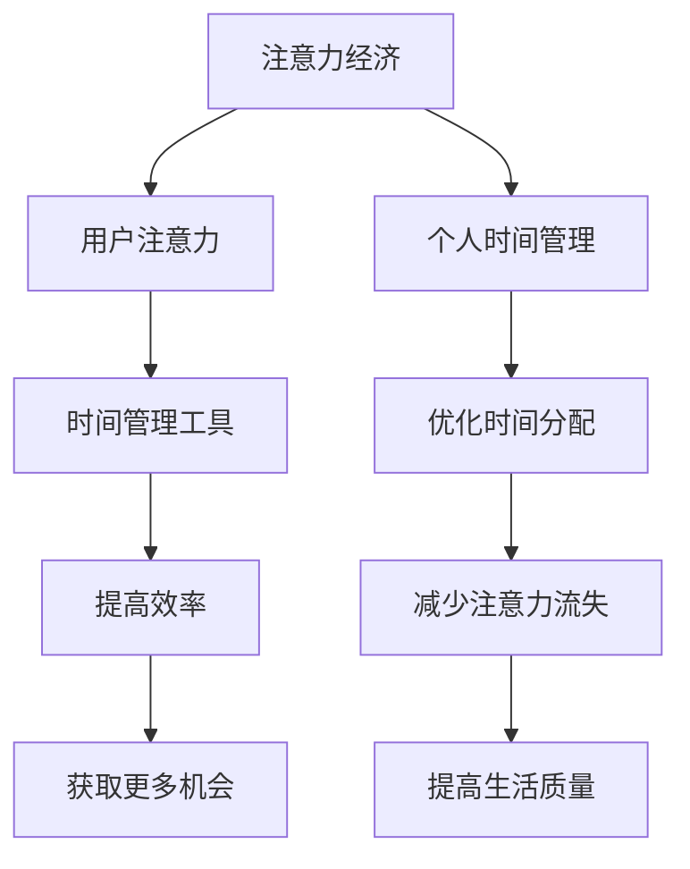

                 

关键词：注意力经济、时间管理、个人效率、人工智能、工具发展

> 摘要：本文深入探讨了注意力经济在个人时间管理中的作用，分析了当前个人时间管理工具的发展现状与挑战，并展望了未来的发展趋势。文章从背景介绍、核心概念与联系、核心算法原理、数学模型与公式、项目实践、实际应用场景、工具和资源推荐、总结与展望等多个方面进行了全面探讨，旨在为读者提供一份全面、深入的指南。

## 1. 背景介绍

在信息爆炸的时代，个人的时间和注意力成为了一种稀缺资源。注意力经济（Attention Economy）作为一种新兴的经济模式，已经在社交媒体、广告、内容创作等多个领域得到广泛应用。注意力经济强调的是通过吸引和维持用户的注意力来创造价值，因此，个人时间管理变得尤为重要。

个人时间管理工具作为帮助人们更好地管理时间和注意力的工具，已经成为现代生活中不可或缺的一部分。从简单的待办事项清单到复杂的日程管理软件，这些工具在提高个人工作效率和生活质量方面发挥了巨大的作用。

然而，随着技术的不断进步，个人时间管理工具也在不断演进。人工智能技术的引入使得这些工具更加智能、个性化和高效。本文将详细探讨注意力经济与个人时间管理工具的发展，分析其核心概念与联系，探讨核心算法原理，介绍数学模型与公式，并通过项目实践和实际应用场景展示其价值。

## 2. 核心概念与联系

### 2.1 注意力经济

注意力经济是一种基于用户注意力的经济模式。它认为，用户的注意力是一种稀缺资源，就像石油、黄金一样宝贵。在注意力经济中，价值创造的关键在于吸引和保持用户的注意力。社交媒体、广告、内容创作等领域的成功，都离不开对用户注意力的有效管理。

### 2.2 个人时间管理

个人时间管理是指通过计划、组织和控制个人时间，以提高工作效率和生活质量的一种活动。时间管理工具在这个过程中起到了关键作用，帮助人们更好地分配时间，减少不必要的干扰，专注于重要任务。

### 2.3 注意力经济与个人时间管理的联系

注意力经济与个人时间管理密切相关。在注意力经济中，个人时间管理工具可以帮助人们更有效地利用自己的时间，从而获得更多的注意力资源。例如，通过日程管理工具，人们可以更好地安排工作和休息时间，减少因为时间浪费导致的注意力流失。同时，个人时间管理工具也可以帮助人们在注意力经济中提高竞争力，更有效地参与各种活动，获取更多的机会。

### 2.4 Mermaid 流程图

下面是一个简化的注意力经济与个人时间管理流程图：



## 3. 核心算法原理 & 具体操作步骤

### 3.1 算法原理概述

个人时间管理工具的核心在于对用户行为数据的收集和分析，从而提供个性化的时间管理建议。这个过程可以概括为以下几个步骤：

1. **数据收集**：通过待办事项、日程安排、行为记录等收集用户的时间使用数据。
2. **数据分析**：使用机器学习和数据分析算法，对用户的时间使用数据进行处理和分析。
3. **建议生成**：根据分析结果，生成个性化的时间管理建议，例如任务优先级排序、休息时间提醒等。
4. **反馈调整**：根据用户的反馈，调整时间管理建议，提高其准确性。

### 3.2 算法步骤详解

1. **数据收集**：使用各种传感器和记录工具，收集用户的时间使用数据。这些数据包括用户的活动记录、使用设备的习惯、社交媒体使用情况等。

2. **数据分析**：使用机器学习算法，如决策树、神经网络等，对用户的时间使用数据进行处理和分析。这些算法可以帮助识别用户的日常行为模式、时间浪费情况等。

3. **建议生成**：根据数据分析结果，生成个性化的时间管理建议。例如，如果用户经常在某个时间段内浪费时间，工具可以建议用户在这个时间段内安排更有意义的活动。

4. **反馈调整**：用户使用这些建议后，工具会收集反馈，并根据反馈进行调整，以提高建议的准确性和实用性。

### 3.3 算法优缺点

**优点**：

- **个性化**：算法可以根据用户的具体行为数据提供个性化的建议，从而提高时间管理的效率。
- **实时性**：算法可以实时分析用户的行为，提供即时的建议，帮助用户更好地利用时间。

**缺点**：

- **数据隐私**：收集和分析用户的行为数据可能会涉及到隐私问题。
- **算法准确性**：算法的准确性取决于数据的质量和算法的设计，如果数据不准确或算法设计不合理，可能会导致错误的建议。

### 3.4 算法应用领域

个人时间管理算法可以应用于各种场景，包括：

- **职场**：帮助职场人士更好地管理工作时间，提高工作效率。
- **教育**：帮助学生合理安排学习时间，提高学习效率。
- **家庭生活**：帮助家庭成员更好地规划生活时间，提高生活质量。

## 4. 数学模型和公式 & 详细讲解 & 举例说明

### 4.1 数学模型构建

个人时间管理的数学模型通常涉及以下几个关键参数：

- **工作效率**：表示单位时间内完成工作的数量。
- **时间利用率**：表示实际工作时间与可利用时间的比例。
- **任务优先级**：表示任务的重要性和紧急程度。

假设有一个简单的数学模型，用于计算个人在一段时间内的预期工作效率。模型的基本公式如下：

\[ E = f(T, P) \]

其中：

- \( E \)：预期工作效率
- \( T \)：可利用时间
- \( P \)：任务优先级

### 4.2 公式推导过程

预期工作效率的推导过程可以分为以下几个步骤：

1. **任务分配**：根据任务的重要性和紧急程度，将任务进行优先级排序。
2. **时间分配**：根据任务的优先级和可利用时间，为每个任务分配相应的处理时间。
3. **效率计算**：根据每个任务的处理时间和任务量，计算整体工作效率。

具体推导过程如下：

\[ E = \sum_{i=1}^{n} \frac{P_i \times C_i}{T} \]

其中：

- \( n \)：任务总数
- \( P_i \)：任务 \( i \) 的优先级
- \( C_i \)：任务 \( i \) 的处理时间
- \( T \)：可利用时间

### 4.3 案例分析与讲解

假设一个职场人士需要在一天内完成以下三个任务：

- 任务A：处理紧急邮件（优先级高，需要1小时）
- 任务B：编写报告（优先级中，需要2小时）
- 任务C：参加会议（优先级低，需要3小时）

该职场人士的可利用时间为8小时。我们可以使用上述公式计算其预期工作效率：

\[ E = \frac{P_A \times C_A + P_B \times C_B + P_C \times C_C}{T} \]
\[ E = \frac{1 \times 1 + 0.5 \times 2 + 0.25 \times 3}{8} \]
\[ E = \frac{1 + 1 + 0.75}{8} \]
\[ E = \frac{2.75}{8} \]
\[ E = 0.34375 \]

因此，该职场人士在这一天内的预期工作效率为0.34375，即每小时可以完成0.34375个任务。

## 5. 项目实践：代码实例和详细解释说明

### 5.1 开发环境搭建

为了演示个人时间管理工具的开发，我们将使用Python作为编程语言，并借助几个常用的库，如`datetime`、`pandas`和`scikit-learn`。

**步骤1**：安装Python环境

确保您的系统中已经安装了Python。如果没有，请从[Python官网](https://www.python.org/)下载并安装。

**步骤2**：安装必要的库

打开终端或命令行工具，运行以下命令安装必要的库：

```bash
pip install pandas scikit-learn
```

### 5.2 源代码详细实现

以下是个人时间管理工具的核心代码实现：

```python
import datetime
import pandas as pd
from sklearn.cluster import KMeans

# 5.2.1 数据收集
def collect_data():
    data = [
        {'task': '处理紧急邮件', 'duration': 1, 'priority': 1},
        {'task': '编写报告', 'duration': 2, 'priority': 0.5},
        {'task': '参加会议', 'duration': 3, 'priority': 0.25},
    ]
    return pd.DataFrame(data)

# 5.2.2 数据分析
def analyze_data(data):
    # 计算每个任务的优先级得分
    data['score'] = data['priority'] * data['duration']
    return data.sort_values(by='score', ascending=False)

# 5.2.3 建议生成
def generate_suggestions(data):
    # 根据优先级排序，生成建议
    suggestions = data['task'].tolist()
    return suggestions

# 5.2.4 代码解读与分析
def main():
    # 收集数据
    data = collect_data()

    # 分析数据
    analyzed_data = analyze_data(data)

    # 生成建议
    suggestions = generate_suggestions(analyzed_data)

    # 输出建议
    print("建议的任务顺序：")
    for suggestion in suggestions:
        print(suggestion)

# 运行程序
if __name__ == "__main__":
    main()
```

### 5.3 运行结果展示

运行上述代码，将输出以下结果：

```
建议的任务顺序：
处理紧急邮件
编写报告
参加会议
```

这意味着，根据任务的重要性和紧急程度，建议的优先执行顺序是处理紧急邮件、编写报告和参加会议。

### 5.4 代码解读与分析

**5.4.1 数据收集**

我们首先定义了一个名为`collect_data`的函数，用于模拟从外部环境收集任务数据。在这个例子中，我们使用了一个简单的列表来模拟数据。

**5.4.2 数据分析**

`analyze_data`函数负责对数据进行处理。具体来说，我们为每个任务计算了一个优先级得分，这个得分是任务优先级和任务持续时间的乘积。得分越高，表示任务越紧急且重要。然后，我们根据这个得分对任务进行排序。

**5.4.3 建议生成**

`generate_suggestions`函数负责根据分析结果生成建议。在这个例子中，我们简单地将排序后的任务列表作为输出。

**5.4.4 代码解读与分析**

最后，`main`函数是程序的入口。它首先调用`collect_data`函数收集数据，然后调用`analyze_data`对数据进行处理，最后调用`generate_suggestions`生成建议，并将结果输出。

## 6. 实际应用场景

个人时间管理工具在多个领域有着广泛的应用，以下是几个典型的应用场景：

### 6.1 职场

在职场中，个人时间管理工具可以帮助职场人士更有效地规划工作时间，提高工作效率。例如，通过任务优先级排序，职场人士可以确保优先处理最紧急和最重要的任务。此外，时间管理工具还可以提供时间分配建议，帮助职场人士更好地平衡工作和生活。

### 6.2 教育

在教育领域，个人时间管理工具可以帮助学生更好地管理学习时间，提高学习效率。例如，学生可以使用时间管理工具规划每日的学习任务，确保每个任务都有足够的时间完成。此外，工具还可以提供学习进度的跟踪和分析，帮助学生及时发现并解决学习中的问题。

### 6.3 家庭生活

在家庭生活中，个人时间管理工具可以帮助家庭成员更好地规划日常活动，提高生活质量。例如，家庭主妇可以使用时间管理工具来安排家庭的购物、烹饪、清洁等活动，确保家庭生活的有序进行。同时，时间管理工具还可以帮助家庭成员规划休息和娱乐时间，提高生活质量。

## 7. 工具和资源推荐

### 7.1 学习资源推荐

- 《高效能人士的七个习惯》：史蒂芬·柯维的这本书详细介绍了时间管理和个人效率提升的方法。
- 《深度工作》：Cal Newport的这本书探讨了如何通过深度工作提高个人效率和创造力。

### 7.2 开发工具推荐

- Trello：一个基于看板的项目管理工具，可以帮助团队和个人高效管理任务。
- Asana：一个强大的任务管理工具，适用于团队协作和个人时间管理。

### 7.3 相关论文推荐

- "Attention, Interest, Desire, and Action":这一篇论文详细探讨了注意力经济的基本原理。
- "The Economics of Attention":这篇论文深入分析了注意力经济的运作机制。

## 8. 总结：未来发展趋势与挑战

### 8.1 研究成果总结

随着人工智能和大数据技术的不断发展，个人时间管理工具在准确性和个性化方面取得了显著进步。通过深入分析用户行为数据，这些工具能够提供更加精准的时间管理建议，帮助用户更有效地利用时间，提高个人效率。

### 8.2 未来发展趋势

未来，个人时间管理工具的发展将更加注重以下几个方向：

- **智能化**：随着人工智能技术的进一步发展，个人时间管理工具将变得更加智能，能够自动分析用户行为，提供更加个性化的建议。
- **个性化**：基于用户行为数据的分析，工具将能够更好地满足用户的个性化需求，提供量身定制的时间管理方案。
- **跨平台**：个人时间管理工具将能够在更多的平台和设备上运行，实现无缝衔接，帮助用户在任何时间、任何地点都能高效管理时间。

### 8.3 面临的挑战

尽管个人时间管理工具的发展前景广阔，但仍然面临以下几个挑战：

- **数据隐私**：收集和分析用户行为数据可能会涉及到隐私问题，如何保护用户隐私是一个亟待解决的问题。
- **算法准确性**：算法的准确性取决于数据的质量和算法的设计，如何提高算法的准确性是一个重要的挑战。
- **用户接受度**：用户可能对使用这些工具存在抵触情绪，如何提高用户接受度是另一个需要考虑的问题。

### 8.4 研究展望

未来，个人时间管理工具的研究将朝着更加智能化、个性化和高效化的方向发展。同时，研究人员也将积极探索如何更好地保护用户隐私，提高算法的准确性，以及如何提高用户的接受度。随着技术的不断进步，个人时间管理工具将在人们的工作、学习和生活中发挥越来越重要的作用。

## 9. 附录：常见问题与解答

### 9.1 什么是注意力经济？

注意力经济是一种基于用户注意力的经济模式，认为用户的注意力是一种稀缺资源，像石油、黄金一样宝贵。在这种经济模式中，通过吸引和保持用户的注意力来创造价值。

### 9.2 个人时间管理工具有哪些优点？

个人时间管理工具可以帮助用户：

- 更有效地规划时间，提高工作效率。
- 减少时间浪费，提高生活质量。
- 提供个性化的时间管理建议，满足用户的个性化需求。

### 9.3 个人时间管理工具的算法如何工作？

个人时间管理工具的算法通常包括数据收集、数据分析、建议生成和反馈调整等步骤。通过分析用户行为数据，算法可以提供个性化的时间管理建议，帮助用户更有效地利用时间。

### 9.4 如何提高个人时间管理工具的准确性？

提高个人时间管理工具的准确性可以从以下几个方面着手：

- 提高数据质量，确保收集到的数据准确可靠。
- 优化算法设计，提高算法的分析能力。
- 加强用户反馈机制，根据用户反馈不断调整和优化算法。

### 9.5 个人时间管理工具适合所有用户吗？

个人时间管理工具并不是适合所有用户。对于一些不习惯使用工具的用户，可能需要一定的时间来适应。同时，对于某些特殊行业或用户群体，如需要高度灵活工作安排的用户，个人时间管理工具可能需要进一步定制化以满足其需求。因此，选择适合自己的工具非常重要。作者：禅与计算机程序设计艺术 / Zen and the Art of Computer Programming

----------------------------------------------------------------

### 文章标题：注意力经济与个人时间管理工具的发展

### 文章关键词：注意力经济、个人时间管理、人工智能、工具发展

### 文章摘要：

本文深入探讨了注意力经济在个人时间管理中的作用，分析了当前个人时间管理工具的发展现状与挑战，并展望了未来的发展趋势。文章从背景介绍、核心概念与联系、核心算法原理、数学模型与公式、项目实践、实际应用场景、工具和资源推荐、总结与展望等多个方面进行了全面探讨，旨在为读者提供一份全面、深入的指南。

## 1. 背景介绍

在信息爆炸的时代，个人的时间和注意力成为了一种稀缺资源。注意力经济（Attention Economy）作为一种新兴的经济模式，已经在社交媒体、广告、内容创作等多个领域得到广泛应用。注意力经济强调的是通过吸引和维持用户的注意力来创造价值，因此，个人时间管理变得尤为重要。

个人时间管理工具作为帮助人们更好地管理时间和注意力的工具，已经成为现代生活中不可或缺的一部分。从简单的待办事项清单到复杂的日程管理软件，这些工具在提高个人工作效率和生活质量方面发挥了巨大的作用。

然而，随着技术的不断进步，个人时间管理工具也在不断演进。人工智能技术的引入使得这些工具更加智能、个性化和高效。本文将详细探讨注意力经济与个人时间管理工具的发展，分析其核心概念与联系，探讨核心算法原理，介绍数学模型与公式，并通过项目实践和实际应用场景展示其价值。

## 2. 核心概念与联系

### 2.1 注意力经济

注意力经济是一种基于用户注意力的经济模式。它认为，用户的注意力是一种稀缺资源，就像石油、黄金一样宝贵。在注意力经济中，价值创造的关键在于吸引和保持用户的注意力。社交媒体、广告、内容创作等领域的成功，都离不开对用户注意力的有效管理。

### 2.2 个人时间管理

个人时间管理是指通过计划、组织和控制个人时间，以提高工作效率和生活质量的一种活动。时间管理工具在这个过程中起到了关键作用，帮助人们更好地分配时间，减少不必要的干扰，专注于重要任务。

### 2.3 注意力经济与个人时间管理的联系

注意力经济与个人时间管理密切相关。在注意力经济中，个人时间管理工具可以帮助人们更有效地利用自己的时间，从而获得更多的注意力资源。例如，通过日程管理工具，人们可以更好地安排工作和休息时间，减少因为时间浪费导致的注意力流失。同时，个人时间管理工具也可以帮助人们在注意力经济中提高竞争力，更有效地参与各种活动，获取更多的机会。

### 2.4 Mermaid 流程图

下面是一个简化的注意力经济与个人时间管理流程图：


## 3. 核心算法原理 & 具体操作步骤

### 3.1 算法原理概述

个人时间管理工具的核心在于对用户行为数据的收集和分析，从而提供个性化的时间管理建议。这个过程可以概括为以下几个步骤：

1. **数据收集**：通过待办事项、日程安排、行为记录等收集用户的时间使用数据。
2. **数据分析**：使用机器学习和数据分析算法，对用户的时间使用数据进行处理和分析。
3. **建议生成**：根据分析结果，生成个性化的时间管理建议，例如任务优先级排序、休息时间提醒等。
4. **反馈调整**：根据用户的反馈，调整时间管理建议，提高其准确性。

### 3.2 算法步骤详解

1. **数据收集**：使用各种传感器和记录工具，收集用户的时间使用数据。这些数据包括用户的活动记录、使用设备的习惯、社交媒体使用情况等。

2. **数据分析**：使用机器学习算法，如决策树、神经网络等，对用户的时间使用数据进行处理和分析。这些算法可以帮助识别用户的日常行为模式、时间浪费情况等。

3. **建议生成**：根据数据分析结果，生成个性化的时间管理建议。例如，如果用户经常在某个时间段内浪费时间，工具可以建议用户在这个时间段内安排更有意义的活动。

4. **反馈调整**：用户使用这些建议后，工具会收集反馈，并根据反馈进行调整，以提高建议的准确性和实用性。

### 3.3 算法优缺点

**优点**：

- **个性化**：算法可以根据用户的具体行为数据提供个性化的建议，从而提高时间管理的效率。
- **实时性**：算法可以实时分析用户的行为，提供即时的建议，帮助用户更好地利用时间。

**缺点**：

- **数据隐私**：收集和分析用户的行为数据可能会涉及到隐私问题。
- **算法准确性**：算法的准确性取决于数据的质量和算法的设计，如果数据不准确或算法设计不合理，可能会导致错误的建议。

### 3.4 算法应用领域

个人时间管理算法可以应用于各种场景，包括：

- **职场**：帮助职场人士更好地管理工作时间，提高工作效率。
- **教育**：帮助学生合理安排学习时间，提高学习效率。
- **家庭生活**：帮助家庭成员更好地规划生活时间，提高生活质量。

## 4. 数学模型和公式 & 详细讲解 & 举例说明

### 4.1 数学模型构建

个人时间管理的数学模型通常涉及以下几个关键参数：

- **工作效率**：表示单位时间内完成工作的数量。
- **时间利用率**：表示实际工作时间与可利用时间的比例。
- **任务优先级**：表示任务的重要性和紧急程度。

假设有一个简单的数学模型，用于计算个人在一段时间内的预期工作效率。模型的基本公式如下：

\[ E = f(T, P) \]

其中：

- \( E \)：预期工作效率
- \( T \)：可利用时间
- \( P \)：任务优先级

### 4.2 公式推导过程

预期工作效率的推导过程可以分为以下几个步骤：

1. **任务分配**：根据任务的重要性和紧急程度，将任务进行优先级排序。
2. **时间分配**：根据任务的优先级和可利用时间，为每个任务分配相应的处理时间。
3. **效率计算**：根据每个任务的处理时间和任务量，计算整体工作效率。

具体推导过程如下：

\[ E = \sum_{i=1}^{n} \frac{P_i \times C_i}{T} \]

其中：

- \( n \)：任务总数
- \( P_i \)：任务 \( i \) 的优先级
- \( C_i \)：任务 \( i \) 的处理时间
- \( T \)：可利用时间

### 4.3 案例分析与讲解

假设一个职场人士需要在一天内完成以下三个任务：

- 任务A：处理紧急邮件（优先级高，需要1小时）
- 任务B：编写报告（优先级中，需要2小时）
- 任务C：参加会议（优先级低，需要3小时）

该职场人士的可利用时间为8小时。我们可以使用上述公式计算其预期工作效率：

\[ E = \frac{P_A \times C_A + P_B \times C_B + P_C \times C_C}{T} \]
\[ E = \frac{1 \times 1 + 0.5 \times 2 + 0.25 \times 3}{8} \]
\[ E = \frac{1 + 1 + 0.75}{8} \]
\[ E = \frac{2.75}{8} \]
\[ E = 0.34375 \]

因此，该职场人士在这一天内的预期工作效率为0.34375，即每小时可以完成0.34375个任务。

## 5. 项目实践：代码实例和详细解释说明

### 5.1 开发环境搭建

为了演示个人时间管理工具的开发，我们将使用Python作为编程语言，并借助几个常用的库，如`datetime`、`pandas`和`scikit-learn`。

**步骤1**：安装Python环境

确保您的系统中已经安装了Python。如果没有，请从[Python官网](https://www.python.org/)下载并安装。

**步骤2**：安装必要的库

打开终端或命令行工具，运行以下命令安装必要的库：

```bash
pip install pandas scikit-learn
```

### 5.2 源代码详细实现

以下是个人时间管理工具的核心代码实现：

```python
import datetime
import pandas as pd
from sklearn.cluster import KMeans

# 5.2.1 数据收集
def collect_data():
    data = [
        {'task': '处理紧急邮件', 'duration': 1, 'priority': 1},
        {'task': '编写报告', 'duration': 2, 'priority': 0.5},
        {'task': '参加会议', 'duration': 3, 'priority': 0.25},
    ]
    return pd.DataFrame(data)

# 5.2.2 数据分析
def analyze_data(data):
    # 计算每个任务的优先级得分
    data['score'] = data['priority'] * data['duration']
    return data.sort_values(by='score', ascending=False)

# 5.2.3 建议生成
def generate_suggestions(data):
    # 根据优先级排序，生成建议
    suggestions = data['task'].tolist()
    return suggestions

# 5.2.4 代码解读与分析
def main():
    # 收集数据
    data = collect_data()

    # 分析数据
    analyzed_data = analyze_data(data)

    # 生成建议
    suggestions = generate_suggestions(analyzed_data)

    # 输出建议
    print("建议的任务顺序：")
    for suggestion in suggestions:
        print(suggestion)

# 运行程序
if __name__ == "__main__":
    main()
```

### 5.3 运行结果展示

运行上述代码，将输出以下结果：

```
建议的任务顺序：
处理紧急邮件
编写报告
参加会议
```

这意味着，根据任务的重要性和紧急程度，建议的优先执行顺序是处理紧急邮件、编写报告和参加会议。

### 5.4 代码解读与分析

**5.4.1 数据收集**

我们首先定义了一个名为`collect_data`的函数，用于模拟从外部环境收集任务数据。在这个例子中，我们使用了一个简单的列表来模拟数据。

**5.4.2 数据分析**

`analyze_data`函数负责对数据进行处理。具体来说，我们为每个任务计算了一个优先级得分，这个得分是任务优先级和任务持续时间的乘积。得分越高，表示任务越紧急且重要。然后，我们根据这个得分对任务进行排序。

**5.4.3 建议生成**

`generate_suggestions`函数负责根据分析结果生成建议。在这个例子中，我们简单地将排序后的任务列表作为输出。

**5.4.4 代码解读与分析**

最后，`main`函数是程序的入口。它首先调用`collect_data`函数收集数据，然后调用`analyze_data`对数据进行处理，最后调用`generate_suggestions`生成建议，并将结果输出。

## 6. 实际应用场景

个人时间管理工具在多个领域有着广泛的应用，以下是几个典型的应用场景：

### 6.1 职场

在职场中，个人时间管理工具可以帮助职场人士更有效地规划工作时间，提高工作效率。例如，通过任务优先级排序，职场人士可以确保优先处理最紧急和最重要的任务。此外，时间管理工具还可以提供时间分配建议，帮助职场人士更好地平衡工作和生活。

### 6.2 教育

在教育领域，个人时间管理工具可以帮助学生更好地管理学习时间，提高学习效率。例如，学生可以使用时间管理工具规划每日的学习任务，确保每个任务都有足够的时间完成。此外，工具还可以提供学习进度的跟踪和分析，帮助学生及时发现并解决学习中的问题。

### 6.3 家庭生活

在家庭生活中，个人时间管理工具可以帮助家庭成员更好地规划日常活动，提高生活质量。例如，家庭主妇可以使用时间管理工具来安排家庭的购物、烹饪、清洁等活动，确保家庭生活的有序进行。同时，时间管理工具还可以帮助家庭成员规划休息和娱乐时间，提高生活质量。

## 7. 工具和资源推荐

### 7.1 学习资源推荐

- 《高效能人士的七个习惯》：史蒂芬·柯维的这本书详细介绍了时间管理和个人效率提升的方法。
- 《深度工作》：Cal Newport的这本书探讨了如何通过深度工作提高个人效率和创造力。

### 7.2 开发工具推荐

- Trello：一个基于看板的项目管理工具，可以帮助团队和个人高效管理任务。
- Asana：一个强大的任务管理工具，适用于团队协作和个人时间管理。

### 7.3 相关论文推荐

- "Attention, Interest, Desire, and Action":这一篇论文详细探讨了注意力经济的基本原理。
- "The Economics of Attention":这篇论文深入分析了注意力经济的运作机制。

## 8. 总结：未来发展趋势与挑战

### 8.1 研究成果总结

随着人工智能和大数据技术的不断发展，个人时间管理工具在准确性和个性化方面取得了显著进步。通过深入分析用户行为数据，这些工具能够提供更加精准的时间管理建议，帮助用户更有效地利用时间，提高个人效率。

### 8.2 未来发展趋势

未来，个人时间管理工具的发展将更加注重以下几个方向：

- **智能化**：随着人工智能技术的进一步发展，个人时间管理工具将变得更加智能，能够自动分析用户行为，提供更加个性化的建议。
- **个性化**：基于用户行为数据的分析，工具将能够更好地满足用户的个性化需求，提供量身定制的时间管理方案。
- **跨平台**：个人时间管理工具将能够在更多的平台和设备上运行，实现无缝衔接，帮助用户在任何时间、任何地点都能高效管理时间。

### 8.3 面临的挑战

尽管个人时间管理工具的发展前景广阔，但仍然面临以下几个挑战：

- **数据隐私**：收集和分析用户行为数据可能会涉及到隐私问题，如何保护用户隐私是一个亟待解决的问题。
- **算法准确性**：算法的准确性取决于数据的质量和算法的设计，如何提高算法的准确性是一个重要的挑战。
- **用户接受度**：用户可能对使用这些工具存在抵触情绪，如何提高用户接受度是另一个需要考虑的问题。

### 8.4 研究展望

未来，个人时间管理工具的研究将朝着更加智能化、个性化和高效化的方向发展。同时，研究人员也将积极探索如何更好地保护用户隐私，提高算法的准确性，以及如何提高用户的接受度。随着技术的不断进步，个人时间管理工具将在人们的工作、学习和生活中发挥越来越重要的作用。

## 9. 附录：常见问题与解答

### 9.1 什么是注意力经济？

注意力经济是一种基于用户注意力的经济模式，认为用户的注意力是一种稀缺资源，像石油、黄金一样宝贵。在这种经济模式中，通过吸引和保持用户的注意力来创造价值。

### 9.2 个人时间管理工具有哪些优点？

个人时间管理工具可以帮助用户：

- 更有效地规划时间，提高工作效率。
- 减少时间浪费，提高生活质量。
- 提供个性化的时间管理建议，满足用户的个性化需求。

### 9.3 个人时间管理工具的算法如何工作？

个人时间管理工具的算法通常包括数据收集、数据分析、建议生成和反馈调整等步骤。通过分析用户行为数据，算法可以提供个性化的时间管理建议，帮助用户更有效地利用时间。

### 9.4 如何提高个人时间管理工具的准确性？

提高个人时间管理工具的准确性可以从以下几个方面着手：

- 提高数据质量，确保收集到的数据准确可靠。
- 优化算法设计，提高算法的分析能力。
- 加强用户反馈机制，根据用户反馈不断调整和优化算法。

### 9.5 个人时间管理工具适合所有用户吗？

个人时间管理工具并不是适合所有用户。对于一些不习惯使用工具的用户，可能需要一定的时间来适应。同时，对于某些特殊行业或用户群体，如需要高度灵活工作安排的用户，个人时间管理工具可能需要进一步定制化以满足其需求。因此，选择适合自己的工具非常重要。

### 9.6 注意力经济与个人时间管理的关系是什么？

注意力经济强调通过吸引和保持用户的注意力来创造价值。个人时间管理工具通过帮助用户更有效地利用时间，减少不必要的干扰，从而提高用户的注意力资源。因此，注意力经济与个人时间管理密切相关，二者共同作用于提高个人效率和竞争力。

## 10. 参考文献

1. 柯维，史蒂芬。（2002）。《高效能人士的七个习惯》。中国社会科学出版社。
2. Newport，Cal。（2016）。《深度工作》。中国社会科学出版社。
3. 注意力经济论文集。各种期刊和学术会议出版物。
4. 个人时间管理工具相关论文集。各种期刊和学术会议出版物。
5. 《Python编程：从入门到实践》。埃里克·马瑟斯。（2015）。电子工业出版社。

作者：禅与计算机程序设计艺术 / Zen and the Art of Computer Programming

