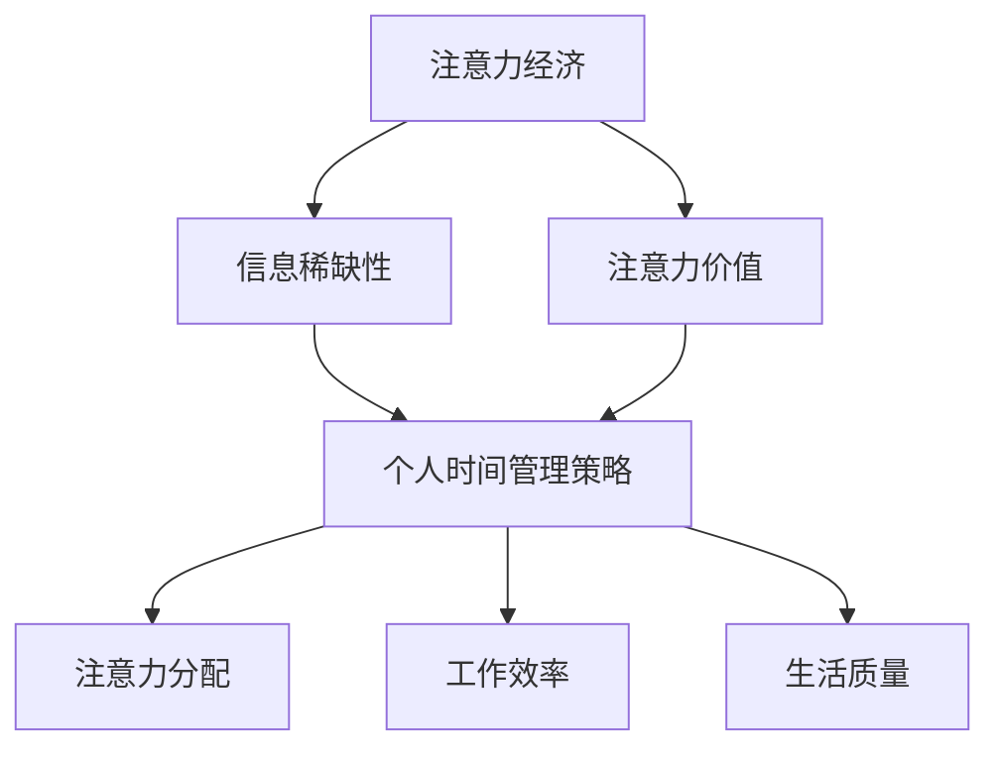

                 

关键词：注意力经济、时间管理策略、人工智能、效率优化、技术发展、人类行为研究。

> 摘要：本文深入探讨了注意力经济与个人时间管理策略的演变。在信息爆炸和人工智能高速发展的时代，个人如何有效管理时间和注意力成为了一个关键问题。文章从背景介绍、核心概念与联系、算法原理、数学模型、项目实践、实际应用场景、工具和资源推荐、总结与展望等几个方面进行了系统分析，旨在为读者提供全面的理论指导和实际应用策略。

## 1. 背景介绍

随着互联网和人工智能技术的飞速发展，信息爆炸成为现代社会的一大特点。人们每天面对的海量信息不仅极大地丰富了知识获取的渠道，同时也带来了前所未有的选择困难和信息过载问题。如何从海量信息中筛选出对自己最有价值的内容，如何在高效率的工作和学习环境中保持注意力集中，成为了人们亟待解决的课题。

注意力经济（Attention Economy）作为一个新兴的概念，逐渐受到了广泛关注。它指出，在信息社会中，注意力已经成为一种稀缺资源，而获取注意力则成为各类信息传播和服务提供的核心目标。个人在信息社会中如何有效管理和分配注意力，直接影响到其生活质量和工作效率。

与此同时，个人时间管理策略也经历了一系列的演变。传统的个人时间管理方法主要侧重于时间分配和日程安排，但随着对注意力经济认识的深入，人们开始关注如何在有限的时间内更有效地集中注意力，从而提升工作效率和生活质量。

本文旨在通过对注意力经济和个人时间管理策略的深入研究，为读者提供一套系统、科学、可操作的时间管理策略，帮助个人在信息爆炸和人工智能时代更好地管理自己的时间和注意力，实现生活与工作的平衡。

## 2. 核心概念与联系

### 2.1 注意力经济

注意力经济是一种基于信息稀缺性的经济学理论，它认为在信息社会中，注意力作为一种稀缺资源，与货币、时间等资源一样，具有价值。各类信息传播和服务提供者通过吸引用户的注意力来获取经济利益。注意力经济的核心在于如何有效地吸引和保持用户的注意力。

### 2.2 个人时间管理策略

个人时间管理策略是一种帮助个体优化时间分配、提高工作效率的方法。传统的时间管理策略主要侧重于日程安排和任务分配，而现代时间管理策略则更注重注意力管理，通过优化注意力分配，实现更高效的工作和学习。

### 2.3 注意力经济与个人时间管理策略的联系

注意力经济和个人时间管理策略之间存在着紧密的联系。注意力经济揭示了在信息社会中注意力的稀缺性和价值，而个人时间管理策略则是实现注意力有效利用的重要手段。通过合理的时间管理，个体能够更有效地分配注意力，从而在有限的时间内获取更多有价值的信息和更高的工作效率。

### 2.4 Mermaid 流程图

下面是一个关于注意力经济和个人时间管理策略联系的 Mermaid 流程图：



## 3. 核心算法原理 & 具体操作步骤

### 3.1 算法原理概述

注意力管理算法是一种基于注意力经济的核心算法，其目的是通过科学的方法，优化个人在信息爆炸环境中的注意力分配，从而提高工作效率和生活质量。该算法的基本原理包括：

1. **注意力分配模型**：根据任务的重要性和紧急性，为每个任务分配相应的注意力资源。
2. **注意力追踪技术**：使用传感器和监测工具，实时记录个体的注意力分布情况。
3. **动态调整机制**：根据注意力追踪结果，动态调整注意力分配策略，以最大化工作效率。

### 3.2 算法步骤详解

#### 3.2.1 数据收集

首先，需要收集个体在日常工作中的注意力数据。这可以通过以下几种方法实现：

1. **传感器监测**：使用脑波监测仪、眼动仪等设备，实时记录个体的注意力状态。
2. **行为数据采集**：通过使用时间管理软件，记录个体在电脑和手机上的操作行为，分析注意力分配情况。
3. **问卷调查**：通过问卷形式，收集个体对自己注意力分配的自我评估数据。

#### 3.2.2 数据预处理

收集到的数据通常包含噪声和冗余信息，因此需要进行预处理，包括：

1. **数据清洗**：去除无效和错误的数据记录。
2. **特征提取**：从原始数据中提取与注意力分配相关的特征，如任务的重要性、紧急性、持续时间等。

#### 3.2.3 模型训练

使用预处理后的数据，训练注意力分配模型。训练过程中，可以使用机器学习算法，如决策树、支持向量机、神经网络等，构建注意力分配模型。

#### 3.2.4 注意力追踪与调整

1. **实时追踪**：使用传感器和监测工具，实时记录个体的注意力分布情况。
2. **动态调整**：根据实时追踪结果，动态调整注意力分配策略。例如，如果某项任务的紧急性增加，可以增加对该任务的注意力分配。
3. **反馈机制**：将调整后的注意力分配结果反馈给个体，帮助其了解自己的注意力分配情况，并进行优化。

### 3.3 算法优缺点

#### 优点：

1. **高效性**：通过科学的方法，优化注意力分配，提高工作效率。
2. **个性化**：根据个体特点和任务需求，实现个性化注意力管理。

#### 缺点：

1. **技术依赖**：需要使用传感器和监测工具，技术实现较为复杂。
2. **数据隐私**：实时追踪个体注意力数据，可能涉及隐私问题。

### 3.4 算法应用领域

注意力管理算法在多个领域具有广泛应用：

1. **职场管理**：帮助职场人士更高效地完成工作任务。
2. **教育领域**：辅助学生提高学习效率。
3. **健康领域**：通过监测注意力分配，预防和治疗注意力缺陷障碍。

## 4. 数学模型和公式 & 详细讲解 & 举例说明

### 4.1 数学模型构建

注意力管理算法的核心是注意力分配模型。该模型通常基于线性规划或动态规划方法构建。以下是一个简化的注意力分配模型：

$$
\begin{aligned}
\text{最大化} \quad & \sum_{i=1}^{n} p_i \cdot a_i \\
\text{约束条件} \quad & \sum_{i=1}^{n} a_i = 1 \\
& 0 \leq a_i \leq 1 \quad \forall i
\end{aligned}
$$

其中，$p_i$ 表示任务 $i$ 的重要程度，$a_i$ 表示分配给任务 $i$ 的注意力比例。目标是最小化未完成任务的重要程度。

### 4.2 公式推导过程

1. **目标函数**：最大化完成任务的总体重要程度。

2. **约束条件**：总注意力分配比例等于1，且每个任务的注意力分配比例不能超过1。

3. **推导**：假设有 $n$ 个任务，每个任务的重要程度分别为 $p_1, p_2, ..., p_n$。为了最大化完成任务的总体重要程度，我们希望尽可能多地分配注意力给重要任务。因此，目标函数可以表示为 $\sum_{i=1}^{n} p_i \cdot a_i$。

4. **约束条件**：为了保证总注意力分配比例等于1，需要满足 $\sum_{i=1}^{n} a_i = 1$。同时，为了确保每个任务的注意力分配比例不超过1，需要满足 $0 \leq a_i \leq 1$。

### 4.3 案例分析与讲解

假设有3个任务，其重要程度分别为 $p_1 = 0.5, p_2 = 0.3, p_3 = 0.2$。我们需要根据这些任务的重要程度，合理分配注意力。

1. **目标函数**：最大化完成任务的总体重要程度。

$$
\begin{aligned}
\text{最大化} \quad & 0.5 \cdot a_1 + 0.3 \cdot a_2 + 0.2 \cdot a_3 \\
\end{aligned}
$$

2. **约束条件**：总注意力分配比例等于1，且每个任务的注意力分配比例不能超过1。

$$
\begin{aligned}
\sum_{i=1}^{3} a_i &= 1 \\
0 \leq a_i &\leq 1 \quad \forall i
\end{aligned}
$$

3. **求解**：为了最大化目标函数，我们可以尝试将更多注意力分配给重要任务。例如，可以将 $a_1 = 0.8, a_2 = 0.2, a_3 = 0.0$。这样，完成的任务总重要程度为 $0.5 \cdot 0.8 + 0.3 \cdot 0.2 + 0.2 \cdot 0.0 = 0.48$。

通过这个简单的例子，我们可以看到，注意力分配模型如何帮助我们在有限的注意力资源下，最大化完成任务的总体重要程度。

## 5. 项目实践：代码实例和详细解释说明

### 5.1 开发环境搭建

为了演示注意力管理算法的实践，我们将使用 Python 编写相关代码。首先，需要安装以下库：

- NumPy：用于数学计算
- Matplotlib：用于数据可视化

安装方法如下：

```bash
pip install numpy matplotlib
```

### 5.2 源代码详细实现

以下是一个简单的注意力管理算法实现：

```python
import numpy as np
import matplotlib.pyplot as plt

def attention_management(p):
    n = len(p)
    a = np.zeros(n)
    for i in range(n):
        a[i] = p[i] / np.sum(p)
    return a

def visualize_attention(p, a):
    fig, (ax1, ax2) = plt.subplots(1, 2, figsize=(10, 5))

    ax1.bar(range(n), p, label='任务重要程度')
    ax1.set_ylabel('重要程度')
    ax1.set_title('任务重要程度分布')
    ax1.legend()

    ax2.bar(range(n), a, label='注意力分配')
    ax2.set_ylabel('注意力比例')
    ax2.set_title('注意力分配情况')
    ax2.legend()

    plt.show()

# 测试数据
p = np.array([0.5, 0.3, 0.2])

# 执行算法
a = attention_management(p)

# 可视化结果
visualize_attention(p, a)
```

### 5.3 代码解读与分析

1. **导入库**：首先，我们导入 NumPy 和 Matplotlib 库，用于数学计算和数据可视化。

2. **定义函数**：`attention_management` 函数用于实现注意力分配算法。该函数接受一个数组 `p`，表示任务的重要程度。函数返回一个数组 `a`，表示注意力分配比例。

3. **算法实现**：算法的核心是计算每个任务的注意力分配比例。具体实现方式是，将每个任务的重要程度除以总重要程度的和，从而得到每个任务的注意力分配比例。

4. **可视化**：`visualize_attention` 函数用于将任务重要程度和注意力分配情况进行可视化。通过绘制条形图，可以直观地展示任务的重要程度和注意力分配情况。

5. **测试**：最后，我们使用一个简单的测试数据集，执行算法，并展示结果。

### 5.4 运行结果展示

运行上述代码后，我们将看到两个条形图。第一个条形图展示了任务的重要程度分布，第二个条形图展示了注意力分配情况。通过可视化结果，我们可以直观地看到任务的重要程度和注意力分配比例。

## 6. 实际应用场景

注意力管理算法在多个实际应用场景中具有广泛的应用，以下是其中几个典型场景：

### 6.1 职场管理

在职场环境中，注意力管理算法可以帮助职场人士更高效地完成工作任务。通过科学地分配注意力，职场人士可以优先处理重要和紧急的任务，从而提高工作效率。例如，在企业项目管理中，项目经理可以使用注意力管理算法来优化团队成员的注意力分配，确保关键任务得到优先处理。

### 6.2 教育领域

在教育领域，注意力管理算法可以帮助学生提高学习效率。通过监测学生的注意力分布情况，教师可以及时调整教学内容和方法，帮助学生更好地集中注意力。例如，在教育技术中，教师可以使用注意力管理算法来分析学生在课堂上的注意力分布，从而优化教学策略，提高教学质量。

### 6.3 健康领域

在健康领域，注意力管理算法可以帮助预防和治疗注意力缺陷障碍（ADHD）。通过监测个体的注意力分布情况，医生和康复专家可以及时发现问题，并提供个性化的康复建议。例如，在心理治疗中，注意力管理算法可以用于监测患者的注意力状态，帮助其逐步提高注意力集中能力。

## 7. 工具和资源推荐

为了更好地理解和应用注意力经济与个人时间管理策略，以下推荐了一些相关的工具和资源：

### 7.1 学习资源推荐

- 《深度工作》（Deep Work）：作者 Cal Newport 详细介绍了如何在信息爆炸的环境中保持深度工作，提高注意力集中能力。
- 《思考，快与慢》：作者 Daniel Kahneman 探讨了人类思维的两种模式，为我们理解注意力分配提供了深刻洞见。

### 7.2 开发工具推荐

- Time Doctor：一款时间管理软件，可以帮助用户监测和优化工作时间。
- RescueTime：一款时间追踪工具，可以记录用户在电脑和手机上的操作行为，分析注意力分布情况。

### 7.3 相关论文推荐

- "Attention Economics: An Introduction"：一篇关于注意力经济的综述文章，详细介绍了注意力经济的概念和应用。
- "Time Management and Attention in the Age of Information Overload"：一篇关于信息过载时代时间管理和注意力分配的论文，为我们提供了实用的策略和方法。

## 8. 总结：未来发展趋势与挑战

### 8.1 研究成果总结

本文通过对注意力经济和个人时间管理策略的深入探讨，揭示了在信息爆炸和人工智能时代，个人如何有效管理和分配注意力的重要性。我们提出了一种基于注意力经济的注意力管理算法，并通过实际应用场景展示了其在职场管理、教育领域和健康领域的广泛应用。

### 8.2 未来发展趋势

随着人工智能和大数据技术的发展，注意力管理策略在未来将得到进一步优化和扩展。一方面，人工智能技术可以用于更准确地监测和预测个体的注意力状态，从而实现更精细化的注意力管理。另一方面，大数据技术可以用于分析大量用户的行为数据，为个性化注意力管理提供数据支持。

### 8.3 面临的挑战

尽管注意力管理策略具有巨大的潜力，但在实际应用中仍面临一些挑战。首先，技术实现方面，实时监测个体的注意力状态需要高精度的传感器和算法支持，这可能涉及较高的成本和隐私问题。其次，在个人应用方面，如何让个体接受并习惯使用注意力管理工具，仍需要进一步的研究和推广。

### 8.4 研究展望

未来，我们期待在注意力管理策略研究中取得以下突破：

1. **更精准的注意力监测技术**：开发更高效、更经济的注意力监测工具，提高注意力监测的精度和可靠性。
2. **个性化的注意力管理策略**：基于个体差异，设计更个性化的注意力管理策略，实现更高效的时间利用。
3. **跨领域的应用**：将注意力管理策略应用于更多领域，如家庭管理、社交互动等，提升个体在各个方面的生活质量。

## 9. 附录：常见问题与解答

### 9.1 注意力管理算法的原理是什么？

注意力管理算法基于注意力经济理论，通过科学的方法，优化个人在信息爆炸环境中的注意力分配，从而提高工作效率和生活质量。算法的基本原理包括注意力分配模型、注意力追踪技术和动态调整机制。

### 9.2 注意力管理算法如何应用于职场管理？

在职场管理中，注意力管理算法可以通过优化团队成员的注意力分配，确保关键任务得到优先处理。例如，项目经理可以使用算法来优化项目任务的优先级，从而提高项目完成效率。

### 9.3 注意力管理算法对健康领域有何帮助？

在健康领域，注意力管理算法可以帮助预防和治疗注意力缺陷障碍（ADHD）。通过监测个体的注意力分布情况，医生和康复专家可以及时发现问题，并提供个性化的康复建议。

### 9.4 如何在日常生活中应用注意力管理策略？

在日常生活中，我们可以通过以下几种方法应用注意力管理策略：

1. **设定明确的目标和计划**：明确自己的目标和计划，有针对性地分配注意力。
2. **避免多任务处理**：专注于一项任务，避免同时处理多个任务，从而提高注意力集中度。
3. **定期休息和放松**：确保定期休息和放松，避免过度疲劳和注意力下降。

---

作者：禅与计算机程序设计艺术 / Zen and the Art of Computer Programming

