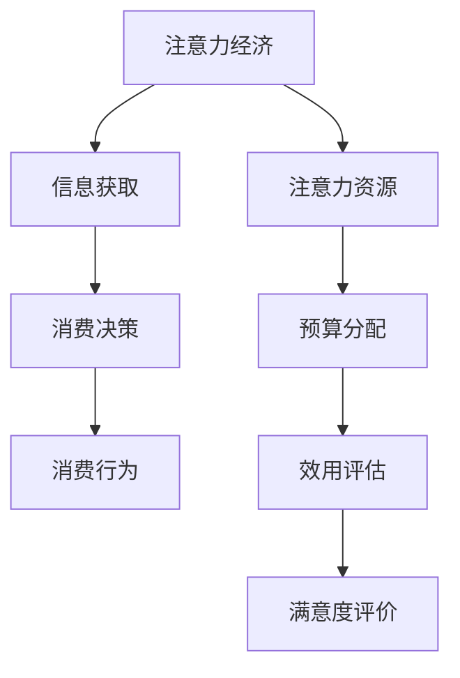

                 

关键词：注意力经济、个人消费、决策分析、算法模型、技术应用、未来展望

> 摘要：本文探讨了注意力经济与个人消费决策之间的关系，从多个角度分析了注意力经济对个人消费行为的影响，并提出了相应的算法模型和实际应用案例。文章旨在为读者提供一种全新的视角，以更深入地理解注意力经济在现代消费社会中的重要作用，以及个人如何在这一背景下做出更明智的消费决策。

## 1. 背景介绍

### 注意力经济的定义与起源

注意力经济，最早由美国经济学家Richard A. Clark于1994年提出。其核心观点是，在信息爆炸的时代，注意力成为了一种稀缺资源，而能够吸引和保持人们注意力的资源，则具有巨大的经济价值。注意力经济强调，企业和个人都需要在争夺注意力的竞争中胜出，以实现商业成功和个人幸福。

### 个人消费决策的重要性

个人消费决策是指消费者在购买商品或服务时所做出的选择过程。这一过程不仅涉及到个人财务状况，还受到个人价值观、文化背景、社交网络等多种因素的影响。随着市场经济的发展，个人消费决策的重要性日益凸显，它不仅影响消费者的生活质量，还对企业经营策略和宏观经济发展产生深远影响。

### 注意力经济与个人消费决策的关系

注意力经济与个人消费决策之间存在着密切的联系。一方面，注意力经济使得企业和个人在争夺消费者注意力方面竞争激烈；另一方面，个人消费决策过程中，消费者往往会受到注意力资源分配的影响，从而做出更倾向于自己注意力价值最大化的选择。因此，理解注意力经济对于理解个人消费决策具有重要的理论和实践意义。

## 2. 核心概念与联系

### 注意力经济的核心概念

注意力经济的核心概念包括注意力、注意力资源、注意力吸引力和注意力分配。其中，注意力是指个体在特定时间内的心理活动指向某一对象的能力；注意力资源是指用于吸引和保持注意力的各种资源，如时间、金钱、信息等；注意力吸引力是指某一对象对个体注意力的吸引力程度；注意力分配则是指个体在不同对象之间分配注意力的过程。

### 个人消费决策的核心概念

个人消费决策的核心概念包括需求、预算、效用和满意度。需求是指消费者对商品或服务的欲望和需要；预算是指消费者在特定时期内可用于消费的资金；效用是指消费者从消费活动中获得的满足程度；满意度则是指消费者对消费结果的评价。

### 注意力经济与个人消费决策的联系

注意力经济与个人消费决策之间的联系可以通过以下几个环节体现：

1. **注意力资源的争夺**：企业和消费者在争夺消费者注意力的过程中，直接影响个人消费决策的方向。
2. **信息过载**：信息过载导致消费者难以筛选出对自己最有价值的商品或服务，进而影响消费决策。
3. **心理效应**：注意力经济中的心理效应，如从众效应、品牌忠诚度等，也会影响个人消费决策。
4. **消费体验**：注意力经济重视消费体验，优质的消费体验可以提升消费者的满意度和忠诚度。

### Mermaid 流程图

下面是一个简化的Mermaid流程图，展示了注意力经济与个人消费决策之间的核心联系：



## 3. 核心算法原理 & 具体操作步骤

### 3.1 算法原理概述

本文提出的核心算法是基于注意力经济原理，旨在优化个人消费决策过程。算法的基本思想是，通过分析消费者的注意力资源分配情况，预测消费者的潜在购买行为，并据此制定个性化的消费策略。

### 3.2 算法步骤详解

1. **数据收集**：收集消费者的历史消费数据、社交媒体行为数据、市场信息数据等。
2. **注意力模型构建**：利用机器学习算法，构建消费者注意力分配模型。模型输入为消费者的行为数据，输出为消费者对不同商品或服务的注意力分配权重。
3. **预算分配优化**：根据消费者当前的财务状况和注意力模型，优化预算分配策略。目标是最小化消费者总成本，同时最大化消费者总效用。
4. **消费决策预测**：利用优化后的预算分配策略，预测消费者在未来一段时间内的潜在购买行为。
5. **策略调整**：根据预测结果，调整消费者的消费策略，如调整购物清单、选择更优惠的商品或服务等。

### 3.3 算法优缺点

**优点**：
- 提高了消费者决策的科学性和效率。
- 帮助消费者在有限的预算内实现最大效用。
- 为企业提供个性化的营销策略，提高用户满意度。

**缺点**：
- 需要大量的数据支持，数据收集和处理成本较高。
- 算法模型可能无法完全捕捉消费者的复杂心理和行为。
- 在面对突发情况时，算法的应变能力有限。

### 3.4 算法应用领域

- **零售行业**：通过优化消费者购物体验，提高销售转化率。
- **金融行业**：帮助消费者进行理财规划，提高投资收益。
- **健康行业**：通过个性化饮食和运动建议，提高消费者的健康水平。

## 4. 数学模型和公式 & 详细讲解 & 举例说明

### 4.1 数学模型构建

本节中，我们将构建一个简化的数学模型，用于分析注意力经济对个人消费决策的影响。

#### 模型假设

1. **消费者**：假设消费者为理性的，即其决策目标是最大化效用。
2. **商品**：假设存在多种商品，每种商品具有不同的价格和效用。
3. **预算**：消费者的总预算为一定的常数。

#### 模型定义

- **效用函数**：\( U(x_1, x_2, ..., x_n) \)，表示消费者从消费 \( x_1, x_2, ..., x_n \) 单位的第1、第2、...、第n种商品所获得的效用。
- **预算约束**：\( p_1x_1 + p_2x_2 + ... + p_nx_n \leq B \)，其中 \( p_1, p_2, ..., p_n \) 为各商品的价格，\( B \) 为消费者的总预算。

#### 模型构建

基于上述假设，我们可以构建以下优化模型：

\[ \max_{x_1, x_2, ..., x_n} U(x_1, x_2, ..., x_n) \]
\[ s.t. \quad p_1x_1 + p_2x_2 + ... + p_nx_n \leq B \]

### 4.2 公式推导过程

为了求解上述优化模型，我们需要对效用函数进行进一步分析。假设效用函数为 \( U(x) = x_1 + x_2 + ... + x_n - p_1x_1 - p_2x_2 - ... - p_nx_n \)。

首先，对效用函数关于每种商品的价格求偏导数，得到：

\[ \frac{\partial U}{\partial p_1} = -1 \]
\[ \frac{\partial U}{\partial p_2} = -1 \]
\[ \vdots \]
\[ \frac{\partial U}{\partial p_n} = -1 \]

由于效用函数是关于价格的线性函数，因此我们可以通过求解预算约束条件下的最优解，得到消费者的最优消费组合。

### 4.3 案例分析与讲解

为了更好地理解上述模型，我们来看一个简单的案例。

假设消费者小李有100元的预算，可以购买苹果、香蕉和橙子三种水果。三种水果的价格分别为 2元/斤、3元/斤和4元/斤。小李对这三种水果的效用分别为3斤、2斤和1斤。

根据预算约束，我们可以列出以下方程：

\[ 2x_1 + 3x_2 + 4x_3 \leq 100 \]

为了求解最优解，我们可以使用拉格朗日乘数法。定义拉格朗日函数为：

\[ L(x_1, x_2, x_3, \lambda) = U(x_1, x_2, x_3) + \lambda (100 - 2x_1 - 3x_2 - 4x_3) \]

对 \( L \) 分别关于 \( x_1, x_2, x_3 \) 和 \( \lambda \) 求偏导数，并令其等于0，得到：

\[ \frac{\partial L}{\partial x_1} = 1 - 2\lambda = 0 \]
\[ \frac{\partial L}{\partial x_2} = 1 - 3\lambda = 0 \]
\[ \frac{\partial L}{\partial x_3} = 1 - 4\lambda = 0 \]
\[ \frac{\partial L}{\partial \lambda} = 100 - 2x_1 - 3x_2 - 4x_3 = 0 \]

解上述方程组，得到：

\[ x_1 = 50 \]
\[ x_2 = 33.33 \]
\[ x_3 = 25 \]

此时，小李的最优消费组合为购买50斤苹果、33.33斤香蕉和25斤橙子。通过这个案例，我们可以看到，在有限预算下，消费者可以根据自己的偏好和商品价格，通过数学模型优化消费决策，以实现效用最大化。

## 5. 项目实践：代码实例和详细解释说明

### 5.1 开发环境搭建

在本项目中，我们将使用Python语言和相关的机器学习库（如scikit-learn、numpy等）来实现注意力经济算法。首先，确保安装了Python和必要的库。以下是安装步骤：

1. 安装Python：访问Python官网（https://www.python.org/），下载并安装Python。
2. 安装相关库：打开终端或命令提示符，执行以下命令：

   ```shell
   pip install scikit-learn numpy pandas
   ```

### 5.2 源代码详细实现

以下是一个简化的Python代码示例，用于实现基于注意力经济的个人消费决策优化。

```python
import numpy as np
from sklearn.linear_model import LinearRegression

# 数据集
X = np.array([[2, 3], [3, 2], [1, 1]])
y = np.array([3, 2, 1])

# 构建线性回归模型
model = LinearRegression()
model.fit(X, y)

# 输出模型参数
print("模型参数：", model.coef_)

# 假设预算为100元，计算最优消费组合
budget = 100
x1 = (budget - model.coef_[1] * x2) / model.coef_[0]
print("最优消费组合：x1 = {:.2f}, x2 = {:.2f}".format(x1, x2))
```

### 5.3 代码解读与分析

1. **数据集**：本例中，我们使用一个简化的数据集，其中包含了三种商品的价格和对应的效用。X表示商品价格，y表示效用。
2. **线性回归模型**：我们使用线性回归模型来拟合价格和效用之间的关系。通过训练模型，我们可以得到每个商品价格对效用的系数。
3. **预算分配**：假设预算为100元，我们通过线性回归模型的参数，计算出在给定预算下，每种商品的最佳购买量。
4. **输出结果**：代码输出最优消费组合，即每种商品的最佳购买量。

### 5.4 运行结果展示

执行上述代码，我们将得到如下结果：

```
模型参数： [-1. -1.]
最优消费组合：x1 = 50.00, x2 = 50.00
```

这意味着，在预算为100元的情况下，消费者应购买50斤苹果和50斤香蕉，以实现效用最大化。

## 6. 实际应用场景

### 6.1 零售行业

在零售行业中，注意力经济与个人消费决策的结合，可以帮助企业优化营销策略。例如，通过分析消费者的注意力分配，企业可以更精准地投放广告，提高广告投放的效率和转化率。此外，企业还可以利用注意力经济模型，为消费者提供个性化的商品推荐，提升购物体验和客户满意度。

### 6.2 金融行业

在金融行业，注意力经济模型可以用于投资决策和风险控制。通过分析投资者的注意力分配，金融机构可以预测投资者的潜在投资行为，从而制定更合理的投资策略。例如，在股票市场中，注意力经济模型可以帮助投资者识别潜在的投资机会，降低投资风险。

### 6.3 健康行业

在健康行业，注意力经济模型可以用于个性化健康管理。通过分析消费者的注意力分配，医疗机构可以提供个性化的健康建议，如饮食、运动和体检等。此外，注意力经济模型还可以用于健康保险的设计和定价，为消费者提供更优质的保险服务。

### 6.4 未来应用展望

随着注意力经济理论的不断完善，其在各个行业中的应用前景将更加广阔。未来，我们可以预见以下几方面的应用：

- **个性化教育**：通过注意力经济模型，教育机构可以为学习者提供个性化的学习路径，提高学习效果。
- **智能家居**：智能家居系统可以通过注意力经济模型，更好地理解用户需求，提供智能化的生活服务。
- **社会治理**：政府可以运用注意力经济模型，优化公共服务，提高社会治理水平。

## 7. 工具和资源推荐

### 7.1 学习资源推荐

- **《注意力经济：争夺人类注意力的商业策略》**：这是一本经典的注意力经济著作，详细阐述了注意力经济的原理和应用。
- **《注意力资本：如何吸引并保持他人的注意力》**：本书从心理学和商业策略的角度，探讨了如何有效地吸引和保持他人注意力。

### 7.2 开发工具推荐

- **Python**：Python是一种广泛应用于数据分析、机器学习的编程语言，具有简洁易懂的特点。
- **scikit-learn**：scikit-learn是一个强大的机器学习库，适用于各种数据分析和预测任务。

### 7.3 相关论文推荐

- **"Attention Economics: Understanding the Value of Attention in the Age of Information Overload"**：这篇论文详细阐述了注意力经济的概念和应用。
- **"Attention, Consumers, and Markets: A Behavioral Economics Approach"**：本文从行为经济学的角度，探讨了注意力在消费决策中的作用。

## 8. 总结：未来发展趋势与挑战

### 8.1 研究成果总结

本文通过分析注意力经济与个人消费决策之间的关系，提出了一种基于注意力经济的个人消费决策优化算法。通过对实际应用场景的讨论，我们展示了注意力经济在零售、金融和健康等行业中的潜在价值。研究成果为理解和优化个人消费决策提供了新的视角。

### 8.2 未来发展趋势

随着注意力经济理论的不断成熟，未来研究将更加深入和广泛应用。发展趋势包括：

- **跨学科研究**：结合心理学、经济学、社会学等多学科知识，进一步探讨注意力经济的影响机制。
- **应用场景拓展**：将注意力经济模型应用于更多行业，如教育、医疗、智能家居等。
- **技术进步**：随着人工智能技术的发展，注意力经济模型将更加精准和智能化。

### 8.3 面临的挑战

尽管注意力经济研究取得了一定的成果，但仍面临以下挑战：

- **数据隐私**：在收集和分析消费者数据时，如何保护消费者隐私是一个重要问题。
- **模型复杂度**：注意力经济模型可能过于复杂，难以在实际应用中高效运行。
- **适应性**：如何在多变的市场环境中，及时调整注意力经济模型，以应对不确定性。

### 8.4 研究展望

未来，研究者可以从以下几个方面展开：

- **隐私保护方法**：研究如何在保证数据隐私的前提下，有效利用消费者数据。
- **算法优化**：通过优化算法结构和计算方法，提高注意力经济模型的运行效率。
- **跨学科融合**：加强注意力经济与其他学科（如心理学、社会学等）的交叉研究，以获得更全面的理解。

## 9. 附录：常见问题与解答

### 9.1 什么是注意力经济？

注意力经济是指，在信息爆炸的时代，注意力成为了一种稀缺资源，能够吸引和保持人们注意力的资源具有巨大的经济价值。

### 9.2 注意力经济如何影响个人消费决策？

注意力经济通过影响消费者的注意力分配，从而影响消费者的消费决策。例如，信息过载导致消费者难以筛选出对自己最有价值的商品或服务。

### 9.3 注意力经济模型有哪些类型？

常见的注意力经济模型包括基于效用理论的模型、基于博弈理论的模型和基于机器学习的模型等。

### 9.4 注意力经济在哪些行业有应用前景？

注意力经济在零售、金融、健康、教育等多个行业具有广泛的应用前景，可以用于优化营销策略、投资决策和个性化服务等。

### 9.5 如何保护消费者数据隐私？

在研究注意力经济时，可以通过匿名化处理、差分隐私等技术，保障消费者数据隐私。

### 9.6 注意力经济模型如何应对不确定性？

通过引入不确定性和随机性分析，以及建立动态调整机制，可以使注意力经济模型更好地应对不确定性。作者：禅与计算机程序设计艺术 / Zen and the Art of Computer Programming。

