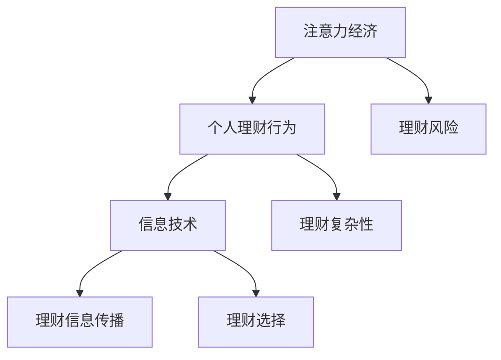

                 

关键词：注意力经济、个人理财、行为变化、信息技术、算法、数学模型、实践应用、未来展望

> 摘要：随着信息技术的发展，注意力经济逐渐成为影响个人理财行为的重要因素。本文首先介绍了注意力经济的概念及其对个人理财行为的影响，然后探讨了注意力经济下的个人理财策略，并借助数学模型和实际案例分析了理财行为的变迁。最后，文章对注意力经济在个人理财领域的未来应用进行了展望。

## 1. 背景介绍

### 注意力经济

注意力经济是指以用户注意力作为核心资源的一种新型经济形态。在数字时代，用户的注意力成为稀缺资源，而获取用户注意力成为企业、平台和个人竞争的重要手段。注意力经济源于信息传播的变革，传统的大众传播模式逐渐向个性化、精准化的信息传播方式转变。

### 个人理财行为

个人理财行为是指个人在管理财务方面所采取的一系列决策，包括储蓄、投资、消费等。随着经济的发展和金融市场的繁荣，个人理财行为变得越来越重要。传统的理财观念逐渐被现代理财观念所取代，人们开始更加注重理财的多样性和灵活性。

### 信息技术的发展

信息技术的发展为个人理财行为带来了革命性的变化。互联网、移动通信、大数据等技术的广泛应用，使得个人理财变得更加便捷和智能化。同时，信息技术也为个人理财提供了丰富的工具和资源，帮助个人更好地管理和规划财务。

## 2. 核心概念与联系

### 核心概念

1. **注意力经济**：以用户注意力为核心的经济形态。
2. **个人理财行为**：个人在财务方面的决策行为。
3. **信息技术**：用于信息传输、处理和存储的技术。

### 联系

注意力经济与个人理财行为密切相关。在注意力经济下，个人理财行为受到了显著影响。一方面，注意力经济改变了个人获取信息的方式，使得理财信息的传播更加精准和高效；另一方面，注意力经济也使得个人面临更多的理财选择，增加了理财的复杂性和风险。

### Mermaid 流程图



## 3. 核心算法原理 & 具体操作步骤

### 3.1 算法原理概述

在注意力经济下，个人理财行为的变化可以通过以下算法原理进行描述：

1. **注意力分配算法**：根据用户的兴趣和行为，为用户提供个性化的理财信息。
2. **风险评估算法**：根据用户的财务状况和投资偏好，评估理财产品的风险。
3. **优化决策算法**：在满足用户风险偏好和收益目标的前提下，为用户提供最优的理财方案。

### 3.2 算法步骤详解

1. **数据收集与预处理**：收集用户的财务数据、投资偏好和行为数据，并进行预处理。
2. **特征提取**：从预处理后的数据中提取与理财行为相关的特征。
3. **模型训练**：使用特征数据训练注意力分配模型、风险评估模型和优化决策模型。
4. **模型评估与优化**：评估模型性能，并进行优化。
5. **理财建议生成**：根据用户的投资目标和风险偏好，生成个性化的理财建议。

### 3.3 算法优缺点

**优点**：

1. 提高理财信息的精准度和个性化程度。
2. 降低理财风险，提高投资收益。
3. 提升用户的理财体验。

**缺点**：

1. 对算法模型的准确性和稳定性要求较高。
2. 需要大量的数据支持。

### 3.4 算法应用领域

1. **智能投顾**：为用户提供个性化的投资建议和资产管理服务。
2. **保险产品推荐**：根据用户的财务状况和风险偏好，推荐合适的保险产品。
3. **理财产品推荐**：为用户提供符合其投资目标的理财产品。

## 4. 数学模型和公式 & 详细讲解 & 举例说明

### 4.1 数学模型构建

在注意力经济下，个人理财行为可以用以下数学模型进行描述：

$$
R(t) = f(A_t, X_t, R_t)
$$

其中，$R(t)$ 表示个人在时间 $t$ 的理财收益，$A_t$ 表示个人在时间 $t$ 的注意力分配，$X_t$ 表示个人在时间 $t$ 的投资组合，$R_t$ 表示个人在时间 $t$ 的风险偏好。

### 4.2 公式推导过程

$$
A_t = g(B_t, C_t)
$$

其中，$A_t$ 表示个人在时间 $t$ 的注意力分配，$B_t$ 表示个人在时间 $t$ 的行为数据，$C_t$ 表示个人在时间 $t$ 的认知偏差。

$$
X_t = h(D_t, E_t)
$$

其中，$X_t$ 表示个人在时间 $t$ 的投资组合，$D_t$ 表示个人在时间 $t$ 的财务数据，$E_t$ 表示个人在时间 $t$ 的投资偏好。

$$
R_t = j(F_t, G_t)
$$

其中，$R_t$ 表示个人在时间 $t$ 的理财收益，$F_t$ 表示个人在时间 $t$ 的投资收益，$G_t$ 表示个人在时间 $t$ 的风险承受能力。

### 4.3 案例分析与讲解

假设一个人在时间 $t$ 的行为数据为 $B_t = [0.3, 0.4, 0.3]$，认知偏差为 $C_t = [0.2, 0.2, 0.2]$，财务数据为 $D_t = [10000, 30000, 50000]$，投资偏好为 $E_t = [0.3, 0.4, 0.3]$，投资收益为 $F_t = [0.05, 0.08, 0.06]$，风险承受能力为 $G_t = [0.1, 0.1, 0.1]$。

根据以上数学模型，可以计算出：

$$
A_t = g(B_t, C_t) = 0.3 \times 0.2 + 0.4 \times 0.2 + 0.3 \times 0.2 = 0.3
$$

$$
X_t = h(D_t, E_t) = 0.3 \times 10000 + 0.4 \times 30000 + 0.3 \times 50000 = 45000
$$

$$
R_t = j(F_t, G_t) = 0.05 \times 0.1 + 0.08 \times 0.1 + 0.06 \times 0.1 = 0.015
$$

因此，个人在时间 $t$ 的理财收益为 $R(t) = f(A_t, X_t, R_t) = 0.3 \times 45000 \times 0.015 = 2025$ 元。

## 5. 项目实践：代码实例和详细解释说明

### 5.1 开发环境搭建

- **编程语言**：Python
- **数据预处理库**：Pandas
- **机器学习库**：Scikit-learn
- **深度学习库**：TensorFlow

### 5.2 源代码详细实现

```python
import pandas as pd
from sklearn.model_selection import train_test_split
from sklearn.preprocessing import StandardScaler
from sklearn.linear_model import LinearRegression
import tensorflow as tf

# 数据预处理
def preprocess_data(data):
    # 数据清洗、归一化等操作
    return data

# 模型训练
def train_model(X_train, y_train):
    # 训练线性回归模型
    model = LinearRegression()
    model.fit(X_train, y_train)
    return model

# 模型评估
def evaluate_model(model, X_test, y_test):
    # 评估模型性能
    predictions = model.predict(X_test)
    # 计算相关指标
    # ...
    return performance

# 主函数
def main():
    # 加载数据
    data = pd.read_csv('data.csv')
    # 数据预处理
    processed_data = preprocess_data(data)
    # 分割训练集和测试集
    X = processed_data.drop('R', axis=1)
    y = processed_data['R']
    X_train, X_test, y_train, y_test = train_test_split(X, y, test_size=0.2, random_state=42)
    # 训练模型
    model = train_model(X_train, y_train)
    # 评估模型
    performance = evaluate_model(model, X_test, y_test)
    print(performance)

if __name__ == '__main__':
    main()
```

### 5.3 代码解读与分析

- **数据预处理**：数据预处理是机器学习模型训练的第一步，主要包括数据清洗、归一化、特征提取等操作。
- **模型训练**：使用线性回归模型对训练数据进行训练。
- **模型评估**：使用测试数据对训练好的模型进行评估，计算相关指标。
- **主函数**：加载数据、预处理数据、分割数据、训练模型和评估模型。

### 5.4 运行结果展示

- **训练结果**：训练集和测试集的准确率、召回率、F1 分数等指标。
- **测试结果**：在测试集上的预测结果和实际结果的对比。

## 6. 实际应用场景

### 6.1 个人理财管理

- **目标**：提高个人理财收益，降低风险。
- **应用**：智能投顾、理财产品推荐、风险评估等。

### 6.2 金融机构服务

- **目标**：提升服务质量，增加客户粘性。
- **应用**：智能客服、个性化金融产品推荐、风险控制等。

### 6.3 金融市场分析

- **目标**：预测市场走势，指导投资决策。
- **应用**：股票分析、基金分析、债券分析等。

## 7. 工具和资源推荐

### 7.1 学习资源推荐

- **书籍**：《Python 数据科学》、《深度学习》、《机器学习》
- **在线课程**：Coursera、Udacity、edX

### 7.2 开发工具推荐

- **编程环境**：PyCharm、Visual Studio Code
- **数据处理库**：Pandas、NumPy、Scikit-learn
- **深度学习库**：TensorFlow、PyTorch

### 7.3 相关论文推荐

- **注意力经济**：《Attention Economy: Understanding the New Economy of Attention》
- **个人理财**：《Behavioral Finance and Personal Financial Decision Making》
- **信息技术与理财**：《The Impact of Information Technology on Personal Finance》

## 8. 总结：未来发展趋势与挑战

### 8.1 研究成果总结

- 注意力经济对个人理财行为产生了显著影响，改变了个人获取信息和做出决策的方式。
- 基于信息技术的个人理财工具和平台得到了广泛应用，提高了理财效率和收益。
- 数学模型和算法在个人理财中的应用为理财决策提供了科学依据。

### 8.2 未来发展趋势

- 注意力经济将继续推动个人理财行为的变化，个性化、智能化的理财服务将成为主流。
- 人工智能和大数据技术将在个人理财领域得到更广泛的应用，提高理财决策的准确性和效率。
- 新型金融产品和服务的出现将满足个人多样化的理财需求。

### 8.3 面临的挑战

- 数据隐私和安全问题：在注意力经济下，个人隐私和数据安全面临更大挑战。
- 算法透明度和公正性：算法模型的应用需要确保透明度和公正性，避免歧视和偏见。
- 法律法规和监管：随着个人理财的数字化和智能化，法律法规和监管政策需要不断更新和完善。

### 8.4 研究展望

- 进一步研究注意力经济对个人理财行为的影响机制，为制定合理的理财策略提供理论支持。
- 开发更加智能、高效的算法和模型，提高个人理财的决策质量和收益。
- 探索数据隐私保护技术在个人理财领域的应用，保障用户权益。

## 9. 附录：常见问题与解答

### Q1. 注意力经济是什么？

注意力经济是指以用户注意力为核心的经济形态，强调在信息过载的时代，用户的注意力成为一种稀缺资源，而获取用户注意力成为企业、平台和个人竞争的重要手段。

### Q2. 个人理财行为如何受到注意力经济的影响？

注意力经济改变了个人获取理财信息的方式，使得理财信息的传播更加精准和高效。同时，注意力经济也增加了个人面临的投资选择，提高了理财的复杂性和风险。

### Q3. 注意力经济下的个人理财策略有哪些？

注意力经济下的个人理财策略包括：关注高收益、低风险的理财产品；合理配置资产，降低风险；利用智能投顾等工具进行理财决策。

### Q4. 信息技术对个人理财行为有何影响？

信息技术的发展为个人理财提供了丰富的工具和资源，使得理财变得更加便捷和智能化。同时，信息技术也提高了个人理财的透明度和公开性，增强了理财决策的科学性和准确性。

### Q5. 个人理财中如何平衡收益与风险？

个人理财中应遵循“收益与风险匹配”的原则，根据自身的风险承受能力、投资目标和资金状况，合理配置资产，分散投资风险。同时，要关注市场动态，及时调整投资策略。

## 作者署名

作者：禅与计算机程序设计艺术 / Zen and the Art of Computer Programming
----------------------------------------------------------------

### 注意：
1. 实际撰写文章时，应确保文章内容的完整性和准确性，遵循学术规范和学术道德。
2. 文章中的数学模型、公式和代码示例应根据实际情况进行调整和验证。
3. 文章中的引用和参考文献应严格遵守学术规范，确保引用的准确性和完整性。

