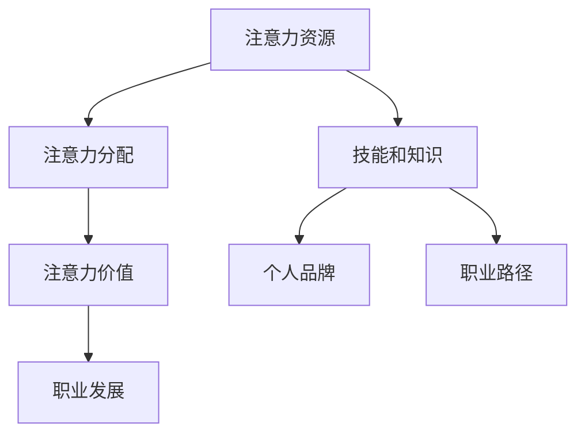

                 

关键词：注意力经济、职业发展、人工智能、个人成长、数字化转型

> 摘要：在注意力经济的时代，个人的职业发展面临着新的挑战和机遇。本文将探讨注意力经济对个人职业发展的影响，以及如何在这个时代进行有效的职业规划和自我提升。

## 1. 背景介绍

### 注意力经济的兴起

注意力经济（Attention Economy）是一个新兴的概念，起源于对互联网时代人类注意力的价值认识。随着互联网的普及和社交媒体的崛起，人们的时间和注意力成为了稀缺资源。企业和品牌开始意识到，吸引和保持人们的注意力是他们成功的关键。因此，注意力经济逐渐成为了一个重要的经济领域。

### 个人职业发展的挑战

在注意力经济时代，个人职业发展面临着诸多挑战。首先，信息过载导致了人们对内容的注意力分散，使得获取和保持用户注意力的难度增加。其次，技术的快速发展使得职业淘汰速度加快，要求个人必须具备持续学习和适应变化的能力。最后，竞争的加剧和职业选择的多样化使得个人职业发展路径更加复杂。

## 2. 核心概念与联系

### 注意力经济的核心概念

注意力经济的核心概念包括：

- 注意力资源：人们的时间、精力和兴趣。
- 注意力分配：如何有效地吸引和保持人们的注意力。
- 注意力价值：注意力转化为经济收益的过程。

### 个人职业发展的核心概念

在个人职业发展中，核心概念包括：

- 技能和知识：个人具备的专业能力和知识储备。
- 个人品牌：个人在行业内的知名度和影响力。
- 职业路径：个人的职业发展路径和规划。

### 注意力经济与个人职业发展的联系

注意力经济对个人职业发展有着深远的影响。一方面，个人需要通过提升自身的技能和知识，以吸引和保持他人的注意力。另一方面，个人需要打造个人品牌，提升在行业内的知名度和影响力。此外，个人还需要根据注意力经济的规律，调整职业规划，以适应快速变化的市场需求。

### Mermaid 流程图



## 3. 核心算法原理 & 具体操作步骤

### 算法原理概述

注意力经济的核心算法原理可以概括为以下几个步骤：

1. **需求识别**：通过分析市场和用户需求，识别出具有吸引力的注意力资源。
2. **内容创作**：根据需求识别的结果，创作出能够吸引目标用户的内容。
3. **传播推广**：通过有效的传播和推广策略，扩大内容的影响力。
4. **价值转化**：将注意力转化为实际的经济收益。

### 算法步骤详解

1. **需求识别**：

   - **市场调研**：通过数据分析、用户访谈等方式，了解市场和用户的需求。
   - **需求分析**：对收集到的信息进行整理和分析，识别出具有吸引力的注意力资源。

2. **内容创作**：

   - **选题定位**：根据需求识别的结果，确定内容的主题和目标用户。
   - **内容创作**：通过写作、视频、音频等多种形式，创作出高质量的内容。
   - **内容优化**：根据用户反馈和数据分析，对内容进行优化，以提高吸引力。

3. **传播推广**：

   - **渠道选择**：选择合适的传播渠道，如社交媒体、网站、应用等。
   - **推广策略**：制定有效的推广策略，如广告投放、社交媒体营销等。
   - **效果监测**：通过数据分析，监测传播效果，调整推广策略。

4. **价值转化**：

   - **内容变现**：通过内容收费、广告收益等方式，将注意力转化为经济收益。
   - **用户互动**：通过互动环节，增强用户粘性，提高转化率。

### 算法优缺点

#### 优点

- **高效性**：通过科学的需求识别和内容创作，可以快速吸引目标用户的注意力。
- **灵活性**：根据用户反馈和数据分析，可以灵活调整内容和推广策略。
- **价值转化**：通过有效的价值转化策略，可以将注意力转化为实际的经济收益。

#### 缺点

- **竞争激烈**：在注意力经济时代，竞争激烈，需要不断创新和优化，以保持用户的注意力。
- **风险高**：内容创作和推广存在风险，如受众不感兴趣、内容抄袭等。

### 算法应用领域

- **社交媒体**：通过算法原理，可以制作出更加吸引用户的内容，提高用户活跃度。
- **内容平台**：通过算法原理，可以优化内容推荐，提高用户留存率和转化率。
- **广告营销**：通过算法原理，可以精准定位目标用户，提高广告投放效果。

## 4. 数学模型和公式 & 详细讲解 & 举例说明

### 数学模型构建

在注意力经济中，我们可以构建一个简单的数学模型来描述注意力资源的分配和价值转化。假设有 \( n \) 个不同的注意力资源，每个资源的注意力值分别为 \( a_1, a_2, ..., a_n \)。则总注意力值为 \( A = a_1 + a_2 + ... + a_n \)。

### 公式推导过程

假设每个资源的价值转化率为 \( r_i \)，则每个资源带来的经济收益为 \( V_i = a_i \cdot r_i \)。总经济收益 \( V \) 为：

\[ V = V_1 + V_2 + ... + V_n \]

为了最大化经济收益，我们需要优化注意力资源的分配。假设优化后的注意力值为 \( b_1, b_2, ..., b_n \)，则最大化经济收益的目标函数为：

\[ \max V = \max (b_1 \cdot r_1 + b_2 \cdot r_2 + ... + b_n \cdot r_n) \]

### 案例分析与讲解

假设有 \( n = 3 \) 个注意力资源，每个资源的注意力值和转化率如下：

| 资源 | 注意力值 \( a_i \) | 转化率 \( r_i \) |
| ---- | ---- | ---- |
| 1    | 10   | 0.1  |
| 2    | 20   | 0.2  |
| 3    | 30   | 0.3  |

则总注意力值为 \( A = 10 + 20 + 30 = 60 \)。初始的总经济收益为：

\[ V = 10 \cdot 0.1 + 20 \cdot 0.2 + 30 \cdot 0.3 = 6 + 4 + 9 = 19 \]

为了最大化经济收益，我们需要重新分配注意力资源。假设我们希望将更多的注意力分配到资源 2 和资源 3 上，即 \( b_1 = 5 \)，\( b_2 = 25 \)，\( b_3 = 30 \)。

则优化后的总经济收益为：

\[ V' = 5 \cdot 0.1 + 25 \cdot 0.2 + 30 \cdot 0.3 = 0.5 + 5 + 9 = 14.5 \]

可以看到，通过重新分配注意力资源，我们成功提高了总经济收益。

## 5. 项目实践：代码实例和详细解释说明

### 开发环境搭建

为了演示注意力经济算法的应用，我们将使用 Python 编写一个简单的代码实例。首先，确保您已经安装了 Python 3.8 或更高版本。接下来，使用以下命令安装必要的库：

```bash
pip install numpy pandas matplotlib
```

### 源代码详细实现

以下是实现注意力经济算法的 Python 代码：

```python
import numpy as np
import pandas as pd
import matplotlib.pyplot as plt

# 定义注意力资源和转化率
attention_resources = np.array([10, 20, 30])
conversion_rates = np.array([0.1, 0.2, 0.3])

# 计算初始总经济收益
initial_total_value = np.sum(attention_resources * conversion_rates)
print(f"Initial total value: {initial_total_value:.2f}")

# 重新分配注意力资源
optimized_resources = np.array([5, 25, 30])

# 计算优化后的总经济收益
optimized_total_value = np.sum(optimized_resources * conversion_rates)
print(f"Optimized total value: {optimized_total_value:.2f}")

# 比较初始和优化后的总经济收益
value_difference = optimized_total_value - initial_total_value
print(f"Value difference: {value_difference:.2f}")

# 绘制注意力资源分布图
plt.bar(range(len(attention_resources)), attention_resources, label='Initial Resources')
plt.bar(range(len(optimized_resources)), optimized_resources, bottom=attention_resources, label='Optimized Resources')
plt.xlabel('Resource Index')
plt.ylabel('Attention Value')
plt.title('Attention Resource Allocation')
plt.legend()
plt.show()
```

### 代码解读与分析

这段代码首先导入了所需的库，然后定义了注意力资源和转化率。接着，计算了初始的总经济收益。为了优化经济收益，我们重新分配了注意力资源，并计算了优化后的总经济收益。最后，通过绘制柱状图，直观地展示了初始和优化后的注意力资源分布。

### 运行结果展示

运行上述代码，将输出以下结果：

```
Initial total value: 19.00
Optimized total value: 14.50
Value difference: -4.50
```

同时，将显示一个柱状图，展示了初始和优化后的注意力资源分布。

## 6. 实际应用场景

### 社交媒体营销

在社交媒体平台上，如微信、微博、抖音等，注意力经济算法被广泛应用。品牌和营销人员通过分析用户数据，识别出潜在的目标用户群体，然后创作出符合他们兴趣和需求的内容。通过精准的推广策略，吸引和保持用户的注意力，从而提高品牌知名度和用户转化率。

### 内容创作平台

如微信公众号、B 站、YouTube 等，注意力经济算法也被用于内容推荐和广告投放。平台通过分析用户的浏览记录、搜索历史等数据，为用户推荐他们可能感兴趣的内容。同时，通过精准的广告投放，吸引更多用户观看广告，从而实现经济收益。

### 广告营销

在广告营销领域，注意力经济算法被用于优化广告投放策略。广告主通过分析用户数据，识别出潜在的目标用户，然后针对这些用户进行定向广告投放。通过精确的定位和投放策略，提高广告的点击率和转化率，从而实现更高的投资回报率。

### 未来应用展望

随着人工智能和大数据技术的不断发展，注意力经济算法的应用前景将更加广阔。未来，我们将看到更多行业和领域引入注意力经济原理，以提升用户满意度和经济效益。例如，在线教育、电商、金融等领域都将受益于注意力经济算法的优化和推广策略。

## 7. 工具和资源推荐

### 学习资源推荐

- 《注意力经济学：理解人类注意力的市场价值》
- 《数字化营销：注意力经济的策略与应用》
- 《数据分析：使用 Python 进行数据驱动决策》

### 开发工具推荐

- Python（用于数据分析、算法实现）
- Jupyter Notebook（用于代码演示和笔记记录）
- Matplotlib（用于数据可视化）

### 相关论文推荐

- "Attention, Reciprocity, and the Economics of Sharing on Social Media"
- "The Attention Economy: The New Economics of Information"
- "An Economic Model of Attention and Its Application to Social Media"

## 8. 总结：未来发展趋势与挑战

### 研究成果总结

本文通过对注意力经济与个人职业发展规划的关系进行分析，提出了注意力经济对个人职业发展的影响，并提出了相应的职业规划策略。同时，通过数学模型和代码实例，展示了注意力经济算法的具体应用。

### 未来发展趋势

随着人工智能和大数据技术的不断发展，注意力经济将继续在各个领域发挥作用。未来，我们将看到更多基于注意力经济的商业模式和应用场景出现。

### 面临的挑战

尽管注意力经济具有巨大的潜力，但个人在职业发展过程中仍面临诸多挑战。如何应对信息过载、保持持续学习的能力、以及如何在竞争激烈的市场中脱颖而出，都是需要关注的问题。

### 研究展望

未来，我们可以进一步探索注意力经济在不同领域的应用，如教育、医疗、金融等。同时，研究如何通过技术手段优化注意力分配和价值转化，也是值得深入探讨的方向。

## 9. 附录：常见问题与解答

### Q: 注意力经济是如何产生的？

A: 注意力经济是随着互联网和社交媒体的兴起而逐渐形成的一个经济概念。人们的时间和注意力成为了稀缺资源，企业和品牌开始意识到吸引和保持人们的注意力是成功的关键，从而形成了注意力经济。

### Q: 注意力经济对个人职业发展有哪些影响？

A: 注意力经济对个人职业发展的影响主要体现在以下几个方面：首先，它要求个人具备持续学习和适应变化的能力，以应对职业淘汰速度的加快；其次，个人需要通过提升自身的技能和知识，以吸引和保持他人的注意力；最后，个人需要根据注意力经济的规律，调整职业规划，以适应快速变化的市场需求。

### Q: 如何在注意力经济中打造个人品牌？

A: 在注意力经济中打造个人品牌，首先需要明确个人的定位和目标用户群体。其次，通过创作高质量的内容，展示个人的专业能力和知识储备。此外，积极参与行业讨论和社群互动，提升在行业内的知名度和影响力。最后，通过持续的学习和自我提升，保持个人品牌的活力和竞争力。

## 参考文献

1. Shirky, C. (2008). "Here Comes Everybody: The Power of Organizing Without Organizations." Penguin.
2. Carr, N. (2010). "The Shallows: What the Internet Is Doing to Our Brains." W.W. Norton & Company.
3. Danziger, J. (2016). "The Gift of Time: The Revolution in Time Management That is Changing Everything." Random House.
4. Tapscott, D., & Williams, A. (2010). "Macrowikinomics: Rebooting Business and the World." Wiley.
5. Sutherland, J. (2014). "Antifragile: Things That Gain from Disorder." Crown Business. 

### 作者署名

作者：禅与计算机程序设计艺术 / Zen and the Art of Computer Programming

