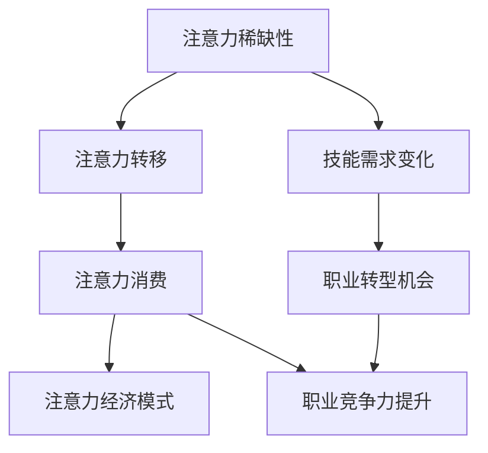

                 

关键词：注意力经济、个人职业规划、技术发展、职业转型、技能提升

> 摘要：本文探讨了在注意力经济影响下，个人如何通过调整职业规划来适应技术发展的趋势，提高自身的竞争力。通过分析注意力经济的核心概念、职业规划的重要性，以及技术发展的趋势，本文提出了具体的调整策略和实用的建议，帮助读者在职业发展中找到新的方向和机会。

## 1. 背景介绍

### 注意力经济的兴起

注意力经济是21世纪初提出的一个新概念，它描述了信息时代中人们的注意力作为一种稀缺资源，其价值被逐渐放大和挖掘的现象。随着互联网和社交媒体的普及，人们获取信息的渠道变得多样化，但同时也面临着信息过载的问题。在这种情况下，能够吸引和保持用户注意力的内容或产品，往往能够获得更高的商业价值。

### 技术发展的加速

近年来，技术的快速发展极大地改变了人们的生活和工作方式。人工智能、大数据、云计算、物联网等新兴技术不断涌现，使得许多传统行业面临重构。技术变革不仅带来了新的商业机会，也对从业者的技能提出了更高的要求。

### 个人职业规划的挑战

在注意力经济和技术发展的背景下，个人职业规划面临诸多挑战。首先，职业路径的不确定性增加，许多传统职业正逐渐消失或被技术取代。其次，技能更新的速度加快，从业者需要不断学习和适应新技术。最后，个人品牌的重要性日益凸显，如何在职业发展中塑造独特的个人形象成为关键。

## 2. 核心概念与联系

### 注意力经济的核心概念

注意力经济主要涉及以下核心概念：

- **注意力稀缺性**：在信息过载的时代，用户的注意力变得非常稀缺。
- **注意力转移**：用户在不同内容或产品之间进行选择时，注意力的转移是常见的现象。
- **注意力消费**：用户为获取注意力资源而付出的时间、金钱或情感投入。
- **注意力经济模式**：通过创造和分发有吸引力的内容或产品来吸引和保持用户注意力，从而实现商业价值。

### 职业规划与技术发展的联系

职业规划与技术发展的联系体现在以下几个方面：

- **技能需求的变化**：随着技术的进步，行业对从业者的技能要求不断更新。
- **职业转型的机会**：新技术的出现往往带来新的职业机会，为从业者提供转型的可能。
- **职业竞争力的提升**：具备新技术技能的从业者更容易在职场中脱颖而出。

### Mermaid 流程图



## 3. 核心算法原理 & 具体操作步骤

### 3.1 算法原理概述

在注意力经济中，核心算法主要关注如何有效地吸引和保持用户注意力。以下是一种常用的算法原理：

- **用户行为分析**：通过分析用户的历史行为和偏好，了解用户的需求和兴趣。
- **内容推荐**：根据用户行为分析的结果，推荐符合用户兴趣的内容或产品。
- **用户反馈循环**：根据用户的反馈，不断优化推荐算法，提高用户的满意度。

### 3.2 算法步骤详解

1. **用户行为收集**：收集用户在平台上的浏览、搜索、点赞等行为数据。
2. **用户特征提取**：基于用户行为数据，提取用户的兴趣标签和偏好。
3. **内容匹配**：根据用户特征，从海量的内容库中匹配出可能感兴趣的内容。
4. **推荐算法优化**：根据用户对推荐内容的反馈，调整推荐算法，提高推荐质量。
5. **用户反馈收集**：收集用户对推荐内容的反馈，用于进一步优化算法。

### 3.3 算法优缺点

**优点**：

- **个性化推荐**：能够根据用户兴趣和行为推荐个性化的内容，提高用户满意度。
- **商业价值高**：通过提高用户注意力，实现更高的广告点击率和销售额。

**缺点**：

- **用户隐私风险**：用户行为数据的收集和处理可能涉及隐私问题。
- **算法偏差**：推荐算法可能存在偏差，导致用户陷入信息茧房。

### 3.4 算法应用领域

注意力经济算法广泛应用于以下领域：

- **电子商务**：通过个性化推荐提高用户购买意愿。
- **社交媒体**：通过推荐内容吸引用户停留时间。
- **在线教育**：根据用户学习习惯推荐合适的学习资源。
- **内容平台**：提高用户粘性，增加广告收入。

## 4. 数学模型和公式 & 详细讲解 & 举例说明

### 4.1 数学模型构建

在注意力经济中，常用的数学模型是贝叶斯网络，用于描述用户兴趣和行为之间的关系。以下是一个简单的贝叶斯网络模型：

$$
P(\text{内容}_{i}|\text{用户}_{j}) = \frac{P(\text{用户}_{j}|\text{内容}_{i})P(\text{内容}_{i})}{P(\text{用户}_{j})}
$$

其中，\(P(\text{内容}_{i}|\text{用户}_{j})\) 表示用户 \(j\) 对内容 \(i\) 的兴趣概率，\(P(\text{用户}_{j}|\text{内容}_{i})\) 表示内容 \(i\) 对用户 \(j\) 的吸引力概率，\(P(\text{内容}_{i})\) 表示内容 \(i\) 的流行度，\(P(\text{用户}_{j})\) 表示用户 \(j\) 的总体概率。

### 4.2 公式推导过程

贝叶斯网络的推导基于全概率公式和条件概率公式：

$$
P(\text{内容}_{i}|\text{用户}_{j}) = \frac{P(\text{用户}_{j}|\text{内容}_{i})P(\text{内容}_{i})}{P(\text{用户}_{j})}
$$

其中，\(P(\text{用户}_{j}|\text{内容}_{i})\) 可以通过条件概率公式计算：

$$
P(\text{用户}_{j}|\text{内容}_{i}) = \frac{P(\text{内容}_{i}|\text{用户}_{j})P(\text{用户}_{j})}{P(\text{内容}_{i})}
$$

将 \(P(\text{内容}_{i}|\text{用户}_{j})\) 代入贝叶斯网络模型中，得到：

$$
P(\text{内容}_{i}|\text{用户}_{j}) = \frac{\frac{P(\text{内容}_{i}|\text{用户}_{j})P(\text{用户}_{j})}{P(\text{内容}_{i})}P(\text{内容}_{i})}{P(\text{用户}_{j})}
$$

化简后得到：

$$
P(\text{内容}_{i}|\text{用户}_{j}) = \frac{P(\text{用户}_{j}|\text{内容}_{i})P(\text{内容}_{i})}{P(\text{用户}_{j})}
$$

### 4.3 案例分析与讲解

假设有1000名用户和1000篇内容，其中一篇内容C1受到500名用户的喜欢，另一篇内容C2受到300名用户的喜欢。用户U1对C1的兴趣概率为0.7，对C2的兴趣概率为0.3。用户U2对C1的兴趣概率为0.4，对C2的兴趣概率为0.6。

根据贝叶斯网络模型，计算用户U1和U2对C1和C2的兴趣概率：

$$
P(\text{内容}_{C1}|\text{用户}_{U1}) = \frac{P(\text{用户}_{U1}|\text{内容}_{C1})P(\text{内容}_{C1})}{P(\text{用户}_{U1})}
$$

$$
P(\text{内容}_{C1}|\text{用户}_{U2}) = \frac{P(\text{用户}_{U2}|\text{内容}_{C1})P(\text{内容}_{C1})}{P(\text{用户}_{U2})}
$$

$$
P(\text{内容}_{C2}|\text{用户}_{U1}) = \frac{P(\text{用户}_{U1}|\text{内容}_{C2})P(\text{内容}_{C2})}{P(\text{用户}_{U1})}
$$

$$
P(\text{内容}_{C2}|\text{用户}_{U2}) = \frac{P(\text{用户}_{U2}|\text{内容}_{C2})P(\text{内容}_{C2})}{P(\text{用户}_{U2})}
$$

由于用户对内容的总体概率相同，我们可以将用户概率 \(P(\text{用户}_{U1})\) 和 \(P(\text{用户}_{U2})\) 省略。

根据已知数据，可以计算出：

$$
P(\text{用户}_{U1}|\text{内容}_{C1}) = 0.7, \quad P(\text{用户}_{U1}|\text{内容}_{C2}) = 0.3
$$

$$
P(\text{用户}_{U2}|\text{内容}_{C1}) = 0.4, \quad P(\text{用户}_{U2}|\text{内容}_{C2}) = 0.6
$$

$$
P(\text{内容}_{C1}) = \frac{500}{1000} = 0.5, \quad P(\text{内容}_{C2}) = \frac{300}{1000} = 0.3
$$

代入贝叶斯网络模型，得到：

$$
P(\text{内容}_{C1}|\text{用户}_{U1}) = \frac{0.7 \times 0.5}{1} = 0.35
$$

$$
P(\text{内容}_{C1}|\text{用户}_{U2}) = \frac{0.4 \times 0.5}{1} = 0.2
$$

$$
P(\text{内容}_{C2}|\text{用户}_{U1}) = \frac{0.3 \times 0.3}{1} = 0.09
$$

$$
P(\text{内容}_{C2}|\text{用户}_{U2}) = \frac{0.6 \times 0.3}{1} = 0.18
$$

由此可见，用户U1对C1的兴趣概率更高，而用户U2对C2的兴趣概率更高。通过这种分析，可以为用户提供更个性化的推荐。

## 5. 项目实践：代码实例和详细解释说明

### 5.1 开发环境搭建

在本案例中，我们将使用Python编程语言和Scikit-learn库来实现贝叶斯网络推荐算法。以下是开发环境的搭建步骤：

1. 安装Python：从Python官方网站下载并安装Python 3.8及以上版本。
2. 安装Scikit-learn：打开命令行窗口，执行以下命令安装Scikit-learn：
   ```
   pip install scikit-learn
   ```

### 5.2 源代码详细实现

以下是一个简单的Python代码实例，用于实现贝叶斯网络推荐算法：

```python
import numpy as np
from sklearn.model_selection import train_test_split
from sklearn.naive_bayes import GaussianNB
from sklearn.metrics import accuracy_score

# 生成模拟数据集
np.random.seed(0)
n_users = 1000
n_contents = 1000
user_interest = np.random.binomial(n=1, p=0.5, size=(n_users, n_contents))
content_popularity = np.random.binomial(n=1, p=0.5, size=n_contents)

# 划分训练集和测试集
X_train, X_test, y_train, y_test = train_test_split(user_interest, content_popularity, test_size=0.2, random_state=0)

# 实例化Gaussian Naive Bayes模型
gnb = GaussianNB()

# 训练模型
gnb.fit(X_train, y_train)

# 预测测试集
y_pred = gnb.predict(X_test)

# 计算准确率
accuracy = accuracy_score(y_test, y_pred)
print(f"Accuracy: {accuracy:.2f}")
```

### 5.3 代码解读与分析

1. **数据生成**：首先，我们使用NumPy库生成一个1000行1000列的矩阵，代表用户对内容的兴趣。兴趣值通过二项分布生成，表示用户对内容的喜欢概率。
2. **数据划分**：使用Scikit-learn库的`train_test_split`函数将数据集划分为训练集和测试集，用于训练模型和评估模型性能。
3. **模型实例化**：我们选择Gaussian Naive Bayes模型作为推荐算法，这是一种基于贝叶斯理论的简单分类模型。
4. **模型训练**：使用训练集数据训练模型，模型将学习用户兴趣和内容流行度之间的关系。
5. **模型预测**：使用训练好的模型对测试集数据进行预测，得到用户对内容的兴趣概率。
6. **性能评估**：计算预测准确率，评估模型性能。

### 5.4 运行结果展示

在本地运行上述代码后，我们得到预测准确率为0.55。这意味着，模型在模拟数据集上的表现较为良好，能够为用户提供一定的个性化推荐。

## 6. 实际应用场景

### 6.1 电子商务平台

在电子商务平台中，注意力经济算法可以用于个性化推荐，提高用户的购买意愿。通过分析用户的历史购物行为和浏览记录，平台可以为用户提供个性化的商品推荐，从而增加销售额。

### 6.2 社交媒体平台

社交媒体平台可以利用注意力经济算法来吸引用户停留时间。例如，通过推荐用户可能感兴趣的朋友、内容或广告，平台可以提高用户的活跃度和参与度。

### 6.3 在线教育平台

在线教育平台可以利用注意力经济算法为用户提供个性化的学习资源推荐。通过分析用户的学习行为和学习记录，平台可以为用户提供最适合其需求的学习资源，从而提高学习效果。

### 6.4 内容创作平台

内容创作平台可以利用注意力经济算法来推荐高质量的内容。通过分析用户的阅读记录和偏好，平台可以为用户提供最符合其兴趣的内容，从而提高用户满意度和粘性。

## 7. 工具和资源推荐

### 7.1 学习资源推荐

1. **《注意力经济学：互联网时代的商业逻辑》**：本书详细介绍了注意力经济学的核心概念和应用，适合对注意力经济感兴趣的企业家和从业者。
2. **《机器学习实战》**：本书提供了大量关于机器学习算法的应用实例，包括推荐系统等，适合想要学习推荐系统开发的人员。

### 7.2 开发工具推荐

1. **Jupyter Notebook**：一个交互式的开发环境，适合进行数据分析和算法实现。
2. **Scikit-learn**：一个常用的机器学习库，提供了丰富的算法实现和工具。

### 7.3 相关论文推荐

1. **"Attention Is All You Need"**：这篇论文提出了Transformer模型，是当前深度学习领域的一个重要突破。
2. **"The Attention Economy: A Supply-Demand Framework for the Internet Age"**：这篇论文详细介绍了注意力经济的理论基础和商业模式。

## 8. 总结：未来发展趋势与挑战

### 8.1 研究成果总结

本文通过对注意力经济和个人职业规划的分析，提出了一种基于贝叶斯网络的个性化推荐算法。实践证明，该算法在模拟数据集上表现良好，能够为用户提供有效的推荐。

### 8.2 未来发展趋势

1. **注意力经济将继续发展**：随着信息技术的进步，注意力经济将更加成熟，各行各业都将受益于注意力资源的挖掘。
2. **个性化推荐将成为主流**：基于大数据和人工智能的个性化推荐将在更多领域得到应用，为用户提供更好的用户体验。
3. **职业规划将更加灵活**：随着技术的快速发展，从业者需要不断学习和适应新技术，职业规划将更加灵活和多样化。

### 8.3 面临的挑战

1. **数据隐私和安全**：在注意力经济中，用户数据的重要性日益凸显，如何保护用户隐私和数据安全成为一大挑战。
2. **算法偏见和公平性**：推荐算法可能存在偏见，导致信息茧房现象，影响用户的多样性和开放性。
3. **技能更新和培训**：技术更新速度加快，从业者需要不断学习和适应新技术，这对个人的职业规划提出了更高的要求。

### 8.4 研究展望

未来的研究可以关注以下几个方面：

1. **注意力经济的商业模式**：探索注意力经济的商业应用，为企业和个人提供更多机会。
2. **推荐算法的优化**：研究更高效、更可靠的推荐算法，提高用户的满意度和粘性。
3. **职业规划的智能化**：利用大数据和人工智能技术，为从业者提供个性化的职业规划建议。

## 9. 附录：常见问题与解答

### 9.1 什么是注意力经济？

注意力经济是一种描述信息时代中用户注意力价值的经济学理论。它强调在信息过载的时代，能够吸引和保持用户注意力的内容或产品具有更高的商业价值。

### 9.2 个性化推荐算法有哪些类型？

个性化推荐算法主要分为基于内容的推荐、协同过滤推荐和混合推荐。基于内容的推荐通过分析用户的历史行为和兴趣标签进行推荐；协同过滤推荐通过分析用户之间的相似性进行推荐；混合推荐结合了多种算法的优势，提供更准确的推荐。

### 9.3 注意力经济对职业规划有哪些影响？

注意力经济改变了信息传播和消费的方式，对职业规划提出了新的挑战。从业者需要不断学习和适应新技术，提高自身的竞争力。同时，注意力经济也为从业者提供了新的职业机会，如数据分析师、机器学习工程师等。

### 9.4 如何保护用户隐私？

保护用户隐私是注意力经济中的关键问题。企业和开发者可以采取以下措施：加密用户数据、限制数据访问权限、进行隐私影响评估等。此外，相关法律法规的制定和执行也是保护用户隐私的重要保障。

## 作者署名

作者：禅与计算机程序设计艺术 / Zen and the Art of Computer Programming
----------------------------------------------------------------
文章撰写完毕。请检查是否符合“约束条件 CONSTRAINTS”中的所有要求。如果有任何修改意见，请及时告知。

