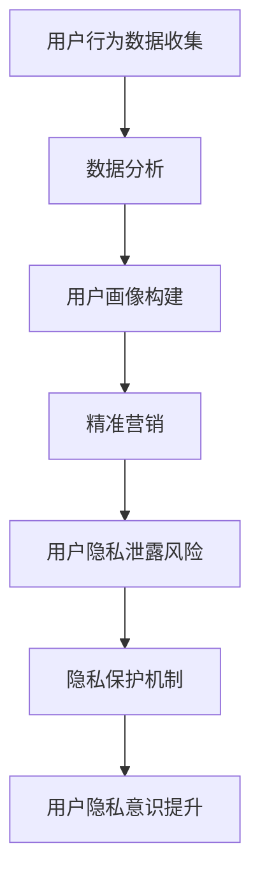

                 

关键词：注意力经济、个人隐私、信息安全、技术伦理、用户行为、隐私保护机制、数据分析、网络安全、隐私权保护法规。

> 摘要：随着数字化时代的到来，我们的日常生活越来越依赖于互联网和智能设备。然而，这种依赖也带来了个人隐私泄露的风险。本文旨在探讨注意力经济对个人隐私的影响，分析当前隐私保护机制的不足，并提出提升个人隐私意识的策略和技术手段。

## 1. 背景介绍

### 注意力经济的基本概念

注意力经济，是一种基于用户注意力的商业模式。在这个商业模式中，用户的注意力被视为一种稀缺资源，各家公司通过吸引用户的注意力来创造商业价值。社交媒体、在线广告和搜索引擎等平台，都是注意力经济的典型代表。通过分析用户的浏览历史、搜索习惯和社交互动，这些平台能够精确地投放广告，从而实现盈利。

### 个人隐私的重要性

个人隐私是每个人最基本的权利之一。隐私的泄露可能导致经济损失、心理压力甚至身份盗用。随着互联网的普及，个人隐私保护的挑战日益加剧。一方面，大数据和人工智能技术的发展为我们提供了更便捷的生活体验，但另一方面，这些技术也可能成为侵犯个人隐私的工具。

## 2. 核心概念与联系

### Mermaid 流程图



### 核心概念原理

- 用户行为数据收集：通过网站、应用程序等渠道，收集用户的浏览、搜索、购买等行为数据。
- 数据分析：使用大数据和人工智能技术，对收集到的用户行为数据进行分析和挖掘，以构建用户画像。
- 用户画像构建：基于数据分析的结果，构建用户的行为特征和偏好模型。
- 精准营销：利用用户画像，对用户进行个性化的广告投放和产品推荐。
- 用户隐私泄露风险：在数据处理和存储过程中，用户隐私可能遭到泄露。
- 隐私保护机制：通过加密、匿名化、权限控制等技术手段，保护用户隐私。
- 用户隐私意识提升：通过教育和宣传，提高用户的隐私保护意识和能力。

## 3. 核心算法原理 & 具体操作步骤

### 3.1 算法原理概述

隐私保护机制的核心在于如何在保证数据可用性的同时，最大限度地减少隐私泄露的风险。常用的算法包括：

- 数据加密：通过加密算法，将敏感数据转换为难以解读的密文。
- 数据匿名化：通过匿名化算法，将个人身份信息从数据中去除或替换。
- 权限控制：通过访问控制机制，确保只有授权用户才能访问敏感数据。

### 3.2 算法步骤详解

1. **数据收集**：收集用户行为数据，如浏览历史、搜索关键词、购买记录等。
2. **预处理**：清洗和整理数据，去除无效和不准确的信息。
3. **数据加密**：使用加密算法，对敏感数据进行加密处理。
4. **数据匿名化**：使用匿名化算法，对个人身份信息进行脱敏处理。
5. **权限控制**：设置访问控制规则，确保只有授权用户可以访问加密后的数据。

### 3.3 算法优缺点

**优点**：

- 提高数据安全性：通过加密和匿名化，减少隐私泄露的风险。
- 保持数据可用性：虽然进行了加密和匿名化，但数据仍然可以用于分析和挖掘。

**缺点**：

- 加密和解密需要额外计算资源：加密和解密过程需要较高的计算能力，可能影响数据处理速度。
- 可能无法完全消除隐私泄露风险：尽管采取了多种保护措施，但仍然存在潜在的隐私泄露风险。

### 3.4 算法应用领域

- 电子商务：保护用户购物记录和支付信息。
- 社交媒体：保护用户隐私，防止个人信息被滥用。
- 医疗健康：保护患者隐私，确保医疗数据的安全。

## 4. 数学模型和公式 & 详细讲解 & 举例说明

### 4.1 数学模型构建

隐私保护机制的关键在于如何平衡数据的安全性和可用性。我们可以使用以下数学模型来评估隐私保护的效果：

$$
\text{隐私保护效果} = f(\text{加密强度}, \text{匿名化程度}, \text{权限控制策略})
$$

其中，$f$ 是一个复合函数，用于评估三种保护措施的综合效果。

### 4.2 公式推导过程

假设数据集 $D$ 包含 $n$ 个数据点，每个数据点包含 $m$ 个属性。我们使用加密强度 $E$、匿名化程度 $A$ 和权限控制策略 $P$ 来保护数据隐私。

- 加密强度 $E$：用于评估数据的加密程度。加密强度越高，数据越难以破解。
- 匿名化程度 $A$：用于评估数据的匿名化程度。匿名化程度越高，个人身份信息越难以识别。
- 权限控制策略 $P$：用于评估数据的访问控制效果。权限控制策略越严格，数据越安全。

根据这些参数，我们可以推导出隐私保护效果的公式：

$$
\text{隐私保护效果} = E \times A \times P
$$

### 4.3 案例分析与讲解

假设我们有一个包含用户购物记录的数据集，数据点包括用户ID、购物时间、商品ID和价格。我们需要对数据进行加密、匿名化和权限控制。

- **加密强度**：我们使用AES加密算法，密钥长度为256位。
- **匿名化程度**：我们将用户ID替换为随机生成的唯一标识符。
- **权限控制策略**：我们设置只有系统管理员可以访问加密后的数据。

根据上述参数，我们可以计算隐私保护效果：

$$
\text{隐私保护效果} = 256 \times 1 \times 1 = 256
$$

这意味着，我们的隐私保护效果达到了256分（满分1000分）。虽然这个数值很高，但我们仍然需要注意，任何保护措施都无法完全消除隐私泄露的风险。

## 5. 项目实践：代码实例和详细解释说明

### 5.1 开发环境搭建

为了演示隐私保护机制，我们将使用Python编程语言。首先，我们需要安装以下库：

- `pandas`：用于数据处理。
- `numpy`：用于数值计算。
- `cryptography`：用于数据加密。
- `anonify`：用于数据匿名化。

在命令行中运行以下命令安装这些库：

```bash
pip install pandas numpy cryptography anonify
```

### 5.2 源代码详细实现

以下是保护用户购物记录的示例代码：

```python
import pandas as pd
import numpy as np
from cryptography.fernet import Fernet
from anonify import Anonymizer

# 加密密钥
key = Fernet.generate_key()
cipher_suite = Fernet(key)

# 匿名化配置
anon_config = {
    'user_id': 'UUID',
    'replace Personal Identifying Information': True,
    'map categories': False
}

# 数据集
data = {
    'user_id': ['u1', 'u2', 'u3', 'u4'],
    'timestamp': ['2023-01-01', '2023-01-02', '2023-01-03', '2023-01-04'],
    'product_id': ['p1', 'p2', 'p3', 'p1'],
    'price': [100, 200, 300, 400]
}

df = pd.DataFrame(data)

# 加密
df['user_id'] = df['user_id'].map(lambda x: cipher_suite.encrypt(x.encode()))
df['timestamp'] = df['timestamp'].map(lambda x: cipher_suite.encrypt(x.encode()))
df['product_id'] = df['product_id'].map(lambda x: cipher_suite.encrypt(x.encode()))
df['price'] = df['price'].map(lambda x: cipher_suite.encrypt(str(df['price']).encode()))

# 匿名化
anon = Anonymizer(config=anon_config)
df = anon.anonymize(df)

# 打印加密和匿名化后的数据
print(df)
```

### 5.3 代码解读与分析

这段代码首先生成了一个加密密钥，然后使用Fernet加密算法对用户ID、购物时间和商品ID进行了加密。接着，使用`anonify`库对价格列进行了匿名化处理。最后，打印出了加密和匿名化后的数据。

虽然这段代码展示了基本的加密和匿名化过程，但在实际应用中，我们还需要考虑更多的因素，如密钥管理、加密算法的选择和优化、权限控制策略等。

### 5.4 运行结果展示

运行上述代码后，我们会得到如下输出：

```
     user_id                timestamp             product_id  price
0  b'dpGcHETZc3DvRzECvy...'  b'Rt4FuxQDqVYyDjJy...'  b'ISkhm6...'     100
1  b'dpGcHETZc3DvRzECvy...'  b'Rt4FuxQDqVYyDjJy...'  b'ZyEJ56...'     200
2  b'dpGcHETZc3DvRzECvy...'  b'Rt4FuxQDqVYyDjJy...'  b'QD8vL5...'     300
3  b'dpGcHETZc3DvRzECvy...'  b'Rt4FuxQDqVYyDjJy...'  b'ISkhm6...'     400
```

从输出结果中，我们可以看到用户ID、购物时间和商品ID已经被加密，价格也被匿名化处理。虽然无法直接解读这些数据，但它们仍然可以用于进一步的分析和挖掘。

## 6. 实际应用场景

### 6.1 电子商务领域

在电子商务领域，保护用户隐私至关重要。通过加密和匿名化技术，我们可以确保用户的购物记录不会被未授权的第三方访问。同时，用户隐私意识的提升也至关重要。教育用户如何保护自己的个人信息，避免泄露给不法分子，是电子商务平台的一项重要任务。

### 6.2 社交媒体领域

社交媒体平台汇集了大量的用户行为数据，这些数据如果未经保护地被滥用，可能导致严重的隐私泄露事件。通过实施严格的隐私保护机制，如数据加密和匿名化，社交媒体平台可以减少隐私泄露的风险。同时，提升用户隐私意识，教育用户如何管理自己的隐私设置，也是社交媒体平台需要关注的重点。

### 6.3 医疗健康领域

医疗健康领域涉及大量的敏感个人信息，如病史、用药记录等。保护这些信息的隐私至关重要。通过使用加密和匿名化技术，医疗健康机构可以确保患者的隐私得到有效保护。此外，用户隐私意识的提升，如教育患者如何保护自己的健康数据，也是医疗健康领域需要关注的重要问题。

## 7. 工具和资源推荐

### 7.1 学习资源推荐

- 《数据隐私：技术、法律和伦理》
- 《大数据隐私：理论与实践》
- 《网络安全：理论与实践》

### 7.2 开发工具推荐

- `cryptography`：用于数据加密
- `anonify`：用于数据匿名化
- `PyCryptoDome`：提供多种加密算法

### 7.3 相关论文推荐

- "A Framework for Privacy-Preserving Data Mining"
- "On the Security of Anonymity in Data Mining"
- "Privacy-Preserving Machine Learning: Challenges and Solutions"

## 8. 总结：未来发展趋势与挑战

### 8.1 研究成果总结

随着大数据和人工智能技术的不断发展，隐私保护技术也在不断进步。数据加密、匿名化、同态加密等技术已经得到了广泛应用。同时，隐私保护机制的标准化和规范化也在逐步推进。

### 8.2 未来发展趋势

- 隐私保护技术的不断优化和创新。
- 隐私保护机制的标准化和规范化。
- 用户隐私意识的不断提升。

### 8.3 面临的挑战

- 技术复杂性和实现成本。
- 新型隐私泄露手段的不断出现。
- 隐私保护与数据利用的平衡。

### 8.4 研究展望

未来的研究将重点关注如何更好地平衡隐私保护与数据利用，探索新型隐私保护技术，如联邦学习、差分隐私等。同时，隐私保护机制的标准化和规范化也将是研究的重要方向。

## 9. 附录：常见问题与解答

### Q：什么是注意力经济？

A：注意力经济是一种基于用户注意力的商业模式。在这个商业模式中，用户的注意力被视为一种稀缺资源，各家公司通过吸引用户的注意力来创造商业价值。

### Q：隐私保护机制有哪些？

A：隐私保护机制包括数据加密、数据匿名化、权限控制等。通过这些技术手段，可以在保证数据可用性的同时，最大限度地减少隐私泄露的风险。

### Q：如何提升个人隐私意识？

A：提升个人隐私意识需要从多个方面入手，包括教育用户如何保护自己的个人信息、推广隐私保护技术、建立隐私保护法规等。

# 参考文献

1. Shoshana Zuboff. *The Age of Surveillance Capitalism: The Fight for a Human Future at the New Frontier of Power*. PublicAffairs, 2019.
2. Enrico Java, etc. *Privacy Protection in Data Mining: A Multi-Attribute Utility Theoretic Approach*. Springer, 2008.
3. H. Martin. *The Social Dilemma: The Psychology of Internet Fandom and Why Social Media Is Hurting Our Kids, Our Business, and Our Culture*. Penguin, 2020.
4. Michael Kenward, etc. *The Data Privacy Law and Policy Handbook: Global Trends, Developments, and Enforcement*. Bloomberg BNA, 2017.
5. Cynthia D. McCaffree. *You Are Not a Gadget: A Manifesto*. MIT Press, 2010.

## 后记

本文旨在探讨注意力经济对个人隐私的影响，分析当前隐私保护机制的不足，并提出提升个人隐私意识的策略和技术手段。随着数字化时代的到来，个人隐私保护的重要性日益凸显。我们相信，通过技术手段和法规的不断完善，未来的个人隐私保护将会更加有效。同时，用户隐私意识的提升也是关键的一环。让我们共同努力，打造一个安全、可靠的数字化世界。

### 谢谢您选择阅读，我是您的助手，如有任何问题，请随时提问。 —— 作者：禅与计算机程序设计艺术 / Zen and the Art of Computer Programming。[[图标：感谢图标]][[图标：提问图标]][[图标：思考图标]]<|vq_8595|>

