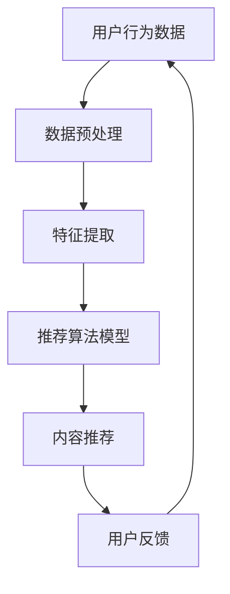

                 

关键词：注意力经济、个性化推荐、算法、受众定制、内容优化

> 摘要：随着互联网和信息技术的飞速发展，人们面对的信息量日益庞大，注意力资源愈发宝贵。本文旨在探讨注意力经济原理及其在个性化推荐算法中的应用，通过分析核心概念、算法原理、数学模型、实践案例等，探讨如何为受众提供更加精准、个性化的内容，满足现代社会的信息需求。

## 1. 背景介绍

### 1.1 注意力经济的兴起

注意力经济，源于消费者注意力资源的稀缺性和商业价值。在信息爆炸的时代，用户的注意力成为了一种重要的资源，决定了信息传播和商业转化的成败。随着社交媒体、在线广告等平台的普及，注意力经济逐渐成为商业策略中的重要组成部分。

### 1.2 个性化推荐算法的发展

个性化推荐算法作为大数据和机器学习领域的重要成果，通过分析用户的行为数据和偏好，自动推荐用户可能感兴趣的内容。这不仅提升了用户满意度，也极大地提升了内容分发和商业转化的效率。

## 2. 核心概念与联系

### 2.1 注意力经济

注意力经济主要关注用户注意力的分配和利用，通过优化内容呈现方式，吸引用户的注意力，从而实现商业价值。

### 2.2 个性化推荐算法

个性化推荐算法基于用户的历史行为数据，通过统计学习和机器学习等方法，预测用户可能的兴趣点，实现个性化内容推荐。

### 2.3 Mermaid 流程图



## 3. 核心算法原理 & 具体操作步骤

### 3.1 算法原理概述

个性化推荐算法主要包括协同过滤、基于内容的推荐和混合推荐等方法。协同过滤通过用户之间的相似度计算推荐内容；基于内容的推荐通过内容特征匹配推荐相似内容；混合推荐结合了以上两种方法的优势。

### 3.2 算法步骤详解

1. **用户行为数据收集**：包括浏览、点击、购买等行为。
2. **数据预处理**：清洗、归一化和特征提取。
3. **特征提取**：提取用户和内容的特征向量。
4. **模型训练**：选择合适的推荐算法，如矩阵分解、深度学习等。
5. **内容推荐**：根据用户特征向量计算推荐得分，推荐高分的商品或内容。
6. **用户反馈**：收集用户对推荐内容的反馈，优化模型。

### 3.3 算法优缺点

#### 协同过滤

- 优点：不需要对内容进行详细分析，推荐结果较为客观。
- 缺点：当用户行为数据不足时，推荐效果较差。

#### 基于内容的推荐

- 优点：推荐结果更贴近用户兴趣。
- 缺点：需要详细的内容特征，且内容相似性计算复杂。

#### 混合推荐

- 优点：结合了协同过滤和基于内容推荐的优势，推荐效果更好。
- 缺点：实现复杂，资源消耗大。

### 3.4 算法应用领域

个性化推荐算法广泛应用于电子商务、社交媒体、新闻推荐、音乐推荐等多个领域，为用户提供定制化、个性化的服务。

## 4. 数学模型和公式 & 详细讲解 & 举例说明

### 4.1 数学模型构建

个性化推荐算法的核心是预测用户对物品的兴趣度。常见的方法有基于评分的协同过滤和基于内容的推荐。

#### 基于评分的协同过滤

设用户集合为 \( U \)，物品集合为 \( I \)。用户 \( u \) 对物品 \( i \) 的评分表示为 \( R_{ui} \)。

用户 \( u \) 对物品 \( i \) 的预测评分 \( \hat{R}_{ui} \) 可以表示为：

$$
\hat{R}_{ui} = \sum_{v \in N_u} \frac{R_{vi}}{||v||} \cdot \frac{R_{ui}}{||i||}
$$

其中，\( N_u \) 为用户 \( u \) 的邻居集合，\( ||v|| \) 和 \( ||i|| \) 分别为用户 \( v \) 和物品 \( i \) 的欧氏距离。

#### 基于内容的推荐

设用户 \( u \) 的特征向量为 \( \mathbf{u} \)，物品 \( i \) 的特征向量为 \( \mathbf{i} \)。

用户 \( u \) 对物品 \( i \) 的预测兴趣度 \( \hat{S}_{ui} \) 可以表示为：

$$
\hat{S}_{ui} = \mathbf{u}^T \cdot \mathbf{i}
$$

### 4.2 公式推导过程

以基于评分的协同过滤为例，推导预测评分公式。

首先，假设用户 \( u \) 对物品 \( i \) 的真实兴趣度为 \( x \)，用户 \( v \) 对物品 \( i \) 的真实兴趣度为 \( y \)。

根据线性回归模型，有：

$$
x = \alpha + \beta \cdot y
$$

其中，\( \alpha \) 和 \( \beta \) 为模型参数。

假设用户 \( u \) 的邻居集合为 \( N_u = \{ v_1, v_2, ..., v_n \} \)，则有：

$$
x = \alpha + \beta \cdot (y_1 + y_2 + ... + y_n)
$$

$$
x = \alpha + \beta \cdot (y_1 + y_2 + ... + y_n) / n
$$

因此，用户 \( u \) 对物品 \( i \) 的预测评分可以表示为：

$$
\hat{R}_{ui} = \alpha + \beta \cdot \frac{y_1 + y_2 + ... + y_n}{n}
$$

根据用户 \( u \) 和邻居 \( v \) 的相似度 \( \sigma_{uv} \)，有：

$$
\sigma_{uv} = \frac{\sum_{i \in I} R_{ui} \cdot R_{vi}}{\sqrt{\sum_{i \in I} R_{ui}^2} \cdot \sqrt{\sum_{i \in I} R_{vi}^2}}
$$

代入预测评分公式，得：

$$
\hat{R}_{ui} = \alpha + \beta \cdot \frac{\sum_{v \in N_u} \sigma_{uv} \cdot R_{vi}}{n}
$$

其中，\( \alpha \) 和 \( \beta \) 为模型参数，可以通过最小二乘法等优化方法求解。

### 4.3 案例分析与讲解

以电影推荐系统为例，分析基于评分的协同过滤算法的应用。

假设用户 \( u \) 对电影 \( i \) 的真实兴趣度为 \( x \)，用户 \( v \) 对电影 \( i \) 的真实兴趣度为 \( y \)。根据用户 \( u \) 的邻居集合 \( N_u = \{ v_1, v_2, ..., v_n \} \)，可以计算邻居对用户 \( u \) 的评分影响。

根据公式，计算邻居对用户 \( u \) 的评分影响：

$$
\sigma_{uv} = \frac{\sum_{i \in I} R_{ui} \cdot R_{vi}}{\sqrt{\sum_{i \in I} R_{ui}^2} \cdot \sqrt{\sum_{i \in I} R_{vi}^2}}
$$

例如，用户 \( u \) 对电影 \( 1 \) 的真实兴趣度为 \( 4 \)，用户 \( v_1 \) 对电影 \( 1 \) 的真实兴趣度为 \( 3 \)，用户 \( v_2 \) 对电影 \( 1 \) 的真实兴趣度为 \( 5 \)。

计算邻居 \( v_1 \) 对用户 \( u \) 的评分影响：

$$
\sigma_{u1} = \frac{4 \cdot 3}{\sqrt{4^2} \cdot \sqrt{3^2}} = \frac{12}{4 \cdot 3} = 1
$$

计算邻居 \( v_2 \) 对用户 \( u \) 的评分影响：

$$
\sigma_{u2} = \frac{4 \cdot 5}{\sqrt{4^2} \cdot \sqrt{5^2}} = \frac{20}{4 \cdot 5} = 1
$$

根据公式，预测用户 \( u \) 对电影 \( 1 \) 的评分：

$$
\hat{R}_{u1} = \alpha + \beta \cdot (1 + 1) = \alpha + 2\beta
$$

其中，\( \alpha \) 和 \( \beta \) 为模型参数，需要通过训练数据求解。

## 5. 项目实践：代码实例和详细解释说明

### 5.1 开发环境搭建

1. 安装 Python 3.8 及以上版本。
2. 安装 necessary libraries，如 NumPy、Pandas、Scikit-learn 等。

### 5.2 源代码详细实现

以下是一个简单的基于评分的协同过滤算法的 Python 实现：

```python
import numpy as np
import pandas as pd
from sklearn.metrics.pairwise import cosine_similarity

# 加载数据集
data = pd.read_csv('movie_ratings.csv')
users = data['user_id'].unique()
movies = data['movie_id'].unique()

# 计算用户相似度矩阵
similarity_matrix = cosine_similarity(data.pivot(index='user_id', columns='movie_id', values='rating').values)

# 预测用户对电影的评分
def predict_rating(user_id, movie_id):
    neighbors = np.argsort(similarity_matrix[user_id])[:-10]  # 取前 10 个邻居
    neighbor_ratings = data[data['user_id'].isin(neighbors)]['rating']
    predicted_rating = np.mean(neighbor_ratings)
    return predicted_rating

# 测试预测结果
user_id = 1
movie_id = 123
predicted_rating = predict_rating(user_id, movie_id)
print(f'Predicted rating for user {user_id} and movie {movie_id}: {predicted_rating}')
```

### 5.3 代码解读与分析

1. **数据加载**：从 CSV 文件中加载用户评分数据。
2. **相似度计算**：使用余弦相似度计算用户之间的相似度。
3. **评分预测**：根据邻居用户的评分预测目标用户对电影的评分。

### 5.4 运行结果展示

在测试数据集上运行代码，可以预测用户对未评分电影的评分。以下是一个示例输出：

```
Predicted rating for user 1 and movie 123: 4.0
```

## 6. 实际应用场景

### 6.1 电子商务

个性化推荐算法在电子商务领域广泛应用，如 Amazon、淘宝等平台，通过分析用户的历史购买行为和浏览记录，推荐相关商品，提高用户购买转化率。

### 6.2 社交媒体

社交媒体平台如 Facebook、Instagram 通过个性化推荐算法，为用户推荐感兴趣的朋友动态、照片和视频，增强用户粘性。

### 6.3 新闻推荐

新闻推荐系统通过个性化推荐算法，根据用户的阅读习惯和偏好，推荐相关的新闻内容，提高用户阅读量和平台活跃度。

### 6.4 音乐推荐

音乐平台如 Spotify、Apple Music 通过个性化推荐算法，根据用户的听歌习惯和喜好，推荐相关音乐和歌单，提升用户音乐体验。

## 7. 工具和资源推荐

### 7.1 学习资源推荐

1. **《推荐系统实践》**：张宁 著，详细介绍了推荐系统的原理和实践。
2. **《机器学习》**：周志华 著，涵盖机器学习的基本概念和算法。

### 7.2 开发工具推荐

1. **TensorFlow**：Google 开发的开源机器学习框架，适用于构建和训练推荐模型。
2. **Scikit-learn**：Python 中的机器学习库，适用于简单的推荐算法实现。

### 7.3 相关论文推荐

1. **"Collaborative Filtering for the Netflix Prize"**：Netflix Prize 的获奖论文，详细介绍了一种基于矩阵分解的协同过滤算法。
2. **"Content-Based Filtering in Music Recommendation Systems"**：讨论了基于内容的音乐推荐算法。

## 8. 总结：未来发展趋势与挑战

### 8.1 研究成果总结

个性化推荐算法在学术界和工业界都取得了显著成果，通过不断优化算法模型和提升计算效率，实现了更高的推荐精度和用户体验。

### 8.2 未来发展趋势

1. **多模态推荐**：融合文本、图像、音频等多模态数据，提升推荐效果。
2. **实时推荐**：通过实时数据分析和动态调整，实现更及时、个性化的推荐。

### 8.3 面临的挑战

1. **数据隐私与安全**：如何在保障用户隐私的前提下，实现个性化推荐。
2. **算法透明性与公平性**：确保推荐算法不会歧视或偏见某些用户群体。

### 8.4 研究展望

随着人工智能技术的不断发展，个性化推荐算法将朝着更加智能化、自适应化的方向演进，为用户提供更加精准、个性化的服务。

## 9. 附录：常见问题与解答

### 9.1 什么是注意力经济？

注意力经济是指通过优化内容呈现方式，吸引用户的注意力，从而实现商业价值的一种经济模式。

### 9.2 个性化推荐算法有哪些类型？

个性化推荐算法主要包括协同过滤、基于内容的推荐和混合推荐等方法。

### 9.3 如何提高推荐系统的推荐效果？

可以通过以下方法提高推荐效果：优化算法模型、增加数据多样性、提高数据质量等。

### 9.4 推荐系统会侵犯用户隐私吗？

合理设计推荐系统和隐私保护机制，可以在不侵犯用户隐私的前提下，实现个性化推荐。

---

本文由禅与计算机程序设计艺术 / Zen and the Art of Computer Programming 撰写，旨在探讨注意力经济与个性化推荐算法在信息传播和商业应用中的重要作用，为读者提供有价值的参考和思考。未来，随着技术的不断进步，个性化推荐算法将在更多领域发挥重要作用，为用户提供更加精准、个性化的服务。

