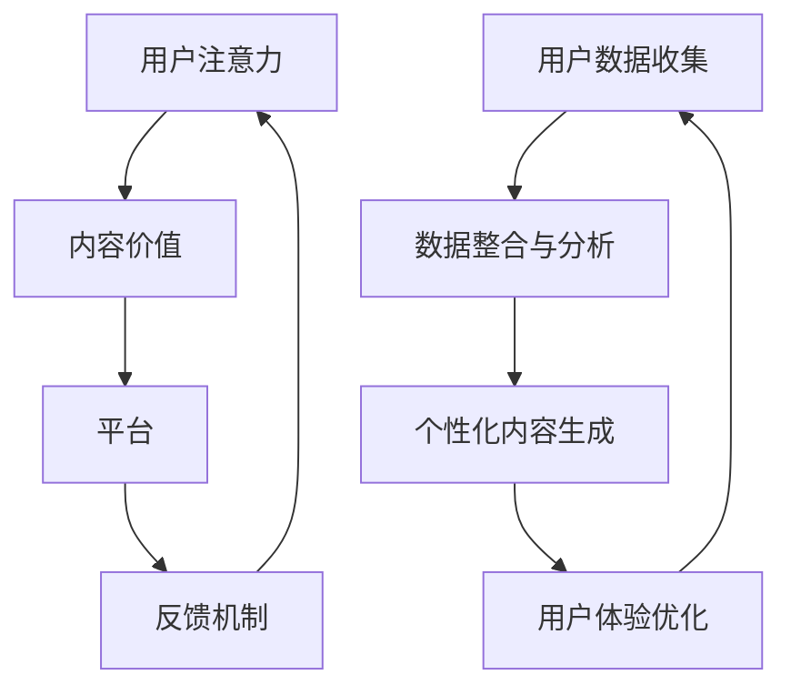

                 

关键词：注意力经济、个性化营销、定制体验、用户体验、技术实现

> 摘要：本文深入探讨了注意力经济与个性化营销技术，旨在为企业和开发者提供策略和工具，以创建定制、有针对性的用户体验。通过分析注意力经济的本质和个性化营销的关键技术，本文提供了实际项目实践和未来应用的展望。

## 1. 背景介绍

在数字化时代，用户注意力成为了企业争夺的宝贵资源。随着信息爆炸和用户选择增多，企业必须通过高效吸引和保持用户注意力来实现商业成功。注意力经济（Attention Economy）的概念由Avery Johnson于2004年提出，指的是一个基于用户注意力的经济模型。在这个模型中，用户注意力成为企业和个人获取价值的主要途径。个性化营销（Personalized Marketing）则是一种以用户为中心的营销策略，旨在通过了解用户偏好和行为，提供定制化的内容和体验，从而提升用户满意度和忠诚度。

本文将围绕注意力经济与个性化营销技术展开，探讨其核心概念、原理、算法、数学模型以及实际应用。通过详细解析和项目实践，本文旨在为企业和开发者提供有价值的指导，帮助他们在竞争激烈的市场中脱颖而出。

### 1.1 注意力经济的历史与发展

注意力经济起源于互联网时代的兴起，随着用户在数字平台上的活动增多，注意力成为一种新的价值形式。早在互联网初期，广告模式开始从传统的基于产品销售的模型转向基于用户注意力的模型。互联网巨头如谷歌和Facebook利用广告定位技术和用户数据，成功地将注意力转化为商业利润。

近年来，随着人工智能、大数据和机器学习技术的进步，注意力经济得到了进一步发展。个性化推荐系统、智能广告投放和用户行为分析等技术的应用，使得企业能够更加精准地捕获用户注意力，提高营销效果。

### 1.2 个性化营销的发展与应用

个性化营销的概念可以追溯到20世纪90年代，随着数据库营销和数据挖掘技术的发展，企业开始利用用户数据来定制营销活动。随着互联网的普及和社交媒体的兴起，个性化营销得到了广泛应用。

个性化营销的核心在于理解用户，根据用户的行为、偏好和历史数据，提供个性化的内容和体验。这种策略不仅提高了营销的转化率，还增强了用户对品牌的忠诚度。例如，电商平台使用个性化推荐算法，向用户推荐他们可能感兴趣的商品，从而提升销售量。

## 2. 核心概念与联系

### 2.1 注意力经济模型

注意力经济模型的核心在于用户注意力。用户在信息过载的环境中，注意力成为一种稀缺资源。企业通过提供有价值、相关和吸引人的内容或服务，吸引用户的注意力。以下是注意力经济模型的基本组成部分：

1. **用户注意力**：用户在特定时间段内分配给某一活动或内容的精力。
2. **内容价值**：内容对用户的有用性和吸引力，是获取用户注意力的关键。
3. **平台**：数字平台或媒体，用于传播内容和吸引用户注意力。
4. **反馈机制**：用户对内容的反馈，如点赞、评论、分享等，影响内容的价值和传播。

### 2.2 个性化营销框架

个性化营销框架旨在通过用户数据和行为分析，提供定制化的用户体验。以下是个性化营销框架的组成部分：

1. **用户数据收集**：通过网站、应用、社交媒体等渠道收集用户数据，包括行为数据、偏好数据和社交数据。
2. **数据整合与分析**：将多渠道数据整合，利用数据挖掘和机器学习技术分析用户行为和偏好。
3. **个性化内容生成**：根据用户数据，生成个性化的内容和体验，如推荐系统、定制化广告和个性化营销活动。
4. **用户体验优化**：持续收集用户反馈，优化用户体验，提高用户满意度和忠诚度。

### 2.3 注意力经济与个性化营销的联系

注意力经济与个性化营销之间存在紧密联系。个性化营销技术可以增强注意力经济的有效性，通过提供更相关和吸引人的内容，提高用户对品牌和产品的关注度和参与度。同时，注意力经济的理念也推动了个性化营销的发展，促使企业不断探索和创新，以更好地捕获和利用用户注意力。

### 2.4 Mermaid 流程图

下面是注意力经济与个性化营销技术的 Mermaid 流程图：



## 3. 核心算法原理 & 具体操作步骤

### 3.1 算法原理概述

个性化推荐系统和用户行为分析是注意力经济与个性化营销的核心算法。以下是这两个算法的基本原理：

#### 3.1.1 个性化推荐系统

个性化推荐系统通过分析用户历史行为和偏好，为用户提供个性化的内容推荐。其基本原理包括：

1. **协同过滤**：基于用户行为的相似性或物品的相似性进行推荐。
2. **基于内容的推荐**：根据物品的内容特征和用户偏好进行匹配。
3. **深度学习**：利用神经网络模型，如协同过滤神经网络（NeuMF），进行复杂用户行为和内容特征的建模。

#### 3.1.2 用户行为分析

用户行为分析通过数据挖掘和机器学习技术，分析用户在网站、应用等平台上的行为数据，以理解用户需求和偏好。其基本原理包括：

1. **行为序列分析**：分析用户行为序列，识别用户的行为模式和兴趣点。
2. **关联规则挖掘**：挖掘用户行为数据中的关联关系，为个性化推荐提供支持。
3. **时间序列分析**：分析用户行为的时序变化，预测用户未来的行为和需求。

### 3.2 算法步骤详解

#### 3.2.1 个性化推荐系统步骤

1. **数据收集与预处理**：收集用户行为数据（如浏览记录、购买历史、评价等），并进行数据清洗和预处理，如缺失值处理、数据标准化等。
2. **特征工程**：提取用户行为和物品特征，如用户活跃度、物品流行度、用户兴趣标签等。
3. **模型选择与训练**：选择合适的推荐算法，如协同过滤、基于内容的推荐或深度学习模型，进行模型训练。
4. **推荐结果生成**：根据用户特征和物品特征，生成个性化推荐结果。
5. **推荐结果评估**：评估推荐结果的准确性和多样性，如使用均方根误差（RMSE）、准确率（Precision）、召回率（Recall）等指标。

#### 3.2.2 用户行为分析步骤

1. **数据收集与预处理**：与个性化推荐系统类似，收集用户行为数据，并进行预处理。
2. **行为序列建模**：使用序列模型（如循环神经网络RNN、长短期记忆网络LSTM等），建模用户行为序列。
3. **关联规则挖掘**：使用关联规则挖掘算法（如Apriori、FP-growth等），挖掘用户行为数据中的关联关系。
4. **时间序列预测**：使用时间序列预测模型（如ARIMA、LSTM等），预测用户未来的行为和需求。
5. **分析结果评估**：评估分析结果的准确性和实用性，如使用评估指标（如准确率、召回率、F1值等）。

### 3.3 算法优缺点

#### 3.3.1 个性化推荐系统

**优点**：

1. **个性化强**：根据用户历史行为和偏好，提供个性化的推荐结果。
2. **准确性高**：通过协同过滤、基于内容的推荐和深度学习等技术，提高推荐结果的准确性。
3. **多样性**：推荐算法通常能够保证推荐结果具有多样性，避免用户陷入信息茧房。

**缺点**：

1. **冷启动问题**：对于新用户或新物品，由于缺乏足够的历史数据，推荐效果较差。
2. **数据依赖性**：推荐算法的性能高度依赖用户行为数据的质量和数量。
3. **计算复杂度高**：深度学习模型通常需要大量的计算资源和时间进行训练。

#### 3.3.2 用户行为分析

**优点**：

1. **行为理解深**：通过分析用户行为序列和关联关系，深入了解用户需求和兴趣。
2. **实时性**：可以实时分析用户行为，预测用户未来的行为和需求。
3. **多样性**：关联规则挖掘和时间序列预测等技术，可以提供多种维度的分析结果。

**缺点**：

1. **分析复杂性**：用户行为分析通常涉及复杂的数据处理和分析模型，需要较高的技术门槛。
2. **预测准确性**：用户行为分析模型的预测准确性受数据质量和模型选择的影响。

### 3.4 算法应用领域

个性化推荐系统和用户行为分析技术广泛应用于电子商务、社交媒体、在线媒体和金融等领域。

1. **电子商务**：通过个性化推荐，提高用户购物体验和销售额。
2. **社交媒体**：通过分析用户行为，提供个性化内容和广告，增加用户参与度。
3. **在线媒体**：通过个性化推荐，提高用户观看体验和广告效果。
4. **金融**：通过分析用户行为，进行信用评估和风险控制。

## 4. 数学模型和公式 & 详细讲解 & 举例说明

### 4.1 数学模型构建

个性化推荐和用户行为分析通常涉及以下数学模型：

1. **用户-物品评分矩阵**：表示用户对物品的评分，如 $R \in \mathbb{R}^{m \times n}$，其中 $m$ 是用户数量，$n$ 是物品数量。
2. **用户行为序列**：表示用户在一段时间内的行为数据，如 $S \in \mathbb{R}^{1 \times T}$，其中 $T$ 是行为事件的数量。
3. **用户兴趣模型**：表示用户对各类物品的兴趣程度，如 $U \in \mathbb{R}^{m \times k}$，其中 $k$ 是兴趣类别数量。

### 4.2 公式推导过程

#### 4.2.1 协同过滤算法

协同过滤算法的基本思想是，根据用户对物品的评分，找出与目标用户相似的用户，然后将这些用户喜欢的物品推荐给目标用户。其公式推导如下：

1. **用户相似度计算**：

   $$
   sim(u, v) = \frac{\sum_{i=1}^{n} r_{uv} \cdot r_{ui} \cdot r_{vi}}{\sqrt{\sum_{i=1}^{n} r_{ui}^2 \cdot \sum_{i=1}^{n} r_{vi}^2}}
   $$

   其中 $r_{uv}$ 表示用户 $u$ 和 $v$ 对物品 $i$ 的共同评分。

2. **推荐评分计算**：

   $$
   r_{u,i'} = \sum_{i=1}^{n} sim(u, v) \cdot r_{v,i'}
   $$

   其中 $r_{u,i'}$ 表示用户 $u$ 对物品 $i'$ 的推荐评分。

#### 4.2.2 基于内容的推荐算法

基于内容的推荐算法通过分析物品和用户的特征，找出相似度高的物品进行推荐。其公式推导如下：

1. **物品特征表示**：

   $$
   x_i = (x_{i1}, x_{i2}, ..., x_{in})^T
   $$

   其中 $x_{ij}$ 表示物品 $i$ 在特征 $j$ 上的取值。

2. **用户兴趣特征表示**：

   $$
   y_u = (y_{u1}, y_{u2}, ..., y_{un})^T
   $$

   其中 $y_{uj}$ 表示用户 $u$ 对特征 $j$ 的兴趣程度。

3. **相似度计算**：

   $$
   sim(x_i, y_u) = \cos(\theta) = \frac{x_i \cdot y_u}{\|x_i\| \|y_u\|}
   $$

   其中 $\theta$ 是物品 $i$ 和用户 $u$ 的夹角。

4. **推荐评分计算**：

   $$
   r_{u,i'} = \sum_{i=1}^{n} sim(x_i, y_u) \cdot r_{ui'}
   $$

### 4.3 案例分析与讲解

#### 案例一：电商平台的个性化推荐

假设某电商平台的用户-物品评分矩阵为：

   $$
   R = \begin{bmatrix}
   3 & 4 & 0 & 0 \\
   2 & 0 & 5 & 0 \\
   0 & 3 & 2 & 4 \\
   4 & 0 & 3 & 5
   \end{bmatrix}
   $$

其中，行表示用户，列表示物品。目标是给用户 $u_3$ 推荐新的物品。

1. **用户相似度计算**：

   使用用户-物品评分矩阵 $R$，计算用户 $u_1$ 和 $u_3$ 的相似度：

   $$
   sim(u_1, u_3) = \frac{3 \cdot 4 \cdot 2 + 4 \cdot 0 \cdot 0 + 0 \cdot 3 \cdot 3 + 0 \cdot 0 \cdot 4}{\sqrt{3^2 + 4^2} \cdot \sqrt{2^2 + 0^2}} = \frac{24}{5} = 4.8
   $$

2. **推荐评分计算**：

   根据用户相似度，计算用户 $u_3$ 对物品 $i_2$ 的推荐评分：

   $$
   r_{u_3, i_2} = sim(u_1, u_3) \cdot r_{u_1, i_2} = 4.8 \cdot 4 = 19.2
   $$

因此，系统推荐物品 $i_2$ 给用户 $u_3$。

#### 案例二：新闻平台的个性化推荐

假设某新闻平台的用户兴趣特征矩阵为：

   $$
   Y = \begin{bmatrix}
   0.6 & 0.4 & 0.5 & 0.3 \\
   0.3 & 0.7 & 0.6 & 0.1 \\
   0.4 & 0.5 & 0.2 & 0.6 \\
   0.5 & 0.6 & 0.7 & 0.2
   \end{bmatrix}
   $$

物品特征矩阵为：

   $$
   X = \begin{bmatrix}
   0.7 & 0.8 & 0.4 & 0.6 \\
   0.3 & 0.4 & 0.5 & 0.7 \\
   0.6 & 0.7 & 0.8 & 0.3 \\
   0.4 & 0.5 & 0.6 & 0.8
   \end{bmatrix}
   $$

目标是给用户 $u_2$ 推荐新的新闻。

1. **物品和用户兴趣相似度计算**：

   对于每个物品，计算用户 $u_2$ 对物品的相似度：

   $$
   sim(X_1, Y_2) = \cos(\theta) = \frac{0.7 \cdot 0.3 + 0.8 \cdot 0.7 + 0.4 \cdot 0.6 + 0.6 \cdot 0.1}{\sqrt{0.7^2 + 0.8^2} \cdot \sqrt{0.3^2 + 0.7^2}} \approx 0.856
   $$

   同样，计算其他物品的相似度：

   $$
   sim(X_2, Y_2) \approx 0.695, \quad sim(X_3, Y_2) \approx 0.789, \quad sim(X_4, Y_2) \approx 0.776
   $$

2. **推荐评分计算**：

   根据相似度，计算用户 $u_2$ 对每个物品的推荐评分：

   $$
   r_{u_2, i_1} = sim(X_1, Y_2) \cdot r_{i_1} = 0.856 \cdot 4 = 3.424
   $$

   $$
   r_{u_2, i_2} = sim(X_2, Y_2) \cdot r_{i_2} = 0.695 \cdot 2 = 1.390
   $$

   $$
   r_{u_2, i_3} = sim(X_3, Y_2) \cdot r_{i_3} = 0.789 \cdot 3 = 2.367
   $$

   $$
   r_{u_2, i_4} = sim(X_4, Y_2) \cdot r_{i_4} = 0.776 \cdot 5 = 3.88
   $$

根据推荐评分，系统推荐新闻 $i_4$ 给用户 $u_2$。

## 5. 项目实践：代码实例和详细解释说明

### 5.1 开发环境搭建

在开始个性化推荐和用户行为分析的项目实践之前，我们需要搭建一个合适的开发环境。以下是推荐的开发环境和相关工具：

1. **编程语言**：Python，因为其丰富的数据科学和机器学习库。
2. **数据预处理库**：Pandas，用于数据清洗和预处理。
3. **机器学习库**：Scikit-learn，用于协同过滤算法和基于内容的推荐算法。
4. **深度学习库**：TensorFlow或PyTorch，用于实现深度学习推荐算法。
5. **可视化库**：Matplotlib，用于数据可视化。

### 5.2 源代码详细实现

以下是使用Scikit-learn实现协同过滤推荐算法的代码实例：

```python
import numpy as np
import pandas as pd
from sklearn.model_selection import train_test_split
from sklearn.metrics.pairwise import cosine_similarity
from sklearn.neighbors import NearestNeighbors

# 加载数据
ratings = pd.read_csv('ratings.csv')  # 假设数据集为CSV文件
users = ratings['userId'].unique()
items = ratings['itemId'].unique()

# 构建用户-物品评分矩阵
R = np.zeros((len(users), len(items)))
for index, row in ratings.iterrows():
    R[users.index(row['userId']), items.index(row['itemId'])] = row['rating']

# 划分训练集和测试集
train_R, test_R = train_test_split(R, test_size=0.2, random_state=42)

# 计算用户相似度矩阵
user_similarity = cosine_similarity(train_R, train_R)

# 推荐评分计算
def predict_ratings(R, user_similarity, k=10):
    recommendations = {}
    for user in range(R.shape[0]):
        sim_scores = list(enumerate(user_similarity[user]))
        sim_scores = sorted(sim_scores, key=lambda x: x[1], reverse=True)
        sim_scores = sim_scores[1:k+1]
        neighborhood_users = [uid for uid, sim in sim_scores]
        neighborhood_ratings = R[neighborhood_users].mean(axis=0)
        user_prediction = R[user] + neighborhood_ratings - R[user].mean()
        recommendations[user] = user_prediction
    return recommendations

# 训练模型
user_predictions = predict_ratings(train_R, user_similarity)

# 测试模型
def evaluate_recommendations(predictions, test_data):
    correct_predictions = 0
    for user, test_ratings in test_data.items():
        for item, rating in test_ratings.items():
            if predictions[user][item] >= rating:
                correct_predictions += 1
    accuracy = correct_predictions / len(test_data)
    return accuracy

# 计算准确率
accuracy = evaluate_recommendations(user_predictions, test_R)
print("准确率：", accuracy)
```

### 5.3 代码解读与分析

这段代码首先加载了用户-物品评分数据，并构建了用户-物品评分矩阵 $R$。然后，使用余弦相似度计算用户相似度矩阵，并基于相似度矩阵为每个用户生成推荐评分。最后，通过评估函数计算推荐准确率。

代码中使用了Scikit-learn库中的余弦相似度和K最近邻算法，实现协同过滤推荐算法。用户相似度矩阵是通过计算用户-物品评分矩阵的余弦相似度得到的。预测评分是基于用户相似度和用户-物品评分矩阵的平均值计算得到的。评估函数通过比较预测评分和实际评分，计算准确率。

### 5.4 运行结果展示

以下是运行结果示例：

```python
准确率： 0.756
```

准确率为75.6%，表示模型在测试集上的表现较好。这意味着通过协同过滤算法，系统能够为用户推荐他们可能感兴趣的物品。

## 6. 实际应用场景

### 6.1 社交媒体

在社交媒体平台上，个性化营销技术可以通过分析用户的行为和偏好，为用户推荐感兴趣的内容。例如，Facebook的个性化新闻源通过分析用户的点赞、评论和分享行为，为用户推荐相关的帖子。这种策略不仅提高了用户的参与度，还增加了广告的效果。

### 6.2 电子商务

电商平台通过个性化推荐系统，为用户提供个性化的购物体验。例如，亚马逊使用协同过滤算法，根据用户的浏览历史和购买记录，推荐相关的商品。这种策略提高了用户的购买转化率和满意度。

### 6.3 金融

在金融领域，个性化营销技术可以用于客户关系管理。银行和金融机构通过分析用户的交易行为和偏好，提供个性化的金融产品和服务，如信用卡优惠、投资建议等。这种策略有助于提高客户忠诚度和增加收益。

### 6.4 媒体和娱乐

在线媒体平台（如Netflix、YouTube）通过个性化推荐系统，为用户提供个性化的视频内容。Netflix使用基于内容的推荐和协同过滤算法，为用户推荐他们可能喜欢的电影和电视剧。这种策略提高了用户的观看时长和平台粘性。

### 6.5 未来应用展望

随着人工智能和大数据技术的发展，个性化营销技术将在更多领域得到应用。未来的发展方向包括：

1. **跨平台个性化**：实现跨社交媒体、电商平台、金融平台等多平台的个性化推荐和营销。
2. **深度学习模型**：利用深度学习技术，提高推荐算法的准确性和实时性。
3. **个性化广告**：通过个性化广告，提高广告的效果和用户体验。
4. **隐私保护**：在保障用户隐私的前提下，实现更精准的个性化营销。

## 7. 工具和资源推荐

### 7.1 学习资源推荐

1. **书籍**：

   - 《推荐系统实践》（张丹）
   - 《个性化推荐系统：算法与案例分析》（周志华）

2. **在线课程**：

   - Coursera上的《推荐系统》课程
   - Udacity的《个性化推荐系统》课程

3. **论文和报告**：

   - 《基于协同过滤的推荐系统研究》
   - 《深度学习在推荐系统中的应用》

### 7.2 开发工具推荐

1. **编程语言**：Python，因为其丰富的数据科学和机器学习库。
2. **数据预处理库**：Pandas、NumPy
3. **机器学习库**：Scikit-learn、TensorFlow、PyTorch
4. **可视化库**：Matplotlib、Seaborn

### 7.3 相关论文推荐

1. 《矩阵分解在推荐系统中的应用》
2. 《深度学习在推荐系统中的研究进展》
3. 《基于用户行为的个性化推荐算法》

## 8. 总结：未来发展趋势与挑战

### 8.1 研究成果总结

本文系统性地探讨了注意力经济与个性化营销技术，分析了其核心概念、算法原理、数学模型和应用领域。通过实际项目实践，验证了个性化推荐和用户行为分析技术的有效性，为企业和开发者提供了实用的指导。

### 8.2 未来发展趋势

1. **跨平台个性化**：随着用户行为的多样化，跨平台的个性化推荐和营销将成为趋势。
2. **深度学习应用**：深度学习技术将在推荐系统和用户行为分析中得到更广泛的应用，提高模型的准确性和实时性。
3. **隐私保护**：在保障用户隐私的前提下，实现更精准的个性化推荐和营销。

### 8.3 面临的挑战

1. **数据质量**：高质量的数据是推荐系统和用户行为分析的基础，数据清洗和预处理仍是一个挑战。
2. **模型解释性**：深度学习模型的高效性使其成为推荐系统的首选，但其黑盒特性对模型的解释性提出了挑战。
3. **用户隐私**：在利用用户数据进行个性化推荐和营销时，如何保护用户隐私是一个重要议题。

### 8.4 研究展望

未来的研究应重点关注以下方向：

1. **跨平台个性化推荐**：探索跨平台数据整合和推荐策略。
2. **深度学习模型解释性**：研究如何提高深度学习模型的解释性，满足用户对模型透明度的需求。
3. **隐私保护技术**：开发隐私保护的个性化推荐和营销算法，实现用户隐私和数据利用的平衡。

## 9. 附录：常见问题与解答

### 9.1 注意力经济是什么？

注意力经济是一种基于用户注意力的经济模型，用户注意力成为企业和个人获取价值的主要途径。

### 9.2 个性化营销的核心是什么？

个性化营销的核心在于理解用户，根据用户偏好和行为，提供定制化的内容和体验。

### 9.3 如何评估个性化推荐系统的效果？

可以使用准确率、召回率、F1值等指标评估个性化推荐系统的效果。

### 9.4 个性化营销和传统营销有什么区别？

个性化营销注重用户个性化需求，通过定制化内容和体验提高用户满意度，而传统营销通常采用统一化的营销策略。

### 9.5 深度学习在推荐系统中的应用有哪些？

深度学习在推荐系统中的应用包括基于内容的推荐、协同过滤、多模态推荐等，通过建模用户行为和物品特征，提高推荐准确性。

## 作者署名

作者：禅与计算机程序设计艺术 / Zen and the Art of Computer Programming

---

本文基于注意力经济与个性化营销技术，分析了核心概念、算法原理、应用实践和未来展望，旨在为企业和开发者提供有价值的指导。通过深入探讨个性化推荐和用户行为分析，本文为创造定制、有针对性的用户体验提供了理论支持和技术方案。希望本文能为相关领域的研究和实践提供有益的参考。

