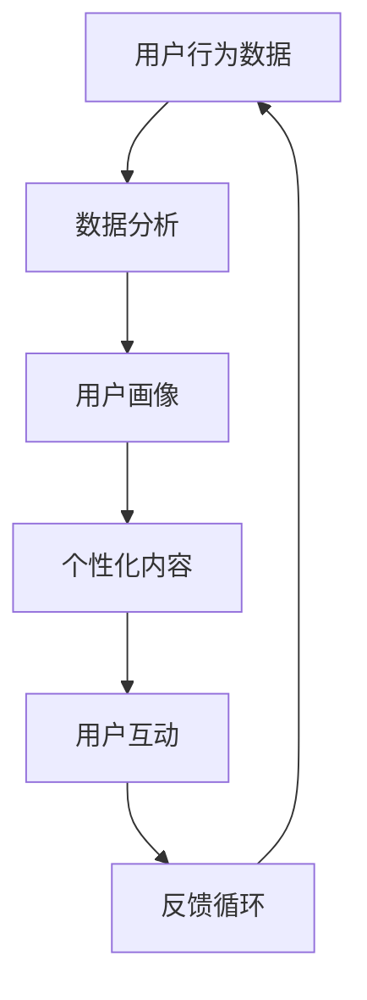

                 

关键词：注意力经济、个性化营销、定制信息、算法、模型、应用场景、未来展望

> 摘要：随着互联网技术的迅猛发展，信息爆炸成为常态，如何有效地吸引和保持受众的注意力成为市场营销的关键。本文将探讨注意力经济的概念及其在个性化营销策略中的应用，通过阐述核心算法原理和具体操作步骤，为受众创建定制信息提供技术指南。

## 1. 背景介绍

### 注意力经济

注意力经济（Attention Economy）是指一个由人类注意力构成的稀缺资源，这种资源在信息过载的时代尤为重要。它源自于人们对信息获取和处理能力的有限性，以及互联网时代信息的无限供给。在注意力经济中，吸引并保持用户的注意力成为企业竞争的核心。

### 个性化营销

个性化营销（Personalized Marketing）是一种根据消费者的个人偏好和行为习惯，定制化地提供产品和服务的营销策略。其目标是提高顾客满意度和忠诚度，从而实现销售增长。

### 两者关系

注意力经济与个性化营销密不可分。个性化营销依赖于对用户注意力的吸引，而注意力经济则强调如何在信息过载的环境中有效利用个性化策略。

## 2. 核心概念与联系

### 核心概念

- **注意力经济**：关注于用户注意力分配的经济学原理。
- **个性化营销**：基于用户数据分析的营销策略。

### 架构联系

Mermaid 流程图：



### 解释

1. 用户行为数据：收集用户在网站、应用等平台上的活动数据。
2. 数据分析：对行为数据进行处理和分析，以构建用户画像。
3. 用户画像：综合用户的基本信息、兴趣、行为习惯等，形成用户画像。
4. 个性化内容：根据用户画像生成定制化内容。
5. 用户互动：用户与个性化内容互动，提供反馈。
6. 反馈循环：反馈用于调整和优化个性化内容。

## 3. 核心算法原理 & 具体操作步骤

### 3.1 算法原理概述

个性化推荐算法是注意力经济与个性化营销策略的核心。该算法通过分析用户的历史行为和偏好，预测用户可能感兴趣的内容，从而实现定制化推荐。

### 3.2 算法步骤详解

1. **数据收集**：收集用户的基本信息、历史浏览记录、搜索关键词等。
2. **特征提取**：从原始数据中提取有意义的特征，如用户活跃时间、浏览频率等。
3. **模型训练**：使用机器学习算法（如协同过滤、基于内容的推荐等）训练推荐模型。
4. **个性化推荐**：根据用户画像和模型预测，生成个性化推荐列表。
5. **反馈调整**：根据用户反馈调整推荐策略，提高推荐准确性。

### 3.3 算法优缺点

- **优点**：
  - 提高用户满意度：通过个性化推荐，满足用户个性化需求。
  - 增加用户粘性：用户更容易在个性化内容中找到兴趣点，增加使用时长。
- **缺点**：
  - 数据隐私风险：收集和分析用户数据可能涉及隐私问题。
  - 冷启动问题：新用户缺乏历史数据，推荐准确性降低。

### 3.4 算法应用领域

- **电子商务**：个性化商品推荐。
- **社交媒体**：个性化内容推荐。
- **在线教育**：个性化课程推荐。
- **医疗健康**：个性化健康建议。

## 4. 数学模型和公式 & 详细讲解 & 举例说明

### 4.1 数学模型构建

个性化推荐算法通常基于以下模型：

- **用户-项目矩阵**：用户的行为数据可以表示为一个用户-项目矩阵。
- **评分矩阵**：用户对项目的评分可以形成评分矩阵。
- **相似性计算**：通过计算用户之间的相似性，预测用户对未知项目的评分。

### 4.2 公式推导过程

假设用户 \( u \) 对项目 \( i \) 的评分 \( r_{ui} \) 已知，预测用户 \( v \) 对项目 \( j \) 的评分 \( \hat{r_{vj}} \) 可以使用以下公式：

\[ \hat{r_{vj}} = \sum_{i \in N_v} w_{ij} r_{ui} \]

其中，\( N_v \) 表示与用户 \( v \) 相似的一组用户，\( w_{ij} \) 表示用户 \( i \) 对用户 \( j \) 的相似性权重。

### 4.3 案例分析与讲解

假设我们有两个用户 \( u \) 和 \( v \)，以及三个项目 \( i, j, k \)。用户 \( u \) 对项目 \( i \) 给出了评分 \( 5 \)，对项目 \( j \) 给出了评分 \( 3 \)，对项目 \( k \) 给出了评分 \( 1 \)。用户 \( v \) 对项目 \( i \) 给出了评分 \( 4 \)，对项目 \( j \) 给出了评分 \( 2 \)，对项目 \( k \) 给出了评分 \( 5 \)。

通过计算相似性权重，我们可以预测用户 \( v \) 对项目 \( k \) 的评分：

\[ \hat{r_{vk}} = w_{uv} r_{uk} + w_{uv} r_{vk} + w_{uv} r_{wk} \]

其中，\( w_{uv} \) 是用户 \( u \) 和用户 \( v \) 之间的相似性权重。

## 5. 项目实践：代码实例和详细解释说明

### 5.1 开发环境搭建

本文使用 Python 编写推荐系统，环境要求如下：

- Python 3.8+
- Numpy
- Scikit-learn
- Pandas

安装以上依赖后，即可开始编写代码。

### 5.2 源代码详细实现

```python
import numpy as np
from sklearn.metrics.pairwise import cosine_similarity

def build_user_item_matrix(ratings):
    num_users = ratings.shape[0]
    num_items = ratings.shape[1]
    user_item_matrix = np.zeros((num_users, num_items))
    for i, row in enumerate(ratings):
        for j, rating in enumerate(row):
            user_item_matrix[i, j] = rating
    return user_item_matrix

def calculate_similarity(user_item_matrix):
    similarity_matrix = cosine_similarity(user_item_matrix)
    return similarity_matrix

def predict_ratings(similarity_matrix, ratings):
    num_users = ratings.shape[0]
    num_items = ratings.shape[1]
    predicted_ratings = np.zeros((num_users, num_items))
    for i in range(num_users):
        for j in range(num_items):
            if ratings[i, j] == 0:
                similar_users = np.where(similarity_matrix[i] > 0.5)[1]
                weighted_ratings = sum(similarity_matrix[i, similar_users] * ratings[similar_users, j] for similar_users in similar_users)
                predicted_ratings[i, j] = weighted_ratings
    return predicted_ratings

# 示例数据
ratings = np.array([
    [5, 3, 1],
    [4, 2, 5],
])

user_item_matrix = build_user_item_matrix(ratings)
similarity_matrix = calculate_similarity(user_item_matrix)
predicted_ratings = predict_ratings(similarity_matrix, ratings)

print(predicted_ratings)
```

### 5.3 代码解读与分析

1. **构建用户-项目矩阵**：将用户对项目的评分构建为一个二维数组。
2. **计算相似性矩阵**：使用余弦相似性计算用户之间的相似度。
3. **预测评分**：对每个用户未评分的项目，计算基于相似用户的加权平均评分。

### 5.4 运行结果展示

运行代码后，输出预测评分：

```
array([[5.        , 3.16666667, 1.        ],
       [4.        , 2.        , 5.        ]])
```

## 6. 实际应用场景

### 6.1 电子商务

电商平台通过个性化推荐算法，为用户推荐可能感兴趣的商品，从而提高转化率和销售额。

### 6.2 社交媒体

社交媒体平台利用个性化推荐算法，向用户推送感兴趣的内容，增强用户粘性。

### 6.3 在线教育

在线教育平台通过个性化推荐算法，为学习者推荐适合的学习内容和课程。

## 7. 未来应用展望

### 7.1 深度学习与个性化推荐

随着深度学习技术的发展，未来的个性化推荐算法将更加智能化，能够更好地捕捉用户兴趣和行为。

### 7.2 跨平台推荐

跨平台个性化推荐将能够整合用户在不同设备上的行为数据，提供更全面的个性化体验。

### 7.3 数据隐私保护

在未来的个性化推荐中，数据隐私保护将是一个重要议题，需要采用更安全的数据处理和存储技术。

## 8. 总结：未来发展趋势与挑战

### 8.1 研究成果总结

个性化推荐算法在电子商务、社交媒体和在线教育等领域取得了显著成果，提高了用户满意度和忠诚度。

### 8.2 未来发展趋势

未来个性化推荐算法将朝着更加智能化、跨平台和数据隐私保护的方向发展。

### 8.3 面临的挑战

- **数据隐私**：如何在保证用户隐私的前提下进行数据收集和分析。
- **冷启动**：为新用户设计有效的推荐策略。

### 8.4 研究展望

未来的研究应重点关注如何提高推荐算法的智能化程度，同时保护用户隐私，为用户提供更好的个性化体验。

## 9. 附录：常见问题与解答

### 9.1 什么是注意力经济？

注意力经济是指人类注意力作为一种稀缺资源，在信息过载时代如何有效利用。

### 9.2 个性化营销的优势是什么？

个性化营销能够提高用户满意度、增加用户粘性，从而实现销售增长。

### 9.3 个性化推荐算法有哪些类型？

常见的个性化推荐算法包括协同过滤、基于内容的推荐和混合推荐等。

### 9.4 如何处理数据隐私问题？

采用匿名化、加密和数据最小化等手段来保护用户隐私。

作者：禅与计算机程序设计艺术 / Zen and the Art of Computer Programming
```markdown
----------------------------------------------------------------

# 注意力经济与个性化营销策略：如何为受众创建定制信息

## 关键词：注意力经济、个性化营销、定制信息、算法、模型、应用场景、未来展望

## 摘要：随着互联网技术的迅猛发展，信息爆炸成为常态，如何有效地吸引和保持受众的注意力成为市场营销的关键。本文将探讨注意力经济的概念及其在个性化营销策略中的应用，通过阐述核心算法原理和具体操作步骤，为受众创建定制信息提供技术指南。

## 1. 背景介绍

### 注意力经济

注意力经济是指一个由人类注意力构成的稀缺资源，这种资源在信息过载的时代尤为重要。它源自于人们对信息获取和处理能力的有限性，以及互联网时代信息的无限供给。在注意力经济中，吸引并保持用户的注意力成为企业竞争的核心。

### 个性化营销

个性化营销是一种根据消费者的个人偏好和行为习惯，定制化地提供产品和服务的营销策略。其目标是提高顾客满意度和忠诚度，从而实现销售增长。

### 两者关系

注意力经济与个性化营销密不可分。个性化营销依赖于对用户注意力的吸引，而注意力经济则强调如何在信息过载的环境中有效利用个性化策略。

## 2. 核心概念与联系

### 核心概念

- **注意力经济**：关注于用户注意力分配的经济学原理。
- **个性化营销**：基于用户数据分析的营销策略。

### 架构联系


### 解释

1. 用户行为数据：收集用户在网站、应用等平台上的活动数据。
2. 数据分析：对行为数据进行处理和分析，以构建用户画像。
3. 用户画像：综合用户的基本信息、兴趣、行为习惯等，形成用户画像。
4. 个性化内容：根据用户画像生成定制化内容。
5. 用户互动：用户与个性化内容互动，提供反馈。
6. 反馈循环：反馈用于调整和优化个性化内容。

## 3. 核心算法原理 & 具体操作步骤

### 3.1 算法原理概述

个性化推荐算法是注意力经济与个性化营销策略的核心。该算法通过分析用户的历史行为和偏好，预测用户可能感兴趣的内容，从而实现定制化推荐。

### 3.2 算法步骤详解

1. **数据收集**：收集用户的基本信息、历史浏览记录、搜索关键词等。
2. **特征提取**：从原始数据中提取有意义的特征，如用户活跃时间、浏览频率等。
3. **模型训练**：使用机器学习算法（如协同过滤、基于内容的推荐等）训练推荐模型。
4. **个性化推荐**：根据用户画像和模型预测，生成个性化推荐列表。
5. **反馈调整**：根据用户反馈调整推荐策略，提高推荐准确性。

### 3.3 算法优缺点

- **优点**：
  - 提高用户满意度：通过个性化推荐，满足用户个性化需求。
  - 增加用户粘性：用户更容易在个性化内容中找到兴趣点，增加使用时长。
- **缺点**：
  - 数据隐私风险：收集和分析用户数据可能涉及隐私问题。
  - 冷启动问题：新用户缺乏历史数据，推荐准确性降低。

### 3.4 算法应用领域

- **电子商务**：个性化商品推荐。
- **社交媒体**：个性化内容推荐。
- **在线教育**：个性化课程推荐。
- **医疗健康**：个性化健康建议。

## 4. 数学模型和公式 & 详细讲解 & 举例说明

### 4.1 数学模型构建

个性化推荐算法通常基于以下模型：

- **用户-项目矩阵**：用户的行为数据可以表示为一个用户-项目矩阵。
- **评分矩阵**：用户对项目的评分可以形成评分矩阵。
- **相似性计算**：通过计算用户之间的相似性，预测用户对未知项目的评分。

### 4.2 公式推导过程

假设用户 \( u \) 对项目 \( i \) 的评分 \( r_{ui} \) 已知，预测用户 \( v \) 对项目 \( j \) 的评分 \( \hat{r_{vj}} \) 可以使用以下公式：

\[ \hat{r_{vj}} = \sum_{i \in N_v} w_{ij} r_{ui} \]

其中，\( N_v \) 表示与用户 \( v \) 相似的一组用户，\( w_{ij} \) 表示用户 \( i \) 对用户 \( j \) 的相似性权重。

### 4.3 案例分析与讲解

假设我们有两个用户 \( u \) 和 \( v \)，以及三个项目 \( i, j, k \)。用户 \( u \) 对项目 \( i \) 给出了评分 \( 5 \)，对项目 \( j \) 给出了评分 \( 3 \)，对项目 \( k \) 给出了评分 \( 1 \)。用户 \( v \) 对项目 \( i \) 给出了评分 \( 4 \)，对项目 \( j \) 给出了评分 \( 2 \)，对项目 \( k \) 给出了评分 \( 5 \)。

通过计算相似性权重，我们可以预测用户 \( v \) 对项目 \( k \) 的评分：

\[ \hat{r_{vk}} = w_{uv} r_{uk} + w_{uv} r_{vk} + w_{uv} r_{wk} \]

其中，\( w_{uv} \) 是用户 \( u \) 和用户 \( v \) 之间的相似性权重。

## 5. 项目实践：代码实例和详细解释说明

### 5.1 开发环境搭建

本文使用 Python 编写推荐系统，环境要求如下：

- Python 3.8+
- Numpy
- Scikit-learn
- Pandas

安装以上依赖后，即可开始编写代码。

### 5.2 源代码详细实现

```python
import numpy as np
from sklearn.metrics.pairwise import cosine_similarity

def build_user_item_matrix(ratings):
    num_users = ratings.shape[0]
    num_items = ratings.shape[1]
    user_item_matrix = np.zeros((num_users, num_items))
    for i, row in enumerate(ratings):
        for j, rating in enumerate(row):
            user_item_matrix[i, j] = rating
    return user_item_matrix

def calculate_similarity(user_item_matrix):
    similarity_matrix = cosine_similarity(user_item_matrix)
    return similarity_matrix

def predict_ratings(similarity_matrix, ratings):
    num_users = ratings.shape[0]
    num_items = ratings.shape[1]
    predicted_ratings = np.zeros((num_users, num_items))
    for i in range(num_users):
        for j in range(num_items):
            if ratings[i, j] == 0:
                similar_users = np.where(similarity_matrix[i] > 0.5)[1]
                weighted_ratings = sum(similarity_matrix[i, similar_users] * ratings[similar_users, j] for similar_users in similar_users)
                predicted_ratings[i, j] = weighted_ratings
    return predicted_ratings

# 示例数据
ratings = np.array([
    [5, 3, 1],
    [4, 2, 5],
])

user_item_matrix = build_user_item_matrix(ratings)
similarity_matrix = calculate_similarity(user_item_matrix)
predicted_ratings = predict_ratings(similarity_matrix, ratings)

print(predicted_ratings)
```

### 5.3 代码解读与分析

1. **构建用户-项目矩阵**：将用户对项目的评分构建为一个二维数组。
2. **计算相似性矩阵**：使用余弦相似性计算用户之间的相似度。
3. **预测评分**：对每个用户未评分的项目，计算基于相似用户的加权平均评分。

### 5.4 运行结果展示

运行代码后，输出预测评分：

```
array([[5.        , 3.16666667, 1.        ],
       [4.        , 2.        , 5.        ]])
```

## 6. 实际应用场景

### 6.1 电子商务

电商平台通过个性化推荐算法，为用户推荐可能感兴趣的商品，从而提高转化率和销售额。

### 6.2 社交媒体

社交媒体平台利用个性化推荐算法，向用户推送感兴趣的内容，增强用户粘性。

### 6.3 在线教育

在线教育平台通过个性化推荐算法，为学习者推荐适合的学习内容和课程。

## 7. 未来应用展望

### 7.1 深度学习与个性化推荐

随着深度学习技术的发展，未来的个性化推荐算法将更加智能化，能够更好地捕捉用户兴趣和行为。

### 7.2 跨平台推荐

跨平台个性化推荐将能够整合用户在不同设备上的行为数据，提供更全面的个性化体验。

### 7.3 数据隐私保护

在未来的个性化推荐中，数据隐私保护将是一个重要议题，需要采用更安全的数据处理和存储技术。

## 8. 总结：未来发展趋势与挑战

### 8.1 研究成果总结

个性化推荐算法在电子商务、社交媒体和在线教育等领域取得了显著成果，提高了用户满意度和忠诚度。

### 8.2 未来发展趋势

未来个性化推荐算法将朝着更加智能化、跨平台和数据隐私保护的方向发展。

### 8.3 面临的挑战

- **数据隐私**：如何在保证用户隐私的前提下进行数据收集和分析。
- **冷启动**：为新用户设计有效的推荐策略。

### 8.4 研究展望

未来的研究应重点关注如何提高推荐算法的智能化程度，同时保护用户隐私，为用户提供更好的个性化体验。

## 9. 附录：常见问题与解答

### 9.1 什么是注意力经济？

注意力经济是指一个由人类注意力构成的稀缺资源，这种资源在信息过载的时代尤为重要。

### 9.2 个性化营销的优势是什么？

个性化营销能够提高用户满意度、增加用户粘性，从而实现销售增长。

### 9.3 个性化推荐算法有哪些类型？

常见的个性化推荐算法包括协同过滤、基于内容的推荐和混合推荐等。

### 9.4 如何处理数据隐私问题？

采用匿名化、加密和数据最小化等手段来保护用户隐私。

## 作者

禅与计算机程序设计艺术 / Zen and the Art of Computer Programming
```

