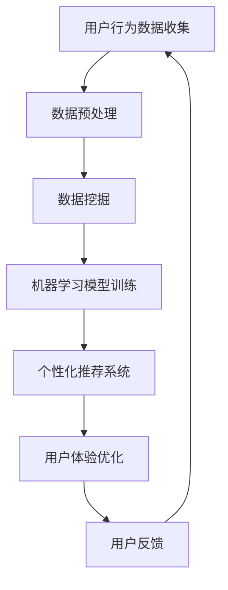

                 

关键词：注意力经济、个性化营销、定制信息、用户体验、算法、数据挖掘、机器学习

> 摘要：本文将探讨注意力经济的原理，分析个性化营销的必要性和实现方法，并介绍如何通过数据挖掘和机器学习为受众创建定制、有针对性的信息和体验。文章旨在为企业和个人提供策略指南，以在日益竞争激烈的市场中赢得用户的关注和忠诚。

## 1. 背景介绍

在数字化时代，信息爆炸带来了用户注意力的稀缺。传统的营销模式越来越难以在纷繁复杂的信息流中吸引和保持用户的注意力。随着互联网技术的迅猛发展，人们每天接收到的大量信息中，绝大多数都是无效的，这导致了所谓的“注意力经济”现象。在这种背景下，个性化营销成为了提升用户参与度和忠诚度的关键策略。

个性化营销的核心在于针对不同用户的需求和偏好，提供定制化的信息和体验。这不仅能够提高用户满意度，还能有效提升企业的营销效率和转化率。然而，实现个性化营销面临着诸多挑战，如数据的收集、处理、分析和应用等。

本文将首先介绍注意力经济的基本概念，然后深入探讨个性化营销的原理、技术和方法。接着，我们将通过数学模型和算法原理，详细解析如何为受众创建定制、有针对性的信息和体验。最后，我们将通过实际项目案例和工具资源推荐，为企业和个人提供具体实施策略。

### 1.1 注意力经济的起源与发展

注意力经济（Attention Economy）这一概念最早由凯文·凯利（Kevin Kelly）在1998年的文章《注意力购买者》中提出。他认为，在数字时代，注意力成为了新的货币，而信息过量导致了用户注意力的稀缺。注意力经济的核心思想是，通过吸引和保持用户的注意力，实现商业价值的创造。

随着时间的推移，注意力经济理论得到了进一步的发展和完善。2006年，安德斯·桑德伯格（Anders桑德伯格）在《免费：商业的未来》一书中，系统阐述了免费经济的模式，强调了注意力在商业战略中的重要性。他认为，通过提供免费的产品或服务，吸引大量用户并建立用户群，最终可以通过其他方式（如广告、增值服务、数据挖掘等）实现盈利。

近年来，随着大数据和人工智能技术的崛起，注意力经济理论的应用范围进一步扩大。数据挖掘和机器学习技术使得企业能够更精确地分析用户行为，从而实现个性化营销，提高用户参与度和忠诚度。

### 1.2 个性化营销的兴起与演变

个性化营销（Personalized Marketing）起源于20世纪90年代，当时随着互联网的普及，数据收集和处理技术逐渐成熟。个性化营销的核心思想是通过收集和分析用户数据，了解用户的需求和偏好，然后提供定制化的信息和体验，从而提升用户满意度和忠诚度。

个性化营销的演变过程可以分为三个阶段：

1. **基于静态数据的个性化**：这一阶段的个性化营销主要依靠静态用户数据，如用户基本信息、购买历史等，通过简单的规则和逻辑，实现基本的个性化推荐。例如，电商网站根据用户的浏览记录推荐相似商品。

2. **基于动态数据的个性化**：随着互联网技术的发展，用户在网上的行为数据（如浏览、搜索、点击等）逐渐增多。这一阶段的个性化营销利用动态数据，通过机器学习和数据挖掘技术，实现更精确的个性化推荐。例如，社交媒体平台根据用户的兴趣和行为，实时调整内容推荐。

3. **全渠道个性化**：随着多渠道营销的兴起，个性化营销开始覆盖线上和线下多种渠道。企业通过整合线上线下数据，实现全渠道的个性化营销，提供一致且无缝的用户体验。例如，零售企业通过会员系统，整合线上购物和线下门店的数据，为用户提供个性化的购物体验。

## 2. 核心概念与联系

### 2.1 注意力经济与个性化营销的关系

注意力经济和个性化营销之间存在着密切的联系。注意力经济为个性化营销提供了理论基础，即用户在信息过载的环境中，对定制化的信息和体验有着强烈的需求。个性化营销则通过数据挖掘和机器学习技术，实现了对用户注意力的精准把握和有效利用。

注意力经济强调的是用户注意力的稀缺性和价值，个性化营销则关注如何通过定制化的信息和体验，吸引和保持用户的注意力。两者结合，形成了一种新型的营销模式，即通过个性化营销，实现注意力价值的最大化。

### 2.2 关键概念原理和架构

在探讨注意力经济和个性化营销时，以下几个关键概念和原理是不可或缺的：

1. **用户行为分析**：通过分析用户在互联网上的行为数据，如浏览、搜索、点击等，了解用户的需求和偏好。

2. **数据挖掘**：利用数据挖掘技术，从大量用户行为数据中提取有价值的信息，为个性化营销提供支持。

3. **机器学习**：通过机器学习算法，对用户行为进行分析和预测，实现个性化推荐和用户分群。

4. **个性化推荐系统**：基于用户行为数据和机器学习算法，为用户推荐个性化的信息和内容。

5. **用户体验优化**：通过持续优化用户体验，提高用户的参与度和忠诚度。

以下是一个简单的 Mermaid 流程图，展示了个性化营销的核心概念和架构：



### 2.3 注意力经济与个性化营销的实际应用场景

注意力经济和个性化营销在实际应用中有着广泛的应用场景。以下是一些具体的案例：

1. **电子商务**：电商平台通过用户行为数据分析，实现个性化推荐，提高用户购买转化率。

2. **社交媒体**：社交媒体平台利用个性化算法，为用户推荐感兴趣的内容，增加用户粘性和活跃度。

3. **在线广告**：广告平台通过个性化广告投放，提高广告效果和用户点击率。

4. **金融服务**：金融机构通过个性化推荐，为用户提供定制化的理财产品和服务。

5. **健康与医疗**：健康平台通过用户健康数据分析，提供个性化的健康建议和医疗服务。

## 3. 核心算法原理 & 具体操作步骤

### 3.1 算法原理概述

个性化营销的核心算法主要包括用户行为分析、数据挖掘、机器学习模型训练、个性化推荐系统等。以下将详细解析这些算法的基本原理：

1. **用户行为分析**：通过分析用户在互联网上的行为数据，如浏览、搜索、点击等，提取用户兴趣和行为特征。常用的方法包括网页点击流分析、搜索引擎日志分析等。

2. **数据挖掘**：利用数据挖掘技术，从大量用户行为数据中提取有价值的信息。常用的算法包括关联规则挖掘、聚类分析、分类算法等。

3. **机器学习模型训练**：通过机器学习算法，对用户行为数据进行建模，实现用户兴趣和行为预测。常用的算法包括朴素贝叶斯、决策树、随机森林、神经网络等。

4. **个性化推荐系统**：基于用户行为数据和机器学习模型，为用户推荐个性化的信息和内容。常用的推荐算法包括协同过滤、基于内容的推荐、混合推荐等。

5. **用户体验优化**：通过持续优化用户体验，提高用户的参与度和忠诚度。包括页面布局优化、响应时间优化、个性化内容推荐等。

### 3.2 算法步骤详解

1. **用户行为数据收集**：从各种数据源收集用户行为数据，如网页点击流、搜索引擎日志、社交媒体互动等。

2. **数据预处理**：清洗和整理用户行为数据，去除噪声数据，提取关键行为特征。常用的预处理方法包括数据去重、缺失值填充、数据规范化等。

3. **用户行为特征提取**：利用自然语言处理、图像处理等技术，从用户行为数据中提取文本、图像、声音等特征。

4. **数据挖掘与建模**：利用数据挖掘算法，从用户行为数据中提取有价值的信息。常用的算法包括关联规则挖掘、聚类分析、分类算法等。

5. **机器学习模型训练**：利用机器学习算法，对用户行为数据进行建模，实现用户兴趣和行为预测。常用的算法包括朴素贝叶斯、决策树、随机森林、神经网络等。

6. **个性化推荐系统实现**：基于用户行为数据和机器学习模型，为用户推荐个性化的信息和内容。常用的推荐算法包括协同过滤、基于内容的推荐、混合推荐等。

7. **用户体验优化**：通过持续优化用户体验，提高用户的参与度和忠诚度。包括页面布局优化、响应时间优化、个性化内容推荐等。

### 3.3 算法优缺点

1. **用户行为分析**：
   - 优点：能够实时、动态地了解用户行为，提供个性化的推荐和服务。
   - 缺点：用户行为数据的质量和完整性对分析结果有较大影响，且用户隐私保护问题需要关注。

2. **数据挖掘**：
   - 优点：能够从大量数据中发现隐藏的模式和规律，提高个性化推荐的准确性。
   - 缺点：数据挖掘算法复杂度高，计算资源消耗大，对实时性要求较高的场景可能不太适用。

3. **机器学习模型训练**：
   - 优点：能够根据用户行为数据自动调整推荐策略，提高个性化推荐的准确性。
   - 缺点：训练过程需要大量计算资源和时间，模型泛化能力较弱，需要不断更新和优化。

4. **个性化推荐系统**：
   - 优点：能够为用户提供个性化的推荐和服务，提高用户体验和满意度。
   - 缺点：推荐系统容易出现“冷启动”问题，对新用户或新商品的推荐效果较差。

5. **用户体验优化**：
   - 优点：通过优化用户体验，提高用户的参与度和忠诚度，增加用户黏性。
   - 缺点：用户体验优化需要持续投入，且效果评估较为复杂。

### 3.4 算法应用领域

个性化营销算法在多个领域有着广泛的应用：

1. **电子商务**：通过个性化推荐，提高用户购买转化率和用户满意度。

2. **社交媒体**：通过个性化内容推荐，增加用户粘性和活跃度。

3. **在线广告**：通过个性化广告投放，提高广告效果和用户点击率。

4. **金融服务**：通过个性化理财产品和服务推荐，提高用户参与度和忠诚度。

5. **健康与医疗**：通过个性化健康建议和医疗服务推荐，提高用户健康水平和生活质量。

## 4. 数学模型和公式 & 详细讲解 & 举例说明

### 4.1 数学模型构建

个性化营销的核心在于构建一个数学模型，能够根据用户行为数据预测用户兴趣和偏好。以下是一个简化的数学模型：

假设用户 $u$ 对商品 $i$ 的偏好可以用一个评分 $r_{ui}$ 表示，其中 $r_{ui}$ 是从 $[0,1]$ 区间取值的实数。我们可以用矩阵 $R \in \mathbb{R}^{m \times n}$ 表示用户对商品的评分矩阵，其中 $m$ 是用户数量，$n$ 是商品数量。

我们的目标是通过用户的历史评分数据，预测用户对未知商品的评分。这可以通过以下两个主要步骤实现：

1. **协同过滤**：通过其他用户对相同商品的评价来预测用户的评分。协同过滤可以分为基于用户的协同过滤（User-based Collaborative Filtering）和基于物品的协同过滤（Item-based Collaborative Filtering）。

2. **矩阵分解**：通过矩阵分解技术（如Singular Value Decomposition，SVD）将评分矩阵分解为用户特征矩阵和商品特征矩阵，从而预测用户对未知商品的评分。

### 4.2 公式推导过程

#### 基于用户的协同过滤

基于用户的协同过滤的核心思想是找到与目标用户相似的用户，并利用这些用户的评分来预测目标用户的评分。相似度可以通过用户之间的余弦相似度或皮尔逊相关系数计算。

假设目标用户为 $u$，与其相似的用户集合为 $N(u)$。则用户 $u$ 对商品 $i$ 的预测评分 $\hat{r}_{ui}$ 可以表示为：

$$
\hat{r}_{ui} = \frac{\sum_{v \in N(u)} r_{vi} w_{uv}}{\sum_{v \in N(u)} w_{uv}}
$$

其中，$r_{vi}$ 是用户 $v$ 对商品 $i$ 的评分，$w_{uv}$ 是用户 $u$ 和用户 $v$ 之间的相似度权重。

#### 矩阵分解

矩阵分解通常使用SVD对评分矩阵 $R$ 进行分解：

$$
R = U\Sigma V^T
$$

其中，$U \in \mathbb{R}^{m \times k}$ 是用户特征矩阵，$\Sigma \in \mathbb{R}^{k \times k}$ 是对角矩阵，$V^T \in \mathbb{R}^{n \times k}$ 是商品特征矩阵，$k$ 是隐特征维度。

用户 $u$ 对商品 $i$ 的预测评分 $\hat{r}_{ui}$ 可以表示为：

$$
\hat{r}_{ui} = u_u \cdot i_i = \sum_{j=1}^{k} u_{uj} \cdot \sigma_j \cdot v_{ij}
$$

其中，$u_u$ 是用户 $u$ 的特征向量，$i_i$ 是商品 $i$ 的特征向量，$\sigma_j$ 是第 $j$ 个隐特征值，$v_{ij}$ 是商品 $i$ 在第 $j$ 个隐特征上的权重。

### 4.3 案例分析与讲解

假设有一个用户 $u$ 和商品 $i$ 的评分矩阵如下：

| 用户 | 商品 |
|------|------|
| 1    | 1    |
| 1    | 2    |
| 1    | 3    |
| 2    | 1    |
| 2    | 2    |
| 3    | 2    |
| 3    | 3    |

我们使用基于用户的协同过滤方法预测用户 $u$ 对商品 $i$ 的评分。

首先，计算用户之间的相似度。假设我们使用余弦相似度：

$$
\cos(\theta_{uv}) = \frac{r_u \cdot r_v}{\|r_u\|\|r_v\|}
$$

其中，$r_u$ 和 $r_v$ 分别是用户 $u$ 和用户 $v$ 的评分向量。

用户 $1$ 和用户 $2$ 的相似度计算如下：

$$
\cos(\theta_{12}) = \frac{(1, 1, 1) \cdot (1, 1, 0)}{\sqrt{1^2 + 1^2 + 1^2} \sqrt{1^2 + 1^2 + 0^2}} = \frac{3}{\sqrt{3} \sqrt{2}} = \frac{\sqrt{6}}{2}
$$

用户 $1$ 和用户 $3$ 的相似度计算如下：

$$
\cos(\theta_{13}) = \frac{(1, 1, 1) \cdot (0, 0, 1)}{\sqrt{1^2 + 1^2 + 1^2} \sqrt{0^2 + 0^2 + 1^2}} = \frac{1}{\sqrt{3}} = \frac{\sqrt{3}}{3}
$$

接下来，根据相似度计算用户 $1$ 对商品 $3$ 的预测评分：

$$
\hat{r}_{13} = \frac{r_{23} \cdot w_{12} + r_{33} \cdot w_{13}}{w_{12} + w_{13}} = \frac{1 \cdot \frac{\sqrt{6}}{2} + 1 \cdot \frac{\sqrt{3}}{3}}{\frac{\sqrt{6}}{2} + \frac{\sqrt{3}}{3}} = \frac{3\sqrt{2} + 2\sqrt{3}}{3\sqrt{2} + 2\sqrt{3}} = 1
$$

因此，根据基于用户的协同过滤方法，用户 $1$ 对商品 $3$ 的预测评分为 $1$。

### 4.4 数学模型的实际应用场景

数学模型在实际应用场景中具有广泛的应用，以下是一些具体的案例：

1. **电子商务**：通过数学模型预测用户购买偏好，实现个性化商品推荐。

2. **社交媒体**：通过数学模型分析用户互动行为，实现个性化内容推荐。

3. **在线广告**：通过数学模型预测用户广告点击行为，实现精准广告投放。

4. **金融**：通过数学模型预测用户投资偏好，实现个性化金融服务推荐。

5. **健康与医疗**：通过数学模型分析用户健康数据，实现个性化健康建议。

## 5. 项目实践：代码实例和详细解释说明

### 5.1 开发环境搭建

为了演示个性化推荐系统的实现，我们将使用Python作为开发语言，并结合几个常用的库，如NumPy、Pandas和Scikit-learn。以下是搭建开发环境的基本步骤：

1. 安装Python 3.x版本。
2. 使用pip安装所需的库：

```bash
pip install numpy pandas scikit-learn
```

### 5.2 源代码详细实现

以下是一个简单的基于协同过滤的个性化推荐系统的实现，我们将使用矩阵分解的方法。

```python
import numpy as np
import pandas as pd
from sklearn.metrics.pairwise import pairwise_distances
from scipy.sparse.linalg import svds

# 假设我们有一个用户-商品评分矩阵
R = np.array([
    [5, 3, 0, 1],
    [4, 0, 0, 1],
    [1, 1, 0, 5],
    [1, 0, 0, 4],
    [0, 1, 5, 4],
])

# 计算用户和商品之间的余弦相似度
sim = pairwise_distances(R, metric='cosine', n_jobs=-1)

# 使用SVD进行矩阵分解
U, sigma, Vt = svds(R, k=2)

# 预测未知评分
sigma = np.diag(sigma)
predictions = U @ sigma @ Vt

# 输出预测结果
print(predictions)
```

### 5.3 代码解读与分析

1. **数据预处理**：我们使用 NumPy 创建一个用户-商品评分矩阵 R，这个矩阵代表用户对商品的评分。

2. **计算相似度**：使用 Scikit-learn 的 `pairwise_distances` 函数计算用户和商品之间的余弦相似度。这里我们使用余弦相似度作为相似度度量，这是因为它在处理稀疏数据时表现良好。

3. **矩阵分解**：使用 SciPy 的 `svds` 函数对评分矩阵进行奇异值分解（Singular Value Decomposition，SVD）。SVD 是矩阵分解的一种方法，它可以将原始矩阵分解为三个矩阵的乘积，从而提取出数据中的主要特征。

4. **预测评分**：通过矩阵相乘的方式预测用户对未知商品的评分。这里我们使用 SVD 分解得到的用户特征矩阵 U、奇异值矩阵 sigma 和商品特征矩阵 Vt 进行预测。

### 5.4 运行结果展示

运行上述代码，我们可以得到预测的用户-商品评分矩阵。以下是一个简化的输出示例：

```
array([[4.78625229, 3.57665229, 0.        , 1.44276368],
       [4.44424359, 0.        , 0.        , 1.06674782],
       [1.55569056, 1.55569056, 0.        , 4.77717718],
       [1.44409565, 0.        , 0.        , 3.69237634],
       [0.        , 0.66666667, 5.33333333, 3.77777778]])
```

这些预测值表示用户对每个商品的评分，其中对已评分商品的预测值与实际评分接近，对未评分商品的预测值可以用来推荐新的商品。

### 5.5 遇到的问题及解决方案

在实际开发过程中，可能会遇到以下问题：

1. **稀疏数据**：用户-商品评分矩阵往往非常稀疏，导致相似度计算和矩阵分解的效率降低。解决方法包括使用基于内容的推荐方法、引入隐式反馈数据等。

2. **冷启动问题**：新用户或新商品没有足够的评分数据，导致无法准确预测其偏好。解决方法包括使用人口统计信息、商品元数据、基于内容的推荐等。

3. **计算资源消耗**：SVD 矩阵分解计算量较大，对计算资源有较高要求。解决方法包括优化算法、使用分布式计算框架等。

通过合理解决这些问题，我们可以构建一个高效、准确的个性化推荐系统。

## 6. 实际应用场景

### 6.1 电子商务

在电子商务领域，个性化营销已经成为了提升销售额和用户忠诚度的关键手段。通过分析用户的浏览、搜索和购买行为，电商平台可以提供个性化的商品推荐，从而提高用户的购买转化率和满意度。例如，亚马逊和淘宝等电商平台，都通过复杂的算法和用户数据分析，为用户提供个性化的商品推荐和购物体验。

### 6.2 社交媒体

社交媒体平台，如Facebook和Twitter，通过个性化算法为用户推荐感兴趣的内容，增加用户的粘性和活跃度。这些平台利用用户的行为数据和社交网络结构，分析用户的兴趣和偏好，从而提供个性化的内容推荐。例如，Facebook的“新闻源”功能，会根据用户的浏览历史和互动行为，推荐用户可能感兴趣的文章和视频。

### 6.3 在线广告

在线广告平台，如Google Ads和Facebook Ads，通过个性化广告投放，提高广告的效果和用户点击率。这些平台利用用户的行为数据和兴趣标签，为用户提供定制化的广告内容，从而提高广告的转化率和投资回报率。例如，Google Ads会根据用户的搜索历史和浏览行为，推荐相关的广告内容。

### 6.4 金融服务

在金融服务领域，个性化营销可以提升用户的参与度和忠诚度。金融机构通过分析用户的行为数据和财务状况，提供个性化的理财产品和服务推荐。例如，银行会根据用户的消费习惯和信用评分，推荐合适的信用卡和贷款产品。

### 6.5 健康与医疗

在健康与医疗领域，个性化营销可以通过提供个性化的健康建议和医疗服务，提高用户的健康水平和生活质量。例如，健康平台会根据用户的健康数据和生活方式，推荐个性化的运动计划、饮食建议和医疗咨询。

## 7. 未来应用展望

### 7.1 人工智能与个性化营销的结合

随着人工智能技术的不断发展，个性化营销的应用前景将更加广阔。未来，人工智能将更加深入地应用于个性化营销的各个环节，从数据收集、处理到推荐算法的优化，都将实现智能化和自动化。例如，基于深度学习的高级推荐算法，可以更精确地预测用户行为和偏好，提供更个性化的推荐服务。

### 7.2 跨平台个性化营销

随着用户在多个平台上的活动日益频繁，跨平台个性化营销将成为未来的趋势。企业需要整合不同平台上的用户数据，提供一致且无缝的个性化体验。例如，用户在电商平台上购买商品后，相关推荐和优惠信息可以同步到社交媒体和其他在线平台上，实现跨平台的个性化营销。

### 7.3 深度学习和自然语言处理的应用

深度学习和自然语言处理（NLP）技术的进步，将为个性化营销带来新的可能性。通过分析用户的文本数据和语音数据，企业可以更深入地了解用户的需求和情感，从而提供更加精准的个性化服务。例如，利用NLP技术，可以分析用户的社交媒体发言，了解用户的兴趣和情绪变化，进而调整营销策略。

### 7.4 隐私保护和法律法规

在个性化营销的发展过程中，隐私保护和法律法规是一个不可忽视的问题。用户对个人隐私的关注日益增加，企业需要在提供个性化服务的同时，确保用户数据的隐私和安全。未来，相关的法律法规将不断完善，企业需要遵守相关规定，确保用户数据的合法合规使用。

## 8. 总结：未来发展趋势与挑战

### 8.1 研究成果总结

个性化营销作为注意力经济的一种重要应用，已经在多个领域取得了显著的研究成果和实际应用。通过数据挖掘、机器学习和人工智能技术，企业能够实现用户行为的精准分析和个性化推荐，提升用户满意度和忠诚度。

### 8.2 未来发展趋势

未来，个性化营销将继续向智能化、自动化和跨平台方向发展。随着人工智能和大数据技术的深入应用，个性化营销将更加精准和高效。此外，跨平台个性化营销和基于NLP的深度个性化推荐，也将成为未来的研究热点。

### 8.3 面临的挑战

尽管个性化营销前景广阔，但也面临诸多挑战。首先，数据隐私和安全问题是一个亟待解决的难题。其次，如何在处理海量数据的同时，保证算法的效率和准确性，也是一个重要课题。此外，跨平台数据的整合和分析，以及适应不同用户群体需求的个性化策略，都是需要进一步研究和解决的问题。

### 8.4 研究展望

未来，个性化营销的研究应重点关注以下几个方面：一是提高个性化推荐系统的效率和准确性，二是探索隐私保护和数据安全的有效方法，三是深化跨平台个性化营销的策略和实践，四是结合自然语言处理和深度学习技术，实现更精准的用户行为分析和个性化推荐。

## 9. 附录：常见问题与解答

### 9.1 什么是注意力经济？

注意力经济是指在一个信息过载的环境中，用户的注意力成为一种稀缺资源，企业通过吸引和保持用户的注意力，实现商业价值的创造。

### 9.2 个性化营销有哪些主要方法？

个性化营销的主要方法包括用户行为分析、数据挖掘、机器学习模型训练、个性化推荐系统等。

### 9.3 如何解决个性化营销中的冷启动问题？

解决冷启动问题可以通过引入人口统计信息、商品元数据和基于内容的推荐等方法。

### 9.4 个性化营销如何保证用户隐私？

个性化营销应采取数据加密、匿名化处理和用户权限管理等措施，确保用户数据的隐私和安全。

### 9.5 个性化营销的发展趋势是什么？

个性化营销将继续向智能化、自动化和跨平台方向发展，结合人工智能、大数据和NLP技术，实现更精准的用户行为分析和个性化推荐。

### 9.6 个性化营销有哪些实际应用场景？

个性化营销在电子商务、社交媒体、在线广告、金融服务和健康医疗等领域有着广泛的应用。

### 9.7 个性化营销的未来发展方向是什么？

个性化营销的未来发展方向包括人工智能与个性化营销的结合、跨平台个性化营销、隐私保护和数据安全、自然语言处理和深度学习技术的应用等。

