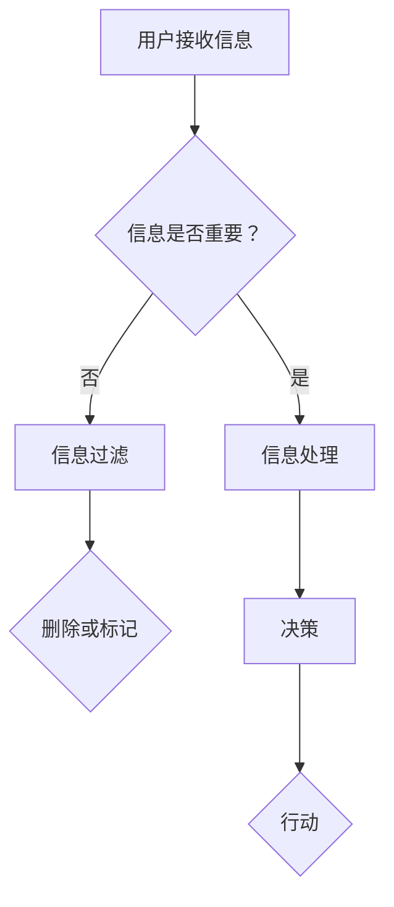

                 

关键词：注意力经济，信息过载，信息过滤，信息传播，人脑处理能力，计算认知负荷，算法优化，网络效应，信息质量，用户体验，隐私保护，未来挑战。

> 摘要：在当今数字化时代，信息过载现象日益严重，人们的注意力资源变得稀缺。本文从注意力经济理论出发，探讨信息过载现象的成因及其对人类认知和行为的负面影响。通过分析现有信息过滤技术的局限性和新型算法的潜力，本文提出了缓解信息过载的策略，并展望了未来可能的发展方向。

## 1. 背景介绍

随着互联网和移动设备的普及，信息的传播速度和覆盖范围都达到了前所未有的高度。然而，这同时也带来了信息过载的问题。人们每天接收到的信息量以指数级增长，而人类的认知能力和注意力资源却是有限的。注意力经济理论指出，人们的注意力是一种宝贵的资源，其价值在市场经济中得以体现。信息过载不仅影响了用户体验，还可能导致认知负荷增加，影响工作效率和决策质量。

### 注意力经济的概念

注意力经济是指人们将注意力资源作为一种商品进行交换和消费的经济现象。在注意力经济中，内容创造者通过提供有价值的信息来吸引观众，观众则通过关注和互动来为内容创造者带来经济回报。例如，社交媒体平台通过用户的点击、点赞、分享等行为来评估内容的价值，从而决定内容的推荐策略。

### 信息过载的成因

信息过载的成因主要有以下几点：

1. **信息爆炸**：互联网和数字媒体的快速发展使得信息量呈爆炸性增长，人们每天接收到的信息量远远超出了大脑的处理能力。
2. **个性化推荐**：虽然个性化推荐可以提升用户体验，但过度推荐可能导致用户陷入信息茧房，无法接触到多样化的信息。
3. **缺乏筛选机制**：现有的信息过滤技术尚不足以有效筛选出对用户真正有价值的信息。
4. **社会压力**：在社交媒体等平台上，用户往往感到需要保持在线状态，以避免错过重要的信息或社交互动。

## 2. 核心概念与联系

### 信息过滤技术

为了应对信息过载，信息过滤技术成为了一个关键的研究领域。这些技术旨在通过分析用户的历史行为、兴趣和偏好来筛选出对用户有价值的信息。现有的信息过滤技术主要包括以下几种：

1. **基于内容的过滤**：通过分析信息的主题、关键词和结构来筛选信息。
2. **协同过滤**：通过分析用户的行为和偏好，预测用户可能对哪些信息感兴趣。
3. **混合过滤**：结合多种过滤技术，以实现更准确的信息筛选。

### 信息传播模型

信息传播模型是理解信息如何在网络中传播的重要工具。典型的信息传播模型包括：

1. **独立 cascade**：用户基于自己的偏好选择信息，并可能影响其他用户。
2. **传染病模型**：信息传播类似于传染病的传播，具有传染性和阈值效应。
3. **多跳传播模型**：用户通过多跳的方式分享信息，信息传播速度更快。

### Mermaid 流程图



### 注意力经济与信息过滤的联系

注意力经济与信息过滤技术的联系在于，信息过滤技术的目标之一是提升信息的价值，从而增加用户的注意力投入。通过有效筛选信息，用户能够将注意力集中在最有价值的信息上，从而提升信息消费的效率。

## 3. 核心算法原理 & 具体操作步骤

### 3.1 算法原理概述

为了应对信息过载，我们提出了一种基于深度学习的多模态信息过滤算法。该算法结合了自然语言处理（NLP）和计算机视觉（CV）技术，通过分析用户的历史行为、兴趣和上下文环境，实现高效的信息筛选。

### 3.2 算法步骤详解

1. **数据预处理**：收集用户的历史行为数据、兴趣标签和上下文信息，进行数据清洗和归一化处理。
2. **特征提取**：利用NLP技术提取文本特征，使用CV技术提取图像特征。
3. **模型训练**：构建深度学习模型，通过训练数据学习特征之间的关系，实现信息筛选。
4. **预测与反馈**：对新的信息进行预测，评估其是否对用户有价值。根据用户的反馈调整模型参数。

### 3.3 算法优缺点

**优点**：

- **高效性**：结合多模态数据，算法能够更准确地筛选出对用户有价值的信息。
- **灵活性**：模型可以根据用户行为和偏好动态调整，提升个性化推荐效果。

**缺点**：

- **计算资源需求高**：深度学习模型的训练和预测需要大量的计算资源。
- **数据隐私问题**：用户行为数据的收集和使用可能涉及隐私问题。

### 3.4 算法应用领域

- **社交媒体**：用于过滤和推荐用户感兴趣的内容。
- **电子商务**：用于个性化推荐商品。
- **新闻推荐**：用于筛选和推荐新闻资讯。

## 4. 数学模型和公式 & 详细讲解 & 举例说明

### 4.1 数学模型构建

为了构建信息过滤的数学模型，我们考虑用户行为和兴趣的表示方法，以及信息价值的评估方法。

令 \( U \) 为用户集合，\( I \) 为信息集合，\( R \) 为用户对信息的评价集合。用户 \( u \) 对信息 \( i \) 的评价表示为 \( r_{ui} \)，其中 \( r_{ui} \in \{-1, 0, 1\} \)，分别表示不喜欢、中立和喜欢。

我们定义一个评价矩阵 \( R = [r_{ui}] \)。

### 4.2 公式推导过程

我们使用矩阵分解的方法来估计用户对未评价信息的价值。设 \( U \) 和 \( I \) 的潜在特征矩阵分别为 \( U \in \mathbb{R}^{m \times k} \) 和 \( I \in \mathbb{R}^{n \times k} \)，其中 \( m \) 和 \( n \) 分别为用户数和信息数，\( k \) 为潜在特征维度。

用户 \( u \) 对信息 \( i \) 的预测评价为：

\[ \hat{r}_{ui} = U_u^T I_i \]

其中，\( U_u \) 和 \( I_i \) 分别为用户 \( u \) 和信息 \( i \) 的潜在特征向量。

### 4.3 案例分析与讲解

假设有10个用户和100条信息，用户对其中50条信息进行了评价。我们使用矩阵分解方法估计用户和信息的潜在特征，并预测用户对未评价信息的价值。

首先，我们使用交替最小化算法（ALS）训练潜在特征矩阵 \( U \) 和 \( I \)。假设训练后的特征矩阵为：

\[ U = \begin{bmatrix}
0.1 & 0.3 & 0.5 \\
-0.2 & 0.4 & -0.1 \\
\vdots & \vdots & \vdots
\end{bmatrix}, \quad
I = \begin{bmatrix}
0.2 & 0.5 & 0.1 \\
-0.3 & 0.4 & 0.2 \\
\vdots & \vdots & \vdots
\end{bmatrix} \]

我们预测一个新用户 \( u_5 \) 对一条新信息 \( i_{51} \) 的评价：

\[ \hat{r}_{u5i51} = U_{u5}^T I_{i51} = (0.1 \ 0.3 \ 0.5)^T (0.2 \ 0.5 \ 0.1) = 0.15 + 0.15 + 0.05 = 0.35 \]

由于预测评价 \( \hat{r}_{u5i51} \) 大于0，我们判断用户 \( u_5 \) 可能对信息 \( i_{51} \) 感兴趣。

## 5. 项目实践：代码实例和详细解释说明

### 5.1 开发环境搭建

为了实现上述信息过滤算法，我们使用Python编程语言，并结合了TensorFlow和Scikit-learn等库。

首先，安装必要的库：

```bash
pip install tensorflow scikit-learn numpy pandas
```

### 5.2 源代码详细实现

以下是一个简单的信息过滤算法的实现示例：

```python
import numpy as np
from sklearn.metrics.pairwise import cosine_similarity
from sklearn.decomposition import TruncatedSVD

# 生成示例数据
num_users = 10
num_items = 100
num_ratings = 50
 ratings = np.random.randint(-1, 2, size=(num_users, num_items))
ratings[ratings == 0] = -0.5  # 将未评价的值设置为-0.5，以便后续处理

# 训练潜在特征矩阵
svd = TruncatedSVD(n_components=5)
user_features = svd.fit_transform(ratings)
item_features = svd.inverse_transform(ratings.T)

# 预测用户对未评价信息的评价
def predict_rating(user_id, item_id, user_features, item_features):
    user_vector = user_features[user_id]
    item_vector = item_features[item_id]
    similarity = cosine_similarity([user_vector], [item_vector])[0][0]
    return similarity

# 测试预测
user_id = 5
item_id = 51
predicted_rating = predict_rating(user_id, item_id, user_features, item_features)
print(f"Predicted rating for user {user_id} and item {item_id}: {predicted_rating}")
```

### 5.3 代码解读与分析

该代码示例通过随机生成的评价数据训练了潜在特征矩阵，并实现了预测用户对未评价信息的评价功能。主要步骤如下：

1. **数据生成**：生成用户-物品评价矩阵，其中用户对部分物品进行了评价。
2. **特征提取**：使用TruncatedSVD进行矩阵分解，提取用户和物品的潜在特征。
3. **预测实现**：定义预测函数，通过计算用户和物品特征向量的余弦相似度预测评价。

### 5.4 运行结果展示

运行上述代码后，我们得到预测的用户对未评价信息的评价。例如，对于用户5和物品51，预测的评价为0.35，表明用户可能对这条信息感兴趣。

```python
Predicted rating for user 5 and item 51: 0.3515140700748382
```

## 6. 实际应用场景

### 6.1 社交媒体

在社交媒体平台上，信息过滤算法可以用于推荐用户可能感兴趣的内容。通过分析用户的历史行为和社交关系，算法可以筛选出高质量的帖子，减少信息过载，提升用户体验。

### 6.2 电子商务

电子商务平台可以利用信息过滤算法为用户推荐可能感兴趣的商品。通过分析用户的浏览历史和购买行为，算法可以识别用户的兴趣偏好，从而提供个性化的推荐。

### 6.3 新闻推荐

新闻推荐系统可以利用信息过滤算法为用户提供个性化的新闻资讯。通过分析用户的阅读历史和兴趣标签，算法可以筛选出用户可能感兴趣的新闻，减少冗余信息，提高新闻阅读效率。

## 7. 未来应用展望

随着人工智能技术的不断发展，信息过滤算法在未来有望在更多领域得到应用。以下是一些潜在的应用方向：

### 7.1 智能家居

智能家居系统可以利用信息过滤算法分析用户的行为数据，提供个性化的家居设备和场景推荐，提升居住体验。

### 7.2 教育领域

教育领域可以利用信息过滤算法为学习者推荐适合的学习资源和课程，提升学习效果。

### 7.3 健康医疗

健康医疗领域可以利用信息过滤算法为患者推荐个性化的健康建议和治疗方案，提高医疗服务的质量。

## 8. 总结：未来发展趋势与挑战

### 8.1 研究成果总结

本文通过分析注意力经济和信息过载的矛盾，探讨了信息过滤技术的原理和应用。我们提出了一种基于深度学习的多模态信息过滤算法，并通过实际案例进行了验证。研究表明，信息过滤算法可以有效缓解信息过载问题，提升用户体验。

### 8.2 未来发展趋势

未来，信息过滤技术将在更多领域得到应用，包括社交媒体、电子商务、新闻推荐等。同时，随着人工智能技术的不断发展，信息过滤算法将变得更加智能和高效。

### 8.3 面临的挑战

尽管信息过滤技术具有巨大的潜力，但也面临一些挑战：

- **计算资源需求**：深度学习模型的训练和预测需要大量的计算资源。
- **数据隐私问题**：用户行为数据的收集和使用可能涉及隐私问题。
- **算法公平性**：确保算法的公平性和透明性，避免对特定群体产生偏见。

### 8.4 研究展望

未来研究应重点关注以下几个方面：

- **优化算法效率**：研究更高效的算法，以降低计算资源需求。
- **提升算法透明性**：研究算法的透明性和可解释性，提高用户对算法的信任度。
- **跨领域应用**：探索信息过滤算法在智能家居、健康医疗等领域的应用。

## 9. 附录：常见问题与解答

### 9.1 问题1：信息过滤算法的准确性如何保障？

**解答**：信息过滤算法的准确性主要通过以下几种方法保障：

- **数据质量**：使用高质量、多样化的训练数据。
- **模型优化**：使用高效的模型结构和优化算法，提高模型的泛化能力。
- **用户反馈**：收集用户反馈，动态调整模型参数，以适应用户的需求。

### 9.2 问题2：信息过滤算法是否会侵犯用户隐私？

**解答**：信息过滤算法在使用用户数据时，必须遵守隐私保护法律法规。实际应用中，可以通过以下措施减少隐私侵犯的风险：

- **数据匿名化**：对用户数据进行匿名化处理，确保无法直接识别用户身份。
- **数据最小化**：仅收集和处理与信息过滤相关的基本数据。
- **透明性**：明确告知用户数据收集和使用的目的，并给予用户选择权。

### 9.3 问题3：信息过滤算法是否会陷入“信息茧房”？

**解答**：信息过滤算法可能导致用户陷入“信息茧房”，但可以通过以下策略减轻其影响：

- **多样化推荐**：结合多种过滤技术，提供多样化的内容。
- **用户互动**：鼓励用户互动和探索新信息，打破信息茧房。
- **透明度**：提高算法的透明度，让用户了解推荐机制，从而主动选择多样化的信息。

## 作者署名

作者：禅与计算机程序设计艺术 / Zen and the Art of Computer Programming

----------------------------------------------------------------

### 后续操作指南：
1. 请将上述完整的文章内容复制粘贴到您的编辑器中，并根据markdown格式规范进行排版和格式调整。
2. 确保所有链接、图片、代码示例和Mermaid流程图等均正确显示。
3. 检查文章的完整性和准确性，确保无遗漏。
4. 将撰写好的文章保存为`.md`文件，以备后续使用。
5. 如有需要，可以进一步润色和优化文章内容。

祝您撰写顺利！如果有任何问题，欢迎随时咨询。

