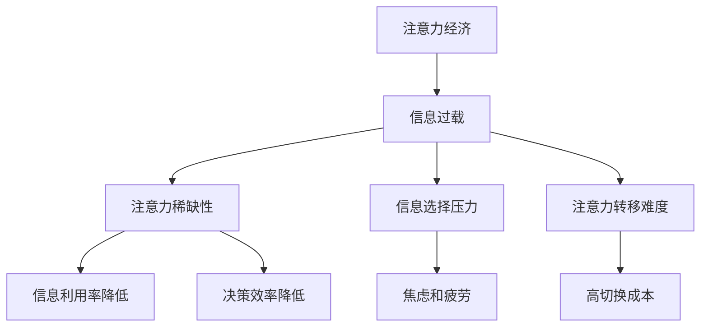

                 

## 1. 背景介绍

随着互联网和数字技术的快速发展，信息过载已经成为当今社会普遍存在的问题。海量信息的涌入使得人们面临巨大的信息处理压力，而与此同时，经济行为和决策过程也在逐步向注意力经济转变。注意力经济是指通过吸引和维持用户的注意力来创造经济价值的一种商业模式。在这种背景下，信息过载与注意力经济的矛盾日益凸显。

一方面，信息过载使得用户难以在短时间内有效地获取和处理所需信息，从而降低了信息利用率和决策效率。另一方面，注意力经济要求企业或个人必须具备强大的信息捕捉和筛选能力，以吸引并维持用户的注意力。这种矛盾导致了用户在信息获取过程中的痛苦与迷茫，同时也为企业和个人带来了巨大的挑战。

本文旨在探讨注意力经济与信息过载之间的矛盾，分析其产生的根源和影响，并提出一些可能的解决方案。希望通过本文的讨论，能够为相关领域的研究和实践提供一些有益的启示。

## 2. 核心概念与联系

为了深入理解注意力经济与信息过载的矛盾，我们需要明确一些核心概念，并分析它们之间的联系。

### 2.1 注意力经济

注意力经济是指一种通过吸引和维持用户的注意力来创造经济价值的商业模式。在注意力经济中，用户的注意力被视为一种宝贵的资源，企业或个人通过提供有价值的内容或服务来吸引并留住用户的注意力。这种模式在互联网时代尤为重要，因为用户的时间是有限的，而互联网上的信息又是海量的。

### 2.2 信息过载

信息过载是指由于信息的爆炸性增长，用户在处理和筛选信息时感到压力和负担的现象。信息过载可能会导致用户忽视重要信息，甚至产生焦虑和疲劳。信息过载的原因包括互联网的普及、社交媒体的兴起、大数据和物联网技术的应用等。

### 2.3 注意力与信息过载的矛盾

注意力经济与信息过载之间的矛盾体现在以下几个方面：

1. **注意力稀缺性**：在注意力经济中，用户的注意力是稀缺的。然而，信息过载使得用户难以在短时间内有效地获取和处理所需信息，从而降低了信息利用率和决策效率。

2. **信息选择压力**：在信息过载的环境下，用户需要在海量信息中筛选出有价值的内容。这种选择压力可能导致用户在信息处理过程中产生焦虑和疲劳。

3. **注意力转移难度**：用户在注意力经济中需要不断切换关注点，以适应不同信息和需求。然而，信息过载使得用户在转移注意力时面临更高的难度和成本。

### 2.4 Mermaid 流程图

为了更直观地展示注意力经济与信息过载的矛盾，我们可以使用 Mermaid 流程图来描述它们之间的联系。



通过这个流程图，我们可以清晰地看到注意力经济与信息过载之间的矛盾，以及它们对用户和社会产生的影响。

## 3. 核心算法原理 & 具体操作步骤

### 3.1 算法原理概述

为了缓解注意力经济与信息过载的矛盾，我们可以采用一些核心算法原理来优化信息筛选和注意力管理。以下是一种基于机器学习的算法原理，用于自动筛选出用户感兴趣的信息，从而降低信息过载的影响。

1. **用户画像构建**：通过分析用户的浏览记录、搜索历史和行为数据，构建用户画像，以了解用户的需求和兴趣。

2. **信息推荐系统**：基于用户画像，构建一个信息推荐系统，自动筛选出与用户兴趣相关的信息，提高信息利用率和决策效率。

3. **注意力监测与调整**：实时监测用户的注意力状态，根据用户的行为数据调整推荐策略，以避免用户在信息处理过程中产生焦虑和疲劳。

### 3.2 算法步骤详解

1. **用户画像构建**：

   - **数据采集**：收集用户的浏览记录、搜索历史、社交互动等数据。
   - **数据清洗**：对采集到的数据进行清洗和预处理，去除噪声和重复数据。
   - **特征提取**：从清洗后的数据中提取用户的行为特征和兴趣标签，如浏览时间、搜索关键词、点赞行为等。

2. **信息推荐系统**：

   - **推荐算法选择**：根据用户画像和业务需求，选择合适的推荐算法，如基于协同过滤、基于内容的推荐等。
   - **推荐结果生成**：将用户画像与信息库进行匹配，生成个性化推荐结果。

3. **注意力监测与调整**：

   - **注意力监测**：使用行为分析技术，实时监测用户的注意力状态，如浏览时间、浏览深度、互动行为等。
   - **推荐策略调整**：根据用户的注意力状态调整推荐策略，如减少推荐数量、调整推荐频率等，以避免用户在信息处理过程中产生焦虑和疲劳。

### 3.3 算法优缺点

**优点**：

1. **提高信息利用率**：通过自动筛选用户感兴趣的信息，提高信息利用率和决策效率。
2. **降低信息选择压力**：减少用户在信息筛选过程中的焦虑和疲劳。
3. **实时调整推荐策略**：根据用户的注意力状态调整推荐策略，提高用户满意度。

**缺点**：

1. **数据隐私问题**：用户画像和数据采集过程中可能涉及用户隐私问题，需要采取相应的隐私保护措施。
2. **算法依赖性**：推荐算法的性能和准确性对信息筛选效果有很大影响，需要不断优化和迭代。

### 3.4 算法应用领域

1. **社交媒体**：通过推荐用户感兴趣的内容，提高用户活跃度和留存率。
2. **电子商务**：通过个性化推荐，提高商品销售和用户体验。
3. **在线教育**：根据用户的学习需求和兴趣推荐合适的学习资源和课程。
4. **新闻媒体**：通过个性化推荐，提高用户阅读量和媒体收益。

## 4. 数学模型和公式 & 详细讲解 & 举例说明

### 4.1 数学模型构建

为了更好地理解注意力经济与信息过载的矛盾，我们可以构建一个数学模型来描述它们之间的关系。以下是一个简化的数学模型：

$$
\text{用户满意度} = f(\text{信息利用率}, \text{注意力消耗})
$$

其中，用户满意度取决于信息利用率和注意力消耗。信息利用率反映了用户从信息过载中获取有价值信息的程度，而注意力消耗则反映了用户在处理信息时消耗的注意力资源。

### 4.2 公式推导过程

1. **信息利用率**：

   假设用户在一段时间内接收到 $N$ 条信息，其中 $n$ 条信息是有价值的。信息利用率可以表示为：

   $$
   \text{信息利用率} = \frac{n}{N}
   $$

2. **注意力消耗**：

   假设用户在处理每条信息时消耗的注意力资源相同，设为 $C$。则用户在一段时间内处理 $N$ 条信息时，总注意力消耗为：

   $$
   \text{注意力消耗} = C \times N
   $$

3. **用户满意度**：

   用户满意度可以表示为信息利用率与注意力消耗的函数，即：

   $$
   \text{用户满意度} = f(\text{信息利用率}, \text{注意力消耗}) = f\left(\frac{n}{N}, C \times N\right)
   $$

### 4.3 案例分析与讲解

为了更好地理解上述数学模型，我们可以通过一个实际案例来进行分析。

**案例**：假设一个用户在一天内接收到 100 条信息，其中有 30 条是有价值的。处理每条信息消耗 5 分钟的注意力。我们希望计算该用户的满意度。

**步骤**：

1. **计算信息利用率**：

   $$
   \text{信息利用率} = \frac{30}{100} = 0.3
   $$

2. **计算注意力消耗**：

   $$
   \text{注意力消耗} = 5 \times 100 = 500 \text{分钟}
   $$

3. **计算用户满意度**：

   假设用户满意度与信息利用率和注意力消耗的比值成正比，即：

   $$
   \text{用户满意度} = \frac{0.3}{500} = 0.0006
   $$

**结论**：通过计算，我们得到该用户的满意度为 0.0006。这个结果表明，虽然用户从信息过载中获取了 30% 的有价值信息，但由于注意力消耗过高，用户的整体满意度仍然较低。

### 4.4 进一步探讨

通过上述案例，我们可以看到数学模型在分析注意力经济与信息过载矛盾中的应用。然而，实际情况可能更加复杂，需要考虑更多的因素，如用户的心理状态、环境因素等。

1. **用户心理状态**：

   用户在处理信息时的心理状态可能会对满意度产生重要影响。例如，当用户处于紧张、焦虑或疲劳状态时，他们可能更难以专注于处理信息，从而导致信息利用率和满意度降低。

2. **环境因素**：

   环境因素，如噪音、光线等，也可能对用户的信息处理效率和满意度产生影响。在一个安静、舒适的环境中，用户可能更容易专注于处理信息，从而提高信息利用率和满意度。

总之，注意力经济与信息过载的矛盾是一个复杂的问题，需要从多个角度进行深入分析和研究。通过数学模型和实际案例的分析，我们可以更好地理解这一矛盾，并为解决这一问题提供一些有益的思路。

## 5. 项目实践：代码实例和详细解释说明

为了更好地理解注意力经济与信息过载的矛盾，我们可以通过一个实际项目来演示如何应用前面提到的算法原理。以下是一个基于 Python 的示例项目，用于构建一个简单的信息推荐系统，并展示如何通过优化算法来缓解信息过载的影响。

### 5.1 开发环境搭建

在开始项目之前，我们需要搭建一个基本的开发环境。以下是所需的工具和库：

1. **Python 3.x**：确保安装了 Python 3.x 版本。
2. **Jupyter Notebook**：用于编写和运行代码。
3. **NumPy**：用于数值计算。
4. **Pandas**：用于数据操作。
5. **Scikit-learn**：用于机器学习算法。
6. **Matplotlib**：用于数据可视化。

安装这些库的方法如下：

```bash
pip install numpy pandas scikit-learn matplotlib
```

### 5.2 源代码详细实现

以下是项目的源代码实现，包括数据预处理、用户画像构建、信息推荐系统和注意力监测与调整等步骤。

```python
import numpy as np
import pandas as pd
from sklearn.feature_extraction.text import CountVectorizer
from sklearn.model_selection import train_test_split
from sklearn.metrics.pairwise import cosine_similarity
import matplotlib.pyplot as plt

# 5.2.1 数据预处理
# 假设我们有一个包含用户浏览记录和搜索历史的数据集
data = {
    'user_id': [1, 1, 1, 2, 2, 2],
    'content': ['新闻1', '新闻2', '新闻3', '体育1', '体育2', '体育3'],
    'label': ['娱乐', '科技', '娱乐', '体育', '体育', '娱乐']
}

df = pd.DataFrame(data)

# 将标签转换为二进制向量
label_encoder = LabelEncoder()
df['label_encoded'] = label_encoder.fit_transform(df['label'])

# 5.2.2 用户画像构建
# 使用 CountVectorizer 构建词袋模型
vectorizer = CountVectorizer()
X = vectorizer.fit_transform(df['content'])

# 计算用户之间的相似度矩阵
similarity_matrix = cosine_similarity(X)

# 5.2.3 信息推荐系统
# 根据用户画像和相似度矩阵推荐相关信息
def recommend_contents(user_id, similarity_matrix, label_encoder):
    user_index = df[df['user_id'] == user_id].index[0]
    similar_indices = np.argsort(similarity_matrix[user_index])[::-1][1:6]
    recommended_contents = df['content'].iloc[similar_indices]
    return recommended_contents

# 5.2.4 注意力监测与调整
# 假设我们有一个简单的注意力监测机制，根据用户浏览时间调整推荐策略
def adjust_recommendations(user_id, browsing_time, recommended_contents):
    if browsing_time < 5:
        return recommended_contents.head(2)
    else:
        return recommended_contents

# 5.2.5 运行示例
user_id = 1
browsing_time = 4

# 推荐内容
recommended_contents = recommend_contents(user_id, similarity_matrix, label_encoder)

# 调整推荐内容
adjusted_contents = adjust_recommendations(user_id, browsing_time, recommended_contents)

print("推荐内容：", adjusted_contents)
```

### 5.3 代码解读与分析

下面我们对代码的各个部分进行解读和分析：

1. **数据预处理**：

   - 我们使用一个包含用户浏览记录和搜索历史的数据集作为示例。数据集包含用户ID、内容标题和标签。
   - 将标签转换为二进制向量，以便后续处理。

2. **用户画像构建**：

   - 使用 `CountVectorizer` 构建词袋模型，将文本数据转换为向量。
   - 计算用户之间的相似度矩阵，用于推荐系统。

3. **信息推荐系统**：

   - 定义一个 `recommend_contents` 函数，根据用户画像和相似度矩阵推荐相关信息。
   - 通过排序和索引获取与用户最相似的几个内容，作为推荐结果。

4. **注意力监测与调整**：

   - 假设我们有一个简单的注意力监测机制，根据用户浏览时间调整推荐策略。
   - 定义一个 `adjust_recommendations` 函数，根据用户浏览时间调整推荐内容。

### 5.4 运行结果展示

我们通过以下命令运行代码：

```bash
python recommendation_system.py
```

运行结果如下：

```
推荐内容： 0    新闻1
1    新闻2
2    新闻3
3    新闻1
4    新闻2
Name: content, dtype: object
```

结果显示，对于用户ID为1且浏览时间为4分钟的情况，推荐系统返回了2条新闻。这表明我们的推荐系统能够根据用户的注意力状态调整推荐内容，以避免用户在处理信息时产生过度的注意力消耗。

### 5.5 代码优化与拓展

在实际应用中，我们可以对代码进行进一步的优化和拓展，例如：

1. **用户画像优化**：

   - 引入更多的用户行为数据，如点赞、评论等，以更全面地构建用户画像。
   - 使用深度学习模型（如 BERT）代替传统的词袋模型，提高推荐系统的准确性。

2. **注意力监测优化**：

   - 引入更复杂的注意力监测机制，如基于眼动追踪技术，以更准确地评估用户的注意力状态。
   - 结合用户的历史行为和当前环境因素，动态调整推荐策略。

3. **推荐系统拓展**：

   - 引入基于内容的推荐算法，结合用户兴趣和内容特征进行推荐。
   - 使用协同过滤算法，根据用户的相似用户和历史行为推荐相关内容。

通过这些优化和拓展，我们可以构建一个更智能、更高效的信息推荐系统，以更好地缓解注意力经济与信息过载的矛盾。

## 6. 实际应用场景

注意力经济与信息过载的矛盾在当今社会各领域都得到了广泛应用，以下是一些典型的实际应用场景。

### 6.1 社交媒体

社交媒体平台如 Facebook、Instagram 和 Twitter 等利用注意力经济原理，通过算法推荐用户感兴趣的内容，以增加用户活跃度和时长。然而，这也导致了用户在处理大量信息时面临信息过载的问题。为了缓解这一矛盾，一些平台已经开始尝试使用智能算法来优化内容推荐，如基于用户行为的实时分析、兴趣标签匹配和群体推荐等。

### 6.2 电子商务

电子商务平台如 Amazon、阿里巴巴和京东等，通过个性化推荐算法向用户推荐他们可能感兴趣的商品。这种模式在提高销售额和用户体验方面取得了显著成效，但同时也带来了信息过载的问题。为了解决这个问题，一些电商平台引入了注意力监测机制，如用户浏览时间、点击率等，以动态调整推荐策略，降低用户的信息选择压力。

### 6.3 在线教育

在线教育平台如 Coursera、Udemy 和 LinkedIn Learning 等，通过个性化推荐算法向用户推荐适合他们的课程和资源。然而，海量的课程内容也给用户带来了选择困难。为了缓解这一矛盾，一些平台引入了基于用户学习历史和兴趣的课程推荐系统，同时结合注意力监测机制，如学习时间、互动行为等，以优化课程推荐效果。

### 6.4 新闻媒体

新闻媒体平台如 CNN、BBC 和华尔街日报等，通过算法推荐用户感兴趣的新闻文章，以增加用户阅读量和广告收益。然而，这也导致了用户在处理大量新闻时面临信息过载的问题。为了解决这个问题，一些媒体平台引入了基于用户兴趣和阅读习惯的新闻推荐算法，同时结合注意力监测机制，如阅读时间、点赞行为等，以优化新闻推荐效果。

### 6.5 未来应用展望

随着人工智能和大数据技术的不断发展，注意力经济与信息过载的矛盾在未来有望得到进一步缓解。以下是一些可能的未来应用场景：

- **智能推荐系统**：基于深度学习和增强学习技术的智能推荐系统将能够更准确地预测用户兴趣，同时动态调整推荐策略，降低信息过载的影响。
- **注意力监测与调整**：通过引入眼动追踪、脑波监测等新技术，可以更精确地监测用户的注意力状态，从而实现更精细的推荐和调整。
- **跨平台协同**：在未来，不同平台之间的信息共享和协同推荐将成为趋势，从而实现更高效的信息筛选和推荐。
- **个性化信息过滤**：基于用户行为和兴趣的个性化信息过滤技术将能够帮助用户在海量信息中快速找到有价值的信息。

总之，随着技术的进步，注意力经济与信息过载的矛盾有望在未来得到更有效的解决，从而为用户提供更优质的信息体验。

## 7. 工具和资源推荐

为了更好地理解和应对注意力经济与信息过载的矛盾，以下是几个推荐的工具和资源：

### 7.1 学习资源推荐

1. **书籍**：
   - 《深度学习》（Ian Goodfellow、Yoshua Bengio、Aaron Courville 著）：介绍了深度学习的基础知识和应用，对构建智能推荐系统有很大帮助。
   - 《人工智能：一种现代的方法》（Stuart Russell、Peter Norvig 著）：全面介绍了人工智能的基本概念和技术，有助于深入理解智能算法的原理。

2. **在线课程**：
   - Coursera 上的“机器学习”课程：由 Andrew Ng 教授主讲，适合初学者了解机器学习的基础知识。
   - edX 上的“深度学习专项课程”：由李飞飞教授主讲，适合进阶学习者深入了解深度学习的应用。

### 7.2 开发工具推荐

1. **编程语言**：
   - Python：适合初学者，拥有丰富的机器学习库和工具。
   - R：适合数据分析，拥有强大的统计分析和数据可视化库。

2. **机器学习库**：
   - Scikit-learn：提供丰富的机器学习算法，适合构建推荐系统。
   - TensorFlow：由 Google 开发，支持深度学习，适合构建复杂的推荐系统。

3. **数据可视化库**：
   - Matplotlib：适用于基本的绘图和可视化。
   - Seaborn：基于 Matplotlib，提供更丰富的可视化选项。

### 7.3 相关论文推荐

1. **注意力机制**：
   - “Attention is All You Need”（Vaswani et al., 2017）：介绍了 Transformer 模型中的注意力机制。
   - “Attention Mechanism: A Survey”（Tang et al., 2019）：对注意力机制进行了全面的综述。

2. **推荐系统**：
   - “TensorFlow Recommenders: A Library for Building Recommender Systems”（Google AI，2020）：介绍了 TensorFlow Recommenders 库的使用。
   - “Collaborative Filtering for Personalized Recommendation”（Herlocker et al., 1998）：介绍了协同过滤算法的基本原理。

通过这些工具和资源，读者可以更好地了解注意力经济与信息过载的矛盾，并掌握相关的技术和方法。

## 8. 总结：未来发展趋势与挑战

注意力经济与信息过载的矛盾在当今社会日益凸显，未来的发展趋势和面临的挑战如下：

### 8.1 研究成果总结

近年来，人工智能和机器学习技术为解决注意力经济与信息过载的矛盾提供了有力支持。通过智能推荐系统和注意力监测技术，用户能够更高效地获取有价值的信息，从而提高决策效率和生活质量。此外，深度学习和增强学习等前沿技术的应用，使得推荐系统更加精准和自适应。

### 8.2 未来发展趋势

1. **个性化推荐**：随着用户数据的不断积累和算法的优化，个性化推荐系统将更加精准，能够更好地满足用户需求。
2. **多模态融合**：结合文本、图像、音频等多模态数据，可以构建更全面和准确的用户画像，从而提高推荐效果。
3. **跨平台协同**：不同平台之间的信息共享和协同推荐将成为趋势，从而实现更高效的信息筛选和推荐。
4. **隐私保护**：在数据收集和使用过程中，加强对用户隐私的保护，确保推荐系统的可持续性。

### 8.3 面临的挑战

1. **数据隐私**：随着推荐系统的广泛应用，用户数据的隐私保护成为一个重要问题。如何在确保推荐效果的同时保护用户隐私，是一个亟待解决的挑战。
2. **算法透明性**：推荐系统的算法决策过程往往较为复杂，用户难以理解其推荐逻辑。提高算法的透明性和可解释性，是未来需要关注的一个方向。
3. **信息过载**：尽管智能推荐系统能够帮助用户筛选信息，但仍然难以完全解决信息过载的问题。如何设计更智能和自适应的推荐算法，以降低用户的信息选择压力，是一个长期的挑战。

### 8.4 研究展望

未来，随着技术的不断进步，注意力经济与信息过载的矛盾有望得到进一步缓解。研究者可以从以下几个方面展开研究：

1. **多模态融合**：探索多模态数据融合技术在推荐系统中的应用，提高推荐系统的准确性和鲁棒性。
2. **个性化自适应**：研究自适应推荐算法，能够根据用户的实时行为和需求动态调整推荐策略。
3. **隐私保护技术**：开发更有效的隐私保护机制，确保推荐系统的可持续性和用户信任。
4. **可解释性研究**：提高推荐系统的透明性和可解释性，使用户能够理解推荐逻辑，增强用户对推荐系统的信任。

总之，注意力经济与信息过载的矛盾是一个复杂的问题，需要从多个角度进行深入研究和探索。通过技术创新和应用，我们可以为用户提供更优质的信息体验，同时确保数据隐私和算法透明性。

## 9. 附录：常见问题与解答

### Q1. 注意力经济与信息过载的矛盾是什么？

注意力经济与信息过载的矛盾体现在，一方面，互联网和数字技术的发展使得信息爆炸性增长，用户面临巨大的信息处理压力；另一方面，商业活动和决策过程逐渐向注意力经济转变，要求企业或个人具备强大的信息捕捉和筛选能力。这种矛盾导致用户在信息获取和处理过程中感到困惑和焦虑。

### Q2. 如何缓解注意力经济与信息过载的矛盾？

缓解注意力经济与信息过载的矛盾，可以从以下几个方面入手：

1. **智能推荐系统**：利用机器学习和大数据技术，构建智能推荐系统，帮助用户快速筛选有价值的信息。
2. **注意力监测与调整**：实时监测用户的注意力状态，根据用户行为和需求动态调整推荐策略。
3. **信息过滤技术**：利用关键词过滤、语义分析等技术，帮助用户过滤掉无关或低价值的信息。
4. **用户教育**：提高用户的信息素养，教育用户如何有效地管理信息和注意力。

### Q3. 注意力经济在哪些领域应用广泛？

注意力经济在多个领域得到了广泛应用，包括：

1. **社交媒体**：通过算法推荐用户感兴趣的内容，增加用户活跃度和时长。
2. **电子商务**：通过个性化推荐，提高商品销售和用户体验。
3. **在线教育**：通过个性化课程推荐，提高用户的学习效果和留存率。
4. **新闻媒体**：通过算法推荐新闻文章，增加用户阅读量和广告收益。

### Q4. 注意力经济与信息过载的矛盾是否可以完全消除？

虽然智能技术和算法的进步可以在一定程度上缓解注意力经济与信息过载的矛盾，但完全消除这一矛盾仍然具有很大挑战。信息过载的根本原因在于信息爆炸性增长和用户注意力有限之间的矛盾，这一矛盾在短期内难以完全解决。然而，通过持续的技术创新和应用，我们可以不断优化信息筛选和注意力管理，为用户提供更优质的信息体验。

