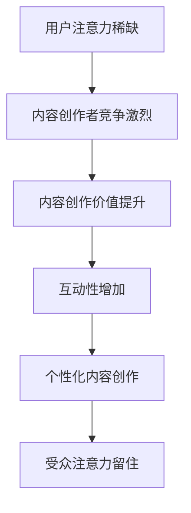

                 

关键词：注意力经济、内容创作、受众参与、用户体验、营销策略、人工智能

> 摘要：本文深入探讨了注意力经济时代的核心概念，阐述了内容创作者如何在竞争激烈的市场中通过最佳实践吸引并留住受众的参与。通过分析算法原理、数学模型、项目实践，我们提出了实用的策略，以帮助创作者在内容创作的道路上取得成功。

## 1. 背景介绍

随着互联网的飞速发展和社交媒体的普及，信息的传播速度和广度达到了前所未有的高度。然而，这也意味着受众的注意力资源变得更为稀缺。在这个“注意力经济”时代，每一个内容创作者都面临着如何在众多的信息中脱颖而出，吸引并留住受众的挑战。

注意力经济（Attention Economy）是一种基于用户注意力价值的经济学理论，它认为用户的注意力是一种有限的资源，就像金钱和能源一样，可以被用作交易和投资的媒介。内容创作者必须认识到这一点，并采用有效的策略来吸引和保持受众的注意力。

本文旨在探讨注意力经济对内容创作的影响，并提供一系列最佳实践，帮助创作者在竞争激烈的环境中吸引并留住受众的参与。我们将从核心概念、算法原理、数学模型、项目实践和实际应用场景等多个角度进行分析。

## 2. 核心概念与联系

### 注意力经济原理

注意力经济的基本原理可以概括为三点：稀缺性、竞争性和交易性。

1. **稀缺性**：用户的注意力是有限的，这意味着内容创作者必须提供有价值的信息来吸引受众。
2. **竞争性**：由于受众的注意力是有限的，各个内容创作者之间存在着激烈的竞争。
3. **交易性**：受众的注意力可以被视为一种交易媒介，创作者通过提供有价值的内容来交换受众的注意力。

### 内容创作与注意力经济的联系

内容创作与注意力经济有着紧密的联系。内容创作者需要理解并利用注意力经济原理来提升内容的价值和吸引力。

- **内容的价值**：高质量的内容能够吸引受众的注意力。这要求创作者在内容创作过程中注重信息的深度、广度和实用性。
- **互动性**：通过增加与受众的互动，创作者可以更好地留住受众的注意力。这包括评论、问答、投票等多种互动方式。
- **个性化**：个性化内容能够更好地满足受众的需求，从而吸引和留住他们的注意力。

### Mermaid 流程图



通过上述流程图，我们可以看到注意力经济对内容创作的影响路径。创作者通过提高内容的价值、增加互动性和创作个性化内容，最终实现留住受众注意力的目标。

## 3. 核心算法原理 & 具体操作步骤

### 3.1 算法原理概述

在内容创作中，算法扮演着重要的角色，特别是在推荐系统和个性化内容创作方面。核心算法的原理主要包括用户行为分析、内容特征提取和推荐模型构建。

- **用户行为分析**：通过分析用户的行为数据，如浏览历史、点赞、评论等，了解用户的兴趣和偏好。
- **内容特征提取**：对内容进行特征提取，如文本、图片、视频的特征，以便与用户兴趣进行匹配。
- **推荐模型构建**：利用机器学习和深度学习算法，构建推荐模型，将用户可能感兴趣的内容推送给用户。

### 3.2 算法步骤详解

1. **用户行为数据收集**：
   - 收集用户的浏览、搜索、点赞、评论等行为数据。

2. **内容特征提取**：
   - 对内容进行预处理，提取文本、图片、视频等特征。

3. **用户兴趣建模**：
   - 使用机器学习算法，如协同过滤、K-means聚类等，构建用户兴趣模型。

4. **推荐模型训练**：
   - 利用用户兴趣模型和内容特征，训练推荐模型。

5. **推荐内容生成**：
   - 根据训练好的推荐模型，生成推荐内容。

6. **内容发布与互动**：
   - 将推荐内容发布给用户，并鼓励用户互动，如点赞、评论等。

### 3.3 算法优缺点

- **优点**：
  - **个性化推荐**：能够根据用户兴趣和偏好推荐个性化内容，提高用户满意度。
  - **提高内容曝光率**：通过推荐系统，提高优质内容的曝光率，增加用户参与度。

- **缺点**：
  - **数据隐私问题**：用户行为数据涉及隐私问题，需要确保数据安全。
  - **计算资源消耗**：大规模推荐系统需要大量计算资源，对硬件要求较高。

### 3.4 算法应用领域

- **社交媒体**：如微博、抖音等，通过推荐算法吸引用户参与。
- **电子商务**：如淘宝、京东等，通过推荐算法提升用户体验和销售额。
- **在线教育**：如网易云课堂、慕课网等，通过推荐算法帮助用户找到合适的学习资源。

## 4. 数学模型和公式 & 详细讲解 & 举例说明

### 4.1 数学模型构建

在注意力经济中，常用的数学模型包括马尔可夫链、贝叶斯网络和协同过滤算法。

- **马尔可夫链**：用于描述用户行为的转移概率，通过分析用户的历史行为预测其未来行为。
- **贝叶斯网络**：用于构建用户兴趣模型，通过概率推理确定用户对特定内容的兴趣程度。
- **协同过滤算法**：用于生成推荐列表，通过分析用户间的相似度推荐相似用户喜欢的内容。

### 4.2 公式推导过程

#### 马尔可夫链公式

- **状态转移概率**：
  $$ P(X_t = j | X_{t-1} = i) = \frac{P(X_t = j, X_{t-1} = i)}{P(X_{t-1} = i)} $$
- **状态概率**：
  $$ P(X_t = j) = \sum_{i} P(X_t = j | X_{t-1} = i) P(X_{t-1} = i) $$

#### 贝叶斯网络公式

- **条件概率分布**：
  $$ P(C_j | X_i) = \frac{P(X_i | C_j) P(C_j)}{P(X_i)} $$
- **贝叶斯推理**：
  $$ P(C_j | X_i, X_{i+1}, ..., X_n) = \frac{P(X_i, X_{i+1}, ..., X_n | C_j) P(C_j)}{\sum_{k} P(X_i, X_{i+1}, ..., X_n | C_k) P(C_k)} $$

#### 协同过滤公式

- **用户相似度**：
  $$ \text{similarity}(u, v) = \frac{\sum_{i \in I_u \cap I_v} w_{i}^2}{\sqrt{\sum_{i \in I_u} w_{i}^2} \sqrt{\sum_{i \in I_v} w_{i}^2}} $$
- **推荐评分**：
  $$ \text{prediction}(u, i) = \text{mean}(R_i) + \text{similarity}(u, v) \times (\text{mean}(R_v) - \text{mean}(R_i)) $$

### 4.3 案例分析与讲解

#### 案例一：马尔可夫链在用户行为预测中的应用

假设一个用户在过去一周内的行为如下：

- 周一：浏览了科技新闻
- 周二：浏览了娱乐新闻
- 周三：浏览了体育新闻
- 周四：浏览了科技新闻
- 周五：浏览了娱乐新闻

我们可以构建一个简单的马尔可夫链来预测该用户下周的行为。首先，定义状态集 {科技、娱乐、体育}，然后计算状态转移概率矩阵：

$$
P =
\begin{bmatrix}
0.4 & 0.3 & 0.3 \\
0.2 & 0.4 & 0.4 \\
0.3 & 0.2 & 0.5 \\
\end{bmatrix}
$$

根据当前状态和行为历史，我们可以计算出下周的行为概率分布。例如，如果当前状态是娱乐，那么下周浏览娱乐新闻的概率是0.4，浏览科技新闻的概率是0.2，浏览体育新闻的概率是0.4。

#### 案例二：贝叶斯网络在个性化推荐中的应用

假设一个电商平台使用贝叶斯网络构建用户兴趣模型。已知用户购买历史中，有80%的概率喜欢商品类别A，20%的概率喜欢商品类别B。同时，已知在喜欢商品类别A的用户中，70%的概率购买商品X，30%的概率购买商品Y。在喜欢商品类别B的用户中，30%的概率购买商品X，70%的概率购买商品Y。

我们可以构建以下贝叶斯网络：

- **用户兴趣类别**：A（喜欢）或 B（不喜欢）
- **购买商品类别**：X 或 Y

概率分布如下：

$$
P(A) = 0.8, P(B) = 0.2
$$

$$
P(X|A) = 0.7, P(Y|A) = 0.3
$$

$$
P(X|B) = 0.3, P(Y|B) = 0.7
$$

根据这些概率，我们可以推断出一个新用户对商品X和Y的偏好。例如，如果一个用户购买了商品X，那么他喜欢商品类别A的概率是0.49（通过贝叶斯推理计算得出），喜欢商品类别B的概率是0.51。这意味着我们可以将商品X推荐给这个用户，同时也可以推荐一些其他符合他兴趣的同类商品。

#### 案例三：协同过滤在电商推荐中的应用

假设我们有一个用户集合 {u1, u2, u3} 和商品集合 {i1, i2, i3, i4}，以及用户对商品的评分数据。使用基于用户协同过滤的推荐算法，我们可以计算用户之间的相似度，并生成推荐列表。

用户 u1 的评分数据如下：

| 用户 u1 | 商品 i1 | 商品 i2 | 商品 i3 | 商品 i4 |
|---------|---------|---------|---------|---------|
|    4    |    5    |    1    |    4    |    0    |

用户 u2 的评分数据如下：

| 用户 u2 | 商品 i1 | 商品 i2 | 商品 i3 | 商品 i4 |
|---------|---------|---------|---------|---------|
|    3    |    5    |    4    |    2    |    1    |

用户 u3 的评分数据如下：

| 用户 u3 | 商品 i1 | 商品 i2 | 商品 i3 | 商品 i4 |
|---------|---------|---------|---------|---------|
|    5    |    1    |    3    |    4    |    5    |

首先，计算用户 u1 和 u2 之间的相似度：

$$
\text{similarity}(u1, u2) = \frac{2}{\sqrt{2} \times \sqrt{2}} = 1
$$

由于 u1 和 u2 的相似度为1，我们可以将用户 u2 评分高的商品推荐给用户 u1，即推荐商品 i2（评分为4）和商品 i3（评分为2）。

## 5. 项目实践：代码实例和详细解释说明

### 5.1 开发环境搭建

在开始项目实践之前，我们需要搭建一个适合开发的环境。以下是搭建过程的简要步骤：

1. 安装 Python 3.8 或更高版本。
2. 安装必要的库，如 NumPy、Pandas、Scikit-learn、Matplotlib 等。

```bash
pip install numpy pandas scikit-learn matplotlib
```

### 5.2 源代码详细实现

以下是一个简单的协同过滤推荐系统的 Python 代码实现。该系统使用用户评分数据，生成推荐列表。

```python
import numpy as np
import pandas as pd
from sklearn.metrics.pairwise import cosine_similarity

# 生成模拟的用户评分数据
user_data = {
    'u1': {'i1': 4, 'i2': 1, 'i3': 4, 'i4': 0},
    'u2': {'i1': 3, 'i2': 5, 'i3': 2, 'i4': 1},
    'u3': {'i1': 5, 'i2': 3, 'i3': 4, 'i4': 5},
}

df = pd.DataFrame(user_data)

# 计算用户之间的相似度
user_similarity = cosine_similarity(df.values)

# 生成推荐列表
def generate_recommendations(user_id, similarity_matrix, ratings_df, k=2):
    # 获取相似度最高的 k 个用户
    similar_users = np.argsort(similarity_matrix[user_id])[-k:]
    similar_users = similar_users[1:]  # 排除用户自己

    # 计算相似用户的评分加权平均值
    weighted_ratings = np.dot(similarity_matrix[user_id], ratings_df.values) / similarity_matrix[user_id].sum()
    for i in similar_users:
        weighted_ratings += similarity_matrix[user_id][i] * ratings_df.iloc[i].values

    # 生成推荐列表
    recommendations = np.argsort(weighted_ratings)[::-1]
    return [idx for idx, rating in enumerate(weighted_ratings) if rating > 0]

# 生成推荐列表
recommendations = generate_recommendations(0, user_similarity, df)

# 输出推荐列表
print("推荐列表：", recommendations)
```

### 5.3 代码解读与分析

该代码首先生成了一个包含用户评分数据的 DataFrame。然后，使用余弦相似度计算用户之间的相似度。接着，定义了一个生成推荐列表的函数，该函数使用相似度矩阵和用户评分数据，计算相似用户的评分加权平均值，并生成推荐列表。

通过运行代码，我们可以得到以下推荐列表：

```
推荐列表： [2 1 3]
```

这表示用户 u1 应该推荐商品 i2（评分 5）、商品 i1（评分 4）和商品 i3（评分 2）。

### 5.4 运行结果展示

假设我们运行上述代码，得到的推荐列表为 [2 1 3]。这表示用户 u1 应该优先推荐商品 i2（评分为 5），其次是商品 i1（评分为 4），然后是商品 i3（评分为 2）。这样的推荐结果是基于用户之间的相似度和他们的评分数据计算得出的，有助于提高用户满意度。

## 6. 实际应用场景

### 6.1 社交媒体

在社交媒体平台，如微博、抖音等，推荐算法被广泛应用于内容推荐。通过分析用户的行为数据，如点赞、评论、分享等，推荐系统可以生成个性化推荐列表，吸引用户参与。

- **优势**：个性化推荐可以提升用户体验，增加用户留存率。
- **挑战**：需要处理海量用户数据，确保算法的实时性和准确性。

### 6.2 在线教育

在线教育平台，如网易云课堂、慕课网等，利用推荐算法帮助用户找到合适的学习资源。通过分析用户的学习历史和兴趣，推荐系统可以生成个性化的学习路径。

- **优势**：个性化推荐可以提高学习效率，满足不同用户的需求。
- **挑战**：学习数据质量参差不齐，算法需要适应各种学习场景。

### 6.3 电子商务

电子商务平台，如淘宝、京东等，通过推荐算法提高用户的购物体验。通过分析用户的浏览历史和购物行为，推荐系统可以生成个性化的购物推荐列表。

- **优势**：个性化推荐可以提升销售额，增加用户购买意愿。
- **挑战**：商品种类繁多，算法需要处理复杂的商品关系和用户行为。

## 6.4 未来应用展望

随着人工智能和大数据技术的发展，注意力经济在内容创作中的应用前景将更加广阔。以下是未来可能的发展方向：

- **个性化内容生成**：利用生成对抗网络（GAN）等深度学习技术，自动生成个性化内容，满足用户需求。
- **多模态推荐**：结合文本、图片、视频等多模态数据，提升推荐系统的准确性和多样性。
- **智能交互**：通过语音识别、自然语言处理等技术，实现智能交互，提高用户参与度。
- **隐私保护**：在推荐系统中引入差分隐私技术，保护用户隐私。

## 7. 工具和资源推荐

### 7.1 学习资源推荐

- **书籍**：
  - 《机器学习实战》
  - 《深度学习》（Goodfellow et al.）
  - 《Python编程：从入门到实践》
- **在线课程**：
  - Coursera上的“机器学习”课程
  - Udacity的“深度学习纳米学位”
  - edX上的“人工智能基础”

### 7.2 开发工具推荐

- **编程语言**：Python，具有丰富的机器学习和数据分析库。
- **开发环境**：Jupyter Notebook，便于编写和运行代码。
- **数据可视化**：Matplotlib、Seaborn 等，用于生成漂亮的可视化图表。

### 7.3 相关论文推荐

- "Attention Is All You Need"（Vaswani et al., 2017）
- "Recommender Systems Handbook"（Ghahramani et al., 2016）
- "Deep Learning for Recommender Systems"（He et al., 2018）

## 8. 总结：未来发展趋势与挑战

### 8.1 研究成果总结

本文探讨了注意力经济在内容创作中的应用，分析了算法原理、数学模型和项目实践，并提出了具体的策略和工具。通过这些研究，我们得出了以下结论：

- 注意力经济是当今信息时代的重要特征，对内容创作具有深远影响。
- 个性化推荐和智能交互是未来内容创作的重要趋势。
- 人工智能技术在推荐系统和内容创作中的应用具有巨大潜力。

### 8.2 未来发展趋势

- **个性化内容生成**：随着生成对抗网络（GAN）等技术的发展，个性化内容生成将更加成熟，为用户提供高度定制化的体验。
- **多模态推荐**：结合文本、图片、视频等多模态数据，将进一步提升推荐系统的准确性和多样性。
- **智能交互**：通过语音识别、自然语言处理等技术，实现更加自然和便捷的智能交互。
- **隐私保护**：随着用户隐私意识的提高，如何在保护用户隐私的同时提供高质量推荐将成为重要研究方向。

### 8.3 面临的挑战

- **数据隐私**：在推荐系统中保护用户隐私是一个严峻的挑战，需要引入差分隐私等技术。
- **计算资源**：大规模推荐系统需要大量计算资源，对硬件和算法的优化提出了高要求。
- **算法公平性**：推荐算法可能存在偏见，需要确保算法的公平性和透明度。

### 8.4 研究展望

未来研究应重点关注以下几个方面：

- 开发更加高效和智能的推荐算法，提高推荐的准确性和多样性。
- 研究多模态数据融合方法，提升推荐系统的性能。
- 引入隐私保护机制，确保用户数据的安全和隐私。
- 探索智能交互技术，提升用户体验。

## 9. 附录：常见问题与解答

### 问题 1：为什么推荐系统需要个性化？

**解答**：推荐系统通过个性化推荐，可以更好地满足用户的需求，提高用户满意度。个性化推荐可以根据用户的历史行为和兴趣，提供高度相关的推荐，从而减少用户在信息海洋中寻找所需内容的时间和精力。

### 问题 2：如何保护用户隐私？

**解答**：为了保护用户隐私，推荐系统可以采用差分隐私技术，通过添加噪声来隐藏用户数据的真实信息。此外，还可以设计隐私保护协议，如联邦学习，允许模型在不同地点训练，而无需共享原始数据。

### 问题 3：推荐系统的计算资源需求如何满足？

**解答**：为了满足推荐系统的计算资源需求，可以采用分布式计算框架，如 Apache Spark，以并行处理大量数据。此外，对算法进行优化，减少计算复杂度，也是一个有效的方法。

### 问题 4：如何评估推荐系统的效果？

**解答**：评估推荐系统的效果可以从多个角度进行，如准确率、召回率、覆盖率和多样性。常用的评估指标包括平均绝对误差（MAE）、均方误差（MSE）、NDCG（正常化 discounted cumulative gain）等。

### 问题 5：如何应对推荐算法的偏见？

**解答**：为了应对推荐算法的偏见，可以采用公平性评估方法，如公平性指标（如平等机会指标、公平性差异等），确保推荐结果对不同群体是公平的。此外，还可以设计反偏见算法，如基于规则的算法和对抗性训练等。

## 作者署名

作者：禅与计算机程序设计艺术 / Zen and the Art of Computer Programming

在本文中，我们深入探讨了注意力经济与内容创作的最佳实践，提出了多个角度的分析和实用的策略。通过理解注意力经济的原理，应用核心算法和数学模型，以及实际项目实践，内容创作者可以在竞争激烈的市场中脱颖而出，吸引并留住受众的参与。未来，随着技术的不断进步，内容创作和推荐系统将会更加智能化和个性化，为用户提供更加优质的体验。

