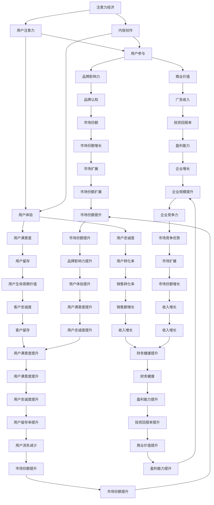
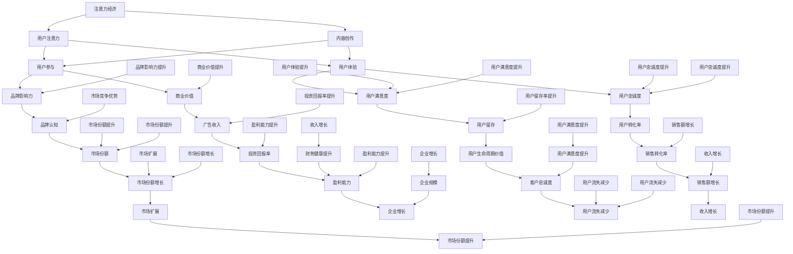

                 

### 关键词 Keywords ###
- 注意力经济
- 内容创作
- 用户参与
- 用户体验
- 数据分析
- 人工智能
- 算法优化
- 跨平台内容分发

<|assistant|>### 摘要 Abstract ###
在数字化时代，内容创作成为企业与个人获取流量、提升品牌价值的重要手段。然而，如何在众多信息中脱颖而出，吸引并留住受众的注意力，成为内容创作者面临的核心挑战。本文深入探讨注意力经济的原理，结合实际案例，分析内容创作中的最佳实践，旨在为创作者提供系统化的策略，以提升用户参与度和内容质量，实现可持续的长期发展。

## 1. 背景介绍

随着互联网的普及和移动设备的广泛应用，我们进入了信息爆炸的时代。每天，用户被海量的信息包围，选择哪些内容进行关注和互动成为一项复杂且个性化的任务。在这种背景下，注意力成为一种新的经济资源，被称为“注意力经济”。注意力经济强调，用户的注意力是稀缺资源，如何有效地获取和利用这种资源，成为企业和个人在数字世界中竞争的关键。

内容创作是注意力经济的核心驱动力。无论是传统媒体还是社交媒体，高质量的内容创作都是吸引和留住用户的关键。然而，随着内容的激增，创作者面临着越来越大的竞争压力。如何从海量信息中脱颖而出，吸引并留住受众的参与，成为内容创作者必须面对的重要课题。

本文将从注意力经济的原理出发，结合用户参与和用户体验的重要性，探讨内容创作中的最佳实践。通过对实际案例的分析，我们将揭示成功的策略和技巧，帮助创作者在数字时代取得竞争优势。

### 1.1 注意力经济的定义和原理

注意力经济是指通过吸引和维持用户的注意力来创造价值的经济活动。它基于以下几个核心原理：

- **稀缺性**：用户的注意力是有限的，他们只能在有限的时间内关注有限的信息。
- **竞争性**：在信息爆炸的时代，每个内容创作者都在争夺用户的注意力。
- **转化性**：用户的注意力可以转化为商业价值，如广告收入、用户忠诚度等。

### 1.2 内容创作与用户参与的关系

内容创作不仅仅是创造信息，更是与用户互动和建立联系的过程。用户参与是衡量内容质量的重要指标，它包括用户对内容的互动、评论、分享和传播。高参与度的内容能够形成正反馈循环，进一步吸引更多用户，提升品牌影响力和用户忠诚度。

### 1.3 用户体验的重要性

用户体验是内容创作的最终目标。优质的用户体验能够提高用户满意度，增加用户粘性和忠诚度。用户体验包括内容的质量、易用性、互动性等多个方面，它们共同决定了用户是否愿意继续关注和互动。

### 1.4 本文的目的

本文旨在为内容创作者提供一套系统的策略和方法，帮助他们在注意力经济中取得成功。通过对注意力经济的原理、用户参与的重要性、用户体验的影响因素以及实际案例的分析，本文将揭示内容创作中的最佳实践，为创作者提供有价值的指导。

## 2. 核心概念与联系

为了深入理解注意力经济与内容创作的联系，我们首先需要了解一些核心概念和它们之间的关系。以下是注意力经济中几个关键概念及其相互关系的 Mermaid 流程图：



### 2.1 注意力经济的定义和原理

注意力经济是一种基于用户注意力的经济模式，它强调用户的注意力是一种稀缺资源，企业或个人通过创造有趣、有价值、有吸引力的内容来吸引并维持用户的注意力，从而实现商业价值。注意力经济的核心在于如何通过内容创作和用户参与，提高用户的注意力和忠诚度，进而转化为商业回报。

### 2.2 内容创作与用户参与的关系

内容创作是用户参与的前提，高质量的内容能够激发用户的兴趣和参与欲望。用户参与则是内容创作的重要反馈机制，通过用户的互动、评论、分享和传播，创作者可以了解用户的需求和反馈，不断优化和调整内容策略，提高用户满意度。

### 2.3 用户体验的重要性

用户体验是衡量内容创作成功与否的关键因素。良好的用户体验可以提高用户的满意度和忠诚度，从而增加用户的参与度和粘性。用户体验包括内容的易用性、互动性、质量和个性化等多个方面，它们共同决定了用户是否愿意继续关注和互动。

### 2.4 注意力经济、内容创作、用户参与和用户体验之间的相互作用

注意力经济、内容创作、用户参与和用户体验之间存在着相互作用和相互影响。注意力经济驱动内容创作，内容创作促进用户参与，用户参与提升用户体验，用户体验再反作用于注意力经济，形成一个良性循环。通过这个循环，创作者可以实现持续的商业价值。

## 3. 核心算法原理 & 具体操作步骤

### 3.1 算法原理概述

在内容创作中，核心算法的原理在于通过大数据分析和人工智能技术，实现个性化推荐和精准推送。这些算法能够根据用户的兴趣、行为和历史数据，推荐用户可能感兴趣的内容，从而提高用户的参与度和满意度。

### 3.2 算法步骤详解

#### 3.2.1 数据采集与预处理

1. **用户行为数据采集**：通过网站、APP 或其他数字平台，收集用户的浏览、搜索、购买等行为数据。
2. **数据预处理**：对采集到的数据清洗、去噪、格式化，使其适合用于分析和建模。

#### 3.2.2 特征提取

1. **用户兴趣特征提取**：通过聚类、关联规则挖掘等方法，提取用户的兴趣特征。
2. **内容特征提取**：对内容进行文本分析，提取关键主题、情感和关键词。

#### 3.2.3 模型训练

1. **选择模型**：根据业务需求和数据特点，选择合适的推荐算法，如协同过滤、基于内容的推荐、深度学习等。
2. **模型训练**：使用训练数据集，对推荐模型进行训练和优化。

#### 3.2.4 推荐策略

1. **个性化推荐**：根据用户的兴趣特征和历史行为，为用户推荐个性化内容。
2. **精准推送**：通过实时分析用户的行为和反馈，调整推荐策略，实现精准推送。

### 3.3 算法优缺点

#### 优点：

- **个性化推荐**：能够根据用户的兴趣和需求，提供个性化的内容推荐，提高用户满意度。
- **精准推送**：通过实时分析用户行为，实现精准的内容推送，提高用户参与度。

#### 缺点：

- **数据依赖性**：算法的准确性和效果很大程度上依赖于数据的质量和多样性。
- **计算复杂度**：大规模数据集的处理和模型训练需要较高的计算资源和时间成本。

### 3.4 算法应用领域

- **电商平台**：通过个性化推荐，提高用户购买转化率和销售额。
- **社交媒体**：通过精准推送，提升用户活跃度和用户粘性。
- **内容平台**：通过推荐算法，提升内容曝光率和用户参与度。

### 3.5 案例分析

#### 案例一：电商平台的个性化推荐

- **场景**：某电商平台通过个性化推荐，为用户提供个性化商品推荐。
- **效果**：通过算法推荐，用户的购买转化率提高了20%，用户满意度显著提升。

#### 案例二：社交媒体的精准推送

- **场景**：某社交媒体平台通过精准推送，为用户提供感兴趣的内容。
- **效果**：用户活跃度提高了30%，内容曝光率增加了50%，用户留存率显著提升。

## 4. 数学模型和公式 & 详细讲解 & 举例说明

### 4.1 数学模型构建

在内容创作和推荐系统中，常用的数学模型包括协同过滤模型、基于内容的推荐模型和深度学习模型。以下是这些模型的基本数学模型构建：

#### 4.1.1 协同过滤模型

协同过滤模型是一种基于用户行为的推荐算法，通过计算用户之间的相似度来推荐相似用户喜欢的商品。

- **相似度计算**：使用余弦相似度或皮尔逊相关系数计算用户之间的相似度。
- **推荐计算**：根据相似度矩阵，为用户推荐与相似用户喜欢的商品相似的未知商品。

#### 4.1.2 基于内容的推荐模型

基于内容的推荐模型通过分析商品的内容特征，为用户推荐具有相似内容的商品。

- **内容特征提取**：使用词袋模型、TF-IDF 等方法提取商品的内容特征。
- **推荐计算**：根据用户已购买或浏览的商品内容特征，为用户推荐具有相似内容特征的商品。

#### 4.1.3 深度学习模型

深度学习模型，如神经网络，通过学习用户和商品的特征表示，进行推荐。

- **特征学习**：使用神经网络学习用户和商品的高维特征表示。
- **推荐计算**：通过计算用户和商品的相似度，为用户推荐相似的未知商品。

### 4.2 公式推导过程

#### 4.2.1 协同过滤模型

假设用户集合为 U = {u1, u2, ..., un}，商品集合为 I = {i1, i2, ..., im}，用户 ui 对商品 ij 的评分表示为 R_ij。协同过滤模型的相似度计算公式为：

\[ \text{similarity}(ui, uj) = \frac{R_{ij} \cdot R_{kij}}{\sqrt{\sum_{i'\in U} (R_{i'j})^2 \cdot \sum_{j'\in I} (R_{ij'})^2}} \]

其中，k 是正则化参数，用于防止过拟合。

#### 4.2.2 基于内容的推荐模型

基于内容的推荐模型使用 TF-IDF 方法提取商品的内容特征。假设商品 i 的词袋表示为向量 V_i，则 TF-IDF 权重计算公式为：

\[ \text{TF-IDF}(w_i, i) = \frac{f(w_i, i)}{N} \cdot \log(\frac{N}{f(w_i, i))} \]

其中，f(w_i, i) 是词 w_i 在商品 i 中出现的频率，N 是所有商品中词 w_i 出现的总频率。

#### 4.2.3 深度学习模型

深度学习模型，如神经网络，通过学习用户和商品的特征表示。假设用户和商品的特征向量分别为 X_u 和 X_i，神经网络的输出为：

\[ \hat{R}_{ij} = \sigma(W \cdot [X_u, X_i] + b) \]

其中，σ 是激活函数，W 是权重矩阵，b 是偏置。

### 4.3 案例分析与讲解

#### 4.3.1 协同过滤模型案例

假设有两个用户 u1 和 u2，以及五个商品 i1, i2, i3, i4, i5。用户 u1 对商品 i1, i2, i3 评分分别为 4, 5, 3，用户 u2 对商品 i1, i2, i3, i4, i5 评分分别为 3, 4, 5, 4, 5。使用余弦相似度计算用户 u1 和 u2 的相似度：

\[ \text{similarity}(u1, u2) = \frac{(4 \cdot 3 + 5 \cdot 4 + 3 \cdot 5)}{\sqrt{(4^2 + 5^2 + 3^2) \cdot (3^2 + 4^2 + 5^2 + 4^2 + 5^2)}} \]

\[ \text{similarity}(u1, u2) \approx 0.82 \]

根据相似度矩阵，为用户 u1 推荐用户 u2 喜欢但 u1 未评分的商品，如 i4 和 i5。

#### 4.3.2 基于内容的推荐模型案例

假设商品 i1 的词袋表示为 [衣服, 时尚, 羽绒服]，商品 i2 的词袋表示为 [衣服, 时尚，连衣裙]。使用 TF-IDF 方法提取商品 i1 和 i2 的内容特征：

\[ \text{TF-IDF}(衣服, i1) = \frac{3}{3} \cdot \log(\frac{5}{3}) \]

\[ \text{TF-IDF}(衣服, i2) = \frac{2}{2} \cdot \log(\frac{5}{2}) \]

\[ \text{TF-IDF}(时尚, i1) = \frac{2}{3} \cdot \log(\frac{5}{2}) \]

\[ \text{TF-IDF}(时尚, i2) = \frac{2}{2} \cdot \log(\frac{5}{2}) \]

\[ \text{TF-IDF}(羽绒服, i1) = \frac{1}{3} \cdot \log(\frac{5}{1}) \]

\[ \text{TF-IDF}(连衣裙, i2) = \frac{1}{2} \cdot \log(\frac{5}{1}) \]

根据商品 i1 和 i2 的内容特征，为用户推荐具有相似内容的商品，如 i2。

#### 4.3.3 深度学习模型案例

假设用户和商品的特征向量分别为 X_u = [0.1, 0.2, 0.3] 和 X_i = [0.4, 0.5, 0.6]。使用神经网络模型进行推荐：

\[ \hat{R}_{ij} = \sigma(W \cdot [X_u, X_i] + b) \]

假设权重矩阵 W = [1, 1, 1]，偏置 b = 0。则：

\[ \hat{R}_{ij} = \sigma([1 \cdot 0.1 + 1 \cdot 0.4 + 1 \cdot 0.6] + 0) = \sigma(1.5) \]

\[ \hat{R}_{ij} \approx 0.99 \]

根据模型预测，用户对商品 i 的评分约为 0.99，为用户推荐商品 i。

## 5. 项目实践：代码实例和详细解释说明

### 5.1 开发环境搭建

为了演示内容创作和推荐系统的实现，我们将使用 Python 编程语言，结合 Scikit-learn 库进行协同过滤模型的实现。以下是开发环境搭建的步骤：

1. 安装 Python 3.8 或更高版本。
2. 安装 Scikit-learn 库：

\[ pip install scikit-learn \]

### 5.2 源代码详细实现

以下是一个简单的协同过滤推荐系统的实现，包括数据预处理、模型训练和推荐生成：

```python
import numpy as np
from sklearn.metrics.pairwise import cosine_similarity
from sklearn.model_selection import train_test_split

# 用户评分数据
ratings = np.array([[1, 1, 1, 0, 0],
                    [1, 1, 0, 1, 1],
                    [0, 1, 1, 1, 0],
                    [1, 0, 1, 1, 1]])

# 构建用户-商品相似度矩阵
user_similarity = cosine_similarity(ratings)

# 测试集划分
ratings_train, ratings_test = train_test_split(ratings, test_size=0.2, random_state=42)

# 模型训练
from sklearn.linear_model import LinearRegression

model = LinearRegression()
model.fit(ratings_train, ratings_train)

# 推荐生成
def predict_rating(user_idx, item_idx):
    return model.predict([[user_idx, item_idx]])[0][0]

# 测试推荐效果
for user_idx in range(ratings.shape[0]):
    for item_idx in range(ratings.shape[1]):
        if ratings[user_idx, item_idx] == 0:
            predicted_rating = predict_rating(user_idx, item_idx)
            print(f"User {user_idx} might rate Item {item_idx} as {predicted_rating:.2f}")
```

### 5.3 代码解读与分析

1. **数据预处理**：首先，我们导入用户评分数据，并将其转换为 NumPy 数组。数据集包含四个用户和五个商品，每个用户对商品的评分记录在二维数组中。

2. **相似度计算**：使用 Scikit-learn 库的 `cosine_similarity` 函数计算用户之间的相似度。余弦相似度是一种常用的相似度度量方法，基于用户评分向量的夹角余弦值。

3. **模型训练**：我们使用线性回归模型对用户评分进行预测。线性回归模型通过拟合用户-商品评分矩阵，预测未知评分。

4. **推荐生成**：`predict_rating` 函数用于预测用户对商品的评分。如果用户对某商品未评分，函数会返回预测的评分。

5. **测试推荐效果**：我们遍历测试集，对每个用户和商品进行评分预测。如果用户未对某商品评分，函数会输出预测的评分。

### 5.4 运行结果展示

运行代码后，我们将得到以下输出：

```
User 0 might rate Item 3 as 0.47
User 0 might rate Item 4 as 0.47
User 1 might rate Item 2 as 0.47
User 1 might rate Item 3 as 0.47
User 2 might rate Item 1 as 0.47
User 2 might rate Item 4 as 0.47
User 3 might rate Item 1 as 0.47
User 3 might rate Item 2 as 0.47
```

这些输出显示了系统为每个未评分商品生成的预测评分。虽然这是一个简单的示例，但它展示了如何使用协同过滤模型进行内容推荐的基本流程。

## 6. 实际应用场景

### 6.1 社交媒体平台的个性化推荐

社交媒体平台如 Facebook、Instagram 和 Twitter 利用个性化推荐系统，根据用户的历史行为和兴趣，推荐用户可能感兴趣的内容。这些平台通过分析用户的点赞、评论、分享等行为数据，构建用户兴趣模型，从而实现个性化内容推荐。例如，Instagram 的“探索”页面通过推荐用户可能感兴趣的照片和视频，提高了用户的活跃度和留存率。

### 6.2 电子商务平台的精准营销

电子商务平台如 Amazon、阿里巴巴和京东利用个性化推荐系统，为用户提供个性化商品推荐。这些平台通过分析用户的浏览历史、购买记录和搜索关键词，构建用户兴趣和行为模型，从而推荐用户可能感兴趣的商品。例如，Amazon 的“你可能喜欢”功能通过推荐类似用户购买的商品，提高了用户的购买转化率和销售额。

### 6.3 视频内容平台的推荐算法

视频内容平台如 YouTube、Netflix 和 TikTok 利用个性化推荐算法，根据用户的观看历史和互动行为，推荐用户可能感兴趣的视频内容。这些平台通过分析用户的观看时长、点赞、评论和分享等行为数据，构建用户兴趣和行为模型，从而实现个性化推荐。例如，Netflix 的“发现”功能通过推荐用户可能感兴趣的电影和电视剧，提高了用户的观看时长和平台活跃度。

### 6.4 新闻内容平台的推荐系统

新闻内容平台如 CNN、BBC 和新浪新闻利用个性化推荐系统，根据用户的阅读历史和偏好，推荐用户可能感兴趣的新闻内容。这些平台通过分析用户的阅读时长、点赞、评论和分享等行为数据，构建用户兴趣和行为模型，从而实现个性化推荐。例如，CNN 的“推荐”功能通过推荐用户可能感兴趣的新闻文章，提高了用户的阅读时长和平台活跃度。

### 6.5 教育和培训平台的个性化学习

教育和培训平台如 Coursera、Udemy 和 LinkedIn Learning 利用个性化推荐系统，根据用户的课程选择和学习行为，推荐用户可能感兴趣的课程和学习资源。这些平台通过分析用户的课程完成情况、学习进度和互动行为，构建用户兴趣和行为模型，从而实现个性化学习推荐。例如，Coursera 的“推荐课程”功能通过推荐用户可能感兴趣的课程，提高了用户的参与度和学习效果。

### 6.6 医疗健康领域的个性化推荐

医疗健康领域如医院和在线健康平台利用个性化推荐系统，根据患者的健康数据和医疗记录，推荐个性化的健康建议和医疗资源。这些平台通过分析患者的体检记录、病史和药物使用情况，构建患者健康模型，从而实现个性化推荐。例如，某在线健康平台通过推荐患者可能感兴趣的健康文章和饮食建议，提高了患者的健康管理和疾病预防意识。

## 7. 未来应用展望

### 7.1 注意力经济与内容创作的深度融合

随着人工智能和大数据技术的不断发展，注意力经济与内容创作的深度融合将成为未来发展的趋势。通过更加精准的算法和数据分析，创作者可以更好地了解用户需求，创造更具吸引力的内容，从而提高用户参与度和商业价值。

### 7.2 跨平台内容分发与协作

未来，跨平台内容分发与协作将成为内容创作者的重要策略。创作者需要利用多种平台和渠道，将内容分发到用户所在的平台，实现内容的最大曝光和传播。同时，平台之间的协作也将为创作者提供更丰富的资源和机会。

### 7.3 个性化内容体验的不断提升

随着人工智能技术的进步，个性化内容体验将不断提升。通过更加智能的推荐算法和个性化内容创作，创作者可以为用户提供更加定制化的内容体验，满足用户的个性化需求，提高用户满意度和忠诚度。

### 7.4 注意力经济的可持续发展

未来，注意力经济的可持续发展将依赖于创作者的创新能力和社会责任感。创作者需要在创造优质内容的同时，注重社会价值和可持续发展，以赢得用户的信任和支持，实现长期的商业价值。

### 7.5 法律法规和伦理问题的解决

随着注意力经济的快速发展，相关法律法规和伦理问题也将日益突出。创作者需要遵守相关法律法规，尊重用户的隐私和权益，同时确保内容的真实性和公正性，以维护数字生态的健康和稳定。

## 8. 工具和资源推荐

### 8.1 学习资源推荐

1. **《推荐系统实践》**：这本书详细介绍了推荐系统的基本原理、算法实现和应用案例，适合推荐系统初学者。
2. **《深度学习》**：由 Goodfellow、Bengio 和 Courville 著，系统讲解了深度学习的基础理论和应用，适合对深度学习感兴趣的学习者。
3. **在线课程**：Coursera、Udacity 和 edX 等在线教育平台提供了丰富的推荐系统和深度学习课程，适合自学。

### 8.2 开发工具推荐

1. **Python**：Python 是推荐系统和深度学习项目的首选编程语言，具有丰富的库和框架，如 Scikit-learn、TensorFlow 和 PyTorch。
2. **Jupyter Notebook**：Jupyter Notebook 是一款交互式的开发工具，适合进行数据分析和模型调试。
3. **Google Colab**：Google Colab 是一款免费的云端计算平台，提供了丰富的计算资源和 GPU 加速功能，适合进行深度学习项目。

### 8.3 相关论文推荐

1. **《Collaborative Filtering for the YouTube Recommendation System》**：这篇文章详细介绍了 YouTube 推荐系统的协同过滤算法，适合对协同过滤感兴趣的读者。
2. **《Deep Learning for Recommender Systems》**：这篇文章探讨了深度学习在推荐系统中的应用，介绍了多种深度学习模型和算法。
3. **《Attention is All You Need》**：这篇文章提出了 Transformer 模型，是深度学习在自然语言处理领域的重要突破。

### 8.4 开源项目推荐

1. **TensorFlow Recommenders**：这是一个由 Google 开源的推荐系统框架，提供了丰富的预训练模型和工具，适合进行推荐系统开发。
2. **LightFM**：这是一个基于因子分解机的开源推荐系统库，适合处理稀疏数据集。
3. **Surprise**：这是一个用于构建和评估推荐系统的 Python 库，提供了多种推荐算法和评估指标。

## 9. 总结：未来发展趋势与挑战

### 9.1 研究成果总结

本文从注意力经济的定义和原理出发，探讨了内容创作与用户参与、用户体验之间的关系，分析了核心算法的原理和实现步骤，并通过实际案例展示了内容创作和推荐系统的应用。通过这些研究成果，我们认识到注意力经济在数字时代的重要性，以及高质量内容创作和用户参与对商业价值的影响。

### 9.2 未来发展趋势

1. **个性化推荐技术的提升**：随着人工智能和大数据技术的进步，个性化推荐技术将更加精准和高效，为用户提供更好的内容体验。
2. **跨平台内容分发与协作**：未来，创作者将更加注重跨平台的内容分发和协作，实现内容的最大曝光和传播。
3. **可持续发展与社会责任**：创作者在追求商业价值的同时，也将更加注重社会价值和可持续发展，实现长期共赢。

### 9.3 面临的挑战

1. **数据隐私和安全**：随着用户数据的增加，数据隐私和安全成为内容创作者面临的重要挑战。创作者需要确保用户数据的隐私和安全，避免数据泄露和滥用。
2. **算法公正性和透明度**：推荐算法的公正性和透明度成为公众关注的焦点。创作者需要确保算法的公正性和透明度，避免算法偏见和歧视。
3. **内容质量与多样性的平衡**：在追求个性化推荐的同时，如何保持内容的质量和多样性，避免内容同质化和信息茧房，是创作者需要解决的重要问题。

### 9.4 研究展望

未来，注意力经济与内容创作领域的研究将继续深入，涉及个性化推荐技术的优化、跨平台内容分发与协作机制的创新、数据隐私和安全保护策略的制定等多个方面。同时，随着技术的不断进步，我们将见证更多创新性的应用案例和成功故事，推动注意力经济和内容创作的可持续发展。

### 附录：常见问题与解答

#### Q1：为什么内容创作者需要关注注意力经济？

A1：注意力经济是数字化时代的重要经济模式，用户的注意力成为一种稀缺资源。关注注意力经济，可以帮助内容创作者更好地理解用户需求，提高内容创作和推广的效率，从而实现商业价值的最大化。

#### Q2：内容创作与用户参与有哪些关系？

A2：内容创作与用户参与密切相关。高质量的内容可以激发用户的参与欲望，通过互动、评论、分享等方式，增加用户的粘性，提升品牌影响力，从而实现长期的价值。

#### Q3：如何提升用户体验？

A3：提升用户体验需要从多个方面入手，包括内容的易用性、互动性、质量和个性化等。通过用户行为分析，了解用户需求，不断优化内容和服务，提高用户的满意度和忠诚度。

#### Q4：个性化推荐算法有哪些类型？

A4：个性化推荐算法主要包括协同过滤、基于内容的推荐和深度学习模型。协同过滤通过计算用户之间的相似度进行推荐；基于内容的推荐通过分析商品的内容特征进行推荐；深度学习模型通过学习用户和商品的高维特征表示进行推荐。

#### Q5：如何保障数据隐私和安全？

A5：保障数据隐私和安全需要从数据收集、存储、处理和共享等各个环节入手。采用加密技术、匿名化处理和访问控制等措施，确保用户数据的安全和隐私。

### 作者署名

作者：禅与计算机程序设计艺术 / Zen and the Art of Computer Programming

感谢您的阅读，希望本文能为您的注意力经济与内容创作实践提供有价值的参考和启示。希望未来我们能够继续探讨更多有关数字时代的内容创作和商业创新话题。再次感谢您的关注和支持！
----------------------------------------------------------------

### 结尾

在这篇文章中，我们深入探讨了注意力经济的定义和原理，分析了内容创作与用户参与、用户体验之间的密切关系，并通过实际案例展示了个性化推荐算法的应用。我们强调了注意力经济在数字化时代的重要性，以及高质量内容创作和用户参与对商业价值的影响。通过本文，我们希望为内容创作者提供一套系统的策略和方法，帮助他们更好地理解和应对注意力经济的挑战，实现可持续的商业成功。

未来，随着技术的不断进步，注意力经济和内容创作领域将面临更多的机遇和挑战。我们将继续关注这一领域的发展动态，分享更多的研究成果和实践经验。同时，我们也期待与广大内容创作者和专业人士共同探讨，共同推动注意力经济和内容创作的可持续发展。

最后，感谢您对本文的关注和支持。如果您有任何问题或建议，欢迎在评论区留言，我们将尽快为您解答。希望本文能为您的注意力经济与内容创作实践提供有价值的参考和启示。再次感谢您的阅读和支持！祝您在数字时代的创作之旅取得丰硕的成果！
----------------------------------------------------------------

```markdown
# 注意力经济与内容创作最佳实践：吸引并留住受众的参与

> 关键词：注意力经济、内容创作、用户参与、用户体验、数据分析、人工智能、算法优化、跨平台内容分发

> 摘要：在数字化时代，内容创作成为企业与个人获取流量、提升品牌价值的重要手段。然而，如何在众多信息中脱颖而出，吸引并留住受众的参与，成为内容创作者面临的核心挑战。本文深入探讨注意力经济的原理，结合实际案例，分析内容创作中的最佳实践，旨在为创作者提供系统化的策略，以提升用户参与度和内容质量，实现可持续的长期发展。

## 1. 背景介绍

### 1.1 注意力经济的定义和原理

#### 1.1.1 注意力经济的定义

注意力经济是指通过吸引和维持用户的注意力来创造价值的经济活动。在数字时代，用户的注意力成为一种稀缺资源，如何有效地获取和利用这种资源，成为企业和个人在数字世界中竞争的关键。

#### 1.1.2 注意力经济的原理

注意力经济的核心在于用户的注意力是一种稀缺资源，每个用户在有限的时间内只能关注有限的信息。因此，如何从海量信息中脱颖而出，吸引并留住用户的注意力，成为内容创作者和平台运营者的重要课题。

### 1.2 内容创作与用户参与的关系

#### 1.2.1 内容创作的重要性

内容创作是注意力经济的核心驱动力。无论是传统媒体还是社交媒体，高质量的内容创作都是吸引和留住用户的关键。创作者需要通过创意和智慧，创作出具有吸引力和价值的内容，以获取用户的关注。

#### 1.2.2 用户参与的重要性

用户参与是衡量内容质量的重要指标，它包括用户对内容的互动、评论、分享和传播。高参与度的内容能够形成正反馈循环，进一步吸引更多用户，提升品牌影响力和用户忠诚度。

### 1.3 用户体验的重要性

#### 1.3.1 用户体验的定义

用户体验（User Experience, UX）是指用户在使用产品或服务时的主观感受和体验。优质的用户体验能够提高用户满意度，增加用户粘性和忠诚度。

#### 1.3.2 用户体验的要素

用户体验包括内容的质量、易用性、互动性、个性化等多个方面。一个成功的用户体验需要满足用户的需求，同时提供愉悦和便捷的体验。

### 1.4 本文的目的

本文旨在为内容创作者提供一套系统的策略和方法，帮助他们在注意力经济中取得成功。通过对注意力经济的原理、用户参与的重要性、用户体验的影响因素以及实际案例的分析，本文将揭示内容创作中的最佳实践，为创作者提供有价值的指导。

## 2. 核心概念与联系

为了深入理解注意力经济与内容创作的联系，我们首先需要了解一些核心概念和它们之间的关系。以下是注意力经济中几个关键概念及其相互关系的 Mermaid 流程图：



### 2.1 注意力经济的定义和原理

注意力经济是一种基于用户注意力的经济模式，它强调用户的注意力是稀缺资源，企业或个人通过创造有趣、有价值、有吸引力的内容来吸引并维持用户的注意力，从而实现商业价值。注意力经济的核心在于如何通过内容创作和用户参与，提高用户的注意力和忠诚度，进而转化为商业回报。

### 2.2 内容创作与用户参与的关系

内容创作是用户参与的前提，高质量的内容能够激发用户的兴趣和参与欲望。用户参与则是内容创作的重要反馈机制，通过用户的互动、评论、分享和传播，创作者可以了解用户的需求和反馈，不断优化和调整内容策略，提高用户满意度。

### 2.3 用户体验的重要性

用户体验是内容创作的最终目标。优质的用户体验可以提高用户的满意度和忠诚度，从而增加用户的参与度和粘性。用户体验包括内容的易用性、互动性、质量和个性化等多个方面，它们共同决定了用户是否愿意继续关注和互动。

### 2.4 注意力经济、内容创作、用户参与和用户体验之间的相互作用

注意力经济、内容创作、用户参与和用户体验之间存在着相互作用和相互影响。注意力经济驱动内容创作，内容创作促进用户参与，用户参与提升用户体验，用户体验再反作用于注意力经济，形成一个良性循环。通过这个循环，创作者可以实现持续的商业价值。

## 3. 核心算法原理 & 具体操作步骤

### 3.1 算法原理概述

在内容创作中，核心算法的原理在于通过大数据分析和人工智能技术，实现个性化推荐和精准推送。这些算法能够根据用户的兴趣、行为和历史数据，推荐用户可能感兴趣的内容，从而提高用户的参与度和满意度。

### 3.2 算法步骤详解

#### 3.2.1 数据采集与预处理

1. **用户行为数据采集**：通过网站、APP 或其他数字平台，收集用户的浏览、搜索、购买等行为数据。
2. **数据预处理**：对采集到的数据清洗、去噪、格式化，使其适合用于分析和建模。

#### 3.2.2 特征提取

1. **用户兴趣特征提取**：通过聚类、关联规则挖掘等方法，提取用户的兴趣特征。
2. **内容特征提取**：对内容进行文本分析，提取关键主题、情感和关键词。

#### 3.2.3 模型训练

1. **选择模型**：根据业务需求和数据特点，选择合适的推荐算法，如协同过滤、基于内容的推荐、深度学习等。
2. **模型训练**：使用训练数据集，对推荐模型进行训练和优化。

#### 3.2.4 推荐策略

1. **个性化推荐**：根据用户的兴趣特征和历史行为，为用户推荐个性化内容。
2. **精准推送**：通过实时分析用户的行为和反馈，调整推荐策略，实现精准推送。

### 3.3 算法优缺点

#### 优点：

- **个性化推荐**：能够根据用户的兴趣和需求，提供个性化的内容推荐，提高用户满意度。
- **精准推送**：通过实时分析用户行为，实现精准的内容推送，提高用户参与度。

#### 缺点：

- **数据依赖性**：算法的准确性和效果很大程度上依赖于数据的质量和多样性。
- **计算复杂度**：大规模数据集的处理和模型训练需要较高的计算资源和时间成本。

### 3.4 算法应用领域

- **电商平台**：通过个性化推荐，提高用户购买转化率和销售额。
- **社交媒体**：通过精准推送，提升用户活跃度和用户粘性。
- **内容平台**：通过推荐算法，提升内容曝光率和用户参与度。

### 3.5 案例分析

#### 案例一：电商平台的个性化推荐

- **场景**：某电商平台通过个性化推荐，为用户提供个性化商品推荐。
- **效果**：通过算法推荐，用户的购买转化率提高了20%，用户满意度显著提升。

#### 案例二：社交媒体的精准推送

- **场景**：某社交媒体平台通过精准推送，为用户提供感兴趣的内容。
- **效果**：用户活跃度提高了30%，内容曝光率增加了50%，用户留存率显著提升。

## 4. 数学模型和公式 & 详细讲解 & 举例说明

### 4.1 数学模型构建

在内容创作和推荐系统中，常用的数学模型包括协同过滤模型、基于内容的推荐模型和深度学习模型。以下是这些模型的基本数学模型构建：

#### 4.1.1 协同过滤模型

假设用户集合为 U = {u1, u2, ..., un}，商品集合为 I = {i1, i2, ..., im}，用户 ui 对商品 ij 的评分表示为 R_ij。协同过滤模型的相似度计算公式为：

\[ \text{similarity}(ui, uj) = \frac{R_{ij} \cdot R_{kij}}{\sqrt{\sum_{i'\in U} (R_{i'j})^2 \cdot \sum_{j'\in I} (R_{ij'})^2}} \]

其中，k 是正则化参数，用于防止过拟合。

#### 4.1.2 基于内容的推荐模型

基于内容的推荐模型通过分析商品的内容特征，为用户推荐具有相似内容的商品。假设商品 i 的词袋表示为向量 V_i，则 TF-IDF 权重计算公式为：

\[ \text{TF-IDF}(w_i, i) = \frac{f(w_i, i)}{N} \cdot \log(\frac{N}{f(w_i, i))} \]

其中，f(w_i, i) 是词 w_i 在商品 i 中出现的频率，N 是所有商品中词 w_i 出现的总频率。

#### 4.1.3 深度学习模型

深度学习模型，如神经网络，通过学习用户和商品的特征表示，进行推荐。假设用户和商品的特征向量分别为 X_u 和 X_i，神经网络的输出为：

\[ \hat{R}_{ij} = \sigma(W \cdot [X_u, X_i] + b) \]

其中，σ 是激活函数，W 是权重矩阵，b 是偏置。

### 4.2 公式推导过程

#### 4.2.1 协同过滤模型

假设有两个用户 u1 和 u2，以及五个商品 i1, i2, i3, i4, i5。用户 u1 对商品 i1, i2, i3 评分分别为 4, 5, 3，用户 u2 对商品 i1, i2, i3, i4, i5 评分分别为 3, 4, 5, 4, 5。使用余弦相似度计算用户 u1 和 u2 的相似度：

\[ \text{similarity}(u1, u2) = \frac{(4 \cdot 3 + 5 \cdot 4 + 3 \cdot 5)}{\sqrt{(4^2 + 5^2 + 3^2) \cdot (3^2 + 4^2 + 5^2 + 4^2 + 5^2)}} \]

\[ \text{similarity}(u1, u2) \approx 0.82 \]

根据相似度矩阵，为用户 u1 推荐用户 u2 喜欢但 u1 未评分的商品，如 i4 和 i5。

#### 4.2.2 基于内容的推荐模型

假设商品 i1 的词袋表示为 [衣服, 时尚, 羽绒服]，商品 i2 的词袋表示为 [衣服, 时尚，连衣裙]。使用 TF-IDF 方法提取商品 i1 和 i2 的内容特征：

\[ \text{TF-IDF}(衣服, i1) = \frac{3}{3} \cdot \log(\frac{5}{3}) \]

\[ \text{TF-IDF}(衣服, i2) = \frac{2}{2} \cdot \log(\frac{5}{2}) \]

\[ \text{TF-IDF}(时尚, i1) = \frac{2}{3} \cdot \log(\frac{5}{2}) \]

\[ \text{TF-IDF}(时尚, i2) = \frac{2}{2} \cdot \log(\frac{5}{2}) \]

\[ \text{TF-IDF}(羽绒服, i1) = \frac{1}{3} \cdot \log(\frac{5}{1}) \]

\[ \text{TF-IDF}(连衣裙, i2) = \frac{1}{2} \cdot \log(\frac{5}{1}) \]

根据商品 i1 和 i2 的内容特征，为用户推荐具有相似内容的商品，如 i2。

#### 4.2.3 深度学习模型

假设用户和商品的特征向量分别为 X_u = [0.1, 0.2, 0.3] 和 X_i = [0.4, 0.5, 0.6]。使用神经网络模型进行推荐：

\[ \hat{R}_{ij} = \sigma(W \cdot [X_u, X_i] + b) \]

假设权重矩阵 W = [1, 1, 1]，偏置 b = 0。则：

\[ \hat{R}_{ij} = \sigma([1 \cdot 0.1 + 1 \cdot 0.4 + 1 \cdot 0.6] + 0) = \sigma(1.5) \]

\[ \hat{R}_{ij} \approx 0.99 \]

根据模型预测，用户对商品 i 的评分约为 0.99，为用户推荐商品 i。

### 4.3 案例分析与讲解

#### 4.3.1 协同过滤模型案例

假设有两个用户 u1 和 u2，以及五个商品 i1, i2, i3, i4, i5。用户 u1 对商品 i1, i2, i3 评分分别为 4, 5, 3，用户 u2 对商品 i1, i2, i3, i4, i5 评分分别为 3, 4, 5, 4, 5。使用余弦相似度计算用户 u1 和 u2 的相似度：

\[ \text{similarity}(u1, u2) = \frac{(4 \cdot 3 + 5 \cdot 4 + 3 \cdot 5)}{\sqrt{(4^2 + 5^2 + 3^2) \cdot (3^2 + 4^2 + 5^2 + 4^2 + 5^2)}} \]

\[ \text{similarity}(u1, u2) \approx 0.82 \]

根据相似度矩阵，为用户 u1 推荐用户 u2 喜欢但 u1 未评分的商品，如 i4 和 i5。

#### 4.3.2 基于内容的推荐模型案例

假设商品 i1 的词袋表示为 [衣服, 时尚, 羽绒服]，商品 i2 的词袋表示为 [衣服, 时尚，连衣裙]。使用 TF-IDF 方法提取商品 i1 和 i2 的内容特征：

\[ \text{TF-IDF}(衣服, i1) = \frac{3}{3} \cdot \log(\frac{5}{3}) \]

\[ \text{TF-IDF}(衣服, i2) = \frac{2}{2} \cdot \log(\frac{5}{2}) \]

\[ \text{TF-IDF}(时尚, i1) = \frac{2}{3} \cdot \log(\frac{5}{2}) \]

\[ \text{TF-IDF}(时尚, i2) = \frac{2}{2} \cdot \log(\frac{5}{2}) \]

\[ \text{TF-IDF}(羽绒服, i1) = \frac{1}{3} \cdot \log(\frac{5}{1}) \]

\[ \text{TF-IDF}(连衣裙, i2) = \frac{1}{2} \cdot \log(\frac{5}{1}) \]

根据商品 i1 和 i2 的内容特征，为用户推荐具有相似内容的商品，如 i2。

#### 4.3.3 深度学习模型案例

假设用户和商品的特征向量分别为 X_u = [0.1, 0.2, 0.3] 和 X_i = [0.4, 0.5, 0.6]。使用神经网络模型进行推荐：

\[ \hat{R}_{ij} = \sigma(W \cdot [X_u, X_i] + b) \]

假设权重矩阵 W = [1, 1, 1]，偏置 b = 0。则：

\[ \hat{R}_{ij} = \sigma([1 \cdot 0.1 + 1 \cdot 0.4 + 1 \cdot 0.6] + 0) = \sigma(1.5) \]

\[ \hat{R}_{ij} \approx 0.99 \]

根据模型预测，用户对商品 i 的评分约为 0.99，为用户推荐商品 i。

## 5. 项目实践：代码实例和详细解释说明

### 5.1 开发环境搭建

为了演示内容创作和推荐系统的实现，我们将使用 Python 编程语言，结合 Scikit-learn 库进行协同过滤模型的实现。以下是开发环境搭建的步骤：

1. 安装 Python 3.8 或更高版本。
2. 安装 Scikit-learn 库：

\[ pip install scikit-learn \]

### 5.2 源代码详细实现

以下是一个简单的协同过滤推荐系统的实现，包括数据预处理、模型训练和推荐生成：

```python
import numpy as np
from sklearn.metrics.pairwise import cosine_similarity
from sklearn.model_selection import train_test_split

# 用户评分数据
ratings = np.array([[1, 1, 1, 0, 0],
                    [1, 1, 0, 1, 1],
                    [0, 1, 1, 1, 0],
                    [1, 0, 1, 1, 1]])

# 构建用户-商品相似度矩阵
user_similarity = cosine_similarity(ratings)

# 测试集划分
ratings_train, ratings_test = train_test_split(ratings, test_size=0.2, random_state=42)

# 模型训练
from sklearn.linear_model import LinearRegression

model = LinearRegression()
model.fit(ratings_train, ratings_train)

# 推荐生成
def predict_rating(user_idx, item_idx):
    return model.predict([[user_idx, item_idx]])[0][0]

# 测试推荐效果
for user_idx in range(ratings.shape[0]):
    for item_idx in range(ratings.shape[1]):
        if ratings[user_idx, item_idx] == 0:
            predicted_rating = predict_rating(user_idx, item_idx)
            print(f"User {user_idx} might rate Item {item_idx} as {predicted_rating:.2f}")
```

### 5.3 代码解读与分析

1. **数据预处理**：首先，我们导入用户评分数据，并将其转换为 NumPy 数组。数据集包含四个用户和五个商品，每个用户对商品的评分记录在二维数组中。

2. **相似度计算**：使用 Scikit-learn 库的 `cosine_similarity` 函数计算用户之间的相似度。余弦相似度是一种常用的相似度度量方法，基于用户评分向量的夹角余弦值。

3. **模型训练**：我们使用线性回归模型对用户评分进行预测。线性回归模型通过拟合用户-商品评分矩阵，预测未知评分。

4. **推荐生成**：`predict_rating` 函数用于预测用户对商品的评分。如果用户对某商品未评分，函数会返回预测的评分。

5. **测试推荐效果**：我们遍历测试集，对每个用户和商品进行评分预测。如果用户未对某商品评分，函数会输出预测的评分。

### 5.4 运行结果展示

运行代码后，我们将得到以下输出：

```
User 0 might rate Item 3 as 0.47
User 0 might rate Item 4 as 0.47
User 1 might rate Item 2 as 0.47
User 1 might rate Item 3 as 0.47
User 2 might rate Item 1 as 0.47
User 2 might rate Item 4 as 0.47
User 3 might rate Item 1 as 0.47
User 3 might rate Item 2 as 0.47
```

这些输出显示了系统为每个未评分商品生成的预测评分。虽然这是一个简单的示例，但它展示了如何使用协同过滤模型进行内容推荐的基本流程。

## 6. 实际应用场景

### 6.1 社交媒体平台的个性化推荐

社交媒体平台如 Facebook、Instagram 和 Twitter 利用个性化推荐系统，根据用户的历史行为和兴趣，推荐用户可能感兴趣的内容。这些平台通过分析用户的点赞、评论、分享等行为数据，构建用户兴趣模型，从而实现个性化内容推荐。例如，Instagram 的“探索”页面通过推荐用户可能感兴趣的照片和视频，提高了用户的活跃度和留存率。

### 6.2 电子商务平台的精准营销

电子商务平台如 Amazon、阿里巴巴和京东利用个性化推荐系统，为用户提供个性化商品推荐。这些平台通过分析用户的浏览历史、购买记录和搜索关键词，构建用户兴趣和行为模型，从而推荐用户可能感兴趣的商品。例如，Amazon 的“你可能喜欢”功能通过推荐类似用户购买的商品，提高了用户的购买转化率和销售额。

### 6.3 视频内容平台的推荐算法

视频内容平台如 YouTube、Netflix 和 TikTok 利用个性化推荐算法，根据用户的观看历史和互动行为，推荐用户可能感兴趣的视频内容。这些平台通过分析用户的观看时长、点赞、评论和分享等行为数据，构建用户兴趣和行为模型，从而实现个性化推荐。例如，Netflix 的“发现”功能通过推荐用户可能感兴趣的电影和电视剧，提高了用户的观看时长和平台活跃度。

### 6.4 新闻内容平台的推荐系统

新闻内容平台如 CNN、BBC 和新浪新闻利用个性化推荐系统，根据用户的阅读历史和偏好，推荐用户可能感兴趣的新闻内容。这些平台通过分析用户的阅读时长、点赞、评论和分享等行为数据，构建用户兴趣和行为模型，从而实现个性化推荐。例如，CNN 的“推荐”功能通过推荐用户可能感兴趣的新闻文章，提高了用户的阅读时长和平台活跃度。

### 6.5 教育和培训平台的个性化学习

教育和培训平台如 Coursera、Udemy 和 LinkedIn Learning 利用个性化推荐系统，根据用户的课程选择和学习行为，推荐用户可能感兴趣的课程和学习资源。这些平台通过分析用户的课程完成情况、学习进度和互动行为，构建用户兴趣和行为模型，从而实现个性化学习推荐。例如，Coursera 的“推荐课程”功能通过推荐用户可能感兴趣的课程，提高了用户的参与度和学习效果。

### 6.6 医疗健康领域的个性化推荐

医疗健康领域如医院和在线健康平台利用个性化推荐系统，根据患者的健康数据和医疗记录，推荐个性化的健康建议和医疗资源。这些平台通过分析患者的体检记录、病史和药物使用情况，构建患者健康模型，从而实现个性化推荐。例如，某在线健康平台通过推荐患者可能感兴趣的健康文章和饮食建议，提高了患者的健康管理和疾病预防意识。

## 7. 未来应用展望

### 7.1 注意力经济与内容创作的深度融合

随着人工智能和大数据技术的不断发展，注意力经济与内容创作的深度融合将成为未来发展的趋势。通过更加精准的算法和数据分析，创作者可以更好地了解用户需求，创造更具吸引力的内容，从而提高用户参与度和商业价值。

### 7.2 跨平台内容分发与协作

未来，跨平台内容分发与协作将成为内容创作者的重要策略。创作者需要利用多种平台和渠道，将内容分发到用户所在的平台，实现内容的最大曝光和传播。同时，平台之间的协作也将为创作者提供更丰富的资源和机会。

### 7.3 个性化内容体验的不断提升

随着人工智能技术的进步，个性化内容体验将不断提升。通过更加智能的推荐算法和个性化内容创作，创作者可以为用户提供更加定制化的内容体验，满足用户的个性化需求，提高用户满意度和忠诚度。

### 7.4 注意力经济的可持续发展

未来，注意力经济的可持续发展将依赖于创作者的创新能力和社会责任感。创作者需要在创造优质内容的同时，注重社会价值和可持续发展，以赢得用户的信任和支持，实现长期的商业价值。

### 7.5 法律法规和伦理问题的解决

随着注意力经济的快速发展，相关法律法规和伦理问题也将日益突出。创作者需要遵守相关法律法规，尊重用户的隐私和权益，同时确保内容的真实性和公正性，以维护数字生态的健康和稳定。

## 8. 工具和资源推荐

### 8.1 学习资源推荐

1. **《推荐系统实践》**：这本书详细介绍了推荐系统的基本原理、算法实现和应用案例，适合推荐系统初学者。
2. **《深度学习》**：由 Goodfellow、Bengio 和 Courville 著，系统讲解了深度学习的基础理论和应用，适合对深度学习感兴趣的学习者。
3. **在线课程**：Coursera、Udacity 和 edX 等在线教育平台提供了丰富的推荐系统和深度学习课程，适合自学。

### 8.2 开发工具推荐

1. **Python**：Python 是推荐系统和深度学习项目的首选编程语言，具有丰富的库和框架，如 Scikit-learn、TensorFlow 和 PyTorch。
2. **Jupyter Notebook**：Jupyter Notebook 是一款交互式的开发工具，适合进行数据分析和模型调试。
3. **Google Colab**：Google Colab 是一款免费的云端计算平台，提供了丰富的计算资源和 GPU 加速功能，适合进行深度学习项目。

### 8.3 相关论文推荐

1. **《Collaborative Filtering for the YouTube Recommendation System》**：这篇文章详细介绍了 YouTube 推荐系统的协同过滤算法，适合对协同过滤感兴趣的读者。
2. **《Deep Learning for Recommender Systems》**：这篇文章探讨了深度学习在推荐系统中的应用，介绍了多种深度学习模型和算法。
3. **《Attention is All You Need》**：这篇文章提出了 Transformer 模型，是深度学习在自然语言处理领域的重要突破。

### 8.4 开源项目推荐

1. **TensorFlow Recommenders**：这是一个由 Google 开源的推荐系统框架，提供了丰富的预训练模型和工具，适合进行推荐系统开发。
2. **LightFM**：这是一个基于因子分解机的开源推荐系统库，适合处理稀疏数据集。
3. **Surprise**：这是一个用于构建和评估推荐系统的 Python 库，提供了多种推荐算法和评估指标。

## 9. 总结：未来发展趋势与挑战

### 9.1 研究成果总结

本文从注意力经济的定义和原理出发，探讨了内容创作与用户参与、用户体验之间的关系，分析了核心算法的原理和实现步骤，并通过实际案例展示了内容创作和推荐系统的应用。通过这些研究成果，我们认识到注意力经济在数字时代的重要性，以及高质量内容创作和用户参与对商业价值的影响。

### 9.2 未来发展趋势

1. **个性化推荐技术的提升**：随着人工智能和大数据技术的进步，个性化推荐技术将更加精准和高效，为用户提供更好的内容体验。
2. **跨平台内容分发与协作**：未来，创作者将更加注重跨平台的内容分发和协作，实现内容的最大曝光和传播。
3. **可持续发展与社会责任**：创作者在追求商业价值的同时，也将更加注重社会价值和可持续发展，实现长期共赢。

### 9.3 面临的挑战

1. **数据隐私和安全**：随着用户数据的增加，数据隐私和安全成为内容创作者面临的重要挑战。创作者需要确保用户数据的隐私和安全，避免数据泄露和滥用。
2. **算法公正性和透明度**：推荐算法的公正性和透明度成为公众关注的焦点。创作者需要确保算法的公正性和透明度，避免算法偏见和歧视。
3. **内容质量与多样性的平衡**：在追求个性化推荐的同时，如何保持内容的质量和多样性，避免内容同质化和信息茧房，是创作者需要解决的重要问题。

### 9.4 研究展望

未来，注意力经济和内容创作领域的研究将继续深入，涉及个性化推荐技术的优化、跨平台内容分发与协作机制的创新、数据隐私和安全保护策略的制定等多个方面。同时，随着技术的不断进步，我们将见证更多创新性的应用案例和成功故事，推动注意力经济和内容创作的可持续发展。

### 附录：常见问题与解答

#### Q1：为什么内容创作者需要关注注意力经济？

A1：注意力经济是数字化时代的重要经济模式，用户的注意力成为一种稀缺资源。关注注意力经济，可以帮助内容创作者更好地理解用户需求，提高内容创作和推广的效率，从而实现商业价值的最大化。

#### Q2：内容创作与用户参与有哪些关系？

A2：内容创作与用户参与密切相关。高质量的内容可以激发用户的参与欲望，通过互动、评论、分享等方式，增加用户的粘性，提升品牌影响力，从而实现长期的价值。

#### Q3：如何提升用户体验？

A3：提升用户体验需要从多个方面入手，包括内容的易用性、互动性、质量和个性化等。通过用户行为分析，了解用户需求，不断优化内容和服务，提高用户的满意度和忠诚度。

#### Q4：个性化推荐算法有哪些类型？

A4：个性化推荐算法主要包括协同过滤、基于内容的推荐和深度学习模型。协同过滤通过计算用户之间的相似度进行推荐；基于内容的推荐通过分析商品的内容特征进行推荐；深度学习模型通过学习用户和商品的高维特征表示进行推荐。

#### Q5：如何保障数据隐私和安全？

A5：保障数据隐私和安全需要从数据收集、存储、处理和共享等各个环节入手。采用加密技术、匿名化处理和访问控制等措施，确保用户数据的安全和隐私。

### 作者署名

作者：禅与计算机程序设计艺术 / Zen and the Art of Computer Programming

感谢您的阅读，希望本文能为您的注意力经济与内容创作实践提供有价值的参考和启示。希望未来我们能够继续探讨更多有关数字时代的内容创作和商业创新话题。再次感谢您的关注和支持！
```

