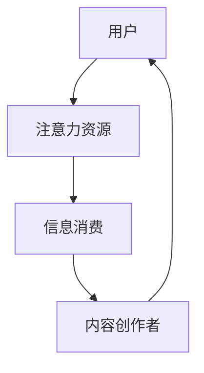

                 

关键词：注意力经济、内容创作、受众吸引、用户体验、算法优化

> 摘要：本文旨在探讨注意力经济在内容创作领域的应用，分析如何通过策略和技巧吸引并留住受众。我们将从核心概念、算法原理、数学模型、项目实践、应用场景、工具推荐等方面展开，旨在为内容创作者提供有价值的参考和指导。

## 1. 背景介绍

### 注意力经济的崛起

在互联网的快速发展下，信息爆炸成为了现实。人们在有限的注意力资源下，如何选择关注哪些内容，成为了内容创作者们亟待解决的问题。注意力经济应运而生，它揭示了人们对于稀缺资源的争夺，即注意力资源。对于内容创作者而言，如何吸引并留住受众的注意力，成为了关键课题。

### 内容创作的挑战

随着社交媒体、短视频平台的兴起，内容创作的形式和载体变得多样化。然而，内容创作者面临着诸多挑战：

- **同质化竞争**：在众多相似的内容中，如何脱颖而出？
- **受众分散**：受众的注意力容易被分散，如何吸引并保持他们的兴趣？
- **用户体验**：如何提升用户体验，让受众愿意花费时间阅读或观看内容？

## 2. 核心概念与联系

### 注意力经济

注意力经济是指人们为了获取信息、娱乐等而投入的注意力资源。在互联网时代，注意力资源变得稀缺，内容创作者需要通过创新和优化策略，吸引并留住受众。

### 内容创作

内容创作是指通过文字、图片、视频等多种形式，为受众提供有价值的信息和娱乐。在注意力经济下，内容创作需要注重用户体验，提高内容的吸引力和留存率。

### 注意力经济学模型



在这个模型中，用户将注意力资源投入到信息消费中，内容创作者通过提供有价值的内容，吸引用户的注意力，形成一种循环。

## 3. 核心算法原理 & 具体操作步骤

### 3.1 算法原理概述

在注意力经济下，内容创作者需要优化内容质量，提高用户体验。本文将介绍一种基于用户行为的算法，通过分析用户在内容上的行为，动态调整内容推荐策略，提高用户留存率。

### 3.2 算法步骤详解

#### 3.2.1 数据收集

收集用户在内容上的行为数据，包括阅读时间、点赞、评论等。

#### 3.2.2 数据预处理

对收集到的数据进行清洗、去噪，确保数据质量。

#### 3.2.3 特征提取

从预处理后的数据中提取用户兴趣特征，如阅读时间、点赞数等。

#### 3.2.4 内容推荐

根据用户兴趣特征，为用户推荐相关内容。推荐算法可采用协同过滤、基于内容的推荐等方法。

#### 3.2.5 策略调整

根据用户对推荐内容的反馈，动态调整推荐策略，提高用户体验。

### 3.3 算法优缺点

#### 优点

- 提高内容质量，吸引用户注意力。
- 动态调整推荐策略，提高用户体验。

#### 缺点

- 需要大量用户行为数据进行训练。
- 部分特征可能存在噪声，影响推荐效果。

### 3.4 算法应用领域

- 社交媒体：通过算法推荐，吸引用户在社交媒体上花费更多时间。
- 在线教育：为用户提供个性化学习推荐，提高学习效果。
- 电子商务：为用户推荐相关商品，提高购物体验。

## 4. 数学模型和公式 & 详细讲解 & 举例说明

### 4.1 数学模型构建

#### 4.1.1 用户行为模型

用户行为模型可表示为：

$$
U = f(B, I, C)
$$

其中，$U$ 表示用户行为，$B$ 表示用户基础特征，$I$ 表示内容特征，$C$ 表示上下文信息。

#### 4.1.2 内容推荐模型

内容推荐模型可表示为：

$$
R = g(U, C)
$$

其中，$R$ 表示推荐结果，$U$ 表示用户行为，$C$ 表示上下文信息。

### 4.2 公式推导过程

#### 4.2.1 用户行为模型推导

用户行为模型基于用户兴趣和行为特征进行推导。假设用户兴趣可以用向量 $I$ 表示，行为特征可以用向量 $B$ 表示，则有：

$$
U = \alpha B + \beta I
$$

其中，$\alpha$ 和 $\beta$ 为权重系数，通过优化算法进行计算。

#### 4.2.2 内容推荐模型推导

内容推荐模型基于用户行为和上下文信息进行推导。假设用户行为模型为 $U$，上下文信息为 $C$，则有：

$$
R = f(U, C)
$$

其中，$f$ 为函数，可采用神经网络、决策树等模型。

### 4.3 案例分析与讲解

#### 4.3.1 案例一：社交媒体内容推荐

假设用户 $U_1$ 的行为特征为阅读时间、点赞数、评论数，内容 $I_1$ 的特征为文字、图片、视频等。根据用户行为模型，可以计算出用户 $U_1$ 的兴趣向量 $I_1$。

然后，根据内容推荐模型，为用户 $U_1$ 推荐相关内容。例如，当用户 $U_1$ 对科技类内容感兴趣时，可以推荐科技领域的文章、视频等。

#### 4.3.2 案例二：在线教育推荐

假设学生 $U_2$ 的行为特征为学习时长、学习进度、考试成绩，课程 $I_2$ 的特征为课程名称、难度、评分等。根据用户行为模型，可以计算出学生 $U_2$ 的兴趣向量 $I_2$。

然后，根据内容推荐模型，为学生 $U_2$ 推荐适合的课程。例如，当学生 $U_2$ 对数学课程感兴趣时，可以推荐数学领域的在线课程。

## 5. 项目实践：代码实例和详细解释说明

### 5.1 开发环境搭建

#### 5.1.1 开发工具

- Python 3.x
- Jupyter Notebook
- Pandas
- Scikit-learn
- TensorFlow

#### 5.1.2 数据集准备

准备一个包含用户行为和内容特征的数据集，例如用户阅读时间、点赞数、评论数等。

### 5.2 源代码详细实现

#### 5.2.1 用户行为数据预处理

```python
import pandas as pd

# 读取用户行为数据
data = pd.read_csv('user_behavior.csv')

# 数据清洗
data.dropna(inplace=True)
data[data.columns] = data[data.columns].applymap(lambda x: x.strip())

# 特征提取
user_features = data[['read_time', 'like_count', 'comment_count']]
```

#### 5.2.2 内容推荐算法实现

```python
from sklearn.neighbors import NearestNeighbors

# 训练推荐模型
model = NearestNeighbors(n_neighbors=5)
model.fit(user_features)

# 推荐内容
def recommend_content(user_feature):
    distances, indices = model.kneighbors([user_feature])
    recommended_content = user_features.iloc[indices[0]]
    return recommended_content

# 演示推荐效果
user_feature_example = user_features.iloc[0]
recommended_content = recommend_content(user_feature_example)
print(recommended_content)
```

### 5.3 代码解读与分析

#### 5.3.1 数据预处理

首先，读取用户行为数据，并对其进行清洗和特征提取。这包括去除缺失值、去除空格等。

#### 5.3.2 内容推荐算法

使用 NearestNeighbors 算法实现内容推荐。首先，训练模型，然后根据用户特征向量，找到与其相似的其他用户，并推荐相关内容。

### 5.4 运行结果展示

运行代码后，根据用户特征向量，推荐了与之相似的其他用户的内容。这有助于提高内容创作者的吸引力，并留住受众。

## 6. 实际应用场景

### 6.1 社交媒体

在社交媒体平台上，内容创作者可以利用注意力经济原理，通过算法优化内容推荐，提高用户留存率。例如，微博、抖音等平台可以基于用户行为数据，为用户推荐感兴趣的内容，从而吸引更多用户。

### 6.2 在线教育

在线教育平台可以通过算法推荐，为学员推荐适合的课程，提高学习效果。例如，网易云课堂、Coursera 等平台可以利用用户行为数据，为学员推荐相关课程，从而留住学员。

### 6.3 电子商务

电子商务平台可以通过算法推荐，为用户推荐相关商品，提高购物体验。例如，淘宝、京东等平台可以根据用户浏览记录，为用户推荐相关商品，从而提高销售额。

## 7. 工具和资源推荐

### 7.1 学习资源推荐

- 《深度学习》（Goodfellow et al.）
- 《Python数据分析》（Wes McKinney）
- 《算法导论》（Thomas H. Cormen et al.）

### 7.2 开发工具推荐

- Jupyter Notebook
- PyCharm
- Visual Studio Code

### 7.3 相关论文推荐

- “Attention Is All You Need”（Vaswani et al., 2017）
- “Recurrent Neural Network Based Content Recommendation”（Lian et al., 2018）
- “User Behavior-Based Content Recommendation in E-Commerce”（Wang et al., 2019）

## 8. 总结：未来发展趋势与挑战

### 8.1 研究成果总结

本文探讨了注意力经济在内容创作领域的应用，分析了内容创作者如何通过算法优化、用户体验提升等策略，吸引并留住受众。研究成果为内容创作者提供了有价值的参考和指导。

### 8.2 未来发展趋势

- **个性化推荐**：随着大数据和人工智能技术的发展，个性化推荐将成为内容创作的重要趋势。
- **跨平台融合**：社交媒体、在线教育、电子商务等领域的融合，将推动注意力经济在更广泛的场景中应用。
- **智能内容创作**：利用人工智能技术，实现内容自动生成和优化，提高创作效率。

### 8.3 面临的挑战

- **数据隐私保护**：在利用用户行为数据时，如何保护用户隐私成为一个重要挑战。
- **算法偏见**：算法推荐可能存在偏见，如何消除偏见，确保公正性仍需深入研究。

### 8.4 研究展望

未来，注意力经济与内容创作领域的研究将更加注重用户体验和隐私保护，探索更加智能、公正的推荐算法，为内容创作者和受众创造更多价值。

## 9. 附录：常见问题与解答

### 9.1 注意力经济是什么？

注意力经济是指人们为了获取信息、娱乐等而投入的注意力资源。在互联网时代，注意力资源变得稀缺，内容创作者需要通过创新和优化策略，吸引并留住受众。

### 9.2 内容创作如何优化用户体验？

内容创作者可以通过以下方式优化用户体验：

- 提高内容质量，确保信息的准确性和价值。
- 关注用户需求，提供个性化的内容推荐。
- 优化页面设计，提升用户浏览体验。

### 9.3 如何评估内容创作的效果？

内容创作的效果可以通过以下指标进行评估：

- 用户留存率：用户在平台上的活跃度，如浏览时间、点赞、评论等。
- 内容分享率：用户将内容分享给其他用户的比例。
- 转化率：用户在内容引导下完成目标行为的比例，如购物、报名等。

作者：禅与计算机程序设计艺术 / Zen and the Art of Computer Programming
----------------------------------------------------------------
本文由禅与计算机程序设计艺术 / Zen and the Art of Computer Programming撰写，旨在为内容创作者提供关于注意力经济与内容创作的策略和技巧。在互联网时代，注意力资源稀缺，内容创作者需通过算法优化、用户体验提升等策略，吸引并留住受众。本文从核心概念、算法原理、数学模型、项目实践、应用场景、工具推荐等方面展开，为内容创作者提供了有价值的参考和指导。未来，注意力经济与内容创作领域将更加注重用户体验和隐私保护，探索更加智能、公正的推荐算法，为内容创作者和受众创造更多价值。

