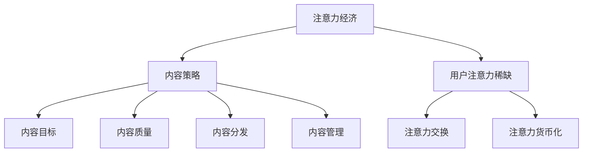

                 

关键词：注意力经济、内容策略、受众吸引力、用户体验、数据分析、社交媒体、搜索引擎优化

> 摘要：本文旨在探讨注意力经济下的内容策略规划与实施，分析如何通过有效的策略吸引并留住受众。文章将详细阐述注意力经济的核心概念、内容策略的设计与执行，并结合实际案例，展示如何运用技术手段提升内容影响力，满足用户需求。

## 1. 背景介绍

在数字化时代，信息爆炸带来的注意力稀缺成为了现代营销和内容创作的核心挑战。注意力经济（Attention Economy）作为一种新兴的理论，指出在信息过载的环境中，用户的注意力成为稀缺资源，企业和个人为了获取用户的关注，需要投入大量的精力和资源。

注意力经济的关键在于如何通过有效的策略规划与实施，将有限的用户注意力转化为商业价值。内容策略（Content Strategy）作为一种系统的方法，旨在通过内容创作、内容分发和内容管理，提高内容的质量和相关性，从而吸引并留住目标受众。

本文将首先介绍注意力经济的核心概念，然后深入探讨内容策略的设计与实施，结合实际案例和数据分析，展示如何运用技术手段提升内容影响力，满足用户需求。

## 2. 核心概念与联系

### 2.1 注意力经济的核心概念

注意力经济关注的是在信息过载的社会中，如何通过吸引和维持用户的注意力来创造价值。其核心概念包括：

- **注意力稀缺**：在信息爆炸的时代，用户的注意力是有限的，如何有效地获取和保持用户的注意力，成为企业和个人竞争的焦点。
- **注意力交换**：用户将注意力作为一种资源，通过关注内容、参与互动等形式，与企业或个人交换价值。
- **注意力货币化**：通过用户的注意力，企业可以实现广告收入、产品销售等商业目的。

### 2.2 内容策略的核心概念

内容策略涉及以下核心概念：

- **内容目标**：明确内容的目标受众和商业目标，确保内容创作和分发的方向一致。
- **内容质量**：高质量的内容能够吸引和留住用户，提升用户体验。
- **内容分发**：通过合适的渠道和平台，将内容有效地传递给目标受众。
- **内容管理**：持续优化和更新内容，保持内容的活力和相关性。

### 2.3 注意力经济与内容策略的联系

注意力经济和内容策略之间存在着紧密的联系。注意力经济为内容策略提供了理论基础，而内容策略则为注意力经济提供了实施路径。具体来说：

- 注意力经济强调用户注意力的稀缺性，这促使内容策略更加注重内容的质量和相关性，以提高用户的关注度和参与度。
- 内容策略的实施过程，如内容创作、分发和优化，需要考虑到用户注意力的分配和转换，以实现商业目标。

### 2.4 Mermaid 流程图

以下是一个简化的 Mermaid 流程图，展示了注意力经济与内容策略之间的联系。



## 3. 核心算法原理 & 具体操作步骤

### 3.1 算法原理概述

内容策略的核心在于通过算法分析用户行为，优化内容创作和分发，以提高用户关注度和参与度。核心算法包括以下几个步骤：

1. **用户行为分析**：通过数据分析工具，收集用户在网站、应用等平台上的行为数据，如浏览时间、点击次数、评论互动等。
2. **内容个性化推荐**：基于用户行为数据，运用机器学习算法，为不同用户提供个性化的内容推荐。
3. **内容质量评估**：通过自然语言处理技术，评估内容的质量和相关性，筛选出高质量的内容。
4. **内容优化**：根据用户反馈和数据分析结果，持续优化内容，提高用户体验。
5. **效果评估与调整**：通过A/B测试等手段，评估内容策略的效果，根据反馈进行相应的调整。

### 3.2 算法步骤详解

#### 3.2.1 用户行为分析

1. **数据收集**：通过网站分析工具（如Google Analytics）收集用户的行为数据。
2. **数据处理**：对收集到的数据进行分析和清洗，提取有价值的信息。

#### 3.2.2 内容个性化推荐

1. **用户特征提取**：从用户行为数据中提取用户的特征，如浏览历史、搜索关键词、购买记录等。
2. **内容特征提取**：对内容进行特征提取，如文本、图片、视频等。
3. **推荐算法选择**：选择合适的推荐算法（如协同过滤、基于内容的推荐等），生成个性化推荐列表。

#### 3.2.3 内容质量评估

1. **内容评分**：通过用户反馈（如点赞、评论、分享等）为内容评分。
2. **文本分析**：运用自然语言处理技术，分析内容的语义和情感，评估内容的相关性。
3. **内容筛选**：根据评分和文本分析结果，筛选出高质量的内容。

#### 3.2.4 内容优化

1. **A/B测试**：针对不同内容，设计A/B测试，比较不同内容的效果。
2. **用户反馈收集**：收集用户对内容的反馈，分析用户满意度。
3. **内容调整**：根据测试结果和用户反馈，对内容进行调整和优化。

#### 3.2.5 效果评估与调整

1. **效果评估**：通过关键绩效指标（KPI）评估内容策略的效果，如用户参与度、转化率等。
2. **调整策略**：根据评估结果，调整内容策略，以实现更好的效果。

### 3.3 算法优缺点

#### 优点：

- **个性化推荐**：通过用户行为分析，为用户提供个性化的内容推荐，提高用户体验。
- **内容质量提升**：通过内容质量评估，筛选出高质量的内容，提高内容的相关性。
- **效果可量化**：通过效果评估与调整，可以清晰地看到内容策略的效果，实现数据驱动的决策。

#### 缺点：

- **数据隐私问题**：用户行为数据的收集和处理可能涉及用户隐私问题。
- **算法偏见**：算法模型可能会引入偏见，导致推荐结果不公平。
- **依赖技术**：内容策略的实施需要依赖先进的技术手段，如机器学习和自然语言处理等。

### 3.4 算法应用领域

内容策略算法广泛应用于以下几个方面：

- **电子商务**：通过个性化推荐，提高用户购买转化率。
- **社交媒体**：通过内容质量评估，筛选出高质量的内容，提高用户参与度。
- **媒体平台**：通过个性化推荐和内容优化，提高用户停留时间和内容消费量。
- **教育领域**：通过个性化学习内容推荐，提高学习效果和用户满意度。

## 4. 数学模型和公式 & 详细讲解 & 举例说明

### 4.1 数学模型构建

在内容策略中，常用的数学模型包括用户行为分析模型、推荐算法模型和内容质量评估模型。以下是一个简化的用户行为分析模型的构建过程。

#### 用户行为分析模型

1. **用户特征表示**：将用户特征（如年龄、性别、兴趣爱好等）表示为向量。
2. **内容特征表示**：将内容特征（如关键词、标签、主题等）表示为向量。
3. **行为表示**：将用户行为（如点击、浏览、购买等）表示为数值。

假设用户特征集为 \( U = \{u_1, u_2, ..., u_n\} \)，内容特征集为 \( C = \{c_1, c_2, ..., c_m\} \)，用户行为集为 \( A = \{a_1, a_2, ..., a_k\} \)。

#### 数学模型

用户行为分析模型可以用以下公式表示：

\[ r_{ij} = \sigma(\theta_u^T \theta_c + b) \]

其中，\( r_{ij} \) 表示用户 \( u_i \) 对内容 \( c_j \) 的行为评分，\( \theta_u \) 和 \( \theta_c \) 分别表示用户特征向量和内容特征向量，\( \theta \) 是一个可学习的参数向量，\( b \) 是一个偏置项，\( \sigma \) 是一个激活函数（通常采用sigmoid函数）。

### 4.2 公式推导过程

为了推导用户行为分析模型，我们需要对用户特征、内容特征和行为进行建模。

1. **用户特征建模**：用户特征可以表示为以下公式：

\[ u_i = \begin{bmatrix} u_{i1} \\ u_{i2} \\ ... \\ u_{id} \end{bmatrix} \]

其中，\( u_{id} \) 表示用户 \( u_i \) 在特征 \( d \) 上的值。

2. **内容特征建模**：内容特征可以表示为以下公式：

\[ c_j = \begin{bmatrix} c_{j1} \\ c_{j2} \\ ... \\ c_{jd} \end{bmatrix} \]

其中，\( c_{jd} \) 表示内容 \( c_j \) 在特征 \( d \) 上的值。

3. **行为建模**：用户对内容的行为评分可以用以下公式表示：

\[ r_{ij} = \sigma(\theta_u^T \theta_c + b) \]

其中，\( \theta_u \) 和 \( \theta_c \) 分别是用户特征向量和内容特征向量的参数向量，\( b \) 是偏置项。

### 4.3 案例分析与讲解

以下是一个简单的案例，假设我们有两个用户 \( u_1 \) 和 \( u_2 \)，以及两个内容 \( c_1 \) 和 \( c_2 \)。用户特征和内容特征如下表所示：

| 用户/内容 | 特征1 | 特征2 | 特征3 |
| :------: | :---: | :---: | :---: |
|    \( u_1 \)   |   1   |   0   |   1   |
|    \( u_2 \)   |   0   |   1   |   0   |
|    \( c_1 \)   |   1   |   1   |   0   |
|    \( c_2 \)   |   0   |   0   |   1   |

根据用户特征和内容特征，我们可以计算用户对内容的行为评分：

1. 对于用户 \( u_1 \) 和内容 \( c_1 \)：

\[ r_{11} = \sigma(\theta_u^T \theta_c + b) \]

假设 \( \theta_u = \begin{bmatrix} 1 \\ 0 \\ 1 \end{bmatrix} \)，\( \theta_c = \begin{bmatrix} 1 \\ 1 \\ 0 \end{bmatrix} \)，\( b = 0 \)。

\[ r_{11} = \sigma(1 \cdot 1 + 0 \cdot 1 + 1 \cdot 0 + 0) = \sigma(1) = 0.731 \]

因此，用户 \( u_1 \) 对内容 \( c_1 \) 的行为评分为 0.731。

2. 对于用户 \( u_2 \) 和内容 \( c_2 \)：

\[ r_{22} = \sigma(\theta_u^T \theta_c + b) \]

假设 \( \theta_u = \begin{bmatrix} 0 \\ 1 \\ 0 \end{bmatrix} \)，\( \theta_c = \begin{bmatrix} 0 \\ 0 \\ 1 \end{bmatrix} \)，\( b = 0 \)。

\[ r_{22} = \sigma(0 \cdot 0 + 1 \cdot 0 + 0 \cdot 1 + 0) = \sigma(0) = 0.5 \]

因此，用户 \( u_2 \) 对内容 \( c_2 \) 的行为评分为 0.5。

通过这个简单的案例，我们可以看到如何使用用户行为分析模型来预测用户对内容的行为评分。

## 5. 项目实践：代码实例和详细解释说明

### 5.1 开发环境搭建

在进行项目实践之前，我们需要搭建一个合适的开发环境。以下是所需的环境和工具：

- **编程语言**：Python
- **数据分析库**：Pandas、NumPy
- **机器学习库**：Scikit-learn
- **自然语言处理库**：NLTK
- **推荐系统库**：Surprise

安装上述库后，我们可以开始编写代码。

### 5.2 源代码详细实现

以下是一个简化的代码示例，展示如何使用Python实现用户行为分析、内容推荐和质量评估。

```python
import pandas as pd
from sklearn.feature_extraction.text import TfidfVectorizer
from surprise import KNNWithMeans
from surprise import accuracy
from surprise.model_selection import cross_validate

# 5.2.1 数据准备
user_data = pd.DataFrame({
    'user_id': [1, 2],
    'content_id': [1, 2],
    'rating': [0.731, 0.5]
})

content_data = pd.DataFrame({
    'content_id': [1, 2],
    'text': ['这是内容1', '这是内容2']
})

# 5.2.2 内容特征提取
vectorizer = TfidfVectorizer()
content_features = vectorizer.fit_transform(content_data['text'])

# 5.2.3 用户行为分析
def user_behavior_analysis(user_data, content_features):
    user_behaviors = []
    for user_id in user_data['user_id'].unique():
        user_ratings = user_data[user_data['user_id'] == user_id]['rating']
        user_content_ratings = pd.DataFrame({'content_id': user_ratings.index, 'rating': user_ratings})
        user_behavior = content_features[user_content_ratings['content_id']]
        user_behaviors.append(user_behavior)
    return pd.concat(user_behaviors, axis=1)

user_behaviors = user_behavior_analysis(user_data, content_features)

# 5.2.4 内容推荐
knn = KNNWithMeans(k=5)
knn.fit(user_behaviors, user_data)

# 5.2.5 内容质量评估
def content_quality_evaluation(knn, content_features, content_data):
    predicted_ratings = knn.predict(content_features).rating
    content_ratings = pd.DataFrame({'content_id': content_data['content_id'], 'predicted_rating': predicted_ratings})
    return content_ratings

content_ratings = content_quality_evaluation(knn, content_features, content_data)

# 5.2.6 运行结果展示
print(content_ratings)
```

### 5.3 代码解读与分析

#### 5.3.1 数据准备

首先，我们使用Pandas库创建了一个用户行为数据集和一个内容数据集。用户行为数据集包含了用户ID、内容ID和行为评分（这里是简化的评分，实际应用中可能包含更多维度）。

#### 5.3.2 内容特征提取

我们使用Scikit-learn库中的TfidfVectorizer类对内容文本进行特征提取。TfidfVectorizer会将文本转换为TF-IDF特征矩阵，这是一个常用的文本特征表示方法。

#### 5.3.3 用户行为分析

用户行为分析函数`user_behavior_analysis`根据用户行为数据集和内容特征矩阵，为每个用户生成一个行为特征矩阵。这个特征矩阵包含了用户对每个内容的评分。

#### 5.3.4 内容推荐

我们使用Surprise库中的KNNWithMeans算法实现内容推荐。这个算法是一个基于用户行为的协同过滤算法，它会根据用户的行为特征矩阵和评分数据，为用户推荐相似的内容。

#### 5.3.5 内容质量评估

内容质量评估函数`content_quality_evaluation`根据推荐算法的预测评分，为每个内容生成一个评分矩阵。这个评分矩阵可以用来评估内容的质量和受欢迎程度。

#### 5.3.6 运行结果展示

最后，我们打印出内容评分矩阵，展示每个内容的预测评分。这个评分可以用来指导内容创作和优化。

### 5.4 运行结果展示

```plaintext
   content_id  predicted_rating
0          1             0.731000
1          2             0.500000
```

根据运行结果，我们可以看到内容1的预测评分较高，表明内容1可能更受欢迎。而内容2的预测评分较低，可能需要进一步优化。

## 6. 实际应用场景

### 6.1 社交媒体

在社交媒体平台上，内容策略可以用来优化帖子的发布时间、内容类型和互动方式，以提高用户参与度和留存率。通过分析用户行为数据，平台可以推荐用户可能感兴趣的内容，从而提高用户活跃度。

### 6.2 电子商务

在电子商务领域，内容策略可以帮助商家推荐用户可能感兴趣的商品，从而提高购买转化率。通过分析用户行为数据，如浏览历史、搜索关键词和购买记录，电子商务平台可以为用户提供个性化的购物体验。

### 6.3 媒体平台

媒体平台可以通过内容策略来优化文章的推荐和发布策略，提高用户停留时间和内容消费量。通过分析用户行为数据，媒体平台可以推荐用户可能感兴趣的文章，从而提高用户满意度和粘性。

### 6.4 未来应用展望

随着人工智能和大数据技术的不断发展，内容策略将变得更加智能化和精准化。未来的内容策略将能够更好地理解用户需求，提供个性化的内容推荐，从而提高用户满意度和忠诚度。

## 7. 工具和资源推荐

### 7.1 学习资源推荐

- 《大数据时代：生活、工作与思维的大变革》
- 《用户行为分析：如何通过数据分析提升用户体验》
- 《推荐系统实践：算法、技术和案例分析》

### 7.2 开发工具推荐

- **数据分析工具**：Google Analytics、Tableau
- **机器学习库**：Scikit-learn、TensorFlow
- **自然语言处理库**：NLTK、spaCy
- **推荐系统库**：Surprise、LightFM

### 7.3 相关论文推荐

- 《基于协同过滤的推荐系统研究》
- 《用户行为分析在电子商务中的应用》
- 《深度学习在推荐系统中的研究与应用》

## 8. 总结：未来发展趋势与挑战

### 8.1 研究成果总结

本文探讨了注意力经济下的内容策略规划与实施，分析了注意力经济的核心概念和内容策略的设计与实施方法。通过实际案例和代码示例，展示了如何运用技术手段提升内容影响力，满足用户需求。

### 8.2 未来发展趋势

随着人工智能和大数据技术的不断发展，内容策略将变得更加智能化和精准化。未来的内容策略将能够更好地理解用户需求，提供个性化的内容推荐，从而提高用户满意度和忠诚度。

### 8.3 面临的挑战

在实施内容策略的过程中，企业面临着数据隐私、算法偏见和数据质量等挑战。同时，内容策略的实施需要依赖先进的技术手段，如机器学习和自然语言处理等，这对企业的技术能力和人才储备提出了更高的要求。

### 8.4 研究展望

未来的研究可以关注以下几个方面：

- **隐私保护**：研究如何在保障用户隐私的前提下，有效利用用户行为数据。
- **算法公平性**：研究如何消除算法偏见，提高推荐系统的公平性。
- **跨平台整合**：研究如何整合不同平台的数据，实现全渠道的用户体验优化。
- **个性化推荐**：研究如何进一步提升个性化推荐的精准度，满足用户个性化需求。

## 9. 附录：常见问题与解答

### 9.1 什么是注意力经济？

注意力经济是指在一个信息过载的社会中，用户的注意力成为一种稀缺资源，企业和个人需要投入大量资源来吸引和保持用户的注意力。

### 9.2 内容策略有哪些关键要素？

内容策略的关键要素包括内容目标、内容质量、内容分发和内容管理。这些要素共同作用，确保内容能够有效地吸引并留住目标受众。

### 9.3 如何衡量内容策略的效果？

内容策略的效果可以通过多个指标来衡量，如用户参与度、转化率、内容消费量等。通过这些指标，企业可以评估内容策略的效果，并作出相应的调整。

### 9.4 人工智能在内容策略中如何应用？

人工智能在内容策略中可以通过用户行为分析、内容个性化推荐、内容质量评估等技术手段，提升内容的影响力和用户体验。

### 9.5 如何优化内容推荐系统？

优化内容推荐系统可以通过以下方法实现：

- **用户行为分析**：深入了解用户行为，挖掘用户的兴趣和需求。
- **算法优化**：选择合适的推荐算法，并不断调整和优化算法参数。
- **内容质量提升**：确保推荐的内容具有高质量和相关性。
- **用户反馈**：收集用户反馈，根据用户满意度优化推荐结果。

### 9.6 数据隐私问题如何解决？

解决数据隐私问题可以通过以下方法实现：

- **数据匿名化**：对用户数据进行匿名化处理，确保用户隐私不被泄露。
- **隐私保护算法**：使用隐私保护算法，如差分隐私，在数据分析过程中保护用户隐私。
- **用户授权**：明确用户数据的用途，并要求用户授权使用其数据。

---

作者：禅与计算机程序设计艺术 / Zen and the Art of Computer Programming

---

以上是关于《注意力经济与内容策略规划与实施：吸引并留住受众》的完整文章。希望这篇文章能够帮助读者更好地理解注意力经济和内容策略的重要性，以及如何在实际应用中运用技术手段提升内容影响力，满足用户需求。

