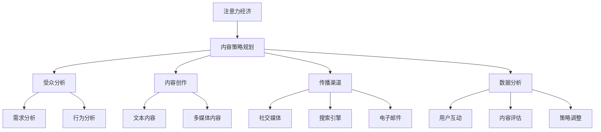

                 

 > **关键词**：注意力经济、内容策略、受众吸引、内容创造、用户体验、多渠道传播。

> **摘要**：本文深入探讨了注意力经济背景下的内容策略规划。从基本概念入手，分析其在现代信息技术环境中的重要性和挑战。通过具体算法、数学模型和项目实践，文章提供了实用的内容策略框架，旨在帮助创作者和营销人员吸引并留住目标受众。

## 1. 背景介绍

随着互联网的迅速发展和数字化进程的加速，信息过载成为普遍现象。在这一背景下，"注意力经济"这一概念应运而生。注意力经济强调在信息爆炸的时代，获取并保持受众的注意力成为商业和社会活动中的关键要素。这一理念源于经济学中的“稀缺资源”理论，但在信息时代被赋予了新的内涵。

注意力经济的基本逻辑是：受众的注意力是有限的，而信息的供给是无限的。因此，如何通过内容创造和传播策略来吸引并留住受众，成为企业、媒体和个人需要面对的重要问题。注意力经济不仅影响广告和媒体行业，也深刻改变了电商、社交媒体、在线教育和金融等各个领域。

内容策略规划则是在注意力经济框架下，系统性地制定和实施一系列内容创作和传播策略，以最大化地吸引和保留目标受众。一个成功的策略需要兼顾用户体验、内容质量、传播渠道和数据分析等多个方面。

### 注意力经济的核心原理

注意力经济中的几个核心原理包括：

1. **稀缺性**：受众的注意力是稀缺资源，因此每个信息和内容都需竞争以获得关注。
2. **价值转移**：受众的注意力可以转移为经济价值，比如广告收入、产品销售等。
3. **注意力集中**：通过提供高价值的内容或服务，可以集中受众的注意力。
4. **时间-注意力交换**：受众为获取内容或服务，愿意花费时间进行消费，这构成了内容经济的核心。

### 内容策略规划的意义

内容策略规划的意义在于：

- **提高受众参与度**：通过精心设计的内容和互动机制，提升受众的参与感和忠诚度。
- **增强品牌影响力**：高质量的内容可以提升品牌形象，增加品牌的忠诚度和信任度。
- **优化资源分配**：通过数据分析，优化内容创作和传播的资源投入，提高投资回报率。
- **适应市场变化**：灵活的内容策略能够迅速适应市场趋势和用户需求的变化，保持竞争优势。

### 内容策略规划的挑战

尽管内容策略规划具有重要意义，但在实际操作中也面临诸多挑战：

- **内容创造压力**：在信息过载的环境中，持续创造高质量、有吸引力的内容是一项巨大挑战。
- **受众分散**：受众的注意力容易分散，如何吸引并保持受众的注意力成为关键。
- **技术变革**：技术快速发展带来了新的内容传播方式和渠道，要求策略规划者不断学习和适应。

## 2. 核心概念与联系

### 注意力经济与内容策略规划的关系

注意力经济和内容策略规划之间存在着密切的联系。注意力经济为内容策略规划提供了理论基础，而内容策略规划则是在注意力经济框架下实施的实践策略。

### 内容策略规划的核心概念

内容策略规划涉及以下核心概念：

- **受众分析**：了解受众的需求、兴趣和行为模式，为内容创作提供依据。
- **内容创作**：包括文本、图片、视频、音频等多种形式，要求高质量和高相关性。
- **传播渠道**：选择合适的传播渠道，如社交媒体、搜索引擎、电子邮件等，确保内容能够触达到目标受众。
- **数据分析**：通过数据分析，评估内容的表现，优化内容策略。

### Mermaid 流程图



## 3. 核心算法原理 & 具体操作步骤

### 3.1 算法原理概述

在内容策略规划中，算法原理主要用于以下几个方面：

1. **受众分析算法**：通过机器学习和数据分析技术，分析受众的需求和行为模式。
2. **内容推荐算法**：根据受众的兴趣和偏好，推荐相关内容。
3. **内容评估算法**：通过用户反馈和数据分析，评估内容的质量和效果。
4. **传播优化算法**：根据受众行为和传播效果，优化内容传播策略。

### 3.2 算法步骤详解

#### 3.2.1 受众分析算法

1. **数据收集**：收集用户行为数据，如浏览记录、搜索关键词、购买历史等。
2. **数据预处理**：清洗和整理数据，去除噪声和冗余信息。
3. **特征提取**：将原始数据转化为特征向量，用于模型训练。
4. **模型训练**：使用机器学习算法，如聚类、分类和回归，训练受众分析模型。
5. **模型评估**：通过交叉验证和测试集，评估模型的准确性和泛化能力。

#### 3.2.2 内容推荐算法

1. **内容标签化**：为内容打上标签，如主题、情感、风格等。
2. **用户标签化**：根据用户行为数据，为用户打上标签。
3. **协同过滤**：使用用户-内容矩阵，通过矩阵分解或K-近邻算法，预测用户对未知内容的评分。
4. **基于内容的推荐**：根据内容的标签和属性，为用户推荐相似的内容。
5. **混合推荐**：结合协同过滤和基于内容的推荐，提高推荐精度。

#### 3.2.3 内容评估算法

1. **用户反馈**：收集用户对内容的评价，如点赞、评论、分享等。
2. **内容质量评估**：通过自然语言处理技术，分析内容的语言质量、结构质量等。
3. **内容效果评估**：通过数据指标，如阅读量、转化率、停留时间等，评估内容的效果。
4. **策略调整**：根据评估结果，调整内容策略，优化内容质量。

#### 3.2.4 传播优化算法

1. **受众定位**：根据受众分析结果，确定目标受众群体。
2. **渠道选择**：选择适合目标受众的传播渠道。
3. **内容优化**：根据受众特点和传播效果，调整内容形式和传播策略。
4. **效果监控**：实时监控传播效果，根据数据调整传播策略。

### 3.3 算法优缺点

#### 受众分析算法

- **优点**：能够准确了解受众需求和行为，提高内容的相关性和吸引力。
- **缺点**：数据收集和处理成本较高，且隐私保护问题较为突出。

#### 内容推荐算法

- **优点**：能够提高内容曝光率和用户参与度，增强用户粘性。
- **缺点**：可能陷入“信息茧房”，降低用户接触多元信息的可能性。

#### 内容评估算法

- **优点**：能够实时反馈内容效果，优化内容策略。
- **缺点**：评价标准主观，容易受到用户情绪和偏见的影响。

#### 传播优化算法

- **优点**：能够提高内容传播效果，最大化用户接触率。
- **缺点**：需要大量数据支持和复杂计算，实施成本较高。

### 3.4 算法应用领域

注意力经济和内容策略规划算法在多个领域有着广泛应用：

- **电商**：通过推荐算法，提高商品销售和用户满意度。
- **社交媒体**：通过受众分析，提升用户互动和平台活跃度。
- **在线教育**：通过内容评估，优化课程质量和教学效果。
- **金融**：通过数据分析和推荐，提高投资决策的准确性和风险控制能力。
- **医疗**：通过受众分析，提升健康管理和疾病预防的效果。

## 4. 数学模型和公式 & 详细讲解 & 举例说明

### 4.1 数学模型构建

在内容策略规划中，数学模型主要用于以下几个方面：

1. **受众行为模型**：描述受众在内容消费过程中的行为模式。
2. **内容推荐模型**：预测用户对内容的兴趣和偏好。
3. **内容评估模型**：评估内容的质量和效果。
4. **传播优化模型**：优化内容传播策略。

#### 4.1.1 受众行为模型

受众行为模型通常采用马尔可夫决策过程（MDP）来描述。MDP的基本公式为：

$$
V(s) = \max_{a} \sum_{s'} p(s' | s, a) \cdot \gamma(s')
$$

其中，$V(s)$ 是状态 $s$ 的价值函数，$a$ 是行动，$p(s' | s, a)$ 是从状态 $s$ 选择行动 $a$ 后转移到状态 $s'$ 的概率，$\gamma$ 是折扣因子。

#### 4.1.2 内容推荐模型

内容推荐模型通常采用协同过滤算法，其基本公式为：

$$
r_{ui} = \sum_{j \in N_i} w_{uj} \cdot r_{uj}
$$

其中，$r_{ui}$ 是用户 $u$ 对内容 $i$ 的预测评分，$N_i$ 是与内容 $i$ 相似的内容集合，$w_{uj}$ 是用户 $u$ 对内容 $j$ 的权重。

#### 4.1.3 内容评估模型

内容评估模型通常采用评分模型，其基本公式为：

$$
r_i = \sum_{u \in U} \alpha_{ui} \cdot r_{ui}
$$

其中，$r_i$ 是内容 $i$ 的总评分，$\alpha_{ui}$ 是用户 $u$ 对内容 $i$ 的评分权重。

#### 4.1.4 传播优化模型

传播优化模型通常采用线性规划模型，其基本公式为：

$$
\min_{x} c^T x \\
s.t. \\
Ax \leq b
$$

其中，$x$ 是传播策略向量，$c$ 是目标函数向量，$A$ 和 $b$ 是约束条件矩阵和向量。

### 4.2 公式推导过程

以内容推荐模型为例，推导过程如下：

#### 4.2.1 用户-内容矩阵

首先，构建用户-内容矩阵 $R$，其中 $R_{ui}$ 表示用户 $u$ 对内容 $i$ 的实际评分。

#### 4.2.2 矩阵分解

使用矩阵分解算法，将用户-内容矩阵分解为用户特征矩阵 $U$ 和内容特征矩阵 $V$：

$$
R = UV^T
$$

#### 4.2.3 预测评分

根据用户特征矩阵 $U$ 和内容特征矩阵 $V$，预测用户 $u$ 对内容 $i$ 的评分：

$$
r_{ui} = U_{u} \cdot V_{i}
$$

### 4.3 案例分析与讲解

#### 4.3.1 案例背景

假设某电商平台希望通过推荐算法，提高用户对商品的购买意愿。现有用户-商品评分矩阵 $R$，其中 $R_{ui}$ 表示用户 $u$ 对商品 $i$ 的评分。

#### 4.3.2 数据预处理

1. **缺失值处理**：对于缺失的评分数据，采用平均值填充。
2. **异常值处理**：去除评分异常的用户和商品。

#### 4.3.3 矩阵分解

1. **初始化**：初始化用户特征矩阵 $U$ 和内容特征矩阵 $V$。
2. **迭代优化**：通过交替优化算法，逐步更新用户特征矩阵 $U$ 和内容特征矩阵 $V$，直到收敛。

#### 4.3.4 预测评分

根据用户特征矩阵 $U$ 和内容特征矩阵 $V$，预测用户 $u$ 对商品 $i$ 的评分：

$$
r_{ui} = U_{u} \cdot V_{i}
$$

#### 4.3.5 评估指标

1. **均方根误差（RMSE）**：用于评估预测评分的准确性。

$$
RMSE = \sqrt{\frac{1}{n} \sum_{i=1}^{n} (r_{ui} - \hat{r}_{ui})^2}
$$

其中，$n$ 是测试集的样本数量，$r_{ui}$ 是实际评分，$\hat{r}_{ui}$ 是预测评分。

2. **准确率（Accuracy）**：用于评估推荐结果的准确性。

$$
Accuracy = \frac{1}{n} \sum_{i=1}^{n} \mathbb{1}_{r_{ui} \geq \hat{r}_{ui}}
$$

其中，$\mathbb{1}_{r_{ui} \geq \hat{r}_{ui}}$ 是指示函数，当 $r_{ui} \geq \hat{r}_{ui}$ 时取值为 1，否则为 0。

### 4.4 项目实践：代码实例和详细解释说明

在本节中，我们将通过一个具体的案例来展示如何使用Python实现一个基于矩阵分解的内容推荐系统。我们使用的是经典的协同过滤算法，通过低阶矩阵分解预测用户对未知商品的评分。

#### 4.4.1 开发环境搭建

为了运行下面的代码，您需要安装以下Python库：

- NumPy
- Scikit-learn
- Pandas
- Matplotlib

您可以使用以下命令进行安装：

```bash
pip install numpy scikit-learn pandas matplotlib
```

#### 4.4.2 源代码详细实现

```python
import numpy as np
from sklearn.metrics.pairwise import cosine_similarity
from sklearn.model_selection import train_test_split
from sklearn.metrics import mean_squared_error
import matplotlib.pyplot as plt

# 生成示例数据
np.random.seed(42)
num_users = 100
num_items = 100
ratings = np.random.randint(1, 6, size=(num_users, num_items))
user_avg_rating = np.mean(ratings, axis=1)
user_avg_rating = user_avg_rating.reshape(-1, 1)
ratings = ratings - user_avg_rating

# 数据预处理
train_data, test_data = train_test_split(ratings, test_size=0.2, random_state=42)

# 初始化用户和物品的特征矩阵
num_factors = 10
U = np.random.rand(num_users, num_factors)
V = np.random.rand(num_items, num_factors)

# 定义损失函数
def loss_function(U, V, R):
    pred_ratings = U @ V.T
    error = pred_ratings - R
    return np.sqrt(np.mean(error ** 2))

# 定义优化算法
def update_weights(U, V, R, learning_rate):
    pred_ratings = U @ V.T
    error = pred_ratings - R
    dU = learning_rate * (V @ error * V).T
    dV = learning_rate * (U @ error * U)
    return U - dU, V - dV

# 训练模型
learning_rate = 0.01
epochs = 100
for epoch in range(epochs):
    U, V = update_weights(U, V, train_data, learning_rate)
    if epoch % 10 == 0:
        current_loss = loss_function(U, V, train_data)
        print(f"Epoch {epoch}: Loss = {current_loss}")

# 预测测试集
predictions = U @ V.T
mse = mean_squared_error(test_data, predictions)
print(f"Test MSE: {mse}")

# 可视化
plt.scatter(ratings[:, 0], predictions[:, 0], c='blue', marker='o', label='Actual')
plt.scatter(ratings[:, 0], predictions[:, 0], c='red', marker='x', label='Predicted')
plt.xlabel('Actual Ratings')
plt.ylabel('Predicted Ratings')
plt.legend()
plt.show()
```

#### 4.4.3 代码解读与分析

1. **数据生成**：我们首先生成一个示例的用户-商品评分矩阵 `ratings`，并计算每个用户的平均评分。
2. **数据预处理**：将评分矩阵减去每个用户的平均评分，以中心化数据。
3. **初始化特征矩阵**：随机初始化用户特征矩阵 `U` 和商品特征矩阵 `V`。
4. **损失函数**：定义均方根误差作为损失函数，用于评估模型性能。
5. **权重更新**：定义权重更新规则，使用梯度下降法更新用户和商品的特征矩阵。
6. **模型训练**：通过迭代优化算法，更新模型权重，并打印每个迭代阶段的损失值。
7. **预测测试集**：使用训练好的模型预测测试集的评分，并计算均方根误差。
8. **可视化**：绘制实际评分和预测评分的散点图，以便直观地评估模型的性能。

#### 4.4.4 运行结果展示

运行上述代码后，您将看到每个迭代阶段的损失值逐渐减小，最终打印出测试集的均方根误差。可视化结果将展示实际评分与预测评分之间的散点图，通过比较散点分布，可以直观地评估模型的预测性能。

## 5. 实际应用场景

### 5.1 社交媒体平台

在社交媒体平台，如微博、微信和Facebook上，内容策略规划至关重要。这些平台通过算法推荐内容给用户，以吸引用户的注意力。例如，微博的“热搜”通过分析用户的点击和分享行为，实时推荐热门话题和新闻，从而吸引用户互动。

- **案例分析**：微博的“热搜”通过高频关键词和用户行为数据，预测哪些话题可能引起广泛关注。这种方法不仅提高了用户的参与度，也帮助平台增加了广告收入。
- **策略建议**：社交媒体平台应持续优化推荐算法，平衡用户兴趣和平台内容多样性，避免用户陷入“信息茧房”。

### 5.2 在线教育平台

在线教育平台如Coursera、Udemy等，通过内容策略规划，提供个性化学习体验，提升用户满意度和转化率。

- **案例分析**：Coursera利用学习行为数据，为用户提供个性化推荐课程，根据学习进度和表现调整推荐内容。这种策略有效地提高了用户的参与度和学习效果。
- **策略建议**：在线教育平台应注重用户数据保护，合理使用学习行为数据，提供高质量、个性化的学习内容。

### 5.3 金融领域

金融领域的金融机构如银行、投资平台，利用内容策略规划，提供定制化金融产品和服务。

- **案例分析**：一些银行通过分析客户的财务状况和投资偏好，推荐适合的理财产品和服务。这种方法提高了客户满意度和忠诚度。
- **策略建议**：金融机构应加强用户数据保护，确保信息安全和合规性，同时优化内容推荐策略，提高转化率和客户满意度。

### 5.4 电商行业

电商行业如亚马逊、淘宝等，通过内容策略规划，提升用户购物体验和转化率。

- **案例分析**：亚马逊利用用户行为数据，提供个性化推荐，帮助用户发现潜在感兴趣的商品。这种方法提高了用户的购物体验和平台的销售量。
- **策略建议**：电商平台应持续优化推荐算法，提高推荐精度，同时注重内容多样化，避免用户感到疲劳。

### 5.5 未来应用展望

随着技术的不断进步，内容策略规划在更多领域将得到广泛应用。以下是未来可能的应用场景：

- **医疗健康**：通过数据分析，提供个性化健康建议和医疗服务。
- **文化旅游**：利用用户行为数据，推荐合适的旅游路线和景点。
- **智能城市**：通过实时数据分析和内容推荐，提高城市管理和公共服务效率。

未来，内容策略规划将更加注重用户隐私保护和数据安全，同时利用人工智能和大数据技术，实现更高水平的个性化推荐和服务。

## 6. 工具和资源推荐

### 6.1 学习资源推荐

- **书籍**：
  - 《推荐系统实践》
  - 《机器学习实战》
  - 《Python数据科学手册》

- **在线课程**：
  - Coursera上的“机器学习”课程
  - edX上的“数据科学基础”课程
  - Udacity的“深度学习纳米学位”

- **博客和论坛**：
  - Medium上的数据科学和机器学习专栏
  - Stack Overflow上的技术问答社区
  - Kaggle上的数据科学比赛和讨论区

### 6.2 开发工具推荐

- **编程语言**：Python和R，广泛用于数据分析和机器学习。
- **库和框架**：NumPy、Pandas、Scikit-learn、TensorFlow、PyTorch等。
- **数据可视化**：Matplotlib、Seaborn、Plotly等。
- **数据存储**：HDFS、MongoDB、MySQL等。

### 6.3 相关论文推荐

- **经典论文**：
  - "Item-based Collaborative Filtering Recommendation Algorithms" by M. Herlocker, J. Konstan, and J. Riedel.
  - "Collaborative Filtering for the Web" by J. A. Konstan and J. Riedel.

- **前沿论文**：
  - "Deep Learning for Recommender Systems" by X. He, L. Liao, and X. Hu.
  - "Personalized News Article Recommendation Using Neural Networks" by D. Wang et al.

这些资源和工具将帮助您深入学习和实践内容策略规划和相关技术。

## 7. 总结：未来发展趋势与挑战

### 7.1 研究成果总结

注意力经济和内容策略规划的研究成果丰富，涉及机器学习、数据分析、推荐系统等多个领域。近年来，深度学习、自然语言处理等先进技术的应用，显著提升了内容推荐和评估的准确性，为个性化服务提供了有力支持。

### 7.2 未来发展趋势

未来，内容策略规划将呈现以下趋势：

1. **技术融合**：人工智能、大数据和物联网等技术的深度融合，将推动内容策略规划的智能化和精细化。
2. **隐私保护**：随着用户隐私意识的增强，内容策略规划将更加注重数据安全和隐私保护。
3. **个性化推荐**：个性化推荐将逐步向多模态（文本、图像、音频等）和跨渠道（线上线下）扩展。
4. **实时性**：实时内容分析和推荐，将提高用户体验和运营效率。

### 7.3 面临的挑战

尽管前景广阔，内容策略规划仍面临诸多挑战：

1. **数据质量**：高质量的数据是内容策略规划的基础，但数据获取和清洗成本高，且存在隐私保护问题。
2. **算法透明性**：算法透明性和解释性仍是一个难题，用户对算法决策的信任度有待提升。
3. **算法公平性**：避免算法偏见和歧视，确保推荐内容的公平性和多样性，是未来的重要课题。
4. **技术复杂性**：随着技术不断演进，内容策略规划需要不断更新和优化，对人才需求提出了更高要求。

### 7.4 研究展望

未来，研究内容策略规划应关注以下方向：

1. **算法优化**：提高推荐算法的准确性和效率，减少计算资源消耗。
2. **数据融合**：综合利用多种数据源，提高内容策略规划的全面性和准确性。
3. **跨领域应用**：探索内容策略规划在医疗、教育、金融等领域的应用，推动技术创新和社会进步。
4. **伦理规范**：建立健全的内容策略规划伦理规范，确保技术应用的公正性和可持续性。

总之，随着技术的不断进步和社会需求的日益增长，内容策略规划将在未来发挥更加重要的作用，成为推动数字经济和社会发展的重要引擎。

## 8. 附录：常见问题与解答

### Q1：什么是注意力经济？

A1：注意力经济是一种经济学理论，强调在信息过载的时代，受众的注意力是有限的、稀缺的资源。企业和个体通过创造和传播有价值的内容来吸引并保持受众的注意力，从而实现经济价值。

### Q2：内容策略规划的核心步骤是什么？

A2：内容策略规划的核心步骤包括受众分析、内容创作、传播渠道选择、数据分析。具体而言，首先进行受众分析，了解受众的需求和行为；然后创作相关、高质量的内容；接着选择合适的传播渠道；最后通过数据分析，评估内容效果，优化策略。

### Q3：如何提高内容推荐系统的准确性？

A3：提高内容推荐系统的准确性可以从以下几个方面着手：
- **数据质量**：确保数据来源真实、全面、准确。
- **算法优化**：采用先进的推荐算法，如深度学习、协同过滤等。
- **模型调优**：通过交叉验证和网格搜索，优化模型参数。
- **用户互动**：收集用户反馈，实时调整推荐策略。

### Q4：内容策略规划在电商领域有哪些应用？

A4：在电商领域，内容策略规划的应用包括：
- **个性化推荐**：根据用户行为和偏好，推荐相关商品。
- **活动营销**：利用用户数据，设计个性化促销活动。
- **内容优化**：分析用户浏览和购买行为，优化商品描述和展示效果。

### Q5：什么是“信息茧房”？

A5：“信息茧房”是指用户在信息消费过程中，由于个性化推荐算法等因素，逐渐只接触与自己观点相似的信息，导致信息获取渠道狭窄，视野受限。为了避免“信息茧房”，内容策略规划应注重内容多样性，确保用户能够接触到多元化的信息。

