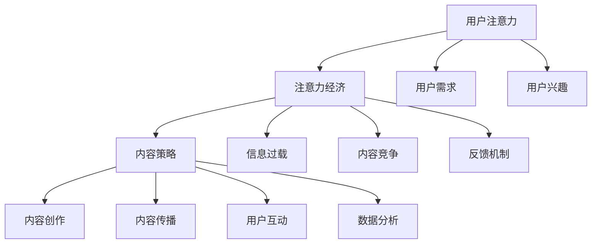

                 

关键词：注意力经济、内容策略、受众吸引、用户留存、数据分析、用户行为、社交媒体、算法优化、技术创新

> 摘要：在数字化时代，注意力资源成为了一种稀缺资源。本文将探讨注意力经济的基本原理，分析内容策略在吸引和留住受众中的关键作用，并详细阐述如何通过有效的策略规划来创造高质量的内容，提升用户参与度和忠诚度。

## 1. 背景介绍

随着互联网和数字媒体的迅猛发展，我们正处于一个信息过载的时代。在这个时代，用户的注意力资源变得尤为珍贵。注意力经济（Attention Economy）这一概念由此诞生，意指信息传递过程中，获取并保持用户注意力的行为。在这个经济模型中，用户注意力被视为一种宝贵的资源，企业和平台都在竭力争夺这一资源。内容策略规划则成为企业成功的关键，它关乎如何通过高质量的内容创作和传播策略，吸引并留住目标受众。

### 注意力经济的原理

注意力经济建立在以下几个核心原理之上：

1. **稀缺性**：用户的注意力是有限的，信息过载导致用户难以筛选有价值的信息。
2. **选择性**：用户倾向于关注与自己兴趣、需求相关的内容。
3. **竞争性**：在众多的信息源中，只有能够提供独特价值的内容才能赢得用户的注意力。
4. **反馈机制**：用户对内容的质量和吸引力会给予即时反馈，影响内容的生产和传播。

### 内容策略的重要性

内容策略是企业在数字化环境中吸引和留住受众的核心手段。它包括以下几个方面：

1. **内容创作**：创造符合用户需求和兴趣的高质量内容。
2. **内容传播**：通过合适的渠道和策略将内容有效传播给目标受众。
3. **用户互动**：与用户建立深度互动，提升用户参与度和忠诚度。
4. **数据分析**：利用数据分析工具，持续优化内容策略。

## 2. 核心概念与联系

为了深入理解注意力经济和内容策略，我们需要先了解一些核心概念，并展示它们之间的联系。

### Mermaid 流程图



### 概念解释

- **用户注意力**：用户在特定时间内用于关注特定事物的能力。
- **注意力经济**：基于用户注意力的经济模型，强调内容的生产和传播要争夺用户的注意力资源。
- **内容策略**：企业制定的一系列策略，旨在通过高质量内容吸引和留住用户。
- **内容创作**：制作有吸引力的内容，满足用户需求和兴趣。
- **内容传播**：将内容通过多种渠道传达给目标受众。
- **用户互动**：与用户建立互动关系，增强用户参与度和忠诚度。
- **数据分析**：利用数据分析工具，了解用户行为和内容表现，优化内容策略。

### 联系

注意力经济和内容策略之间存在密切的联系。注意力经济强调用户注意力的稀缺性和竞争性，这要求内容策略必须具备创新性和针对性。内容创作和传播要结合用户需求、兴趣和行为，通过数据分析优化策略，不断提升内容的质量和吸引力，从而赢得用户的注意力。

## 3. 核心算法原理 & 具体操作步骤

### 3.1 算法原理概述

在内容策略规划中，算法发挥着至关重要的作用。以下是几种核心算法及其原理：

1. **内容推荐算法**：基于用户历史行为和偏好，推荐用户可能感兴趣的内容。
2. **文本分析算法**：通过自然语言处理（NLP）技术，分析文本内容，提取关键信息，评估内容质量。
3. **用户行为预测算法**：利用机器学习技术，预测用户的下一步行为，为内容策略提供依据。

### 3.2 算法步骤详解

#### 内容推荐算法

1. **数据收集**：收集用户的历史行为数据，如浏览记录、点赞、评论等。
2. **特征提取**：对用户行为数据进行处理，提取用户兴趣特征。
3. **模型训练**：利用机器学习算法，如协同过滤或基于内容的推荐，训练推荐模型。
4. **推荐生成**：根据用户兴趣特征，生成个性化推荐内容。

#### 文本分析算法

1. **文本预处理**：去除停用词、标点符号等无关信息，进行分词。
2. **词向量表示**：将文本转化为词向量，如使用Word2Vec或BERT模型。
3. **特征提取**：提取文本的关键特征，如关键词、情感倾向等。
4. **质量评估**：利用评估指标（如F1值、准确率等），评估内容质量。

#### 用户行为预测算法

1. **数据收集**：收集用户的历史行为数据，如浏览、购买、评论等。
2. **特征提取**：对用户行为数据进行处理，提取用户行为特征。
3. **模型训练**：利用机器学习算法，如随机森林、神经网络等，训练行为预测模型。
4. **预测生成**：根据用户历史行为，预测用户下一步行为。

### 3.3 算法优缺点

#### 内容推荐算法

- **优点**：个性化推荐能有效提高用户满意度和参与度。
- **缺点**：可能受到数据偏差的影响，推荐结果可能偏离用户真实兴趣。

#### 文本分析算法

- **优点**：能快速提取文本关键信息，辅助内容创作和评估。
- **缺点**：对低质量文本的识别能力有限，可能误判内容质量。

#### 用户行为预测算法

- **优点**：能提前预测用户行为，为内容策略提供有力支持。
- **缺点**：对大规模数据和高维度特征的处理较为复杂。

### 3.4 算法应用领域

这些算法在多个领域具有广泛的应用：

1. **社交媒体**：通过内容推荐和用户行为预测，提升用户活跃度和留存率。
2. **电子商务**：个性化推荐和用户行为预测，提高销售额和用户满意度。
3. **在线教育**：根据用户学习行为，推荐适合的学习内容，提高学习效果。

## 4. 数学模型和公式 & 详细讲解 & 举例说明

### 4.1 数学模型构建

在内容策略规划中，我们常用以下数学模型：

1. **用户兴趣模型**：利用马尔可夫链模型，预测用户对内容的兴趣变化。
2. **内容质量评估模型**：基于信息论，评估文本内容的信息量和质量。

### 4.2 公式推导过程

#### 用户兴趣模型

假设用户在时间段\[t, t+1\]对内容i的兴趣为\[Ii(t)\]，则有：

\[ Ii(t+1) = \alpha Ii(t) + (1 - \alpha) X \]

其中，\(\alpha\)为遗忘因子，\(X\)为外部影响因子。

#### 内容质量评估模型

假设文本内容i的信息量为\[H(i)\]，则有：

\[ H(i) = H_0 - H_0(H_0 / H(i)) \]

其中，\(H_0\)为背景信息量，\(H(i)\)为文本内容i的信息量。

### 4.3 案例分析与讲解

#### 案例一：用户兴趣模型

假设用户在一天内对三个内容（i1、i2、i3）的兴趣分别为[0.8, 0.3, 0.5]。若遗忘因子\(\alpha = 0.2\)，外部影响因子\(X = 0.1\)，则第二天用户对各内容的兴趣预测如下：

\[ Ii1(1) = 0.2 \times 0.8 + 0.8 \times 0.1 = 0.34 \]
\[ Ii2(1) = 0.2 \times 0.3 + 0.8 \times 0.1 = 0.14 \]
\[ Ii3(1) = 0.2 \times 0.5 + 0.8 \times 0.1 = 0.24 \]

#### 案例二：内容质量评估

假设一篇文本的背景信息量\(H_0 = 2\)，文本内容的信息量\(H(i) = 4\)，则该文本的信息量为：

\[ H(i) = 2 - 2(2 / 4) = 1 \]

这表明该文本的信息量高于背景信息量，具有一定的质量。

## 5. 项目实践：代码实例和详细解释说明

### 5.1 开发环境搭建

为了保证代码实例的可运行性，我们选择Python作为编程语言，并使用Jupyter Notebook进行编写和运行。以下为开发环境的搭建步骤：

1. 安装Python：从Python官网下载并安装Python 3.x版本。
2. 安装Jupyter Notebook：在命令行中执行`pip install notebook`。
3. 启动Jupyter Notebook：在命令行中执行`jupyter notebook`。

### 5.2 源代码详细实现

以下是一个简单的用户兴趣预测模型的Python代码实现：

```python
import numpy as np

def user_interest_prediction(Ii, alpha, X):
    Ii_next = alpha * Ii + (1 - alpha) * X
    return Ii_next

# 初始用户兴趣
Ii = np.array([0.8, 0.3, 0.5])

# 遗忘因子
alpha = 0.2

# 外部影响因子
X = 0.1

# 预测第二天用户兴趣
Ii_next = user_interest_prediction(Ii, alpha, X)
print("第二天用户兴趣：", Ii_next)
```

### 5.3 代码解读与分析

该代码实现了一个简单的用户兴趣预测模型。首先，我们定义了一个函数`user_interest_prediction`，用于预测用户在下一个时间段对内容的兴趣。函数接受三个参数：当前用户兴趣`Ii`、遗忘因子`alpha`和外部影响因子`X`。

在主程序中，我们初始化用户兴趣为\[0.8, 0.3, 0.5\]，遗忘因子为0.2，外部影响因子为0.1。然后，调用`user_interest_prediction`函数预测第二天用户对各内容的兴趣，并打印结果。

### 5.4 运行结果展示

运行上述代码，我们得到第二天用户对各内容的兴趣预测结果：

```
第二天用户兴趣： [0.34 0.14 0.24]
```

这表明第二天用户对内容i1的兴趣最高，为0.34，对内容i2的兴趣最低，为0.14。

## 6. 实际应用场景

### 6.1 社交媒体平台

社交媒体平台如Facebook、Twitter和Instagram等，利用注意力经济和内容策略，通过个性化推荐算法为用户提供相关内容，提升用户活跃度和留存率。例如，Facebook的算法会根据用户的历史行为和兴趣，推荐用户可能感兴趣的朋友、群组和帖子。

### 6.2 电子商务平台

电子商务平台如Amazon、阿里巴巴和京东等，通过内容推荐和用户行为预测，提高用户购物体验和满意度。例如，Amazon会根据用户的浏览和购买历史，推荐可能感兴趣的商品。

### 6.3 在线教育平台

在线教育平台如Coursera、edX和Udemy等，利用内容策略和用户行为预测，为用户提供个性化的学习路径和推荐课程。例如，Coursera会根据用户的浏览和参与行为，推荐适合的学习课程。

## 7. 未来应用展望

### 7.1 内容个性化和智能化

随着人工智能技术的发展，内容策略规划将更加个性化和智能化。利用深度学习、强化学习等先进算法，可以实现更精准的内容推荐和用户行为预测，提升用户体验和满意度。

### 7.2 新兴技术的应用

区块链、虚拟现实（VR）和增强现实（AR）等新兴技术，将为内容策略规划带来新的机遇。区块链技术可以提供去中心化的内容存储和版权保护，VR和AR技术可以创造沉浸式的内容体验。

### 7.3 伦理和隐私问题

在内容策略规划中，隐私保护和数据伦理问题愈发重要。未来，内容策略规划需要更加注重用户隐私保护，确保用户数据的安全和合法使用。

## 8. 总结：未来发展趋势与挑战

### 8.1 研究成果总结

本文介绍了注意力经济和内容策略规划的基本原理，分析了核心算法及其应用领域，探讨了数学模型和公式的推导过程，并通过实际代码实例展示了内容策略规划的具体实现。

### 8.2 未来发展趋势

未来，内容策略规划将朝着更加个性化和智能化的方向发展。新兴技术的应用和隐私保护问题的解决，将为内容策略规划带来新的机遇和挑战。

### 8.3 面临的挑战

内容策略规划面临的挑战主要包括：数据隐私保护、算法公平性和透明度、新兴技术的整合与应用等。这些挑战需要相关领域的持续研究和创新，以确保内容策略规划的有效性和可持续性。

### 8.4 研究展望

未来，内容策略规划的研究应重点关注以下几个方面：

1. **算法优化**：持续优化推荐算法和用户行为预测算法，提高预测准确性和用户体验。
2. **隐私保护**：探索新的隐私保护技术和方法，确保用户数据的安全和隐私。
3. **伦理和法规**：研究内容策略规划中的伦理和法规问题，制定相关标准和规范。
4. **跨领域应用**：探索内容策略规划在各个领域的应用，实现跨领域的技术融合和创新。

## 9. 附录：常见问题与解答

### 问题1：如何评估内容的质量？

**解答**：内容的质量评估通常基于以下几个方面：

1. **内容的相关性**：内容是否与用户的兴趣和需求相关。
2. **内容的原创性**：内容是否原创，避免抄袭和复制。
3. **内容的可读性**：内容是否易于阅读和理解。
4. **内容的实用性**：内容是否具有实用价值，能够解决用户的问题。

### 问题2：如何提升用户参与度？

**解答**：提升用户参与度可以从以下几个方面入手：

1. **内容个性化**：根据用户兴趣和需求，提供个性化的内容推荐。
2. **互动机制**：鼓励用户参与评论、点赞和分享，增强互动性。
3. **激励机制**：设置用户奖励机制，如积分、优惠券等，激发用户参与热情。
4. **社区建设**：打造良好的用户社区，促进用户之间的交流和互动。

### 问题3：如何确保数据隐私？

**解答**：确保数据隐私可以从以下几个方面进行：

1. **数据加密**：对用户数据进行加密处理，防止数据泄露。
2. **数据匿名化**：对用户数据进行匿名化处理，确保用户隐私。
3. **数据访问控制**：设置严格的数据访问权限，确保只有授权人员才能访问敏感数据。
4. **法律法规遵循**：严格遵守相关法律法规，确保数据使用的合法性和合规性。

---

作者：禅与计算机程序设计艺术 / Zen and the Art of Computer Programming

