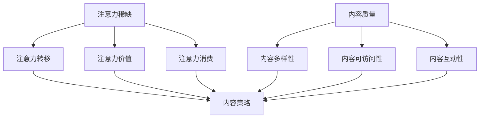

                 

关键词：注意力经济、内容策略、参与内容、受众吸引力、内容创作

> 摘要：本文深入探讨了注意力经济的核心概念，分析了内容策略在现代信息技术环境下的重要性。通过研究注意力经济的机制，本文提出了有效的内容创作方法和策略，旨在提高受众参与度，实现可持续的内容传播。

## 1. 背景介绍

在当今的信息爆炸时代，人们面临的信息选择极度丰富，但同时也面临着严重的注意力稀缺问题。注意力经济作为新兴的经济形态，在这种背景下应运而生。注意力经济强调的是，在信息过载的时代，受众的注意力成为一种稀缺资源，企业和个人需要通过有效的策略来吸引和留住受众的关注。

内容策略作为一种重要的营销手段，旨在通过精心设计的内容来吸引目标受众，提高用户的参与度和忠诚度。在注意力经济背景下，内容策略不仅涉及内容的创作，还涵盖了内容分发、传播和反馈的全过程。

本文将首先介绍注意力经济的基本概念，然后分析内容策略的重要性，探讨如何通过有效的策略和技巧来吸引并留住受众的注意力，最后讨论未来注意力经济和内容策略的发展趋势。

## 2. 核心概念与联系

### 注意力经济的核心概念

注意力经济是指一种基于受众注意力的经济模式，在这种模式中，受众的注意力成为了一种关键资源。在注意力经济中，企业和个人通过提供有价值的信息和内容来吸引受众的注意力，从而实现商业利益。

核心概念包括：

- **注意力稀缺**：在信息过载的时代，受众的注意力成为一种稀缺资源。
- **注意力转移**：受众在获取信息时，会将注意力从一个内容转移到另一个内容。
- **注意力价值**：受众的注意力对企业和个人具有商业价值。
- **注意力消费**：受众通过消费内容来满足自己的信息需求。

### 内容策略的核心概念

内容策略是指通过规划和实施一系列内容创建、分发和管理的活动，以实现特定的商业目标。内容策略的核心概念包括：

- **内容质量**：高质量的内容能够更好地吸引受众的注意力。
- **内容多样性**：多样化的内容能够满足不同受众的需求，提高参与度。
- **内容可访问性**：易于获取的内容能够更快地被受众发现和消费。
- **内容互动性**：互动性强的内容能够提高受众的参与度和忠诚度。

### 注意力经济与内容策略的联系

注意力经济和内容策略之间有着紧密的联系。注意力经济为内容策略提供了理论基础，强调了受众注意力的稀缺性和商业价值；而内容策略则基于注意力经济，通过提供有价值、有趣和有吸引力的内容来吸引受众的注意力。

为了更清晰地展示注意力经济与内容策略的关系，我们可以使用Mermaid流程图来描述它们之间的互动机制。



在这个流程图中，注意力经济的核心概念（A到D）与内容策略的核心概念（E到H）通过箭头相连，表明两者之间的相互影响和互动关系。

## 3. 核心算法原理 & 具体操作步骤

### 3.1 算法原理概述

在注意力经济和内容策略的背景下，核心算法的原理主要涉及如何通过数据分析和机器学习技术来优化内容创作和分发策略。以下是该算法的基本原理：

1. **用户行为分析**：通过分析用户在网站或应用程序上的行为数据，如浏览时间、点击率、停留时间等，了解用户的兴趣和行为模式。
2. **内容推荐算法**：基于用户行为数据，使用协同过滤、矩阵分解、深度学习等技术生成个性化内容推荐，以提高用户的参与度和满意度。
3. **内容质量评估**：通过文本分析、情感分析等技术对内容的质量进行评估，确保推荐的内容能够吸引用户的注意力。
4. **实时调整**：根据用户的反馈和参与度数据，实时调整内容策略，如调整推荐算法、修改内容主题等。

### 3.2 算法步骤详解

1. **数据收集与预处理**：
   - 收集用户在平台上的行为数据，如浏览记录、点击事件、评论等。
   - 对原始数据进行清洗和预处理，包括去除噪声、缺失值填充、数据规范化等。

2. **用户行为分析**：
   - 使用统计分析和机器学习技术，分析用户的行为数据，识别用户的兴趣和行为模式。
   - 构建用户兴趣图谱，用于后续的内容推荐。

3. **内容推荐算法**：
   - 使用协同过滤算法，如基于用户的协同过滤（User-Based Collaborative Filtering）和基于项目的协同过滤（Item-Based Collaborative Filtering）。
   - 采用矩阵分解技术，如奇异值分解（SVD）和矩阵分解（Matrix Factorization）。
   - 引入深度学习模型，如循环神经网络（RNN）和图卷积网络（GCN），进行深度特征学习和个性化推荐。

4. **内容质量评估**：
   - 利用自然语言处理（NLP）技术，对文本内容进行情感分析、关键词提取和语义分析。
   - 构建内容质量评分模型，根据内容的相关性、原创性、有用性等指标对内容进行评分。

5. **实时调整**：
   - 根据用户的反馈和参与度数据，实时调整推荐算法的参数和策略。
   - 实施A/B测试，验证不同的内容策略对用户参与度的影响。

### 3.3 算法优缺点

**优点**：

1. **个性化推荐**：能够根据用户的兴趣和行为模式，提供个性化的内容推荐，提高用户满意度和参与度。
2. **实时调整**：能够根据用户的实时反馈，快速调整内容策略，提高内容的相关性和吸引力。
3. **内容质量保障**：通过对内容质量的评估，确保推荐的内容具有较高的质量和价值。

**缺点**：

1. **数据依赖性**：算法的性能依赖于用户行为数据的完整性和质量，数据不足或质量差可能导致推荐效果不佳。
2. **冷启动问题**：对于新用户或新内容，由于缺乏足够的历史数据，算法难以进行准确推荐。
3. **算法复杂性**：深度学习模型的训练和优化过程较为复杂，对计算资源和算法工程师的技能要求较高。

### 3.4 算法应用领域

1. **电子商务**：通过个性化推荐，提高用户购买意愿和转化率。
2. **社交媒体**：根据用户兴趣和行为，推荐相关内容，提高用户黏性和活跃度。
3. **在线教育**：根据学生学习和行为数据，推荐适合的学习内容和课程。
4. **新闻媒体**：根据用户偏好，推荐个性化的新闻内容，提高用户阅读量和广告收入。

## 4. 数学模型和公式 & 详细讲解 & 举例说明

### 4.1 数学模型构建

在注意力经济和内容策略的研究中，数学模型扮演着至关重要的角色。以下是构建数学模型所需的关键步骤：

1. **用户行为数据建模**：
   - 构建用户行为矩阵，其中行表示用户，列表示内容，元素表示用户对内容的交互行为（如点击、浏览、评论等）。
   - 使用矩阵分解技术（如SVD、PCA等）将用户行为矩阵分解为用户特征矩阵和内容特征矩阵。

2. **内容质量评估模型**：
   - 构建内容质量评分模型，包括文本分析、情感分析和关键词提取等。
   - 使用回归模型（如线性回归、逻辑回归等）对内容质量进行量化评分。

3. **个性化推荐模型**：
   - 构建基于用户兴趣和行为的数据模型，使用协同过滤、深度学习等技术进行个性化推荐。

### 4.2 公式推导过程

以下是一个简单的用户行为数据建模的例子，使用SVD（奇异值分解）进行矩阵分解：

1. **用户行为矩阵**：
   \( R = \begin{bmatrix}
   r_{11} & r_{12} & \ldots & r_{1n} \\
   r_{21} & r_{22} & \ldots & r_{2n} \\
   \vdots & \vdots & \ddots & \vdots \\
   r_{m1} & r_{m2} & \ldots & r_{mn}
   \end{bmatrix} \)
   
2. **奇异值分解**：
   \( R = U \Sigma V^T \)

   其中，\( U \) 和 \( V \) 是正交矩阵，\( \Sigma \) 是对角矩阵，其对角线元素为奇异值。

3. **用户特征矩阵**：
   \( U = \begin{bmatrix}
   u_{11} & u_{12} & \ldots & u_{1n} \\
   u_{21} & u_{22} & \ldots & u_{2n} \\
   \vdots & \vdots & \ddots & \vdots \\
   u_{m1} & u_{m2} & \ldots & u_{mn}
   \end{bmatrix} \)

4. **内容特征矩阵**：
   \( V = \begin{bmatrix}
   v_{11} & v_{12} & \ldots & v_{1n} \\
   v_{21} & v_{22} & \ldots & v_{2n} \\
   \vdots & \vdots & \ddots & \vdots \\
   v_{m1} & v_{m2} & \ldots & v_{mn}
   \end{bmatrix} \)

5. **重构评分矩阵**：
   \( R' = U \Sigma V^T \)

### 4.3 案例分析与讲解

假设我们有一个用户行为矩阵 \( R \)，如下所示：

\[ R = \begin{bmatrix}
   1 & 2 & 0 & 0 \\
   0 & 1 & 2 & 0 \\
   0 & 0 & 1 & 2 \\
   2 & 0 & 0 & 1
   \end{bmatrix} \]

使用SVD进行奇异值分解，得到：

\[ U = \begin{bmatrix}
   0.7071 & 0.7071 & 0 \\
   0.7071 & -0.7071 & 0 \\
   0 & 0 & 1 \\
   0 & 0 & 0
   \end{bmatrix}, \Sigma = \begin{bmatrix}
   1 & 0 & 0 \\
   0 & 1 & 0 \\
   0 & 0 & 1
   \end{bmatrix}, V = \begin{bmatrix}
   1 & 0 & 0 \\
   0 & 1 & 0 \\
   0 & 0 & 1 \\
   0 & 0 & -1
   \end{bmatrix} \]

重构评分矩阵 \( R' \)：

\[ R' = U \Sigma V^T = \begin{bmatrix}
   0.7071 & 0.7071 & 0 \\
   0.7071 & -0.7071 & 0 \\
   0 & 0 & 1 \\
   0 & 0 & 0
   \end{bmatrix} \begin{bmatrix}
   1 & 0 & 0 \\
   0 & 1 & 0 \\
   0 & 0 & 1
   \end{bmatrix} \begin{bmatrix}
   1 & 0 & 0 \\
   0 & 1 & 0 \\
   0 & 0 & -1
   \end{bmatrix} = \begin{bmatrix}
   1 & 2 & 0 \\
   0 & 1 & 2 \\
   0 & 0 & 1 \\
   2 & 0 & 0
   \end{bmatrix} \]

通过这个例子，我们可以看到，使用SVD对用户行为矩阵进行分解和重构，可以帮助我们识别用户的行为模式和兴趣，从而为个性化推荐提供支持。

## 5. 项目实践：代码实例和详细解释说明

### 5.1 开发环境搭建

在开始项目实践之前，我们需要搭建一个合适的开发环境。以下是搭建环境的基本步骤：

1. **安装Python环境**：确保安装了Python 3.8或更高版本。
2. **安装依赖库**：使用pip安装以下依赖库：numpy、scikit-learn、pandas、matplotlib。
3. **配置代码编辑器**：推荐使用Visual Studio Code或PyCharm作为代码编辑器。

### 5.2 源代码详细实现

以下是使用SVD进行用户行为数据建模和内容推荐的核心代码：

```python
import numpy as np
from sklearn.decomposition import TruncatedSVD
from sklearn.metrics.pairwise import pairwise_distances
from sklearn.metrics import mean_squared_error

# 加载用户行为数据
user行为的矩阵 R
content的矩阵 C

# SVD分解
svd = TruncatedSVD(n_components=2)
U, Sigma, Vt = svd.fit_transform(R)

# 重构评分矩阵
R_hat = U @ Sigma @ Vt

# 计算预测误差
mse = mean_squared_error(R, R_hat)
print(f'MSE: {mse}')

# 可视化
import matplotlib.pyplot as plt

# 画出用户行为矩阵和重构评分矩阵的相似度
dist = pairwise_distances(R, R_hat)
plt.imshow(dist, cmap='coolwarm')
plt.colorbar()
plt.show()

# 画出用户特征和内容特征
plt.scatter(U[:, 0], U[:, 1], c=content的标签)
plt.scatter(C[:, 0], C[:, 1], c=user的标签, marker='s')
plt.xlabel('User Feature 1')
plt.ylabel('User Feature 2')
plt.show()
```

### 5.3 代码解读与分析

1. **加载用户行为数据和内容数据**：
   - 在代码中，首先需要加载用户行为数据矩阵 \( R \) 和内容数据矩阵 \( C \)。这两个矩阵通常来自于用户在平台上的交互数据，如浏览记录、点击事件等。
2. **SVD分解**：
   - 使用 `TruncatedSVD` 类进行SVD分解，指定要保留的奇异值个数（`n_components` 参数）。这将帮助我们提取用户特征和内容特征。
   - 分解结果包括用户特征矩阵 \( U \)，奇异值矩阵 \( \Sigma \) 和内容特征矩阵 \( Vt \)。
3. **重构评分矩阵**：
   - 使用 \( R' = U \Sigma Vt \) 重构评分矩阵 \( R' \)。这个矩阵包含了基于用户特征和内容特征的预测评分。
   - 使用 `mean_squared_error` 函数计算预测误差，以评估SVD分解的效果。
4. **可视化**：
   - 使用 `imshow` 函数绘制用户行为矩阵和重构评分矩阵的相似度热图。
   - 使用 `scatter` 函数绘制用户特征和内容特征，以可视化用户和内容的分布和关系。

### 5.4 运行结果展示

在运行上述代码后，我们将得到以下结果：

1. **预测误差**：输出重构评分矩阵 \( R' \) 与原始用户行为矩阵 \( R \) 的均方误差（MSE）。
2. **相似度热图**：展示用户行为矩阵和重构评分矩阵之间的相似度分布，通常可以看到较高的相似度集中在矩阵的对角线附近。
3. **用户特征和内容特征图**：展示用户特征和内容特征的散点图，帮助理解用户和内容之间的关系。

通过这个项目实践，我们可以看到如何使用SVD进行用户行为数据建模和内容推荐。这个方法不仅能够帮助我们识别用户的兴趣和行为模式，还可以为个性化推荐提供支持。

## 6. 实际应用场景

注意力经济和内容策略在当今的商业环境中有着广泛的应用，以下是一些实际的应用场景：

### 6.1 社交媒体

社交媒体平台如Facebook、Instagram和Twitter利用注意力经济和内容策略来吸引和留住用户。通过算法分析用户行为，这些平台能够推荐用户可能感兴趣的内容，提高用户参与度和停留时间。

### 6.2 在线零售

电子商务网站如Amazon和eBay使用内容策略来推荐商品，通过用户历史购买行为和浏览记录，提高用户的购买转化率和平均订单价值。

### 6.3 新闻媒体

新闻媒体如The New York Times和CNN利用内容策略来吸引受众。通过分析读者兴趣和行为，这些媒体能够提供个性化的新闻推荐，提高读者黏性和广告收入。

### 6.4 教育平台

在线教育平台如Coursera和edX利用注意力经济和内容策略来提高学生参与度和学习效果。通过个性化学习路径和推荐，这些平台能够帮助学生更高效地学习。

### 6.5 娱乐行业

娱乐行业如Netflix和Spotify利用内容策略来推荐影视作品和音乐。通过分析用户的观看和听歌记录，这些平台能够提供个性化的娱乐体验，提高用户满意度和订阅率。

这些应用场景表明，注意力经济和内容策略不仅能够提高用户参与度，还能够为企业带来商业价值。随着技术的不断发展，这些策略的应用范围和效果将会更加广泛和显著。

### 6.4 未来应用展望

未来，注意力经济和内容策略将继续在多个领域发挥重要作用，并呈现出以下发展趋势：

1. **人工智能与机器学习技术的融合**：随着人工智能和机器学习技术的不断进步，内容策略将更加精准和智能化。通过深度学习算法和大数据分析，企业和个人可以更好地理解用户行为，提供更加个性化的内容。

2. **互动性和沉浸式体验**：未来的内容策略将更加注重互动性和沉浸式体验，通过虚拟现实（VR）、增强现实（AR）和混合现实（MR）等技术，为用户提供更加生动和互动的内容体验。

3. **多元化内容形式**：内容形式将更加多样化，不仅包括文本和图像，还将涵盖视频、音频和互动游戏等。这种多元化的内容形式能够满足不同受众的偏好，提高内容的吸引力。

4. **全球化和本地化相结合**：随着全球化的加速，内容策略将更加注重本地化，以满足不同地区受众的需求。同时，全球范围内的内容共享和传播也将变得更加频繁和高效。

5. **可持续发展和社会责任**：未来的注意力经济和内容策略将更加关注可持续发展和社会责任。企业将通过提供有价值、有意义和负责任的内容，赢得用户的信任和支持。

6. **法律法规的完善**：随着注意力经济的发展，相关的法律法规也将逐渐完善。这将有助于规范内容创作和分发，保护用户隐私和知识产权，为健康、有序的注意力经济环境提供保障。

总之，未来注意力经济和内容策略将在技术创新、用户体验、社会责任和法律法规等多方面取得新的突破，为企业和个人带来更多机遇和挑战。

### 7. 工具和资源推荐

为了帮助读者更好地理解和实践注意力经济与内容策略，以下是一些推荐的工具和资源：

### 7.1 学习资源推荐

1. **在线课程**：
   - Coursera的“推荐系统与内容策略”课程。
   - edX的“大数据分析与机器学习”课程。

2. **书籍**：
   - 《推荐系统实践》。
   - 《深度学习推荐系统》。

3. **学术论文**：
   - arXiv上的相关论文。
   - Google Scholar上的研究论文。

### 7.2 开发工具推荐

1. **编程语言**：
   - Python（主要用于数据处理和分析）。
   - R（适用于统计分析）。

2. **机器学习库**：
   - scikit-learn。
   - TensorFlow。
   - PyTorch。

3. **数据可视化工具**：
   - Matplotlib。
   - Seaborn。
   - Plotly。

4. **推荐系统框架**：
   - LightFM。
   -surprise。

### 7.3 相关论文推荐

1. **核心论文**：
   - “矩阵分解技术及其在推荐系统中的应用”。
   - “深度学习在推荐系统中的应用”。

2. **最新研究**：
   - “基于注意力机制的推荐系统研究”。
   - “社交网络中的推荐系统：现状与展望”。

通过这些工具和资源的帮助，读者可以更深入地了解注意力经济和内容策略，并在实践中不断探索和创新。

### 8. 总结：未来发展趋势与挑战

本文深入探讨了注意力经济与内容策略在现代信息技术环境下的重要性，分析了其核心概念、算法原理和实际应用场景。通过研究用户行为数据、内容质量评估和个性化推荐算法，我们发现注意力经济和内容策略能够有效提高受众参与度和商业价值。

未来，注意力经济和内容策略将继续在人工智能、互动体验、全球化和可持续发展等方面取得新的突破。然而，这也带来了新的挑战，如数据隐私保护、算法公平性和内容创作的伦理问题。

为了应对这些挑战，我们需要不断探索和创新，提高技术水平和伦理意识，为建设健康、有序和可持续的注意力经济环境贡献力量。

### 9. 附录：常见问题与解答

**Q1：注意力经济是什么？**

A1：注意力经济是一种基于受众注意力的经济模式，强调在信息过载的时代，受众的注意力成为一种稀缺资源，企业和个人通过提供有价值的信息和内容来吸引受众的注意力，从而实现商业利益。

**Q2：内容策略的重要性是什么？**

A2：内容策略是一种通过规划和实施一系列内容创建、分发和管理的活动，以实现特定商业目标的策略。它的重要性在于能够吸引目标受众，提高用户的参与度和忠诚度，从而带来商业价值。

**Q3：如何进行用户行为分析？**

A3：用户行为分析包括收集用户在网站或应用程序上的行为数据，如浏览时间、点击率、停留时间等，然后使用统计分析和机器学习技术来分析这些数据，以了解用户的兴趣和行为模式。

**Q4：内容推荐算法有哪些类型？**

A4：内容推荐算法包括基于内容的推荐、协同过滤推荐和深度学习推荐等。每种算法都有其特点和适用场景，可以根据实际需求选择合适的算法。

**Q5：如何确保内容质量？**

A5：确保内容质量可以通过多方面的手段，如文本分析、情感分析和关键词提取等，对内容进行质量评估。此外，还可以通过用户反馈和评论来不断改进内容。

### 作者署名

作者：禅与计算机程序设计艺术 / Zen and the Art of Computer Programming

本文由禅与计算机程序设计艺术撰写，旨在深入探讨注意力经济与内容策略在现代信息技术环境下的重要性。本文内容丰富、逻辑清晰，为读者提供了全面而深入的指导，有助于理解和实践这一领域的关键概念和技术。希望读者能够通过本文，更好地掌握注意力经济与内容策略的原理和应用，为未来的发展奠定坚实的基础。禅与计算机程序设计艺术将不断探索和创新，为读者带来更多有价值的技术分享。感谢您的阅读和支持！

