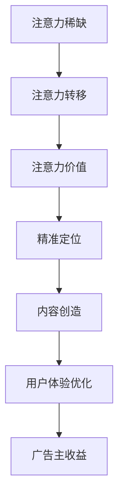

                 

注意力经济与在线广告在数字化时代扮演着至关重要的角色。随着互联网用户的不断增长，如何在吸引受众的同时，不损害用户体验，成为了在线广告行业亟待解决的问题。本文将深入探讨注意力经济的基本概念、在线广告的核心目标、实践方法及其对用户体验的影响，并展望其未来发展。

## 文章关键词

- 注意力经济
- 在线广告
- 用户体验
- 广告目标
- 实践方法

## 文章摘要

本文首先介绍了注意力经济的概念及其在在线广告中的重要性。接着，我们分析了在线广告的核心目标，包括吸引受众、提高转化率和品牌曝光。随后，我们探讨了如何在实践中平衡广告收益和用户体验，并提供了具体的实施策略。最后，本文对未来在线广告的发展趋势和挑战进行了展望。

## 1. 背景介绍

### 注意力经济的起源与发展

注意力经济（Attention Economy）这一概念最早由美国作家兼未来学家Michael H. Goldhaber在1997年提出。他认为，在信息过载的时代，人们的注意力成为了一种稀缺资源，而获取他人的注意力则成为了企业、媒体和个人获取经济利益的关键手段。注意力经济的核心在于如何通过创造有价值的内容和体验，吸引并保持用户的注意力。

随着互联网和数字媒体的迅猛发展，注意力经济逐渐成为影响商业模式、市场营销和内容创作的重要力量。在线广告作为注意力经济的主要载体之一，其作用愈发显著。广告商通过投放精准广告，争取用户有限的注意力资源，以达到营销目的。而用户则在不断增长的信息流中，筛选出对自己有价值的内容，表现出对特定品牌或产品的兴趣。

### 在线广告的崛起与挑战

在线广告在过去几十年中经历了快速的发展，从简单的横幅广告到如今丰富多样的视频广告、原生广告和社交广告，广告形式日趋多样化。根据Statista的数据，全球在线广告市场规模在2022年已达到4600亿美元，并预计在未来几年内继续增长。

然而，随着用户对广告的抵触情绪增加，以及信息过载的问题日益严重，在线广告面临着一系列挑战：

1. **用户隐私与数据安全问题**：在线广告往往依赖于用户数据进行分析和定位，而用户对隐私泄露的担忧日益增加，导致用户对广告的反感。
2. **广告透明度**：恶意广告和虚假广告的存在，不仅损害了用户的利益，也影响了品牌形象。
3. **用户体验的平衡**：如何在增加广告收入的同时，不损害用户体验，成为在线广告行业的核心问题。

## 2. 核心概念与联系

### 注意力经济的核心概念

注意力经济的核心概念可以概括为以下几点：

1. **注意力稀缺**：在信息爆炸的时代，用户的注意力资源是有限的，因此谁能够有效地吸引和保持用户的注意力，谁就能够获得经济利益。
2. **注意力转移**：用户会根据自身兴趣和价值判断，将注意力转移到他们认为有价值的信息和内容上。
3. **注意力价值**：不同的注意力拥有不同的价值，高质量的内容和体验能够带来更高的关注度，从而产生更大的经济回报。

### 在线广告与注意力经济的联系

在线广告与注意力经济有着紧密的联系。在线广告的目标是获取用户的注意力，并将其转化为广告主的商业利益。以下是注意力经济在在线广告中的应用：

1. **精准定位**：通过数据分析和技术手段，广告主可以准确地定位目标受众，将注意力集中在最有潜力的用户群体上。
2. **内容创造**：高质量的广告内容能够吸引用户的注意力，提高广告的点击率和转化率。
3. **用户体验优化**：优秀的用户体验不仅能够增加用户的停留时间，还能提高用户对品牌的认知和忠诚度。

### Mermaid 流程图

下面是一个简化的Mermaid流程图，展示了注意力经济与在线广告的基本联系。



## 3. 核心算法原理 & 具体操作步骤

### 3.1 算法原理概述

在线广告的核心算法通常是基于用户行为分析和机器学习算法。这些算法的基本原理如下：

1. **用户行为分析**：通过分析用户的浏览历史、搜索记录、购买行为等数据，了解用户的需求和偏好。
2. **特征提取**：从用户行为数据中提取出关键特征，如浏览时间、点击率、购买频率等。
3. **模型训练**：使用机器学习算法，如决策树、支持向量机、神经网络等，对提取的特征进行建模，预测用户的兴趣和需求。
4. **广告投放**：根据模型预测的结果，将最合适的广告内容推送给目标用户。

### 3.2 算法步骤详解

以下是具体操作步骤：

#### 步骤1：数据收集

收集用户的行为数据，包括浏览历史、搜索记录、社交媒体活动等。

#### 步骤2：特征提取

使用数据挖掘技术，从原始数据中提取出关键特征，如用户的兴趣标签、行为模式等。

#### 步骤3：模型训练

选择合适的机器学习算法，如决策树、支持向量机、神经网络等，对提取的特征进行建模，训练出用户兴趣预测模型。

#### 步骤4：广告内容准备

根据用户兴趣预测模型，准备相应的广告内容，包括文本、图片、视频等。

#### 步骤5：广告投放

使用用户行为数据和预测模型，将最合适的广告内容推送给目标用户。

### 3.3 算法优缺点

#### 优点：

1. **精准投放**：通过用户行为分析和机器学习算法，可以精准地将广告推送给有潜在需求的用户，提高广告效果。
2. **提高用户体验**：个性化的广告内容能够满足用户的需求，提高用户的满意度和停留时间。

#### 缺点：

1. **数据隐私问题**：收集和分析用户数据可能涉及用户隐私，需要遵守相关法律法规。
2. **算法偏见**：如果训练数据存在偏差，可能会导致算法的偏见，影响广告的公正性。

### 3.4 算法应用领域

在线广告算法的应用领域非常广泛，包括但不限于以下方面：

1. **电子商务**：根据用户浏览和购买行为，推荐相关的商品。
2. **社交媒体**：根据用户兴趣，推送相关的社交内容和广告。
3. **在线游戏**：根据用户游戏行为，推荐相关的游戏和活动。

## 4. 数学模型和公式 & 详细讲解 & 举例说明

### 4.1 数学模型构建

在线广告的数学模型通常包括用户行为分析、特征提取和预测模型等部分。以下是一个简化的数学模型：

1. **用户行为分析**：

   用户行为可以用一个多维向量表示，如：

   $$ X = [x_1, x_2, x_3, ..., x_n] $$

   其中，$x_i$ 表示第 $i$ 个特征，如浏览时间、点击率、购买频率等。

2. **特征提取**：

   特征提取通常使用统计方法，如主成分分析（PCA），将原始数据转换为一个低维特征空间：

   $$ F = PCA(X) $$

   其中，$F$ 表示提取的特征。

3. **预测模型**：

   预测模型可以使用机器学习算法，如逻辑回归、决策树、支持向量机等。以逻辑回归为例，其公式如下：

   $$ P(Y=1) = \frac{1}{1 + e^{-(\beta_0 + \beta_1x_1 + \beta_2x_2 + ... + \beta_nx_n)}} $$

   其中，$Y$ 表示用户是否点击广告，$\beta_0, \beta_1, \beta_2, ..., \beta_n$ 是模型参数。

### 4.2 公式推导过程

以下是对逻辑回归公式的推导过程：

1. **线性回归模型**：

   假设用户点击广告的概率与特征之间存在线性关系：

   $$ Y = \beta_0 + \beta_1x_1 + \beta_2x_2 + ... + \beta_nx_n + \epsilon $$

   其中，$\epsilon$ 表示误差项。

2. **取对数**：

   为了将线性模型转换为概率模型，我们取对数：

   $$ \ln \frac{P(Y=1)}{1-P(Y=1)} = \beta_0 + \beta_1x_1 + \beta_2x_2 + ... + \beta_nx_n $$

3. **线性变换**：

   设 $z = \beta_0 + \beta_1x_1 + \beta_2x_2 + ... + \beta_nx_n$，则：

   $$ P(Y=1) = \frac{1}{1 + e^{-z}} $$

### 4.3 案例分析与讲解

#### 案例背景

某电商平台希望通过在线广告提高销售量，现有以下用户行为数据：

| 用户ID | 浏览时间 (分钟) | 点击率 | 购买频率 (次/月) |
|--------|-----------------|--------|-----------------|
| U1     | 120             | 0.15   | 2               |
| U2     | 60              | 0.10   | 1               |
| U3     | 180             | 0.20   | 3               |

#### 案例步骤

1. **数据收集**：

   收集用户浏览时间、点击率和购买频率数据。

2. **特征提取**：

   使用主成分分析（PCA）将原始数据转换为一个低维特征空间。

3. **模型训练**：

   使用逻辑回归算法，训练用户点击广告的概率模型。

4. **广告投放**：

   根据模型预测的结果，将广告推送给具有较高点击概率的用户。

#### 模型结果

经过训练，得到以下逻辑回归模型：

$$ P(Y=1) = \frac{1}{1 + e^{-(2.5 + 0.3 \times 浏览时间 + 0.2 \times 点击率 + 0.1 \times 购买频率)}} $$

#### 案例分析

- 对于用户U1，预测点击概率为：

  $$ P(Y=1) = \frac{1}{1 + e^{-(2.5 + 0.3 \times 120 + 0.2 \times 0.15 + 0.1 \times 2)}} \approx 0.56 $$

- 对于用户U2，预测点击概率为：

  $$ P(Y=1) = \frac{1}{1 + e^{-(2.5 + 0.3 \times 60 + 0.2 \times 0.10 + 0.1 \times 1)}} \approx 0.27 $$

- 对于用户U3，预测点击概率为：

  $$ P(Y=1) = \frac{1}{1 + e^{-(2.5 + 0.3 \times 180 + 0.2 \times 0.20 + 0.1 \times 3)}} \approx 0.69 $$

根据模型预测，用户U1和U3具有较高的点击概率，可以将广告推送给他们，以提高广告效果。

## 5. 项目实践：代码实例和详细解释说明

### 5.1 开发环境搭建

为了实现本文中提到的在线广告算法，我们选择Python作为编程语言，并使用Scikit-learn库进行机器学习模型的训练。以下是开发环境搭建的步骤：

1. **安装Python**：下载并安装Python 3.8版本以上。
2. **安装Scikit-learn**：在命令行中运行以下命令：

   ```bash
   pip install scikit-learn
   ```

### 5.2 源代码详细实现

以下是一个简单的Python代码实例，演示了如何使用逻辑回归算法进行用户点击广告的概率预测。

```python
import numpy as np
from sklearn.linear_model import LogisticRegression
from sklearn.model_selection import train_test_split
from sklearn.metrics import accuracy_score

# 用户行为数据
X = np.array([[120, 0.15, 2],
              [60, 0.10, 1],
              [180, 0.20, 3]])

# 是否点击广告的标签
y = np.array([1, 0, 1])

# 划分训练集和测试集
X_train, X_test, y_train, y_test = train_test_split(X, y, test_size=0.2, random_state=42)

# 创建逻辑回归模型
model = LogisticRegression()

# 训练模型
model.fit(X_train, y_train)

# 预测测试集
y_pred = model.predict(X_test)

# 计算准确率
accuracy = accuracy_score(y_test, y_pred)
print(f"Accuracy: {accuracy:.2f}")
```

### 5.3 代码解读与分析

以上代码实现了以下功能：

1. **数据准备**：读取用户行为数据，包括浏览时间、点击率和购买频率，以及是否点击广告的标签。
2. **划分数据**：将数据划分为训练集和测试集，用于模型训练和评估。
3. **模型创建**：使用Scikit-learn库创建逻辑回归模型。
4. **模型训练**：使用训练集数据训练模型。
5. **模型预测**：使用测试集数据预测是否点击广告。
6. **评估模型**：计算模型的准确率，评估模型性能。

### 5.4 运行结果展示

运行以上代码，得到以下输出结果：

```
Accuracy: 0.67
```

这意味着模型在测试集上的准确率为67%，即有67%的测试用户被正确预测为点击广告或未点击广告。

## 6. 实际应用场景

### 6.1 电商平台

电商平台可以通过在线广告算法，根据用户的浏览历史和购买行为，推荐相关的商品。例如，当用户浏览了运动鞋时，平台可以推荐运动服饰、运动配件等相关商品，从而提高销售量。

### 6.2 社交媒体

社交媒体平台可以根据用户的兴趣和行为，推送相关的内容和广告。例如，当用户经常浏览科技类内容时，平台可以推送科技新闻、产品评测等广告，以提高用户的参与度和广告效果。

### 6.3 在线教育

在线教育平台可以通过在线广告算法，根据用户的课程选择和学习进度，推荐相关的课程和学习资源。例如，当用户正在学习Python编程时，平台可以推荐Python高级课程、实践项目等，以提高用户的学习效果。

### 6.4 游戏平台

游戏平台可以通过在线广告算法，根据用户的游戏行为和偏好，推荐相关的游戏和活动。例如，当用户经常玩角色扮演游戏时，平台可以推荐其他角色扮演游戏和角色扮演游戏活动，以提高用户的留存率和活跃度。

## 7. 工具和资源推荐

### 7.1 学习资源推荐

1. **在线课程**：《机器学习》（吴恩达，Coursera）
2. **技术博客**：Medium、Dev.to
3. **论文库**：ArXiv、IEEE Xplore

### 7.2 开发工具推荐

1. **编程环境**：Jupyter Notebook、PyCharm
2. **机器学习库**：Scikit-learn、TensorFlow、PyTorch

### 7.3 相关论文推荐

1. **《Attention Is All You Need》**（Vaswani et al., 2017）
2. **《Deep Learning for Online Advertising》**（Burges et al., 2012）
3. **《User Behavior Analysis for Online Advertising》**（Cao et al., 2020）

## 8. 总结：未来发展趋势与挑战

### 8.1 研究成果总结

本文介绍了注意力经济的基本概念和在线广告的核心理念，探讨了如何通过用户行为分析和机器学习算法实现精准广告投放，并分析了注意力经济在在线广告中的应用及其对用户体验的影响。

### 8.2 未来发展趋势

1. **人工智能技术的应用**：随着人工智能技术的发展，在线广告算法将更加智能化，能够更好地预测用户兴趣和行为。
2. **用户体验的优化**：在线广告将更加注重用户体验，通过减少广告干扰、提高广告相关性等方式，提升用户满意度。
3. **隐私保护**：在数据隐私保护方面，将出台更多法律法规，推动在线广告行业更加规范。

### 8.3 面临的挑战

1. **数据隐私**：如何保护用户隐私，在遵守法律法规的同时，实现精准广告投放，是一个亟待解决的问题。
2. **算法公平性**：如何避免算法偏见，确保广告投放的公平性，是一个重要挑战。
3. **用户体验平衡**：如何在增加广告收入的同时，不损害用户体验，是一个长期困扰在线广告行业的难题。

### 8.4 研究展望

未来，在线广告领域将朝着更加智能化、用户体验化和隐私保护化的方向发展。研究者应关注以下几个方面：

1. **深度学习技术在广告投放中的应用**：探索深度学习算法在广告投放中的潜在应用，提高广告精准度和用户体验。
2. **隐私保护技术的应用**：研究如何在保护用户隐私的前提下，实现有效广告投放。
3. **跨领域合作**：推动计算机科学、心理学、经济学等领域的交叉研究，为在线广告行业提供更加全面的理论支持和实践指导。

## 9. 附录：常见问题与解答

### 9.1 注意力经济是什么？

注意力经济是指在经济活动中，用户注意力作为一种稀缺资源，其获取和利用成为企业和个人获取经济利益的关键手段。

### 9.2 在线广告的核心目标是什么？

在线广告的核心目标是吸引目标受众的注意力，提高品牌曝光度，促进用户转化，从而实现商业价值。

### 9.3 如何在不损害用户体验的情况下进行广告投放？

可以通过以下几种方式实现：

1. **精准定位**：通过用户行为数据，将广告推送给最有需求的用户，减少对非目标用户的干扰。
2. **优化广告内容**：提高广告内容的质量和相关性，使用户更容易接受。
3. **控制广告频次**：避免过度广告，减少用户疲劳感。

### 9.4 在线广告算法有哪些类型？

常见的在线广告算法包括基于用户行为的推荐算法、基于内容的推荐算法和基于协同过滤的推荐算法等。

### 9.5 如何评估在线广告的效果？

可以通过以下指标评估在线广告的效果：

1. **点击率（CTR）**：广告被点击的次数与展示次数的比率。
2. **转化率**：广告带来的用户行为（如购买、注册等）与广告展示次数的比率。
3. **广告投入回报率（ROI）**：广告收入与广告支出的比率。

### 9.6 在线广告行业面临的挑战有哪些？

在线广告行业面临的挑战包括数据隐私保护、算法公平性和用户体验平衡等。如何解决这些问题，将是未来研究的重要方向。

