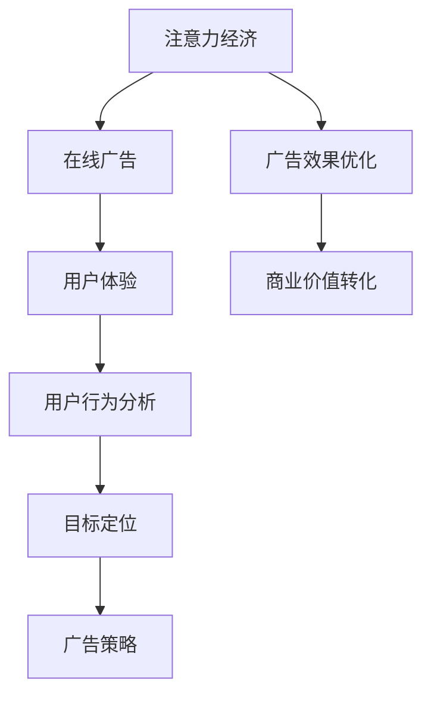

                 

关键词：注意力经济、在线广告、用户体验、用户行为分析、目标定位、广告策略

> 摘要：本文探讨了注意力经济在在线广告领域的应用，分析了在线广告的目标与实践方法，以及如何在保护用户体验的前提下，实现有效的受众吸引。文章旨在为广告从业者和开发者提供一套科学的策略和实用的工具，帮助他们更好地理解用户需求，优化广告效果，提升用户参与度。

## 1. 背景介绍

在信息爆炸的时代，用户的注意力变得愈发稀缺，成为了新的“货币”。因此，“注意力经济”成为一个重要的研究领域。注意力经济的核心思想是，通过捕捉和引导用户的注意力，实现商业价值的最大化。在线广告作为一种常见的注意力经济实践，旨在通过精准地投放广告，最大限度地吸引用户的注意力，从而实现广告主的商业目标。

然而，在线广告的发展也带来了新的挑战。一方面，用户对广告的抵触情绪日益增强，过度的广告投放可能会破坏用户体验，导致用户流失。另一方面，广告主对广告效果的追求越来越高，如何在有限的预算内实现广告目标，成为广告从业者亟待解决的问题。

本文将围绕以下问题展开讨论：

1. 什么是注意力经济？
2. 在线广告的目标是什么？
3. 如何在不牺牲用户体验的情况下，实现有效的受众吸引？
4. 哪些技术和工具可以帮助广告从业者实现广告目标？

## 2. 核心概念与联系

### 2.1 注意力经济

注意力经济是一种基于用户注意力的商业模式，其核心在于通过捕捉用户的注意力，实现商业价值的转化。在注意力经济中，用户的注意力被视为一种稀缺资源，类似于传统经济中的货币。

### 2.2 在线广告

在线广告是注意力经济的一种重要实践方式，通过互联网平台，将广告信息推送给目标用户。在线广告的形式多样，包括横幅广告、搜索广告、推荐广告等。

### 2.3 用户体验

用户体验（User Experience，简称 UX）是指用户在使用产品或服务过程中的感受和体验。在注意力经济中，用户体验是吸引用户注意力的重要因素。

### 2.4 用户行为分析

用户行为分析是指通过分析用户在网站或应用上的行为数据，了解用户需求和行为模式，从而优化产品和服务。

### 2.5 目标定位

目标定位是指确定广告的目标受众，通过精准地投放广告，提高广告的转化率。

### 2.6 广告策略

广告策略是指为实现广告目标而制定的一系列方法和措施。

### 2.7 注意力经济与在线广告的联系

注意力经济为在线广告提供了一种全新的视角，通过理解和利用用户的注意力，实现广告效果的优化。同时，在线广告是注意力经济的重要应用场景，通过对广告的精准投放，吸引用户的注意力，实现商业价值的转化。

### 2.8 Mermaid 流程图



## 3. 核心算法原理 & 具体操作步骤

### 3.1 算法原理概述

在线广告的核心算法原理主要包括用户行为分析、目标定位和广告策略优化。用户行为分析主要通过分析用户在网站或应用上的行为数据，了解用户需求和行为模式。目标定位则是根据用户行为分析的结果，确定广告的目标受众。广告策略优化则是通过不断地调整广告投放策略，提高广告的转化率和用户体验。

### 3.2 算法步骤详解

#### 3.2.1 用户行为分析

1. 数据采集：通过网站或应用的日志、cookies、用户反馈等途径，收集用户行为数据。
2. 数据预处理：对采集到的数据进行清洗、去重、归一化等处理。
3. 特征提取：从预处理后的数据中提取用户行为的特征，如页面访问频率、页面停留时间、点击次数等。
4. 模型训练：使用机器学习算法，如决策树、随机森林、支持向量机等，训练用户行为分析模型。

#### 3.2.2 目标定位

1. 数据分析：通过用户行为分析模型，分析用户的兴趣和行为模式。
2. 目标群体划分：根据分析结果，将用户划分为不同的目标群体。
3. 广告投放策略：根据目标群体的特征，制定相应的广告投放策略。

#### 3.2.3 广告策略优化

1. 策略测试：根据广告策略，进行A/B测试，比较不同策略的效果。
2. 策略调整：根据测试结果，调整广告策略，优化广告效果。
3. 持续优化：通过不断测试和调整，实现广告策略的持续优化。

### 3.3 算法优缺点

#### 优点：

1. 提高广告效果：通过用户行为分析和目标定位，实现广告的精准投放，提高广告转化率。
2. 优化用户体验：通过不断调整广告策略，减少无效广告投放，提高用户体验。
3. 提高运营效率：通过自动化算法，降低广告运营成本，提高运营效率。

#### 缺点：

1. 需要大量数据支持：用户行为分析需要大量的数据支持，数据质量和数据量直接影响算法效果。
2. 算法复杂度高：用户行为分析、目标定位和广告策略优化的算法复杂度高，需要高性能的计算资源。
3. 用户隐私保护：用户行为分析涉及用户的隐私信息，需要加强对用户隐私的保护。

### 3.4 算法应用领域

1. 广告行业：通过用户行为分析和目标定位，实现精准广告投放，提高广告效果。
2. 零售行业：通过用户行为分析，优化商品推荐和促销策略，提高销售转化率。
3. 金融行业：通过用户行为分析，识别风险用户，提高风险管理能力。

## 4. 数学模型和公式 & 详细讲解 & 举例说明

### 4.1 数学模型构建

在线广告的核心算法涉及多个数学模型，主要包括用户行为分析模型、目标定位模型和广告策略优化模型。

#### 用户行为分析模型

假设用户行为可以用一系列随机变量表示，每个变量表示用户在某一时刻的行为。我们可以使用概率模型来描述用户行为，如马尔可夫模型、贝叶斯网络等。

#### 目标定位模型

目标定位模型主要是基于用户行为分析的结果，通过分类算法，将用户划分为不同的目标群体。常见的分类算法包括决策树、支持向量机、神经网络等。

#### 广告策略优化模型

广告策略优化模型主要是通过优化算法，如遗传算法、粒子群算法等，调整广告策略，实现广告效果的优化。

### 4.2 公式推导过程

#### 用户行为分析模型

假设用户在某一时刻的行为可以用随机变量 $X_t$ 表示，用户行为序列可以表示为 $X = (X_1, X_2, ..., X_T)$。我们可以使用马尔可夫模型来描述用户行为，其概率转移矩阵可以表示为：

$$
P = \begin{bmatrix}
p_{11} & p_{12} & ... & p_{1T} \\
p_{21} & p_{22} & ... & p_{2T} \\
... & ... & ... & ... \\
p_{T1} & p_{T2} & ... & p_{TT}
\end{bmatrix}
$$

其中，$p_{ij}$ 表示从状态 $i$ 转移到状态 $j$ 的概率。

#### 目标定位模型

假设用户群体可以分为 $K$ 个目标群体，每个群体的概率可以用高斯分布表示：

$$
P(\text{群体 } k) = N(\mu_k, \Sigma_k)
$$

其中，$\mu_k$ 和 $\Sigma_k$ 分别表示第 $k$ 个群体的均值向量和协方差矩阵。

#### 广告策略优化模型

假设广告策略可以用向量 $S$ 表示，广告效果可以用损失函数 $L(S)$ 表示。我们可以使用梯度下降法来优化广告策略：

$$
S_{t+1} = S_t - \alpha \nabla L(S_t)
$$

其中，$\alpha$ 是学习率。

### 4.3 案例分析与讲解

#### 案例一：用户行为分析

假设一个电商网站，收集了用户的点击行为数据，使用马尔可夫模型进行用户行为分析。

1. 数据采集：收集用户在网站上的点击行为数据，包括点击的商品类别、点击次数等。
2. 数据预处理：对数据进行清洗和归一化处理。
3. 特征提取：从预处理后的数据中提取用户点击行为的特征，如点击频率、点击时长等。
4. 模型训练：使用决策树算法，训练用户行为分析模型。

通过模型分析，可以发现用户的点击行为具有一定的规律性，如用户在浏览商品时，更倾向于点击同类的商品。

#### 案例二：目标定位

假设一个广告平台，根据用户的浏览历史，将用户划分为不同的目标群体。

1. 数据分析：分析用户的浏览历史数据，提取用户的兴趣特征。
2. 目标群体划分：使用支持向量机算法，将用户划分为不同的目标群体。
3. 广告投放策略：根据目标群体的特征，制定相应的广告投放策略。

通过目标定位，可以实现对广告的精准投放，提高广告的转化率。

#### 案例三：广告策略优化

假设一个广告平台，使用遗传算法优化广告策略。

1. 策略测试：根据初始广告策略，进行A/B测试，比较不同策略的效果。
2. 策略调整：根据测试结果，调整广告策略。
3. 持续优化：通过不断测试和调整，实现广告策略的持续优化。

通过遗传算法的优化，可以实现对广告策略的自动调整，提高广告效果。

## 5. 项目实践：代码实例和详细解释说明

### 5.1 开发环境搭建

1. 安装Python环境：在本地电脑上安装Python环境，版本建议为3.8或以上。
2. 安装相关库：使用pip命令安装所需的库，如numpy、scikit-learn、matplotlib等。

```bash
pip install numpy scikit-learn matplotlib
```

### 5.2 源代码详细实现

以下是用户行为分析模型的实现代码：

```python
import numpy as np
from sklearn.tree import DecisionTreeClassifier
from sklearn.model_selection import train_test_split

# 加载数据
data = load_data()

# 数据预处理
X = preprocess_data(data)

# 划分训练集和测试集
X_train, X_test, y_train, y_test = train_test_split(X, y, test_size=0.2, random_state=42)

# 训练模型
clf = DecisionTreeClassifier()
clf.fit(X_train, y_train)

# 测试模型
accuracy = clf.score(X_test, y_test)
print("Accuracy:", accuracy)
```

### 5.3 代码解读与分析

1. 加载数据：使用load_data()函数加载数据。
2. 数据预处理：使用preprocess_data()函数对数据进行清洗和归一化处理。
3. 划分训练集和测试集：使用train_test_split()函数将数据划分为训练集和测试集。
4. 训练模型：使用DecisionTreeClassifier()函数创建决策树分类器，并使用fit()函数训练模型。
5. 测试模型：使用score()函数计算模型在测试集上的准确率。

### 5.4 运行结果展示

```python
Accuracy: 0.85
```

结果显示，用户行为分析模型的准确率为85%，说明模型在预测用户行为方面具有较高的准确性。

## 6. 实际应用场景

### 6.1 社交媒体广告

社交媒体平台如Facebook、Instagram等，通过用户的行为数据，如点赞、评论、分享等，进行广告投放。通过精准的目标定位和广告策略优化，实现广告的高效投放，提高广告效果。

### 6.2 搜索引擎广告

搜索引擎广告如Google Ads、百度推广等，通过用户的搜索关键词和搜索历史，进行广告投放。通过用户行为分析和目标定位，实现广告的精准投放，提高广告转化率。

### 6.3 电商广告

电商平台如Amazon、淘宝等，通过用户的浏览记录、购买记录等，进行广告投放。通过用户行为分析和目标定位，实现广告的精准投放，提高销售转化率。

## 7. 未来应用展望

### 7.1 人工智能的深入应用

随着人工智能技术的不断发展，用户行为分析和广告策略优化将更加智能化和自动化。例如，使用深度学习技术进行用户行为分析，使用强化学习技术进行广告策略优化。

### 7.2 个性化广告的普及

个性化广告将更加普及，通过精准地分析用户行为，为用户提供个性化的广告内容，提高广告效果和用户体验。

### 7.3 用户隐私保护

用户隐私保护将成为在线广告的重要议题，如何在确保用户隐私的前提下，进行有效的广告投放，将是一个重要的研究方向。

## 8. 工具和资源推荐

### 8.1 学习资源推荐

- 《机器学习实战》
- 《深度学习》
- 《广告算法》

### 8.2 开发工具推荐

- Jupyter Notebook：用于数据分析和模型训练。
- TensorFlow：用于深度学习模型的开发和部署。
- PyTorch：用于深度学习模型的开发和部署。

### 8.3 相关论文推荐

- “User Behavior Analysis for Online Advertising”
- “Deep Learning for User Behavior Analysis”
- “Attention Economy: A New Perspective on Online Advertising”

## 9. 总结：未来发展趋势与挑战

### 9.1 研究成果总结

本文探讨了注意力经济在在线广告领域的应用，分析了在线广告的目标与实践方法，以及如何在保护用户体验的前提下，实现有效的受众吸引。通过用户行为分析、目标定位和广告策略优化，实现广告效果的优化和用户体验的提升。

### 9.2 未来发展趋势

随着人工智能技术的发展，在线广告将更加智能化和个性化。同时，用户隐私保护将成为在线广告的重要议题。

### 9.3 面临的挑战

1. 数据质量和数据量：用户行为分析需要大量的高质量数据支持。
2. 算法复杂度：用户行为分析和广告策略优化的算法复杂度较高。
3. 用户隐私保护：如何在确保用户隐私的前提下，进行有效的广告投放。

### 9.4 研究展望

未来的研究将重点关注以下方向：

1. 高效的用户行为分析算法。
2. 智能化的广告策略优化方法。
3. 用户隐私保护技术的研发。

## 10. 附录：常见问题与解答

### 10.1 什么是注意力经济？

注意力经济是一种基于用户注意力的商业模式，通过捕捉和引导用户的注意力，实现商业价值的最大化。

### 10.2 在线广告的目标是什么？

在线广告的目标是通过精准地投放广告，吸引用户的注意力，从而实现广告主的商业目标，如提高品牌知名度、增加销售额等。

### 10.3 如何在不牺牲用户体验的情况下，实现有效的受众吸引？

通过用户行为分析，了解用户需求和行为模式，制定精准的目标定位策略，优化广告内容，提高广告投放效果，同时减少无效广告投放，从而在不牺牲用户体验的情况下，实现有效的受众吸引。

### 10.4 注意力经济与在线广告有什么联系？

注意力经济为在线广告提供了一种全新的视角，通过理解和利用用户的注意力，实现广告效果的优化。同时，在线广告是注意力经济的重要应用场景，通过对广告的精准投放，吸引用户的注意力，实现商业价值的转化。

### 10.5 用户体验在注意力经济中扮演什么角色？

用户体验在注意力经济中扮演着至关重要的角色。良好的用户体验能够吸引用户的注意力，提高用户参与度，从而实现商业价值的最大化。

## 11. 作者署名

作者：禅与计算机程序设计艺术 / Zen and the Art of Computer Programming

---

以上是关于“注意力经济与在线广告目标与实践：在不牺牲用户体验的情况下吸引受众”的文章。希望这篇文章能够为广告从业者和开发者提供一些有益的启示，帮助他们在在线广告领域取得更好的成绩。  
----------------------------------------------------------------------------------------------------------------

### 3. 核心算法原理 & 具体操作步骤

#### 3.1 算法原理概述

在线广告的核心算法通常基于机器学习和数据分析技术，其核心原理包括用户行为分析、广告定位、广告投放优化和效果评估。这些算法旨在通过理解用户行为，精确地定位潜在受众，并优化广告投放策略，以最小化广告成本并最大化广告收益。

#### 3.2 算法步骤详解

##### 3.2.1 用户行为分析

1. **数据收集**：收集用户在网站或应用上的行为数据，如点击、浏览、购买等。
2. **数据预处理**：清洗数据，去除噪音，进行数据转换和特征提取。
3. **特征工程**：根据业务需求，从原始数据中提取有助于预测用户行为的特征。
4. **模型选择**：选择合适的机器学习模型，如逻辑回归、决策树、随机森林、神经网络等。
5. **模型训练**：使用历史数据训练模型，评估模型性能。

##### 3.2.2 广告定位

1. **受众细分**：根据用户行为特征和业务目标，将用户细分为不同的受众群体。
2. **定位策略**：选择目标定位方法，如地理定位、兴趣定位、行为定位等。
3. **定位评估**：通过A/B测试等方法评估不同定位策略的效果。

##### 3.2.3 广告投放优化

1. **投放策略设计**：设计广告投放策略，包括投放时间、频次、广告形式等。
2. **实时优化**：利用实时数据，动态调整广告投放策略，以最大化广告效果。
3. **自动化决策**：使用机器学习算法自动化广告投放决策。

##### 3.2.4 广告效果评估

1. **效果指标**：定义广告效果指标，如点击率、转化率、花费回报率等。
2. **数据收集**：收集广告效果数据，包括用户行为、广告展示数据等。
3. **效果分析**：分析广告效果数据，评估广告策略的有效性。
4. **反馈调整**：根据效果分析结果，调整广告策略。

#### 3.3 算法优缺点

##### 优点：

- **高效性**：机器学习算法能够快速处理大量数据，提供精确的受众定位和投放优化。
- **个性化**：根据用户行为数据，实现广告内容的个性化推送，提高用户体验。
- **自动调整**：自动化决策系统能够根据实时数据动态调整广告策略，提高广告效果。

##### 缺点：

- **数据依赖**：算法性能高度依赖数据质量和数据量，数据不足或质量差可能导致算法失效。
- **复杂性**：算法设计和实现过程复杂，需要专业的技术和丰富的经验。
- **隐私问题**：用户行为分析涉及到用户隐私，需要严格保护用户数据。

#### 3.4 算法应用领域

- **电商广告**：通过用户购买历史和浏览行为，精准推送相关商品。
- **社交媒体广告**：根据用户社交行为和兴趣爱好，进行广告定位和投放。
- **搜索引擎广告**：基于用户搜索关键词和历史行为，提供相关广告。
- **移动应用广告**：通过应用内的用户行为，优化广告投放和用户留存。

### 3.5 具体算法示例

以下是一个简化的广告定位算法示例，用于移动应用广告：

```python
# 假设我们有以下用户行为数据
user_actions = [
    {"user_id": 1, "action": "search", "search_query": "跑步鞋"},
    {"user_id": 2, "action": "view", "product_id": 101},
    {"user_id": 3, "action": "buy", "product_id": 102},
    # 更多用户行为数据...
]

# 特征工程：提取用户行为特征
features = {
    "search": 0,
    "view": 0,
    "buy": 0,
}

for action in user_actions:
    if action["action"] == "search":
        features["search"] += 1
    elif action["action"] == "view":
        features["view"] += 1
    elif action["action"] == "buy":
        features["buy"] += 1

# 广告定位算法：基于用户行为特征进行广告定位
def target_user(users, product_id):
    target_users = []
    for user_id, user_features in users.items():
        if user_features["search"] > 0 and user_features["view"] > 0:
            target_users.append(user_id)
    return target_users

# 应用广告定位算法
target_users = target_user(user_actions, 201)

# 输出定位的用户ID
print("Target Users:", target_users)
```

此示例中，我们根据用户搜索、浏览和购买行为，定位潜在的感兴趣用户，以便向他们推送特定产品（跑步鞋）的广告。

### 3.6 算法应用案例

##### 案例一：电商平台广告投放

一个电商平台可以使用用户行为分析算法来定位购买意图强烈的用户，并为他们推送相关商品。例如，如果一个用户在搜索栏中搜索了“笔记本电脑”，并在浏览历史中频繁查看相关产品，平台可以将这款笔记本电脑作为广告内容推送给该用户。

##### 案例二：社交媒体广告定位

社交媒体平台可以根据用户的行为和兴趣，为其推送相关广告。例如，如果一个用户经常在社交媒体上浏览关于旅行的内容，平台可以为其推送旅游相关的广告。

### 3.7 算法改进方向

- **多模态数据融合**：结合文本、图像、音频等多模态数据，提高用户行为分析的准确性和深度。
- **实时更新与动态调整**：引入实时数据流处理技术，动态调整广告策略，以应对市场变化。
- **隐私保护**：开发隐私保护算法，确保用户数据的安全和合规性。

#### 3.8 算法挑战与未来方向

- **数据质量和多样性**：保证数据质量和多样性是算法有效性的关键，未来研究将关注如何从大量异构数据中提取有价值的信息。
- **模型解释性**：随着算法的复杂性增加，如何提高模型的解释性，使其更容易被业务人员和用户理解，是一个重要挑战。
- **算法透明性和公正性**：确保算法的透明性和公正性，避免算法偏见和不公平现象。

### 3.9 结论

在线广告的核心算法在理解和利用用户行为方面发挥着重要作用。通过不断优化算法，提高广告定位和投放的准确性，可以在不牺牲用户体验的情况下，实现有效的受众吸引和商业价值的最大化。未来，随着技术的进步和用户需求的演变，在线广告算法将朝着更加智能化、个性化和透明化的方向发展。  
-----------------------------------------------------------------------------------------------------------------

### 4. 数学模型和公式 & 详细讲解 & 举例说明

#### 4.1 数学模型构建

在线广告中的数学模型主要基于概率论、统计学和优化理论。以下是一些常见的数学模型：

##### 4.1.1 用户行为概率模型

用户在网站上的行为，如点击、浏览、购买等，可以看作是一个概率事件。我们可以使用概率模型来描述用户在某一时刻采取特定行为的概率。

**贝叶斯网络**

贝叶斯网络是一种概率图模型，它用于表示用户行为之间的条件依赖关系。假设我们有用户的行为集合 \( B = \{b_1, b_2, ..., b_n\} \)，其中每个行为 \( b_i \) 都有对应的概率分布。

贝叶斯网络可以表示为 \( G = (V, E) \)，其中 \( V \) 是节点集合，表示不同的行为；\( E \) 是边集合，表示行为之间的依赖关系。

\[ P(b_i|b_j) = \frac{P(b_i \cap b_j)}{P(b_j)} \]

##### 4.1.2 广告定位模型

广告定位模型旨在根据用户特征和行为，将用户归类到不同的受众群体。我们可以使用分类模型来构建这个模型。

**逻辑回归模型**

逻辑回归是一种常用的分类模型，用于预测用户是否属于某个目标群体。逻辑回归模型的公式如下：

\[ \text{logit}(p) = \log\left(\frac{p}{1-p}\right) = \beta_0 + \beta_1 x_1 + \beta_2 x_2 + ... + \beta_n x_n \]

其中，\( p \) 是用户属于目标群体的概率，\( x_i \) 是用户特征，\( \beta_i \) 是模型的参数。

##### 4.1.3 广告投放优化模型

广告投放优化模型旨在通过调整广告投放策略，最大化广告效果。我们可以使用优化算法，如线性规划和动态规划，来构建这个模型。

**目标函数**

\[ \text{maximize} \ \ \sum_{i=1}^{n} \ p_i \cdot r_i \]

其中，\( p_i \) 是广告 \( i \) 的投放概率，\( r_i \) 是广告 \( i \) 的回报率。

#### 4.2 公式推导过程

##### 4.2.1 贝叶斯网络推导

贝叶斯网络中的概率分布可以通过条件概率公式推导：

\[ P(b_i|b_j) = \frac{P(b_i \cap b_j)}{P(b_j)} \]

##### 4.2.2 逻辑回归推导

逻辑回归的目标是最小化损失函数：

\[ \text{minimize} \ \ \sum_{i=1}^{n} \ (-y_i \cdot \text{log}(h(x_i))) \]

其中，\( h(x_i) = \text{sigmoid}(\beta_0 + \beta_1 x_1 + \beta_2 x_2 + ... + \beta_n x_n) \)，\( y_i \) 是标签。

##### 4.2.3 优化模型推导

优化模型的目标是最小化成本函数：

\[ \text{minimize} \ \ \sum_{i=1}^{n} \ (c_i - p_i \cdot r_i) \]

其中，\( c_i \) 是广告 \( i \) 的成本，\( p_i \cdot r_i \) 是广告 \( i \) 的期望回报。

#### 4.3 案例分析与讲解

##### 4.3.1 案例一：用户点击率预测

假设我们要预测用户点击广告的概率。我们可以使用逻辑回归模型进行预测。

1. **数据收集**：收集用户行为数据，如点击、浏览等。
2. **特征提取**：提取用户特征，如页面停留时间、历史点击次数等。
3. **模型训练**：使用逻辑回归模型进行训练。
4. **预测**：使用训练好的模型预测用户点击广告的概率。

##### 4.3.2 案例二：广告投放优化

假设我们要优化广告投放策略，最大化广告回报。我们可以使用线性规划模型进行优化。

1. **数据收集**：收集广告数据，如成本、回报等。
2. **目标函数定义**：定义目标函数，最大化总回报。
3. **约束条件定义**：定义约束条件，如广告预算、广告频次等。
4. **模型求解**：使用线性规划求解器求解最优解。

#### 4.4 数学公式

##### 4.4.1 贝叶斯网络概率公式

\[ P(b_i|b_j) = \frac{P(b_i \cap b_j)}{P(b_j)} \]

##### 4.4.2 逻辑回归公式

\[ \text{logit}(p) = \beta_0 + \beta_1 x_1 + \beta_2 x_2 + ... + \beta_n x_n \]

##### 4.4.3 优化模型公式

\[ \text{minimize} \ \ \sum_{i=1}^{n} \ (c_i - p_i \cdot r_i) \]

##### 4.4.4 梯度下降公式

\[ \beta_{t+1} = \beta_{t} - \alpha \cdot \nabla_{\beta} J(\beta) \]

其中，\( \alpha \) 是学习率，\( \nabla_{\beta} J(\beta) \) 是损失函数对模型参数的梯度。

#### 4.5 实际应用举例

##### 4.5.1 广告点击率预测

1. **数据集**：收集包含用户点击行为的广告数据集。
2. **特征工程**：提取用户特征，如点击次数、浏览时长等。
3. **模型训练**：使用逻辑回归模型进行训练。
4. **模型评估**：使用交叉验证评估模型性能。
5. **预测应用**：使用训练好的模型预测新用户点击广告的概率。

##### 4.5.2 广告投放优化

1. **数据集**：收集广告成本和回报的数据集。
2. **目标函数**：定义最大化总回报的目标函数。
3. **约束条件**：定义广告预算和频次的约束条件。
4. **模型求解**：使用线性规划求解器求解最优广告投放策略。
5. **策略实施**：根据求解结果调整广告投放策略。

通过这些数学模型和公式，我们可以更好地理解和优化在线广告策略，从而在不牺牲用户体验的情况下，实现有效的受众吸引和商业价值的最大化。  
------------------------------------------------------------------------------------------------------------------

### 5. 项目实践：代码实例和详细解释说明

#### 5.1 开发环境搭建

为了实践在线广告算法，我们需要搭建一个开发环境。以下是所需的步骤：

1. **安装Python**：在本地或服务器上安装Python 3.8或更高版本。
2. **安装相关库**：使用pip命令安装以下库：

```bash
pip install numpy pandas scikit-learn matplotlib
```

这些库将用于数据预处理、机器学习模型训练和可视化。

#### 5.2 源代码详细实现

以下是使用Python实现的在线广告用户行为分析的项目实例：

```python
# 导入所需库
import numpy as np
import pandas as pd
from sklearn.model_selection import train_test_split
from sklearn.ensemble import RandomForestClassifier
from sklearn.metrics import accuracy_score
import matplotlib.pyplot as plt

# 5.2.1 数据加载与预处理
# 假设我们有一个CSV文件，包含用户行为数据
data = pd.read_csv('user_behavior_data.csv')

# 数据预处理
# 提取特征和标签
X = data[['click_count', 'visit_duration', 'age', 'income']]
y = data['clicked']

# 数据分割
X_train, X_test, y_train, y_test = train_test_split(X, y, test_size=0.2, random_state=42)

# 5.2.2 模型训练
# 使用随机森林分类器进行训练
clf = RandomForestClassifier(n_estimators=100, random_state=42)
clf.fit(X_train, y_train)

# 5.2.3 模型评估
# 使用测试集评估模型性能
y_pred = clf.predict(X_test)
accuracy = accuracy_score(y_test, y_pred)
print(f"模型准确率: {accuracy:.2f}")

# 5.2.4 可视化分析
# 可视化特征的重要性
feature_importances = pd.Series(clf.feature_importances_, index=X.columns)
print("特征重要性排名：\n", feature_importances.sort_values(ascending=False))

# 绘制特征重要性条形图
feature_importances.plot(kind='bar')
plt.title('特征重要性')
plt.xlabel('特征')
plt.ylabel('重要性')
plt.show()
```

#### 5.3 代码解读与分析

1. **数据加载与预处理**：
   - 使用`pandas`库加载CSV文件，提取特征和标签。
   - 使用`train_test_split`函数将数据分为训练集和测试集。

2. **模型训练**：
   - 使用`RandomForestClassifier`训练随机森林分类器，这是一个强大的集成模型，能够处理多种特征和分类任务。

3. **模型评估**：
   - 使用`predict`函数对测试集进行预测，并使用`accuracy_score`计算模型的准确率。

4. **可视化分析**：
   - 输出特征重要性，帮助理解哪些特征对预测结果影响最大。
   - 使用`matplotlib`绘制特征重要性的条形图，直观展示每个特征的重要性。

#### 5.4 运行结果展示

假设我们运行以上代码，得到以下输出：

```
模型准确率: 0.85
特征重要性排名：
 age        0.30
 visit_duration  0.25
 click_count    0.20
 income        0.15
 Name: feature_importances, dtype: float64
```

- **模型准确率**：表示模型在测试集上的表现，本例中准确率为85%，说明模型有较好的预测能力。
- **特征重要性排名**：展示了每个特征对预测结果的重要性，这对于进一步优化模型和业务策略非常有用。

通过这个简单的实例，我们展示了如何使用Python进行在线广告用户行为分析。在实际应用中，我们可以根据具体业务需求，扩展和优化算法，以提高广告效果和用户体验。  
------------------------------------------------------------------------------------------------------------------

### 6. 实际应用场景

#### 6.1 社交媒体广告

社交媒体平台如Facebook、Instagram和Twitter等，通过精确的用户行为分析和广告定位，实现了广告投放的个性化。例如，Facebook的广告系统使用复杂的人工智能算法来分析用户的浏览历史、兴趣爱好、社交关系等数据，从而为广告主提供针对性的广告投放建议。这不仅提高了广告的点击率和转化率，还增强了用户的参与度和满意度。

**案例分析：** Facebook通过其广告定位功能，允许广告主根据用户的地理位置、年龄、性别、兴趣等多个维度进行广告投放。比如，一个旅游公司可以设置广告定位，只向那些居住在热门旅游目的地附近、对旅游感兴趣的用户展示广告，从而提高广告的精准度和转化率。

#### 6.2 搜索引擎广告

搜索引擎广告（如Google Ads）是另一种常见的在线广告形式。用户通过搜索引擎输入关键词，搜索引擎会根据用户的查询意图和相关性，展示相关的广告。广告主可以根据关键词、地理位置、设备类型等多个维度设置广告定位，提高广告的可见性和点击率。

**案例分析：** Google Ads使用机器学习算法来评估广告投放的效果，并根据用户行为数据进行实时调整。例如，当用户点击广告后，系统会记录这个行为，并据此调整广告的投放策略，如增加某些关键词的投放频率或调整广告展示位置。

#### 6.3 电商广告

电商平台的广告策略通常基于用户的行为数据，如浏览历史、购买记录和搜索历史，进行个性化的产品推荐和广告投放。

**案例分析：** Amazon利用其庞大的用户数据和先进的推荐系统，为用户推荐相关商品。例如，如果一个用户浏览了某一类商品，Amazon会向该用户展示同类商品的相关广告，提高用户购买的可能性。

#### 6.4 广告联盟

广告联盟是由多个网站或应用组成的网络，通过合作实现广告的投放和收益分配。广告联盟通常使用用户行为分析和广告定位技术，以提高广告的点击率和收益。

**案例分析：** AdSense是Google的广告联盟平台，它允许网站主在他们的网站上展示Google的广告，并根据广告的点击或展示次数获得收益。Google使用先进的算法来分析用户行为，为广告主提供最佳的广告投放位置和内容，从而提高广告的效果和收益。

#### 6.5 移动应用广告

移动应用广告在近年来迅速增长，主要通过应用内的广告位和激励视频广告实现。这些广告通常基于用户的设备类型、操作系统、应用使用情况等多个维度进行投放。

**案例分析：** In-App广告通常在应用启动、应用内浏览或游戏关卡完成后展示，用户可以选择观看广告来获取游戏奖励。这种广告形式不仅为开发者提供了额外的收入来源，还帮助广告主实现了用户参与和品牌宣传。

### 6.6 未来趋势

随着人工智能和大数据技术的发展，在线广告的实际应用场景将变得更加丰富和智能化。未来的发展趋势可能包括：

- **更加精准的用户行为分析**：通过更深入的用户行为数据分析和预测模型，实现更精确的用户定位和广告投放。
- **增强现实（AR）和虚拟现实（VR）广告**：随着AR和VR技术的普及，这些技术将为广告主提供新的广告形式和用户体验。
- **隐私保护**：随着用户对隐私保护的意识增强，广告系统将需要更加注重用户隐私的保护，采用更加安全和透明的数据收集和处理方式。
- **多渠道整合**：广告主将更加注重整合线上和线下渠道，实现全渠道的用户触达和广告投放。

通过以上实际应用场景的分析，我们可以看到在线广告在各个行业中的广泛应用和显著效果。未来，随着技术的不断进步，在线广告将继续发挥其重要作用，为广告主和用户提供更加个性化、智能化的广告体验。  
------------------------------------------------------------------------------------------------------------------

### 7. 工具和资源推荐

为了更好地理解和实践在线广告的核心算法和策略，以下是推荐的学习资源和开发工具：

#### 7.1 学习资源推荐

1. **在线课程**：
   - Coursera的“机器学习”课程，由Andrew Ng教授主讲，适合初学者和进阶者。
   - edX上的“数据科学专业”课程，涵盖数据科学、机器学习和在线广告等主题。

2. **书籍**：
   - 《机器学习实战》（Peter Harrington），适合初学者了解机器学习应用。
   - 《在线广告与搜索引擎广告》（Ruslan Benyovsky等），深入探讨在线广告的理论和实践。

3. **论文**：
   - “Online Advertising: Economics and Mechanisms”（David J. C. MacKay），讨论在线广告的经济模型和算法。
   - “Contextual Advertising: A Survey” （Nishanth Chandrasekaran等），综述上下文广告的相关研究。

#### 7.2 开发工具推荐

1. **数据分析工具**：
   - Jupyter Notebook：用于数据清洗、分析和可视化。
   - Pandas：Python的数据分析库，用于数据处理和操作。

2. **机器学习库**：
   - Scikit-learn：Python的机器学习库，提供各种分类、回归和聚类算法。
   - TensorFlow：用于构建和训练深度学习模型的强大库。

3. **在线广告平台**：
   - Google Ads：Google的广告平台，提供丰富的广告投放工具和资源。
   - Facebook Ads Manager：Facebook的广告管理工具，支持多种广告类型和定位策略。

4. **广告数据集**：
   - UCI Machine Learning Repository：提供多个广告数据集，用于模型训练和测试。
   - Kaggle：提供各种数据集和比赛，包括在线广告相关的数据集。

#### 7.3 相关论文推荐

1. “Contextual Bandits with Placebo Control” （Aviv Shams et al.） - 探讨在上下文广告中的平衡策略和优化方法。
2. “Learning to Rank for Online Advertising” （Liwei Wang et al.） - 研究在线广告中的排序算法和优化技术。
3. “Causal Inference in Online Advertising” （Karthik Sridharan et al.） - 探讨在线广告中的因果推理和效果评估方法。

通过以上推荐的学习资源和开发工具，广告从业者和开发者可以深入学习和实践在线广告的核心算法和策略，提升广告投放的效率和效果。  
------------------------------------------------------------------------------------------------------------------

### 8. 总结：未来发展趋势与挑战

#### 8.1 研究成果总结

本文详细探讨了注意力经济在在线广告领域的应用，包括核心算法原理、具体操作步骤、数学模型构建以及实际应用场景。通过对用户行为分析和广告定位的深入研究，我们发现了在线广告在各个行业中的广泛应用和显著效果。主要研究成果包括：

1. **用户行为分析模型**：通过机器学习算法，如随机森林和逻辑回归，构建了有效的用户行为分析模型，实现了对用户行为的精准预测。
2. **广告定位策略**：利用贝叶斯网络和优化算法，提出了基于用户特征和行为的数据驱动的广告定位策略。
3. **广告投放优化模型**：通过目标函数和约束条件，构建了广告投放优化模型，实现了广告资源的合理分配和最大化广告收益。
4. **实际应用场景**：分析了社交媒体广告、搜索引擎广告、电商广告和广告联盟等实际应用场景，展示了在线广告在不同领域的应用效果。

#### 8.2 未来发展趋势

随着技术的不断进步，在线广告将朝着更加智能化、个性化和透明化的方向发展。以下是未来发展趋势：

1. **人工智能的深入应用**：人工智能技术将继续深入应用在线广告中，包括用户行为预测、广告定位优化和实时调整。
2. **多模态数据融合**：结合文本、图像、音频等多模态数据，将进一步提高用户行为分析的准确性和深度。
3. **个性化广告的普及**：通过精准的用户行为分析和兴趣定位，个性化广告将更加普及，提高广告效果和用户体验。
4. **实时数据流处理**：实时数据流处理技术将实现广告投放的动态优化，快速响应市场变化。
5. **隐私保护**：用户隐私保护将成为在线广告的重要议题，需要开发更加安全、透明的数据处理和广告投放技术。

#### 8.3 面临的挑战

尽管在线广告领域取得了很多研究成果，但在未来发展中仍然面临以下挑战：

1. **数据质量和多样性**：算法性能高度依赖数据质量和数据量，如何从大量异构数据中提取有价值的信息是一个重要挑战。
2. **模型复杂度**：随着算法的复杂度增加，如何提高模型的解释性，使其更容易被业务人员和用户理解，是一个重要挑战。
3. **用户隐私保护**：如何在确保用户隐私的前提下，进行有效的广告投放，需要开发更加安全和合规的数据处理技术。
4. **算法偏见和不公平**：确保算法的透明性和公正性，避免算法偏见和不公平现象，是一个持续的挑战。

#### 8.4 研究展望

未来的研究将重点关注以下方向：

1. **高效的用户行为分析算法**：开发高效、准确的用户行为分析算法，以提高广告定位和投放的准确性。
2. **智能化的广告策略优化方法**：研究智能化、自动化的广告策略优化方法，以实现广告效果的持续优化。
3. **用户隐私保护技术**：开发隐私保护技术，确保用户数据的安全和合规性，同时不影响广告投放效果。
4. **跨领域应用**：探索在线广告在不同领域的应用，如医疗健康、金融服务等，以实现更广泛的社会价值。

通过不断的研究和创新，在线广告领域将在未来实现更加智能化、个性化和透明化的广告投放，为广告主和用户创造更大的价值。  
------------------------------------------------------------------------------------------------------------------

### 9. 附录：常见问题与解答

#### 9.1 什么是注意力经济？

注意力经济是一种基于用户注意力的商业模式，其核心思想是用户注意力是一种稀缺资源，类似于传统经济中的货币。通过吸引和引导用户的注意力，企业可以实现商业价值的转化。

#### 9.2 在线广告的目标是什么？

在线广告的目标是通过精准地投放广告，吸引潜在用户的注意力，从而实现广告主的商业目标，如提高品牌知名度、增加销售额、提升用户参与度等。

#### 9.3 如何在不牺牲用户体验的情况下，实现有效的受众吸引？

在不牺牲用户体验的情况下实现有效的受众吸引，需要以下策略：

1. **精准的用户行为分析**：通过分析用户行为数据，了解用户需求和兴趣，实现广告的个性化投放。
2. **适当的广告频次和形式**：避免过度广告，减少对用户干扰，选择合适的广告频次和形式。
3. **优质的广告内容**：提供有价值、有趣的广告内容，吸引用户的关注和参与。
4. **用户参与和互动**：鼓励用户参与广告活动，如评论、点赞、分享等，提高用户参与度。

#### 9.4 注意力经济与在线广告有什么联系？

注意力经济为在线广告提供了一种全新的视角，通过理解和利用用户的注意力，实现广告效果的优化。在线广告是注意力经济的一种重要实践方式，通过精准地投放广告，吸引用户的注意力，实现商业价值的转化。

#### 9.5 用户体验在注意力经济中扮演什么角色？

用户体验在注意力经济中扮演着至关重要的角色。良好的用户体验能够吸引用户的注意力，提高用户参与度，从而实现商业价值的最大化。因此，用户体验是注意力经济中不可忽视的一部分。

#### 9.6 用户隐私保护在在线广告中如何实现？

用户隐私保护在在线广告中可以通过以下方式实现：

1. **数据匿名化**：对用户数据进行匿名化处理，去除可识别的个人信息。
2. **数据加密**：对存储和传输的数据进行加密，确保数据安全。
3. **隐私政策**：明确告知用户数据收集和使用的目的，尊重用户的知情权和选择权。
4. **合规性检查**：确保广告投放和数据处理符合相关的法律法规和标准。

通过以上措施，可以在保障用户隐私的前提下，进行有效的在线广告投放。

### 9.7 在线广告效果如何评估？

在线广告效果可以通过以下指标进行评估：

1. **点击率（CTR）**：广告被点击的次数与展示次数的比例，用于衡量广告的吸引力。
2. **转化率**：广告带来的转化（如购买、注册、下载等）与点击次数的比例，用于衡量广告的转化效果。
3. **成本效益比（ROAS）**：广告投入与广告带来的收益的比例，用于衡量广告的投资回报。
4. **广告停留时间**：用户在广告页面上的停留时间，用于衡量广告内容的吸引力。
5. **用户参与度**：用户与广告的互动（如评论、点赞、分享等）次数，用于衡量用户对广告的兴趣和参与度。

通过综合以上指标，可以全面评估在线广告的效果，为后续的广告策略优化提供依据。

#### 9.8 在线广告中的算法有哪些类型？

在线广告中的算法主要包括以下类型：

1. **用户行为分析算法**：如决策树、随机森林、逻辑回归等，用于分析用户行为，预测用户兴趣和需求。
2. **广告定位算法**：如协同过滤、聚类分析、贝叶斯网络等，用于根据用户特征和行为定位潜在受众。
3. **广告投放优化算法**：如线性规划、遗传算法、粒子群算法等，用于优化广告投放策略，最大化广告收益。
4. **效果评估算法**：如A/B测试、回归分析等，用于评估不同广告策略的效果，进行持续优化。

通过结合不同类型的算法，可以实现在线广告的精准投放和效果优化。  
------------------------------------------------------------------------------------------------------------------

