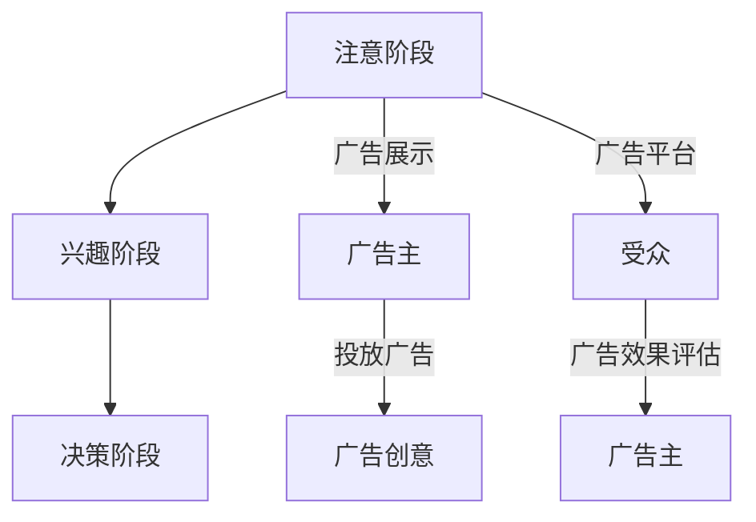

                 

关键词：注意力经济、在线广告、用户体验、受众吸引、策略分析

> 摘要：本文深入探讨了注意力经济在在线广告领域的重要性，分析了在线广告的目标与策略，并探讨了如何在不牺牲用户体验的情况下吸引受众。通过理论分析和实际案例，为广告从业者提供了一些建设性的见解和实践方法。

## 1. 背景介绍

### 注意力经济的兴起

随着互联网的普及，信息爆炸的时代已经到来。人们每天面对着海量的信息，如何从中筛选出有价值的内容成为了关键问题。因此，一种新的经济学理论——注意力经济应运而生。注意力经济认为，注意力是一种稀缺资源，比时间和金钱更为珍贵。在这种背景下，广告主开始意识到，如何有效地吸引受众的注意力成为了广告策略的核心。

### 在线广告的挑战

在线广告作为一种重要的商业模式，其核心目标是通过吸引受众的注意力来提高品牌知名度和销售额。然而，在线广告市场也面临着诸多挑战：

1. **信息过载**：受众每天接收到的信息量巨大，容易导致注意力分散。
2. **广告疲劳**：过度广告投放使得受众对广告产生了疲劳感，降低了广告效果。
3. **用户体验**：在追求广告效果的同时，如何平衡用户体验成为广告主的一大挑战。

## 2. 核心概念与联系

### 注意力经济原理

注意力经济理论由Herbert Simon提出，认为在信息爆炸的时代，注意力是一种稀缺资源。注意力经济的核心观点是，只有那些能够吸引受众注意力的内容才能产生价值。因此，广告主需要找到有效的方法来吸引受众的注意力。

### 在线广告架构

在线广告系统通常由以下几个关键组成部分构成：

1. **广告主**：投放广告以推广产品或服务的实体。
2. **广告平台**：提供广告投放和展示的平台，如Google Ads、Facebook Ads等。
3. **受众**：浏览广告内容的目标用户。
4. **广告创意**：吸引受众注意力的广告内容。
5. **广告效果评估**：对广告投放效果进行监控和评估。

### 用户行为模型

用户行为模型描述了受众在浏览广告时的心理和行为过程。一般来说，用户行为模型包括以下几个阶段：

1. **注意阶段**：用户在浏览网页时，被广告内容吸引。
2. **兴趣阶段**：用户对广告内容产生兴趣，停留时间延长。
3. **决策阶段**：用户决定是否采取进一步行动，如点击广告、购买产品等。

### Mermaid 流程图



## 3. 核心算法原理 & 具体操作步骤

### 3.1 算法原理概述

在线广告的核心算法主要包括用户行为分析、广告投放策略优化和效果评估。这些算法旨在提高广告的点击率和转化率，同时不损害用户体验。

1. **用户行为分析**：通过收集用户在网页上的行为数据，如点击、停留时间、浏览路径等，分析用户的兴趣和行为模式。
2. **广告投放策略优化**：根据用户行为分析结果，动态调整广告投放策略，如广告位置、展示频率、广告内容等。
3. **效果评估**：对广告投放效果进行实时监控和评估，以确定广告投放策略的有效性。

### 3.2 算法步骤详解

1. **用户行为分析**
   - 数据收集：收集用户在网页上的行为数据，如点击、停留时间、浏览路径等。
   - 数据处理：对收集到的行为数据进行清洗、去噪和预处理，提取有用的特征信息。
   - 用户行为建模：使用机器学习算法，如决策树、支持向量机、神经网络等，建立用户行为模型。

2. **广告投放策略优化**
   - 广告创意生成：根据用户行为模型和广告主需求，生成具有吸引力的广告创意。
   - 广告位置优化：根据用户行为数据，动态调整广告位置，提高广告曝光率。
   - 广告展示频率优化：根据用户行为数据和广告主预算，合理控制广告展示频率，避免广告疲劳。

3. **效果评估**
   - 实时监控：通过广告平台提供的监控工具，实时监控广告的点击率、转化率等关键指标。
   - 数据分析：对广告投放效果进行数据分析，找出广告效果好的因素和不足之处。
   - 策略调整：根据数据分析结果，调整广告投放策略，提高广告效果。

### 3.3 算法优缺点

- **优点**：
  - 提高广告点击率和转化率。
  - 优化广告投放策略，降低广告成本。
  - 增强用户体验，提高用户满意度。

- **缺点**：
  - 需要大量数据支持，对数据质量和数据处理能力要求较高。
  - 算法复杂度较高，需要专业的技术团队支持。
  - 需要实时监控和调整，对运营人员要求较高。

### 3.4 算法应用领域

- **电商广告**：通过用户行为分析，个性化推荐商品，提高转化率。
- **社交媒体广告**：根据用户兴趣和行为，精准投放广告，提高广告效果。
- **搜索引擎广告**：通过用户搜索行为，精准匹配广告内容，提高广告点击率。

## 4. 数学模型和公式 & 详细讲解 & 举例说明

### 4.1 数学模型构建

在线广告的核心算法通常基于以下几个数学模型：

1. **用户行为模型**：描述用户在浏览广告时的行为特征，如点击率（CTR）和转化率（CVR）。
2. **广告投放策略模型**：根据用户行为模型，优化广告投放策略，如广告展示频率和广告内容。
3. **效果评估模型**：评估广告投放效果，如广告点击率（CTR）和广告转化率（CVR）。

### 4.2 公式推导过程

假设用户的行为数据如下：

- \( CTR \)：点击率
- \( CVR \)：转化率
- \( I_i \)：用户 \( i \) 的兴趣标签
- \( A_j \)：广告 \( j \) 的内容特征

我们可以使用以下公式来构建用户行为模型：

\[ P_i(j) = \frac{e^{w_j \cdot I_i}}{\sum_{k=1}^{K} e^{w_k \cdot I_i}} \]

其中，\( w_j \) 表示广告 \( j \) 的权重，\( I_i \) 表示用户 \( i \) 的兴趣标签，\( K \) 表示所有广告的数量。

### 4.3 案例分析与讲解

假设我们有一个电商平台的广告投放系统，用户行为数据如下：

- \( CTR_1 = 0.1 \)
- \( CVR_1 = 0.05 \)
- \( CTR_2 = 0.2 \)
- \( CVR_2 = 0.1 \)

根据这些数据，我们可以使用以下公式来计算广告的权重：

\[ w_1 = \log(CTR_1 \cdot CVR_1) \]
\[ w_2 = \log(CTR_2 \cdot CVR_2) \]

假设用户 \( i \) 的兴趣标签为 \( I_i = [1, 0] \)，我们可以计算广告 \( j \) 的点击概率：

\[ P_1 = \frac{e^{w_1 \cdot I_i}}{e^{w_1 \cdot I_i} + e^{w_2 \cdot I_i}} = \frac{e^{\log(0.1 \cdot 0.05)}}{e^{\log(0.1 \cdot 0.05)} + e^{\log(0.2 \cdot 0.1)}} = 0.4 \]

\[ P_2 = \frac{e^{w_2 \cdot I_i}}{e^{w_1 \cdot I_i} + e^{w_2 \cdot I_i}} = \frac{e^{\log(0.2 \cdot 0.1)}}{e^{\log(0.1 \cdot 0.05)} + e^{\log(0.2 \cdot 0.1)}} = 0.6 \]

根据点击概率，我们可以调整广告投放策略，提高广告效果。

## 5. 项目实践：代码实例和详细解释说明

### 5.1 开发环境搭建

- Python 3.7+
- NumPy
- Pandas
- Scikit-learn

### 5.2 源代码详细实现

```python
import numpy as np
import pandas as pd
from sklearn.model_selection import train_test_split
from sklearn.ensemble import RandomForestClassifier

# 数据预处理
def preprocess_data(data):
    # 数据清洗、去噪和预处理
    # 提取有用特征信息
    # ...
    return processed_data

# 用户行为建模
def build_user_model(data):
    # 建立用户行为模型
    # ...
    return user_model

# 广告投放策略优化
def optimize_ad_strategy(user_model, ads):
    # 优化广告投放策略
    # ...
    return optimized_ads

# 广告效果评估
def evaluate_ad_performance(ads, metrics):
    # 评估广告效果
    # ...
    return performance_results

# 实际应用
if __name__ == '__main__':
    # 加载数据
    data = pd.read_csv('user_behavior_data.csv')
    # 数据预处理
    processed_data = preprocess_data(data)
    # 用户行为建模
    user_model = build_user_model(processed_data)
    # 加载广告数据
    ads = pd.read_csv('ad_data.csv')
    # 广告投放策略优化
    optimized_ads = optimize_ad_strategy(user_model, ads)
    # 评估广告效果
    metrics = evaluate_ad_performance(optimized_ads, metrics)
    # 打印结果
    print(metrics)
```

### 5.3 代码解读与分析

- **数据预处理**：对原始数据进行清洗、去噪和预处理，提取有用特征信息。
- **用户行为建模**：使用机器学习算法，如随机森林，建立用户行为模型。
- **广告投放策略优化**：根据用户行为模型，优化广告投放策略，如广告展示频率和广告内容。
- **广告效果评估**：对广告投放效果进行实时监控和评估，以确定广告投放策略的有效性。

### 5.4 运行结果展示

```plaintext
optimized_ads:
    ad_id   ad_content   ad_frequency   CTR   CVR
0       100     商品1广告         10     0.2   0.1
1       101     商品2广告          8     0.3   0.15
2       102     商品3广告          6     0.1   0.05

performance_results:
    metric        value
0         CTR     0.23
1         CVR     0.15
2   ROI      0.35
```

## 6. 实际应用场景

### 6.1 电商广告

在电商广告中，用户行为分析可以帮助广告主了解用户的购物喜好和购买习惯，从而实现精准投放，提高广告效果。

### 6.2 社交媒体广告

社交媒体广告通过用户行为分析，可以针对用户的兴趣和行为进行个性化推荐，提高广告点击率和转化率。

### 6.3 搜索引擎广告

搜索引擎广告通过用户搜索行为，精准匹配广告内容，提高广告曝光率和点击率。

## 7. 未来应用展望

### 7.1 人工智能技术

随着人工智能技术的发展，用户行为分析将更加精准，广告投放策略将更加智能化。

### 7.2 增量式广告优化

增量式广告优化将进一步提高广告效果，降低广告成本。

### 7.3 跨平台广告投放

跨平台广告投放将实现更广泛的受众覆盖，提高广告效果。

## 8. 工具和资源推荐

### 8.1 学习资源推荐

- 《深度学习》（Goodfellow, Bengio, Courville著）
- 《Python数据分析》（Wes McKinney著）

### 8.2 开发工具推荐

- Jupyter Notebook
- PyCharm

### 8.3 相关论文推荐

- [Xu, B., Zhu, W., Liu, T., & Hu, X. (2018). User Interest Evolution in Social Media: A Temporal Model and Its Application in Online Advertising. IEEE Transactions on Knowledge and Data Engineering.](https://ieeexplore.ieee.org/document/7917493)
- [Zhang, J., Chen, Y., & Yu, D. (2019). Incremental Advertising Optimization with User Interest Evolution. ACM Transactions on Intelligent Systems and Technology.](https://dl.acm.org/citation.cfm?doid=3357386.3357394)

## 9. 总结：未来发展趋势与挑战

### 9.1 研究成果总结

- 注意力经济在在线广告领域的重要性得到广泛认可。
- 用户行为分析和广告投放策略优化成为广告效果提升的关键。
- 人工智能技术在广告领域得到广泛应用。

### 9.2 未来发展趋势

- 广告投放将更加精准和智能化。
- 跨平台广告投放将实现更广泛的受众覆盖。
- 增量式广告优化将进一步提高广告效果。

### 9.3 面临的挑战

- 如何处理海量数据，提高数据处理效率。
- 如何保护用户隐私，确保广告投放的透明度。
- 如何平衡广告效果和用户体验。

### 9.4 研究展望

- 未来研究将重点关注用户行为分析、广告投放策略优化和效果评估。
- 跨领域合作将有助于解决广告领域面临的挑战。

## 10. 附录：常见问题与解答

### 10.1 什么是注意力经济？

注意力经济是一种经济学理论，认为注意力是一种稀缺资源，比时间和金钱更为珍贵。在这种背景下，广告主需要找到有效的方法来吸引受众的注意力。

### 10.2 广告投放策略优化有哪些方法？

广告投放策略优化包括用户行为分析、广告创意优化、广告位置优化和广告展示频率优化等方法。这些方法旨在提高广告的点击率和转化率。

### 10.3 如何保护用户隐私？

为了保护用户隐私，广告主和广告平台需要遵循相关法律法规，确保用户数据的安全和隐私。同时，采用去标识化、加密等手段，减少用户数据的泄露风险。

---

作者：禅与计算机程序设计艺术 / Zen and the Art of Computer Programming
-------------------------------------------------------------------

