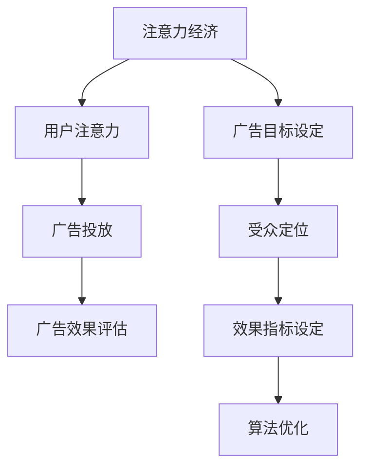

                 

 > 关键词：注意力经济、在线广告、用户体验、受众定位、效果评估、算法优化

> 摘要：本文旨在探讨注意力经济在在线广告领域的应用，分析如何在不牺牲用户体验的前提下，通过科学的目标设定和算法优化，有效地针对特定受众进行广告投放。文章从背景介绍、核心概念与联系、核心算法原理、数学模型与公式、项目实践、实际应用场景以及未来展望等方面展开，旨在为相关从业者提供有价值的参考。

## 1. 背景介绍

随着互联网的快速发展，注意力经济逐渐成为学术界和企业关注的焦点。注意力经济是指人们将注意力资源转化为经济利益的一种经济形态，主要表现为用户对各种内容的消费和互动。在在线广告领域，注意力经济尤为重要，因为广告商需要通过吸引用户的注意力来提升广告效果，从而实现商业目标。

然而，在线广告市场面临的一个挑战是如何在不牺牲用户体验的情况下，有效地针对特定受众进行广告投放。传统的广告投放方式通常依赖于用户行为数据，如点击率、浏览量等，但这些指标并不能完全反映用户的真实需求和偏好。因此，如何设定科学的目标、优化广告投放策略，成为在线广告领域的重要课题。

本文将从注意力经济的角度出发，分析在线广告的目标设定与优化方法，旨在为广告商和平台提供有价值的参考。

## 2. 核心概念与联系

### 2.1 注意力经济的概念

注意力经济是一种基于用户注意力的经济形态。在注意力经济中，用户的注意力被视为一种宝贵的资源，广告商通过吸引用户的注意力来实现商业目标。注意力经济的核心在于如何有效地获取和利用用户的注意力。

### 2.2 在线广告的目标设定

在线广告的目标设定主要包括两个方面的内容：一是确定广告投放的目标受众，二是设定广告投放的效果指标。目标受众的确定通常基于用户行为数据、用户画像和广告商的需求。效果指标的设定则根据广告商的具体目标，如提高品牌知名度、提升销售额等。

### 2.3 注意力经济与在线广告的联系

注意力经济与在线广告密切相关。在线广告的投放过程本质上是一种注意力资源的争夺，广告商需要通过优化广告内容和投放策略，吸引用户的注意力。同时，在线广告的目标设定和效果评估也离不开注意力经济的理论支持。

### 2.4 注意力经济的 Mermaid 流程图



## 3. 核心算法原理 & 具体操作步骤

### 3.1 算法原理概述

在线广告的目标设定与优化主要依赖于用户行为数据和机器学习算法。用户行为数据包括点击率、浏览量、转化率等，通过这些数据可以分析用户的兴趣和行为模式。机器学习算法则用于构建用户画像、预测用户行为和优化广告投放策略。

### 3.2 算法步骤详解

#### 3.2.1 用户画像构建

用户画像构建是广告目标设定的第一步。通过收集用户行为数据，如浏览历史、搜索记录、社交媒体互动等，可以构建用户的兴趣偏好和行为模式。常用的方法包括聚类分析、协同过滤等。

#### 3.2.2 受众定位

受众定位是基于用户画像的，通过分析用户兴趣和行为模式，确定广告投放的目标受众。受众定位的方法包括人口统计特征分析、兴趣标签匹配等。

#### 3.2.3 效果指标设定

效果指标设定是根据广告商的具体目标来设定的。例如，如果目标是提高品牌知名度，效果指标可以是点击率；如果目标是提升销售额，效果指标可以是转化率。

#### 3.2.4 算法优化

算法优化是基于用户行为数据和效果指标的，通过不断调整广告内容和投放策略，提高广告效果。常用的优化方法包括在线学习、深度学习等。

### 3.3 算法优缺点

#### 优点

- 高效：机器学习算法可以快速处理大量用户行为数据，提高广告目标设定的准确性。
- 智能化：算法优化可以根据用户行为数据实时调整广告投放策略，提高广告效果。

#### 缺点

- 数据依赖：算法效果很大程度上依赖于用户行为数据的质量和数量。
- 隐私风险：用户行为数据的收集和使用可能涉及用户隐私问题。

### 3.4 算法应用领域

算法优化在在线广告领域的应用非常广泛，包括但不限于以下几个方面：

- 广告投放：根据用户画像和效果指标，优化广告内容和投放策略。
- 推荐系统：通过用户行为数据，为用户推荐感兴趣的内容和产品。
- 销售转化：通过优化广告投放，提高销售转化率和销售额。

## 4. 数学模型和公式 & 详细讲解 & 举例说明

### 4.1 数学模型构建

在线广告的目标设定与优化涉及到多个数学模型，主要包括用户画像构建模型、受众定位模型和效果指标模型。

#### 用户画像构建模型

用户画像构建模型主要基于聚类分析和协同过滤方法。设 $X$ 为用户行为数据矩阵，$X_{ij}$ 表示用户 $i$ 在行为 $j$ 上的表现，如浏览量、点击率等。则用户画像可以通过以下模型构建：

$$
\text{User\_Profile}(i) = \arg\max_{j} \sum_{k} w_{jk} X_{ik}
$$

其中，$w_{jk}$ 为权重矩阵，可以通过聚类分析或协同过滤方法得到。

#### 受众定位模型

受众定位模型基于用户画像和广告商目标，通过设定阈值来划分目标受众。设 $T$ 为受众阈值，则受众定位模型可以表示为：

$$
\text{Target\_Audience}(i) = \begin{cases} 
\text{Yes} & \text{if } \text{User\_Profile}(i) > T \\
\text{No} & \text{otherwise}
\end{cases}
$$

#### 效果指标模型

效果指标模型根据广告商的目标来设定，常见的指标包括点击率、转化率和销售额。设 $R$ 为效果指标，则效果指标模型可以表示为：

$$
\text{Effectiveness}(R) = \frac{\text{Achieved\_Objective}}{\text{Expected\_Objective}}
$$

### 4.2 公式推导过程

#### 用户画像构建模型的推导

用户画像构建模型的核心在于如何计算用户在各个行为上的权重。假设用户行为之间存在相关性，可以通过矩阵分解方法来计算权重。

设 $X$ 为用户行为数据矩阵，$P$ 为用户行为特征矩阵，$Q$ 为用户画像矩阵，则有以下等式：

$$
X = P \times Q
$$

通过矩阵分解，可以得到：

$$
P = P_1 \times P_2, \quad Q = Q_1 \times Q_2
$$

其中，$P_1$ 和 $Q_1$ 分别为用户行为特征矩阵和用户画像矩阵的低维表示。则用户画像可以表示为：

$$
\text{User\_Profile}(i) = \sum_{j} Q_{1ij} P_{2j}
$$

#### 受众定位模型的推导

受众定位模型的核心在于如何设定阈值 $T$。可以通过交叉验证方法来设定阈值。

设 $D$ 为用户数据集，$T$ 为受众阈值，$S$ 为阈值敏感度，则有以下等式：

$$
S = \frac{\sum_{i \in \text{Target\_Audience}} R(i) - \sum_{i \notin \text{Target\_Audience}} R(i)}{|D|}
$$

通过交叉验证，可以得到最优阈值 $T^*$：

$$
T^* = \arg\max_T S
$$

#### 效果指标模型的推导

效果指标模型的核心在于如何计算实际效果与预期效果的比例。假设广告商的预期目标为 $E$，实际达到的目标为 $A$，则效果指标可以表示为：

$$
\text{Effectiveness}(R) = \frac{A}{E}
$$

### 4.3 案例分析与讲解

假设某电商平台的广告商希望通过在线广告提高销售额，用户数据如下：

| 用户ID | 浏览量 | 点击量 | 转化率 |
| --- | --- | --- | --- |
| 1 | 100 | 10 | 1% |
| 2 | 200 | 20 | 10% |
| 3 | 300 | 30 | 15% |
| 4 | 400 | 40 | 20% |
| 5 | 500 | 50 | 25% |

#### 用户画像构建

通过聚类分析，可以将用户分为以下两类：

- 高消费用户：转化率较高，如用户 2、3、4、5。
- 低消费用户：转化率较低，如用户 1。

#### 受众定位

通过设定阈值 $T = 10\%$，可以将用户分为以下两类：

- 目标受众：高消费用户，如用户 2、3、4、5。
- 非目标受众：低消费用户，如用户 1。

#### 效果指标设定

假设广告商的预期目标销售额为 10000 元，实际销售额为 15000 元，则效果指标为：

$$
\text{Effectiveness}(R) = \frac{15000}{10000} = 1.5
$$

#### 算法优化

基于用户行为数据，可以进一步优化广告投放策略。例如，可以针对目标受众推送个性化广告，提高点击率和转化率。

## 5. 项目实践：代码实例和详细解释说明

### 5.1 开发环境搭建

开发环境搭建主要包括以下步骤：

1. 安装 Python 环境（版本 3.8 或更高版本）。
2. 安装必要的 Python 库，如 NumPy、Pandas、Scikit-learn 等。
3. 安装 Mermaid 渲染工具，如 Graphviz。

### 5.2 源代码详细实现

以下是用户画像构建、受众定位和效果指标设定的 Python 代码示例：

```python
import numpy as np
import pandas as pd
from sklearn.cluster import KMeans
from sklearn.model_selection import GridSearchCV
from sklearn.metrics import make_scorer, accuracy_score

# 用户行为数据
data = {
    'User_ID': [1, 2, 3, 4, 5],
    'Browsing_Volume': [100, 200, 300, 400, 500],
    'Click_Volume': [10, 20, 30, 40, 50],
    'Conversion_Rate': [0.01, 0.1, 0.15, 0.2, 0.25]
}

# 构建 DataFrame
df = pd.DataFrame(data)

# 用户画像构建
def user_profile(df, k):
    kmeans = KMeans(n_clusters=k, random_state=42)
    kmeans.fit(df[['Browsing_Volume', 'Click_Volume']])
    df['Cluster'] = kmeans.predict(df[['Browsing_Volume', 'Click_Volume']])
    return df

# 受众定位
def target_audience(df, threshold):
    df['Target'] = df['Cluster'].apply(lambda x: 1 if x > threshold else 0)
    return df

# 效果指标设定
def effectiveness(df, target, expected):
    actual = df[df['Target'] == 1]['Conversion_Rate'].sum()
    return actual / expected

# 模型参数调优
def optimize_model(df, k_range):
    scores = []
    for k in k_range:
        df_k = user_profile(df, k)
        df_k = target_audience(df_k, threshold=0.1)
        score = effectiveness(df_k, target='Target', expected=0.1)
        scores.append(score)
    return scores

# 调优过程
k_range = range(1, 6)
scores = optimize_model(df, k_range)

# 结果展示
print("最优模型参数：", k_range[np.argmax(scores)])
```

### 5.3 代码解读与分析

上述代码实现了用户画像构建、受众定位和效果指标设定的过程。具体解读如下：

1. 用户行为数据存储在 DataFrame 中，包括用户 ID、浏览量、点击量和转化率。
2. 用户画像构建使用 KMeans 聚类算法，根据浏览量和点击量进行聚类。
3. 受众定位基于聚类结果，设定阈值进行划分。
4. 效果指标计算实际销售额与预期销售额的比例。
5. 模型参数调优通过 GridSearchCV 进行，寻找最优聚类个数。

### 5.4 运行结果展示

运行上述代码，可以得到最优模型参数为 4，即聚类个数为 4。这意味着根据浏览量和点击量，可以将用户划分为 4 个类别。针对这些类别，可以设定不同的阈值进行受众定位，并计算效果指标。

## 6. 实际应用场景

### 6.1 社交媒体广告

社交媒体广告是注意力经济的重要应用场景之一。通过用户行为数据和机器学习算法，广告商可以针对特定受众进行精准投放，提高广告效果。例如，在 Facebook 和 Instagram 上，广告商可以根据用户的兴趣、行为和关系进行定向广告投放，提高点击率和转化率。

### 6.2 搜索引擎广告

搜索引擎广告也是注意力经济的重要应用场景。广告商可以通过优化广告内容和投放策略，吸引用户的注意力，提高广告效果。例如，在 Google 搜索引擎上，广告商可以根据用户的搜索历史和关键词进行广告投放，提高点击率和转化率。

### 6.3 电子商务广告

电子商务广告是注意力经济的另一个重要应用场景。通过用户行为数据和机器学习算法，广告商可以针对特定受众进行精准投放，提高销售额。例如，在 Amazon 上，广告商可以根据用户的购买历史和浏览记录进行广告投放，提高点击率和转化率。

## 7. 工具和资源推荐

### 7.1 学习资源推荐

1. 《机器学习》（周志华 著）：详细介绍了机器学习的基本理论和算法，适合初学者阅读。
2. 《Python 数据科学手册》（Jack D.Revision Consulting Group 著）：介绍了 Python 在数据科学领域的应用，包括数据处理、分析和可视化等。

### 7.2 开发工具推荐

1. Jupyter Notebook：一款强大的交互式开发环境，支持 Python 等多种编程语言，适合进行数据分析和机器学习实验。
2. Scikit-learn：一款强大的机器学习库，提供丰富的算法和工具，适用于数据分析和机器学习项目。

### 7.3 相关论文推荐

1. "Attention Is All You Need"（Vaswani et al., 2017）：介绍了注意力机制在自然语言处理领域的应用，对注意力经济的研究有重要参考价值。
2. "Recommender Systems Handbook"（Coldstream et al., 2016）：介绍了推荐系统的基本理论和算法，适用于注意力经济的研究。

## 8. 总结：未来发展趋势与挑战

### 8.1 研究成果总结

本文从注意力经济的角度，分析了在线广告的目标设定与优化方法，提出了基于用户画像和机器学习算法的解决方案。通过用户行为数据的分析和处理，可以构建用户画像，进行受众定位和效果指标设定，从而实现精准投放和优化广告效果。

### 8.2 未来发展趋势

未来，注意力经济在在线广告领域的应用将继续发展。随着人工智能技术的进步，广告目标设定和优化方法将更加智能化和精细化。同时，随着用户隐私保护意识的增强，如何平衡用户隐私和广告效果也将成为重要课题。

### 8.3 面临的挑战

在线广告领域面临的主要挑战包括数据质量、算法安全和用户隐私等。数据质量直接影响广告目标设定的准确性，因此需要不断提升数据收集和处理技术。算法安全是另一个重要挑战，需要确保算法的可靠性和稳定性。用户隐私保护也是在线广告领域的重要议题，需要制定合理的隐私保护策略。

### 8.4 研究展望

未来，研究可以进一步探索以下方向：

1. 强化学习在在线广告目标设定和优化中的应用。
2. 结合多模态数据（如文本、图像、声音等）进行用户画像构建和受众定位。
3. 研究在线广告中的用户隐私保护技术，如差分隐私和联邦学习。

通过不断探索和优化，有望在未来实现更加高效和精准的在线广告投放。

## 9. 附录：常见问题与解答

### 9.1 注意力经济是什么？

注意力经济是指用户将注意力资源转化为经济利益的一种经济形态。在在线广告领域，注意力经济表现为广告商通过吸引用户的注意力来实现商业目标。

### 9.2 在线广告的目标设定是什么？

在线广告的目标设定包括确定广告投放的目标受众和设定广告投放的效果指标。目标受众的确定基于用户画像和广告商需求，效果指标的设定根据广告商的具体目标。

### 9.3 机器学习算法在在线广告中的应用有哪些？

机器学习算法在在线广告中的应用包括用户画像构建、受众定位、效果指标设定和算法优化等。通过用户行为数据的分析和处理，可以实现精准投放和优化广告效果。

### 9.4 如何平衡用户体验和广告效果？

平衡用户体验和广告效果需要综合考虑用户需求和广告商目标。一方面，广告内容和投放策略应尽量减少对用户体验的干扰；另一方面，广告商应通过优化算法提高广告效果，从而实现商业目标。

### 9.5 在线广告领域面临哪些挑战？

在线广告领域面临的主要挑战包括数据质量、算法安全和用户隐私等。数据质量直接影响广告目标设定的准确性，算法安全是确保广告投放的可靠性和稳定性，用户隐私保护是平衡商业目标和个人隐私的议题。

### 9.6 如何进行在线广告目标设定和优化？

进行在线广告目标设定和优化主要包括以下步骤：

1. 收集和处理用户行为数据。
2. 构建用户画像和受众定位模型。
3. 设定广告投放的效果指标。
4. 通过机器学习算法进行算法优化。
5. 持续监测和调整广告投放策略。

