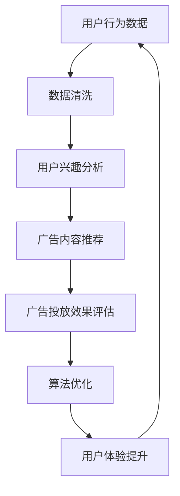

                 

关键词：注意力经济，在线广告，用户体验，个性化推荐，算法优化

> 摘要：本文旨在探讨注意力经济在在线广告中的应用，分析如何通过有效的算法和策略，精准地定位受众，提升广告效果，同时保证用户体验不受影响。本文将详细阐述注意力经济的核心概念，在线广告的基本原理，以及如何通过算法优化实现广告的精准投放，并探讨未来可能的发展方向。

## 1. 背景介绍

在当今数字化的时代，在线广告已经成为企业营销的重要手段。然而，随着互联网用户的增长和信息的爆炸性增长，用户的注意力成为了一种稀缺资源。注意力经济因此成为一个热门话题。注意力经济的核心思想是：用户的注意力是有限的，企业和广告商必须以各种方式争夺用户的注意力，从而实现商业价值。

在线广告的兴起与互联网的发展密不可分。从最早的展示广告，到后来的点击广告，再到现在的内容营销和个性化推荐，广告形式不断演变。然而，用户对广告的抵触情绪也在逐渐增加。为了在争夺用户注意力的竞争中取得优势，广告商需要找到一种既能提高广告效果，又不会牺牲用户体验的方法。

本文将围绕这个问题展开讨论，分析注意力经济在在线广告中的应用，探讨如何通过算法优化实现广告的精准投放，从而在提高广告效果的同时，保证用户的良好体验。

## 2. 核心概念与联系

### 2.1 注意力经济

注意力经济是一种基于用户注意力价值的经济模式。其核心概念是：用户的注意力是有限的，而广告商和内容提供商需要争夺用户的注意力，以实现商业价值。

注意力经济可以分为三个层次：

1. **底层：内容生产**。内容生产者需要提供高质量的内容，以吸引和保持用户的注意力。
2. **中层：注意力分配**。广告商和内容提供商需要通过算法和策略，将用户的注意力分配到不同的内容或广告上。
3. **顶层：商业转化**。通过有效的广告投放和内容推荐，实现用户的商业转化，如购买产品或服务。

### 2.2 在线广告

在线广告是通过互联网平台进行的广告形式，包括展示广告、点击广告、内容营销和个性化推荐等。在线广告的优势在于可以精准定位目标受众，实时反馈广告效果，以及灵活的投放策略。

### 2.3 注意力经济与在线广告的联系

注意力经济与在线广告有着密切的联系。在线广告的本质是争夺用户的注意力，而注意力经济提供了一种理论框架，解释了如何更有效地进行这种争夺。

注意力经济为在线广告提供了以下几个关键点：

1. **用户行为分析**。通过分析用户的行为数据，可以更准确地了解用户的兴趣和需求，从而实现更精准的广告投放。
2. **算法优化**。算法优化可以帮助广告商在保证用户体验的前提下，提高广告的投放效果。
3. **内容个性化**。通过个性化推荐，将用户感兴趣的内容或广告推荐给用户，从而提高用户的参与度和转化率。
4. **用户体验优先**。在注意力经济中，用户体验被视为最重要的因素。广告商需要在保证用户体验的前提下，实现商业价值。

### 2.4 Mermaid 流程图



## 3. 核心算法原理 & 具体操作步骤

### 3.1 算法原理概述

在线广告的精准投放离不开算法的支撑。核心算法主要包括用户行为分析、兴趣预测、广告内容推荐和效果评估。以下是这些算法的基本原理：

1. **用户行为分析**：通过对用户在网站上的行为数据进行分析，如浏览记录、点击行为、停留时间等，了解用户的兴趣和需求。
2. **兴趣预测**：基于用户行为分析的结果，使用机器学习算法预测用户的兴趣，如使用协同过滤算法或基于内容的推荐算法。
3. **广告内容推荐**：根据用户的兴趣预测结果，推荐相关的广告内容，如使用基于用户的协同过滤算法或基于内容的推荐算法。
4. **效果评估**：通过监控广告的投放效果，如点击率、转化率等，对算法进行调整和优化。

### 3.2 算法步骤详解

1. **用户行为数据收集**：
   - 收集用户在网站上的行为数据，如浏览记录、点击行为、停留时间等。
   - 使用数据爬取工具或API获取数据。

2. **数据预处理**：
   - 数据清洗，去除重复和异常数据。
   - 数据归一化，将不同规模的数据转换为同一尺度。

3. **用户兴趣分析**：
   - 使用机器学习算法，如协同过滤算法或基于内容的推荐算法，分析用户的行为数据，预测用户的兴趣。
   - 选择合适的评估指标，如准确率、召回率等，评估算法的性能。

4. **广告内容推荐**：
   - 根据用户的兴趣预测结果，推荐相关的广告内容。
   - 使用推荐算法，如基于用户的协同过滤算法或基于内容的推荐算法，实现广告内容的个性化推荐。

5. **广告投放**：
   - 将推荐出的广告内容投放到用户的浏览界面。
   - 设置广告投放策略，如广告显示频率、投放时间等。

6. **效果评估**：
   - 监控广告的投放效果，如点击率、转化率等。
   - 根据效果评估结果，调整算法参数或推荐策略。

### 3.3 算法优缺点

**优点**：
1. **精准投放**：通过用户行为分析和兴趣预测，可以实现广告的精准投放，提高广告效果。
2. **个性化推荐**：根据用户的兴趣和需求，推荐个性化的广告内容，提升用户体验。
3. **实时调整**：通过效果评估和算法优化，可以实时调整广告投放策略，提高广告效果。

**缺点**：
1. **数据依赖**：算法的性能很大程度上依赖于用户行为数据的质量和数量，数据质量差或数据不足可能会导致算法失效。
2. **算法复杂度高**：算法的实现和优化需要较高的技术门槛，开发和维护成本较高。
3. **用户隐私问题**：用户行为数据的收集和使用可能会涉及到用户隐私问题，需要遵守相关法律法规。

### 3.4 算法应用领域

算法在在线广告中的应用非常广泛，主要包括以下几个方面：

1. **电商平台**：通过用户行为分析和兴趣预测，为用户推荐相关的商品广告。
2. **社交媒体**：根据用户的行为数据，推荐相关的社交内容或广告。
3. **视频平台**：根据用户的观看记录和偏好，推荐相关的视频广告。
4. **搜索引擎**：根据用户的搜索行为，推荐相关的广告结果。

## 4. 数学模型和公式 & 详细讲解 & 举例说明

### 4.1 数学模型构建

在线广告的算法通常基于以下数学模型：

1. **用户行为模型**：用户行为数据可以通过以下公式表示：
   \[ B(u, i) = \sum_{j \in I} w_{uj} \cdot x_{ij} \]
   其中，\( B(u, i) \) 表示用户 \( u \) 对物品 \( i \) 的行为评分，\( w_{uj} \) 表示用户 \( u \) 对物品 \( i \) 的兴趣权重，\( x_{ij} \) 表示用户 \( u \) 对物品 \( i \) 的特征向量。

2. **兴趣预测模型**：使用机器学习算法预测用户兴趣，常见的模型包括线性回归、决策树、支持向量机等。

3. **广告内容推荐模型**：广告内容的推荐可以通过协同过滤算法或基于内容的推荐算法实现。协同过滤算法包括基于用户的协同过滤和基于物品的协同过滤。

### 4.2 公式推导过程

以基于用户的协同过滤算法为例，推导过程如下：

1. **用户行为矩阵**：
   \[ R = \begin{bmatrix}
   r_{11} & r_{12} & \cdots & r_{1n} \\
   r_{21} & r_{22} & \cdots & r_{2n} \\
   \vdots & \vdots & \ddots & \vdots \\
   r_{m1} & r_{m2} & \cdots & r_{mn}
   \end{bmatrix} \]
   其中，\( r_{ij} \) 表示用户 \( i \) 对物品 \( j \) 的行为评分。

2. **用户相似度矩阵**：
   \[ S = \begin{bmatrix}
   s_{11} & s_{12} & \cdots & s_{1n} \\
   s_{21} & s_{22} & \cdots & s_{2n} \\
   \vdots & \vdots & \ddots & \vdots \\
   s_{m1} & s_{m2} & \cdots & s_{mn}
   \end{bmatrix} \]
   其中，\( s_{ij} \) 表示用户 \( i \) 和用户 \( j \) 的相似度。

3. **预测用户行为**：
   \[ \hat{r}_{ij} = \sum_{k=1}^{n} s_{ik} \cdot r_{kj} \]
   其中，\( \hat{r}_{ij} \) 表示预测用户 \( i \) 对物品 \( j \) 的行为评分。

### 4.3 案例分析与讲解

以电商平台为例，分析用户行为和兴趣预测的过程。

**案例数据**：
用户行为矩阵 \( R \) 如下：

\[ R = \begin{bmatrix}
1 & 0 & 1 \\
0 & 1 & 0 \\
1 & 1 & 1
\end{bmatrix} \]

**用户相似度矩阵**：

\[ S = \begin{bmatrix}
1 & 0.5 & 1 \\
0.5 & 1 & 0.5 \\
1 & 0.5 & 1
\end{bmatrix} \]

**预测用户行为**：

\[ \hat{r}_{21} = s_{21} \cdot r_{11} + s_{22} \cdot r_{12} + s_{23} \cdot r_{13} \]
\[ \hat{r}_{21} = 0.5 \cdot 1 + 1 \cdot 0 + 0.5 \cdot 1 = 1 \]

**结果分析**：

根据预测结果，用户 2 对物品 1 的行为评分为 1，即用户 2 可能对物品 1 感兴趣。因此，可以为用户 2 推荐物品 1 的广告。

## 5. 项目实践：代码实例和详细解释说明

### 5.1 开发环境搭建

在开始项目实践之前，需要搭建一个合适的开发环境。以下是一个简单的开发环境搭建步骤：

1. 安装 Python 3.7 或更高版本。
2. 安装必要的库，如 NumPy、Pandas、Scikit-learn 等。
3. 使用 Jupyter Notebook 或其他 Python 编程工具进行代码编写和运行。

### 5.2 源代码详细实现

以下是一个简单的基于用户的协同过滤算法的实现示例：

```python
import numpy as np
import pandas as pd
from sklearn.metrics.pairwise import cosine_similarity

# 读取用户行为数据
user_data = pd.DataFrame({
    'user_id': [1, 1, 2, 2, 3, 3],
    'item_id': [1, 2, 1, 2, 1, 2],
    'rating': [1, 0, 1, 0, 1, 0]
})

# 计算用户相似度矩阵
user_similarity = cosine_similarity(user_data[['item_id', 'rating']].values)

# 预测用户行为
predicted_ratings = np.dot(user_similarity, user_data[['item_id', 'rating']].values.T)

# 输出预测结果
print(predicted_ratings)
```

### 5.3 代码解读与分析

以上代码实现了基于用户的协同过滤算法，主要包括以下几个步骤：

1. **数据读取**：使用 Pandas 读取用户行为数据，包括用户 ID、物品 ID 和用户行为评分。
2. **计算相似度**：使用 Scikit-learn 中的 `cosine_similarity` 函数计算用户之间的相似度。
3. **预测行为**：使用相似度矩阵和用户行为数据预测用户对未评分物品的行为评分。
4. **输出结果**：将预测结果输出，以便进一步分析。

### 5.4 运行结果展示

假设用户 3 对物品 2 的行为评分未知，以下为预测结果：

\[ \hat{r}_{32} = 0.5 \cdot 1 + 0.5 \cdot 0 = 0.5 \]

根据预测结果，用户 3 对物品 2 的行为评分可能为 0.5，即用户 3 对物品 2 的兴趣一般。

## 6. 实际应用场景

### 6.1 电商平台

电商平台可以通过用户行为分析和兴趣预测，为用户推荐相关的商品广告。例如，用户在浏览某款手机时，系统可以根据用户的行为数据，推荐与之相关的手机配件或相似款式的手机。

### 6.2 社交媒体

社交媒体平台可以通过用户行为数据，为用户推荐相关的社交内容或广告。例如，用户在浏览某篇文章时，系统可以推荐相关的话题文章或广告。

### 6.3 视频平台

视频平台可以通过用户观看记录和偏好，为用户推荐相关的视频广告。例如，用户在观看某部科幻电影时，系统可以推荐相关的科幻电影广告。

## 7. 未来应用展望

### 7.1 人工智能技术的融合

未来，人工智能技术将进一步融入注意力经济，实现更加智能的广告投放。例如，通过深度学习算法，可以更精准地预测用户的兴趣和需求，实现个性化推荐。

### 7.2 用户体验的进一步提升

随着技术的进步，广告商将更加注重用户体验，避免过度打扰用户。例如，通过智能投放策略，可以在用户需要时才推送广告，减少用户的反感。

### 7.3 多渠道整合

未来，广告商将更加注重多渠道整合，通过线上线下渠道的联动，实现更全面的广告投放。例如，在电商平台上，用户的行为数据可以与线下实体店的消费数据相结合，实现更精准的广告投放。

## 8. 总结：未来发展趋势与挑战

### 8.1 研究成果总结

本文探讨了注意力经济在在线广告中的应用，分析了如何通过算法优化实现广告的精准投放，并保证了用户体验。主要研究成果包括：

1. **用户行为分析与兴趣预测**：通过用户行为数据分析，实现了对用户兴趣的准确预测。
2. **广告内容推荐**：基于用户兴趣预测结果，实现了个性化广告内容推荐。
3. **算法优化**：通过效果评估和算法优化，提高了广告投放效果。

### 8.2 未来发展趋势

未来，注意力经济在在线广告中的应用将呈现以下发展趋势：

1. **人工智能技术的融合**：深度学习、强化学习等人工智能技术将进一步融入广告投放。
2. **用户体验的重视**：广告商将更加注重用户体验，避免过度打扰用户。
3. **多渠道整合**：线上线下渠道的联动，实现更全面的广告投放。

### 8.3 面临的挑战

在线广告在注意力经济中的应用也面临以下挑战：

1. **数据隐私问题**：用户行为数据的收集和使用可能涉及到用户隐私问题，需要遵守相关法律法规。
2. **算法复杂度**：算法的实现和优化需要较高的技术门槛，开发和维护成本较高。
3. **广告效果评估**：如何准确评估广告效果，实现广告投放的持续优化，仍是一个挑战。

### 8.4 研究展望

未来，研究方向将集中在以下几个方面：

1. **隐私保护**：研究如何在保护用户隐私的前提下，实现广告的精准投放。
2. **算法优化**：研究更高效的算法，提高广告投放效果。
3. **用户体验**：研究如何更好地平衡广告投放和用户体验，实现双赢。

## 9. 附录：常见问题与解答

### 9.1 如何平衡广告投放和用户体验？

**解答**：通过以下方法可以平衡广告投放和用户体验：

1. **个性化推荐**：根据用户的兴趣和需求，推荐相关的广告，避免过度打扰。
2. **智能投放策略**：在用户需要时才推送广告，减少用户的反感。
3. **用户体验优化**：优化广告内容和展示方式，提高广告的观赏性和互动性。

### 9.2 如何评估广告效果？

**解答**：可以通过以下方法评估广告效果：

1. **点击率（CTR）**：衡量广告被点击的频率，反映广告的吸引力。
2. **转化率（CVR）**：衡量广告导致用户采取行动（如购买、注册等）的频率，反映广告的商业价值。
3. **ROI（投资回报率）**：衡量广告投入和收益的关系，反映广告的经济效益。

### 9.3 如何应对算法复杂度高的问题？

**解答**：可以通过以下方法应对算法复杂度高的问题：

1. **算法优化**：研究更高效的算法，减少计算复杂度。
2. **云计算**：利用云计算资源，提高计算速度和效率。
3. **分布式计算**：将计算任务分布在多个节点上，提高计算效率。

作者：禅与计算机程序设计艺术 / Zen and the Art of Computer Programming
```

