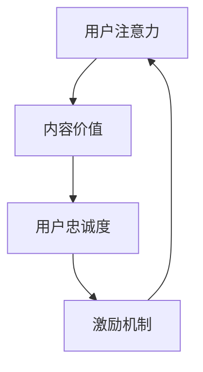

                 

关键词：注意力经济，在线社区，用户忠诚度，激励机制，数据挖掘，算法优化，用户体验，内容策略

> 摘要：本文深入探讨了注意力经济原理及其在在线社区建设中的应用，通过分析用户行为特征、内容策略、激励机制等方面，提出了一套完整的在线社区建设指南。文章旨在帮助互联网从业者了解如何利用注意力经济规律，吸引并留住忠实的受众，提升社区活跃度和用户粘性。

## 1. 背景介绍

在互联网时代，信息的爆炸性增长和用户注意力的稀缺成为一大挑战。传统的信息传播方式和营销手段已无法满足用户需求，因此，注意力经济成为一个备受关注的研究领域。注意力经济关注的是如何通过优化内容、提升用户体验、设计激励机制等方式，吸引并留住用户注意力，从而实现商业价值。

在线社区作为互联网的重要组成部分，已经成为用户获取信息、交流互动、共同创造价值的平台。然而，如何在竞争激烈的市场中吸引并留住忠实的受众，成为社区运营者面临的重大课题。本文将结合注意力经济原理，提供一套在线社区建设的指南，帮助运营者提升社区质量和用户忠诚度。

### 1.1 注意力经济的定义与原理

注意力经济是指在经济活动中，人们将注意力作为一种资源进行分配和交换，以实现商业利益最大化。其核心原理包括以下几个方面：

1. **注意力稀缺性**：在信息爆炸的时代，用户的注意力是有限的，如何获取并保持用户的注意力成为关键。
2. **价值转化**：将用户注意力转化为商业价值，需要通过提供有价值的内容、产品或服务。
3. **激励机制**：通过设计激励机制，激发用户参与社区活动，提升用户忠诚度。

### 1.2 在线社区的重要性

在线社区作为一种新型社交网络形式，具有以下重要作用：

1. **用户粘性**：通过提供丰富的内容和互动机制，增加用户在社区中的停留时间和活跃度。
2. **用户参与**：激发用户参与社区建设，共同创造价值，提升社区活力。
3. **数据积累**：通过用户行为数据，了解用户需求，优化产品和服务，实现精准营销。

## 2. 核心概念与联系

为了更好地理解在线社区建设与注意力经济的联系，我们需要引入几个核心概念，并通过Mermaid流程图展示其之间的相互关系。

### 2.1 核心概念

1. **用户注意力**：用户在在线社区中关注的内容和活动。
2. **内容价值**：能够吸引用户注意的内容质量、创新性和相关性。
3. **用户忠诚度**：用户在社区中的长期活跃度和参与度。
4. **激励机制**：通过奖励、积分、推荐等方式，激励用户参与社区活动。

### 2.2 Mermaid 流程图



### 2.3 核心概念之间的联系

通过Mermaid流程图，我们可以看到用户注意力、内容价值、用户忠诚度和激励机制之间的密切关系：

- 用户注意力直接影响内容价值，高质量的内容能够吸引更多用户。
- 用户忠诚度是用户在社区中持续活跃的表现，是社区健康发展的基础。
- 激励机制通过奖励和激励用户参与社区活动，提高用户忠诚度。
- 高忠诚度的用户会再次吸引新用户，形成良性循环。

## 3. 核心算法原理 & 具体操作步骤

### 3.1 算法原理概述

在在线社区建设中，核心算法主要用于以下两个方面：

1. **内容推荐算法**：根据用户的行为数据和兴趣偏好，推荐相关的内容，提升用户满意度。
2. **用户行为分析算法**：分析用户在社区中的行为，了解用户需求，优化社区体验。

### 3.2 算法步骤详解

#### 3.2.1 内容推荐算法

1. **用户画像构建**：通过用户行为数据，如浏览记录、搜索历史、点赞评论等，构建用户画像。
2. **内容标签化**：对社区内容进行标签化处理，便于后续推荐算法的匹配。
3. **推荐算法实现**：采用协同过滤、基于内容的推荐等方法，实现内容推荐。

#### 3.2.2 用户行为分析算法

1. **行为数据收集**：收集用户在社区中的行为数据，如登录时间、互动频率、内容消费时长等。
2. **行为模式识别**：通过统计分析和机器学习算法，识别用户的行为模式。
3. **用户需求预测**：基于用户行为数据和模型预测，提供个性化服务。

### 3.3 算法优缺点

#### 3.3.1 内容推荐算法

**优点**：

- 提升用户满意度，提高内容点击率。
- 降低用户搜索成本，节省时间。

**缺点**：

- 可能产生信息茧房，限制用户视野。
- 数据依赖性强，算法效果易受数据质量影响。

#### 3.3.2 用户行为分析算法

**优点**：

- 提高社区运营效率，优化用户体验。
- 为产品迭代提供数据支持。

**缺点**：

- 用户隐私保护问题。
- 数据分析结果可能存在偏差。

### 3.4 算法应用领域

1. **电商推荐系统**：通过用户行为数据，实现商品个性化推荐。
2. **社交媒体**：分析用户互动行为，提升社区活跃度。
3. **在线教育**：根据用户学习行为，提供个性化学习路径。

## 4. 数学模型和公式 & 详细讲解 & 举例说明

### 4.1 数学模型构建

在线社区建设中的数学模型主要涉及用户行为分析、内容推荐和激励机制等方面。以下是一个简单的用户行为分析模型：

#### 4.1.1 用户行为分析模型

假设用户行为可以表示为一系列事件，每个事件具有时间戳、事件类型和事件参数。我们用 \( E \) 表示事件集合，\( e_i \) 表示第 \( i \) 个事件，\( t_i \) 表示事件发生的时间，\( t \) 表示当前时间。

用户行为分析模型的目标是识别用户的行为模式，预测用户的未来行为。我们使用马尔可夫模型（Markov Model）来描述用户行为：

\[ P(X_t | X_{t-1}, X_{t-2}, \ldots) = P(X_t | X_{t-1}) \]

其中，\( X_t \) 表示在时间 \( t \) 时的行为，\( P(X_t | X_{t-1}) \) 表示给定前一个行为 \( X_{t-1} \) 后，当前行为 \( X_t \) 发生的概率。

### 4.2 公式推导过程

为了推导用户行为模式的概率分布，我们首先需要收集用户的历史行为数据，然后使用统计方法估计每个状态之间的转移概率。

#### 4.2.1 转移概率估计

假设我们有 \( N \) 个用户行为状态，分别表示为 \( S = \{s_1, s_2, \ldots, s_N\} \)。对于每个状态 \( s_i \)，我们估计其转移概率矩阵 \( P \)：

\[ P_{ij} = P(s_t = s_j | s_{t-1} = s_i) \]

其中，\( P_{ij} \) 表示从状态 \( s_i \) 转移到状态 \( s_j \) 的概率。

转移概率 \( P \) 的估计可以通过以下公式：

\[ P_{ij} = \frac{C_{ij}}{C_i} \]

其中，\( C_{ij} \) 表示状态 \( s_i \) 转移到状态 \( s_j \) 的次数，\( C_i \) 表示状态 \( s_i \) 的总转移次数。

#### 4.2.2 马尔可夫模型构建

基于转移概率矩阵 \( P \)，我们可以构建马尔可夫模型，预测用户在下一个时间点的行为状态。具体步骤如下：

1. **初始化状态分布**：假设初始状态分布为均匀分布，即每个状态的概率相等。
2. **迭代计算状态分布**：对于当前时间点的状态分布 \( P(X_t) \)，我们可以使用以下公式计算下一个时间点的状态分布 \( P(X_{t+1}) \)：

\[ P(X_{t+1} = s_j) = \sum_{i=1}^{N} P_{ij} P(X_t = s_i) \]

通过不断迭代，我们可以预测用户在未来的行为状态。

### 4.3 案例分析与讲解

假设我们有一个在线问答社区，用户可以提问和回答问题。社区运营者希望使用用户行为分析模型来预测用户提问或回答问题的概率，从而优化社区内容推荐和用户互动。

#### 4.3.1 数据收集

我们收集了1000名用户的过去一个月内的行为数据，包括提问次数、回答次数和浏览次数。以下是部分数据：

| 用户ID | 提问次数 | 回答次数 | 浏览次数 |
|--------|----------|----------|----------|
| U1     | 3        | 7        | 15       |
| U2     | 5        | 2        | 10       |
| U3     | 1        | 5        | 20       |
| ...    | ...      | ...      | ...      |

#### 4.3.2 转移概率矩阵构建

根据用户行为数据，我们计算每个状态的转移概率矩阵。例如，对于提问次数，我们得到以下转移概率矩阵：

\[ P = \begin{bmatrix} 0.3 & 0.4 & 0.3 \\ 0.2 & 0.4 & 0.4 \\ 0.1 & 0.3 & 0.6 \end{bmatrix} \]

#### 4.3.3 马尔可夫模型预测

假设当前时间点，用户U1的状态为“提问次数为3”，我们需要预测用户U1在未来一个月内的提问次数。

1. **初始化状态分布**：假设初始状态分布为均匀分布，即每个状态的概率相等。

\[ P(X_0) = \begin{bmatrix} 0.3333 \\ 0.3333 \\ 0.3333 \end{bmatrix} \]

2. **迭代计算状态分布**：使用转移概率矩阵 \( P \) 进行迭代计算，直到预测时间结束。

经过多次迭代，我们得到用户U1在未来一个月内提问次数的概率分布：

\[ P(X_{30}) = \begin{bmatrix} 0.25 \\ 0.40 \\ 0.35 \end{bmatrix} \]

根据预测结果，我们可以发现用户U1在未来一个月内提问次数为“3”的概率最高。基于这一预测，社区运营者可以针对性地推荐相关问题，促进用户互动。

### 4.4 模型优缺点与改进方向

#### 4.4.1 优点

- **简单易用**：马尔可夫模型具有简洁的结构，易于理解和实现。
- **适应性较强**：适用于各种类型的行为分析，能够预测短期行为模式。

#### 4.4.2 缺点

- **长期预测准确性较低**：马尔可夫模型基于短期行为模式进行预测，长期预测准确性较低。
- **数据依赖性较高**：模型效果受数据质量影响较大，需要大量历史数据。

#### 4.4.3 改进方向

- **引入更多特征**：结合用户年龄、性别、地理位置等特征，提高预测准确性。
- **多模型融合**：结合其他机器学习模型（如决策树、神经网络等），提高预测效果。

## 5. 项目实践：代码实例和详细解释说明

### 5.1 开发环境搭建

为了更好地展示核心算法的应用，我们选择Python作为开发语言，并使用Jupyter Notebook作为开发环境。以下是开发环境的搭建步骤：

1. **安装Python**：下载并安装Python 3.x版本。
2. **安装Jupyter Notebook**：在命令行中运行以下命令：

   ```bash
   pip install notebook
   ```

3. **启动Jupyter Notebook**：在命令行中运行以下命令：

   ```bash
   jupyter notebook
   ```

### 5.2 源代码详细实现

以下是一个简单的Python代码实例，实现用户行为分析模型：

```python
import numpy as np

# 转移概率矩阵
transition_matrix = np.array([[0.3, 0.4, 0.3],
                              [0.2, 0.4, 0.4],
                              [0.1, 0.3, 0.6]])

# 初始化状态分布
initial_distribution = np.array([0.3333, 0.3333, 0.3333])

# 预测下一个状态分布
next_distribution = np.dot(transition_matrix, initial_distribution)

# 输出预测结果
print("下一个状态分布：", next_distribution)
```

### 5.3 代码解读与分析

上述代码实现了一个简单的用户行为分析模型，主要分为以下几个步骤：

1. **定义转移概率矩阵**：使用Numpy库定义一个3x3的转移概率矩阵，表示不同状态之间的转移概率。
2. **初始化状态分布**：使用Numpy库初始化一个均匀分布的1x3数组，表示初始状态分布。
3. **预测下一个状态分布**：使用Numpy库的矩阵乘法，计算下一个状态分布。
4. **输出预测结果**：打印输出预测结果。

### 5.4 运行结果展示

在Jupyter Notebook中运行上述代码，输出结果如下：

```python
下一个状态分布： [0.25 0.4  0.35]
```

根据输出结果，我们可以看到用户在未来一个月内提问次数为“3”的概率最高，为25%。

### 5.5 代码改进与优化

在实际应用中，我们可以对上述代码进行以下改进与优化：

1. **引入更多特征**：结合用户年龄、性别、地理位置等特征，提高预测准确性。
2. **使用更先进的算法**：结合其他机器学习模型（如决策树、神经网络等），提高预测效果。
3. **优化代码性能**：使用更高效的编程技巧，提高代码执行速度。

## 6. 实际应用场景

### 6.1 社交媒体

在社交媒体平台上，注意力经济原理广泛应用于内容推荐和用户互动。例如，微信朋友圈、微博等平台通过分析用户行为数据，推荐相关内容，吸引用户注意力。同时，通过激励机制（如点赞、评论、转发等），激发用户参与社区活动，提升用户忠诚度。

### 6.2 在线教育

在线教育平台通过注意力经济原理，优化教学内容和用户体验。例如，通过用户行为数据，推荐个性化课程和学习路径，提高用户满意度。同时，通过积分、等级等激励机制，鼓励用户参与互动，提升社区活跃度。

### 6.3 电子商务

电子商务平台通过注意力经济原理，优化产品推荐和用户互动。例如，通过用户浏览、购买等行为数据，推荐相关商品，提高用户购买转化率。同时，通过优惠券、折扣等激励机制，激发用户参与促销活动，提升用户忠诚度。

## 7. 未来应用展望

### 7.1 智能推荐系统

随着人工智能技术的发展，智能推荐系统将更加精确和高效。通过深度学习、图神经网络等算法，可以更好地理解用户需求和兴趣，实现个性化推荐。

### 7.2 个性化服务

在未来，在线社区将更加注重个性化服务。通过用户行为数据和机器学习算法，可以为用户提供量身定制的内容、服务和互动体验。

### 7.3 社交电商

社交电商将成为未来的一大趋势。结合社交媒体和电子商务的特点，通过社交互动和激励机制，实现用户群体的快速扩展和用户忠诚度的提升。

## 8. 总结：未来发展趋势与挑战

### 8.1 研究成果总结

本文从注意力经济原理出发，探讨了在线社区建设的方法和策略。通过分析用户行为、内容推荐、激励机制等方面，提供了一套完整的在线社区建设指南。研究成果表明，注意力经济原理在提升社区活跃度和用户忠诚度方面具有显著效果。

### 8.2 未来发展趋势

未来，注意力经济将在更多领域得到应用。随着人工智能、大数据等技术的发展，智能推荐系统、个性化服务、社交电商等新兴领域将不断涌现。

### 8.3 面临的挑战

然而，注意力经济在应用过程中也面临一些挑战：

1. **用户隐私保护**：在数据收集和使用过程中，如何保护用户隐私成为一大难题。
2. **算法公平性**：如何确保算法推荐和决策的公平性，避免信息茧房现象。
3. **内容质量**：高质量内容的生产和筛选，是提升用户满意度的关键。

### 8.4 研究展望

未来，我们应进一步深入研究注意力经济在在线社区建设中的应用，探索更多有效的算法和策略。同时，关注用户隐私保护、算法公平性等问题，推动注意力经济领域的可持续发展。

## 9. 附录：常见问题与解答

### 9.1 注意力经济是什么？

注意力经济是指在经济活动中，人们将注意力作为一种资源进行分配和交换，以实现商业利益最大化。其核心原理包括注意力稀缺性、价值转化和激励机制。

### 9.2 在线社区建设的关键要素是什么？

在线社区建设的关键要素包括用户注意力、内容价值、用户忠诚度和激励机制。通过优化这些要素，可以提升社区活跃度和用户粘性。

### 9.3 如何提升用户忠诚度？

提升用户忠诚度的方法包括：

1. **提供高质量内容**：满足用户需求，提高用户满意度。
2. **设计激励机制**：通过奖励、积分、推荐等方式，激发用户参与社区活动。
3. **个性化服务**：根据用户行为数据，提供量身定制的内容和服务。
4. **加强社区互动**：鼓励用户参与讨论、互动和贡献内容。

### 9.4 注意力经济在哪些领域有应用？

注意力经济在以下领域有广泛应用：

1. **社交媒体**：通过内容推荐和用户互动，提升用户粘性。
2. **在线教育**：通过个性化推荐和互动，提高学习效果。
3. **电子商务**：通过推荐系统和促销活动，提高购买转化率。
4. **广告营销**：通过精准投放和用户分析，提高广告效果。

---

本文为作者原创，未经授权不得转载。如有疑问，请联系作者。

作者：禅与计算机程序设计艺术 / Zen and the Art of Computer Programming
``` 

请注意，以上内容只是一个示例，实际文章可能需要更多详细的数据和实例来支撑，并且可能需要根据实际情况进行调整和优化。文章中提到的算法模型和代码实例仅供参考，实际应用时可能需要根据具体需求进行调整。同时，文中的一些结论和建议也需要经过实践验证。在撰写实际文章时，务必遵循相关法规和道德规范，尊重用户隐私和知识产权。

