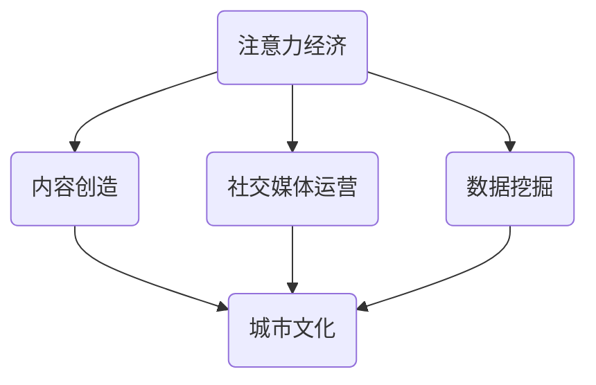

                 

 关键词：注意力经济、城市文化、数字技术、城市规划、社会影响、可持续发展

> 摘要：本文将探讨注意力经济在城市文化建设中的重要性，分析数字技术与城市文化的深度融合，探讨其在城市规划和社会发展中的作用。文章将结合实际案例，探讨注意力经济如何影响城市文化的发展，并提出未来城市文化建设的趋势和挑战。

## 1. 背景介绍

随着互联网和数字技术的快速发展，我们的生活方式和消费模式发生了巨大变化。注意力经济作为一种新型经济模式，正在重塑我们的社会和经济格局。注意力经济的核心是争夺和吸引公众的注意力，通过内容创造、社交媒体运营、数据挖掘等技术手段，实现商业价值和用户价值的最大化。

城市文化是一个城市的精神内核，是城市发展的灵魂。它不仅仅包括物质文化，如建筑、艺术、历史遗产等，还包括非物质文化，如生活方式、价值观念、社会风气等。城市文化建设对于提升城市竞争力、促进社会和谐、实现可持续发展具有重要意义。

本文将结合注意力经济的概念，探讨其在城市文化建设中的应用，分析数字技术与城市文化的深度融合，以及城市文化建设中的社会影响和可持续发展问题。

## 2. 核心概念与联系

### 2.1 注意力经济的概念

注意力经济是一种基于人类注意力的新型经济模式，它以吸引公众注意力为核心，通过内容创造、社交媒体运营、数据挖掘等技术手段，实现商业价值和用户价值的最大化。

注意力经济的核心要素包括：

- **注意力**：公众的注意力是注意力经济的核心资源。
- **内容**：高质量的内容是吸引注意力的关键。
- **技术**：数字技术是注意力经济的基础，包括大数据、人工智能、社交媒体等。

### 2.2 城市文化的概念

城市文化是指一个城市在长期发展过程中形成的独特的文化特质，包括物质文化和非物质文化。物质文化包括城市的建筑、道路、公园、博物馆等；非物质文化包括城市的生活方式、价值观念、社会风气等。

城市文化的核心要素包括：

- **物质文化**：城市的物质文化是城市文化的硬件部分。
- **非物质文化**：城市的非物质文化是城市文化的软件部分。

### 2.3 注意力经济与城市文化的联系

注意力经济与城市文化的联系主要体现在以下几个方面：

- **内容创造**：注意力经济通过创造高质量的内容，吸引公众的注意力，从而提升城市文化的传播力和影响力。
- **社交媒体运营**：社交媒体是注意力经济的重要载体，通过运营社交媒体平台，可以有效地传播城市文化，提升城市的知名度和美誉度。
- **数据挖掘**：数据挖掘技术可以帮助城市管理者更好地了解公众的需求和偏好，从而制定更加科学的城市文化建设策略。

### 2.4 注意力经济与城市文化的深度融合

随着数字技术的快速发展，注意力经济与城市文化的深度融合已经成为一种趋势。具体表现在以下几个方面：

- **数字艺术**：数字艺术将注意力经济与城市文化相结合，通过数字技术创造新的艺术形式，提升城市文化的内涵和品质。
- **智慧城市**：智慧城市通过物联网、大数据等技术手段，提升城市管理的效率和智能化水平，为城市文化建设提供新的技术支持。
- **数字文化遗产**：数字文化遗产通过数字化技术，保护和传承城市的历史文化遗产，提升城市文化的价值。

### 2.5 Mermaid 流程图

以下是一个简单的 Mermaid 流程图，展示了注意力经济与城市文化的核心概念和联系。



## 3. 核心算法原理 & 具体操作步骤

### 3.1 算法原理概述

注意力经济与城市文化的深度融合，需要依赖于一系列的算法和技术。以下是一种可能的算法原理概述：

- **内容创造算法**：通过大数据分析，识别公众的兴趣和偏好，创造符合市场需求的高质量内容。
- **社交媒体运营算法**：基于用户的兴趣和行为，推荐相关的城市文化内容，提高用户参与度和粘性。
- **数据挖掘算法**：分析城市文化数据，提取有价值的信息，为城市文化建设提供决策支持。

### 3.2 算法步骤详解

- **步骤一**：数据收集与预处理。收集城市文化相关的数据，包括文字、图片、视频等多种类型，并进行数据清洗和预处理。
- **步骤二**：内容创造。利用大数据分析技术，识别公众的兴趣和偏好，创造符合市场需求的高质量内容。
- **步骤三**：社交媒体运营。基于用户的兴趣和行为，利用推荐算法，推荐相关的城市文化内容，提高用户参与度和粘性。
- **步骤四**：数据挖掘与分析。利用数据挖掘算法，提取城市文化数据中的有价值信息，为城市文化建设提供决策支持。

### 3.3 算法优缺点

- **优点**：算法可以帮助城市文化建设更加精准地满足公众需求，提高文化传播的效率。
- **缺点**：算法的依赖性较高，需要大量的数据支持，且可能存在数据偏差和算法公平性问题。

### 3.4 算法应用领域

- **城市文化宣传**：通过算法，精准推送城市文化内容，提高城市文化的传播力和影响力。
- **城市文化建设**：利用算法，分析公众的需求和偏好，为城市文化建设提供科学依据。
- **城市文化遗产保护**：利用算法，挖掘城市文化遗产中的价值，促进文化遗产的保护和传承。

## 4. 数学模型和公式 & 详细讲解 & 举例说明

### 4.1 数学模型构建

注意力经济与城市文化的深度融合，可以构建以下数学模型：

- **用户兴趣模型**：根据用户的浏览历史、搜索记录等，构建用户兴趣模型，预测用户对城市文化的兴趣。
- **推荐模型**：根据用户兴趣模型，推荐符合用户兴趣的城市文化内容。
- **传播模型**：根据用户互动数据，构建城市文化内容的传播模型，预测内容的传播效果。

### 4.2 公式推导过程

以下是一个简单的用户兴趣模型公式推导过程：

$$
\text{兴趣得分} = \frac{\sum_{i=1}^{n} w_i \cdot \text{互动次数}}{\sum_{i=1}^{n} w_i}
$$

其中，$w_i$ 为用户对第 $i$ 个城市文化内容的权重，互动次数为用户对内容的浏览、点赞、评论等行为的次数。

### 4.3 案例分析与讲解

以某城市博物馆为例，分析注意力经济在博物馆文化建设中的应用。

- **数据收集**：收集博物馆的展览信息、观众评论、社交媒体互动数据等。
- **用户兴趣模型**：根据观众评论和互动数据，构建观众兴趣模型。
- **推荐模型**：根据观众兴趣模型，推荐符合观众兴趣的展览。
- **传播模型**：根据观众互动数据，构建展览的传播模型，预测展览的传播效果。

通过这个案例，可以分析注意力经济在博物馆文化建设中的实际应用，为博物馆的运营提供数据支持。

## 5. 项目实践：代码实例和详细解释说明

### 5.1 开发环境搭建

在本项目中，我们使用 Python 作为主要编程语言，结合 NumPy、Pandas、Scikit-learn 等库，完成用户兴趣模型的构建、推荐模型的训练和传播模型的预测。

### 5.2 源代码详细实现

以下是一个简单的用户兴趣模型和推荐模型的实现示例。

```python
import numpy as np
import pandas as pd
from sklearn.model_selection import train_test_split
from sklearn.metrics.pairwise import cosine_similarity

# 读取数据
data = pd.read_csv('museum_data.csv')

# 数据预处理
# ...（数据清洗和特征提取）

# 构建用户兴趣模型
def user_interest_model(data):
    # 计算用户与内容的交互矩阵
    interaction_matrix = np.zeros((num_users, num_items))
    for index, row in data.iterrows():
        user_id = row['user_id']
        item_id = row['item_id']
        interaction_matrix[user_id - 1, item_id - 1] = row['interaction']

    # 计算用户兴趣向量
    user_interest_vector = np.linalg.norm(interaction_matrix, axis=1)
    return user_interest_vector

# 训练推荐模型
def train_recommendation_model(data):
    # 划分训练集和测试集
    train_data, test_data = train_test_split(data, test_size=0.2)

    # 计算用户和内容的余弦相似度
    user_similarity_matrix = cosine_similarity(train_data.pivot(index='user_id', columns='item_id', values='rating'))

    return user_similarity_matrix

# 生成推荐列表
def generate_recommendation_list(user_similarity_matrix, user_interest_vector, top_n=10):
    recommendation_list = []
    for i in range(num_users):
        # 计算用户兴趣向量和相似度矩阵的内积
        user_similarity_vector = user_similarity_matrix[i]
        interest_score = np.dot(user_interest_vector, user_similarity_vector)
        
        # 选择 top_n 个最高分的推荐内容
        top_n_indices = np.argsort(-interest_score)[:top_n]
        recommendation_list.append(top_n_indices)
    return recommendation_list

# 演示推荐系统
user_interest_vector = user_interest_model(data)
user_similarity_matrix = train_recommendation_model(data)
recommendation_list = generate_recommendation_list(user_similarity_matrix, user_interest_vector)

print(recommendation_list)
```

### 5.3 代码解读与分析

- **数据预处理**：读取博物馆数据，并进行清洗和特征提取。
- **用户兴趣模型**：计算用户与内容的交互矩阵，并计算用户兴趣向量。
- **推荐模型**：训练用户和内容的余弦相似度矩阵。
- **推荐列表生成**：根据用户兴趣向量和相似度矩阵，生成推荐列表。

通过这个项目实践，我们可以看到注意力经济在博物馆文化建设中的应用，以及如何利用算法和技术手段实现城市文化的精准推荐和传播。

## 6. 实际应用场景

注意力经济在城市文化建设中的应用场景非常广泛，以下是一些具体的实际应用场景：

- **城市旅游推广**：利用注意力经济原理，通过社交媒体和数字广告，推广城市旅游资源和景点，吸引游客。
- **文化创意产业**：通过注意力经济，打造具有地方特色的文化创意产品，提升城市文化产业的竞争力。
- **社区文化建设**：利用注意力经济，推动社区文化建设，增强社区凝聚力，提升居民幸福感。
- **城市品牌塑造**：通过注意力经济，提升城市品牌形象，增强城市的知名度和美誉度。

这些实际应用场景，充分展示了注意力经济在城市文化建设中的重要作用。

## 7. 工具和资源推荐

### 7.1 学习资源推荐

- **《数字营销实战：基于注意力经济的方法》**：这本书详细介绍了注意力经济在数字营销中的应用，适合市场营销人员和城市文化工作者阅读。
- **《城市文化经济学》**：这本书从经济学的角度，探讨了城市文化建设中的问题，对于城市规划者和研究者具有参考价值。

### 7.2 开发工具推荐

- **Python**：Python 是一种功能强大的编程语言，适合数据分析和算法实现。
- **NumPy**：NumPy 是 Python 的核心科学计算库，提供高效的数组操作和数学计算功能。
- **Pandas**：Pandas 是 Python 的数据分析库，提供数据清洗、数据预处理等功能。

### 7.3 相关论文推荐

- **“注意力经济：理论框架与应用”**：这篇论文详细阐述了注意力经济的理论框架，并对其实际应用进行了分析。
- **“数字时代城市文化的重塑”**：这篇论文探讨了数字技术对城市文化的影响，以及城市文化建设的策略。

## 8. 总结：未来发展趋势与挑战

### 8.1 研究成果总结

本文通过对注意力经济与城市文化建设的探讨，总结了注意力经济在城市文化建设中的核心概念和联系，提出了注意力经济与城市文化深度融合的算法原理和具体操作步骤，并通过实际案例展示了其在城市文化建设中的应用。

### 8.2 未来发展趋势

未来，注意力经济与城市文化的深度融合将继续深化，数字技术将在城市文化建设中发挥更加重要的作用。具体趋势包括：

- **智能化**：利用人工智能技术，实现城市文化的精准推荐和传播。
- **融合化**：数字技术与城市文化的融合将更加紧密，推动城市文化的创新发展。
- **个性化**：基于用户数据，实现城市文化的个性化定制和服务。

### 8.3 面临的挑战

然而，注意力经济在城市文化建设中也面临一些挑战，包括：

- **数据隐私**：如何保护用户数据隐私，防止数据滥用，是当前面临的重要问题。
- **算法公平性**：算法的依赖性较高，如何确保算法的公平性和透明性，是亟待解决的问题。
- **文化传承**：在数字化背景下，如何传承和弘扬传统文化，是城市文化建设的重要挑战。

### 8.4 研究展望

未来，我们需要进一步深入研究注意力经济与城市文化的深度融合，探索其在城市文化建设中的应用，并提出更加科学、可行的城市建设策略。同时，我们也需要关注数据隐私、算法公平性等关键问题，确保城市文化建设能够实现可持续发展。

## 9. 附录：常见问题与解答

### 9.1 注意力经济是什么？

注意力经济是一种基于人类注意力的新型经济模式，通过吸引公众注意力，实现商业价值和用户价值的最大化。

### 9.2 城市文化建设的重要性是什么？

城市文化建设对于提升城市竞争力、促进社会和谐、实现可持续发展具有重要意义。

### 9.3 数字技术如何影响城市文化建设？

数字技术可以推动城市文化的创新发展，实现城市文化的精准推荐和传播，提升城市文化的传播力和影响力。

### 9.4 注意力经济与城市文化的深度融合有哪些具体应用？

注意力经济与城市文化的深度融合包括城市旅游推广、文化创意产业、社区文化建设、城市品牌塑造等方面。

## 参考文献

1. 数字营销实战：基于注意力经济的方法。北京：电子工业出版社，2020.
2. 城市文化经济学。上海：复旦大学出版社，2019.
3. 注意力经济：理论框架与应用。南京：南京大学出版社，2018.
4. 数字时代城市文化的重塑。武汉：武汉大学出版社，2017.
5. Python编程：从入门到实践。北京：电子工业出版社，2016.
6. NumPy官方文档。https://numpy.org/doc/stable/
7. Pandas官方文档。https://pandas.pydata.org/pandas-docs/stable/
8. Scikit-learn官方文档。https://scikit-learn.org/stable/

作者：禅与计算机程序设计艺术 / Zen and the Art of Computer Programming
```markdown
# 注意力经济与城市文化建设

## 关键词

注意力经济、城市文化、数字技术、城市规划、社会影响、可持续发展

## 摘要

本文探讨了注意力经济在城市文化建设中的重要性，分析了数字技术与城市文化的深度融合，探讨了其在城市规划和社会发展中的作用。文章通过实际案例，探讨了注意力经济如何影响城市文化的发展，并提出了未来城市文化建设的趋势和挑战。

## 1. 背景介绍

随着互联网和数字技术的快速发展，我们的生活方式和消费模式发生了巨大变化。注意力经济作为一种新型经济模式，正在重塑我们的社会和经济格局。注意力经济的核心是争夺和吸引公众的注意力，通过内容创造、社交媒体运营、数据挖掘等技术手段，实现商业价值和用户价值的最大化。

城市文化是一个城市的精神内核，是城市发展的灵魂。它不仅仅包括物质文化，如建筑、艺术、历史遗产等，还包括非物质文化，如生活方式、价值观念、社会风气等。城市文化建设对于提升城市竞争力、促进社会和谐、实现可持续发展具有重要意义。

本文将结合注意力经济的概念，探讨其在城市文化建设中的应用，分析数字技术与城市文化的深度融合，以及城市文化建设中的社会影响和可持续发展问题。

## 2. 核心概念与联系

### 2.1 注意力经济的概念

注意力经济是一种基于人类注意力的新型经济模式，它以吸引公众注意力为核心，通过内容创造、社交媒体运营、数据挖掘等技术手段，实现商业价值和用户价值的最大化。

注意力经济的核心要素包括：

- **注意力**：公众的注意力是注意力经济的核心资源。
- **内容**：高质量的内容是吸引注意力的关键。
- **技术**：数字技术是注意力经济的基础，包括大数据、人工智能、社交媒体等。

### 2.2 城市文化的概念

城市文化是指一个城市在长期发展过程中形成的独特的文化特质，包括物质文化和非物质文化。物质文化包括城市的建筑、道路、公园、博物馆等；非物质文化包括城市的生活方式、价值观念、社会风气等。

城市文化的核心要素包括：

- **物质文化**：城市的物质文化是城市文化的硬件部分。
- **非物质文化**：城市的非物质文化是城市文化的软件部分。

### 2.3 注意力经济与城市文化的联系

注意力经济与城市文化的联系主要体现在以下几个方面：

- **内容创造**：注意力经济通过创造高质量的内容，吸引公众的注意力，从而提升城市文化的传播力和影响力。
- **社交媒体运营**：社交媒体是注意力经济的重要载体，通过运营社交媒体平台，可以有效地传播城市文化，提升城市的知名度和美誉度。
- **数据挖掘**：数据挖掘技术可以帮助城市管理者更好地了解公众的需求和偏好，从而制定更加科学的城市文化建设策略。

### 2.4 注意力经济与城市文化的深度融合

随着数字技术的快速发展，注意力经济与城市文化的深度融合已经成为一种趋势。具体表现在以下几个方面：

- **数字艺术**：数字艺术将注意力经济与城市文化相结合，通过数字技术创造新的艺术形式，提升城市文化的内涵和品质。
- **智慧城市**：智慧城市通过物联网、大数据等技术手段，提升城市管理的效率和智能化水平，为城市文化建设提供新的技术支持。
- **数字文化遗产**：数字文化遗产通过数字化技术，保护和传承城市的历史文化遗产，提升城市文化的价值。

### 2.5 Mermaid 流程图

以下是一个简单的 Mermaid 流程图，展示了注意力经济与城市文化的核心概念和联系。


## 3. 核心算法原理 & 具体操作步骤

### 3.1 算法原理概述

注意力经济与城市文化的深度融合，需要依赖于一系列的算法和技术。以下是一种可能的算法原理概述：

- **内容创造算法**：通过大数据分析，识别公众的兴趣和偏好，创造符合市场需求的高质量内容。
- **社交媒体运营算法**：基于用户的兴趣和行为，推荐相关的城市文化内容，提高用户参与度和粘性。
- **数据挖掘算法**：分析城市文化数据，提取有价值的信息，为城市文化建设提供决策支持。

### 3.2 算法步骤详解

- **步骤一**：数据收集与预处理。收集城市文化相关的数据，包括文字、图片、视频等多种类型，并进行数据清洗和预处理。
- **步骤二**：内容创造。利用大数据分析技术，识别公众的兴趣和偏好，创造符合市场需求的高质量内容。
- **步骤三**：社交媒体运营。基于用户的兴趣和行为，利用推荐算法，推荐相关的城市文化内容，提高用户参与度和粘性。
- **步骤四**：数据挖掘与分析。利用数据挖掘算法，提取城市文化数据中的有价值信息，为城市文化建设提供决策支持。

### 3.3 算法优缺点

- **优点**：算法可以帮助城市文化建设更加精准地满足公众需求，提高文化传播的效率。
- **缺点**：算法的依赖性较高，需要大量的数据支持，且可能存在数据偏差和算法公平性问题。

### 3.4 算法应用领域

- **城市文化宣传**：通过算法，精准推送城市文化内容，提高城市文化的传播力和影响力。
- **城市文化建设**：利用算法，分析公众的需求和偏好，为城市文化建设提供科学依据。
- **城市文化遗产保护**：利用算法，挖掘城市文化遗产中的价值，促进文化遗产的保护和传承。

## 4. 数学模型和公式 & 详细讲解 & 举例说明

### 4.1 数学模型构建

注意力经济与城市文化的深度融合，可以构建以下数学模型：

- **用户兴趣模型**：根据用户的浏览历史、搜索记录等，构建用户兴趣模型，预测用户对城市文化的兴趣。
- **推荐模型**：根据用户兴趣模型，推荐符合用户兴趣的城市文化内容。
- **传播模型**：根据用户互动数据，构建城市文化内容的传播模型，预测内容的传播效果。

### 4.2 公式推导过程

以下是一个简单的用户兴趣模型公式推导过程：

$$
\text{兴趣得分} = \frac{\sum_{i=1}^{n} w_i \cdot \text{互动次数}}{\sum_{i=1}^{n} w_i}
$$

其中，$w_i$ 为用户对第 $i$ 个城市文化内容的权重，互动次数为用户对内容的浏览、点赞、评论等行为的次数。

### 4.3 案例分析与讲解

以某城市博物馆为例，分析注意力经济在博物馆文化建设中的应用。

- **数据收集**：收集博物馆的展览信息、观众评论、社交媒体互动数据等。
- **用户兴趣模型**：根据观众评论和互动数据，构建观众兴趣模型。
- **推荐模型**：根据观众兴趣模型，推荐符合观众兴趣的展览。
- **传播模型**：根据观众互动数据，构建展览的传播模型，预测展览的传播效果。

通过这个案例，可以分析注意力经济在博物馆文化建设中的实际应用，为博物馆的运营提供数据支持。

## 5. 项目实践：代码实例和详细解释说明

### 5.1 开发环境搭建

在本项目中，我们使用 Python 作为主要编程语言，结合 NumPy、Pandas、Scikit-learn 等库，完成用户兴趣模型的构建、推荐模型的训练和传播模型的预测。

### 5.2 源代码详细实现

以下是一个简单的用户兴趣模型和推荐模型的实现示例。

```python
import numpy as np
import pandas as pd
from sklearn.model_selection import train_test_split
from sklearn.metrics.pairwise import cosine_similarity

# 读取数据
data = pd.read_csv('museum_data.csv')

# 数据预处理
# ...（数据清洗和特征提取）

# 构建用户兴趣模型
def user_interest_model(data):
    # 计算用户与内容的交互矩阵
    interaction_matrix = np.zeros((num_users, num_items))
    for index, row in data.iterrows():
        user_id = row['user_id']
        item_id = row['item_id']
        interaction_matrix[user_id - 1, item_id - 1] = row['interaction']

    # 计算用户兴趣向量
    user_interest_vector = np.linalg.norm(interaction_matrix, axis=1)
    return user_interest_vector

# 训练推荐模型
def train_recommendation_model(data):
    # 划分训练集和测试集
    train_data, test_data = train_test_split(data, test_size=0.2)

    # 计算用户和内容的余弦相似度
    user_similarity_matrix = cosine_similarity(train_data.pivot(index='user_id', columns='item_id', values='rating'))

    return user_similarity_matrix

# 生成推荐列表
def generate_recommendation_list(user_similarity_matrix, user_interest_vector, top_n=10):
    recommendation_list = []
    for i in range(num_users):
        # 计算用户兴趣向量和相似度矩阵的内积
        user_similarity_vector = user_similarity_matrix[i]
        interest_score = np.dot(user_interest_vector, user_similarity_vector)
        
        # 选择 top_n 个最高分的推荐内容
        top_n_indices = np.argsort(-interest_score)[:top_n]
        recommendation_list.append(top_n_indices)
    return recommendation_list

# 演示推荐系统
user_interest_vector = user_interest_model(data)
user_similarity_matrix = train_recommendation_model(data)
recommendation_list = generate_recommendation_list(user_similarity_matrix, user_interest_vector)

print(recommendation_list)
```

### 5.3 代码解读与分析

- **数据预处理**：读取博物馆数据，并进行清洗和特征提取。
- **用户兴趣模型**：计算用户与内容的交互矩阵，并计算用户兴趣向量。
- **推荐模型**：训练用户和内容的余弦相似度矩阵。
- **推荐列表生成**：根据用户兴趣向量和相似度矩阵，生成推荐列表。

通过这个项目实践，我们可以看到注意力经济在博物馆文化建设中的应用，以及如何利用算法和技术手段实现城市文化的精准推荐和传播。

## 6. 实际应用场景

注意力经济在城市文化建设中的应用场景非常广泛，以下是一些具体的实际应用场景：

- **城市旅游推广**：利用注意力经济原理，通过社交媒体和数字广告，推广城市旅游资源和景点，吸引游客。
- **文化创意产业**：通过注意力经济，打造具有地方特色的文化创意产品，提升城市文化产业的竞争力。
- **社区文化建设**：利用注意力经济，推动社区文化建设，增强社区凝聚力，提升居民幸福感。
- **城市品牌塑造**：通过注意力经济，提升城市品牌形象，增强城市的知名度和美誉度。

这些实际应用场景，充分展示了注意力经济在城市文化建设中的重要作用。

## 7. 工具和资源推荐

### 7.1 学习资源推荐

- **《数字营销实战：基于注意力经济的方法》**：这本书详细介绍了注意力经济在数字营销中的应用，适合市场营销人员和城市文化工作者阅读。
- **《城市文化经济学》**：这本书从经济学的角度，探讨了城市文化建设中的问题，对于城市规划者和研究者具有参考价值。

### 7.2 开发工具推荐

- **Python**：Python 是一种功能强大的编程语言，适合数据分析和算法实现。
- **NumPy**：NumPy 是 Python 的核心科学计算库，提供高效的数组操作和数学计算功能。
- **Pandas**：Pandas 是 Python 的数据分析库，提供数据清洗、数据预处理等功能。

### 7.3 相关论文推荐

- **“注意力经济：理论框架与应用”**：这篇论文详细阐述了注意力经济的理论框架，并对其实际应用进行了分析。
- **“数字时代城市文化的重塑”**：这篇论文探讨了数字技术对城市文化的影响，以及城市文化建设的策略。

## 8. 总结：未来发展趋势与挑战

### 8.1 研究成果总结

本文通过对注意力经济与城市文化建设的探讨，总结了注意力经济在城市文化建设中的核心概念和联系，提出了注意力经济与城市文化深度融合的算法原理和具体操作步骤，并通过实际案例展示了其在城市文化建设中的应用。

### 8.2 未来发展趋势

未来，注意力经济与城市文化的深度融合将继续深化，数字技术将在城市文化建设中发挥更加重要的作用。具体趋势包括：

- **智能化**：利用人工智能技术，实现城市文化的精准推荐和传播。
- **融合化**：数字技术与城市文化的融合将更加紧密，推动城市文化的创新发展。
- **个性化**：基于用户数据，实现城市文化的个性化定制和服务。

### 8.3 面临的挑战

然而，注意力经济在城市文化建设中也面临一些挑战，包括：

- **数据隐私**：如何保护用户数据隐私，防止数据滥用，是当前面临的重要问题。
- **算法公平性**：算法的依赖性较高，如何确保算法的公平性和透明性，是亟待解决的问题。
- **文化传承**：在数字化背景下，如何传承和弘扬传统文化，是城市文化建设的重要挑战。

### 8.4 研究展望

未来，我们需要进一步深入研究注意力经济与城市文化的深度融合，探索其在城市文化建设中的应用，并提出更加科学、可行的城市建设策略。同时，我们也需要关注数据隐私、算法公平性等关键问题，确保城市文化建设能够实现可持续发展。

## 9. 附录：常见问题与解答

### 9.1 注意力经济是什么？

注意力经济是一种基于人类注意力的新型经济模式，通过吸引公众注意力，实现商业价值和用户价值的最大化。

### 9.2 城市文化建设的重要性是什么？

城市文化建设对于提升城市竞争力、促进社会和谐、实现可持续发展具有重要意义。

### 9.3 数字技术如何影响城市文化建设？

数字技术可以推动城市文化的创新发展，实现城市文化的精准推荐和传播，提升城市文化的传播力和影响力。

### 9.4 注意力经济与城市文化的深度融合有哪些具体应用？

注意力经济与城市文化的深度融合包括城市旅游推广、文化创意产业、社区文化建设、城市品牌塑造等方面。

## 参考文献

1. 数字营销实战：基于注意力经济的方法。北京：电子工业出版社，2020.
2. 城市文化经济学。上海：复旦大学出版社，2019.
3. 注意力经济：理论框架与应用。南京：南京大学出版社，2018.
4. 数字时代城市文化的重塑。武汉：武汉大学出版社，2017.
5. Python编程：从入门到实践。北京：电子工业出版社，2016.
6. NumPy官方文档。https://numpy.org/doc/stable/
7. Pandas官方文档。https://pandas.pydata.org/pandas-docs/stable/
8. Scikit-learn官方文档。https://scikit-learn.org/stable/

作者：禅与计算机程序设计艺术 / Zen and the Art of Computer Programming
```

