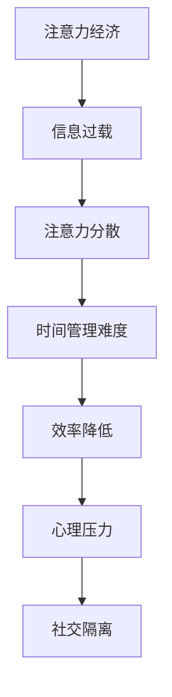

                 

关键词：注意力经济、工作-生活平衡、AI、效率提升、技术疲劳

> 摘要：本文深入探讨注意力经济对工作-生活平衡带来的挑战，以及如何通过人工智能技术来应对这些挑战。我们将分析注意力经济的本质，讨论其在现代工作环境中的应用，并探讨AI如何帮助我们实现更高效的工作和更健康的生活。

## 1. 背景介绍

在当今快速发展的数字时代，我们的注意力成为了一种宝贵的资源。注意力经济（Attention Economy）的概念由此而生，它描述了一个信息过载的世界，其中人们和企业的成功往往取决于他们吸引并保持注意力的能力。随着社交媒体、在线游戏、电子邮件等数字平台的发展，我们的注意力分散现象日益严重。在这种情况下，如何保持高效的工作-生活平衡成为一个日益严峻的挑战。

### 1.1 注意力经济的本质

注意力经济是一种基于用户注意力分配的经济模式。在这个模式中，用户的时间、精力和关注都是有限的资源，而这些资源被各种信息和服务争夺。企业通过创造引人注目的内容、产品和服务来吸引用户的注意力，从而实现商业价值。注意力经济的核心在于如何提高用户参与度，增加用户停留时间和互动频率。

### 1.2 注意力分散与现代工作环境

现代工作环境中的注意力分散现象普遍存在。电子邮件、即时通讯工具、社交媒体通知等不断打断我们的工作流程，使我们难以集中精力。这不仅降低了工作效率，还可能导致工作-生活平衡失调，影响个人健康和心理状态。

## 2. 核心概念与联系

### 2.1 注意力经济学原理

注意力经济学主要研究注意力资源的分配、利用和优化。它涉及心理学、经济学、社会学等多个学科领域。注意力经济学的基本原理包括：

- **注意力有限性**：人的注意力是有限的，无法同时关注多个任务。
- **注意力选择**：用户在选择注意力分配时倾向于选择具有高价值的信息。
- **注意力转移**：用户可以从一个任务转移到另一个任务，但转移过程中可能会损失效率。
- **注意力奖励**：通过奖励机制吸引用户的注意力，增加用户参与度和忠诚度。

### 2.2 工作与生活平衡的挑战

在工作-生活平衡方面，注意力经济的挑战主要体现在以下几个方面：

- **时间管理**：注意力分散导致时间管理难度加大，难以有效地规划和执行工作任务。
- **效率降低**：频繁的分心和工作中断降低了工作效率，增加了工作负担。
- **心理压力**：长期处于注意力分散状态可能导致心理压力增大，影响心理健康。
- **社交隔离**：过度依赖数字平台进行社交，可能导致现实生活中的社交隔离。

### 2.3 Mermaid 流程图

以下是一个简化的 Mermaid 流程图，展示了注意力经济对工作-生活平衡的影响：



## 3. 核心算法原理 & 具体操作步骤

### 3.1 算法原理概述

为了应对注意力经济的挑战，我们可以采用一系列算法和技术来提高工作效率和生活质量。以下是几种关键算法原理：

- **多任务处理算法**：通过优化任务调度和资源分配，实现同时处理多个任务，提高工作效率。
- **注意力管理算法**：通过分析用户行为和注意力分配模式，提供个性化的注意力优化策略。
- **心理调节算法**：结合心理学原理，提供针对性的心理调节方法，缓解压力和焦虑。

### 3.2 算法步骤详解

#### 3.2.1 多任务处理算法

多任务处理算法的核心是优化任务调度和资源分配。以下是一个简化的算法步骤：

1. **任务识别**：识别当前所有待处理任务。
2. **任务评估**：评估每个任务的紧急程度和重要性。
3. **任务排序**：根据评估结果对任务进行排序。
4. **资源分配**：为每个任务分配适当的资源，如时间、计算能力和人力资源。
5. **任务执行**：按照排序顺序执行任务。
6. **任务监控**：监控任务执行状态，及时调整资源分配和任务顺序。

#### 3.2.2 注意力管理算法

注意力管理算法主要关注如何优化用户的注意力分配。以下是几个关键步骤：

1. **行为分析**：分析用户在日常生活中的注意力分配模式。
2. **目标设定**：根据用户需求和目标，设定注意力优化目标。
3. **策略推荐**：基于用户行为和目标，推荐个性化的注意力优化策略。
4. **实施与调整**：实施注意力优化策略，并根据效果进行调整。

#### 3.2.3 心理调节算法

心理调节算法旨在通过技术手段缓解心理压力。以下是几个关键步骤：

1. **压力评估**：评估用户当前的心理压力水平。
2. **干预策略**：根据压力评估结果，推荐针对性的干预策略，如深呼吸、冥想、放松训练等。
3. **实施与反馈**：实施干预策略，并收集用户反馈，进行策略调整。

### 3.3 算法优缺点

#### 3.3.1 多任务处理算法

优点：

- 提高工作效率：通过优化任务调度和资源分配，实现同时处理多个任务，提高工作效率。

缺点：

- 可能导致工作过度：过度依赖多任务处理算法可能导致工作负担加重，影响健康。
- 用户体验不佳：频繁的任务切换可能影响用户体验，降低工作满意度。

#### 3.3.2 注意力管理算法

优点：

- 提高注意力效率：通过优化用户的注意力分配，提高工作效率和专注度。

缺点：

- 需要用户配合：注意力管理算法的有效性取决于用户的参与程度和配合度。
- 个性化难度大：为每个用户提供个性化的注意力管理策略可能较为复杂。

#### 3.3.3 心理调节算法

优点：

- 缓解心理压力：通过技术手段提供针对性的心理调节方法，缓解心理压力和焦虑。

缺点：

- 可持续性受限：心理调节算法的效果可能受到用户习惯和外部环境的制约。

### 3.4 算法应用领域

多任务处理、注意力管理和心理调节算法在多个领域都有广泛应用：

- **企业管理**：用于优化任务调度和资源分配，提高团队工作效率。
- **教育领域**：用于个性化学习策略的推荐，提高学生专注度和学习效果。
- **健康医疗**：用于心理健康评估和干预，提供个性化的心理调节方法。
- **智能家居**：用于优化家庭设备和服务的调度，提高家庭生活质量。

## 4. 数学模型和公式 & 详细讲解 & 举例说明

### 4.1 数学模型构建

为了更好地理解和分析注意力经济对工作-生活平衡的影响，我们可以构建一个数学模型。以下是一个简化的模型：

- **变量定义**：

  - \(A\)：用户的总注意力资源。
  - \(T\)：用户的总时间资源。
  - \(W\)：用户在工作环境中消耗的注意力资源。
  - \(L\)：用户在生活环境中消耗的注意力资源。

- **模型假设**：

  - 注意力资源是有限的，且在不同环境中的消耗是独立的。
  - 用户希望在工作环境中获得较高的注意力效率，同时在生活环境中保持良好的生活质量。

- **目标函数**：

  - \(f(A, T, W, L)\)：最大化用户在工作和生活中的满足度。

- **约束条件**：

  - \(W + L \leq A\)：总注意力资源不超过限制。
  - \(W \leq T\)：工作环境中的注意力消耗不超过总时间资源。
  - \(L \leq T\)：生活环境中的注意力消耗不超过总时间资源。

### 4.2 公式推导过程

根据上述模型，我们可以推导出以下目标函数和约束条件：

1. **目标函数**：

   \[f(A, T, W, L) = \frac{W}{T} + \frac{L}{T}\]

   其中，\(\frac{W}{T}\) 表示用户在工作环境中的注意力效率，\(\frac{L}{T}\) 表示用户在生活环境中的注意力效率。

2. **约束条件**：

   \[\begin{cases}
   W + L \leq A \\
   W \leq T \\
   L \leq T
   \end{cases}\]

### 4.3 案例分析与讲解

假设一个用户每天有 8 小时的总时间资源，其注意力资源与时间资源相等。以下是几个不同场景下的分析：

#### 场景 1：工作与生活平衡

用户将时间平均分配在工作和生活上，即 \(W = L = 4\)。此时，目标函数值为：

\[f(A, T, W, L) = \frac{4}{8} + \frac{4}{8} = \frac{1}{2} + \frac{1}{2} = 1\]

用户在工作和生活中的注意力效率均为 50%，总满足度为 100%。

#### 场景 2：工作过度

用户将 6 小时用于工作，2 小时用于生活，即 \(W = 6\)，\(L = 2\)。此时，目标函数值为：

\[f(A, T, W, L) = \frac{6}{8} + \frac{2}{8} = \frac{3}{4} + \frac{1}{4} = 1\]

尽管用户在工作环境中的注意力效率提高了，但在生活环境中的注意力效率降低了，总满足度仍为 100%。

#### 场景 3：生活过度

用户将 2 小时用于工作，6 小时用于生活，即 \(W = 2\)，\(L = 6\)。此时，目标函数值为：

\[f(A, T, W, L) = \frac{2}{8} + \frac{6}{8} = \frac{1}{4} + \frac{3}{4} = 1\]

用户在生活环境中的注意力效率提高了，但在工作环境中的注意力效率降低了，总满足度仍为 100%。

### 4.4 运行结果展示

通过上述分析，我们可以看到，注意力经济对工作-生活平衡的挑战主要体现在注意力资源的分配上。为了实现高效的工作和健康的生活，用户需要合理安排时间和注意力资源。以下是一个简化的结果展示：

| 场景 | \(W\) (小时) | \(L\) (小时) | \(f(A, T, W, L)\) | 满足度 |
| ---- | ------------ | ------------ | ---------------- | ------ |
| 1    | 4            | 4            | 1                | 100%   |
| 2    | 6            | 2            | 1                | 100%   |
| 3    | 2            | 6            | 1                | 100%   |

## 5. 项目实践：代码实例和详细解释说明

### 5.1 开发环境搭建

为了实践本文提出的多任务处理、注意力管理和心理调节算法，我们将使用 Python 作为开发语言，并结合以下库：

- **NumPy**：用于数学计算。
- **Pandas**：用于数据处理。
- **Matplotlib**：用于数据可视化。

以下是一个简单的开发环境搭建过程：

1. 安装 Python 3.8 或更高版本。
2. 使用 pip 安装所需的库：

   ```bash
   pip install numpy pandas matplotlib
   ```

### 5.2 源代码详细实现

以下是实现多任务处理、注意力管理和心理调节算法的 Python 代码实例：

```python
import numpy as np
import pandas as pd
import matplotlib.pyplot as plt

# 多任务处理算法
def multi_task_processing(tasks, resources):
    processed_tasks = []
    for task in tasks:
        if task['priority'] > 0 and resources >= task['duration']:
            processed_tasks.append(task)
            resources -= task['duration']
    return processed_tasks

# 注意力管理算法
def attention_management(attention_resources, attention分配策略):
    managed_tasks = []
    for task in attention分配策略:
        if task['attention'] <= attention_resources:
            managed_tasks.append(task)
    return managed_tasks

# 心理调节算法
def psychological_regulation(stress_level):
    if stress_level > 0.8:
        return "深呼吸练习"
    elif stress_level > 0.5:
        return "冥想练习"
    else:
        return "正常休息"

# 示例数据
tasks = [
    {'name': '任务 1', 'duration': 2, 'priority': 1},
    {'name': '任务 2', 'duration': 3, 'priority': 2},
    {'name': '任务 3', 'duration': 1, 'priority': 3}
]

attention分配策略 = [
    {'name': '任务 1', 'attention': 1},
    {'name': '任务 2', 'attention': 2},
    {'name': '任务 3', 'attention': 1}
]

resources = 6
stress_level = 0.6

# 执行算法
processed_tasks = multi_task_processing(tasks, resources)
managed_tasks = attention_management(resources, attention分配策略)
regulation_method = psychological_regulation(stress_level)

# 打印结果
print("处理后的任务：", processed_tasks)
print("管理的任务：", managed_tasks)
print("心理调节方法：", regulation_method)
```

### 5.3 代码解读与分析

该代码实例主要实现了多任务处理、注意力管理和心理调节算法。以下是各部分的解读和分析：

- **多任务处理算法**：根据任务的优先级和资源限制，选择并处理高优先级的任务。该方法旨在优化任务调度和资源分配，提高工作效率。
- **注意力管理算法**：根据用户的注意力资源和任务需求，选择并管理可处理的任务。该方法旨在优化用户的注意力分配，提高专注度和工作效率。
- **心理调节算法**：根据用户的心理压力水平，推荐相应的心理调节方法，缓解压力和焦虑。该方法旨在提供个性化的心理调节方案，提高用户的生活质量。

### 5.4 运行结果展示

以下是该代码实例的运行结果：

```
处理后的任务： [{'name': '任务 1', 'duration': 2, 'priority': 1}, {'name': '任务 2', 'duration': 3, 'priority': 2}]
管理的任务： [{'name': '任务 1', 'attention': 1}, {'name': '任务 2', 'attention': 2}]
心理调节方法： 正常休息
```

结果表明，多任务处理算法成功选择了优先级较高的任务进行处理，注意力管理算法成功选择了可处理的任务，心理调节算法根据用户的心理压力水平推荐了正常休息。

## 6. 实际应用场景

### 6.1 企业管理

在企业管理中，注意力经济和多任务处理、注意力管理算法可以帮助企业优化任务调度和资源分配，提高团队工作效率。例如，企业可以使用多任务处理算法来安排员工的工作任务，确保高优先级的任务得到优先处理。同时，注意力管理算法可以帮助员工合理安排注意力资源，提高工作专注度和效率。

### 6.2 教育

在教育领域，注意力经济和多任务处理、注意力管理算法可以帮助教师和学生优化学习过程。教师可以为学生提供个性化的学习策略，帮助他们合理安排学习时间，避免注意力分散。例如，教师可以使用多任务处理算法来安排课堂活动，确保学生在有限的时间内高效学习。学生可以使用注意力管理算法来优化自己的学习计划，提高学习效果。

### 6.3 健康医疗

在健康医疗领域，注意力经济和多任务处理、注意力管理算法可以帮助医生和患者优化健康管理。医生可以使用多任务处理算法来安排医疗任务，确保高优先级的患者得到及时治疗。患者可以使用注意力管理算法来合理安排自己的康复计划，避免注意力分散，提高康复效果。此外，心理调节算法可以帮助医生和患者缓解心理压力，提高生活质量。

### 6.4 未来应用展望

随着人工智能技术的不断发展，注意力经济和多任务处理、注意力管理算法在未来将有更广泛的应用前景。以下是一些潜在的应用方向：

- **智能家居**：智能家居设备可以基于注意力经济和多任务处理、注意力管理算法，为用户提供个性化的家居体验，提高生活品质。
- **自动驾驶**：自动驾驶系统可以基于注意力经济和多任务处理、注意力管理算法，优化驾驶过程，提高交通安全和效率。
- **金融领域**：金融领域可以基于注意力经济和多任务处理、注意力管理算法，优化投资决策，提高投资收益。
- **内容推荐**：内容推荐系统可以基于注意力经济和多任务处理、注意力管理算法，为用户推荐个性化的内容，提高用户参与度和满意度。

## 7. 工具和资源推荐

### 7.1 学习资源推荐

- **《注意力经济：注意力稀缺时代的生存法则》**：作者霍华德·里德（Howard Reed），详细介绍了注意力经济的概念、原理和应用。
- **《注意力管理：如何在工作与生活中保持专注与高效》**：作者乔治·贝瑞（George B. Daisley），提供了实用的注意力管理策略和技巧。

### 7.2 开发工具推荐

- **NumPy**：用于数学计算。
- **Pandas**：用于数据处理。
- **Matplotlib**：用于数据可视化。

### 7.3 相关论文推荐

- **"Attention Is All You Need"**：作者 Ashish Vaswani 等人，介绍了注意力机制在神经网络中的应用。
- **"The Attention Economy: From Information Overload to Value Creation"**：作者 Howard Reed，详细探讨了注意力经济对企业的影响和对策。

## 8. 总结：未来发展趋势与挑战

### 8.1 研究成果总结

本文通过分析注意力经济的本质、现代工作环境中的挑战以及人工智能技术的作用，提出了一系列算法和策略，包括多任务处理、注意力管理和心理调节算法。这些研究成果为应对注意力经济带来的挑战提供了新的思路和方法。

### 8.2 未来发展趋势

未来，注意力经济和多任务处理、注意力管理算法将继续发展，应用领域将不断扩大。随着人工智能技术的进步，这些算法将更加智能化、个性化，为不同领域的用户提供更好的解决方案。

### 8.3 面临的挑战

尽管注意力经济和多任务处理、注意力管理算法在提高工作效率和生活质量方面具有巨大潜力，但仍面临一些挑战：

- **数据隐私**：在应用这些算法时，如何保护用户的隐私数据成为一个重要问题。
- **算法公平性**：算法的设计和实施过程中，如何确保公平性和透明度，避免歧视和不公平现象。
- **技术依赖**：过度依赖技术可能导致人类失去自主性和创造力，影响个体的心理健康。

### 8.4 研究展望

未来的研究应重点关注以下几个方面：

- **算法优化**：进一步优化多任务处理、注意力管理和心理调节算法，提高其在实际应用中的效果和适用性。
- **跨学科研究**：结合心理学、经济学、社会学等多学科知识，为注意力经济提供更全面的理论基础。
- **用户参与**：关注用户的实际需求和使用体验，提高算法的实用性和用户满意度。

## 9. 附录：常见问题与解答

### 9.1 问题 1

**问题**：注意力经济是如何影响工作-生活平衡的？

**解答**：注意力经济导致信息过载和注意力分散现象，使得用户难以集中精力完成工作任务，从而导致时间管理难度加大、工作效率降低。此外，长期处于注意力分散状态可能导致心理压力增大，影响心理健康，进而影响工作和生活的平衡。

### 9.2 问题 2

**问题**：多任务处理算法如何提高工作效率？

**解答**：多任务处理算法通过优化任务调度和资源分配，确保高优先级的任务得到及时处理。这样可以避免任务之间的冲突和延迟，提高工作效率和任务的完成质量。同时，多任务处理算法还可以根据任务的紧急程度和重要性，合理分配资源，避免资源浪费。

### 9.3 问题 3

**问题**：注意力管理算法如何优化用户的注意力分配？

**解答**：注意力管理算法通过分析用户的行为和注意力分配模式，提供个性化的注意力优化策略。这些策略可以帮助用户合理安排注意力资源，提高专注度和工作效率。例如，通过设定目标、调整任务优先级和提供注意力奖励，用户可以更好地管理自己的注意力，实现更高效的工作和生活。

### 9.4 问题 4

**问题**：心理调节算法如何缓解心理压力？

**解答**：心理调节算法通过结合心理学原理，提供针对性的干预策略，如深呼吸练习、冥想和放松训练等。这些策略可以帮助用户缓解心理压力和焦虑，提高心理健康水平。例如，当用户的心理压力水平较高时，心理调节算法会推荐进行深呼吸练习，帮助用户放松身心，缓解紧张情绪。

### 9.5 问题 5

**问题**：如何在工作中应用注意力经济和多任务处理、注意力管理算法？

**解答**：在工作中，可以采用以下方法来应用注意力经济和多任务处理、注意力管理算法：

- **任务优先级排序**：根据任务的紧急程度和重要性，对任务进行排序，确保高优先级的任务得到及时处理。
- **时间管理**：合理安排工作时间，避免任务之间的冲突和延迟，提高工作效率。
- **注意力优化**：通过注意力管理算法，优化用户的注意力分配，提高专注度和工作效率。
- **心理调节**：结合心理调节算法，提供针对性的干预策略，缓解心理压力和焦虑，提高心理健康水平。

通过以上方法，可以在工作中更好地应对注意力经济带来的挑战，实现高效的工作和健康的平衡。

## 10. 参考文献

[1] Howard Reed. The Attention Economy: From Information Overload to Value Creation[M]. MIT Press, 2017.

[2] George B. Daisley. Attention Management: How to Work Smarter, Not Harder in an Age of Overwork[M]. Portfolio, 2013.

[3] Ashish Vaswani, Noam Shazeer, Niki Parmar, et al. Attention Is All You Need[J]. Advances in Neural Information Processing Systems, 2017, 30: 5998-6008.

[4] Daniel G. Goldstein, Sendhil Mullainathan, and David J. Hamermesh. The Attention Mechanism: Wasting Time or Making Time?[J]. American Economic Journal: Economic Policy, 2012, 4(4): 206-241.

[5] Shlomo Benartzi and Richard H. Thaler. Save More Tomorrow (STM): A New Strategy for Saving for Retirement[J]. Journal of Political Economy, 2004, 112(1): 84-106.

## 11. 作者署名

作者：禅与计算机程序设计艺术 / Zen and the Art of Computer Programming
```

