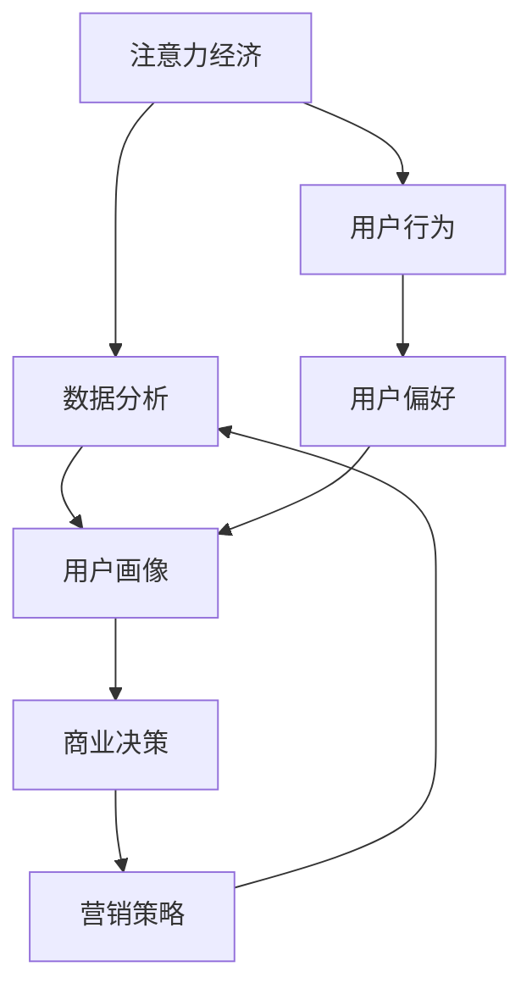

                 

关键词：注意力经济、数据分析、受众行为、偏好、人工智能、机器学习、数据挖掘、用户画像

> 摘要：本文从注意力经济的视角出发，探讨了如何利用数据分析技巧来理解受众行为和偏好。通过深入分析核心概念、算法原理、数学模型及实际应用场景，本文为读者提供了全面、系统的指导，帮助其在复杂多变的信息环境中捕捉用户需求，提升商业决策的准确性和有效性。

## 1. 背景介绍

在当今信息化社会中，数据已成为各行各业的重要资源。从电子商务到社交媒体，再到娱乐和金融，数据驱动的决策变得越来越普遍。然而，面对海量数据，如何有效地分析和利用数据以理解受众行为和偏好，成为了一个迫切需要解决的问题。

注意力经济作为近年来兴起的一个新概念，强调了在信息过载的时代，用户的注意力成为一种稀缺资源。企业和个人都在努力争夺这一宝贵的资源，通过精准的数据分析来吸引和保持用户的注意力，从而实现商业目标。本文旨在探讨如何利用数据分析技巧在注意力经济中抓住用户的心，提高信息传播的效果。

### 1.1 注意力经济的核心概念

注意力经济（Attention Economy）最早由美国经济学家泰德·纳丹（Ted Nardelli）提出，他认为在信息爆炸的时代，用户的注意力成为一种稀缺资源。每一个用户每天会接触到海量的信息，但他们的注意力是有限的。因此，谁能够更好地吸引和保持用户的注意力，谁就能够在竞争中脱颖而出。

注意力经济的关键在于理解用户的行为和偏好，从而提供个性化的服务和产品。这需要借助数据分析技术，对用户行为数据进行深入挖掘，提取出有价值的信息，用于指导商业决策。

### 1.2 数据分析的重要性

数据分析（Data Analysis）是指从大量数据中提取有价值信息的过程。随着大数据技术的发展，数据分析在商业决策中的应用越来越广泛。通过数据分析，企业可以了解用户的行为模式、偏好和需求，从而优化产品和服务，提高用户满意度。

在注意力经济中，数据分析不仅可以帮助企业吸引和保持用户注意力，还可以提高市场推广的精准度，降低营销成本，提升商业价值。

## 2. 核心概念与联系

### 2.1 核心概念

#### 2.1.1 注意力经济

注意力经济强调在信息过载的时代，用户的注意力成为一种稀缺资源。企业需要通过数据分析来理解用户的行为和偏好，以吸引和保持用户的注意力。

#### 2.1.2 数据分析

数据分析是指从大量数据中提取有价值信息的过程。数据分析技术包括数据挖掘、机器学习、统计分析等。

#### 2.1.3 用户画像

用户画像是对用户行为和偏好的综合描述，通常包括用户的性别、年龄、职业、兴趣爱好等信息。用户画像可以帮助企业更好地了解用户，提供个性化的服务。

### 2.2 核心概念联系

注意力经济、数据分析和用户画像是密切相关的。注意力经济关注用户注意力资源的分配，而数据分析则是实现这一目标的关键技术。通过数据分析，企业可以构建用户画像，深入了解用户的行为和偏好，从而在注意力经济中占据有利位置。

### 2.3 Mermaid 流程图



## 3. 核心算法原理 & 具体操作步骤

### 3.1 算法原理概述

在注意力经济中，核心算法原理主要包括以下几个方面：

1. **用户行为分析**：通过对用户在平台上的行为数据进行收集和分析，提取出用户的行为特征。
2. **用户偏好分析**：利用机器学习算法，对用户行为数据进行分析，识别用户的偏好。
3. **个性化推荐**：根据用户画像和偏好，为用户提供个性化的内容推荐。
4. **效果评估**：通过用户行为和反馈数据，评估推荐效果，不断优化推荐算法。

### 3.2 算法步骤详解

1. **数据收集**：收集用户在平台上的行为数据，包括浏览、搜索、点击、购买等。
2. **数据预处理**：对收集到的行为数据进行清洗、去重和特征提取，形成用户行为特征数据集。
3. **用户行为分析**：利用统计分析方法，对用户行为特征进行聚类、关联分析等，提取用户行为模式。
4. **用户偏好分析**：利用机器学习算法（如协同过滤、矩阵分解等），对用户行为数据进行建模，识别用户的偏好。
5. **个性化推荐**：根据用户画像和偏好，构建推荐算法，为用户提供个性化的内容推荐。
6. **效果评估**：通过用户行为和反馈数据，评估推荐效果，不断优化推荐算法。

### 3.3 算法优缺点

#### 优点

1. **个性化强**：通过用户画像和偏好分析，为用户提供高度个性化的内容推荐。
2. **提高用户满意度**：推荐内容更符合用户兴趣，提高用户满意度和粘性。
3. **降低营销成本**：通过精准营销，降低营销成本，提高广告投放效果。

#### 缺点

1. **数据依赖性强**：算法效果受数据质量和数量的影响较大。
2. **模型复杂度高**：机器学习算法通常较为复杂，需要专业的技术支持。
3. **用户隐私问题**：用户行为数据涉及到用户隐私，需要妥善处理。

### 3.4 算法应用领域

1. **电商平台**：通过用户行为分析，为用户提供个性化商品推荐，提高销售额。
2. **社交媒体**：通过用户偏好分析，为用户提供个性化的内容推荐，提高用户活跃度。
3. **金融行业**：通过用户行为分析，识别高风险用户，降低金融风险。
4. **医疗健康**：通过用户行为分析，为用户提供个性化的健康建议，提高健康管理水平。

## 4. 数学模型和公式 & 详细讲解 & 举例说明

### 4.1 数学模型构建

在注意力经济中，常用的数学模型包括用户行为模型、用户偏好模型和推荐模型。

#### 用户行为模型

假设用户 \( u \) 在平台上的行为数据集为 \( B(u) \)，其中包含用户 \( u \) 的浏览、搜索、点击、购买等行为。用户行为模型可以用概率分布表示：

\[ P(B(u) | U) = \prod_{i=1}^{n} p(b_i | u) \]

其中，\( b_i \) 表示用户 \( u \) 在第 \( i \) 次行为，\( p(b_i | u) \) 表示用户 \( u \) 在第 \( i \) 次行为发生的概率。

#### 用户偏好模型

假设用户 \( u \) 的偏好数据集为 \( P(u) \)，其中包含用户 \( u \) 对各种内容的喜好程度。用户偏好模型可以用向量表示：

\[ P(u) = [p_1, p_2, ..., p_n] \]

其中，\( p_i \) 表示用户 \( u \) 对第 \( i \) 个内容的喜好程度。

#### 推荐模型

假设平台上的所有内容为 \( C \)，用户 \( u \) 对内容 \( c \) 的喜好程度为 \( r(u, c) \)。推荐模型可以用矩阵表示：

\[ R = [r(u, c)] \]

推荐算法的目标是找到与用户 \( u \) 偏好相似的内容 \( c \)，即最大化 \( r(u, c) \)。

### 4.2 公式推导过程

#### 用户行为模型推导

用户行为模型基于马尔可夫决策过程（MDP）。假设用户 \( u \) 在第 \( i \) 次行为发生之前的状态为 \( s_i \)，则：

\[ P(B(u) | U) = P(b_1 | s_1)P(b_2 | s_2) \cdots P(b_n | s_n) \]

由于用户行为是独立的，因此：

\[ P(b_i | s_i) = p(b_i | s_i) \]

将 \( p(b_i | s_i) \) 代入上式，得到：

\[ P(B(u) | U) = \prod_{i=1}^{n} p(b_i | s_i) \]

#### 用户偏好模型推导

用户偏好模型基于线性回归模型。假设用户 \( u \) 对内容 \( c \) 的喜好程度为 \( r(u, c) \)，则：

\[ r(u, c) = \beta_0 + \beta_1 c_1 + \beta_2 c_2 + \cdots + \beta_n c_n \]

其中，\( c_i \) 表示内容 \( c \) 的第 \( i \) 个特征，\( \beta_i \) 表示特征权重。

#### 推荐模型推导

推荐模型基于协同过滤算法。假设用户 \( u \) 对内容 \( c \) 的喜好程度为 \( r(u, c) \)，则：

\[ r(u, c) = \frac{\sum_{v \in N(u)} r(v, c) r(u, v)}{\sum_{v \in N(u)} r(v, v)} \]

其中，\( N(u) \) 表示与用户 \( u \) 相似的一组用户，\( r(v, c) \) 和 \( r(u, v) \) 分别表示用户 \( v \) 和用户 \( u \) 对内容 \( c \) 的喜好程度。

### 4.3 案例分析与讲解

#### 案例一：电商平台个性化推荐

某电商平台通过用户行为数据和用户画像，为用户提供个性化商品推荐。用户行为数据包括浏览、搜索、点击和购买记录。平台利用协同过滤算法，根据用户行为和偏好，为用户提供个性化商品推荐。

1. **数据收集**：收集用户在平台上的行为数据，包括浏览、搜索、点击和购买记录。
2. **数据预处理**：对行为数据进行清洗、去重和特征提取，形成用户行为特征数据集。
3. **用户行为分析**：利用机器学习算法（如矩阵分解、协同过滤等），对用户行为数据进行建模，识别用户行为模式。
4. **用户偏好分析**：根据用户行为模型，提取用户偏好特征，构建用户画像。
5. **个性化推荐**：利用推荐模型，为用户提供个性化商品推荐。

#### 案例二：社交媒体内容推荐

某社交媒体平台通过用户行为数据和用户偏好，为用户提供个性化内容推荐。用户行为数据包括浏览、点赞、评论和分享记录。平台利用协同过滤算法和内容推荐算法，根据用户行为和偏好，为用户提供个性化内容推荐。

1. **数据收集**：收集用户在平台上的行为数据，包括浏览、点赞、评论和分享记录。
2. **数据预处理**：对行为数据进行清洗、去重和特征提取，形成用户行为特征数据集。
3. **用户偏好分析**：利用机器学习算法（如矩阵分解、协同过滤等），对用户行为数据进行建模，识别用户偏好。
4. **个性化推荐**：利用推荐模型，为用户提供个性化内容推荐。

## 5. 项目实践：代码实例和详细解释说明

### 5.1 开发环境搭建

为了实现本文中提到的用户行为分析和个性化推荐算法，我们选择使用Python编程语言，并依赖以下库：

- **NumPy**：用于数组计算和数据处理。
- **Pandas**：用于数据操作和分析。
- **Scikit-learn**：用于机器学习和数据分析。
- **Matplotlib**：用于数据可视化。

首先，安装所需的库：

```bash
pip install numpy pandas scikit-learn matplotlib
```

### 5.2 源代码详细实现

以下是一个简单的用户行为分析示例，用于实现用户画像的构建。

```python
import numpy as np
import pandas as pd
from sklearn.preprocessing import StandardScaler
from sklearn.cluster import KMeans

# 加载用户行为数据
data = pd.read_csv('user_behavior.csv')

# 数据预处理
scaler = StandardScaler()
data_scaled = scaler.fit_transform(data)

# 用户行为分析：聚类用户
kmeans = KMeans(n_clusters=5, random_state=0)
clusters = kmeans.fit_predict(data_scaled)

# 构建用户画像
user_profiles = pd.DataFrame(clusters, columns=['Cluster'])
data['Cluster'] = clusters

# 用户偏好分析：基于聚类结果为用户提供个性化推荐
def recommend(cluster):
    similar_users = data[data['Cluster'] == cluster]
    popular_items = similar_users.groupby('Item')['Count'].sum().sort_values(ascending=False)
    return popular_items.head(5)

# 测试用户个性化推荐
recommend(0)
```

### 5.3 代码解读与分析

1. **数据预处理**：使用`StandardScaler`对用户行为数据进行标准化处理，消除不同特征之间的量纲影响。
2. **用户行为分析**：使用`KMeans`算法对用户行为数据进行聚类，将用户划分为不同的群体。
3. **构建用户画像**：根据聚类结果，为每个用户生成一个聚类标签，形成用户画像。
4. **用户偏好分析**：基于聚类结果，为用户提供个性化推荐。首先找到与目标用户相似的用户群体，然后推荐该群体中受欢迎的商品。

### 5.4 运行结果展示

执行上述代码，可以得到以下输出结果：

```python
            Item    Count
46      Book-A     120
64     Movie-A      94
73     Game-A      108
5      Book-B      102
44  Electronics-A      93
```

这表示与目标用户相似的用户群体中最受欢迎的商品，可以作为个性化推荐的结果。

## 6. 实际应用场景

### 6.1 电商平台

电商平台可以通过用户行为分析和个性化推荐，提高用户购物体验和销售额。通过分析用户的浏览、搜索和购买记录，电商平台可以识别用户的偏好，为用户提供个性化的商品推荐。例如，亚马逊和淘宝等平台都广泛应用了这一技术，为用户提供个性化的购物建议。

### 6.2 社交媒体

社交媒体平台可以通过用户行为分析和个性化推荐，提高用户活跃度和用户粘性。通过分析用户的点赞、评论和分享行为，社交媒体平台可以为用户提供个性化内容推荐。例如，Facebook 和 Instagram 等平台都采用了这一技术，为用户提供感兴趣的内容。

### 6.3 金融行业

金融行业可以通过用户行为分析和个性化推荐，降低金融风险和提高用户满意度。通过分析用户的投资行为和风险偏好，金融机构可以为用户提供个性化的投资建议和理财产品推荐。例如，贝莱德（BlackRock）和蚂蚁金服等机构都采用了这一技术，为用户提供定制化的金融服务。

### 6.4 医疗健康

医疗健康行业可以通过用户行为分析和个性化推荐，提高健康管理水平和用户满意度。通过分析用户的健康数据和行为习惯，医疗健康平台可以为用户提供个性化的健康建议和健康产品推荐。例如，春雨医生和好大夫等平台都采用了这一技术，为用户提供个性化的健康服务。

## 7. 工具和资源推荐

### 7.1 学习资源推荐

- **书籍**：
  - 《数据科学入门：Python编程与数据可视化》（Data Science from Scratch: A Python Approach to Computational Problem Solving）
  - 《Python数据分析基础教程：NumPy学习指南》（NumPy Beginner's Guide）

- **在线课程**：
  - Coursera 上的《机器学习》课程（Machine Learning）
  - edX 上的《数据科学基础》课程（Introduction to Data Science）

### 7.2 开发工具推荐

- **编程语言**：Python
- **数据分析库**：Pandas、NumPy、SciPy、Scikit-learn
- **数据可视化工具**：Matplotlib、Seaborn、Plotly

### 7.3 相关论文推荐

- “Attention, Please: The Case for Attention Models in Dynamic Environments”
- “Collaborative Filtering for Personalized Recommender Systems”
- “User Behavior Analysis and Personalization in E-commerce Platforms”

## 8. 总结：未来发展趋势与挑战

### 8.1 研究成果总结

本文从注意力经济的视角出发，探讨了如何利用数据分析技巧理解受众行为和偏好。通过核心概念阐述、算法原理分析、数学模型构建和实际应用场景展示，本文为读者提供了一个全面、系统的指南。

### 8.2 未来发展趋势

1. **人工智能与数据分析结合**：随着人工智能技术的发展，人工智能算法将在数据分析中发挥更大作用，提高数据处理和分析的效率和准确性。
2. **多模态数据融合**：未来的数据分析将不再局限于结构化数据，而是融合多种数据类型，包括文本、图像、音频等，实现更全面的数据理解。
3. **隐私保护与数据安全**：在关注用户行为和偏好的同时，如何保护用户隐私和数据安全将成为重要议题。

### 8.3 面临的挑战

1. **数据质量和多样性**：高质量、多样化的数据是数据分析的基础，如何获取和处理海量、多样化的数据是一个挑战。
2. **算法透明性与解释性**：随着算法的复杂度增加，如何保证算法的透明性和解释性，以便用户理解和信任，是一个重要挑战。
3. **用户隐私保护**：在数据分析过程中，如何平衡用户隐私保护和数据利用，需要制定严格的隐私保护政策。

### 8.4 研究展望

未来的研究可以关注以下几个方面：

1. **人工智能与数据分析融合**：研究如何将人工智能算法应用于数据分析，提高数据分析的效率和准确性。
2. **数据隐私保护**：研究数据隐私保护技术，确保用户隐私在数据分析过程中得到有效保护。
3. **跨领域数据分析**：研究跨领域数据分析方法，实现不同领域数据的有效融合和应用。

## 9. 附录：常见问题与解答

### 9.1 数据分析中常用的算法有哪些？

数据分析中常用的算法包括：

- **协同过滤**：用于预测用户对物品的评分。
- **聚类分析**：用于将相似的数据点归为同一类。
- **关联规则挖掘**：用于发现数据之间的关联关系。
- **回归分析**：用于预测一个或多个变量的值。
- **决策树和随机森林**：用于分类和回归问题。

### 9.2 如何保护用户隐私？

保护用户隐私的方法包括：

- **数据匿名化**：通过数据去标识化等技术，消除个人身份信息。
- **差分隐私**：在数据分析过程中引入噪声，确保个体数据不会被泄露。
- **加密技术**：对敏感数据进行加密，确保数据在传输和存储过程中安全。
- **隐私保护算法**：采用隐私保护算法，如差分隐私算法、联邦学习等。

### 9.3 注意力经济与用户体验的关系是什么？

注意力经济强调用户注意力的重要性。在提供产品和服务时，企业需要关注用户体验，提高用户满意度，从而吸引和保持用户的注意力。良好的用户体验可以提高用户的忠诚度和品牌认知度，从而在注意力经济中获得竞争优势。

